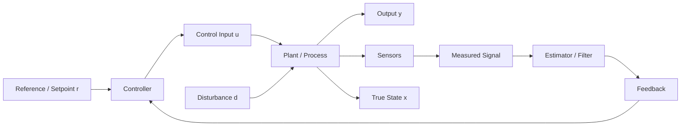
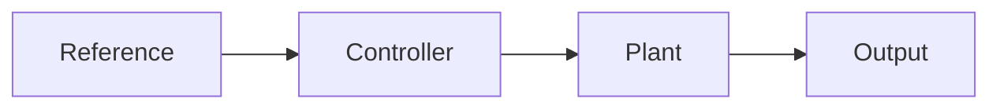
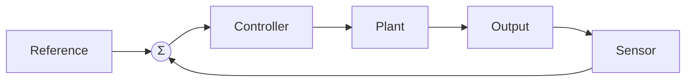
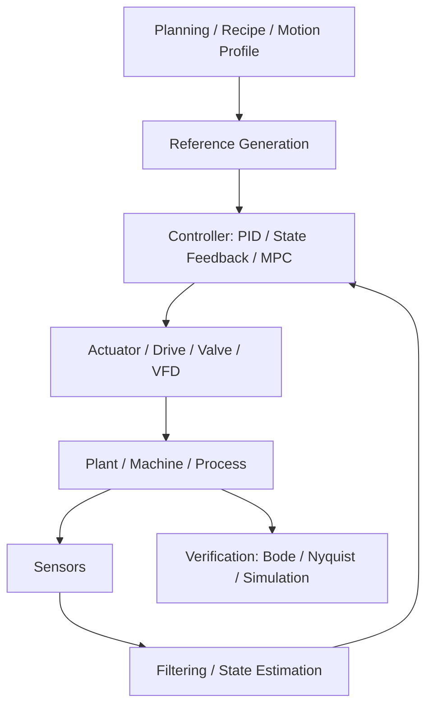
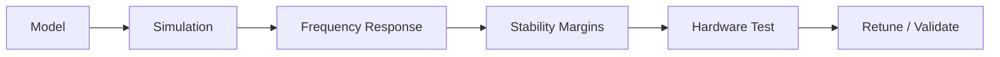

## Why control theory exists

Control theory is the engineering discipline for making a system behave as intended despite disturbance, noise, and model error.

A PID loop is only one layer. This page maps the full workflow — plant, feedback, controller, estimator, and verification — so you can see where each concept fits before going deeper.

## The control loop in one picture

Every element below maps back to a block in this diagram.

---

## Control system at a glance

  

    1 — System
    Plant
    
The physical system being controlled — motor, process, vehicle, or machine axis.

  

  

    2 — Decision
    Controller
    
Computes actuator commands from reference and feedback. PID is one option among many.

  

  

    3 — Perception
    Sensors / Estimator
    
Turn noisy measurements into usable feedback. Not all states are directly measured.

  

  

    4 — Proof
    Verification
    
Check stability, margins, and real-world behavior before commissioning.

  

---

## Open-loop vs closed-loop

### Open-loop

- Command based on model or assumption
- Fast and simple
- No self-correction — weak against disturbance

**Use when:** disturbances are small and the plant model is accurate (e.g. feedforward terms in a combined controller).

### Closed-loop

- Command based on measured response
- Self-correcting against disturbance and model error
- Can improve **or damage** stability if badly designed

**Use when:** disturbance, uncertainty, or safety require verified tracking (nearly all industrial control).

---

## Where PID fits

PID is the most common industrial controller — but it is one block in a larger architecture.

- **Above PID:** recipe management, motion profiles, setpoint scheduling
- **Below PID:** actuator dynamics, drive/VFD response, valve characteristics
- **Beside PID:** state estimation, filtering, feedforward terms
- **After PID:** verification of stability and performance margins

---

## Beyond PID — controller families

| Family | Best for | Typical examples | Industrial use |
|---|---|---|---|
| Classical | Simple loops, machines, process control | PID, lead/lag | Very high |
| State-space | Multivariable and model-based design | Full-state feedback, observer-based control | Medium |
| Robust | Uncertainty-heavy plants | H-infinity, μ-synthesis, ADRC | Medium |
| Adaptive | Changing dynamics | MRAC, gain scheduling | Medium |
| Optimal | Performance tradeoff tuning | LQR | Medium |
| Predictive | Constraints and multivariable control | MPC | High (advanced) |
| Intelligent | Heuristic or learned behavior | Fuzzy, RL | Specialized |

> **Industrial reality:** PID handles the vast majority of single-loop process and machine control. State-space, MPC, and gain scheduling appear in coordinated axes, thermal systems, and advanced process plants.

---

## What the controller really sees

Real controllers act on sensor measurements, not the true plant state. Measurements include noise, bias, and latency.

**Observability** means the controller can reconstruct the internal states it needs from the measurements it has. If a state is not observable, no estimator can recover it.

```mermaid
flowchart LR
    X["True State x"] --> P["Plant"]
    P --> Y["Measured Output y"]
    Y --> N["Noise / Bias"]
    N --> K["Estimator"]
    K --> XH["Estimated State x&#x0302;"]
    XH --> C["Controller"]
```

| Method | When to use |
|---|---|
| Kalman filter | Linear systems with Gaussian noise |
| Particle filter | Nonlinear or non-Gaussian problems |
| Running average | Simple smoothing when no model is needed |
| Luenberger observer | Deterministic state reconstruction from a known model |

---

## How engineers verify control performance

| Tool | What it tells you |
|---|---|
| **Bode plot** | Frequency response — gain margin, phase margin |
| **Nyquist diagram** | Closed-loop stability from open-loop transfer function |
| **Simulation** | Validate response before commissioning |
| **Hardware test** | Confirm behavior under real disturbance, load, noise, and saturation |

> **Rule of thumb:** simulate first, then commission. Retuning on live hardware without simulation is a common source of instability incidents.

---

## References and further reading

### Core theory

| Source | Covers |
|---|---|
| [MIT OCW — Feedback Control Systems (16.30)](https://ocw.mit.edu/courses/16-30-feedback-control-systems-fall-2010/pages/lecture-notes/) | Feedback, state-space, frequency response, estimator framing |
| [Caltech — State Estimation notes (Murray)](https://murray.cds.caltech.edu/images/murray.cds/b/b3/Stateestim.pdf) | Observer and Kalman filter concepts |
| [CMU — State Estimation, Observers, and Kalman Filters](https://www.cs.cmu.edu/~cga/controls-intro-25/lecture6.pdf) | Accessible bridge from control theory to robotics and software |

### Analysis tools

| Source | Covers |
|---|---|
| [MathWorks — Bode Plot documentation](https://www.mathworks.com/help/control/ref/controllib.chart.bodeplot.html) | Frequency response, gain margin, phase margin |
| [MathWorks — Nyquist Plot documentation](https://www.mathworks.com/help/control/ref/nyquistplot.html) | Closed-loop stability from open-loop data |

### Industrial context (this site)

| Topic | Page |
|---|---|
| PID intuition and tuning | [PID Foundation]({{ '/fundamentals/control/pid-foundation/' | relative_url }}) · [PID in Practice]({{ '/fundamentals/control/pid-intuition/' | relative_url }}) |
| Servo and VFD commissioning | [Servo Commissioning]({{ '/implementation/servo-commissioning/' | relative_url }}) · [VFD Commissioning]({{ '/implementation/vfd-commissioning/' | relative_url }}) |
| Safety instrumented systems | [IEC 61511]({{ '/standards/functional-safety/iec-61511/' | relative_url }}) · [IEC 62443]({{ '/standards/cybersecurity/iec-62443/' | relative_url }}) |

---

## Where to go next

| If you want to... | Go to |
|---|---|
| Build PID intuition without heavy math | [PID Control — Intuitive Foundation]({{ '/fundamentals/control/pid-foundation/' | relative_url }}) |
| See P, I, and D terms in practice | [PID Intuition — P, I, and D in Practice]({{ '/fundamentals/control/pid-intuition/' | relative_url }}) |
| Understand industrial PID implementation | [Industrial PID Implementation]({{ '/fundamentals/control/industrial-pid/' | relative_url }}) |
| See loop architecture patterns | [Control Loop Architectures]({{ '/fundamentals/control/control-loop-architectures/' | relative_url }}) |
| Commission a VFD or servo | [VFD Commissioning]({{ '/implementation/vfd-commissioning/' | relative_url }}) · [Servo Commissioning]({{ '/implementation/servo-commissioning/' | relative_url }}) |
| Understand safety instrumented systems | [IEC 61511]({{ '/standards/functional-safety/iec-61511/' | relative_url }}) |

---

  
  <a href="{{ '/fundamentals/control/' | relative_url }}">↑ Control Systems</a>
  <a href="{{ '/fundamentals/control/pid-foundation/' | relative_url }}">PID Control — Intuitive Foundation →</a>

