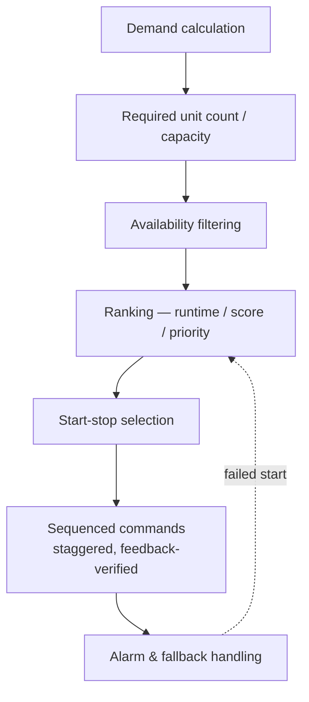

<div class="page-header">
  <span class="page-header__label">PLC Software</span>
  <h1>PLC Algorithms &amp; Equipment Staging</h1>
  <p>Queues, ranking, and the logic that decides how many pumps run and which one starts next — the data-structure side of PLC programming.</p>
</div>

> **Scope.** This page covers application-level algorithms: FIFO queues and
> shift registers for tracking, sorting at PLC scale, and the equipment-staging
> family (lead-lag, demand staging, runtime equalization, sequenced starts,
> failed-start replacement, load shedding). It does not re-teach state-machine
> design, function-block design, or language selection — those live on the
> linked sibling pages. All code fragments are illustrative pseudocode with
> invented tags, not platform code.

## Why data-structure algorithms appear in PLC code

Three plant realities force them in. **Order matters** — the first product onto
the conveyor should be the first one labelled, so something must remember
arrival order. **History matters** — alarms and samples need a bounded memory
of recent events. **Fairness matters** — when three identical pumps share one
duty, running the same pump until it wears out while its twins sit idle is poor
asset management. Queues answer the first two; ranking and staging answer the
third.

## FIFO queues

First In, First Out: the earliest value loaded is the first unloaded. Typical
uses are product and pallet tracking, machine job queues, batch/recipe request
queues, and buffering alarms or barcodes until a downstream system collects
them.

A FIFO is an array plus a write index, a read index, and a count — with the
indexes wrapping at the end of the array, which turns fixed storage into a
**circular buffer** (illustrative — not platform code):

```
IF LoadRequest AND (QueueCount < QueueSize) THEN
    Queue[WriteIndex] := NewValue;
    WriteIndex := WriteIndex + 1;
    IF WriteIndex >= QueueSize THEN WriteIndex := 0; END_IF;
    QueueCount := QueueCount + 1;
END_IF;
```

Guard both ends — a full check on load, an empty check on unload — and drive
both from **one-shot** edges, or one product gets queued three scans in a row.
Most platforms provide this ready-made; named purely as examples: Rockwell's
paired FFL/FFU instructions, Siemens FIFO library blocks for S7-1200/1500, and
Beckhoff ring-buffer function blocks in the TwinCAT libraries. Behaviour
differs per platform — consult your platform's documentation.

When each entry carries more than an ID (recipe, barcode, reject flag,
destination), queue a structured record instead of a bare integer — at which
point Structured Text is normally the clearer tool.

## Conveyor shift registers

When product advances one physical position per encoder pulse or machine cycle,
the array index can *be* the position: every pulse shifts each element one slot
along, a new ID enters at position zero, and whatever falls off the end is the
product arriving at the exit station. Ladder bit-shift instructions handle
single-bit tracking; integer IDs shift with a short copy loop. The shift must
be edge-triggered — a maintained trigger smears the whole array in a few scans.

## Sorting at PLC scale

PLC arrays are small — three to a few dozen equipment items — so algorithmic
efficiency is largely irrelevant and **bubble sort** — a short, easy-to-verify
sort — is the honest workhorse. The refinement that matters more than the
algorithm: **sort an index array and leave the data alone.** Initialize
`Rank[]` to `0..N-1`, then order it by comparing the runtime that each index
points at:

```
IF Pump[Rank[i]].RuntimeHr > Pump[Rank[i+1]].RuntimeHr THEN
    TempIndex := Rank[i];  Rank[i] := Rank[i+1];  Rank[i+1] := TempIndex;
END_IF;
```

`Rank[0]` is now the first-choice pump, while every pump record stays at its
original HMI- and alarm-mapped address.

## The equipment-staging family

The scenario: several similar units — pumps, compressors, chillers, fans,
boilers — share one duty, and the program decides **how many** run and **which
ones**. Every variant chases the same goals: meet demand, balance wear, skip
unavailable units, respect minimum run/stop times, stagger starts, and rotate
the lead role.



### Lead-lag selection by runtime

Among units that are available, unfaulted, and past their minimum off-time,
select the **lowest accumulated runtime** as the next lead. A selection loop in
Structured Text finds the index; Ladder rungs gated on that index issue the
actual start commands and permissives. If no unit qualifies, that is an alarm —
not a silent no-op. This is the pattern behind duty rotation on lead-lag pump
sets — see
[intake and raw water pumping]({{ '/industries/water-wastewater/intake-pumping/' | relative_url }})
for it applied in a water utility.

### Demand-based staging — with anti-hunting

How many units run follows demand (level, pressure, flow, or a PID output).
A constructed teaching example for three pumps — thresholds and times are
examples, not requirements:

| Condition | Action |
|---|---|
| demand above 70 % for 30 s | stage up to 2 pumps |
| demand above 90 % for 30 s | stage up to 3 pumps |
| demand below 75 % for 60 s | stage down to 2 pumps |
| demand below 45 % for 60 s | stage down to 1 pump |

Two protections prevent **hunting**: a **dead-band** (the stage-down threshold
sits well below the stage-up threshold, so normal demand ripple cannot cycle a
pump), and **delays** (an on-delay before staging up, a typically longer
off-delay before staging down). Per-unit minimum run and stop times are the
third layer, protecting the equipment itself.

### Runtime accumulation and equalization

Accumulate runtime while **confirmed running feedback** is true — never from
the start command, which counts hours a failed motor never ran. Make the
accumulator retentive, guard overflow, allow authorized correction after
maintenance, and keep lifetime hours, since-maintenance hours, and a start
counter as separate tags.

Equalization then works both edges: **start the lowest-runtime available unit;
stop the highest-runtime running unit.** Where starts age the machine more than
hours (compressors especially), rank by a **weighted score** of runtime and
start count instead — the weights are engineering judgment per equipment type.

### The selection strategies, compared

| Strategy | Rule | Trade-off |
|---|---|---|
| Runtime lead-lag | Lowest hours starts next | Balances wear; needs trustworthy runtime data |
| Round-robin | Advance the lead index each cycle | Simple; wear balance only approximate |
| First-available | First qualifying unit from index 0 | Trivial; unit 1 wears far faster |
| Fixed lead-lag | Permanent lead/lag/standby roles | Predictable; no automatic balancing |
| Priority-based | Priority group first, runtime within it | Keeps standby/rental units in reserve |
| Capacity-based | Evaluate unit *combinations* vs required capacity | Handles mixed sizes; optimization-grade logic, normally ST or supervisory |

### Sequencing, failure, and shedding

**The staging state machine.** A robust controller does not switch outputs
straight from demand comparisons — it sequences: select → command start → wait
for running feedback → confirm stage, with a fault path from every waiting
state. That is what stops three pumps being commanded in one scan. State-machine
design itself is covered on the
[state machines]({{ '/fundamentals/plc-software/state-machines/' | relative_url }})
page; staging is a disciplined application of it.

**Start-delay sequencing.** Large motors starting together stack inrush.
Stagger the starts, keying each delay from the previous unit's *confirmed
feedback* — so a failed start pauses the sequence instead of piling the next
unit onto a fault.

**Failed-to-start replacement.** No running feedback within the timeout: latch
a failed-to-start alarm, mark the unit unavailable, re-run the selection, and
promote the next-ranked unit. Do not retry the same failed unit in a loop
without a deliberate retry policy.

**Load-shedding queue.** The same machinery in reverse for electrical demand:
shed the lowest-priority load group when demand exceeds a limit, wait and
re-evaluate, shed the next group only if still needed — and restore in reverse
order with delays, so the returning load does not re-trip the limit.

**Alarm queue.** A circular buffer of alarm records in the PLC is legitimate as
a *buffer* — catching bursts until SCADA collects them. It is a poor
*database*: history, sorting, and filtering belong in the SCADA/HMI/historian
layer.

## Ladder or Structured Text — and one function block

For this algorithm family the split is unusually clean: **Ladder** for the
event edges and physical layer (one-shots, permissives, staging timers,
failed-start rungs, output commands — what maintenance troubleshoots live);
**Structured Text** for everything with a loop in it (sorting, ranking,
weighted scores, buffer index math, capacity combinations). The general
language-choice question is on the
[languages overview]({{ '/fundamentals/plc-software/languages-overview/' | relative_url }}) page.

Structurally, put the whole staging brain in **one reusable function block** —
inputs for demand and per-unit status arrays, outputs for start/stop requests
and the selected lead, the filter-rank-select-sequence pipeline inside. One
block means one place to test the rules and one instance per pump station.
Function-block and POU design is covered under
[program structure]({{ '/fundamentals/plc-software/program-structure/' | relative_url }}).

## Related Pages

- [State machines]({{ '/fundamentals/plc-software/state-machines/' | relative_url }}) — the staging sequencer is an application of this pattern
- [Program structure]({{ '/fundamentals/plc-software/program-structure/' | relative_url }}) — POUs and function-block design for the staging block
- [Languages overview]({{ '/fundamentals/plc-software/languages-overview/' | relative_url }}) — the general Ladder/ST/FBD choice
- [Intake and raw water pumping]({{ '/industries/water-wastewater/intake-pumping/' | relative_url }}) — lead-lag pump sets and rotation in a water utility
- [Interlocks, permissives &amp; safety trips]({{ '/fundamentals/control/interlocks-permissives-safety-trips/' | relative_url }}) — the protective layers staging logic sits under
- [Safety application patterns]({{ '/fundamentals/plc-software/safety-application-patterns/' | relative_url }}) — staging never implements the safety function
