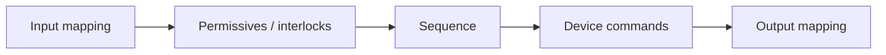

<div class="page-header">
  <span class="page-header__label">PLC Software</span>
  <h1>Ladder Logic Fundamentals</h1>
  <p>The instructions are simple — contacts, coils, timers. What separates a working ladder program from a haunted one is the relationships: evaluation order, one writer per coil, and logic that matches the wiring.</p>
</div>

> **Scope.** The Ladder Diagram element set and the design patterns built from it.
> Language choice lives on the [languages overview]({{ '/fundamentals/plc-software/languages-overview/' | relative_url }}),
> tasks/routines/naming on [program structure]({{ '/fundamentals/plc-software/program-structure/' | relative_url }}),
> sequence design on [state machines]({{ '/fundamentals/plc-software/state-machines/' | relative_url }}).
> Ladder sketches are illustrative ASCII with invented tags, not platform code.

## Rungs, rails, and evaluation

A ladder routine is a stack of **rungs** between two power rails: conditions on
the left, outputs on the right, each rung one Boolean statement. The visual
metaphor is relay-circuit "current flow," but the semantics are a sequential
program — rungs evaluate **top to bottom**, conditions **left to right**, once
per scan (read inputs → execute logic → write outputs → repeat). That sequential
truth drives the scan-order and duplicate-coil behavior further down.

Contacts in **series** are AND; **parallel** branches are OR; they nest, so
`A` in series with a `B`/`C` branch reads `A AND (B OR C)` — the seal-in
circuit below is the classic combined shape.

## The element set, briefly

- **Contacts** — NO `[ Tag ]` is true while the bit is 1; NC `[/ Tag ]` while
  it is 0. Both examine a *bit in memory*, not a physical contact (Rockwell:
  XIC/XIO; mnemonics vary by vendor). A **coil** `( Tag )` writes the rung
  result every scan, true or false; it follows its rung and remembers nothing.
- **Set/reset (latch/unlatch)** — write the bit in one direction only; once set
  it stays set until an explicit reset, on some platforms through a power
  cycle. Legitimate where remembered state is needed — but set and reset live
  on separate rungs, a latch with no reachable reset strands the machine, and a
  retained latch can wake up TRUE at power-up. For run commands, prefer the
  seal-in below.
- **Timers** — measure how long a rung stays true; a done bit asserts at the
  preset. On-delay, off-delay, and retentive reset behavior differs — consult
  your platform's documentation. **Counters** increment on a false→true rung
  transition; a maintained signal needs a one-shot upstream (below).
- **Comparison and math** — turn analog relations into rung conditions
  (`Tank_Level >= 80.0`) and compute values; an unconditioned math rung runs
  every scan.

## The start/stop seal-in circuit

The signature ladder pattern — memory without a latch instruction:

```text
|----[/ Stop_PB ]----[/ Overload ]----+----[ Start_PB ]---+----( Motor_Run )----|
|                                     |                   |
|                                     +----[ Motor_Run ]--+

Motor_Run = NOT Stop_PB AND NOT Overload AND (Start_PB OR Motor_Run)
```

Pressing start makes the rung true and `Motor_Run` sets; on the next scan the
parallel `Motor_Run` contact — the *seal-in* or holding contact — keeps the
rung true after the button is released. A stop or overload breaks the series
chain, the output and its seal branch drop, and the rung stays false until a
fresh start press. Two properties make this the preferred run-command shape:
every condition that can break it is visible on the same rung, and after a
power cycle the coil is false — the motor does not restart itself.

## Physical input vs logical meaning — the NC-wired stop

Stop buttons and most protective contacts are wired **normally closed**: the
healthy circuit holds the input TRUE; a pressed button — or a broken wire —
drives it FALSE. The ladder therefore examines the stop input with a *normally
open instruction* as a run condition. That looks backwards until you see the
point: the wiring **fails toward safe** — a lost terminal or dead sensor supply
is indistinguishable from a pressed stop, and the machine stops. Wired NO
instead, a broken stop wire silently disables the stop while the machine keeps
running. Keep the physical contact type, electrical state, tag value,
instruction type, and process meaning mentally separate — they do not have to
match — and name tags for meaning (`Stop_OK`, `EStop_Healthy`) so the NO
instruction reads correctly. Safety functions proper have requirements beyond
this convention — see the final section.

## Map I/O once, at the edges

Raw hardware addresses belong in exactly two places: an input map at the top of
the program and an output map at the bottom. The logic between works only on
descriptive tags.

```text
Input map:   |----[ Local:1:I.Data.0 ]------( Start_PB )----|
Logic:       |----[ Start_PB ]----[ Stop_OK ]----[/ Motor_Fault ]----( Motor_RunCmd )----|
Output map:  |----[ Motor_RunCmd ]----------( Local:2:O.Data.0 )----|
```

A rewired point becomes a one-line edit, simulation becomes possible, input
conditioning (the NC inversion above, debounce, validity checks) has a defined
home, and troubleshooting splits into "does the field signal reach the tag?"
versus "does the logic use it correctly?". This pairs with the numbered-routine
convention — input map first, permissives/interlocks, sequence, device control,
output map last — described on
[program structure]({{ '/fundamentals/plc-software/program-structure/' | relative_url }}):
the numbering makes routine order, and therefore data-flow order, deliberate.

## A complete simple motor control (constructed teaching example)

Three tags that are not interchangeable: `Motor_RunCmd` records that the PLC
*asked*; `Motor_RunningFB` records that the starter *reports running*; a
current signal can confirm independently. Logic treating the command bit as
proof of running cannot detect a tripped starter or a failed start — and will
sequence downstream equipment onto a stopped machine. Hence the layered shape
most device control is a variation of: permissives → request → command →
feedback verification, one purpose per rung, the command written in exactly one
place. (Permissive/interlock/trip are defined on the
[interlocks page]({{ '/fundamentals/control/interlocks-permissives-safety-trips/' | relative_url }});
this is just the ladder shape.)

```text
Permissives:   |----[ Stop_OK ]----[ EStop_Healthy ]----[ Overload_OK ]----( Motor_Perm )----|

Start request: |----+--[ Manual_Mode ]--[ Start_PB ]------------+----( Motor_Req )----|
               |    |                                           |
               |    +--[ Auto_Mode ]----[ Seq_Start_Request ]---+

Run command:   |----[ Motor_Req ]----[ Motor_Perm ]----( Motor_RunCmd )----|

Failed start:  |----[ Motor_RunCmd ]----[/ Motor_RunningFB ]----[TON StartFail_Tmr  PRE 5s]----|
               |----[ StartFail_Tmr.DN ]-----------------( Motor_FailedToStart )---------------|
```

The timer tolerates normal contactor pull-in time; its done bit means the
command went unanswered too long — typically dropping the request and requiring
an operator reset.

## Scan order, and one writer per coil

**Rung order matters.** A rung that writes `Run_Request` above the rung reading
it gives same-scan response; reversed, the reader reacts one scan late — often
harmless, until the delayed bit is a one-shot edge or cross-ordered rungs stack
multi-scan delays. The defense is direction: order logic so data flows
downhill, producers before consumers.



**One coil, one writer.** A coil writes its bit every scan — true *or* false —
so the same coil on two rungs means the later rung silently decides ("last
write wins"): `Auto_Start` true on one rung, `Manual_Start` false on a later
one, and the motor stays off while monitoring shows a true rung feeding a false
coil. This is a defect, not a style choice: merge the conditions into parallel
branches on a request tag and keep one primary write per command output.
(Latch/unlatch pairs intentionally split one bit across two rungs — the rule
targets unintended duplicates.)

## One-shots, and values that survive a power cycle

A **one-shot** is true for a single scan on a false→true transition — it turns
a *level* into an *event*. A part sensor held 500 ms against a 10 ms scan is
true for ~50 scans; a level-driven counter counts 50. One-shots are required
wherever something must happen once per occurrence — counting, toggle buttons,
pulse commands, log triggers, state transitions; the missing-one-shot symptom
is typically "it happened N times instead of once."

**Retentive** values survive a power cycle; non-retentive values reinitialize —
which behavior a tag or timer has is platform configuration, so check rather
than assume. Retention suits totals, runtime hours, recipes, and calibration;
it is dangerous for commands and sequence state, which can wake the machine
"mid-cycle" in a world that no longer matches. A first-scan routine should
validate retained data and force commands and state to a safe default.

## Alarm conditioning and analog scaling

A bare comparison makes a chattering alarm. Condition it twice: an **on-delay**
so the condition must persist before asserting, and **hysteresis** — assert
above one value, clear below a lower one (in at 80 °C, out at 77 °C) — so a
signal hovering at the threshold cannot cycle it. A complete alarm adds
acknowledgment as a deliberate operator action, distinct from the condition
clearing.

Analog inputs arrive as raw counts and are converted by linear interpolation —
`EU = (Raw − RawMin) × span ÷ rawSpan + EUMin` — in the input-mapping section,
so the rest of the program only sees engineering units; in ladder that is a
compute rung or a vendor scaling instruction (the same algorithm appears as
Structured Text on the
[languages overview]({{ '/fundamentals/plc-software/languages-overview/' | relative_url }})).
Raw endpoints come from the module configuration, not guesswork — and the map
should also qualify the signal (under/over-range, which on a 4–20 mA loop can
indicate an open circuit; channel faults) so nothing controls from a broken
sensor.

## Common ladder design mistakes

1. **HMI-only interlocking** — the action still fires from another screen or a
   comms write. Root cause: rule enforced in the presentation layer, not the PLC.
2. **One coil written from multiple rungs** — a visibly true rung whose output
   stays off. Root cause: last-write-wins coil semantics.
3. **Command treated as feedback** — sequences advance onto equipment that did
   not start. Root cause: no independent running signal, or one ignored.
4. **Counting without a one-shot** — counts inflated by orders of magnitude.
   Root cause: level-driven counters increment every scan, not per event.
5. **Latches without a dependable reset** — a state no operator action can
   leave, or a command reappearing at power-up. Root cause: set/reset split
   across the program; retention not considered.
6. **First-scan behavior ignored** — spurious alarms or unexpected commands at
   power-up. Root cause: retained data and state assumed to self-initialize.
7. **Monolithic rungs** — hours to trace one fault. Root cause: no
   one-rung-one-purpose discipline, no named intermediate tags.
8. **Raw addresses scattered through the logic** — a module swap becomes a
   program-wide edit. Root cause: no mapping layer at the edges.
9. **Undefined abnormal behavior** — nobody can say what happens on comms loss,
   sensor failure, or restart until it happens. Root cause: only the sunny-day
   path was designed.

## Where ladder logic stops: safety functions

Standard ladder in a standard PLC is not adequate protection for hazardous
machinery on its own. Emergency stops, guard monitoring, and light curtains
normally require safety-rated hardware and architecture — safety controller or
relay, dual channels with discrepancy monitoring, monitored manual reset —
designed to the applicable PL or SIL. The standard program may *read* safety
status for sequencing and display; it does not implement or bypass the safety
function. See [safety application patterns]({{ '/fundamentals/plc-software/safety-application-patterns/' | relative_url }})
and [safety circuit wiring]({{ '/design/wiring/safety-circuit/' | relative_url }}).

## Related Pages

- [Languages overview]({{ '/fundamentals/plc-software/languages-overview/' | relative_url }}) — the five IEC 61131-3 languages and when LD fits
- [Program structure]({{ '/fundamentals/plc-software/program-structure/' | relative_url }}) — tasks, routines, scope, naming, and the scan model
- [State machines]({{ '/fundamentals/plc-software/state-machines/' | relative_url }}) — sequence design, including the latched-ladder step pattern
- [Safety application patterns]({{ '/fundamentals/plc-software/safety-application-patterns/' | relative_url }}) — why safety functions live elsewhere
- [Interlocks, permissives &amp; safety trips]({{ '/fundamentals/control/interlocks-permissives-safety-trips/' | relative_url }}) — the three protective layers, defined
- [Safety circuit wiring]({{ '/design/wiring/safety-circuit/' | relative_url }}) — the wired side of the stop function
