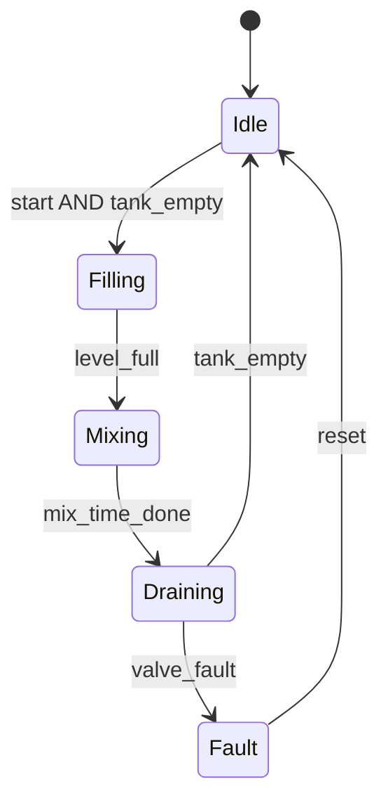

<div class="page-header">
  <span class="page-header__label">PLC Software</span>
  <h1>IEC 61131-3 Programming Languages Overview</h1>
  <p>One standard, five languages, and the engineering judgement of which to reach for — plus the shared model that lets you mix them in one project.</p>
</div>

> **Scope.** This page teaches the model IEC 61131-3 defines and how to choose a
> language. It is not a syntax reference and does not reproduce the standard's
> grammar. Every platform implements a partial, extended subset of the standard —
> for what your controller actually supports, consult your platform's
> documentation.

## What IEC 61131-3 is

IEC 61131-3 is the international standard for programmable-controller
programming languages — Part 3 of the IEC 61131 series. Before it, every vendor
shipped its own incompatible logic dialect. The standard defined a **common
model**: shared data types, a variable and POU concept, and a defined set of
languages, so the same concepts carry across platforms even when the tools
differ.

Two cautions run through everything below:

- **The standard defines a model; vendors implement it partially.** Rockwell
  Studio 5000, Siemens TIA Portal (with SCL as its Structured-Text language),
  CODESYS, and Beckhoff TwinCAT all claim IEC 61131-3 lineage, yet differ in
  data types, timer behaviour, and which languages ship. Conformance is
  platform-specific — verify against your toolchain.
- **Portability is at the level of concepts and structure, not copy-paste
  code.** A well-structured program moves between platforms far more easily than
  a badly structured one — rarely without edits, but the design survives.

## The five languages

The standard defines four core languages plus one graphical structuring element
(SFC), usually counted together as five. Each fills a different niche.

### Ladder Diagram (LD)

Graphical, drawn as rungs between two power rails — the direct descendant of
hard-wired relay logic, with contacts and coils. Its home is **discrete boolean
logic**: interlocks, permissives, motor start/stop seals, combinational safety
logic. Its defining virtue is that a maintenance electrician can read it at 3
a.m. without being a programmer. It is weak for math, loops, and data
handling, which force awkward embedded blocks onto the rung.

### Function Block Diagram (FBD)

Graphical, drawn as blocks wired together by signal lines — it reads like a
signal-flow or P&ID sketch. Its home is **analog and process logic**: PID
loops, filters, and anywhere you assemble reusable blocks into a data path.
Because a block is a black box with defined pins, FBD encourages reuse. Dense
sequential or heavily conditional logic turns into a tangle of wires — that is
its weak side.

### Structured Text (ST)

Textual and Pascal-like — a high-level language. Its home is **algorithms**:
math, loops, string and array handling, state machines, recipe and data
manipulation, anything with real conditional depth. It is compact and
version-control-friendly. The trade-off is readability for non-programmers: a
technician who reads ladder fluently may not read ST, so teams weigh who
maintains the code before committing logic to it.

A few illustrative lines (concept only — real syntax and types are
platform-specific):

```
(* illustrative ST — scale a raw analog input to engineering units *)
IF raw >= raw_min THEN
    scaled := (raw - raw_min) * span / raw_span + eu_min;
ELSE
    scaled := eu_min;
END_IF;
```

### Sequential Function Chart (SFC)

A graphical structuring language for **sequential processes**. It is expressed
as **steps** — what is active right now — joined by **transitions**, the
conditions that advance to the next step. Actions attach to steps, and each
step's logic is written in one of the other languages. SFC is ideal for batch
sequences, start-up and shutdown routines, and any "do A, then when X do B"
process; it makes the sequence visible and maps naturally onto a state-machine
design.



Each box is a **step**; each labelled arrow is a **transition** condition. SFC
structures the sequence — you still write each step's body in LD, FBD, or ST.

### Instruction List (IL)

Textual, low-level, assembler-like — load / store / operate on an accumulator.
It was used historically for compact, tightly optimised code. **IL was
deprecated in the 3rd edition (IEC 61131-3:2013)** and is being phased out by
vendors; write new code in Structured Text instead. Recognise IL in legacy
programs, but do not start new work in it.

## The common elements model

Underneath all five languages sits one shared model — the reason a variable or
data type means the same thing whether you draw it or type it:

- **Data types** — elementary types (BOOL, INT, REAL, TIME, STRING, …) plus
  user-defined and structured types. Exact widths and available types vary by
  platform.
- **Variables** — declared with a scope and optional initial value, referenced
  by symbolic name rather than tied to a raw memory address.
- **POUs (Program Organization Units)** — Programs, Function Blocks, and
  Functions: the containers logic lives in, independent of the language that
  fills them. These get their own treatment in
  [Program structure]({{ '/fundamentals/plc-software/program-structure/' | relative_url }}).

Because the model is shared, the languages interoperate: an FBD network can call
an ST function, and an SFC step's action can be a ladder rung.

## Mixing languages — right tool per task

Real projects are multilingual by design, and the language choice is
**per-POU** (often per-action), not per-project. A common pattern:

- **SFC** for the overall sequence skeleton,
- **LD** for interlocks and I/O-facing boolean logic,
- **FBD** for the analog and PID path,
- **ST** for calculations, data handling, and complex state logic.

The discipline is to pick per task and stay consistent within a module — not to
prove you can use all five. Weigh maintenance too: if night-shift electricians
own first-line support, keep their interlocks in ladder even where ST would be
terser.

## Choosing — quick guide

| Language | Best for | Readability | Avoid for |
|---|---|---|---|
| **LD** | discrete / interlock / boolean logic | high for electricians | math, loops, data handling |
| **FBD** | analog / process, PID, reusable blocks | high for signal-flow | dense sequential / conditional logic |
| **ST** | algorithms, math, loops, strings, data | high for programmers | teams with no text-code skills |
| **SFC** | step / sequence processes | high for sequences | continuous / combinational logic |
| **IL** | legacy only (deprecated 3rd ed.) | low | any new development |

## Related Pages

- [Structuring PLC programs — POUs, tasks, and scope]({{ '/fundamentals/plc-software/program-structure/' | relative_url }})
- [PLC state machines]({{ '/fundamentals/plc-software/state-machines/' | relative_url }}) — structured sequential design layered onto SFC and ST
- [Machine state model]({{ '/fundamentals/control/machine-state-model/' | relative_url }}) — finite-state control design
- [Python engineering toolkit]({{ '/tools/engineering-toolkit/' | relative_url }}) — tag database and IEC 61131-3 identifier-rule tooling
- [Fundamentals]({{ '/fundamentals/' | relative_url }})
