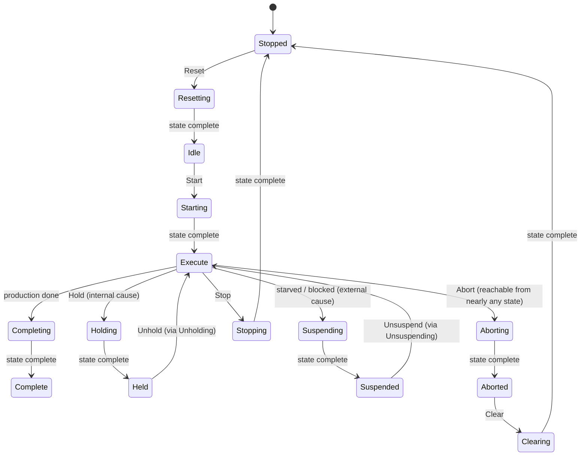
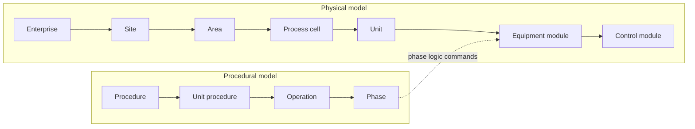

<div class="page-header">
  <span class="page-header__label">PLC Software</span>
  <h1>PackML, ISA-88 &amp; ISA-95</h1>
  <p>The standards that organize machine behavior above the code — states and modes the line can read, equipment decomposed by discipline, and a defined boundary to the business systems.</p>
</div>

> **Scope.** What PackML (ISA-TR88.00.02), ISA-88, and ISA-95 each
> standardize, how they relate, and where they meet the PLC program — at
> concept level: no state-transition tables, PackTag lists, or standards text
> are reproduced. State-machine *implementation* is covered on the
> [state machines]({{ '/fundamentals/plc-software/state-machines/' | relative_url }})
> page; state-model *theory* on the
> [machine state model]({{ '/fundamentals/control/machine-state-model/' | relative_url }}) page.

## PackML — the standardized machine shell

None of these three documents is a programming language, and none tells you
how to write a rung — they standardize the layer above the code: PackML the
machine's operating condition as the line sees it, ISA-88 the decomposition of
equipment and procedures, ISA-95 the information exchanged with the business.

PackML originated with OMAC and is published by ISA as technical report
**ISA-TR88.00.02** — the current revision is the 2022 edition, titled
*Machine and Unit States: An Implementation Example of ISA-88.00.01*. The
title says a lot: it is an implementation example **of ISA-88 concepts**,
applied to discrete automated machines. It is also available as an OPC UA
companion specification (**OPC 30050**, OPC UA for PackML). Its purpose is
machine-to-machine and machine-to-line interoperability: every conforming
machine — filler, capper, case packer, from three different builders —
presents the same states, modes, and tag structure to the line controller and
the OEE system.

### The state model

PackML states divide into **wait states** (stable — Stopped, Idle, Held,
Suspended, Complete, Aborted) and **acting states** (transitional — Starting,
Holding, Stopping, Aborting, Clearing, Resetting and friends, plus Execute,
the acting state where production happens). An acting state does defined work
and then declares **state complete**, which drives the transition onward;
external commands (Start, Stop, Hold, Abort, Reset…) move the machine between
wait states via the appropriate acting state. Simplified:



The **Held versus Suspended** distinction carries the OEE meaning: Held is an
internal pause (the machine or its operator interrupted production), Suspended
an external one (starved upstream or blocked downstream — the machine itself
is healthy and waiting). That is what lets line supervision attribute downtime
to the right machine. The full state set and transition matrix are defined in
the technical report — consult it for the normative picture.

### Unit modes and PackTags

Modes set the rules the state model runs under: the common base set is
**Production**, **Maintenance**, and **Manual**, with machine-specific modes
(cleaning, calibration) permitted. Each mode may use a subset of the state
model, and mode changes are normally accepted only in defined states — not
mid-Execute. Which states allow a mode change is a documented design decision.

PackTags standardize the machine's data interface in three groups: **Command**
tags (to the machine — mode/state commands, speed setpoint, product
selection), **Status** tags (from the machine — current mode, state, speed),
and **Admin** tags (accumulated data — production and reject counts, alarm and
stop-reason information that feeds OEE). The value is uniformity across
vendors. The tag list itself lives in the technical report and OPC 30050;
most platforms offer PackML libraries with the structures ready-made.

## PackML does not replace the machine's own sequence

The most common misunderstanding: `Execute` is one state in the model, and
everything the machine actually does — clamp, index, fill, seal, inspect —
is the machine's own production sequence running **inside** Execute. PackML
answers *what overall condition is the machine in*; the sequence answers
*what operation is it performing*. Two state machines, layered: the PackML
shell for coordination, the production sequence for work — ordinary
step/transition/action design, covered on the
[state machines]({{ '/fundamentals/plc-software/state-machines/' | relative_url }}) page.

A sketch of the dispatch layer (illustrative — not platform code; constructed
teaching example; real projects normally start from a vendor or OMAC library):

```
CASE UnitState OF
  PACKML_STARTING:
    StartupProcedure();                     (* acting state does work... *)
    IF StartupProcedure.Done THEN           (* ...state complete... *)
      UnitState := PACKML_EXECUTE;          (* ...drives the transition *)
    END_IF;
  PACKML_EXECUTE:
    ProductionSequence();                   (* the machine's real work *)
    IF ProductionSequence.OrderDone THEN UnitState := PACKML_COMPLETING;
    ELSIF Cmd.Hold THEN UnitState := PACKML_HOLDING;
    ELSIF UpstreamStarved OR DownstreamBlocked THEN UnitState := PACKML_SUSPENDING;
    ELSIF Cmd.Stop THEN UnitState := PACKML_STOPPING;
    END_IF;
END_CASE;
(* Abort is evaluated with priority outside the CASE — it wins from nearly any state *)
```

Each acting state calls its own procedure and watches for completion. If an
acting state has no statable Done condition, its design is not finished.

## ISA-88 — physical and procedural models

ISA-88 (batch control) is the parent framework PackML borrowed from. Its two
central models:



A **control module** is the smallest controllable device plus its immediate
logic (a motor with start/stop/feedback/fault handling); an **equipment
module** coordinates control modules into a process function (a feed conveyor,
an agitation module). On the procedural side, a **phase** ("add water", "heat
to setpoint") is where recipe logic meets equipment logic — and because recipe
and equipment are separated, one unit runs many recipes. Even outside batch
plants, the equipment-module/control-module split is a program-organization
discipline worth adopting: the sequence commands equipment modules, equipment
modules command control modules, and the sequence does not reach down to
individual motors and valves — in POU terms, the layering described in
[program structure]({{ '/fundamentals/plc-software/program-structure/' | relative_url }}).

**PackML versus ISA-88** in one line: ISA-88 targets batch and procedural
processes with a comprehensive recipe model; PackML applies its state and
equipment discipline to discrete machines with a lighter product/parameter
interface. **ISA-TR88.95.01** (*Using ISA-88 and ISA-95 Together*) is ISA's
guidance on joining the equipment-level models to ISA-95 above them.

## ISA-95 — the enterprise boundary

ISA-95 (published internationally as IEC 62264) defines integration between
manufacturing control and business systems across the familiar level model:
level 4 (ERP and business planning), level 3 (MES / manufacturing operations
management), level 2 (supervisory control), level 1 (basic control), level 0
(the physical process). Two clarifications matter. First, ISA-95 defines
**information models and exchanges** — production schedules, production
performance, material, equipment, personnel, and quality information — not
PLC code structure. Second, it is an information and responsibility hierarchy,
not automatically a network topology, though it strongly shaped
network-segmentation practice. In this site's terms, ISA-95 governs the top of
the [machine architecture model]({{ '/design/architecture/machine-architecture-model/' | relative_url }}) —
the layer where the machine meets MES and ERP. A PackML machine's PackTags
amount to a ready-made level-2-to-level-3 data contract, which is why the two
standards so often travel together on packaging lines.

## Industry notes

**Pharmaceutical.** Pharma layers regulation over the same architecture:
ISA-88 organizes equipment and recipes; **GAMP 5** supplies a risk-based
validation lifecycle for computerized systems, including its category-based
view of how much rigor each software element warrants; **FDA 21 CFR Part 11**
governs electronic records and signatures when required records are kept
electronically — reaching into batch reporting, audit trails, and operator
authentication. The architecture is standard ISA-88; the regulatory layer
changes how it is specified, verified, and documented.

**Semiconductor.** Semiconductor tools need two software organizations: the
internal equipment control (ordinary state-machine sequencing) and the factory
host interface standardized by SEMI **SECS/GEM** (GEM300 for 300 mm fabs) —
states, events, alarms, data, and remote commands reported to the host. It is
the same "standard outer interface, private inner sequence" pattern as PackML,
in a different industry's vocabulary — see
[semiconductor control philosophy]({{ '/industries/semiconductor/facility/control-philosophy/' | relative_url }})
for the facility-side context.

## The safety boundary

PackML's Stopped and Aborted are **coordination states, not safety
functions**. Emergency stop, guard interlocking, and safe torque off live in
the safety-related parts of the control system, designed to ISO 13849-1 or
IEC 62061 and kept separate from the standard controller — see
[safety application patterns]({{ '/fundamentals/plc-software/safety-application-patterns/' | relative_url }}).
The safety system removes hazardous energy; the standard controller observes
that it has done so, transitions to Aborting/Aborted, and reports diagnostics
— it describes the consequence, and is never the protective mechanism.

## Related Pages

- [Machine state model]({{ '/fundamentals/control/machine-state-model/' | relative_url }}) — state-model theory (FSM, hierarchical, PackML compared)
- [State machines in PLC programs]({{ '/fundamentals/plc-software/state-machines/' | relative_url }}) — implementing the sequences PackML wraps
- [Program structure]({{ '/fundamentals/plc-software/program-structure/' | relative_url }}) — POUs and tasks; where the module layering lives
- [Languages overview]({{ '/fundamentals/plc-software/languages-overview/' | relative_url }}) — the IEC 61131-3 languages these models are built from
- [Safety application patterns]({{ '/fundamentals/plc-software/safety-application-patterns/' | relative_url }}) — why safety stays out of the state model
- [Machine architecture model]({{ '/design/architecture/machine-architecture-model/' | relative_url }}) — the 7-layer view; ISA-95 at the top
- [Semiconductor control philosophy]({{ '/industries/semiconductor/facility/control-philosophy/' | relative_url }}) — SECS/GEM context
