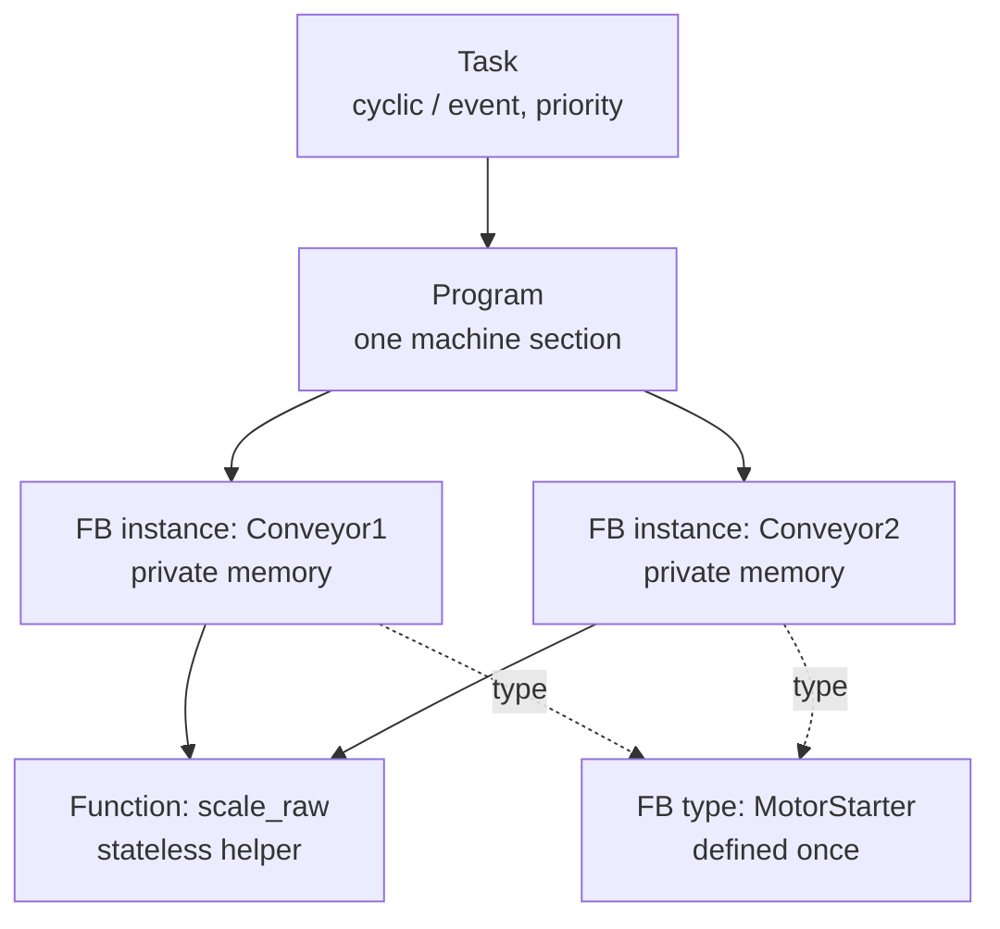

  PLC Software
  <h1>Structuring PLC Programs — POUs, Tasks, and Scope</h1>
  
The containers logic lives in, how often they run, and what can see what — the structure decisions that decide whether a program survives commissioning and years of modification.

> **Scope.** This page teaches the IEC 61131-3 structuring model and the design
> habits around it. Scope keyword names, task scheduling, and watchdog behaviour
> are platform-specific — consult your platform's documentation for the actual
> guarantees. Language choice is covered separately in
> [Languages overview]({{ '/fundamentals/plc-software/languages-overview/' | relative_url }}).

## The POU model

IEC 61131-3 organises logic into **Program Organization Units (POUs)**. There
are three kinds, distinguished mainly by whether they carry memory between
executions.

- **Function** — *stateless*. Given the same inputs it always returns the same
  output and holds no memory between calls. Use it for pure calculations:
  scaling, unit conversion, a math helper.
- **Function Block (FB)** — *stateful and instantiated*. The FB is a **type**
  (the definition); each place you use it is an **instance** with its own
  private memory that persists across scans. A timer, a PID controller, a
  motor-starter block — each instance remembers its own state.
- **Program** — the top-level organising POU. It wires FB instances and logic
  together and is assigned to a task for execution.

The **type/instance** distinction is the crux of reuse: define an FB once
(`MotorStarter`), instantiate it many times (`Conveyor1`, `Conveyor2`), fix a
bug in the type, and every instance inherits the fix. Copy-pasted logic gives
you none of that — it multiplies every future bug fix by the number of copies.

## Variable scope

Every variable is declared in a scope. The common scopes (keyword names vary by
platform):

- **Input** — passed in to a POU; read-only inside it.
- **Output** — computed inside, readable by the caller.
- **In-out** — passed by reference; the POU reads and writes it.
- **Local** — private to the POU. For an FB, private to each instance and
  retained across scans.
- **Temp** — scratch, valid only within a single execution.
- **Global** — visible everywhere in the project.

**Globals are a maintenance trap.** A global can be written from anywhere, so
when its value is wrong you have no bounded list of suspects — the whole program
is in scope. Globals also defeat reuse (an FB that reaches out to a global is no
longer self-contained) and they hide data flow. Prefer passing data through
inputs and outputs, so a POU's dependencies are visible at its interface.
Reserve globals for genuinely system-wide state — a plant-wide E-stop status,
say — and keep that list short and documented.

## Tasks and execution

A **task** decides when and how often a program runs. The standard's model
provides:

- **Cyclic / periodic** — run every N milliseconds; the workhorse for most
  control.
- **Event / interrupt** — run in response to an event or condition.
- **Priority** — a higher-priority task can pre-empt a lower one, so
  time-critical logic runs on a fast, high-priority task and slow housekeeping
  on a slower one.

Underneath sits the **scan cycle**: read inputs → execute logic → update
outputs, repeated. Scan time is the loop period, and the logic must comfortably
finish within its task interval or the task overruns.

**Standard model vs vendor reality.** The task and priority *concepts* are
defined by IEC 61131-3, but how many tasks you get, their scheduling, watchdog
behaviour, and exactly when I/O is updated are platform-specific — Rockwell's
continuous/periodic/event tasks, Siemens organisation blocks (OBs), CODESYS
tasks, and TwinCAT tasks all differ. Consult your platform's documentation for
the scheduling guarantees; never assume one vendor's timing model on another.

## Modular, reusable design

- **The FB is the unit of reuse.** A well-made function block has a clean
  interface — clear inputs and outputs, no reach-out to globals — and
  encapsulates one responsibility: one valve, one starter, one loop. Build a
  small library of proven blocks and assemble machines from them.
- **Instance vs type, again.** Reuse the *type*; give each *instance* a
  meaningful name and its own I/O mapping.
- **One machine section per program.** Map the software structure onto the
  physical machine — infeed, main, outfeed, utilities — so a commissioning
  engineer can find the logic for a jammed conveyor without a site map.

## Naming conventions and the tag database

Consistent naming is what makes a large program navigable. IEC 61131-3
constrains **identifiers** — letters, digits, and underscores; no leading digit;
no spaces or reserved words (details vary by platform). On top of that, adopt a
project convention: area and function prefixes, instance names that match the
P&ID or electrical tag, and a documented pattern for I/O.

The **tag database** is the single source of truth for symbolic names, data
types, and I/O addresses. Keeping it clean — no duplicate tags, no address
conflicts, valid identifiers — pays back at every modification. The
[Python engineering toolkit]({{ '/tools/engineering-toolkit/' | relative_url }})
helps here: `cst io-check` validates I/O lists for duplicate tags and address
conflicts, and `cst tags-from-io` generates a tag database under IEC 61131-3
identifier rules.

## Structuring for maintainability and commissioning

- Clear, one-to-one **I/O mapping**, documented alongside the program.
- Each program self-contained enough to be **tested in isolation** during
  commissioning.
- Faults and diagnostics surfaced **per module**, not buried in globals.
- Sequential logic given explicit structure rather than a sprawl of boolean
  flags — see the [machine state model]({{ '/fundamentals/control/machine-state-model/' | relative_url }}),
  which layers a finite-state design onto SFC and ST.

## Related Pages

- [IEC 61131-3 languages overview]({{ '/fundamentals/plc-software/languages-overview/' | relative_url }})
- [PLC state machines]({{ '/fundamentals/plc-software/state-machines/' | relative_url }}) — structured sequential design
- [Machine state model]({{ '/fundamentals/control/machine-state-model/' | relative_url }}) — finite-state control design
- [Python engineering toolkit]({{ '/tools/engineering-toolkit/' | relative_url }}) — I/O validation and tag-database tooling
- [Fundamentals]({{ '/fundamentals/' | relative_url }})
