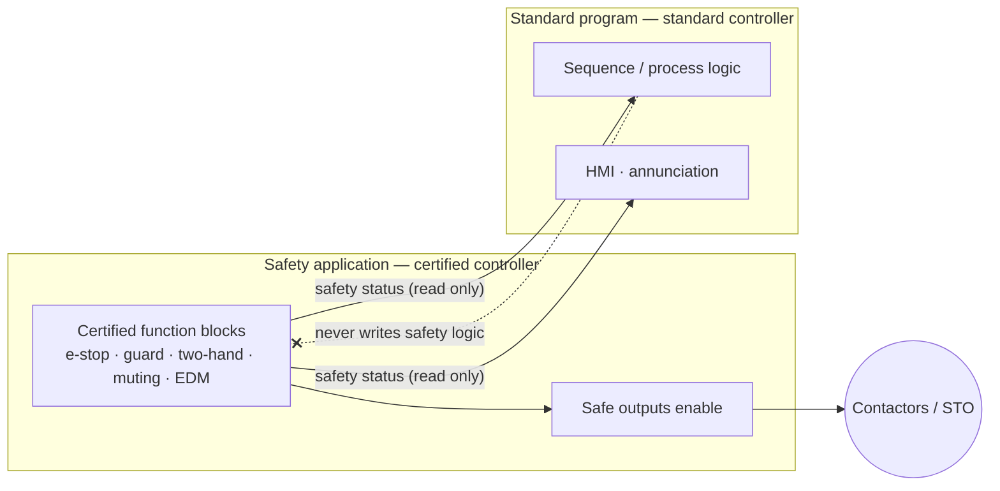

  PLC Software
  <h1>Safety Application Patterns in PLC Software</h1>
  
How safety application software is structured — separate, small, and traceable — on a safety-rated controller with a certified toolchain.

> **Read this first.** Safety application software is governed by the
> functional-safety standards —
> [ISO 13849-1]({{ '/standards/functional-safety/iso-13849-1/' | relative_url }}),
> [IEC 62061]({{ '/standards/functional-safety/iec-62061/' | relative_url }}),
> [IEC 61508]({{ '/standards/functional-safety/iec-61508/' | relative_url }}) — and
> it runs on a **safety-rated controller with a certified toolchain**. This page
> covers **patterns and structure**, not how to achieve a required Performance
> Level or Safety Integrity Level. The PL/SIL comes from the risk assessment, the
> [Safety Requirements Specification]({{ '/lifecycle/safety-requirements-spec/' | relative_url }}),
> and the safety platform's **certified function blocks** — never from a coding
> style. Nothing here substitutes for the safety lifecycle.

## Standard PLC vs safety PLC and the safety application

A standard PLC runs the machine's sequence and process logic. A **safety PLC**
— or safety controller, or safety relay — is a separately certified device: a
redundant internal architecture with continuous self-diagnostics and a certified
programming environment. The **safety application** is the program that runs
inside that certified environment.

The line between them is a design rule, not a preference:

- The **safety application** implements the safety functions — e-stop, guard
  monitoring, two-hand control, muting, safe stop.
- The **standard logic** may *read* the safety system's status to update the HMI,
  drive the sequence, or annunciate a trip — but it never *implements* a safety
  function.

The moment a safety function depends on a rung in the standard program, the
certification is defeated. That is the first and worst anti-pattern, and the rest
of this page is really about not committing it.

Data crosses the boundary in one direction only: safety status flows **out** to
the standard program; the standard program never reaches **in** to change safety
behavior.

## Keep the safety application separate and simple

The safety program should be **small, separate, and boring**. It does one thing —
evaluate the defined safety functions — and it is reviewed line by line.
Complexity is the enemy of verifiability: every extra condition is something a
reviewer and a validator must reason about and re-check on every change.

In practice:

- The safety program is physically separate from the standard program — a
  separate task, a separate device, or the platform's safety partition (Rockwell
  GuardLogic, Siemens F-runtime, CODESYS Safety, Pilz, and others each do this
  differently — consult your platform's documentation).
- It contains **only** safety logic. Sequencing, HMI formatting, and production
  logic stay in the standard program, where they belong.
- The standard program reads safety status; it does not implement the safety
  function. The machine sequence that reads that status is an ordinary
  [state machine]({{ '/fundamentals/plc-software/state-machines/' | relative_url }}).

## The certified function-block approach

Safety platforms ship **certified function blocks** for the recognized safety
functions — an e-stop block, a guard-monitoring block, a two-hand block, a muting
block, and blocks that handle **EDM** (external device monitoring: the feedback
that proves the final contactors actually dropped out). **Use them.** Do not
build your own safety logic out of ordinary contacts and coils — the certified
block carries the verification, the diagnostic coverage, and the defined fault
reaction that a hand-rolled equivalent does not, and those are exactly what the
PL/SIL claim rests on.

Each block maps directly onto the wiring:

- Dual-channel e-stop and guard inputs land on safety inputs; the e-stop or guard
  FB evaluates channel agreement and discrepancy timing.
- The FB's output enables the safe outputs — safety-rated outputs, redundant
  contactors, or a drive's STO.
- EDM feedback from the contactors' mirror contacts returns to an input the FB
  monitors before it will permit a reset.

The function block and the wiring are two halves of one safety function — the
wired half (dual-channel inputs, redundant outputs, STO, EDM, monitored reset) is
covered in
[safety circuit wiring]({{ '/design/wiring/safety-circuit/' | relative_url }}).

## Validation and change control

The safety application lives inside the **safety lifecycle**. Any change to safety
logic — however small it looks — re-enters that lifecycle: impact analysis,
modification, then re-verification and re-validation of the affected safety
functions, with the safety program re-checksummed and the change recorded. There
is no "quick edit" to a safety program. The stages this feeds are laid out across
the [lifecycle]({{ '/lifecycle/' | relative_url }}).

Two disciplines make that real:

- **Traceability to the SRS.** Every safety function in the code traces back to a
  line in the
  [Safety Requirements Specification]({{ '/lifecycle/safety-requirements-spec/' | relative_url }})
  — its inputs, outputs, required response time, and required PL/SIL. A function
  block that cannot be traced to an SRS entry means either the SRS or the code is
  wrong.
- **Configuration control.** Safety program versions, checksums, and the identity
  of whoever verified them are recorded and controlled. A bypass added for
  commissioning is logged — and, above all, removed.

## Common anti-patterns

1. **Implementing a safety function in standard logic.** An e-stop that "works"
   through the standard PLC has no certified integrity and no valid PL/SIL claim,
   no matter how correct the rung looks.
2. **Bypassing during commissioning and not removing it.** A jumpered guard or a
   forced safety input left in place is the classic route by which an unsafe
   machine reaches production. Track every bypass, remove it, and re-validate.
3. **No traceability to the SRS.** Safety code nobody can map to a specified
   requirement cannot be reviewed, validated, or maintained.
4. **Home-grown safety blocks.** Re-inventing e-stop or guard logic from plain
   contacts throws away the certification the platform already hands you.

## Related pages

- [ISO 13849-1]({{ '/standards/functional-safety/iso-13849-1/' | relative_url }}) — machinery functional safety (PL)
- [IEC 62061]({{ '/standards/functional-safety/iec-62061/' | relative_url }}) — SCS for machinery (SIL)
- [IEC 61508]({{ '/standards/functional-safety/iec-61508/' | relative_url }}) — the base functional-safety standard
- [Safety Requirements Specification]({{ '/lifecycle/safety-requirements-spec/' | relative_url }}) — the contract the safety code traces to
- [Safety circuit wiring]({{ '/design/wiring/safety-circuit/' | relative_url }}) — the wired half of every safety function
- [State machines in PLC programs]({{ '/fundamentals/plc-software/state-machines/' | relative_url }}) — the standard sequence that reads safety status
- [Program structure]({{ '/fundamentals/plc-software/program-structure/' | relative_url }})
