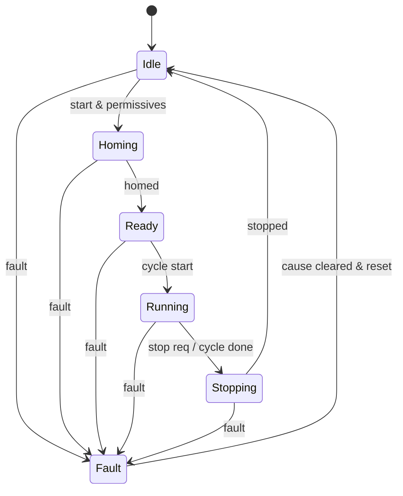

<div class="page-header">
  <span class="page-header__label">PLC Software</span>
  <h1>State Machines in PLC Programs</h1>
  <p>Make the machine's state explicit — one variable that names the step — instead of leaving it implied across a hundred coils and timers.</p>
</div>

## Why explicit state machines beat ad-hoc logic

A machine sequence is a state machine whether or not the programmer admits it.
The only real choice is whether the state is **explicit** — one variable that
names the current step — or **implicit**, scattered across dozens of coils,
seals, and timers that together imply where the machine is.

Ad-hoc sequence logic — "start the pump when these six bits are true, unless
this timer, but not if that latch" — has no single source of truth. Two rungs
can silently disagree about where the machine is, and the failure mode is the
machine that stops "somewhere" that nobody can name, because there is no step to
name. Making the state explicit fixes three things that matter on a running
plant:

- **Deterministic.** Exactly one state is active each scan, and a transition is
  the only thing that changes it. Behavior is reproducible instead of emergent.
- **Debuggable.** The current-state variable is a single tag to watch, trend, or
  alarm. A stall becomes "stuck in HOMING waiting for the home switch," not a
  hunt through the ladder.
- **The operator and commissioning benefit.** The HMI shows the state name, so
  the operator reads the machine at a glance; the commissioning engineer steps
  the machine through its cycle one transition at a time, deliberately.

This is the practical, PLC-side companion to the
[machine state model]({{ '/fundamentals/control/machine-state-model/' | relative_url }})
fundamentals page, which covers the state-model theory (FSM, hierarchical,
PackML). This page is about writing it in a controller.

## The step, transition, action model

An explicit state machine has three parts:

- **States (steps)** — the named, mutually exclusive situations the machine can
  be in: IDLE, HOMING, READY, RUNNING, STOPPING. One and only one is active.
- **Transitions** — guarded moves between states. A transition fires only when
  its **guard** condition is true (homed, start pressed, cycle done). Guards are
  what stop the machine skipping a step it has no business skipping.
- **Actions** — what runs because of the state. Continuous actions execute while
  the state is active; **entry** and **exit** actions run once, as the state is
  entered or left.



The fault transition can fire from any state — that is the point of drawing it as
its own path rather than folding it into each step.

## Three ways to implement it

IEC 61131-3 does not mandate a state-machine construct; it gives you languages,
and the pattern maps onto three of them. Which you use is a house-standard and
platform question — consult your platform's documentation.

### SFC — the native language

**Sequential Function Chart** is the IEC 61131-3 language built for sequences.
Steps and transitions are first-class graphical elements: each step carries its
actions, each transition carries its guard, and the chart itself doubles as
documentation. SFC is the most direct expression of the model when the sequence
is genuinely linear or has clean branches. Availability, action qualifiers, and
execution semantics are vendor-specific — Rockwell, Siemens (GRAPH), CODESYS, and
Beckhoff each diverge from the base standard, so verify against your toolchain.

### A CASE on a state variable — the portable pattern

The common, portable approach is a single enumerated `State` variable switched in
a `CASE` in Structured Text. Each branch holds that state's actions and evaluates
its transition guards, writing the next state. It ports cleanly across platforms
and reviews well because the whole machine reads top to bottom. Illustrative only
— not platform code:

```
CASE State OF
  IDLE:     IF StartCmd AND Permissives THEN State := HOMING; END_IF;
  HOMING:   Home();  IF HomeDone THEN State := READY; END_IF;
  READY:    IF CycleStart THEN State := RUNNING; END_IF;
  RUNNING:  RunCycle();  IF CycleDone OR StopReq THEN State := STOPPING; END_IF;
  STOPPING: IF Stopped THEN State := IDLE; END_IF;
  FAULT:    IF ResetPulse AND FaultCleared THEN State := IDLE; END_IF;
END_CASE;
```

### Step-latching in Ladder

Where LD is the house language, each step is a latched bit. The transition rung
seals in the next step's bit and unlatches the current one, so exactly one step
bit is on at a time (a "one-hot" chain). It is readable to a maintenance
electrician, which is often why it is chosen — but it takes discipline to keep it
genuinely one-hot, since nothing in the language enforces the mutual exclusion
that a `CASE` gives for free.

## Entry and exit actions, and why one-shots matter

Entry actions run once as a state is entered — start a dwell timer, command a
setpoint, reset a counter. Exit actions run once as it is left — stop the motor,
clear a request. The word that matters is **once**.

An action tied to a transition must be **one-shot**: edge-triggered on the state
change, not re-executed every scan the state happens to be active. Re-issuing a
"start" command every scan is a classic bug — the command fights itself, or a
downstream one-shot never sees a fresh edge and never fires. Detect the
transition, act on the edge, move on.

## Interlocks and permissives layered over the machine

Interlocks and permissives belong **on top of** the state machine, not buried
inside individual transitions. A **permissive** is a condition that must be true
to allow the machine to proceed; an **interlock** forces a safe state regardless
of where the sequence thinks it is. Keeping them in a separate, clearly labelled
layer keeps the sequence readable and the protective logic auditable — the
difference between the three protective layers is covered in
[interlocks, permissives &amp; safety trips]({{ '/fundamentals/control/interlocks-permissives-safety-trips/' | relative_url }}).

One boundary is firm: a machine-actuated **safety** function is not sequence
logic and does not live in the state machine at all. It lives in the wired
[safety circuit]({{ '/design/wiring/safety-circuit/' | relative_url }}) and, where
a safety controller is involved, in a separate safety application — see
[safety application patterns]({{ '/fundamentals/plc-software/safety-application-patterns/' | relative_url }}).
The standard state machine may *read* safety status, but it never *implements*
the safety function.

## Fault states and recovery

A fault is a transition that can fire into a single FAULT state from many states
at once. FAULT commands the safe outputs — stop motion, drop non-safety outputs
to their de-energized state — and holds. It does not guess and it does not
continue.

Recovery is deliberate, never automatic:

1. The operator (or maintenance) clears the physical cause.
2. A **reset** — a monitored edge, never a maintained bit or a permanently held
   button — acknowledges the fault.
3. The machine returns to IDLE and usually **re-homes**, because after a fault
   the physical position of axes, indexers, and product is unknown and cannot be
   trusted.

Never let a fault silently self-clear straight back into the running sequence.
The one-way trip through FAULT, and the required reset, are what make the machine
safe to restart.

## Related pages

- [Machine state model]({{ '/fundamentals/control/machine-state-model/' | relative_url }}) — the state-model theory this page implements
- [Program structure]({{ '/fundamentals/plc-software/program-structure/' | relative_url }}) — where the state machine sits among POUs and tasks
- [Safety application patterns]({{ '/fundamentals/plc-software/safety-application-patterns/' | relative_url }}) — why the safety function stays out of the sequence
- [Interlocks, permissives &amp; safety trips]({{ '/fundamentals/control/interlocks-permissives-safety-trips/' | relative_url }})
- [Safety circuit wiring]({{ '/design/wiring/safety-circuit/' | relative_url }})
- [Control fundamentals]({{ '/fundamentals/control/' | relative_url }})
- [Engineering toolkit]({{ '/tools/engineering-toolkit/' | relative_url }}) — tag database and IEC 61131-3 identifier rules
