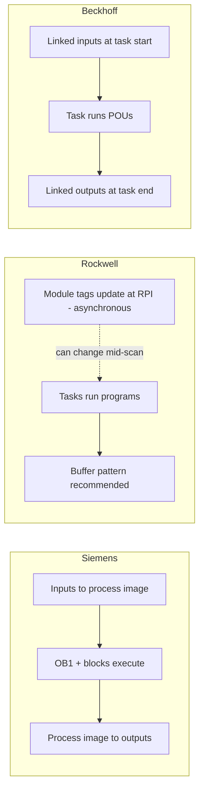

  PLC Software
  <h1>Vendor Programming Architectures</h1>
  
Siemens, Rockwell, and Beckhoff implement the same IEC 61131-3 ideas in three different architectures — learn the translation, not three separate platforms.

> **Scope.** How the Siemens TIA Portal, Rockwell Logix, and Beckhoff TwinCAT 3
> ecosystems diverge in program hierarchy, memory model, execution model, I/O
> flow, and reuse mechanisms, with a concept-translation table. Vendors appear
> as examples of ecosystems, not endorsements. This is not a syntax reference,
> and behaviours that vary by firmware or version are deferred to the cited
> vendor manuals — consult your platform's documentation.

## Same standard, three dialects

All three ecosystems descend from the IEC 61131-3 model — POUs, typed data,
and tasks, covered in
[languages overview]({{ '/fundamentals/plc-software/languages-overview/' | relative_url }})
and [program structure]({{ '/fundamentals/plc-software/program-structure/' | relative_url }}).
All three offer ladder and Structured Text, so language is not the real
difference. What diverges is architecture: **how code is scheduled, where
state lives, how hardware appears in the program, and what the unit of reuse
is**. An engineer who can translate those four concepts moves between
platforms quickly instead of relearning each one from zero.

In one line each: **Siemens** is block-and-data (behaviour in function
blocks, state in named data blocks); **Rockwell** is tag-and-instruction
(routines operate directly on named tags — no separate data-block object);
**Beckhoff** is software-library-and-task (IEC software objects in
configurable real-time tasks on a PC runtime, linked symbolically to
hardware).

## Siemens: TIA Portal and the OB/FC/FB/DB hierarchy

User code lives in four block kinds. **Organization blocks (OBs)** are entry
points the CPU operating system calls — OB1 for the free-running cycle, other
OBs for startup, fixed-period cyclic interrupts, hardware interrupts, and
diagnostics. The engineer does not call OBs; the OS does, so structure begins
with "which event runs this code." **FBs** are stateful and instantiable,
**FCs** are stateless, and **DBs** hold data — global DBs for shared data,
instance DBs for FB state.

The defining trait: algorithm and memory are separate, named objects. Calling
`FB_Pump` for pump 101 means naming the instance DB that holds pump 101's
timers, state, and statistics — one FB, three pumps, three inspectable
instance DBs. On S7-1200/1500, blocks use either **optimized access**
(symbolic-only, compiler-arranged memory — the Siemens-recommended default per
the S7-1200/1500 Programming Guideline) or **standard access** (declaration
order, absolute addressing, kept for compatibility); the choice affects
addressing and communications, so verify before mixing.

I/O flows through the **process image**: inputs are captured at a defined
point and stay consistent for the cycle (or partition), per the S7-1500 cycle
and response times manual. Reuse ships through TIA libraries as
version-managed **types** (instances stay linked to the type) or free-standing
**master copies**. The hardware philosophy is an engineered appliance: the
project is anchored to a configured CPU and station — typically an S7-1500
with ET 200 distributed I/O on PROFINET, drives, HMI, and safety engineered in
the same tool — and motion/PID often run as firmware **technology objects**
commanded from user code.

## Rockwell: Logix tasks, tags, and AOIs

A Logix project is organized **task → program → routine**: continuous tasks
free-run, periodic tasks fire at fixed intervals, event tasks on triggers;
each program holds routines and its own tags (Rockwell publication
1756-PM005). Memory is radically different from Siemens: there is no
address map and no data-block object — everything is a named, typed **tag**,
either controller-scope (visible everywhere) or program-scope (private).
A pump is a **UDT** tag: `Pump101` carries commands, statuses, alarms, and
statistics as members. The tag *is* the data object.

The reuse unit is the **Add-On Instruction**: parameters, local tags, and
logic packaged as a custom instruction that drops into a rung like a native
one, each use backed by an instance tag. AOIs define platform-specific
auxiliary behaviours (prescan, postscan, enable-in-false logic) so they can
initialize like built-ins — semantics are version-dependent; see Rockwell
publication 1756-PM010. Many native instructions carry their state in
standard structures visible online (for example the FIFO pair `FFL`/`FFU`
with a `CONTROL` structure), which suits ladder-first troubleshooting.

The classic surprise for arriving Siemens programmers is I/O: module-defined
tags (`Local:2:I` and similar) update at the configured **RPI,
asynchronously to program execution** — an input tag can change between two
rungs of the same routine. The standard remedy is buffering: copy inputs into
an application structure at the top of the logic (`CPS` for a consistent
copy of larger data), run against the buffer, copy outputs back (Rockwell
publication 1756-PM004). The hardware philosophy is a modular connected
controller: chassis modules and EtherNet/IP devices join as configured
profiles, each connection with its own RPI.

## Beckhoff: TwinCAT 3 as a real-time software platform

TwinCAT 3 splits engineering (**XAE**, hosted in Visual Studio) from the
real-time runtime (**XAR**) executing on an industrial or embedded PC — PLC,
motion, safety, vision, and C++ modules can share one machine. **Tasks** are
configured in the system layer with a cycle time, priority, and CPU-core
assignment, and PLC programs are explicitly assigned to them — execution
timing is a system-engineering decision, not a property of the code.

The PLC project is plain IEC — programs, FBs, functions, DUTs, GVLs — plus a
distinctive **object-oriented extension set**: FBs can have methods,
properties, interfaces, and inheritance, so an equipment FB can expose
`Start()`/`Stop()` methods and implement a shared interface — or teams can
write plain IEC code. I/O is configured in a **separate I/O layer**
(typically an EtherCAT master and terminals — see
[EtherCAT]({{ '/communications/ethercat/' | relative_url }})) and PLC
process-image variables are **explicitly linked** to fieldbus process data;
a task-synchronized image updates inputs at task start and outputs at task
end, so code sees a consistent image per task cycle. Reuse ships as
**versioned PLC libraries** — Beckhoff's Tc2/Tc3 sets (Tc2_Standard,
Tc2_Utilities, Tc2_MC2 for PLCopen motion) and company libraries alike; per
the Beckhoff Information System, many needs that are native instructions on
Logix are library FBs here.

## Concept translation table

Role equivalents, not exact behavioural equivalents — verify semantics
against your platform's documentation before relying on them.

| Concept | Siemens (TIA Portal) | Rockwell (Logix) | Beckhoff (TwinCAT 3) |
|---|---|---|---|
| Cyclic execution | OB1 | Continuous task | Real-time task |
| Fixed-period execution | Cyclic interrupt OB | Periodic task | Task at that cycle time |
| Stateful reusable unit | FB + instance DB | AOI + instance tag | FB (methods optional) |
| Stateless routine | FC | Routine | FUNCTION |
| Shared global data | Global DB | Controller-scope tags | GVL |
| Module-local data | Instance DB | Program-scope / AOI tags | FB instance variables |
| Structured type | PLC data type (UDT) | UDT | DUT |
| I/O binding | Process image + HW tags | Module tags at RPI | Linked process-image variables |
| Input consistency default | Stable per cycle | Can change mid-scan | Stable per task cycle |
| Reuse distribution | Library types / master copies | AOI + UDT export | Versioned PLC libraries |
| Typical fieldbus | PROFINET | EtherNet/IP | EtherCAT |

## One FIFO, three dialects

The same bounded job queue lands on a different mechanism in each ecosystem
(constructed teaching example; snippets illustrative — not platform code):

- **Siemens** — a library or user FB over a DB-resident array (`LGF_FIFO`
  from the Library of General Functions, or a ring buffer with indices in a DB).
- **Rockwell** — the native instruction pair `FFL`/`FFU` over an array tag,
  with an online-watchable `CONTROL` structure (position, length, status bits).
- **Beckhoff** — a utility-library object, `FB_MemRingBuffer` (Tc2_Utilities),
  over a byte buffer the application declares.

The same translation holds for a staging algorithm (pick the available pump
with the lowest run hours): the Structured Text ranking loop is near-identical
everywhere; only its home differs — an SCL FB with instance-DB state on
Siemens, an ST routine or AOI under a periodic task on Logix, an FB method on
a TwinCAT machine-control task.

## Structuring programs to survive a platform port

A design keyed to functional layers — I/O mapping, control modules, equipment
modules, modes and states, sequences, alarms, integration (see
[program structure]({{ '/fundamentals/plc-software/program-structure/' | relative_url }})) —
translates across all three, because each layer maps onto whatever the
platform's container is. Habits that make the port cheap:

- Keep raw I/O mapping in one thin layer; the rest of the logic works on
  application structures rather than hardware tags directly.
- Put algorithms (queues, ranking,
  [state machines]({{ '/fundamentals/plc-software/state-machines/' | relative_url }}))
  in Structured Text inside the platform's stateful reuse unit.
- Keep ladder for physical commands, permissives, and diagnostics, where
  online readability earns its keep.
- Document data ownership — which layer writes what — since the concept
  transfers even when the container (DB, tag scope, GVL) changes.

## Platform fit by project character

None of these are exclusive — all three ecosystems build all of these
systems, and installed base, house standards, and local support usually weigh
more than architecture:

- A Siemens-centred design is commonly chosen where the plant is engineered
  around PROFINET, Siemens drives/HMI/safety, and formalized block libraries.
- A Logix-centred design is commonly chosen where maintenance troubleshoots
  primarily in online ladder, the facility standard is EtherNet/IP, and
  equipment is modelled as UDT/AOI objects.
- A TwinCAT-centred design is commonly chosen for high-speed or many-axis
  EtherCAT-synchronized machinery and teams that want software-engineering
  structure (methods, interfaces, versioned libraries) with PC-level
  integration of PLC, motion, and custom code.

The durable skill is the translation itself: "instance DB ≈ AOI backing tag ≈
FB instance" and "cyclic-interrupt OB ≈ periodic task ≈ 10 ms real-time task"
is what makes the second and third platforms cheap to learn.

## Related Pages

- [Languages overview]({{ '/fundamentals/plc-software/languages-overview/' | relative_url }}) — the five IEC 61131-3 languages these platforms implement
- [Program structure]({{ '/fundamentals/plc-software/program-structure/' | relative_url }}) — the shared POU/task/scope model
- [State machines]({{ '/fundamentals/plc-software/state-machines/' | relative_url }}) — the portable sequence pattern
- [Safety application patterns]({{ '/fundamentals/plc-software/safety-application-patterns/' | relative_url }}) — safety logic stays outside these structures
- [EtherCAT]({{ '/communications/ethercat/' | relative_url }}) — the TwinCAT-native fieldbus
- [PROFINET]({{ '/communications/profinet/' | relative_url }}) and [EtherNet/IP]({{ '/communications/ethernet-ip/' | relative_url }}) — the other two ecosystems' typical fieldbuses
- [Machine architecture model]({{ '/design/architecture/machine-architecture-model/' | relative_url }}) — where the controller sits in the 7-layer view
