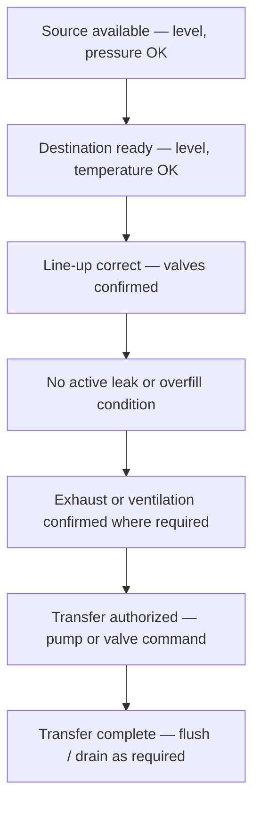

  Semiconductor Facility — Chemical Systems
  <h1>Bulk Chemical Distribution and Wet Process</h1>
  Phase 22

This page covers facility-side liquid chemical infrastructure — from bulk storage through transfer skids, blend systems, and wet process supply to local panels and drains.

---

## Scope

- Bulk storage and tank farms
- Day tanks and intermediate vessels
- Transfer skids
- Blend and dilution skids
- Wet benches and local supply panels
- Leak detection and secondary containment interfaces
- Drain segregation and waste handling connections

---

## Main Engineering Objectives

- Protect people and facility from chemical release at every transfer and handling step
- Maintain chemical purity and compatibility throughout the distribution path
- Transfer material without cross-contamination
- Prevent pump damage, overfill events, and incompatible routing
- Support safe drain segregation and waste handling downstream

---

## Key Engineering Concerns

### Material Compatibility

Compatibility is not just chemical name and material — it depends on:

| Factor | What to document |
|--------|-----------------|
| Chemical identity | Name, concentration, temperature range |
| Wetted materials | Tubing, valve seats, diaphragms, sensor bodies, gaskets, sample lines |
| Concentration effects | Many chemicals change corrosivity or reactivity at concentration boundaries |
| Temperature | Elevated temperature can drive compatibility failures that are benign at ambient |

Build a **chemical compatibility matrix** before specifying any wetted component in the system.

### Containment and Leak Response

- Provide secondary containment appropriately sized for the worst-case release scenario
- Treat leak-detection zoning as part of process design — not a late add-on
- Decide what shuts down locally and what escalates to a facility emergency response before commissioning

### Transfer Sequencing

Every controlled transfer should verify in order:

Failing to verify any step before transfer is the most common source of chemical incidents during commissioning.

---

## Control Philosophy Highlights

| Principle | Rationale |
|-----------|-----------|
| Interlock pump start against closed-path or low-level conditions | Dry run destroys pump seals and creates a secondary hazard |
| Block chemical transfer on active leak or destination not ready | Cross-contamination and overfill risk outweigh urgency to transfer |
| Isolate hazardous flows on leak detection or emergency commands | Fail-to-isolated is the safe direction for hazardous liquid |
| Treat drains and flushes as controlled sequence steps | Informal draining can route incompatible materials together or bypass containment |

---

## Typical Instrumentation

| Measurement | Device / Method | Key considerations |
|-------------|-----------------|-------------------|
| Tank level | Non-contact radar (bulk); guided-wave radar or ultrasonic | Chemical compatibility, buildup tolerance, independent overfill switch |
| Independent overfill | Float switch or separate point-level device | Redundant, independent from continuous level measurement |
| Transfer flow | Coriolis (dosing accuracy and density); magmeter (conductive fluids) | Wetted material compatibility; entrained-gas tolerance |
| Line pressure | Flush-diaphragm or chemically isolated transmitter | Diaphragm material, fill fluid compatibility, flush geometry |
| Temperature | RTD or thermocouple — material compatibility | Needed where chemistry or pump performance depends on temperature |
| Leak detection | Rope, point, or conductive leak sensor — matched to chemical | Cable and sensor material compatibility; zone design |
| pH / ORP (blend, drain, neutralization) | Electrochemical analyzer with chemical-duty electrodes | Calibration discipline; access for cleaning |
| Chemical concentration | Inline density, refractive index, or dedicated analyzer | Application-specific; not always required |

See the [Instrumentation Reference](/industries/semiconductor/facility/instrumentation/) for full device selection guidance.

---

## Common Failure Themes

- Material compatibility failure discovered at commissioning — baseline chemical compatibility matrix prevents this
- Overfill during bulk delivery — independent overfill interlock must be independent from the level controller
- Cross-contamination from improper line-up — manual connection points need hard-stop prevention (color coding, keyed connections) plus software interlock
- Leak detection gap — zones that cover piping but not vessel overflows or flanges; zone design drives response quality
- Pump damage from closed-path start or low-level condition — most common mechanical failure in chemical systems during commissioning

---

## Documentation Outputs Worth Building

- Chemical compatibility matrix (every wetted material vs. every chemical family used)
- Bulk-to-day-tank transfer sequence narrative
- Leak-detection zoning map (which sensors cover which equipment, what action they trigger)
- Drain segregation matrix (which drains go where, what is allowed to mix)
- Overfill and spill response table (volume, containment capacity, response owner)

---

## Standards Anchors

| Standard | Role |
|----------|------|
| SEMI F39 | Chemical blending systems — design and qualification |
| SEMI F57 | Polymer materials and components for liquid chemical paths |
| SEMI C90 | Fluorinated materials in liquid chemical distribution |
| SEMI S2 / S14 | Equipment safety framing — applies to packaged chemical skids |
| NFPA 318 | Semiconductor-fab fire and life-safety context |
| NFPA / local fire code | Chemical storage quantities and hazard class limits |

---

## See Also

- [Bulk Specialty Gas Systems](/industries/semiconductor/facility/bulk-specialty-gas/) — analogous design patterns for gas systems
- [UPW and Wastewater Systems](/industries/semiconductor/facility/upw-wastewater/) — drain segregation connects to wastewater handling
- [Safety and Shutdown Architecture](/industries/semiconductor/facility/safety-shutdown/) — where chemical leak detection fits in the facility shutdown hierarchy
- [Instrumentation Reference](/industries/semiconductor/facility/instrumentation/) — chemical-service sensor selection
- [Tool-Facility Interface](/industries/semiconductor/facility/tool-facility-interface/) — chemical supply handshake with process tools
- [IEC 61511 — SIS Lifecycle](/standards/functional-safety/iec-61511/) — when chemical shutdown logic requires formal SIL treatment
