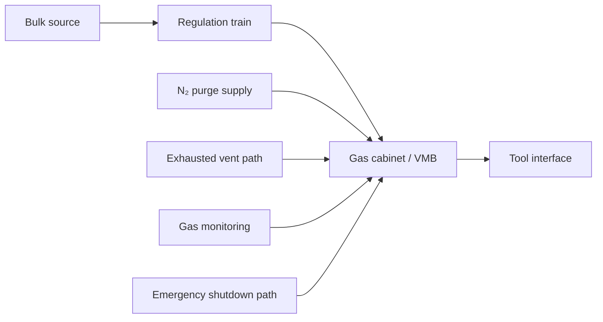

<div class="page-header">
  <span class="page-header__label">Semiconductor Facility — Gas Systems</span>
  <h1>Bulk Specialty Gas Systems</h1>
  <span class="badge badge--new">Phase 22</span>
</div>

This page covers facility-side gas infrastructure that feeds semiconductor tools and process areas. It addresses the supply and control path from the bulk source to the tool interface — not the internal process-tool gas box design.

For the cabinet-level sequence, interlock, purge, and shutdown package, use the dedicated [Gas Cabinet Reference](/industries/semiconductor/facility/gas-cabinet/).

---

## Scope

- Bulk gas storage and source equipment
- Gas rooms
- Gas cabinets
- Valve manifold boxes (VMBs)
- Purge panels
- Tool interface points

---

## Typical Architecture

Common flow path:

```
source → isolation → regulation → filtration/purification → cabinet or panel → local isolation → tool interface
```

Associated support paths:



---

## Main Engineering Objectives

- Maintain gas purity and leak integrity throughout the supply path
- Provide controlled isolation and purge capability
- Prevent hazardous release into occupied areas
- Prove utility availability before enabling flow to the tool
- Define safe response to detector alarms, exhaust loss, or fire events

---

## Control Philosophy

| Principle | Rationale |
|-----------|-----------|
| Gas flow enable depends on cabinet health, exhaust availability, and absence of active hazard alarms | Prevents enabling flow into an unsafe or unmonitored state |
| Shutdown isolates the source and drives toward a proven safe state | Fail-safe direction — de-energize to isolate |
| Purge sequences require explicit entry and completion criteria | Prevents clearing a purge before it is effective |
| Maintenance mode must not bypass critical shutdown functions | Bypass creates undetected risk during service periods |

---

## Typical Instrumentation

| Measurement | Device / Method | Notes |
|-------------|-----------------|-------|
| Source pressure | UHP pressure transducer | Leak-tight, compact, metal-seated connections |
| Regulated line pressure | UHP pressure transducer | Monitor regulation train integrity |
| Valve position feedback | Solenoid or actuator position switch | Required for sequence logic and interlock proof |
| Mass flow (where facility controls flow) | Metal-sealed thermal MFC | SEMI F13/F14 service; gas-list and sealing compatibility critical |
| Hazardous gas detection | Fixed electrochemical or Chemcassette | Instrument type matched to target gas list |
| Exhaust proof | Airflow or differential pressure | Prove capture, not just motor status |
| Purge confirmation | Pressure and timing logic | Entry and exit criteria must be defined |

See the [Instrumentation Reference](/industries/semiconductor/facility/instrumentation/) for full device selection guidance.

---

## Common Failure and Hazard Themes

- Wrong gas or wrong connection at cylinder changeout
- Small leaks in high-purity welded or face-seal systems
- Exhaust loss causing unsafe accumulation inside cabinet or gas room
- Regulator, valve, or MFC contamination or drift
- Delayed detection because sensing zone does not match the leak path
- Purge cleared prematurely — system put back in service before safe state confirmed

---

## Documentation Outputs Worth Building

- Gas system boundary diagram (source to tool interface)
- Cabinet and VMB cause-and-effect table
- Source-to-tool pressure hierarchy
- Purge sequence narrative with entry and exit criteria
- Alarm and shutdown ownership table

---

## Standards Anchors

| Standard | Role |
|----------|------|
| SEMI F14 | Gas source equipment enclosures — design requirements for cabinets |
| SEMI F13 | Gas source control equipment — what the control train must do |
| SEMI F6 | Secondarily contained hazardous gas piping systems |
| SEMI S6 | Exhaust ventilation for semiconductor manufacturing equipment |
| SEMI S2 / S14 | Equipment safety and fire-risk framing |
| NFPA 55 | Compressed-gas and cryogenic-fluid code context |
| NFPA 318 | Semiconductor-fab fire and life-safety code context |

---

## See Also

- [Gas Cabinet Reference](/industries/semiconductor/facility/gas-cabinet/) — full cabinet architecture, purge, interlock, and shutdown visual set
- [Exhaust and Abatement Systems](/industries/semiconductor/facility/exhaust-abatement/) — exhaust proof and abatement dependencies
- [Tool-Facility Interface](/industries/semiconductor/facility/tool-facility-interface/) — permit-to-run and handshake signals
- [Instrumentation Reference](/industries/semiconductor/facility/instrumentation/) — device selection matrix
- [SEMI S2/S8/S14](/standards/semiconductor/semi/) — equipment safety framing
- [IEC 61511 — SIS Lifecycle](/standards/functional-safety/iec-61511/) — formal shutdown integrity when required
- [Software Stack](/design/software-stack/) — PLC and safety controller platforms
