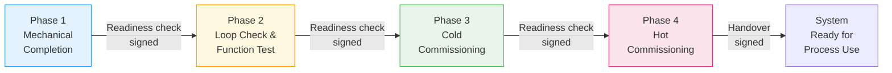

  Semiconductor Facility — Commissioning
  <h1>Facility Utility System Commissioning</h1>
  Phase 23

This page provides a structured commissioning and startup framework for semiconductor facility utility systems — gas, UPW, chemical, exhaust, and cleanroom. It is a planning reference, not a substitute for site-specific commissioning procedures.

---

## Commissioning Phase Structure

Semiconductor facility utility commissioning follows four phases. Each phase has readiness criteria that must be met before advancing.

| Phase | Name | Scope |
|-------|------|-------|
| **1** | Mechanical completion | Piping integrity, instrument installation, panel wiring, grounding, valve stroke check |
| **2** | Loop check and function test | Instrument calibration, loop check, interlock and shutdown function test, C&E sign-off |
| **3** | Cold commissioning | Flush and clean, pressure test, DI water run, air/nitrogen run, alarm setpoints entered |
| **4** | Hot commissioning | Controlled media introduction, startup sequence validation, trip challenge, handover |

---

## Phase 1 — Mechanical Completion

**Readiness before proceeding to Phase 2:**

- [ ] Piping isometrics marked up as-built or confirmed against installation
- [ ] Instrument installations checked against data sheets (range, process connection, orientation)
- [ ] Control panel and junction box wiring continuity verified
- [ ] Grounding continuity verified (NEC or IEC 60204-1 as applicable)
- [ ] Valve actuators stroked manually; position feedback verified
- [ ] All pressure relief valves and rupture disks installed and records signed

---

## Phase 2 — Loop Check and Function Test

**Readiness before proceeding to Phase 3:**

- [ ] All instrument loops checked — sensor reads correctly at board, correct tag, correct engineering units
- [ ] All discrete inputs verified — status reads correctly at PLC
- [ ] All discrete outputs verified — field device responds to forced output
- [ ] All interlocks and trips function-tested — input simulated, output verified
- [ ] Cause-and-effect table signed off row by row
- [ ] Shutdown reset authority verified (who can reset, from where, what preconditions)

---

## Phase 3 — Cold Commissioning

**Readiness before introducing process media:**

- [ ] System flushed clean per specification (UPW per SEMI F61 flush protocol; chemical per owner spec)
- [ ] Leak test completed and documented
- [ ] Control valve and modulating valve tuning completed
- [ ] Alarm setpoints entered and verified at HMI/SCADA
- [ ] Mode and state logic verified — OFF, MANUAL, AUTO transitions work correctly
- [ ] Permissive logic verified — system will not start without preconditions met
- [ ] Data historian tags confirmed active where required

---

## Phase 4 — Hot Commissioning

**Readiness before declaring system ready for process use:**

- [ ] Media introduction follows a step-by-step, sign-off-controlled sequence
- [ ] Startup sequence runs without deviations requiring manual override
- [ ] All alarms and trips verified at or near actual setpoint (challenge test preferred over simulation)
- [ ] Operating manual updated with actual setpoints and as-found calibration records
- [ ] Handover documentation completed and signed

---

## System-Specific Considerations

### Bulk Specialty Gas

- Purge protocol completed and recorded before media introduction
- Gas cabinet and enclosure interlocks verified before first fill
- Gas detection system calibrated before media introduction
- **Exhaust proof interlock verified:** system will not allow media introduction without confirmed exhaust

### UPW Systems

- Flush volume and acceptance criteria met before reclaim valve opens
- Resistivity, TOC, and particle count acceptance criteria met before tool supply enabled
- Sample point verification confirms each analyzer reads representative product, not stagnant sample

### Liquid Chemical Systems

- Secondary containment drain path verified before media introduction
- Containment sensor function verified before media introduction
- Chemical compatibility documented for all wetted surfaces before first use

### Exhaust and Abatement

- Fan rotation verified before duct pressurization or media introduction
- Airflow balance confirmed before cleanroom or gas cabinet exhaust connections enabled
- Abatement startup follows vendor sequence, not a generic utility sequence

### HVAC and Cleanroom

- Balancing completed before particle baseline testing
- Room differential pressure cascade confirmed: each room relative to adjacent spaces
- ISO 14644 classification test may require settling time after balancing before formal particle test

---

## Documentation Minimum for Sign-Off

| Document | One per | Signed by |
|----------|---------|-----------|
| Loop check sheet | Instrument loop | Commissioning engineer |
| Interlock and shutdown test record | C&E row | Commissioning engineer + process owner |
| Calibration certificate or record | Instrument | Calibration technician |
| Leak test record | System or segment | Commissioning engineer |
| Flush record | System | Commissioning engineer (where applicable) |
| As-built markups or confirmed as-builts | Drawing | Responsible engineer |
| Startup sequence record | System | Commissioning engineer |
| Handover certificate | System | Site engineering + operations |

---

## Standards Context

| Standard | Commissioning relevance |
|----------|------------------------|
| SEMI F61 | UPW flush protocol and quality acceptance criteria |
| SEMI S2/S8 | EHS baseline for equipment packages |
| ISA-5.1 | Loop documentation and tag conventions |
| NFPA 79 | Industrial control panel and machine commissioning |
| IEC 60204-1 | Machine electrical equipment commissioning |
| IEC 61511 | Proof test and commissioning requirements for SIL-rated loops |
| ISO 14644-2 | Cleanroom monitoring and ongoing verification |

---

## See Also

- [Safety and Shutdown Architecture](../safety-shutdown/) — cause-and-effect design and shutdown layers
- [Common Control Philosophy](../control-philosophy/) — mode, state, permissive, and interlock patterns
- [Instrumentation Reference](../instrumentation/) — device selection and alarm strategy
- [Tool-Facility Interface](../tool-facility-interface/) — handshake and permit-to-run logic
