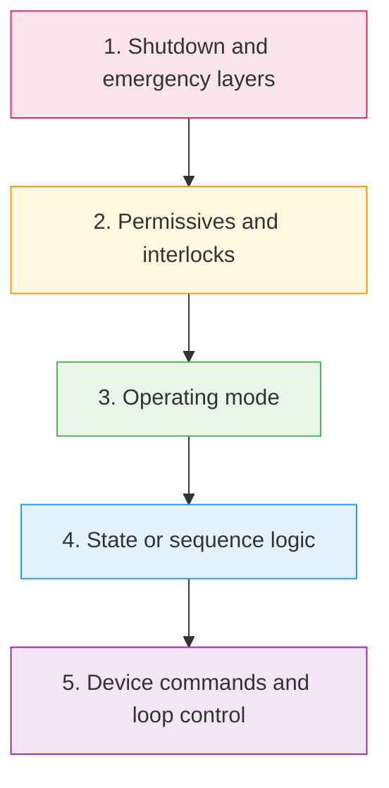
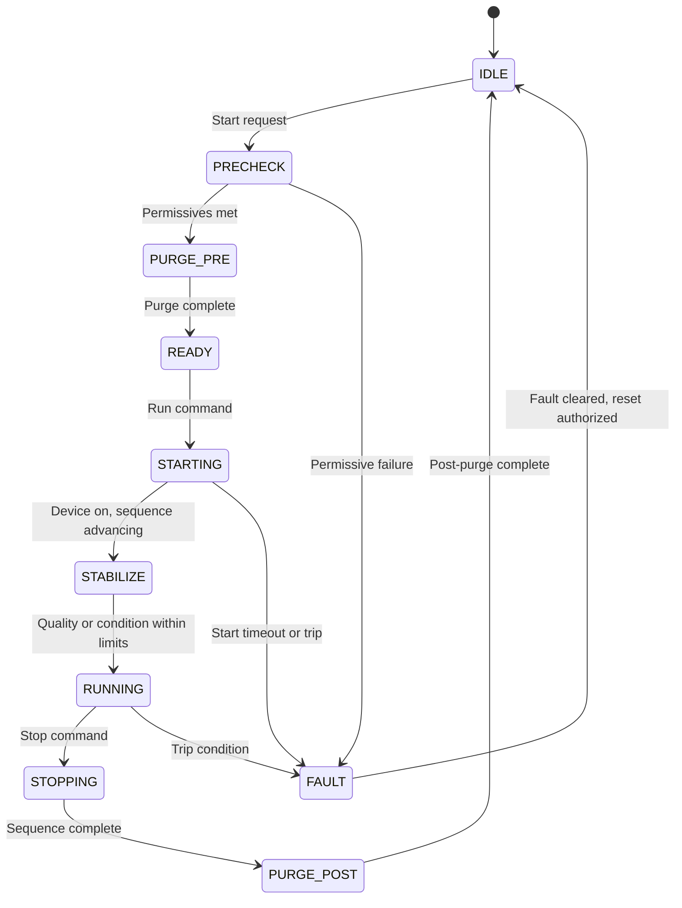
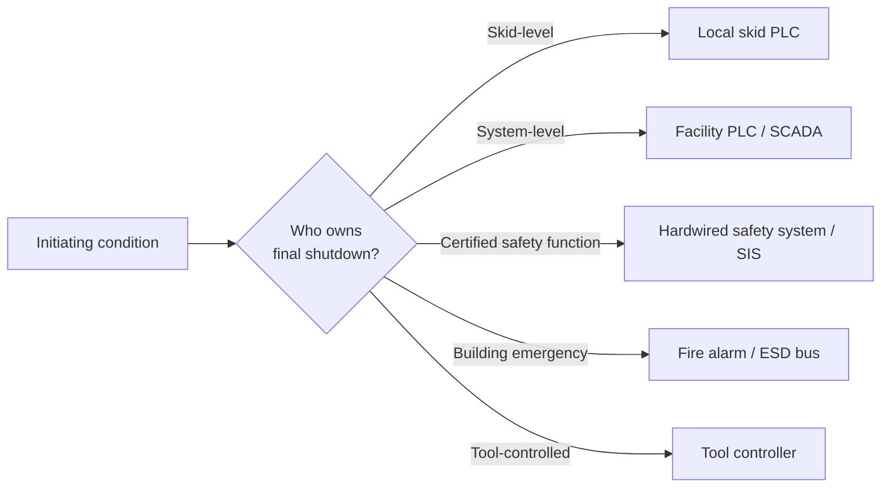

  Semiconductor Facility — Control Design
  <h1>Common Control Philosophy</h1>

This page defines a reusable control pattern for semiconductor facility utility systems — gas skids, chemical delivery skids, UPW modules, exhaust subsystems, and tool utility interfaces. The patterns here apply across systems; individual system pages describe how they are applied in specific contexts.

---

## Design Hierarchy

Logic must be structured in this order. A lower layer must never override a higher layer:

This is not just a coding preference — it determines what happens when multiple conditions change simultaneously and which condition wins.

---

## Modes

Most facility utility systems can use this restrained mode set. Mode names may vary by site — the behavior must be explicit and documented regardless of naming:

| Mode | Description | Typical restrictions |
|------|-------------|---------------------|
| `OFF` | System de-selected; all auto commands disabled | No output commands generated |
| `MANUAL_LOCAL` | Operator-at-panel control; individual device commands | Auto sequence disabled; critical shutdowns remain active |
| `MANUAL_REMOTE` | Remote operator control via HMI or SCADA | Auto sequence disabled; critical shutdowns remain active |
| `AUTO` | Sequence and PID loops operating normally | All layers active |
| `MAINTENANCE` | Engineering bypass mode for calibration or repairs | Requires authorization; critical trips must stay active — see below |
| `FAULT` | System has entered a fault condition | No new commands until fault cleared and acknowledged |
| `EMERGENCY_SHUTDOWN` | Layer 3 or 4 shutdown active | Requires investigation and authorized reset |

---

## State Machine Pattern

For sequence-driven systems, use an explicit state model instead of scattered latch logic. A state model makes every transition visible and testable.

Not every system needs every state. Every transition needs:
- An **owner** (the system or operator that triggers it)
- An **exit condition** (what must be true to advance)
- A **timeout** (what happens if the condition is not met in time)

---

## Permissives, Interlocks, and Trips

These three categories are often confused but serve different purposes:

### Permissives — "May the sequence start or continue?"

Permissives are checked before action. They do not force shutdown — they prevent starting.

Common facility utility permissives:

| Permissive | Blocks |
|-----------|--------|
| Utility available (pressure, level, flow within range) | Auto start |
| No active shutdown command | Any advance |
| Exhaust available | Gas or chemical flow enable |
| Destination ready (level, temperature, pressure) | Transfer start |
| No active gas or leak alarm | All enables in affected zone |

### Interlocks — "What unsafe action must be blocked?"

Interlocks are active during operation. They prevent specific unsafe states.

Common facility utility interlocks:

| Interlock | Prevents |
|-----------|---------|
| Do not open chemical supply without exhaust proof | Chemical vapor accumulation in unventilated space |
| Do not start pump against closed discharge path | Deadhead / pump damage |
| Do not enable gas flow without cabinet healthy and exhaust proven | Uncontrolled gas release |
| Do not advance sequence without valve position proof or timing confirmation | Sequence advance into unknown state |

### Trips — "What condition forces safe state now?"

Trips act immediately on running systems. They override mode and sequence.

Common facility utility trips:

| Trip | Action |
|------|--------|
| Hazardous gas detection | Isolate source, force purge, remove permit-to-run, alarm |
| Chemical leak detection | Close supply valve, stop pump, alarm, escalate if zone criterion met |
| Overpressure or vacuum loss beyond boundary | Isolate, safe state, alarm |
| Fire alarm or EPO input | Isolate, de-energize, evacuate-mode response |
| Exhaust loss where capture is safety-critical | Isolate dependent gas or chemical flows, alarm |

---

## Safe-State Design Rules

| Rule | Default behavior |
|------|-----------------|
| Isolation valves | Default **closed** — open only on commanded, proven state |
| Purge paths and exhaust paths | May be forced **on** during abnormal conditions |
| Pumps, heaters, blend devices | Default **off** unless part of mitigation path |
| Power loss | Define explicitly — not "whatever de-energized means" |
| PLC fault or network loss | Define explicitly — most safety-critical functions should fail to safe, not hold last state |

Safe state is not one universal answer. It must be defined per hazard scenario.

---

## Manual Mode Discipline

Manual mode is necessary for maintenance and troubleshooting. It must not become a bypass route for hazard controls.

**Keep active in manual mode:**

- All shutdown inputs (gas detection, leak detection, EPO, fire alarm)
- Critical trips — Layer 3 and Layer 4 always
- Equipment protection interlocks (dry-run stop, overcurrent)
- Timeouts that prevent equipment damage

**Restrict carefully in manual mode:**

- Direct actuation of hazardous flow paths — require positive confirmation, not just mode change
- Simultaneous actions that defeat containment or purge intent
- Sequence steps that rely on hidden preconditions

If a bypass is required for maintenance, it must be:
- Authorized and logged
- Time-limited
- Restored before returning to AUTO

---

## Shutdown Ownership

Every system must define which layer owns final shutdown and who has authority to reset each layer:

Ambiguous shutdown ownership is the most common source of commissioning failures. Document it before startup, not during.

---

## Required Documents for Every Utility System

These documents must exist before commissioning. They are also the baseline for handover to operations:

| Document | Contents |
|----------|----------|
| Mode definition table | Each mode: name, description, what is enabled/disabled, transition rules |
| State definition table | Each state: entry condition, exit conditions, timeout, actions |
| Permissive matrix | Each permissive: what it blocks, what clears it |
| Interlock matrix | Each interlock: what it prevents, what the physical consequence is |
| Trip matrix | Each trip: initiating condition, action, reset authority |
| Cause and effect table | Cross-reference: every input to every output action |
| Operator reset policy | Who can reset what, under what conditions |

---

## Standards Anchors

| Standard | Role |
|----------|------|
| IEC 61511 | When sequence logic includes a Safety Instrumented Function — formal SIL design applies |
| ISA-18.2 | Alarm management — prevents the alarm system from obscuring the control model |
| ISA-88 | Batch control standard — state machine and recipe patterns applicable to sequence-driven utility systems |
| SEMI S2 / S14 | Equipment safety — shutdown authority at the tool boundary |

---

## See Also

- [Safety and Shutdown Architecture](/industries/semiconductor/facility/safety-shutdown/) — the four shutdown layers in detail
- [Tool-Facility Interface](/industries/semiconductor/facility/tool-facility-interface/) — how control philosophy integrates with facility-tool handshakes
- [Bulk Specialty Gas Systems](/industries/semiconductor/facility/bulk-specialty-gas/) — control philosophy applied to gas systems
- [Bulk Chemical Distribution](/industries/semiconductor/facility/bulk-chemical/) — control philosophy applied to chemical transfer
- [UPW and Wastewater Systems](/industries/semiconductor/facility/upw-wastewater/) — control philosophy applied to water systems
- [Safety Architecture (Lifecycle Stage 04)](/lifecycle/safety-architecture/) — functional safety design methodology
- [Software Stack](/design/software-stack/) — PLC, DCS, and SIS platform selection
