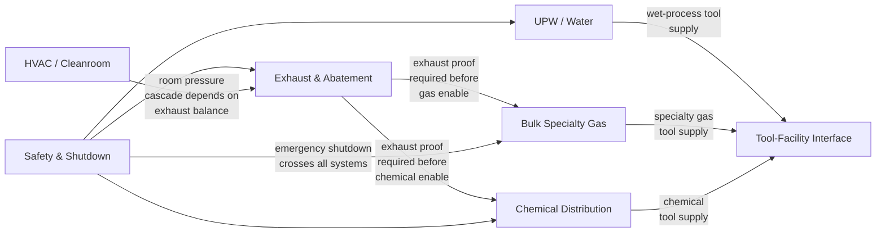
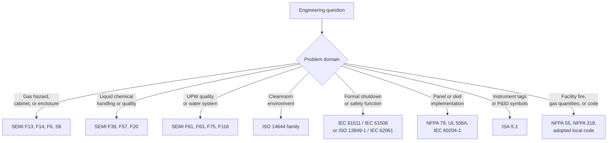

  Semiconductor Facility — Crosswalks
  <h1>System and Standards Crosswalks</h1>

This page maps two things: how facility utility systems depend on each other (system-to-system crosswalk), and which standards govern each system (standards-to-systems crosswalk). Both tables are planning tools, not engineering specifications.

---

## System-to-System Dependency Crosswalk

Semiconductor facility utility systems are interdependent. Loss of one system can propagate to others through permissive chains, common shutdowns, and shared infrastructure.

### Dependency Details

| System | Depends on | What breaks if dependency is lost |
|--------|-----------|----------------------------------|
| Bulk Specialty Gas | Exhaust and Abatement | Gas source will not enable; gas cabinet interlocked out |
| Bulk Specialty Gas | Safety and Shutdown | Emergency isolation triggered by area gas alarm or EPO |
| UPW | Safety and Shutdown | High-purity water isolation in emergency conditions |
| Liquid Chemical Distribution | Exhaust and Abatement | Wet-chemistry exhaust must prove before chemical lines enable |
| Liquid Chemical Distribution | Safety and Shutdown | Chemical isolation on leak detection or area emergency |
| HVAC and Cleanroom | Exhaust and Abatement | Room pressure cascade affected by exhaust balance changes |
| Tool-Facility Interface | UPW | No ultrapure water supply = tool cannot run wet process |
| Tool-Facility Interface | Bulk Specialty Gas | No specialty gas supply = tool cannot run gas-dependent process |
| Tool-Facility Interface | Exhaust and Abatement | No exhaust proof = tool permit-to-run removed |
| Tool-Facility Interface | HVAC and Cleanroom | Cleanroom loss affects contamination-sensitive tool operation |

---

## Standards-to-Systems Crosswalk

Each utility system is governed by multiple overlapping standards families. This table maps which standards matter most for each system and why.

| System | Primary standards | Why it matters |
|--------|------------------|---------------|
| **Bulk Specialty Gas** | SEMI F13, F14, F6, S6, NFPA 55, NFPA 318 | Gas source equipment, enclosures, secondary containment, exhaust ventilation, gas quantity limits |
| **UPW and Wastewater** | SEMI F61, F63, F75, F116, F57 | UPW system design, quality at point of use, monitoring, drain segregation, material qualification |
| **Liquid Chemical Distribution** | SEMI F39, F57, F20 | Chemical blending, material qualification for polymer and metallic fluid paths |
| **Exhaust and Abatement** | SEMI S6, NFPA 318, adopted local code | Exhaust ventilation for semiconductor equipment, fab fire protection context |
| **HVAC and Cleanroom** | ISO 14644 family, NFPA 318 | Cleanroom classification and monitoring, fire protection integration |
| **Safety and Shutdown** | IEC 61511, IEC 61508, ISO 13849-1, IEC 62061, SEMI S2/S8 | Safety lifecycle, functional safety design, equipment safety guidelines |
| **Tool-Facility Interface** | SEMI S2/S8, SEMI E5/E30/E37 | Equipment safety, host and equipment communication standards |
| **Control Philosophy (all systems)** | IEC 60204-1, NFPA 79, UL 508A | Machine electrical design, industrial control panels |
| **Instrumentation (all systems)** | ISA-5.1 | Instrument identification, P&ID conventions, tag naming |

---

## Standards Selection by Problem Type

Use the problem-type flow when you have a specific question rather than a specific system:

---

## Standards Depth in This Site

| Standard family | Coverage level | Location |
|----------------|---------------|----------|
| SEMI S2/S8/S14 | Full standards page | [SEMI Standards](/standards/semiconductor/semi/) |
| IEC 61511 | Full standards page | [Functional Safety — IEC 61511](/standards/functional-safety/iec-61511/) |
| IEC 61508 | Full standards page | [Functional Safety — IEC 61508](/standards/functional-safety/iec-61508/) |
| ISO 13849-1 | Full standards page | [Functional Safety — ISO 13849-1](/standards/functional-safety/iso-13849-1/) |
| IEC 62061 | Full standards page | [Functional Safety — IEC 62061](/standards/functional-safety/iec-62061/) |
| IEC 62443 | Full standards page | [Cybersecurity — IEC 62443](/standards/cybersecurity/iec-62443/) |
| IEC 60204-1 | Full standards page | [Machinery — IEC 60204-1](/standards/machinery/iec-60204-1/) |
| NFPA 79 | Full standards page | [Electrical — NFPA 79](/standards/us-electrical/nfpa-79/) |
| ISO 14644 | Referenced, not a full corpus page | Facility section only |
| SEMI F-series (F13, F14, F39, F57, etc.) | Referenced, not individual corpus pages | Facility section only |
| NFPA 55 / NFPA 318 | Referenced, not corpus pages | Facility section only |
| ISA-5.1 | Referenced, not a corpus page | Facility section only |

Standards without corpus pages are referenced in the facility section with enough context to identify the correct entry point. They are not paraphrased or reproduced.

---

## See Also

- [Facility Reference Home](../) — all utility systems overview
- [Safety and Shutdown Architecture](../safety-shutdown/) — shutdown layer design and emergency response
- [Common Control Philosophy](../control-philosophy/) — permissive chains and system state management
- [Commissioning Reference](../commissioning/) — commissioning sequence and readiness criteria
- [Standards Graph](/standards/graph/) — visual map of all standards relationships in this site
