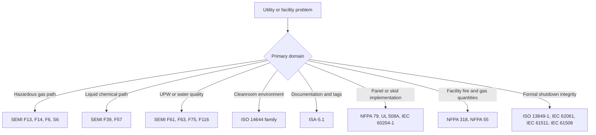

  Industry Reference — Semiconductor Facility
  <h1>Semiconductor Facility Utility Systems</h1>

This section covers the facility-side utility infrastructure that powers and interfaces with semiconductor process tools. It is distinct from equipment-oriented SEMI content (S2/S8/S14) — it addresses the building, utility, and controls layer that tools depend on.

---

## Scope

Semiconductor fabs run multiple interdependent utility systems. Each system has its own control philosophy, instrumentation requirements, and standards layer. This reference covers:

| System | Description |
|--------|-------------|
| [Bulk Specialty Gas](bulk-specialty-gas/) | Gas storage, rooms, cabinets, VMBs, purge panels, tool interface points |
| [Gas Cabinet Reference](gas-cabinet/) | Cabinet-level architecture, purge sequence, interlocks, trips, alarm philosophy, and tool handshake |
| [UPW and Wastewater](upw-wastewater/) | Ultrapure water generation, distribution, reclaim, and drain segregation |
| [Exhaust and Abatement](exhaust-abatement/) | Process exhaust, toxic/corrosive capture, abatement support, vacuum |
| [HVAC and Cleanroom](hvac-cleanroom/) | Room pressure cascade, FFU systems, temperature/humidity, particle monitoring |
| [Bulk Chemical Distribution](bulk-chemical/) | Bulk storage, transfer skids, blend systems, containment, drain segregation |
| [Safety and Shutdown Architecture](safety-shutdown/) | Shutdown layers, gas/leak detection integration, cause-and-effect design |
| [Common Control Philosophy](control-philosophy/) | Modes, states, permissives, interlocks, trips, and shutdown ownership |
| [Tool-Facility Interface](tool-facility-interface/) | Handshake signals, battery limit definition, permit-to-run logic |
| [Instrumentation](instrumentation/) | Device selection by system, compliance lens, and manufacturer families |
| [Commissioning Reference](commissioning/) | Phase-by-phase commissioning framework, readiness criteria, and documentation minimums |
| [System and Standards Crosswalks](crosswalks/) | System-to-system dependencies and standards-to-systems mapping |

---

## Standards Stack for Facility Work

The standards that govern semiconductor facility engineering span several families. Use this map to select the right entry point for a given problem.

### Standards family quick reference

| Family | What it governs | Typical systems |
|--------|-----------------|-----------------|
| SEMI F13 | Gas source control equipment (cylinder to point-of-use) | Gas panels, source control assemblies |
| SEMI F14 | Gas source equipment enclosures | Gas cabinets, enclosed gas source equipment |
| SEMI F6 | Secondarily contained hazardous gas piping | Hazardous gas distribution |
| SEMI S6 | Exhaust ventilation for semiconductor manufacturing equipment | Gas cabinets, exhausted enclosures, wet process tools |
| SEMI F39 | Chemical blending systems | Blend skids, make-up systems |
| SEMI F57 | High-purity polymer materials for UPW and liquid chemical paths | UPW distribution, chemical distribution |
| SEMI F61 | UPW system design and operation | UPW plant and distribution |
| SEMI F63 | UPW quality guidance | UPW quality and acceptance |
| SEMI F75 | UPW quality monitoring | UPW analyzers |
| SEMI F116 | Drain segregation for water reuse | Tool drains, reclaim |
| SEMI S2 / S14 | Equipment safety and fire-risk framing | All tool and utility packages |
| NFPA 318 | Semiconductor-fab fire and life safety | Fab-wide facility design |
| NFPA 55 | Compressed gas and cryogenic fluids | Gas storage and distribution |
| ISO 14644 | Cleanroom classification, design, monitoring | Cleanroom environment |
| ISA-5.1 | Instrument symbols, tags, and P&ID documentation | All systems |
| NEC / NFPA 79 / UL 508A | Electrical installation and panel construction | Electrical distribution, packaged skids |
| IEC 61511 / IEC 61508 | Process safety lifecycle | Critical shutdown logic |

> Standards that are already covered in depth elsewhere on this site are linked in the [See Also](#see-also) section below.

---

## Cross-cutting Design Threads

These considerations apply across all facility utility systems:

- **Material compatibility** affects sensors, valves, tubing, seals, and maintenance frequency. Confirm wetted materials before committing to a device family.
- **Exhaust or ventilation proof** is often a prerequisite for enabling gas and chemical flows. Prove capture, not just motor status.
- **Leak detection and gas monitoring** must tie back to defined safe states and shutdown sequences, not just annunciation.
- **Alarm philosophy** should separate permissives, interlocks, trips, and operator advisories from the start.
- **Tool utility handshakes** should explicitly state who owns the final shutdown action: facility system, packaged skid, or tool controller.
- **Instrument selection** should document process media, cleanliness class, wetted materials, range, accuracy, diagnostics, calibration method, and hazardous-area requirements together.

---

## See Also

- [Semiconductor Equipment Standards](/industries/semiconductor/) — equipment-oriented SEMI coverage (S2/S8/S14)
- [SEMI S2/S8/S14](/standards/semiconductor/semi/) — equipment safety and ergonomics standards
- [IEC 61511 — Functional Safety: SIS](/standards/functional-safety/iec-61511/) — process safety lifecycle
- [IEC 61508 — Functional Safety](/standards/functional-safety/iec-61508/) — safety integrity and lifecycle
- [Software Stack](/design/software-stack/) — PLC, DCS, SIS software choices
- [Safety Architecture (Lifecycle Stage 04)](/lifecycle/safety-architecture/) — safety function design methodology
- [Commissioning Templates](/lifecycle/guides/commissioning-templates/) — field validation checklists
