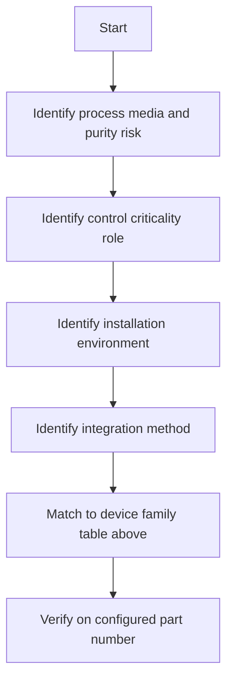

  Semiconductor Facility — Instrumentation
  <h1>Device Family Library</h1>
  Phase 23

This page groups instrument device families by engineering function and typical fab utility usage. Use it to identify which family fits a measurement point before selecting a specific product.

> **Read this correctly:** "Typical service" describes where a family is commonly used in semiconductor fabs — it is not a compatibility guarantee. Always verify wetted materials and service fit on the configured model.

---

## Pressure and Differential Pressure

| Device family | Typical fab service | Main engineering concern | Typical failure concern |
|---|---|---|---|
| Pressure transmitters | UPW, chemicals, CDA, gases, exhaust | wetted materials, cleanability, range selection | drift, plugging, diaphragm attack |
| Pressure switches | permissives, fan proof, gas cabinet status | discrete trip point integrity | nuisance trips, hidden setpoint drift |
| Differential pressure transmitters | room cascade, filter loading, exhaust proof | low-range stability, impulse path design | clogging, zero drift |
| Low-DP transmitters | room pressure cascade, AHU filter loading | range overlap with installation noise | clogging, installation-induced error |
| Capacitance manometers and vacuum gauges | tool vacuum, low-pressure gas service | pressure regime fit, contamination tolerance | contamination, zero shift |

---

## Flow

| Device family | Typical fab service | Main engineering concern | Typical failure concern |
|---|---|---|---|
| Electromagnetic flowmeters | conductive liquids and water systems | conductivity dependence, liner compatibility | coating, grounding issues |
| Coriolis flowmeters | accurate chemical dosing or transfer | compatibility, density effects, cleanability | coating, entrained gas |
| Ultrasonic flowmeters | non-invasive utility monitoring | pipe installation and signal quality | poor coupling, low signal |
| Thermal mass flow sensors | exhaust and gas utilities | gas composition assumptions | fouling, contamination |
| Mass flow controllers and meters | process gas and specialty gas lines | gas calibration, cleanliness, control response | zero drift, contamination |

---

## Level

| Device family | Typical fab service | Main engineering concern | Typical failure concern |
|---|---|---|---|
| Radar and non-contact level | bulk tanks and day tanks | tank geometry, foam, dielectric behavior | false echoes, buildup |
| Point level switches | overfill, backup permissive, dry run protection | compatibility and proof testing | sticking, coating |

---

## Temperature

| Device family | Typical fab service | Main engineering concern | Typical failure concern |
|---|---|---|---|
| Temperature transmitters and RTDs | UPW, chemicals, cleanroom air | accuracy class, immersion length, cleanability | drift, installation error |

---

## Analytical and Water Quality

| Device family | Typical fab service | Main engineering concern | Typical failure concern |
|---|---|---|---|
| Conductivity and resistivity analyzers | UPW quality and wastewater | sample system, calibration method, cell constant | fouling, sample temperature effects |
| TOC analyzers | UPW TOC monitoring | sample conditioning, response time | fouling, reagent management |
| pH and ORP sensors | scrubber effluent, chemical neutralization | reference junction, coating, maintenance access | junction fouling, coating |
| Dissolved oxygen sensors | wastewater polishing and cooling | membrane fouling, calibration in process | membrane failure, low signal |

---

## Gas Detection

| Device family | Typical gas targets | Main engineering concern | Typical failure concern |
|---|---|---|---|
| Electrochemical gas detectors | HF, Cl₂, NH₃, HCl, and similar toxic gases | response time, cross-interference, bump-test discipline | sensor expiry, contamination |
| Photoionization detectors | VOC screening | concentration range, correction factors | lamp fouling, high humidity |
| Infrared gas detectors | combustible or specific gas species | gas-specific calibration | window fouling, humidity effects |

---

## Cleanroom and Environmental

| Device family | Typical fab service | Main engineering concern | Typical failure concern |
|---|---|---|---|
| Particle counters | cleanroom classification and monitoring | isokinetic sampling, sensor location | sampling errors, maintenance intervals |
| Low-DP transmitters | room cascade, AHU filter loading | range overlap with installation noise | clogging, installation-induced error |

---

## Selection Guidance

Device family selection follows this priority order:

**Control criticality roles:**

| Role | Meaning |
|------|---------|
| `SAFETY_TRIP` | initiates isolation, shutdown, or emergency response |
| `PERMISSIVE` | blocks start until a safe precondition is met |
| `CONTROL` | feeds a loop or sequence decision |
| `QUALITY` | confirms process media quality (UPW resistivity, TOC) |
| `MONITORING` | informs operators without directly changing control |

Higher criticality demands tighter requirements for proof, diagnostics, testing access, and ownership assignment.

---

## See Also

- [Instrumentation Reference](../) — selection flow and compliance lenses overview
- [Vendor Families](../vendor-families/) — manufacturer comparison by measurement class
- [Alarm and Measurement Strategy](../alarm-strategy/) — alarm classes, measurement windows, safe-state design
- [Common Control Philosophy](../../control-philosophy/) — permissive and interlock patterns
