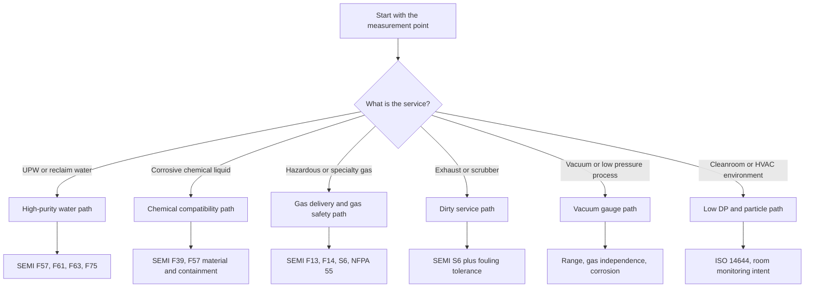

  Semiconductor Facility — Instrumentation
  <h1>Facility Instrumentation Reference</h1>
  Phase 22

This page covers instrument selection across semiconductor facility utility systems. It organizes by system and measurement type, includes a compliance lens for each application, and notes common manufacturer families.

> **Read this correctly:** The `Verify on selected product` column tells you what to check on the exact configured part number — not on the family page. A listed manufacturer is a common fit, not an automatic approval.

---

## Selection Flow

---

## Compliance Lenses

| Lens | What it means in practice |
|------|--------------------------|
| SEMI utility lens | Semiconductor-specific utility, purity, enclosure, or water-quality guidance shapes the application |
| Code and fire lens | NFPA, NEC, adopted code, and gas quantity or hazardous-use context shapes the installation |
| Documentation lens | ISA-5.1 and related documentation rules shape tag names and drawings |
| Safety-execution lens | SIL, hazardous-area approvals, or formal shutdown architecture shape the device choice |
| Cleanroom lens | ISO 14644 and contamination-control goals shape the measurement |

---

## Use Matrix

### UPW and Water Quality

| System / use | Variable | Preferred technology | Compliance lens | Verify on selected product | Common manufacturer families |
|-------------|---------|---------------------|----------------|---------------------------|------------------------------|
| UPW generation and distribution | Flow | Electromagnetic flowmeter — compatible liner and electrodes | SEMI F57, F61, F63, F75; ISA-5.1 | Wetted materials, liner chemistry, surface finish, calibration traceability | Endress+Hauser Promag H, Siemens SITRANS FM MAG; Flexim clamp-on for retrofit |
| UPW generation and distribution | Pressure | High-stability piezoresistive or silicon resonant transmitter | SEMI F61; ISA-5.1; safety-execution lens if in trip logic | 316L wetted parts, material certs, long-term stability, proof-test method | Yokogawa EJX A/EJX S, WIKA HYDRA / WUD-2x, Emerson Rosemount 3051, Endress+Hauser Cerabar |
| UPW quality | Resistivity / conductivity | Contacting 2-electrode sensor with high-purity water analyzer | SEMI F61, F63, F75; ISA-5.1 | ASTM/NIST traceable calibration, semiconductor water suitability, temperature compensation | METTLER TOLEDO Thornton M800 / UniCond, Yokogawa FLXA402, Endress+Hauser Liquiline |
| UPW quality | TOC | Online TOC analyzer — purpose-built for high-purity water | SEMI F63, F75; ISA-5.1 | Oxidation method, response time, maintenance interval, sample conditioning | METTLER TOLEDO Thornton ecosystem; Veolia/Sievers M500/M9 family context |
| UPW and reclaim drains | pH / ORP | Electrochemical analyzer with chemical-duty electrodes | SEMI F116; ISA-5.1 | Sensor chemistry, calibration access, cleaning method, analyzer outputs | Yokogawa FLXA402, Endress+Hauser Liquiline, METTLER TOLEDO process lines |
| UPW and reclaim | Level (storage tanks) | Non-contact radar or ultrasonic level | SEMI F61; ISA-5.1 | Antenna material, buildup tolerance, high-purity suitability | Endress+Hauser Micropilot, VEGA VEGAPULS 6X |
| UPW quality (special chemistry) | Dissolved ozone or targeted specialty chemistry | Dedicated pure-water analytics platform with compatible sensors | SEMI F61, F75 | Sample conditioning, calibration traceability, temperature effects | METTLER TOLEDO Thornton, Yokogawa, Endress+Hauser depending on parameter |

### Bulk Chemical and Wet Process

| System / use | Variable | Preferred technology | Compliance lens | Verify on selected product | Common manufacturer families |
|-------------|---------|---------------------|----------------|---------------------------|------------------------------|
| Bulk chemical storage / day tanks | Level | Non-contact radar level | SEMI F39, F57; code and fire lens; ISA-5.1 | Chemical compatibility, buildup tolerance, false echo handling, independent overfill | VEGA VEGAPULS 6X, Endress+Hauser Micropilot, Siemens SITRANS Probe (simpler duty) |
| Bulk chemical transfer | Flow | Coriolis (dosing-critical); magmeter (conductive, materials fit) | SEMI F39, F57; ISA-5.1 | Wetted part compatibility, entrained-gas behavior, cleaning method, digital diagnostics | Emerson Micro Motion ELITE/G-Series, Endress+Hauser Promass / Promag H |
| Chemical storage and transfer | Pressure | Flush or chemically isolated transmitter | SEMI F39, F57; code and fire lens | Diaphragm material, fill fluid (if any), flush geometry, material certs, hazardous-area approval | WIKA, Yokogawa, Emerson, Endress+Hauser |
| Chemical blend / prep skid | pH / ORP | Electrochemical analyzer with matched sensor and reference | SEMI F39; ISA-5.1; safety-execution lens if tied to neutralization limits | Sensor chemistry fit, temperature compensation, calibration access, cleaning method | Yokogawa FLXA402, Endress+Hauser Liquiline, METTLER TOLEDO process analytics |

### Gas Systems

| System / use | Variable | Preferred technology | Compliance lens | Verify on selected product | Common manufacturer families |
|-------------|---------|---------------------|----------------|---------------------------|------------------------------|
| Gas cabinets, VMBs, gas panels | Mass flow | Metal-sealed thermal MFC for high-purity gas | SEMI F13, F14, S6; NFPA 55; safety-execution lens where flow is in shutdown logic | Seal type, gas compatibility, pressure transient behavior, communication option, panel footprint | Brooks GF100/GF80/GP200, HORIBA SEC-Z500X/DZ-107, MKS GM50A/C-Series |
| Gas cabinets and hazardous gas areas | Pressure | Compact UHP pressure transducer or switch | SEMI F13, F14; NFPA 55; safety-execution lens for trip service | UHP cleanliness, pressure boundary integrity, fitting style, response time, digital interface | WIKA HYDRA / WUD-2x, MKS pressure lines, Yokogawa / Rosemount at non-UHP utility boundaries |
| Hazardous gas monitoring | Toxic gas or oxygen | Electrochemical fixed detector; Chemcassette for ultra-low concentration specialty toxic | SEMI S6, S2; NFPA 55, 318; safety-execution lens (IEC 61508, Ex approvals) | Target-gas list, cross-sensitivity, bump-test method, SIL capability, ATEX/IECEx/UL/CSA, HART/Modbus | Dräger Polytron 7000/8100, Honeywell Vertex Edge / Chemcassette platforms, Teledyne DG7 / OLCT 100 |
| Chemical leak or liquid presence | Leak detection | Rope, point, or conductive leak sensor — matched to chemical area | SEMI utility for containment; code and fire lens | Cable compatibility, sensing liquid, reset method, failsafe behavior | TTK and similar leak-detection specialists |

### Exhaust and Vacuum

| System / use | Variable | Preferred technology | Compliance lens | Verify on selected product | Common manufacturer families |
|-------------|---------|---------------------|----------------|---------------------------|------------------------------|
| Exhaust ducts, cabinets, scrubber inlets | Exhaust proof / airflow | Thermal mass flow or differential pressure — prove capture not motor status | SEMI S6; code and fire; safety-execution lens if loss forces isolation | Fouling tolerance, duct mounting, maintenance access, alarm validation method | Kurz thermal flow; Teledyne and similar airflow families; Rosemount, Yokogawa, Setra DP transmitters |
| Wet scrubbers / wastewater neutralization | pH / ORP | Industrial analyzer with chemical-duty electrodes | SEMI utility — wastewater and chemical context; ISA-5.1 | Electrode chemistry, cleaning interval, digital outputs, sample conditioning | Yokogawa, Endress+Hauser, METTLER TOLEDO process analytics |
| Vacuum foreline / process vacuum | Pressure / vacuum | Capacitance manometer for gas-independent pressure in relevant range | Semiconductor process lens; safety-execution lens when in control loop | Pressure range, heated or unheated body, corrosion tolerance, communication protocol, response time | MKS Baratron, INFICON PCG/Stripe CDG100Dhs, Pfeiffer CenterLine CNR/CMR |

### Cleanroom and Environment

| System / use | Variable | Preferred technology | Compliance lens | Verify on selected product | Common manufacturer families |
|-------------|---------|---------------------|----------------|---------------------------|------------------------------|
| Cleanroom room cascade | Low differential pressure | Very low DP transducer — capacitance sensing, stable zero | Cleanroom lens: ISO 14644; ISA-5.1 | Zero stability, display, BACnet/Modbus/analog output, calibration method, install location | Setra 264 / FLEX, Dwyer MagneSense, TSI room monitoring platforms |
| Cleanroom and critical utilities | Particles | Optical airborne particle counter; CPC for sub-100 nm | Cleanroom lens: ISO 14644-1; ISO 21501-4 | Particle size channels, flow rate, fixed vs portable, calibration, data export | TSI AeroTrak+ A100, TSI AeroTrak 9001 CPC, Lighthouse product families |
| Rotating utility equipment | Vibration / condition | Vibration sensor or condition monitor — fans, pumps, scrubber motors | Documentation lens; plant maintenance program | Mount style, signal type, frequency range, maintenance software integration | IFM and broader condition monitoring vendors |

---

## Technology Notes

### Pressure Transmitters
- **Piezoresistive** — broad utility use; common in compact industrial and hygienic models
- **Thin-film / welded metal cell** — rugged OEM and general utility pressure service
- **Silicon resonant** (Yokogawa EJX) — high accuracy and long-term stability
- **Capacitance diaphragm** — high-accuracy vacuum and low-pressure process; central to semiconductor vacuum service

### Flowmeters
- **Electromagnetic** — strongest fit for conductive liquids (UPW, reclaim water, some chemicals); liner and electrode materials must fit
- **Coriolis** — direct mass flow, density, dosing accuracy
- **Clamp-on ultrasonic** — retrofit and non-invasive; useful when in-line wetted meter is not acceptable
- **Thermal mass** — gas and exhaust measurement; depends heavily on gas assumptions and contamination management

### Gas Flow Control (MFCs)
- **Metal-sealed thermal MFC** — standard semiconductor gas-panel choice; low leak, multi-gas
- **Pressure-based MFC** — attractive for low-vapor-pressure or highly dynamic pressure conditions
- **MEMS MFC** — fast response, compact; check corrosive-gas suitability before selecting

### Gas Detection
- **Electrochemical** — common for toxic gases and oxygen; established transmitter platforms
- **Catalytic bead** — combustible gas detection
- **MOS** — selected gas-detection platforms; check specificity and stability
- **Chemcassette / spectroscopic** — high-tech toxic gas systems needing low-level detection and selectivity

---

## Engineering Cautions

- Do not treat hygienic approvals (3-A, EHEDG) as equivalent to semiconductor high-purity suitability
- Do not assume SIL or hazardous-area approvals shown on a product family page apply to every configured model — check the specific part number
- Do not assume a protocol shown on one family option is available in every body style or size
- For semiconductor gas service: confirm whether the product line is elastomer-sealed, metal-sealed, or explicitly positioned for UHP service
- For UPW: treat sample tubing, sensor mounting, calibration fluid, and maintenance procedure as part of the measurement system — not just the sensor body

---

## In This Section

| Page | What it covers |
|------|---------------|
| [Device Family Library](device-families/) | Device families grouped by function — typical service, main concerns, failure modes |
| [Vendor Families](vendor-families/) | Manufacturer comparison by measurement class: pressure, flow, UPW, MFCs, gas detection, level, vacuum |
| [Alarm and Measurement Strategy](alarm-strategy/) | Alarm philosophy, utility measurement windows, alarm classes, safe-state design |

---

## See Also

- [Bulk Specialty Gas Systems](/industries/semiconductor/facility/bulk-specialty-gas/) — gas instrumentation in context
- [UPW and Wastewater Systems](/industries/semiconductor/facility/upw-wastewater/) — water quality instrumentation in context
- [Exhaust and Abatement Systems](/industries/semiconductor/facility/exhaust-abatement/) — airflow and exhaust proof in context
- [Tool-Facility Interface](/industries/semiconductor/facility/tool-facility-interface/) — instrument signals at the facility-tool boundary
- [IEC 61511 — SIS Lifecycle](/standards/functional-safety/iec-61511/) — when instrument selection must support a SIL-rated function
- [Glossary](/tools/glossary/) — SIL, PL, SCCR, and other terms used across this page
