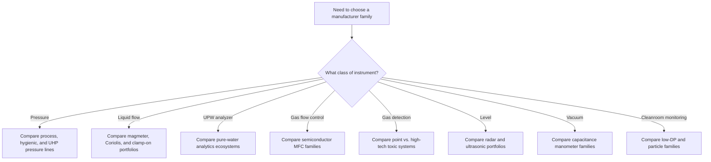

  Semiconductor Facility — Instrumentation
  <h1>Vendor and Manufacturer Families</h1>
  Phase 23

This page compares common manufacturer families by measurement class. It is organized by what they measure — not by brand — so you can compare vendors where they actually compete.

> **How to read this page:** `Best fit` means where a family is strongest based on its public positioning and features. `Watch item` means what typically disqualifies it when the application is more demanding than it looks. This page does not rank vendors by absolute market share except where a vendor makes an explicit public claim.

---

## Vendor Selection Flow

---

## Pressure Transmitters

| Manufacturer | Key product families | Core angle | Best fit | Watch item |
|---|---|---|---|---|
| Emerson / Rosemount | `3051`, `3051S`, `3051HT` | Mature general-purpose and hygienic platform, broad plant familiarity | Facility utilities, skid pressure, level via DP, hygienic skid pressure | Verify wetted parts on the configured model, especially in high-purity liquid service |
| Yokogawa | `EJX A`, `EJX S` | Silicon resonant sensor, focused on long-term accuracy and stability | Water, chemical, gas utility pressure where stable transmitters are preferred | Not a semiconductor UHP specialist family; suits utility boundary, not gas-panel internals |
| WIKA | `HYDRA`, `WUD-2x`, `S-20`, `O-10` | Spread from semiconductor UHP transducers to rugged OEM industrial | UHP gas-panel pressure, compact machine-skid, OEM utility packages | Do not confuse general WIKA industrial lines with semiconductor-UHP lines |
| Endress+Hauser | `Cerabar PMP43`, `PMP71`, `PMP21/23` | Strong process and hygienic portfolio | Chemical and utility pressure, hygienic skid, level by hydrostatic | Process-centric; check contamination fit before assuming semiconductor suitability |

---

## Liquid Flow Measurement

| Manufacturer | Key product families | Core angle | Best fit | Watch item |
|---|---|---|---|---|
| Endress+Hauser | `Promag H`, `Promag H 200/500`, `Promass` | Magmeter strength in lined hygienic and chemical service | Conductive UPW and chemical flow, PFA-lined high-purity lines | Confirm conductivity and material fit; mag is not universal |
| Emerson / Micro Motion | `ELITE`, `G-Series` | Direct mass flow and density, strong diagnostics, compact Coriolis | Precise chemical transfer, blend, dose, or skid flow | Cost, weight, and entrained-gas behavior need per-application review |
| Siemens | `SITRANS FM MAG 3100`, `SITRANS F` | Broad process-industry flow platform, modular transmitter | General process liquid, chemical and water systems | Not purpose-built for semiconductor high-purity duty |
| Emerson / Flexim | Clamp-on ultrasonic | Non-invasive retrofit and verification | Retrofit checks, temporary studies, no-cut-the-line situations | Not first choice for in-line custody of critical control loops at small flows |

---

## Pure-Water Analyzers

| Manufacturer | Key product families | Core angle | Best fit | Watch item |
|---|---|---|---|---|
| METTLER TOLEDO Thornton | `M800`, `770MAX`, `UniCond` | Pure and ultrapure water analytics with semiconductor heritage | UPW resistivity/conductivity, integrated pure-water monitoring | Verify exact sensor is targeted at UPW vs. general pure-water duty |
| Yokogawa | `FLXA402` and conductivity/resistivity family | Modular liquid analyzer, multiple measurement methods | Plants wanting one analyzer family across wastewater, scrubber, and some UPW | Broader focus; sample-system design matters if pushing into most demanding UPW duty |
| Endress+Hauser | `Liquiline` family | Broad multichannel analytical platform | Standardizing one family across water, wastewater, and chemical | Use care in ultrapure applications where semiconductor analytics heritage matters |
| Veolia / Sievers | `M9`, `M500` | TOC-focused water analytics | TOC-critical monitoring and pure-water quality programs | Product discovery is less straightforward; confirm exact semiconductor-fit model early |

---

## Semiconductor Gas Flow Control (MFCs and MFMs)

| Manufacturer | Key product families | Core angle | Best fit | Watch item |
|---|---|---|---|---|
| Brooks Instrument | `GF100`, `GF80`, `GP200`, `GF120xHT`, `5850EM(H)` | Deep semiconductor gas control: thermal, pressure-based, safe-delivery, high-temperature | Etch, deposition, implant, high-purity gas-panel work | Choose carefully between metal-sealed, pressure-based, and elastomer families — not interchangeable |
| HORIBA STEC | `SEC-Z500X`, `S600`, `DZ-107`, `SEC-N100` | Broad semiconductor MFC lineup including multi-range/multi-gas and ultra-thin formats | Dense gas panels, semiconductor OEMs, wide STEC ecosystem | Determine whether duty needs ultra-thin, high-temperature, general-purpose, or multi-range before standardizing |
| MKS Instruments | `GM50A`, `C-Series` | Strong semiconductor and advanced-process heritage; MEMS fast-response option | High-purity gas panels, fast-response non-corrosive gas control | `C-Series` is explicitly for non-corrosive gases only — do not assign to corrosive specialty gas duty |

---

## Fixed Gas Detection

| Manufacturer | Key product families | Core angle | Best fit | Watch item |
|---|---|---|---|---|
| Dräger | `Polytron 7000`, `Polytron 8100 EC` | Robust electrochemical toxic and oxygen detection, broad gas list | Point toxic gas or oxygen monitoring in gas rooms, cabinets, exhausted spaces | Point detectors still need zoning, sample access, and bump-test strategy |
| Honeywell | `Vertex Edge`, Chemcassette, infrared-spectroscopy systems | System-level toxic gas monitoring for high-tech environments | High-tech and semiconductor toxic gas monitoring with remote sampling capability | Portfolio spans full systems — project scope and maintenance burden must be understood early |
| Teledyne Gas & Flame | `DG7`, `OLCT 100` | Multiple sensing technologies: electrochemical, MOS, catalytic/MEMS | Broad industrial toxic/combustible monitoring where one family covers many sensor types | Wide sensor choice requires per-gas technology verification |

---

## Level Measurement

| Manufacturer | Key product families | Core angle | Best fit | Watch item |
|---|---|---|---|---|
| Emerson / Rosemount | `5408` non-contacting radar | Reliable non-contact radar for process and storage tanks | Bulk tanks, day tanks, vessels where contact is undesirable | Confirm dielectric and geometry fit for foam-prone or low-dielectric media |
| Endress+Hauser | `Micropilot FMR series` | Wide radar portfolio from basic storage to advanced process | Standard bulk and process-level needs | Foam and low dielectric can reduce reliability; verify application conditions |
| Vega | `VEGAPULS`, `VEGAFLEX`, `VEGAPOINT` | Radar and guided-wave radar with strong handling of foam, condensate, and aggressive media | Chemical tanks, day tanks, waste collection | Verify guided-wave fit vs. non-contact for specific media and geometry |

---

## Vacuum Gauges and Capacitance Manometers

| Manufacturer | Key product families | Core angle | Best fit | Watch item |
|---|---|---|---|---|
| MKS Instruments | `Baratron` family | Established capacitance manometer with broad process-tool heritage | Process-tool vacuum, low-pressure gas, pressure-based MFC reference | Range selection and gas-independence claims must be checked for the specific subtype |
| INFICON | `CDG series` | Ceramic-diaphragm capacitance manometer with focus on corrosive-gas compatibility | Corrosive and aggressive gas service in semiconductor process tools | Verify exact model for corrosive media; not all CDG variants have the same wetted materials |
| Pfeiffer Vacuum | `CMR series` | Compact capacitance manometer for vacuum and process gas | Process vacuum and low-pressure gas panel measurement | Confirm range, media, and cleaning requirements before deploying in corrosive gas paths |

---

## Cleanroom Environmental Monitoring

| Manufacturer | Key product families | Core angle | Best fit | Watch item |
|---|---|---|---|---|
| Setra Systems (Fortive) | `Model 264`, `Model 267`, `Model 3100` | Room differential pressure with strong cleanroom and controlled-environment positioning | Room cascade and pressure differential monitoring | Low-range stability requires proper placement; door-opening disturbances must be budgeted |
| Dwyer Instruments | `Series 616/616D`, `Photohelic` | Broad low-DP portfolio from basic to differential pressure controllers | HVAC filter loading, pressurization monitoring, general facility | Semiconductor-facility service may have different stability requirements than general HVAC use |
| Lighthouse Worldwide Solutions | `Apex Z`, `Remote` family | Continuous airborne particle counting for cleanroom classification | Online cleanroom monitoring, ISO 14644-2 ongoing verification | Sample tubing, isokinetic design, and periodic instrument validation plan must exist |

---

## See Also

- [Device Family Library](../device-families/) — device family groupings by function and typical service
- [Instrumentation Reference](../) — selection flow and compliance lenses overview
- [Alarm and Measurement Strategy](../alarm-strategy/) — measurement windows and alarm class definitions
- [Common Control Philosophy](../../control-philosophy/) — how instruments connect to control logic

---

  

