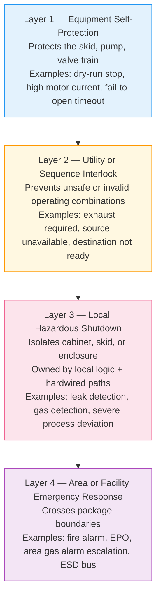

  Semiconductor Facility — Safety Architecture
  <h1>Safety and Shutdown Architecture</h1>

This page maps the shutdown layers that appear across semiconductor facility utility systems — how they are structured, what inputs they respond to, what actions they take, and what documentation must exist before commissioning.

---

## Shutdown Layer Model

Semiconductor facility shutdowns follow a layered architecture. Each layer has different scope, ownership, and reset authority.

A lower layer must never override a higher layer. Layer 4 inputs always take priority regardless of local mode or operating state.

---

## Layer Definitions

### Layer 1 — Equipment Self-Protection

- Scope: individual device or package
- Ownership: local device firmware or local PLC
- Reset: local, typically automatic after fault clears
- Examples:
  - Pump dry-run stop (low level or no-flow interlock)
  - Motor overcurrent trip
  - Valve fail-to-open or fail-to-close timeout
  - Heater over-temperature cutout

### Layer 2 — Utility or Sequence Interlock

- Scope: system sequence or operating condition
- Ownership: local or facility PLC
- Reset: requires acknowledgment or manual reset after condition clears
- Examples:
  - Gas flow blocked until exhaust is proven
  - Chemical transfer blocked until destination level is valid
  - Source isolated because supply is unavailable

### Layer 3 — Local Hazardous Shutdown

- Scope: cabinet, skid, enclosure, or process area
- Ownership: local logic + hardwired shutdown path (not network-only)
- Reset: operator action required after cause is resolved; documented reset procedure
- Examples:
  - Gas detection in cabinet — close isolation valves, force purge, annunciate
  - Chemical leak detection — stop transfer pump, close inlet, annunciate
  - High-pressure condition beyond safe operating range

### Layer 4 — Area or Facility Emergency Response

- Scope: crosses package and system boundaries
- Ownership: facility ESD bus, fire alarm system, or emergency response system
- Reset: requires investigation, sign-off, and often supervisor authorization
- Examples:
  - Fire alarm activation — drops power or initiates area-wide gas isolation
  - Area emergency power off (EPO) — removes power from all non-critical loads
  - Area gas alarm escalation — simultaneous detection triggers facility-wide response

---

## Core Design Rules

| Rule | Why it matters |
|------|---------------|
| Define safe state for each hazard scenario, not just each piece of equipment | Safe state is scenario-dependent — a pump stop is not always the safe action for a chemical leak |
| Same input may alarm locally but trip only under a voting, persistence, or zone rule | Single-sensor trips create nuisance shutdowns; voting logic with persistence prevents false trips without masking real events |
| Hardwired shutdown paths must be documented separately from SCADA alarms | Network-based alarms are advisory until proven reliable in all failure modes |
| Manual reset rules matter as much as trip rules | Automatic reset after hazard clearance re-enables a hazard before the cause is understood |

---

## Inputs That Commonly Participate in Shutdown Logic

| Input | Typical layer involvement |
|-------|--------------------------|
| Hazardous gas detection | Layer 3 (local zone), Layer 4 (area escalation) |
| Chemical leak detection | Layer 3 (local system), Layer 4 (facility ESD if escalated) |
| Fire alarm | Layer 4 — always |
| Emergency power off (EPO) | Layer 4 — always |
| Exhaust loss | Layer 2 (block enable), Layer 3 (active shutdown if system running) |
| Overpressure | Layer 1 or Layer 3 depending on whether a pressure safety valve exists |
| Vacuum loss (where capture depends on it) | Layer 2 or Layer 3 depending on hazard |
| Abnormal temperature (where chemistry or materials are at risk) | Layer 1 or Layer 3 depending on consequence |

---

## Common Output Actions

| Action | Typical trigger layer |
|--------|----------------------|
| Isolate gas or chemical supply (close valves) | Layer 3, Layer 4 |
| Stop pump or heater | Layer 1, Layer 3 |
| Maintain or force exhaust | Layer 3 — exhaust loss is a shutdown input, not an output to disable |
| Enable purge sequence | Layer 3 after gas isolation |
| Remove permit-to-run from tool | Layer 2, Layer 3 |
| Generate local alarm | All layers |
| Generate supervisory alarm | Layer 2 and above |
| Notify area emergency response | Layer 4 |

---

## Instrument Design for Safety Functions

When a detection input participates in Layer 3 or Layer 4 shutdown, the instrument must meet additional requirements:

- **Proof testing** — periodic functional test to confirm the detector will respond when needed
- **Failure mode** — fail-safe (fail to alarm) is required for safety inputs; fail-silent is not acceptable
- **SIL compliance** — when the function is formalized under IEC 61508 or IEC 61511, the detector must meet the SIL hardware requirements
- **ATEX/IECEx/UL/CSA classification** — if the detector is installed in a classified hazardous area
- **Bump testing** — gas detectors require periodic bump test (functional test with test gas) regardless of SIL classification

---

## Documents That Must Exist Before Commissioning

| Document | Contents |
|----------|----------|
| Shutdown hierarchy | Which layers exist, what each owns, who resets each layer |
| Cause and effect matrix | Every initiating cause → every resulting action, by system |
| Reset authority table | Who can reset each layer, what conditions must be met first |
| Proof-test and maintenance plan | Frequency, method, and responsible party for critical detectors and shutdown devices |

---

## Standards Anchors

| Standard | Role |
|----------|------|
| IEC 61511 | Process safety lifecycle — applies when the shutdown function is a Safety Instrumented Function (SIF) requiring formal SIL design |
| IEC 61508 | Generic functional safety — underpins IEC 61511; applies when device SIL capability must be demonstrated |
| SEMI S2 / S14 | Equipment safety framing — shutdown logic at the tool boundary |
| SEMI S6 | Exhaust ventilation — exhaust loss as a shutdown trigger |
| NFPA 318 / NFPA 72 | Fire alarm integration with facility shutdown |
| NFPA 55 | Gas storage and emergency response context |
| ISA-18.2 | Alarm management — prevents alarm system saturation that masks safety-critical signals |

---

## See Also

- [Bulk Specialty Gas Systems](/industries/semiconductor/facility/bulk-specialty-gas/) — Layer 3 and 4 shutdown for gas hazards
- [Bulk Chemical Distribution](/industries/semiconductor/facility/bulk-chemical/) — leak detection and containment interlock design
- [Exhaust and Abatement Systems](/industries/semiconductor/facility/exhaust-abatement/) — exhaust loss as a shutdown input
- [Tool-Facility Interface](/industries/semiconductor/facility/tool-facility-interface/) — Layer 2/3 shutdown signals at the facility-tool boundary
- [Common Control Philosophy](/industries/semiconductor/facility/control-philosophy/) — how shutdown layers integrate with modes and sequences
- [Safety Architecture (Lifecycle Stage 04)](/lifecycle/safety-architecture/) — functional safety design methodology
- [IEC 61511 — SIS Lifecycle](/standards/functional-safety/iec-61511/) — formal process safety lifecycle
- [IEC 61508 — Functional Safety](/standards/functional-safety/iec-61508/) — safety integrity requirements for devices
