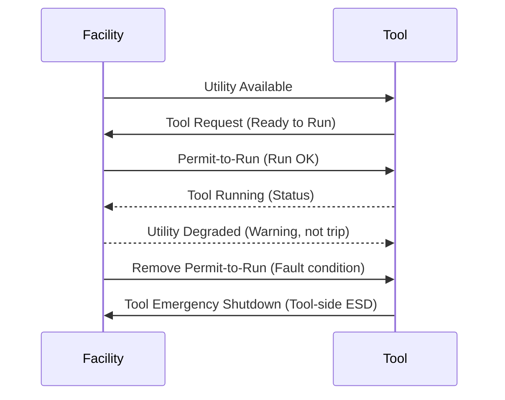

  Semiconductor Facility — Interface Engineering
  <h1>Tool-Facility Interface (TFI)</h1>
  Phase 22

This page defines the engineering boundary between facility utilities and semiconductor process tools — covering physical connections, signal exchange, permit-to-run logic, and fault ownership.

---

## Why This Boundary Matters

Many startup and commissioning problems originate from unclear ownership at the hookup point. A tool may assume the facility proves one condition; the facility assumes the tool handles it internally. Neither documents the assumption, and the interface fails in a way that neither side expected.

Defining the interface explicitly — before commissioning — prevents the most expensive category of handshake failures.

---

## Interface Categories

| Category | What it covers |
|----------|---------------|
| Utility supply availability | Gas, UPW, chilled water, vacuum, compressed air — facility proves delivery at the battery limit |
| Permit-to-run and ready signals | Facility tells the tool it may run; tool requests run authorization from facility |
| Exhaust and cooling prove | Exhaust capture proven, cooling supply confirmed at required conditions |
| Fault and shutdown exchange | Which faults are advisory; which remove permit-to-run; which force immediate shutdown |
| Communication or status integration | Hardwired signals vs. networked status; host interface handshakes |
| Maintenance and lockout coordination | Isolation authority during maintenance; what constitutes a lockable de-energized state |

---

## Minimum Questions for Every Utility Interface

Before commissioning any tool-facility connection, answer:

1. **Where is the physical battery limit?** (connection point, physical isolation valve, terminal block)
2. **Who owns final isolation for abnormal events?** (facility system, tool controller, or joint action)
3. **What signals are hardwired versus networked?** (hardwired signals survive communication failure; networked signals may not)
4. **Which faults are advisory only and which must remove permit-to-run?** (advisory vs. interlock classification)
5. **What is the startup order between facility package and tool controller?** (which proves what before the other enables)
6. **What states are allowed after a communications loss?** (fail-to-run vs. fail-to-stop vs. hold-last-state)

---

## Typical Handshake Signal Set

| Signal | Direction | Typical implementation |
|--------|-----------|------------------------|
| Facility Ready | Facility → Tool | Hardwired DO from facility PLC |
| Tool Request | Tool → Facility | Hardwired DI to facility PLC |
| Utility Available | Facility → Tool | Hardwired DO; each utility may have independent signal |
| Utility Degraded | Facility → Tool | Advisory — may be networked |
| Local Shutdown Active | Facility → Tool | Hardwired; facility-side ESD state |
| Emergency Shutdown Active | Facility → Tool | Hardwired; facility ESD bus |
| Reset Permitted | Facility → Tool | May be hardwired or networked; depends on recovery procedure |

---

## Fault Classification

Classify every fault at the interface before commissioning:

| Class | Definition | Response |
|-------|-----------|----------|
| Advisory | Condition worth knowing; does not affect tool operation | Log and annunciate; operator action required but not forced |
| Degraded | Operating outside target range but within acceptable limits | Annunciate; monitor; time-limited operation may be allowed |
| Interlock | Utility or safety condition not met; tool must not run | Remove permit-to-run; tool stops or is prevented from starting |
| Trip | Immediate hazard; remove permit and take safe-state action | Force immediate tool shutdown; facility takes protective action |

---

## SEMI E5 / E30 / E37 Relevance

When tool-facility communication extends into equipment or host integration:

- **SEMI E5 (SECS-I/SECS-II)** — physical and message layer for tool-to-host communication
- **SEMI E30 (GEM)** — Generic Equipment Model, defining how equipment interacts with factory host systems
- **SEMI E37 (HSMS)** — High-Speed Message Services — TCP/IP-based messaging between tools and hosts

These standards matter when the facility system participates in recipe handshakes, lot tracking, or automated run authorization that goes beyond simple utility prove signals.

---

## Documentation Outputs Worth Building

- **Interface Control Document (ICD)** — one document per tool type; states battery limits, signal list, and fault classification
- **Handshake truth table** — all combinations of utility states and the resulting permit-to-run condition
- **Signal ownership matrix** — who generates, who consumes, who resolves each signal
- **Startup and shutdown sequence** — explicit order between facility and tool controller
- **Fault escalation path** — from advisory through trip, with responsible party at each step

---

## Standards Anchors

| Standard | Role |
|----------|------|
| SEMI E5 / E30 / E37 | Equipment communications and host integration — when the interface includes automation |
| SEMI S2 / S14 | Equipment safety framing — affects shutdown authority and interlock architecture |
| NEC / NFPA 79 / UL 508A | Electrical design of facility panels and packaged skids at the interface |
| IEC 61511 | When a shutdown function at the interface requires formal SIL analysis |

---

## See Also

- [Bulk Specialty Gas Systems](/industries/semiconductor/facility/bulk-specialty-gas/) — gas cabinet permit-to-run logic
- [Exhaust and Abatement Systems](/industries/semiconductor/facility/exhaust-abatement/) — exhaust prove as a permit-to-run input
- [UPW and Wastewater Systems](/industries/semiconductor/facility/upw-wastewater/) — water utility handshake and quality alarm classification
- [SEMI S2/S8/S14](/standards/semiconductor/semi/) — equipment safety requirements that shape the interface
- [Safety Architecture (Lifecycle Stage 04)](/lifecycle/safety-architecture/) — designing safety functions at facility-tool boundaries
- [Pre-Commissioning (Lifecycle Stage 09)](/lifecycle/pre-commissioning/) — interface verification before live utility connection
