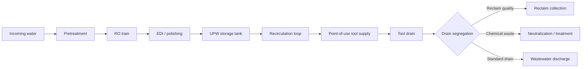

  Semiconductor Facility — Water Systems
  <h1>UPW and Wastewater Systems</h1>
  Phase 22

This page covers facility water systems that most directly affect semiconductor processing quality — from incoming water pretreatment through ultrapure water delivery, reclaim, and wastewater handling.

---

## Scope

- Pretreatment (softening, carbon filtration, UV)
- Reverse osmosis and polishing
- Electrodeionization (EDI) or ion exchange
- UPW storage and distribution
- Point-of-use quality support
- Reclaim and reuse interfaces
- Wastewater segregation and neutralization support

---

## Typical Architecture

---

## Main Engineering Objectives

- Deliver stable UPW quality to point of use
- Prevent contamination contribution from materials, components, and maintenance activities
- Preserve hydraulic stability and redundancy — avoid dead legs
- Segregate drains so reuse and treatment options remain available
- Monitor wastewater chemistry safely before discharge or downstream treatment

---

## Quality Variables

| Variable | Why it matters |
|----------|----------------|
| Resistivity / conductivity | Primary UPW quality indicator; sensitive to ionic contamination |
| TOC (Total Organic Carbon) | Indicates organic contamination from materials, seals, or maintenance |
| Particles | Process yield impact; particle monitoring is part of the quality system |
| Temperature | Affects resistivity measurement and microbial control |
| Flow and pressure | Recirculation stability; hydraulic balance for point-of-use delivery |
| pH / ORP | Wastewater treatment and neutralization monitoring |

---

## Control Philosophy

| Principle | Rationale |
|-----------|-----------|
| Treat quality analyzers as part of the process, not reporting accessories | Analyzer failure should trigger response, not just an alarm |
| Maintain recirculation stability and avoid dead legs | Stagnant sections introduce contamination and dead-leg risk |
| Define degraded-quality response before startup | Know the decision tree before a contamination event occurs |
| Separate water-quality alarms from mechanical alarms | Both must be actionable — mixing them obscures the response path |
| Document which drain streams can be reclaimed, reused, neutralized, or isolated | Drain routing decisions cannot be made reactively |

---

## Typical Instrumentation

| Measurement | Device / Method | Key considerations |
|-------------|-----------------|-------------------|
| Flow (UPW) | Electromagnetic flowmeter, compatible liner/electrodes | Wetted material compatibility, SEMI F57 lens |
| Pressure (UPW) | High-stability pressure transmitter | Long-term stability; material certs for wetted parts |
| Resistivity / conductivity | Contacting 2-electrode sensor with pure-water analyzer | ASTM/NIST traceable calibration; temperature compensation |
| TOC | Online TOC analyzer (purpose-built for high-purity water) | Oxidation method; response time; maintenance interval |
| Particles | Optical airborne or liquid particle counter | ISO 14644 / ISO 21501-4; calibration traceability |
| Tank level | Ultrasonic or guided-wave radar | Non-contact preferred to avoid contamination |
| pH / ORP (wastewater) | Industrial electrochemical analyzer, chemical-duty electrodes | Calibration discipline; maintenance access |

See the [Instrumentation Reference](/industries/semiconductor/facility/instrumentation/) for full device selection guidance.

---

## Common Failure Themes

- Contamination introduced during maintenance or construction activities
- Stagnant branches and dead legs — system design must minimize these
- Analyzer drift or poor sample handling — sample path is part of the measurement system
- Loss of recirculation stability — loop shutdown or pressure excursion
- Mixing reclaim streams that should remain segregated — consequences include treatment system overload

---

## Documentation Outputs Worth Building

- UPW treatment and distribution block diagram
- Point-of-use quality monitoring plan
- Reclaim and drain segregation matrix (which streams go where and why)
- Analyzer maintenance ownership table
- Startup and commissioning checklist for high-purity water systems

---

## Standards Anchors

| Standard | Role |
|----------|------|
| SEMI F61 | Design and operation of semiconductor UPW systems — system-level guide |
| SEMI F63 | UPW quality guidance — quality target layer |
| SEMI F75 | Quality monitoring of UPW — monitoring layer |
| SEMI F57 | Polymer materials and components for UPW and liquid chemical paths |
| SEMI F116 | Drain segregation to support site water reuse |

---

## See Also

- [Tool-Facility Interface](/industries/semiconductor/facility/tool-facility-interface/) — utility handshake and permit-to-run
- [Instrumentation Reference](/industries/semiconductor/facility/instrumentation/) — analyzer and sensor selection
- [Commissioning Templates](/lifecycle/guides/commissioning-templates/) — field validation checklists
- [IEC 61511 — SIS Lifecycle](/standards/functional-safety/iec-61511/) — when water-quality shutdown logic requires formal SIL treatment
