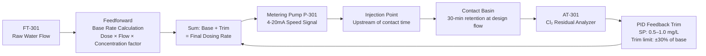
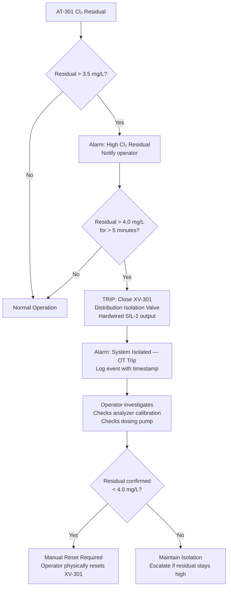
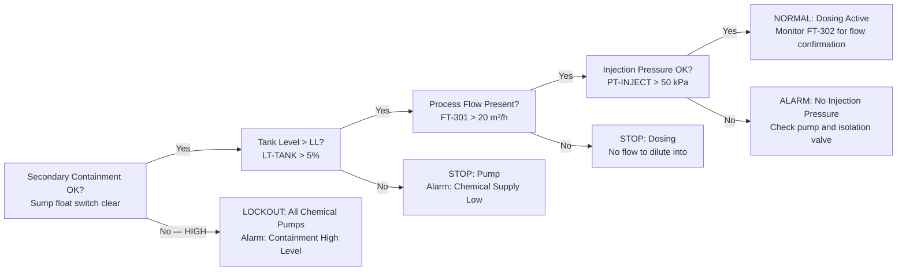

  Water/Wastewater — System Reference
  <h1>Chemical Dosing Systems</h1>

<blockquote>
<strong>Scope:</strong> Chlorination (disinfection), coagulant/flocculant dosing, and pH correction. Flow-paced dosing with residual feedback trim, over-treatment (OT) shutdown safety logic, and the chemical feed interlock chain.
</blockquote>

## Standards Applicability

| Standard | Role in this system |
|---|---|
| EPA SDWA | MCL for disinfection byproducts; SWTR residual requirements at distribution entry |
| IEC 61511 | OT shutdown (XV-301 isolation valve) is a SIF — SIL 1 minimum |
| ISA-18.2 | Alarm rationalization: low residual (early warning), OT alarm, containment high |
| NFPA 70 (NEC) | Chemical room wiring — GFCI in wet areas, corrosion-resistant conduit |

## Dosing Loop — Flow-Paced with Residual Feedback Trim

## Chlorine Over-Treatment Shutdown Logic

## Chemical Feed Interlock Chain

## Key Engineering Decisions

**Why a 5-minute delay on the OT trip?** Chlorine residual analyzers have 2–4 minute response lag due to sample transport and measurement time. A spike reading lasting < 5 minutes is likely an analyzer artifact or short disturbance, not a true system OT condition.

**Why latch the XV-301 closure?** An unacknowledged OT condition could represent a dosing system fault. Forcing a manual reset ensures an operator physically inspects before the system returns to service. This is an IEC 61511 requirement for SIL-rated trips.

**Coagulant dose — no feedback loop:** Turbidity response to coagulant takes 20–40 minutes through the treatment train. Real-time feedback would be unstable. Use jar test results to set dose ratio; use operator trend review to optimize.

## Cross-Links

- [Filtration & Clarification](../filtration-clarification/) — filter performance depends on coagulant dose
- [Instrumentation Reference](../instrumentation/) — Cl₂ analyzer selection and calibration
- [IEC 61511](/standards/functional-safety/iec-61511/)
