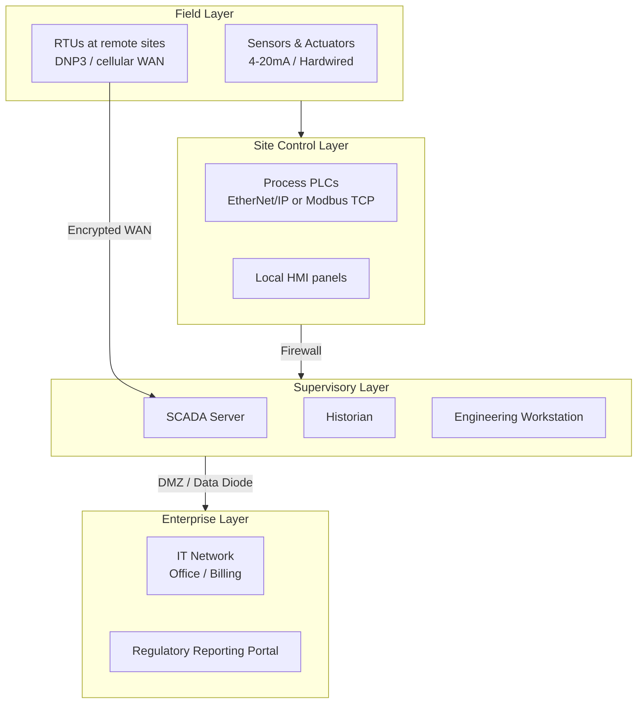
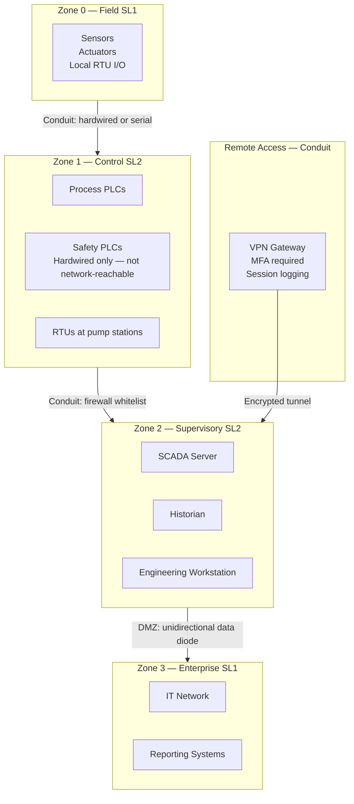
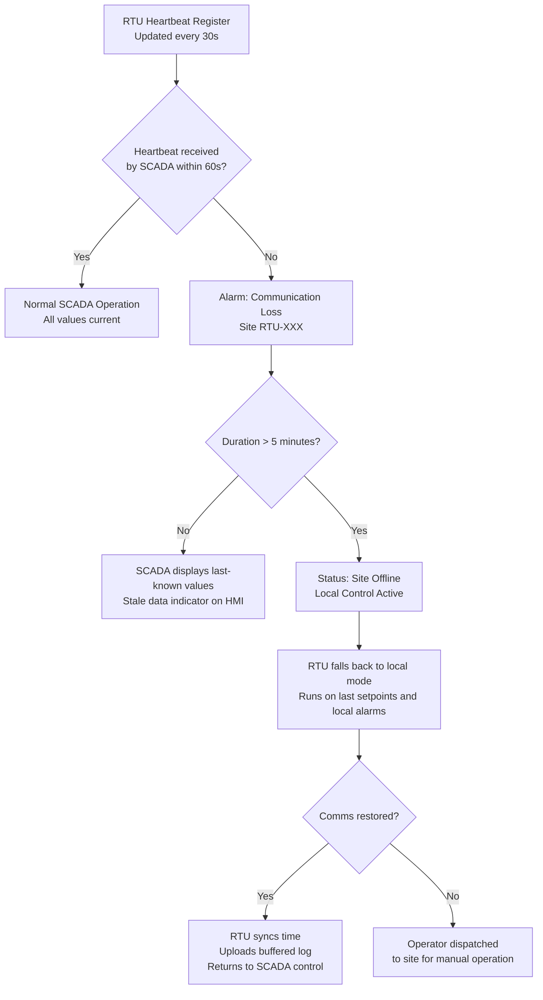

  Water/Wastewater — System Reference
  <h1>Distribution SCADA and Telemetry</h1>

<blockquote>
<strong>Scope:</strong> SCADA system architecture for municipal water distribution — central SCADA server, RTUs at remote pump stations and reservoirs, historian, HMI, and IEC 62443 security zone design. Covers communication failure fallback and regulatory logging requirements.
</blockquote>

## Standards Applicability

| Standard | Role in this system |
|---|---|
| IEC 62443 | SCADA security zones, conduit design, remote access controls |
| ISA-18.2 | Alarm management for communication loss, site offline |
| EPA SDWA | Continuous logging of Cl₂ residual and turbidity (4-hour rolling average) |
| NIST CSF | Cybersecurity framework — identify, protect, detect, respond, recover |

## SCADA Zone Architecture

## IEC 62443 Security Zone Map

## Communication Failure Fallback Logic

## Historian Retention Requirements

| Data Type | Resolution | Retention | Driver |
|---|---|---|---|
| All analog values | 1-minute | 2 years | Good practice |
| Turbidity (post-filter) | 15-second | 2 years | EPA SWTR — 4-hr rolling avg |
| Cl₂ residual | 1-minute | 2 years | EPA SWTR — continuous record |
| Alarm events | Event-driven | 5 years | Regulatory audit readiness |
| Operator actions | Event-driven | 5 years | Audit trail |
| System start/stop | Event-driven | 5 years | Maintenance record |

## Key Engineering Decisions

**Why DNP3 for remote RTUs?** DNP3 handles communication gaps gracefully — RTUs buffer data locally and upload on reconnect. It also supports unsolicited reporting (RTU pushes alarms to SCADA immediately rather than waiting for a poll).

**Data diode for enterprise export:** A unidirectional security gateway allows historian data to flow to IT/reporting systems without allowing any inbound access to the OT network. This is the IEC 62443 conduit between Zone 2 and Zone 3.

**Safety PLCs are hardwired only:** The IEC 61511 safety logic (OT shutdown, overflow prevention) is hardwired, not networked. Even if the SCADA network is compromised, safety trips remain functional.

## Cross-Links

- [IEC 62443 — Cybersecurity](/standards/cybersecurity/iec-62443/)
- [Chemical Dosing](../chemical-dosing/) — OT trip wired to safety layer, not SCADA
- [Lifecycle Stage 4 — Detailed Design](/lifecycle/stage-04/)
