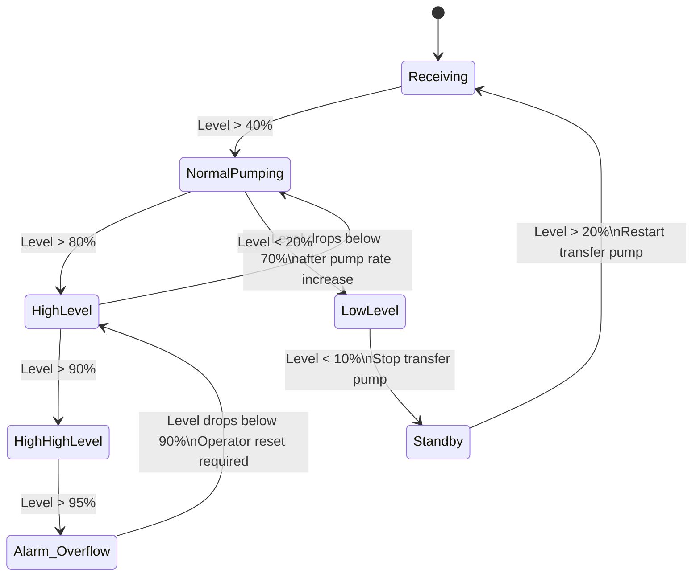
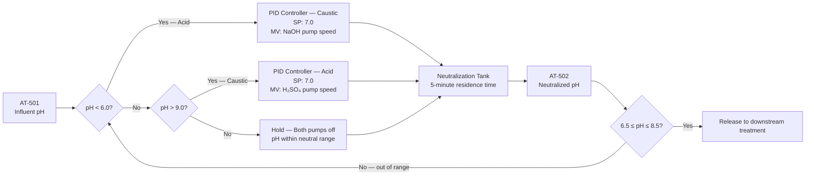

  Water/Wastewater — System Reference
  <h1>Equalization and Neutralization</h1>

<blockquote>
<strong>Scope:</strong> Industrial wastewater equalization basins and pH neutralization systems. Equalization dampens flow and pH variation before downstream biological treatment. Neutralization brings pH within permit range for discharge or further treatment.
</blockquote>

## Standards Applicability

| Standard | Role in this system |
|---|---|
| IEC 61511 | SIF: Final effluent pH out-of-range closes discharge valve (SIL 1) |
| EPA CWA (NPDES) | Permit pH limit typically 6.0–9.0; discharge hold logic must be documented |
| ISA-18.2 | Alarm priority for High-High level, pH out-of-range, containment alarm |
| NFPA 820 | If equalization basin is enclosed — evaluate for H₂S generation (acid WW + organic) |

## Equalization Basin Level Control State Machine

## pH Neutralization Control Loop

## Key Engineering Decisions

**pH PID loop considerations:** pH is logarithmic — the gain required to move pH from 5 to 6 is far less than from 3 to 4 on the same dose. Use gain scheduling (high gain at extreme pH, low gain near setpoint) or a linearized control law. Without this, the loop will oscillate violently near setpoint and be sluggish at extremes.

**Cascade neutralization:** A single-stage neutralization tank is difficult to control precisely. Two-stage is the industry standard — Stage 1 removes most of the acid/base demand (coarse correction), Stage 2 trims to permit range (fine correction). Each stage has its own pH analyzer and reagent pump.

**Enclosed EQ basin ventilation:** If the facility generates acid waste streams (pH < 4), H₂S can evolve in the equalization basin. Treat the enclosed EQ area as a confined space and evaluate for NFPA 820 hazardous area classification.

## Cross-Links

- [Treatment & Discharge](../treatment-discharge/) — downstream of neutralization
- [Instrumentation Reference](../instrumentation/) — pH analyzer selection
- [IEC 61511](/standards/functional-safety/iec-61511/)
- [NFPA 820 — Wastewater Hazardous Areas](/standards/)
