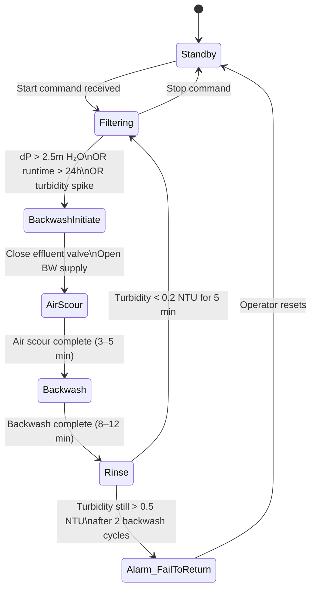
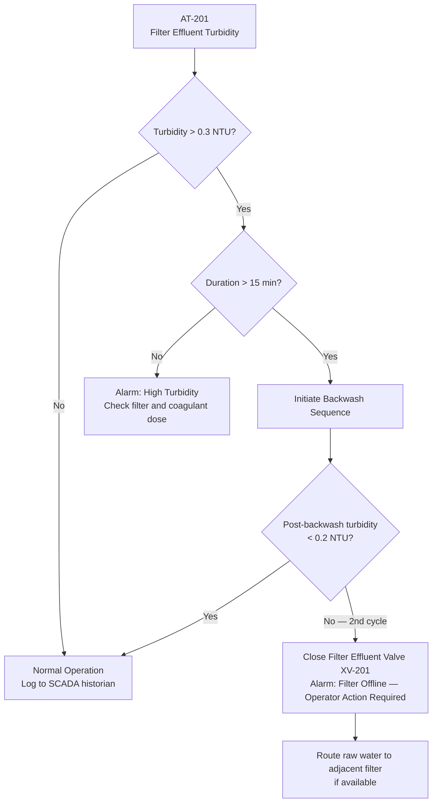

  Water/Wastewater — System Reference
  <h1>Filtration and Clarification</h1>

<blockquote>
<strong>Scope:</strong> Rapid gravity filters, pressure filters, and lamella clarifiers. Filter run/backwash state machine, turbidity-driven backwash initiation, filter-to-waste logic, and coagulant dosing integration.
</blockquote>

## Standards Applicability

| Standard | Role in this system |
|---|---|
| EPA SWTR | Turbidity < 0.3 NTU in 95% of measurements; < 1 NTU at all times — continuous logging required |
| ISA-18.2 | Alarm priority for turbidity spike, head loss alarm, backwash tank low |
| IEC 61511 | SIF: Filter effluent isolation if turbidity > 1.0 NTU (protects clearwell from contamination) |

## Filter Run / Backwash State Machine

## Turbidity-Driven Filter Bypass Logic

## Key Engineering Decisions

**Filter-to-waste is non-negotiable after backwash.** Backwash water contains the TSS and organisms removed from the media. Returning this to the clearwell would spike turbidity and could compromise disinfection efficacy. Route to backwash recovery basin or drain — not clearwell.

**Multiple filter sequencing:** Do not backwash more than one filter simultaneously (reduces plant capacity). Stagger backwash triggers by 2-hour minimum offset between filters.

**Turbidity analyzer location:** Sample point must be downstream of the filter bed, upstream of the clearwell. Dead time between the filter and the analyzer determines PID response time.

## Cross-Links

- [Chemical Dosing](../chemical-dosing/) — upstream coagulant affects filter loading
- [Instrumentation Reference](../instrumentation/) — turbidimeter selection and calibration
- [IEC 61511](/standards/functional-safety/iec-61511/)
