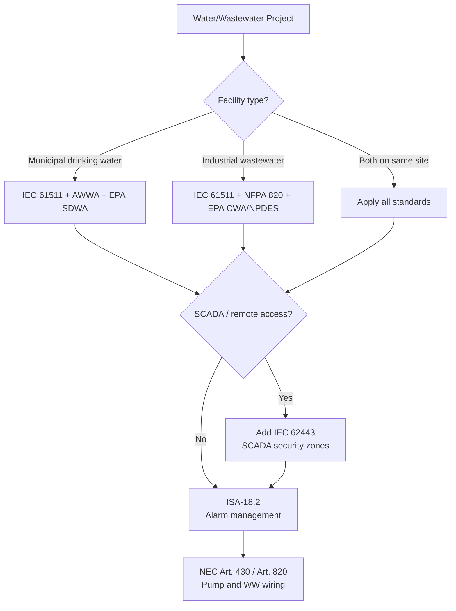
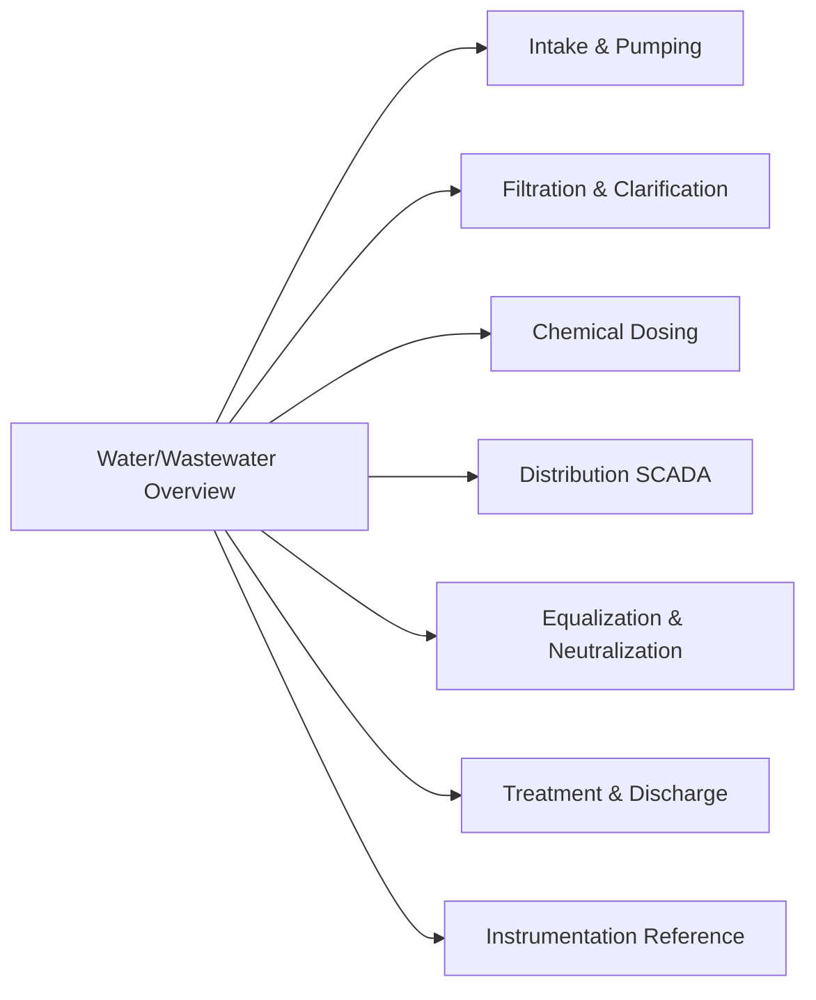

  Industry Reference — Water and Wastewater
  <h1>Water and Wastewater Systems</h1>
  Phase 25

<blockquote>
<strong>Scope:</strong> This section covers control systems engineering for municipal drinking water treatment and industrial wastewater treatment. Standards selection, SCADA architecture, safety instrumented systems, and per-system control narratives with engineering diagrams.
</blockquote>

## Standards Selection

Use this flowchart to identify which standards apply to your project:

## Standards Applicability Matrix

| Standard | Municipal Water | Industrial WW | Notes |
|---|---|---|---|
| IEC 61511 | Required | Required | SIL for chemical OT, overflow prevention, discharge trips |
| IEC 62443 | Required | Required | SCADA security zones and conduits |
| ISA-18.2 | Required | Required | Alarm rationalization |
| AWWA M31/M36 | Required | — | Distribution system design, water audits |
| EPA SDWA | Required | — | Maximum contaminant levels and treatment technique requirements |
| EPA CWA (NPDES) | — | Required | Effluent permit limits: TSS, BOD, pH, TN, TP |
| NFPA 820 | — | Required | Hazardous area classification — H₂S and CH₄ in biological treatment |
| NFPA 70 / NEC | Required | Required | Art. 430 (motors), Art. 820 (wastewater), wet environment wiring |

## In This Section

| Page | Covers |
|---|---|
| [Intake & Raw Water Pumping](./intake-pumping/) | Pump station control, start permissives, VFD sequencing |
| [Filtration & Clarification](./filtration-clarification/) | Filter run/backwash cycle, turbidity control, coagulation |
| [Chemical Dosing](./chemical-dosing/) | Chlorination, coagulant dosing, pH correction, OT shutdown |
| [Distribution SCADA](./distribution-scada/) | SCADA zones, RTU telemetry, IEC 62443 security, fallback logic |
| [Equalization & Neutralization](./equalization-neutralization/) | EQ basin sequencing, pH neutralization PID, industrial WW |
| [Treatment & Discharge](./treatment-discharge/) | Activated sludge, DO control, effluent quality trips, NPDES |
| [Instrumentation Reference](./instrumentation/) | Analyzer loops, instrument selection, HART, calibration |

## Related Pages

- [IEC 61511 — Functional Safety](/standards/functional-safety/iec-61511/)
- [Lifecycle — Detailed Design](/verification/lifecycle/detailed-design/)
- [Lifecycle — Commissioning](/implementation/lifecycle-commissioning/)
- [Petroleum / Oil & Gas](/industries/petroleum/) — similar SIS approach
