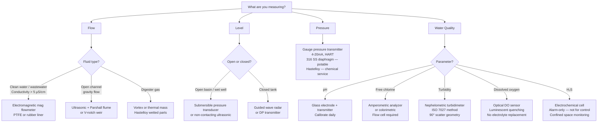
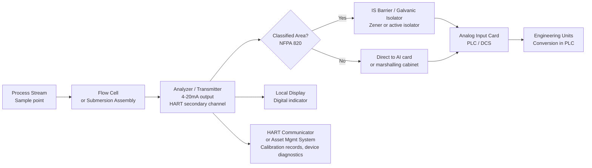

  Water/Wastewater — System Reference
  <h1>Instrumentation Reference</h1>

<blockquote>
<strong>Scope:</strong> Instrument selection for water and wastewater treatment systems — flow, level, pressure, and water quality analyzers. 4-20mA + HART loop architecture, intrinsic safety for classified areas, material compatibility, and regulatory calibration requirements.
</blockquote>

## Instrument Selection Decision Tree

## Analyzer Loop Architecture (4-20mA + HART)

## Material Compatibility Quick Reference

| Process Stream | Wetted Material — OK | Avoid |
|---|---|---|
| Potable water | 316 SS, PTFE, NSF 61-certified elastomers | Lead, unlined cast iron |
| NaOCl (sodium hypochlorite) | CPVC, PVDF, Hastelloy C276 | 304 SS, carbon steel |
| Alum / PAC solution | CPVC, rubber-lined | 316 SS (pitting in Cl⁻ + acid) |
| NaOH (caustic) | 316 SS, HDPE, CPVC | Aluminum, zinc |
| H₂SO₄ (dilute, < 50%) | HDPE, FRP, rubber-lined | Stainless steel |
| Activated sludge | Rubber-lined mag, PTFE-lined | Bare 316 SS (erosion) |
| Digester gas (CH₄/H₂S) | 316 SS, Hastelloy | Carbon steel (H₂S corrosion) |

## Calibration Requirements

| Instrument | Frequency | Method | Regulatory Driver |
|---|---|---|---|
| pH analyzer | Daily 2-point verification; full calibration weekly | pH 4.0 and 7.0 buffers | State drinking water regs |
| Turbidity analyzer | Daily verification; monthly Formazin calibration | Calibration standard | EPA SWTR |
| Cl₂ residual analyzer | Daily grab sample comparison by Hach method | DPD colorimetric | EPA SWTR |
| Magnetic flowmeter | Annual; loop validation vs. portable ultrasonic | Portable check meter | Regulatory metering |
| DO analyzer (optical) | Weekly verification; replace cap annually | Air saturation method (100%) | Good practice |
| Level transmitter | Semi-annual; verify against known depth | Physical measurement | Good practice |

## ISA-5.1 Tag Convention

Follow ISA-5.1 for all instrument tags:

| First letter | Measured variable | Second letter | Function |
|---|---|---|---|
| A | Analyzer | T | Transmitter |
| F | Flow | C | Controller |
| L | Level | I | Indicator |
| P | Pressure | S | Switch |
| T | Temperature | E | Element (sensor) |

Examples: `LT-101` Level Transmitter loop 101 · `AT-301` Analyzer Transmitter loop 301 · `FIC-201` Flow Indicating Controller loop 201 · `PSH-402` Pressure Switch High loop 402

## Cross-Links

- [Chemical Dosing](../chemical-dosing/) — Cl₂ analyzer application
- [Filtration & Clarification](../filtration-clarification/) — turbidimeter application
- [Treatment & Discharge](../treatment-discharge/) — DO and TSS analyzer application
- [Lifecycle — Detailed Design](/verification/lifecycle/detailed-design/)
