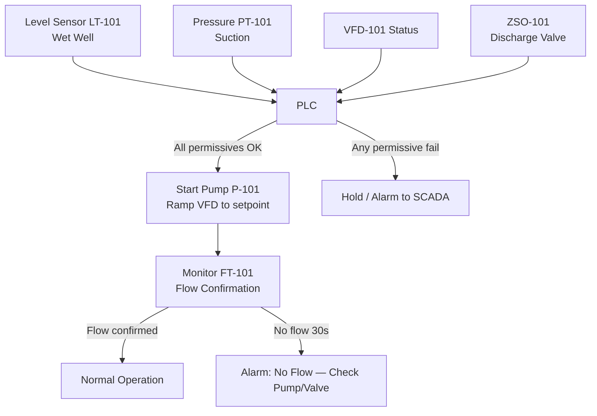
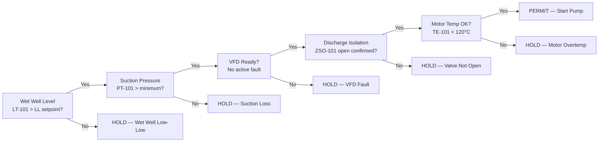

  Water/Wastewater — System Reference
  <h1>Intake and Raw Water Pumping</h1>

<blockquote>
<strong>Scope:</strong> Raw water intake screens, wet wells, and pump stations that lift raw water to the treatment plant headworks. Covers pump start permissives, VFD speed control, multi-pump sequencing, and protection trips.
</blockquote>

## Standards Applicability

| Standard | Role in this system |
|---|---|
| IEC 61511 | SIL assessment for wet well Low-Low shutdown (prevents pump damage, dry run) |
| ISA-18.2 | Alarm rationalization — screen dP, suction pressure, motor temperature |
| NEC Art. 430 | Motor branch circuit protection and overload sizing |
| AWWA M17 | Pump station design reference (suction conditions, NPSH, pipe sizing) |

## Pump Station Control Architecture

## Start Permissive Chain

All permissives must be satisfied before any pump start command is accepted. Hardwired to motor control circuit AND mirrored in PLC for SCADA visibility.

## VFD Speed Control

Raw water pumps run on a flow demand PID loop:

| Parameter | Value |
|---|---|
| Process variable (PV) | Headworks flow FT-201 (m³/h) |
| Setpoint (SP) | Operator-set target production flow |
| Manipulated variable (MV) | VFD speed reference (0–60 Hz) |
| Minimum speed | 20 Hz (prevents suction pipe sedimentation) |
| Acceleration ramp | 5 Hz/s |
| Deceleration ramp | 3 Hz/s |

## Key Engineering Decisions

**Why hardwire the Low-Low level interlock?**
Dry running a vertical turbine pump destroys the pump within seconds. The Low-Low shutdown is a SIF per IEC 61511 — the logic must be in the safety layer (hardwired or Safety PLC), not relying on the process PLC to respond in time.

**Multi-pump sequencing:** Lead pump ramps to 58 Hz before assist pump starts. This prevents simultaneous starting inrush and avoids hunting between pumps. Lead/lag rotation occurs every 24 hours to equalize wear.

**NPSH margin:** Verify net positive suction head available (NPSHA) is ≥ NPSHR + 0.5 m margin at all wet well levels, including Low-Low. Document in pump data sheet.

## Cross-Links

- [Filtration & Clarification](../filtration-clarification/) — downstream of intake
- [Lifecycle — Detailed Design](/verification/lifecycle/detailed-design/)
- [Lifecycle — Commissioning](/implementation/lifecycle-commissioning/)
- [IEC 61511](/standards/functional-safety/iec-61511/)
