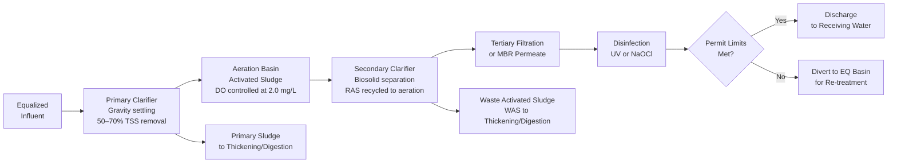
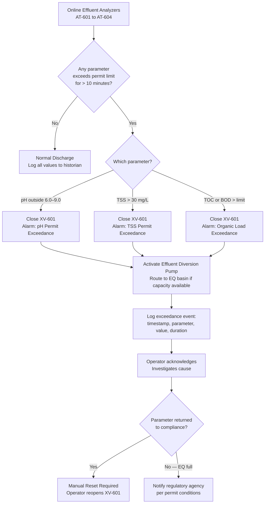

  Water/Wastewater — System Reference
  <h1>Treatment and Discharge Compliance</h1>

<blockquote>
<strong>Scope:</strong> Biological wastewater treatment (activated sludge / MBR), secondary clarification, effluent disinfection, and discharge permit compliance. Covers DO control, sludge management, online effluent monitoring, permit limit trips, and NPDES record-keeping.
</blockquote>

## Standards Applicability

| Standard | Role in this system |
|---|---|
| EPA CWA / NPDES | Permit limits for TSS, BOD, pH, TN, TP, fecal coliform — monthly average and daily maximum |
| IEC 61511 | SIF: Effluent isolation valve XV-601 closes on permit limit exceedance (SIL 1) |
| NFPA 820 | Hazardous area classification — digester gas (CH₄), confined space H₂S in clarifiers |
| ISA-18.2 | Alarm rationalization for effluent quality, blower failure, sludge blanket high |

## Treatment Train Flow

## Permit Limit Trip Logic

## Dissolved Oxygen Control

The aeration basin blowers run on a cascaded DO PID loop:

| Parameter | Value |
|---|---|
| PV | DO analyzer AT-601 (optical), mid-basin outlet |
| SP | 2.0 mg/L (typical; adjusted 1.5–3.0 mg/L seasonally) |
| MV | Lead blower VFD speed (0–60 Hz) |
| Assist blower | Staged on/off: starts when lead blower hits 58 Hz |
| DO < 1.0 mg/L | Alarm: Low DO — risk of filamentous bulking |
| DO > 4.0 mg/L | Trim blower speed — energy waste without treatment benefit |

## Key Engineering Decisions

**Why is the effluent trip SIL 1?** A permit limit exceedance that reaches the receiving water creates regulatory liability, potential fines, and environmental harm. The trip valve must be in the safety layer and able to close even if the process PLC is faulted. A simple hardwired relay from the pH transmitter to the valve can provide SIL 1 with proper documentation.

**WAS control:** Mixed liquor TSS (MLSS) is the control target. SCADA calculates the daily WAS volume based on MLSS, influent flow, and target SRT (solids retention time). The operator approves each WAS event — never automate WAS without operator oversight, as over-wasting crashes the biological process.

**MBR transmembrane pressure (TMP):** For MBR systems, TMP trend is the primary fouling indicator. TMP rising faster than expected indicates membrane fouling — trigger chemical cleaning before TMP reaches the backpulse limit.

## Cross-Links

- [Equalization & Neutralization](../equalization-neutralization/) — upstream
- [Instrumentation Reference](../instrumentation/) — DO and TSS analyzer selection
- [IEC 61511](/standards/functional-safety/iec-61511/)
- [Lifecycle Stage 6 — Commissioning](/lifecycle/stage-06/)
