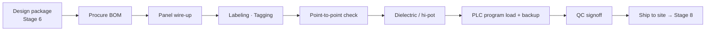

<div class="page-header">
  <span class="page-header__label">Lifecycle Stage 07</span>
  <h1>Control System Build and Software Implementation</h1>
</div>

## Build Sequence



## 1. Purpose of This Stage

This stage transforms the detailed design documentation from Stage 5 and the build package from Stage 6 into **physical, functioning hardware and configured software** — the actual control panel, machine electrical system, and programmed control system that will be installed, commissioned, and operated.

This is where every engineering decision made in Stages 1–6 either succeeds or fails at the physical level. The most rigorous architecture calculation is worthless if the build technician routes both channels of a dual-channel safety circuit in the same wire duct. The most carefully specified EDM feedback circuit is worthless if the NC auxiliary contact is wired to the wrong terminal. The most precisely selected contactor is worthless if procurement substituted a different part number without notifying the safety engineer.

This stage has two parallel tracks that must converge:

- **Hardware build:** Physical panel construction, wiring, grounding, labeling, and enclosure completion
- **Software implementation:** PLC programming, safety PLC configuration, HMI development, and cybersecurity hardening

Both tracks produce outputs that must be verified against the design documents before the system leaves the build area. The principle governing this stage is **build exactly what was designed, and document exactly what was built.**

> **This stage answers: Was the system built and programmed exactly as designed, and if any deviation occurred, was it controlled, documented, and verified?**

---

## 2. Entry Criteria

This stage begins when **Stage 6 (Draft Documentation) exit criteria are met** and the build package has been formally released.

### Required Inputs

| Input | Source (Stage) | Why It Matters |
|-------|---------------|----------------|
| Build package (complete set) | Stage 6 | The authoritative reference for everything built — schematics, BOM, layout, wire schedule, shop traveler, QC checklist, build notes |
| Shop traveler | Stage 6 | Build control document — defines sequence, hold points, and sign-off requirements |
| Quality control checklist | Stage 6 | Safety-specific inspection checklist |
| Component-specific installation instructions | Stage 6 (compiled from manufacturer data) | Torque specs, orientation requirements, ventilation clearances, wiring diagrams for individual components |
| Safety PLC program (approved version) | Stage 4.5 | The verified, approved safety program to be loaded — with documented CRC/signature |
| Standard PLC program (approved version) | Stage 5 / engineering | The verified standard (non-safety) PLC program |
| HMI application (approved version) | Stage 5 / engineering | The verified HMI screens and configuration |
| All BOM components (received and verified) | Procurement | Every component must match the BOM part number exactly — especially safety-rated components |
| CCF separation annotations | Stage 4 / Stage 5 | Specific wire routing and separation requirements from the CCF analysis |
| Fault exclusion conditions | Stage 4 | Installation conditions that must be maintained for fault exclusions to remain valid |
| Safety component substitution restriction list | Stage 5 / Stage 6 | List of components that must not be substituted without safety engineer approval |

### Pre-Build Verification

Before the first component is mounted, verify:

| Check | Action | Responsible |
|-------|--------|-------------|
| All BOM components received | Compare received components against BOM — verify manufacturer, part number, quantity | Build supervisor / procurement |
| Safety-rated components verified | Each safety-rated component checked against the BOM part number and the PL/SIL calculation component list — **no substitutions accepted without safety engineer approval** | Build technician + safety engineer |
| Build package documents are current revision | Confirm schematics, layout, wire schedule are at the revision stamped "Issued for Build" — no outdated prints on the bench | Build supervisor |
| Enclosure and backplate ready | Enclosure is correct size, type, and rating; backplate is prepared (DIN rail positions marked, wire duct locations marked) | Build technician |
| Tools and materials ready | Wire, ferrules, labels, terminal blocks, DIN rail, wire duct, grounding hardware — all per specification | Build technician |

---

## 3. Standards Influence

| Standard | Role at This Stage | Key Requirements |
|----------|-------------------|-----------------|
| **UL 508A:2023** | Panel construction compliance — governs component mounting, wiring, spacing, grounding, marking, enclosure integrity, and SCCR verification during build | All sections — particularly §22–38 (construction), §40–56 (wiring), §58–66 (grounding/bonding), §12 (marking) |
| **NFPA 79:2024** | Machine electrical construction — governs conductor types, wiring practices, grounding, overcurrent protection installation, and documentation requirements | Ch. 12 (conductors), Ch. 13 (wiring practices), Ch. 8 (grounding), Ch. 19 (documentation) |
| **IEC 60204-1:2016** | Electrical equipment of machines — international equivalent of NFPA 79 for construction practices | Cl. 12 (conductors), Cl. 13 (wiring practices), Cl. 8 (equipotential bonding), Cl. 14 (PLC systems) |
| **IEC 61131-3:2013** | PLC programming languages — defines Ladder Diagram (LD), Function Block Diagram (FBD), Structured Text (ST), Instruction List (IL), and Sequential Function Chart (SFC) | All clauses — language selection and programming structure |
| **IEC 62443** | Industrial cybersecurity — secure development practices for networked control systems | Part 4-1 (secure development lifecycle), Part 4-2 (technical security requirements for components) |
| **ISO 13849-1:2023** | Safety circuit construction must maintain the architecture, CCF measures, and diagnostic provisions designed in Stage 4 | §7 (design considerations relevant to build), §8 (validation — build enables validation) |
| **IEC 62061:2021** | SRECS construction — same principle: build must implement the designed architecture | §6.6 (verification of hardware), §6.7 (software requirements) |
| **IEC 61511-1:2016** | SIS construction — application programming, configuration, and factory testing requirements | §12 (SIS design and engineering — application programming), §15 (SIS installation, commissioning) |
| **ISO 13849-1:2023 Annex J / IEC 62061:2021 §6.7** | Safety software — SRESW (safety-related embedded software) vs SRASW (safety-related application software); limited variability language (LVL) requirements; application program verification | Annex J (ISO 13849-1), §6.7 (IEC 62061) |
| **NFPA 70E:2024** | Electrical safety in the workplace — applies to build technicians working on energized or potentially energized equipment during build and testing | All applicable sections — arc flash PPE, energized work permits |
| **IEC 61439-1/2** | If the assembly is classified as a switchgear assembly — routine verification (testing) requirements during manufacture | Cl. 11 (routine verification) |

---

## 4. Hardware Build Activities

### 4.1 Build Sequence

The recommended build sequence ensures that structural elements are in place before wiring begins, and safety-critical elements are identifiable and verifiable throughout:

```
Step 1: Enclosure Preparation
    │
    ▼
Step 2: Backplate Assembly (DIN rail, wire duct, barriers)
    │
    ▼
Step 3: Component Mounting
    │   ★ QC HOLD POINT: Component verification ★
    ▼
Step 4: Power Wiring (main supply, branch circuits, motor circuits)
    │
    ▼
Step 5: Control Wiring (PLC I/O, standard control circuits)
    │
    ▼
Step 6: Safety Circuit Wiring
    │   ★ QC HOLD POINT: Safety wiring verification ★
    ▼
Step 7: Grounding and Bonding
    │   ★ QC HOLD POINT: Grounding verification ★
    ▼
Step 8: Labeling (wire labels, component labels, nameplates)
    │
    ▼
Step 9: Wire Dress and Duct Closing
    │
    ▼
Step 10: Enclosure Completion (covers, barriers, glands, breathers)
    │   ★ QC HOLD POINT: Enclosure integrity verification ★
    ▼
Step 11: Point-to-Point Wiring Verification
    │   ★ QC HOLD POINT: Wiring verification complete ★
    ▼
Step 12: Pre-Power Inspection (Visual, Megger, Continuity)
    │   ★ QC HOLD POINT: Pre-power inspection sign-off ★
    ▼
Step 13: Initial Power-Up (controlled sequence)
    │
    ▼
Step 14: In-Panel Functional Testing
    │   ★ QC HOLD POINT: Functional test sign-off ★
    ▼
Step 15: Software Loading and Configuration Verification
    │   ★ QC HOLD POINT: Software verification sign-off ★
    ▼
Step 16: Final Inspection and Documentation
    │   ★ QC HOLD POINT: Final inspection sign-off ★
    ▼
Step 17: Ship Preparation
```

### 4.2 Enclosure Preparation (Step 1)

| Activity | Requirement | Verification |
|----------|------------|-------------|
| Verify enclosure type and size | Per panel layout drawing — correct NEMA type / IP rating, correct dimensions | Visual comparison to drawing |
| Prepare cutouts and penetrations | For disconnects, HMI, pushbuttons, cable entries — per layout drawing | All cutouts clean, deburred, correct size and position |
| Install cable glands, conduit hubs, and breathers | Per enclosure type rating requirements — every penetration must maintain the rated protection | Glands/hubs installed with correct size and type; unused knockouts sealed |
| Install sub-panels or swing-out panels (if applicable) | Per layout drawing — with provision for bonding jumpers | Mounted securely with hinge hardware |

### 4.3 Backplate Assembly (Step 2)

| Activity | Requirement | Verification |
|----------|------------|-------------|
| Mount DIN rails | Per layout drawing — positions, lengths, orientation | Positions match layout within tolerance |
| Install wire duct | Per layout drawing — sizes, positions, open/closed top as specified | Sizes match drawing; separate ducts for power and control where specified |
| Install safety circuit wire duct (separate) | Per CCF separation annotations — redundant channel wire duct physically separated | Separation distance meets CCF requirement; safety wire duct labeled or color-coded |
| Install barriers between power and control sections | Per layout drawing and spacing requirements | Barriers in place; high-voltage and low-voltage sections physically separated |
| Mount PE bus bar | Per grounding drawing — central location accessible to all PE conductors | Bus bar mounted, accessible, correctly sized |

### 4.4 Component Mounting (Step 3)

| Activity | Requirement | Verification |
|----------|------------|-------------|
| Mount all components per layout drawing | Correct position, orientation, ventilation clearance, and accessory combinations per manufacturer instructions | Visual comparison to layout drawing |
| Safety components mounted in designated safety section | Per layout drawing safety section annotation | Safety components grouped together; section labeled "SAFETY" |
| Verify component part numbers against BOM | **Every safety-rated component** — compare physical part number label to BOM line item | Part number match documented on component verification checklist |
| Verify component orientation | Some components require specific mounting orientation for proper cooling (VFDs, power supplies) or operation (thermal overloads) | Per manufacturer installation instructions |
| Verify ventilation clearances | Minimum clearances above/below VFDs, above power supplies, around heat-generating components | Per manufacturer specifications; measured if critical |

**★ QC HOLD POINT: Component Verification ★**

| Check | Criteria | Sign-off |
|-------|----------|---------|
| All BOM components installed | Every BOM line item accounted for — none missing, none extra | Build technician + QC |
| All safety-rated components match BOM part numbers | Part-by-part verification — documented on checklist | Build technician + safety engineer (or designated QC) |
| No unauthorized substitutions | Any substitution flagged and routed through safety engineer before installation | Safety engineer sign-off on any substitution |
| Component positions match layout drawing | Visual comparison | Build technician + QC |

### 4.5 Power Wiring (Step 4)

| Activity | Requirement | Standard Reference |
|----------|------------|-------------------|
| Wire main supply circuit | Per schematic — correct conductor gauge, type, color, and termination from incoming terminals through disconnect to main bus/distribution | NEC Art. 430, NFPA 79 §12, UL 508A §38 |
| Wire branch circuits (motor circuits) | Per schematic — BCPD → contactor → overload → motor terminals; correct gauge per motor FLA and NEC sizing | NEC Art. 430.22, NFPA 79 §7.2 |
| Wire non-motor power circuits | Per schematic — heaters, power supplies, receptacles, lighting | NFPA 79, NEC applicable articles |
| Verify conductor type and temperature rating | Conductor insulation type (THHN, MTW, etc.) and temperature rating appropriate for the installation point — especially near heat sources | UL 508A §38, NEC Art. 310 |
| Terminate with appropriate method | Ring/fork terminals for screw terminals; ferrules for stranded wire into spring-cage or screw terminals; proper crimp tool and die | UL 508A, NFPA 79 §13, manufacturer terminal requirements |
| Tighten to torque specification | Every terminal tightened to manufacturer-specified torque — not "tight enough" by feel | Manufacturer specs; torque screwdriver or wrench required for power connections |

### 4.6 Control Wiring (Step 5)

| Activity | Requirement | Standard Reference |
|----------|------------|-------------------|
| Wire PLC I/O circuits | Per schematic and I/O assignment table — correct wire from field device (or terminal block) to correct PLC input/output address | IEC 60204-1 §14, NFPA 79 §9 |
| Wire standard control circuits | Per schematic — relay circuits, timer circuits, pilot device circuits, HMI connections | NFPA 79 §9, IEC 60204-1 §9 |
| Wire communication cables | Per schematic — Ethernet, serial, fieldbus cables routed per manufacturer requirements; correct cable type (shielded/unshielded, voltage rating) | IEC 62443 (if networked), manufacturer specifications |
| Verify communication cable voltage rating | Communication/Ethernet cables in the same raceway as power conductors must be rated for the voltage environment (300V vs 600V) | UL 508A, NEC Art. 725, NFPA 79 §12.9 |
| Maintain separation between power and communication cables | Communication cables separated from power cables to prevent EMI — minimum separation distance per manufacturer or good practice (typically 150mm / 6 inches) | IEC 61326, manufacturer installation guides |

### 4.7 Safety Circuit Wiring (Step 6)

**This is the most critical wiring activity in the build. Safety circuit wiring directly implements the architecture designed in Stage 4. Errors here invalidate the PL/SIL calculation.**

| Activity | Requirement | Architecture Traceability |
|----------|------------|--------------------------|
| Wire dual-channel safety inputs | Two separate wires from each dual-channel safety device to two separate safety controller input channels — per schematic | Stage 4: Dual-channel input architecture (Category 3/4) |
| Route redundant channels in separate wire ducts | Channel A wires in one duct, Channel B wires in a separate duct — per CCF separation annotations on layout drawing | Stage 4: CCF scoring — separation measure |
| Wire EDM feedback circuits | NC auxiliary contact from each monitored contactor wired to the correct safety controller feedback input — per schematic | Stage 4: DC justification — EDM provides DC ≥ 99% for output subsystem |
| Wire safety device power supply | 24VDC power to safety devices from the designated safety power supply — not from the general I/O power supply | Stage 5: Dedicated safety power supply design |
| Wire reset circuits | Reset button wired to correct safety controller reset input — manual reset, momentary contact, correct wiring (not latching) | Stage 3: Safety function register — reset behavior specification |
| Wire muting circuits (if applicable) | Muting sensors wired to correct safety controller muting inputs; muting indication lamp wired and functional | Stage 3/4: Safety function register — muting conditions; IEC 62046 |
| Wire e-stop circuits | E-stop devices wired with NC contacts in series (for hardwired e-stop loops) or as dual-channel inputs to safety controller — per schematic | ISO 13850, Stage 4 architecture |
| Wire mode selection circuits | Mode selector switch wired to safety controller; mode-dependent safety function behavior enabled by wiring and software | Stage 1: Operating modes; Stage 4.5: Safety software |
| Use correct wire color for safety circuits | Per project wiring standard — distinct color (yellow or orange recommended) for safety circuit conductors | Stage 5: Safety wiring practices |
| Label safety circuit wires at both ends | Wire numbers per wire schedule; safety circuit designation visible | Stage 5: Wire schedule — safety circuit flagging |
| Install ferrules on all stranded wire terminations | Every stranded conductor terminated with ferrule before insertion into terminal | Stage 5: Termination practices — prevents strand escape between safety channels |

**★ QC HOLD POINT: Safety Wiring Verification ★**

| Check | Criteria | Method | Sign-off |
|-------|----------|--------|---------|
| Dual-channel inputs verified | Both channels wired to correct terminals with correct wire numbers; channels in separate wire ducts | Point-to-point check against schematic | Build technician + QC |
| EDM feedback circuits verified | Every monitored contactor has NC aux contact wired to correct feedback input | Point-to-point check against schematic | Build technician + QC |
| Channel separation verified | Redundant channel wires physically separated per CCF annotations | Visual inspection of wire routing | QC + safety engineer |
| Safety wire color and labeling verified | Correct color per project standard; labels present at both ends of every safety wire | Visual inspection | QC |
| Reset circuit wiring verified | Reset buttons wired correctly; no automatic reset path unless explicitly designed | Point-to-point check against schematic | Build technician + QC |
| E-stop wiring verified | NC contacts used; wiring per schematic; series loop integrity (if hardwired) | Point-to-point check | Build technician + QC |

### 4.8 Grounding and Bonding (Step 7)

| Activity | Requirement | Standard Reference |
|----------|------------|-------------------|
| Connect all PE conductors to PE bus bar | Every component with exposed conductive parts bonded to PE bus bar — not daisy-chained between components | NEC Art. 250, NFPA 79 §8.2, UL 508A |
| Install door bonding jumpers | Every hinged door or removable panel with electrical components — bonding jumper from door to frame; sized per NFPA 79 Table 8.2.2 | NFPA 79 §8.2.4, UL 508A |
| Install sub-panel bonding | Removable sub-panels and mounting plates bonded to main PE | NFPA 79 §8.2, UL 508A |
| Connect incoming PE/EGC | Incoming equipment grounding conductor terminated at PE bus bar — sized per NEC Table 250.122 | NEC Art. 250, NFPA 79 §8 |
| Verify PE conductor sizing | PE conductor cross-section meets minimum requirements per supply conductor size | NFPA 79 Table 8.2.2, IEC 60204-1 §8.2 |
| Connect signal/shield grounds | Communication cable shields terminated per manufacturer instructions; functional ground connected to designated point — separate from PE where specified | IEC 61326, manufacturer specifications |

**★ QC HOLD POINT: Grounding Verification ★**

| Check | Criteria | Method | Sign-off |
|-------|----------|--------|---------|
| PE continuity | ≤ 0.1Ω from every exposed conductive part to PE terminal | Low-resistance ohmmeter measurement | QC |
| Door bonding jumpers | Installed on every hinged door; correctly sized; measured continuity | Visual + measurement | QC |
| PE conductor sizing | Meets minimum per standard table | Comparison to design | QC |
| No PE daisy-chaining | Each PE conductor runs individually from component to PE bus bar | Visual inspection | QC |

### 4.9 Labeling (Step 8)

| Item | Requirement | Standard Reference |
|------|------------|-------------------|
| Wire labels | Every wire labeled at both ends with wire number per wire schedule — legible, durable, correctly positioned | NFPA 79 §13.2, IEC 60204-1 §13.2, UL 508A |
| Component labels | Every component labeled with tag number matching schematic and BOM | NFPA 79 §19, IEC 60204-1 §17, UL 508A §12 |
| Terminal block labels | Every terminal block and terminal number labeled | NFPA 79, IEC 60204-1 |
| Safety section label | Safety component section labeled "SAFETY" or "SAFETY SECTION" | Good practice — immediate identification |
| Danger/warning labels | High-voltage warning labels, arc flash labels (if required), "DISCONNECT POWER BEFORE SERVICING" | NFPA 79 §16.3, NEC Art. 409, NFPA 70E |
| Nameplate — main panel | Manufacturer, panel ID, supply voltage/phase/frequency, FLA/MCA, SCCR, enclosure type, PE terminal identification | NEC Art. 409.110, UL 508A §12, NFPA 79 §19.2 |
| Nameplate — SCCR | SCCR value visible externally for installer/inspector comparison with site available fault current | NEC Art. 409.110 |
| Nameplate — disconnect | Disconnect switch labeled with OFF/ON positions; lockout instruction if applicable | NFPA 79 §5.3, NEC |

### 4.10 Enclosure Completion (Step 10)

| Activity | Requirement | Verification |
|----------|------------|-------------|
| Close all wire ducts | Covers installed on all wire duct | Visual |
| Install all barriers and covers | Power section barriers, finger-safe covers, terminal block covers where specified | Visual — per layout drawing |
| Seal all unused penetrations | Unused knockouts, cable entries, and conduit openings sealed to maintain enclosure rating | Visual |
| Verify cooling system | Fans, filters, heat exchangers, vents — installed per design; fan direction correct; filters clean; air flow path unobstructed | Visual + operational check |
| Verify enclosure rating is maintained | All penetrations have appropriate glands, hubs, or seals; no gaps or openings that defeat the rated protection | Visual inspection of all penetrations |
| Install desiccant / breather (if specified) | For outdoor or high-humidity installations | Visual |

**★ QC HOLD POINT: Enclosure Integrity ★**

| Check | Criteria | Sign-off |
|-------|----------|---------|
| All penetrations sealed or properly fitted | No open holes, no missing glands | QC |
| Cooling system functional | Fans running in correct direction; filters installed; heat exchanger connected | QC |
| Enclosure type rating maintained | Overall assessment — enclosure meets the specified NEMA type / IP rating | QC |

### 4.11 Point-to-Point Wiring Verification (Step 11)

This is a systematic verification that every wire is connected correctly. There are two approaches:

| Method | Description | When to Use |
|--------|-------------|-------------|
| **100% point-to-point check** | Every wire in the panel verified against the schematic — from terminal to terminal | Required for safety circuits; recommended for all circuits on safety-critical machines |
| **Sample-based check with 100% safety circuit check** | All safety circuits checked 100%; standard circuits checked on a sampling basis (e.g., 20%) with full check if any errors found | Acceptable for large panels where 100% check of all circuits is impractical — but ALL safety circuits are always 100% checked |

### Point-to-Point Check Record Template

| Wire # | From (Tag-Terminal) | To (Tag-Terminal) | Schematic Ref | Checked | Correct? | Initials | Date |
|--------|--------------------|--------------------|--------------|---------|----------|---------|------|
| W001 | TB1-1 | Q1-L1 | Pg 3, Line 1 | ✓ | ✓ | JD | 2024-01-15 |
| W002 | Q1-T1 | K1-1 | Pg 3, Line 2 | ✓ | ✓ | JD | 2024-01-15 |
| W100 | GS1-13 | SR1-S11 | Pg 8, Line 1 | ✓ | ✓ | JD | 2024-01-15 |
| W101 | GS1-23 | SR1-S21 | Pg 8, Line 2 | ✓ | ✓ | JD | 2024-01-15 |

**Safety circuit wires should be distinctly identified in the check record (highlighted, flagged, or in a separate section).**

**★ QC HOLD POINT: Wiring Verification Complete ★**

### 4.12 Pre-Power Inspection (Step 12)

Before any power is applied, perform the following checks:

| Test | Method | Acceptance Criteria | Standard Reference |
|------|--------|--------------------|--------------------|
| **Visual inspection** | Walk-through of entire panel | No visible defects, loose wires, missing labels, open wire duct, foreign objects (wire clippings, ferrule scraps) | IEC 60204-1 §18.1 |
| **PE continuity** | Low-resistance ohmmeter (≥10A test current per IEC 60204-1, or per UL 508A routine test) | ≤ 0.1Ω from every exposed conductive part to PE terminal | IEC 60204-1 §18.2 |
| **Insulation resistance** | Megger test at 500VDC (for circuits ≤ 500V) | ≥ 1 MΩ between power conductors and PE | IEC 60204-1 §18.3 |
| **Voltage withstand (dielectric)** | If required by UL 508A or IEC 60204-1 — HiPot test | Per standard requirements — typically 1000V + 2× rated voltage for 1 second | IEC 60204-1 §18.4, UL 508A routine test |
| **Disconnect operation** | Operate main disconnect manually | Disconnects all ungrounded supply conductors; lockable in OFF position | NFPA 79 §5.3, IEC 60204-1 §5.3 |

**★ QC HOLD POINT: Pre-Power Inspection Sign-Off ★**

All pre-power tests must pass before initial power-up. Any failure must be investigated and corrected before proceeding.

### 4.13 Initial Power-Up (Step 13)

Controlled sequence for first energization:

| Step | Action | Verification |
|------|--------|-------------|
| 1 | Ensure all output devices are disconnected or in safe state (motors not connected, actuators isolated) | Physical verification |
| 2 | Verify correct incoming voltage at supply terminals (with disconnect OFF) | Multimeter measurement — confirm voltage, phase rotation (if applicable) |
| 3 | Close main disconnect | Verify no trips, no arcing, no abnormal sounds |
| 4 | Measure voltage at main bus / distribution points | Confirm correct voltage at each distribution point |
| 5 | Energize control power transformer / 24VDC power supply | Verify output voltage within specification (24VDC: 23.5–24.5VDC typical) |
| 6 | Verify PLC power-up sequence | PLC boots, enters correct mode (RUN or PROGRAM as expected); no fault indicators |
| 7 | Verify safety controller power-up sequence | Safety controller boots, enters expected state; verify LED indicators per manufacturer documentation |
| 8 | Verify HMI power-up | HMI boots, displays expected home screen |
| 9 | Measure voltage at safety device power supply outputs | Confirm 24VDC at safety I/O power rail |
| 10 | Energize branch circuits one at a time | Verify no trips; measure voltage at each load point |

### 4.14 In-Panel Functional Testing (Step 14)

Before the panel ships, perform panel-level functional testing to catch wiring errors and configuration problems while the panel is still accessible on the shop floor:

| Test Category | What to Test | Method |
|--------------|-------------|--------|
| **I/O verification** | Every PLC input and output responds correctly when activated | Activate each input (manually or with test signals); verify PLC registers correct state; command each output; verify physical output activates |
| **Safety controller I/O** | Every safety input and safety output responds correctly | Activate each safety input pair (simulate guard switch, e-stop); verify safety controller registers correct state; verify safety output response |
| **E-stop function (panel-level)** | E-stop devices on the panel function correctly | Press each e-stop; verify safety controller enters safe state; verify output contactors de-energize; verify reset sequence |
| **Safety relay/controller configuration** | Safety controller is configured per the approved configuration | Download configuration and compare to approved version; verify CRC/signature matches |
| **Communication** | PLC-to-HMI, PLC-to-safety controller, PLC-to-drives, fieldbus networks | Verify communication links are established and data is exchanging correctly |
| **Drive parameter verification** | VFD parameters match the approved parameter list | Download parameters and compare to approved list; verify safety-related parameters (STO configuration, safe speed limits) |

**★ QC HOLD POINT: In-Panel Functional Test Sign-Off ★**

---

## 5. Software Implementation Activities

### 5.1 Software Scope and Classification

Software at this stage falls into distinct categories with different requirements:

| Software Category | Description | Standard Reference | Rigor Level |
|------------------|-------------|-------------------|-------------|
| **SRESW — Safety-Related Embedded Software** | Firmware embedded in the safety controller by the manufacturer — not user-modifiable | IEC 62061 §6.7.2, ISO 13849-1 Annex J | Manufacturer responsibility — verified by manufacturer's SIL/PL certification |
| **SRASW — Safety-Related Application Software** | User-written application program in the safety PLC — implements the safety functions | IEC 62061 §6.7.3–6.7.8, ISO 13849-1 Annex J | Project responsibility — **must be developed, verified, and validated per standard requirements** |
| **Non-safety application software** | Standard PLC program, HMI application, data logging, communication protocols | IEC 61131-3, IEC 62443 (if networked) | Standard software engineering practices |

**The critical category is SRASW — this is the safety PLC program that the project team writes. It has specific lifecycle requirements.**

### 5.2 Safety Application Software (SRASW) — Development Requirements

#### 5.2.1 Programming Language Requirements

| Standard | Language Requirement |
|----------|---------------------|
| **ISO 13849-1 Annex J** | Safety-related application software shall be written in a **Limited Variability Language (LVL)** — a language that restricts the programmer to predefined, verified function blocks (e.g., Ladder Diagram with certified safety function blocks, Function Block Diagram with certified blocks) |
| **IEC 62061 §6.7.4** | Application software shall be developed using LVL unless Full Variability Language (FVL) is justified — FVL (e.g., Structured Text, C) requires significantly more rigorous development and verification processes |
| **IEC 61511-1 §12.4** | Application programming shall use LVL unless FVL use is justified; if FVL is used, IEC 61508-3 software lifecycle applies in full |

**For most machinery safety applications, use LVL (Ladder Diagram or Function Block Diagram with certified safety function blocks). This is the path of least resistance and the expectation of most auditors.**

#### 5.2.2 Programming Practices

| Practice | Requirement | Rationale |
|---------|------------|-----------|
| Use only manufacturer-certified safety function blocks | Do not create custom function blocks for safety functions unless the full IEC 61508-3 software lifecycle is followed | Certified blocks have been verified by the manufacturer; custom blocks have not |
| Modular program structure | Organize the safety program by safety function — each SF-ID as a separate routine or section | Traceability to safety function register; easier verification and maintenance |
| Descriptive naming | Tag names, routine names, and comments must be descriptive and traceable to the safety function register | Enables code review and future maintenance without reverse-engineering |
| No unreachable code | Every instruction in the safety program must be reachable and have a defined purpose | Unreachable code may indicate a programming error or incomplete logic |
| No unconditional jumps or forced states in final program | Forced I/O states and unconditional jumps used during debugging must be removed before final release | Forced states bypass safety logic; unconditional jumps create unpredictable behavior |
| Cause and effect matrix consistency | Safety program logic must implement exactly the behavior defined in the cause and effect matrix from Stage 6 | The matrix is the specification; the program is the implementation — they must match |

#### 5.2.3 Safety Software Verification

| Verification Activity | Method | Performed By |
|----------------------|--------|-------------|
| **Code review** | Line-by-line review of safety program against the safety function register and cause and effect matrix | A person other than the programmer (independence requirement) |
| **Functional testing (simulated)** | Test each safety function by simulating inputs (forcing input states in the safety PLC, using I/O simulators) and verifying output behavior | Programmer + independent reviewer |
| **Boundary condition testing** | Test behavior at boundaries: simultaneous activation of multiple safety functions, mode transitions, timing edge cases, power-up and power-down sequences | Programmer + independent reviewer |
| **Fault injection testing** | Simulate fault conditions: single-channel failure, discrepancy between channels, communication loss, power supply failure — verify that the safety controller responds correctly | Programmer + independent reviewer |
| **Program comparison** | Compare the program loaded in the safety PLC to the approved version — CRC/signature match | Independent verifier |

#### 5.2.4 Software Documentation

| Document | Content | Status at This Stage |
|---------|---------|---------------------|
| **Safety software specification** | What the software must do — derived from safety function register and cause and effect matrix | Created at Stage 4.5; verified against program at this stage |
| **Program listing (printout or export)** | Complete listing of the safety application program | Generated after final verification |
| **Program CRC / safety signature** | Unique identifier of the approved program version — used to detect unauthorized changes | Recorded after final verification |
| **Code review record** | Documented evidence that the code was reviewed by an independent person, with findings and resolutions | Completed at this stage |
| **Test records** | Results of functional testing, boundary testing, and fault injection testing | Completed at this stage |
| **Parameter list (if applicable)** | Safety-related parameters configured in the safety controller (timing, thresholds, mode settings) with approved values | Documented at this stage |
| **Software version control record** | Version number, date, author, reviewer, CRC, and change history | Initiated at Stage 4.5; updated at this stage |

### 5.3 Standard (Non-Safety) PLC Programming

| Activity | Requirement |
|----------|------------|
| Program per IEC 61131-3 | Use appropriate language(s) for the application; structured, modular, commented code |
| Consistent with safety program | Standard PLC must not interfere with safety functions — no commands that override safety outputs, no logic that prevents safety controller from functioning |
| I/O assignment consistency | Standard PLC I/O addresses must match the I/O assignment table from Stage 5; no conflicts with safety I/O assignments |
| Communication with safety controller | If the standard PLC communicates with the safety controller (e.g., for mode selection, status display), the interface must be per the safety controller manufacturer's requirements |
| Sequence and interlock logic | Implement process sequences, interlocks, alarms, and operator interface logic per the functional specification |

### 5.4 HMI Development

| Activity | Requirement |
|----------|------------|
| Screen development | Implement HMI screens per the approved HMI specification — navigation, process graphics, alarm management, data display |
| Safety status display | Display the status of safety functions (armed, tripped, bypassed, faulted) on the HMI — this is information for the operator, not a safety function itself |
| Alarm management | Configure alarms per ISA-18.2 (or equivalent) principles — prioritized, rationalized, actionable |
| Access control | Implement access levels (operator, maintenance, engineering) per the security requirements — safety-critical parameters must be protected from unauthorized changes |
| No safety function control from HMI | The HMI must not be the sole means of initiating or resetting any safety function — safety functions must be controlled through the safety controller via hardwired or safety-rated inputs | ISO 13849-1 §5.2.2, IEC 62061 §6.3 |

### 5.5 Cybersecurity Hardening (If Networked)

| Activity | Requirement | Standard Reference |
|----------|------------|-------------------|
| Change all default passwords | Every networked device (PLC, HMI, switch, drive) must have default passwords changed to project-specific credentials | IEC 62443-4-2 |
| Disable unused ports and services | Unused Ethernet ports, USB ports, serial ports, and network services disabled | IEC 62443-4-2 |
| Network segmentation | Safety network (if separate from standard network) isolated from general plant network | IEC 62443-3-3, manufacturer recommendations |
| Firmware version documentation | Document firmware versions of all networked devices — provides a baseline for future vulnerability management | IEC 62443-2-4 |
| Access control configuration | Configure role-based access for PLC programming ports, HMI engineering access, and remote access (if any) | IEC 62443-4-2 |
| Backup and recovery | Documented backup of all PLC programs (standard and safety), HMI applications, drive parameters, and device configurations — stored securely off the machine | Good practice; IEC 62443 |

### 5.6 Drive Configuration and Safety Function Parameters

| Activity | Requirement |
|----------|------------|
| Configure drive parameters per approved parameter list | Every VFD parameter verified against the approved list — especially safety-related parameters |
| Configure drive safety functions (STO, SS1, SS2, SLS, SOS, etc.) | Per manufacturer documentation and Stage 4 architecture — safety function parameters (response times, speed limits, deceleration ramps) set per the safety function specification |
| Verify drive safety function certification | The drive safety function (e.g., STO) has a PL/SIL rating from the manufacturer that was used in the Stage 4 calculation — verify the drive firmware version supports that rating |
| Document drive safety parameters | Record all safety-related drive parameters with approved values — these become part of the configuration baseline |
| Password-protect drive parameters | Prevent unauthorized changes to safety-related drive parameters | Good practice; IEC 62443 |

---

## 6. Non-Conformance and Deviation Management

### 6.1 Principle

Any deviation from the approved build documents during construction must be captured, evaluated, and dispositioned **before** the build proceeds past the affected point. Deviations to safety circuits require safety engineer involvement.

### 6.2 Non-Conformance Report (NCR) Process

```
Deviation discovered during build
        │
        ▼
┌─────────────────────────┐
│ Is the deviation in a   │
│ safety circuit or does  │
│ it affect a safety-     │
│ rated component?        │
└─────────┬───────────────┘
          │
    ┌─────┴──────┐
    ▼            ▼
   YES           NO
    │             │
    ▼             ▼
┌──────────┐  ┌──────────────────┐
│ STOP     │  │ Standard NCR     │
│ WORK on  │  │ process —        │
│ affected │  │ build supervisor  │
│ circuit  │  │ can disposition   │
│          │  │ with engineering  │
│ Safety   │  │ concurrence       │
│ engineer │  └──────────────────┘
│ must     │
│ evaluate │
│ and      │
│ approve  │
│ before   │
│ work     │
│ resumes  │
└──────────┘
```

### 6.3 Common Deviations and Required Disposition

| Deviation Type | Impact | Required Disposition |
|---------------|--------|---------------------|
| **Safety component not available — substitute proposed** | PL/SIL calculation used specific component data; substitution may change MTTFd, B10d, PFHd, or SFF | Safety engineer must verify substitute component data; re-run PL/SIL calculation if parameters differ; approve or reject substitution |
| **Wire duct too small for safety circuit separation** | CCF separation measure cannot be implemented as designed | Safety engineer must evaluate alternative separation method (physical barrier, increased duct size, rerouting) and confirm CCF score is maintained |
| **Component mounting position changed** | May affect ventilation clearance, accessibility, or spacing requirements | Engineering review; update layout drawing to as-built |
| **Terminal block type changed** | May affect SCCR, spacing, or safety circuit integrity | Engineering review; verify SCCR is maintained; verify safety circuit terminals are still adequate |
| **Additional wire duct or routing required** | May affect separation between safety channels | Safety engineer review if safety circuits are affected |
| **Cosmetic damage to enclosure** | May affect enclosure rating if structural | Evaluate impact on enclosure type/IP rating |

### 6.4 NCR Documentation

| Field | Content |
|-------|---------|
| NCR number | Unique identifier |
| Date discovered | Date and time |
| Discovered by | Name and role |
| Description of deviation | What was found vs what was specified |
| Affected document(s) | Schematic page, BOM line, layout reference |
| Safety circuit affected? | Yes / No |
| Disposition | Use-as-is (with justification), rework, scrap and replace |
| Disposition approved by | For safety deviations: safety engineer signature; for standard deviations: engineering signature |
| Corrective action (if rework) | What was done to correct the deviation |
| Verification of corrective action | Confirmation that the rework was completed and verified |
| As-built documentation updated? | Yes / No — if the disposition changes the design, the as-built documents must be updated |

---

## 7. As-Built Documentation

### 7.1 Principle

If anything changes during build — whether through NCR, design clarification, field-fit modification, or engineering change — the documentation must be updated to reflect what was actually built. The as-built documents become the basis for commissioning, maintenance, and future modifications.

### 7.2 As-Built Process

| Activity | Method |
|---------|--------|
| **Redline schematics** | Build technician marks up any wiring that deviates from the issued schematic — even minor changes (terminal reassignment, wire rerouting) |
| **Redline layout** | Build technician marks up any component position changes or wire duct routing changes |
| **BOM update** | Any component substitution (approved via NCR) is reflected in the BOM |
| **Wire schedule update** | Any wire changes are reflected in the wire schedule |
| **Formal revision** | After build is complete, engineering incorporates all redlines into a formal revision of the documents — this becomes the "As-Built" revision issued with the panel |

### 7.3 Safety Impact Assessment of As-Built Changes

For every as-built change that affects a safety circuit or safety-rated component:

| Question | If Yes |
|----------|--------|
| Does the change affect a component used in the PL/SIL calculation? | Re-run calculation with new component data; verify PLr/SIL is still met |
| Does the change affect wire routing or channel separation? | Re-score CCF; verify score ≥ 65 |
| Does the change affect a diagnostic circuit (EDM, cross-monitoring)? | Re-evaluate DC; verify DC claim is still valid |
| Does the change affect a fault exclusion condition? | Verify fault exclusion is still justified with the as-built configuration |
| Does the change affect response time? | Re-calculate response time; verify requirement is still met |

---

## 8. Key Deliverables

| # | Deliverable | Description |
|---|------------|-------------|
| 1 | **Shop traveler (completed)** | Build control document with all steps signed off, all QC hold points passed, all deviations documented |
| 2 | **Component verification checklist (completed)** | Part-by-part verification of safety-rated components against BOM |
| 3 | **Point-to-point wiring check record** | 100% check of safety circuits; sample or 100% check of standard circuits |
| 4 | **Pre-power test records** | PE continuity measurements, insulation resistance (Megger) results, voltage withstand results (if applicable) |
| 5 | **In-panel functional test record** | Results of I/O verification, safety controller verification, e-stop panel test, communication verification |
| 6 | **Safety PLC program — verified and loaded** | Approved safety program loaded in safety PLC; CRC/signature recorded and matched to approved version |
| 7 | **Standard PLC program — loaded** | Approved standard program loaded in PLC |
| 8 | **HMI application — loaded** | Approved HMI application loaded |
| 9 | **Drive parameter records** | All drive parameters verified against approved list; safety-related parameters documented |
| 10 | **Software verification records** | Code review record, functional test results, boundary test results, fault injection test results, program CRC/signature |
| 11 | **Software version control record** | Version numbers, CRC/signatures, dates, authors, and reviewers for all software (safety PLC, standard PLC, HMI, drives) |
| 12 | **Configuration backup** | Complete backup of all PLC programs (safety and standard), HMI applications, drive parameters, safety controller configuration, and network device configurations — stored securely with project records |
| 13 | **NCR log (completed)** | All non-conformance reports with dispositions, corrective actions, and verification — all closed |
| 14 | **As-built redlines** | Marked-up schematics, layout, BOM, and wire schedule reflecting any changes made during build |
| 15 | **As-built document revisions** | Formal revised documents incorporating all redlines — issued as "As-Built" revision |
| 16 | **Build photographs** | Photographs of completed panel interior, safety section, nameplate, wire routing — evidence of build quality and safety circuit implementation |
| 17 | **Nameplate verification record** | Confirmation that nameplate content matches design (SCCR, voltage, FLA, enclosure type) |
| 18 | **NRTL listing documentation (if applicable)** | UL 508A evaluation report, listing label, UL file number — if factory-listed panel |
| 19 | **Cybersecurity baseline record** | Firmware versions, passwords changed, unused ports disabled, network configuration documented |

---

## 9. Exit Criteria — Gate Review

This stage is complete when **all** of the following are true:

| # | Criterion | Evidence |
|---|-----------|----------|
| 1 | All BOM components installed and verified — especially safety-rated components | Completed component verification checklist |
| 2 | All safety circuit wiring verified point-to-point against schematics | Completed P2P check record — 100% of safety circuits checked |
| 3 | Dual-channel separation verified per CCF requirements | QC sign-off on channel separation inspection |
| 4 | EDM feedback circuits verified as installed | QC sign-off on EDM wiring verification |
| 5 | PE continuity ≤ 0.1Ω at all measurement points | Pre-power test record — all pass |
| 6 | Insulation resistance ≥ 1 MΩ | Pre-power test record — pass |
| 7 | Initial power-up completed without faults | Power-up record |
| 8 | In-panel functional testing completed — all I/O, safety controller, e-stop, communications verified | In-panel functional test record — all pass |
| 9 | Safety PLC program loaded — CRC/signature matches approved version | Software verification record |
| 10 | Standard PLC program and HMI application loaded | Software version control record |
| 11 | All drive parameters verified including safety-related parameters | Drive parameter records |
| 12 | Software code review completed by independent person | Code review record signed |
| 13 | Safety software functional testing, boundary testing, and fault injection testing completed | Software test records |
| 14 | All NCRs dispositioned and closed — safety NCRs approved by safety engineer | Completed NCR log |
| 15 | All as-built changes documented — redlines captured and formal revision issued | As-built document revisions |
| 16 | Any as-built change affecting safety circuits assessed for PL/SIL impact | Safety impact assessment records (if any changes occurred) |
| 17 | Configuration backup created and stored securely | Backup record with storage location |
| 18 | Cybersecurity baseline established (if networked) | Cybersecurity baseline record |
| 19 | Nameplates installed with correct content | Nameplate verification record |
| 20 | NRTL listing completed (if required) | Listing documentation |
| 21 | Panel photographs taken | Photographs on file |
| 22 | Build package formally closed — shop traveler signed off by build supervisor and QC | Completed shop traveler with all signatures |

**If any safety circuit wiring discrepancy is unresolved, or any safety NCR is open, the panel must not ship. Resolve all safety-related items before proceeding to Stage 8 (Installation).**

---

## 10. Roles and Responsibilities at This Stage

| Role | Responsibility |
|------|---------------|
| **Build Technician** | Executes the physical build per the build package; marks up redlines for any deviations; reports non-conformances; signs off on build steps |
| **Build Supervisor** | Manages the build sequence and schedule; ensures QC hold points are respected; reviews redlines; signs off on shop traveler |
| **Quality Control (QC) Inspector** | Performs QC hold point inspections; conducts PE continuity, insulation resistance, and point-to-point checks; verifies component placement and safety circuit implementation; signs off on QC checkpoints |
| **Safety / Controls Engineer** | Reviews and approves all safety-related NCR dispositions; verifies safety PLC program CRC match; performs or supervises code review; assesses PL/SIL impact of any as-built changes; signs off on safety wiring verification |
| **PLC Programmer** | Loads and configures safety PLC and standard PLC programs; configures HMI; configures drives; performs software functional testing; documents software versions and CRC/signatures |
| **Electrical / Controls Designer** | Supports build with design clarifications; incorporates as-built redlines into formal document revisions; updates BOM for any approved substitutions |
| **Project Manager** | Monitors build progress and schedule; manages NCR resolution timeline; ensures build does not proceed past QC hold points without sign-off |
| **Procurement** | Routes all safety component substitution requests to safety engineer before ordering alternatives; ensures components received match BOM |

---

## 11. Common Mistakes at This Stage

| Mistake | Consequence | How to Avoid |
|---------|-------------|-------------|
| Safety component substituted by procurement without notifying safety engineer | PL/SIL calculation is based on specific component data; substitute may have different B10d/PFHd/SFF — calculation is invalidated | Flag all safety components on BOM with substitution restriction; procurement routes all substitution requests through safety engineer |
| Both channels of dual-channel safety circuit routed in same wire duct | CCF separation measure is not implemented; redundant architecture does not provide claimed fault tolerance; CCF score drops below 65 | Annotate separation on layout; QC verifies at safety wiring hold point; safety engineer inspects |
| EDM feedback wire omitted or wired to wrong terminal | DC claim for output subsystem is not implemented; achieved PL is lower than calculated; contactor welding is undetected | 100% P2P check of safety circuits; specific EDM verification at QC hold point |
| Forced I/O states left in safety PLC program | Safety inputs or outputs are overridden; safety function does not respond to actual demands | Mandatory step in software verification: confirm zero forced states in final program; safety PLC platforms typically flag forced states |
| No code review of safety program | Programming errors undetected; safety function behavior does not match specification | Mandatory independent code review before program is approved for loading |
| Wire labels missing or illegible on safety circuits | Maintenance technician cannot identify safety wiring; troubleshooting errors may disable safety functions | QC verifies labeling at labeling hold point; include in final inspection |
| Pre-power checks skipped or incomplete | Wiring error causes short circuit on first power-up; component damage; potential injury | QC hold point before power-up; all pre-power tests must pass and be signed off |
| As-built changes not documented | Panel as shipped does not match the documentation; commissioning team works from incorrect schematics; maintenance team works from incorrect documentation for the life of the machine | Mandatory redline process; formal as-built revision before shipment |
| NCR for safety circuit closed without safety engineer review | Deviation may have PL/SIL impact that was not assessed; system may be non-compliant | All safety NCRs require safety engineer signature for disposition |
| Configuration backup not created | If the PLC or safety controller is damaged or replaced, the program must be reloaded; without backup, the program must be recreated from scratch | Mandatory backup step; backup stored securely in project records and provided to customer |
| Cybersecurity defaults left in place | Default passwords on PLCs, HMIs, and network devices are publicly known; unauthorized access to control system is trivial | Mandatory cybersecurity hardening step; passwords changed, unused ports disabled, documented |
| Drive safety parameters not verified | STO, SS1, or SLS parameters may be at factory defaults instead of project-specific values; safety function behavior may not match specification | Verify all drive safety parameters against approved list; document in drive parameter record |
| In-panel functional testing skipped because "commissioning will catch it" | Wiring errors and configuration problems discovered at the customer site are far more expensive and disruptive to fix than on the shop floor | Mandatory in-panel functional testing at QC hold point before shipment |

---

## 12. Relationship to Adjacent Stages

```
┌──────────────────────────────────────┐
│  STAGE 6: DRAFT DOCUMENTATION         │
│                                      │
│  Provides:                           │
│  • Build Package (schematics, BOM,   │
│    layout, wire schedule, shop       │
│    traveler, QC checklist)           │
│  • Approved safety PLC program       │
│  • Approved standard PLC program     │
│  • Approved HMI application          │
└──────────────────┬───────────────────┘
                   │
                   ▼
┌──────────────────────────────────────┐
│  STAGE 7: BUILD & SOFTWARE            │  ◄── You are here
│                                      │
│  Produces:                           │
│  • Built panel (hardware)            │
│  • Loaded and configured software    │
│  • Build records and test records    │
│  • As-built documentation            │
│  • Configuration backups             │
│  • NCR log (all closed)             │
└──────────────────┬───────────────────┘
                   │
                   ▼
┌──────────────────────────────────────┐
│  STAGE 8: INSTALLATION                │
│                                      │
│  Uses:                               │
│  • As-built schematics for field     │
│    wiring connections                │
│  • Installation instructions from    │
│    Stage 6 end-user documentation    │
│  • Interconnection diagrams for      │
│    panel-to-panel and panel-to-      │
│    field device wiring               │
│  • Nameplate SCCR for comparison     │
│    to available fault current        │
└──────────────────┬───────────────────┘
                   │
                   ▼
┌──────────────────────────────────────┐
│  STAGE 9: PRE-COMMISSIONING          │
│                                      │
│  Uses:                               │
│  • Pre-commissioning checklist       │
│    from Stage 6 commissioning        │
│    package                           │
│  • Build records from this stage     │
│    as starting evidence              │
│  • Software version records for      │
│    configuration verification        │
│  • As-built schematics as            │
│    reference for field wiring        │
│    verification                      │
└──────────────────┬───────────────────┘
                   │
                   ▼
┌──────────────────────────────────────┐
│  STAGE 10: COMMISSIONING              │
│                                      │
│  Uses:                               │
│  • Safety function verification      │
│    plan from Stage 6                 │
│  • Software test records from this   │
│    stage as baseline — commissioning │
│    performs end-to-end testing with   │
│    actual field devices              │
│  • Configuration backups from this   │
│    stage as the approved baseline    │
│    for program comparison            │
└──────────────────────────────────────┘
```

---

## 13. UL Field Evaluation — When Factory Listing Is Not Performed

| Scenario | Requirement | Process |
|----------|------------|---------|
| Panel is factory-listed under UL 508A | Panel bears UL listing mark from factory; no field evaluation needed for the panel itself | Standard UL 508A factory listing process |
| Panel is not factory-listed but requires NRTL acceptance | UL (or other NRTL) field evaluation is required at the installation site or at the manufacturer's facility before installation | Contact UL (or other NRTL) field evaluation group; schedule inspection; provide all documentation (schematics, BOM, SCCR calculation); inspector evaluates against UL 508A requirements; if accepted, field evaluation label is applied |
| Panel modification after factory listing | Modification may void the existing UL listing; re-evaluation may be required | Consult with UL; determine if modification is within the scope of the existing listing or requires re-evaluation |

**Plan for field evaluation early — scheduling an NRTL field evaluation can take weeks. If field evaluation is required, it must be completed before the panel is energized at the installation site (in most jurisdictions).**

---

## 14. Templates and Tools

| Resource | Purpose |
|----------|---------|
| Shop traveler template | Build control document per Stage 6 Section 5.3 — with QC hold points and sign-off blocks |
| Component verification checklist template | Part-by-part verification form for safety-rated components |
| Point-to-point check record template | Wire-by-wire verification form per Section 4.11 |
| Pre-power test record template | Form for PE continuity, Megger, and HiPot results |
| In-panel functional test record template | I/O verification, safety controller verification, e-stop test, communication test |
| NCR form template | Non-conformance report per Section 6.4 |
| Software code review checklist | Checklist for independent review of safety PLC program |
| Software verification test record template | Form for functional test, boundary test, and fault injection test results |
| Software version control log template | Version number, CRC/signature, date, author, reviewer, change description |
| Drive parameter verification form | Parameter-by-parameter comparison to approved list |
| Configuration backup log template | Record of what was backed up, where it is stored, date, and responsible person |
| Cybersecurity hardening checklist | Passwords changed, ports disabled, firmware versions documented |
| As-built redline tracking form | Log of all redlines with engineering disposition and document revision status |
| Build photograph checklist | List of required photographs (panel interior, safety section, nameplate, wire routing) |

---

← [Stage 6: Draft Documentation]({{ '/lifecycle/draft-documentation/' | relative_url }}) | [Stage 8: Installation]({{ '/lifecycle/installation/' | relative_url }}) →
