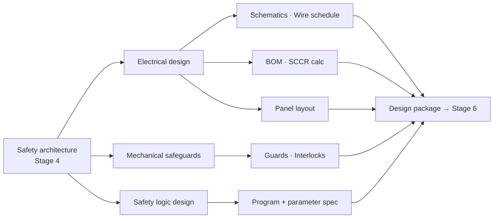

<div class="page-header">
  <span class="page-header__label">Lifecycle Stage 05</span>
  <h1>Detailed Design and Part Sizing</h1>
</div>

## Design Artifact Flow



## 1. Purpose of This Stage

This stage translates the safety architecture from Stage 4 into **fully detailed, buildable, verifiable engineering documents** — circuit schematics, panel layouts, wire schedules, BOMs, and calculation worksheets that a technician can build from and an inspector can verify against.

This is where abstract architecture becomes physical reality. The Category 3 dual-channel architecture defined in Stage 4 becomes specific wire numbers, terminal assignments, contactor coil circuits, EDM feedback wiring, and conduit routing. The component selections from Stage 4 become purchase orders. The DC claims become actual diagnostic circuits on schematics.

The critical discipline at this stage is **fidelity to the architecture**. Every diagnostic measure claimed in the PL/SIL calculation must appear in the circuit design. Every redundant channel must be physically separated per the CCF measures scored in Stage 4. Every component must match the part number and ratings used in the calculation. If the detailed design deviates from the architecture in any way, the PL/SIL calculation is invalidated and must be revised.

This stage also addresses the electrical safety requirements that exist independently of functional safety — wire sizing, overcurrent protection, SCCR, grounding, spacing, and panel construction. These are code compliance requirements that apply whether or not the panel contains safety functions.

> **This stage answers: What exactly gets built, and does the detailed design faithfully implement the safety architecture while meeting all applicable electrical codes?**

---

## 2. Entry Criteria

This stage begins when **Stage 4 (Safety Architecture) exit criteria are met**.

### Required Inputs

| Input | Source (Stage) | Why It Matters |
|-------|---------------|----------------|
| Safety architecture document | Stage 4 | Defines the architecture that the detailed design must implement — categories, subsystem decomposition, component selections |
| Subsystem block diagrams | Stage 4 | Visual reference for translating architecture into circuit schematics |
| PL/SIL calculation reports | Stage 4 | Contains the specific components, MTTFd values, DC claims, and CCF measures that the design must implement exactly |
| Component safety data register | Stage 4 | Manufacturer safety data sheets with wiring requirements, installation constraints, and configuration parameters |
| Verification summary matrix | Stage 4 | Confirms all safety functions passed — design proceeds on this basis |
| CCF scoring worksheets | Stage 4 | Specifies physical separation, diversity, and environmental measures that must be reflected in wiring and layout |
| DC justification record | Stage 4 | Specifies diagnostic measures (EDM, cross-monitoring, plausibility checks) that must appear as actual circuits |
| Fault exclusion register | Stage 4 | Specifies installation conditions required for fault exclusions to remain valid (e.g., channel separation requirements) |
| Response time analysis | Stage 4 | Specifies response time budget — detailed design must not add delays that exceed the budget |
| Safety function register (finalized) | Stage 3/4 | Master reference for all safety functions with requirements |
| Standards register | Stage 2 | Determines which electrical codes apply (NFPA 79, IEC 60204-1, UL 508A, NEC) and conflict resolutions for multi-market |
| Conflict resolution log | Stage 2 | For multi-market projects: pre-resolved decisions on wire color, voltage, grounding approach |
| System description and boundary | Stage 1 | Physical constraints — enclosure locations, cable run lengths, ambient conditions |
| Operating mode definitions | Stage 1 | Mode selection circuits, mode-dependent safety function behavior |

**If the safety architecture document is not complete and approved, detailed design must not begin. Designing circuits before the architecture is confirmed leads to rework when the architecture changes.**

---

## 3. Standards Influence

| Standard | Role at This Stage | Key Clauses |
|----------|-------------------|-------------|
| **NFPA 79:2024** | Electrical safety of industrial machinery — US market. Governs wire sizing, overcurrent protection, control circuits, grounding, disconnects, operator interface, and documentation for machine electrical equipment. | Ch. 5 (incoming supply), Ch. 7 (protection), Ch. 8 (grounding), Ch. 9 (control circuits), Ch. 12 (conductors), Ch. 13 (wiring practices), Ch. 19 (documentation) |
| **IEC 60204-1:2016** | Electrical equipment of machines — international. Parallel to NFPA 79 for non-US markets. | Cl. 5 (incoming supply), Cl. 7 (protection), Cl. 8 (equipotential bonding), Cl. 12 (conductors), Cl. 13 (wiring practices), Cl. 14 (PLC/programmable systems), Cl. 17 (documentation) |
| **UL 508A:2023 (4th Ed.)** | Industrial control panels — US NRTL listing requirements. Governs panel construction, component selection, SCCR, wiring, spacing, marking. | All sections — particularly Supplement SB (SCCR), Supplement SA (spacing) |
| **NEC (NFPA 70:2023)** | National Electrical Code — US installation. Governs field wiring, motor circuits, grounding, conductor sizing, raceway sizing. | Art. 250 (grounding), Art. 310 (conductors), Art. 409 (industrial control panels), Art. 430 (motors), Art. 670 (industrial machinery) |
| **ISO 13849-1:2023** | Verification and validation requirements for safety-related circuits — the detailed design must implement the architecture and enable the verification plan. | §8 (validation), Annex D (diagnostic measures to implement), Annex K (pre-commissioning checklist reference) |
| **IEC 62061:2021** | Verification requirements for SIL-rated circuits. | §6.6 (verification), §6.7 (software — reference to Stage 4.5) |
| **IEC 61140:2016** | Protection against electric shock — basic and fault protection measures. Informs grounding and insulation design. | All clauses |
| **IEC 61439-1/2** | Low-voltage switchgear and controlgear assemblies — if the panel is classified as a switchgear assembly rather than an industrial control panel. | Temperature rise, short-circuit withstand |
| **IEC 60529:2013** | IP rating — enclosure protection degrees. Determines enclosure specification. | All clauses |
| **IEC 61326-1:2020** | EMC requirements for measurement, control, and laboratory equipment. Informs cable routing, shielding, and filtering. | All clauses |
| **UL 61010-1 / UL 61010-2-201** | If the equipment is classified as laboratory/test/measurement equipment rather than industrial control. | Applicability determination |
| **IEEE 1584** | Arc flash hazard calculation — if arc flash analysis is required for the panel or field installation. | All clauses |

---

## 4. Engineering Activities

### 4.1 Circuit Design — Power Distribution

#### 4.1.1 Incoming Supply and Main Disconnect

| Requirement | NFPA 79 | IEC 60204-1 | Notes |
|------------|---------|-------------|-------|
| Main disconnect device | §5.3 — supply disconnecting device required, door-interlocked or externally operable | §5.3 — same requirement | Must disconnect all ungrounded supply conductors |
| Lockout capability | §5.3.2 — must be lockable in OFF position | §5.3.2 — same | OSHA 29 CFR 1910.147 (LOTO) requires this |
| Marking | Nameplate per §19.2 | Nameplate per §17.2 | Voltage, phase, frequency, full-load current, SCCR |
| Overcurrent protection | §7.2 — supply circuit overcurrent protection | §7.2 — same | Must be coordinated with utility available fault current |

#### 4.1.2 Branch Circuit Design — Motor Circuits

Each motor circuit requires a coordinated branch design:

```
Main Disconnect
      │
      ▼
Branch Circuit Protective Device (BCPD)
(fuse or circuit breaker per NEC 430.52 / NFPA 79 §7.2)
      │
      ▼
Motor Controller / Starter
(contactor + overload relay, or VFD)
      │
      ▼
Motor
```

| Element | NEC Reference | NFPA 79 Reference | Design Requirement |
|---------|-------------|-------------------|-------------------|
| Branch circuit protective device (BCPD) | Art. 430.52 | §7.2.4 | Size per motor FLA and type of protective device; must coordinate with downstream devices |
| Motor controller | Art. 430.83 | §9.2.2 | HP-rated or current-rated for the application; utilization category (AC-3, AC-4) |
| Overload relay | Art. 430.32 | §7.3 | Sized to motor FLA; Class 10/20/30 trip curve per application |
| Conductor sizing | Art. 430.22 | §12.1 | 125% of motor FLA for continuous duty |
| Short-circuit ground-fault protection | Art. 430.52 | §7.2.4 | Type and size per NEC Table 430.52 |

#### 4.1.3 Branch Circuit Design — Non-Motor Loads

| Load Type | Protection Reference | Sizing Reference |
|-----------|---------------------|-----------------|
| Heaters, resistive loads | NEC Art. 424, NFPA 79 §7.2 | 125% of rated current for continuous loads |
| Power supplies (24VDC) | NFPA 79 §9.1.1 | Input circuit protection per power supply rating |
| Lighting circuits | NFPA 79 §16 | Per lamp load and circuit length |
| Receptacle circuits | NFPA 79 §16.4 | Per NEC Art. 210 |

### 4.2 Wire Sizing

#### 4.2.1 Power Conductors — Within Panel

| Standard | Method | Key Considerations |
|----------|--------|-------------------|
| **UL 508A** | Wiring table per §38 (internal panel wiring) | Based on component ratings and panel temperature; ampacity values differ from NEC because they account for panel enclosure temperature rise |
| **NEC Art. 310** | Ampacity tables (Table 310.16 for field wiring) | Derate for ambient temperature, conduit fill, and continuous duty |
| **IEC 60204-1 §12** | Conductor sizing per IEC 60364 principles | Based on rated current, ambient temperature, and installation method |

**Critical consideration — temperature derating:**
- VFDs, soft starters, power supplies, and large contactors generate significant heat inside the enclosure
- Internal panel ambient temperature may be 20–30°C above external ambient
- Wire ampacity must be derated for the actual temperature at the point of installation, not the room temperature
- UL 508A addresses this through its wiring tables; NEC requires explicit derating per Table 310.15(B)(1)

#### 4.2.2 Power Conductors — Field Wiring

| Requirement | NEC Reference | Considerations |
|-------------|-------------|---------------|
| Ampacity | Table 310.16 | Based on insulation temperature rating, ambient temperature, and number of current-carrying conductors in raceway |
| Temperature derating | Table 310.15(B)(1) | Required when ambient exceeds 30°C |
| Conduit fill derating | Table 310.15(C)(1) | Required when more than 3 current-carrying conductors in raceway |
| Voltage drop | NEC 210.19(A) Informational Note, 215.2(A)(4) Informational Note | Recommended maximum 3% branch circuit, 5% total — not a code requirement but good practice and often a customer specification |
| Minimum size | NEC 430.22, NFPA 79 §12.5 | 14 AWG minimum for power circuits in most cases; 12 AWG minimum for some applications |

#### 4.2.3 Control Conductors

| Standard | Minimum Size | Notes |
|----------|-------------|-------|
| NFPA 79 §12.5 | 14 AWG minimum (power), 16 AWG minimum (control) | Exception allows 18 AWG for some low-energy circuits |
| IEC 60204-1 §12.1 | 0.75 mm² minimum (control), 1.5 mm² minimum (power) | |
| UL 508A §38 | Per wiring table — varies by current and temperature | Internal panel wiring |

#### 4.2.4 Safety Circuit Conductors

| Requirement | Basis | Notes |
|-------------|-------|-------|
| Wire gauge must support the safety function's current and voltage requirements | Stage 4 component specifications | Undersized wire on a safety circuit can cause voltage drop that affects safety device operation |
| Redundant channel conductors must be physically separated | Stage 4 CCF measures | Route in separate conduits, cable trays, or with physical barriers per CCF scoring |
| Wire color for safety circuits | See Section 5.3 | Distinct identification required |

### 4.3 SCCR (Short-Circuit Current Rating)

SCCR is the maximum fault current the panel can safely withstand. It is required on the nameplate per NEC Art. 409.110 and UL 508A.

#### 4.3.1 Methodology — Weakest-Link Method (UL 508A Supplement SB)

```
SCCR of the panel = Lowest SCCR of any power circuit component
                     in the path from line terminals to load terminals
```

**Every component in the power circuit path must be evaluated:**

| Component Type | Where to Find SCCR | Common Limiting Values |
|---------------|--------------------|-----------------------|
| Main circuit breaker | UL listing, manufacturer data | 10–65 kA typical |
| Branch circuit breakers/fuses | UL listing, manufacturer data | 10–200 kA typical |
| Contactors | UL listing — often the limiting factor | 5–18 kA typical without upstream current-limiting device |
| Motor starters | UL listing (self-protected combination rating) | Varies widely — check specific listing |
| Overload relays | UL listing | 5–100 kA depending on type |
| Power distribution blocks | UL listing | 10–100 kA — often overlooked |
| Terminal blocks (power) | UL listing | 10–100 kA — often overlooked |
| Fuse holders | UL listing | 10–200 kA — but only with the rated fuse installed |
| Surge protection devices (SPDs) | UL listing | 5–25 kA — frequently the lowest-rated component in the panel |
| Disconnect switches | UL listing | 10–65 kA typical |
| Transformers | UL listing, withstand rating | Varies — check primary and secondary side |

**SCCR enhancement methods:**
- Current-limiting fuses or circuit breakers upstream can raise the effective SCCR of downstream components (per UL 508A Supplement SB feeder protection rules)
- The enhanced SCCR is the lower of: the upstream device's interrupting rating, or the downstream component's SCCR with the specified upstream device

**Common mistakes:**
- Forgetting to evaluate SPDs, power distribution blocks, and terminal blocks
- Using component SCCR without verifying the upstream protection device that enables it
- Not updating SCCR when substituting a component with a lower-rated alternative
- Assuming the main breaker SCCR is the panel SCCR

#### 4.3.2 SCCR Documentation

| Item | Requirement |
|------|------------|
| SCCR calculation worksheet | Document every component in every power circuit path with its individual SCCR, any upstream current-limiting enhancement, and the resulting panel SCCR |
| Nameplate marking | Panel nameplate must state the SCCR per NEC Art. 409.110 |
| Available fault current verification | The SCCR must meet or exceed the available fault current at the point of installation — this must be confirmed with the customer or site electrical data |
| Coordination with upstream protection | If the available fault current exceeds the panel's standalone SCCR, upstream current-limiting protection may be specified — this must be documented as a condition of installation |

### 4.4 Grounding Design

#### 4.4.1 Three-Layer Grounding Approach

```
Layer 1: NEC Art. 250 — Baseline Grounding
├── Equipment grounding conductor (EGC) sizing per Table 250.122
├── Grounding electrode conductor (GEC) if applicable
├── Main bonding jumper
└── System grounding (solidly grounded, impedance grounded, ungrounded)

Layer 2: NFPA 79 Ch. 8 / IEC 60204-1 §8 — Machine Bonding
├── Protective bonding circuit (PE) throughout the machine
├── All exposed conductive parts bonded to PE
├── PE conductor sizing (minimum 10 AWG or per NFPA 79 Table 8.2.2)
├── Continuity requirements (≤ 0.1Ω per IEC 60204-1 §18.2)
└── Door bonding jumpers (every hinged panel door)

Layer 3: EMC / Functional Grounding
├── Signal ground (for analog, communication, shielded cables)
├── Cable shield termination (360° bonding preferred, pigtail acceptable for low-frequency)
├── Separation of PE (protective earth) from signal ground
├── Star-point grounding for sensitive circuits
└── EMC filters and surge protection grounding
```

#### 4.4.2 Key Grounding Requirements

| Requirement | Standard | Detail |
|------------|---------|--------|
| Equipment grounding conductor sizing | NEC Table 250.122 | Based on the rating of the upstream overcurrent device |
| PE conductor sizing inside panel | NFPA 79 Table 8.2.2, IEC 60204-1 §8.2 | Minimum cross-section based on supply conductor size |
| PE conductor color | NEC: Green or green/yellow; NFPA 79: Green or green/yellow; IEC 60204-1: Green/yellow | Use green/yellow for both US and EU compliance |
| Door bonding jumper | NFPA 79 §8.2.4, UL 508A | Every hinged door or removable panel with electrical components must have a bonding jumper — commonly overlooked |
| Ground bus bar | UL 508A, NFPA 79 | Dedicated PE bus bar; all PE conductors terminate to this bus, not daisy-chained between components |
| Continuity verification | IEC 60204-1 §18.2 | ≤ 0.1Ω from any exposed conductive part to PE terminal — verified during build (Stage 7) and commissioning (Stage 10) |

#### 4.4.3 Grounding and Safety Circuits

| Consideration | Requirement |
|--------------|------------|
| Safety circuit reference ground | Safety circuits (24VDC) should reference a clean ground point; noisy grounding can cause false trips or missed faults |
| Ground fault detection on safety circuits | Some safety controllers provide ground fault detection on safety I/O circuits — this contributes to DC and must be wired per manufacturer instructions |
| Separation of safety PE and functional ground | Safety PE (protective earth for shock protection) and functional/EMC ground (signal reference) should be kept separate to avoid noise coupling |

### 4.5 Spacing, Creepage, and Clearance

#### 4.5.1 Definitions

| Term | Definition |
|------|-----------|
| **Clearance** | Shortest distance through air between two conductive parts |
| **Creepage** | Shortest distance along the surface of insulating material between two conductive parts |

#### 4.5.2 Requirements

| Standard | Requirement |
|----------|------------|
| **UL 508A Supplement SA** | Provides minimum spacing tables based on voltage and pollution degree; applies to component mounting, terminal blocks, wire routing, bus bars |
| **IEC 60204-1 §11** | References IEC 60664-1 for insulation coordination — creepage and clearance based on voltage, pollution degree, and overvoltage category |
| **Component listing conditions** | Many components have specific spacing requirements stated in their UL listing or IEC certification — these override generic table values |

#### 4.5.3 Design Practices

| Practice | Purpose |
|---------|---------|
| Use finger-safe (IP2X) terminal blocks and bus bars in high-voltage sections | Prevents accidental contact during maintenance; satisfies NFPA 79 §6.2.2 |
| Install barriers between high-voltage and low-voltage sections | Maintains creepage and clearance; prevents arc propagation |
| Route high-voltage and low-voltage wiring in separate wireways | Prevents voltage coupling; maintains clearance requirements |
| Route safety circuit wiring separately from power wiring | Prevents EMI from affecting safety signal integrity; supports CCF separation measures |
| Verify spacing at component mounting points | Components mounted too close together may violate clearance requirements even if the overall layout looks adequate |
| Account for wire routing in clearance calculations | Wires routed between terminals can reduce effective clearance — use wire duct or tie-down to maintain spacing |

### 4.6 Control Circuit Design

#### 4.6.1 Control Power Architecture

| Topology | Description | When to Use | Standard Reference |
|----------|-------------|-------------|-------------------|
| Control transformer (480V → 120VAC) | Machine-mounted transformer provides isolated 120VAC control power | Traditional US practice; motor starters, pilot devices, some PLC I/O | NFPA 79 §9.1, NEC Art. 430.72 |
| 24VDC power supply (480V → 24VDC) | Switch-mode power supply provides 24VDC for PLC, safety circuits, sensors | Modern practice; all safety PLCs, safety I/O, most sensors | NFPA 79 §9.1.1, IEC 60204-1 §9.1 |
| Combination | Both 120VAC (for motor starters, heaters) and 24VDC (for PLC, safety, sensors) | Most industrial machines | Common |

#### 4.6.2 24VDC Power Supply Design for Safety Circuits

| Requirement | Detail |
|------------|--------|
| Dedicated supply for safety circuits | Safety circuits should have a dedicated 24VDC power supply (or dedicated output channel) separate from general I/O power, to prevent non-safety loads from affecting safety circuit voltage |
| Output voltage monitoring | Some safety controllers require a specific voltage range (19–30VDC typical); voltage sag from overloaded supplies can cause nuisance trips or missed fault detection |
| Redundant power supplies | For high-availability applications or where power supply failure would cause a common-cause failure of multiple safety functions — evaluate during CCF analysis |
| Overcurrent protection | Each 24VDC branch should be individually fused or protected with electronic circuit protectors to prevent a short circuit on one branch from collapsing the entire 24VDC bus |
| Grounding of 24VDC | 0V (negative) terminal should be grounded at one point only (single-point ground) to provide a ground fault reference without creating ground loops |

#### 4.6.3 Safety Circuit Implementation — Translating Architecture to Schematics

This is the critical activity where the Stage 4 architecture becomes wiring. For each safety function, verify:

| Architecture Element | Schematic Implementation | Verification |
|---------------------|------------------------|-------------|
| Dual-channel input (Category 3/4) | Two separate input wires from the safety device to two separate safety controller input channels | Verify on schematic: two distinct wire numbers, two distinct input terminal addresses |
| EDM (External Device Monitoring) on output contactors | NC auxiliary contact from each contactor wired back to the safety controller feedback input | Verify on schematic: feedback wiring shown, correct NC contact used, correct controller input address |
| Cross-monitoring between channels | Safety controller configured to compare both input channels and detect discrepancy | Verify in safety PLC configuration (Stage 4.5) and on I/O assignment drawing |
| Physical separation of redundant channels | Redundant wires routed in separate wireways, conduits, or with minimum spacing | Verify on panel layout drawing and field routing drawings — annotate separation requirement |
| Muting circuit (if applicable) | Muting sensors wired to safety controller muting inputs per IEC 62046; muting lamp wired and visible | Verify on schematic: muting sensor wiring, muting enable logic, muting indication |
| Reset circuit | Reset button wired to safety controller reset input; manual reset required per safety function specification | Verify on schematic: reset button location, wiring, and that automatic reset is not possible unless explicitly justified |
| Mode selection | Mode selector switch wired to safety controller; mode-dependent safety function behavior implemented | Verify on schematic and in safety PLC program |
| Delayed output (Category 1 stop — controlled stop then power removal) | Timer or drive-controlled deceleration followed by contactor opening | Verify on schematic: stop sequence, timer or drive parameter, contactor opening after delay |

### 4.7 Panel Layout Design

#### 4.7.1 Layout Principles

| Principle | Requirement | Standard Reference |
|-----------|------------|-------------------|
| Separation of power and control sections | High-voltage power components in one area, low-voltage control components in another, with barriers or spacing | UL 508A, IEC 60204-1 §11, good practice |
| Accessibility for maintenance | Components requiring maintenance (fuses, relays, drives) accessible without removing other components | NFPA 79 §5.1, IEC 60204-1 §5.1 |
| Heat management | Heat-generating components (drives, power supplies, starters) mounted at top of enclosure or near ventilation; temperature-sensitive components (PLCs, safety controllers) away from heat sources | UL 508A thermal considerations, manufacturer installation requirements |
| Wire duct sizing | Minimum 25% fill spare capacity in wire duct; larger duct for areas with safety circuit separation requirements | Good practice; supports future modifications |
| DIN rail layout | Logical grouping by function (safety section, I/O section, power section); labeled per function | Good practice; supports troubleshooting and maintenance |
| Enclosure sizing | Account for all components, wire duct, wire bend radius, accessibility, and heat dissipation | UL 508A, IEC 60204-1 §11 |
| Door-mounted components | Operator interface devices (HMI, pushbuttons, pilot lights) on door; bonding jumper for each door | NFPA 79 §8.2.4, UL 508A |

#### 4.7.2 Safety-Specific Layout Requirements

| Requirement | Detail |
|------------|--------|
| Group safety components together | Safety relays, safety PLC, safety I/O modules should be grouped in a dedicated section of the panel — labeled "SAFETY" or "SAFETY SECTION" |
| Redundant channel wire routing | Dual-channel wiring routed in separate wire ducts or on opposite sides of the panel — per CCF separation measures from Stage 4 |
| Safety circuit terminal blocks | Dedicated terminal block group for safety circuits — physically separated from non-safety terminals; labeled distinctly |
| E-stop circuit wiring | E-stop loop wiring should be easily traceable on the layout; route directly without passing through non-safety terminal blocks |
| Access restrictions | If the panel contains high-voltage components, access must be restricted to qualified personnel (lockable door, tool-operated fasteners) per NFPA 79 §6.2 / IEC 60204-1 §6.2 |

### 4.8 Documentation — Circuit Schematics

#### 4.8.1 Schematic Requirements

| Standard | Documentation Requirements |
|----------|--------------------------|
| **NFPA 79 Ch. 19** | Circuit diagrams showing all circuits, components, and interconnections; device identification; wire identification; terminal identification |
| **IEC 60204-1 Cl. 17** | Same requirements; additionally requires documentation to be in the language of the country of use |
| **IEC 81346** | Reference designation system for industrial systems — standardized component tagging |
| **IEEE 315 / IEC 60617** | Graphical symbols for electrical diagrams |

#### 4.8.2 Schematic Content Checklist

| Element | Required | Notes |
|---------|----------|-------|
| Title block with project identification, drawing number, revision, date, drawn by, checked by | Yes | Every sheet |
| Single-line diagram (power distribution overview) | Yes | Shows incoming supply, main disconnect, branch circuits, loads |
| Schematic diagrams (detailed circuit diagrams) | Yes | Shows every wire, component, terminal, and connection |
| Component identification (tag numbers) | Yes | Consistent with BOM and panel layout |
| Wire identification (wire numbers) | Yes | Consistent with wire schedule |
| Terminal identification | Yes | Every terminal block, terminal number, and destination |
| Cross-references | Yes | Every coil shows contact locations; every contact shows coil location |
| Safety function identification | Yes | Each safety circuit clearly identified with SF-ID from safety function register |
| Dual-channel indication | Yes | Redundant channels clearly labeled (Channel A / Channel B, or CH1 / CH2) |
| EDM feedback circuits shown | Yes | Every feedback path from output device back to safety controller |
| I/O assignment table | Yes | PLC and safety PLC I/O addresses mapped to field devices |
| Interconnection diagrams | Yes | Panel-to-panel and panel-to-field wiring |
| Enclosure layout reference | Yes | Reference to panel layout drawing for physical location of components |

#### 4.8.3 Safety Circuit Schematic Best Practices

| Practice | Purpose |
|---------|---------|
| Draw safety circuits on dedicated schematic pages, grouped together | Makes safety circuits easily identifiable for review, commissioning, and maintenance |
| Label each safety circuit page with the SF-ID and safety function description | Direct traceability from schematic to safety function register |
| Show both channels of a dual-channel circuit on the same page (or facing pages) | Makes it easy to verify that both channels are complete and consistent |
| Annotate wire separation requirements directly on the schematic | Ensures the build technician implements the CCF separation measures |
| Show the safe state explicitly on the schematic (de-energized position of contactors, valve positions) | Verifies that the circuit achieves the correct safe state on loss of power |
| Include timing information where relevant (response times, delay times) | Supports commissioning verification of response time requirements |

### 4.9 Bill of Materials (BOM)

#### 4.9.1 BOM Requirements

| Element | Required | Notes |
|---------|----------|-------|
| Component tag number (matching schematic and layout) | Yes | Primary cross-reference |
| Manufacturer | Yes | Specific manufacturer — safety components are not generically substitutable |
| Part number | Yes | Exact part number used in PL/SIL calculation |
| Description | Yes | Functional description |
| Quantity | Yes | Including spares if specified |
| Safety-rated designation | Yes | Flag safety-rated components distinctly (column or notation) |
| SCCR rating (for power components) | Yes | Required for SCCR calculation |
| UL file number / listing (if UL 508A listing) | Yes | Required for listed panel |
| Substitution restrictions | Yes | Safety-rated components must not be substituted without re-verification of PL/SIL calculation — note this explicitly |

#### 4.9.2 BOM and Safety Architecture Traceability

Every component in the Stage 4 PL/SIL calculation must appear in the BOM with the exact part number used in the calculation. Add a column or notation linking safety-rated components to their safety function:

| Tag | Manufacturer | Part Number | Description | Safety Function | Substitution Restricted? |
|-----|-------------|-------------|-------------|----------------|------------------------|
| K1 | Siemens | 3RT2016-1BB41 | Contactor, 9A, 24VDC coil | SF-01, SF-02 (output, CH1) | YES — PL/SIL calc uses this specific B10d |
| K2 | Siemens | 3RT2016-1BB41 | Contactor, 9A, 24VDC coil | SF-01, SF-02 (output, CH2) | YES — PL/SIL calc uses this specific B10d |
| SR1 | Pilz | PNOZ s4 | Safety relay, dual-channel | SF-01 (logic) | YES — PL/SIL calc uses this specific PFHd |
| GS1 | Schmersal | AZM201-B30-T-1P2PA | Safety interlock switch, coded | SF-01 (input) | YES — PL/SIL calc uses this specific B10d |

### 4.10 Wire Schedule

| Column | Content |
|--------|---------|
| Wire number | Unique identifier matching schematic |
| From (component tag — terminal) | Origin terminal |
| To (component tag — terminal) | Destination terminal |
| Wire gauge (AWG or mm²) | Per sizing calculation |
| Insulation type and temperature rating | THHN, MTW, etc. |
| Color | Per applicable standard and safety wiring practices |
| Cable / conduit assignment | Which cable or conduit the wire is routed in |
| Safety circuit? | Yes/No — flags wires that are part of safety functions |
| Channel (if dual-channel) | A or B — for redundant safety circuits |
| Separation requirement | Notes on required physical separation from other circuits |

### 4.11 Safety Function Verification Plan

This deliverable bridges detailed design to commissioning (Stage 10). For each safety function, define how it will be verified:

| SF-ID | Safety Function | Verification Method | Test Description | Acceptance Criteria | Stage of Verification | Reference Document |
|-------|----------------|-------------------|-----------------|--------------------|--------------------|-------------------|
| SF-01 | Guard interlock — operator door | Functional test | Open door during automatic cycle; measure time to safe state | Machine stops within 200ms; restart inhibited until door closed and reset pressed; EDM detects simulated contactor failure | Stage 9 (pre-comm) + Stage 10 (commissioning) | Stage 4 architecture doc, ISO 13849-1 Annex K |
| SF-02 | E-stop — operator station | Functional test | Press e-stop during automatic cycle; measure time to safe state | All hazardous motion stops within 500ms; restart inhibited until e-stop released and reset pressed | Stage 9 + Stage 10 | ISO 13850, Stage 4 architecture doc |
| SF-03 | Light curtain — infeed | Functional test + response time measurement | Interrupt light curtain during automatic cycle; verify muting conditions; measure response time | Machine stops within 150ms; muting activates only under correct conditions; response time within budget for safety distance | Stage 9 + Stage 10 | ISO 13855, IEC 62046, Stage 4 architecture doc |

**This plan is created at this stage because the designer understands the circuit and the intended behavior. If the verification plan is deferred to Stage 9/10, the commissioning engineer must reverse-engineer the design intent from the schematics.**

---

## 5. Safety Wiring Practices — Detailed Reference

This section expands on the safety-specific wiring requirements that are distinct from general electrical wiring practices.

### 5.1 24VDC Safety Circuit Rationale

| Topic | Requirement | Rationale |
|-------|------------|-----------|
| 24VDC preferred for safety I/O | Safety PLCs and safety relays are designed for 24VDC input/output | Lower energy, easier to achieve safe disconnection, compatible with all modern safety devices |
| PELV (Protective Extra-Low Voltage) | 24VDC circuits derived from a safety-rated transformer or PELV-rated power supply provide inherent protection against electric shock | IEC 60204-1 §9.1.4, IEC 61140 — additional benefit of safety circuits being touch-safe |
| Wire-to-wire short detection | Safety controllers can detect shorts between 24VDC wires more reliably at low voltage than at 120VAC | Contributes to DC; supports fault detection in dual-channel circuits |

### 5.2 NC (Normally Closed) Contact Logic

| Principle | Implementation | Rationale |
|-----------|---------------|-----------|
| Safety inputs use NC (normally closed) contacts | E-stop: NC contacts open when pressed. Guard switch: NC contacts open when door opens. | Wire break or disconnection is detected as a safety demand — fail-safe behavior. If NO contacts were used, a wire break would be undetected and the safety function would not respond to a demand. |
| Safety output monitoring uses NC auxiliary contacts | Contactor NC auxiliary contact feeds back to safety controller | Welded contactor is detected: if the contactor welds, its NC contact does not close, and the safety controller detects the fault. |

### 5.3 Wire Color Coding for Safety Circuits

| Circuit Type | NFPA 79 (US) | IEC 60204-1 (EU) | Recommended Practice (Global) |
|-------------|-------------|-------------------|------------------------------|
| Protective earth (PE) | Green or green/yellow | Green/yellow | Green/yellow |
| AC power — ungrounded | Black (or other, except green/white/gray) | Black or brown | Black |
| AC power — neutral | White or gray | Light blue | Per market (resolve in Stage 2) |
| 24VDC positive (+) | Red common practice (not code-mandated) | Not specified by color | Red |
| 24VDC negative (0V) | Blue common practice | Dark blue | Blue |
| Safety circuit — dedicated color | Not code-mandated but strongly recommended | Not code-mandated | **Yellow or orange** — industry best practice for immediate visual identification of safety circuits |
| E-stop loop | Not code-mandated | Not code-mandated | **Yellow** — common industry practice |

**Recommendation:** Adopt a company standard that uses a distinct color (yellow or orange) for all safety circuit conductors. This is not mandated by code but dramatically improves identification during build, commissioning, troubleshooting, and maintenance. Document the convention in the project wiring standard.

### 5.4 Dual-Channel Input Specification

| Requirement | Detail |
|------------|--------|
| Two independent conductors from safety device to safety controller | Each channel on a separate wire, separate terminal, separate input address |
| Physical separation | Route in separate wire duct channels, separate conduits, or with minimum spacing per CCF requirements |
| No shared failure points | Channels must not share a common terminal block, common wire duct (without separation), or common connector |
| Distinct wire identification | Channel A and Channel B wires must have distinct wire numbers and be identifiable on the schematic and in the field |
| End-to-end integrity | Each channel wired continuously from the safety device to the safety controller input — no intermediate splices or junction boxes that could create common failure points (unless junction box maintains separation) |

### 5.5 Termination Practices

| Practice | Requirement | Rationale |
|---------|------------|-----------|
| Ferrules on stranded wire | Required for all stranded wire terminations to screw or spring-cage terminals | Prevents strand escape (loose strands can cause short circuits — including between safety channels) |
| Torque specification | Terminals tightened to manufacturer-specified torque | Under-torqued terminals cause intermittent connections; over-torqued terminals damage wire or terminal |
| Ring or fork terminals for high-vibration environments | Crimp terminals on safety circuits in high-vibration areas | Prevents wire pull-out from vibration |
| Labeling | Every wire labeled at both ends with wire number per schematic | Required for traceability and maintenance; critical for safety circuits |

### 5.6 Cable and Conduit Routing for Safety Circuits

| Requirement | Detail |
|------------|--------|
| Separation from power cables | Safety signal cables routed separately from power cables (especially VFD output cables) to prevent EMI coupling |
| Separation of redundant channels | Channel A and Channel B of dual-channel safety circuits routed in separate conduits or cable trays |
| Shielding (if required) | Safety analog signals (e.g., safety-rated pressure transmitters) may require shielded cable with proper shield termination |
| Minimum bend radius | Per cable manufacturer specification — exceeding bend radius can damage conductors and cause intermittent failures |
| Protection from mechanical damage | Safety circuit cables protected from mechanical damage by conduit, cable tray with covers, or armored cable in exposed areas |
| Documentation of routing | Cable routing drawings or conduit schedules must show which cables are safety circuits and which conduits contain redundant channels |

---

## 6. Key Deliverables — Summary

| # | Deliverable | Standard Reference | Description |
|---|------------|-------------------|-------------|
| 1 | **Bill of Materials (BOM)** | — | Complete parts list with safety component flagging, substitution restrictions, and traceability to PL/SIL calculations |
| 2 | **Circuit diagrams / schematics** | NFPA 79 Ch. 19, IEC 60204-1 Cl. 17 | Complete circuit schematics with safety circuits identified, dual channels shown, EDM feedback circuits included |
| 3 | **Wire schedule** | NEC Art. 310, UL 508A, IEC 60204-1 §12 | Complete wire list with gauge, color, routing, safety circuit flagging, and channel identification |
| 4 | **Panel layout drawing** | UL 508A, IEC 60204-1 §11 | Physical layout showing component placement, safety section grouping, wire duct routing, and separation annotations |
| 5 | **SCCR calculation worksheet** | UL 508A Supplement SB | Complete weakest-link calculation for every power circuit path |
| 6 | **Grounding drawing / schedule** | NEC Art. 250, NFPA 79 Ch. 8, UL 508A | PE bus bar layout, grounding conductor sizing, door bonding jumpers, grounding electrode connections |
| 7 | **Safety function verification plan** | ISO 13849-1, IEC 62061 | Test procedures for each safety function — created now, executed at Stage 9/10 |
| 8 | **Interconnection diagrams** | NFPA 79 Ch. 19, IEC 60204-1 Cl. 17 | Panel-to-panel and panel-to-field wiring connections |
| 9 | **I/O assignment table** | — | PLC and safety PLC I/O addresses mapped to field devices with safety function cross-reference |
| 10 | **Conduit / cable schedule** | NEC, NFPA 79 | Cable and conduit routing with fill calculations, safety circuit separation annotations |
| 11 | **Motor circuit sizing calculations** | NEC Art. 430, NFPA 79 §7, IEC 60204-1 §7 | Branch circuit sizing, protective device selection, conductor sizing for each motor circuit |
| 12 | **Voltage drop calculations** | NEC (informational), customer specification | For long cable runs — verify voltage at the load is within acceptable range, especially for safety devices |
| 13 | **Enclosure thermal analysis** | UL 508A, manufacturer tools | Verify enclosure temperature rise is within component ratings — especially relevant when VFDs and safety PLCs are in the same enclosure |
| 14 | **Nameplate specification** | NEC Art. 409.110, UL 508A, NFPA 79 §19.2 | Content for panel nameplate: voltage, phase, frequency, FLA, SCCR, enclosure type/IP rating, manufacturer, date |
| 15 | **Updated assumptions register** | — | Any assumptions made during detailed design (e.g., assumed cable run lengths, assumed ambient temperatures) |

---

## 7. Design Review Checklist — Safety Circuit Fidelity

Before closing this stage, perform a systematic check that the detailed design faithfully implements the safety architecture:

| # | Check Item | Stage 4 Reference | Schematic Reference | Status |
|---|-----------|-------------------|-------------------|--------|
| 1 | Every safety function in the register has corresponding circuits on the schematics | Safety function register | Schematic page numbers per SF-ID | |
| 2 | Every component in the PL/SIL calculation appears in the BOM with the correct part number | PL/SIL calculation report, component safety data register | BOM line items | |
| 3 | Every dual-channel input is shown with two distinct wires and two distinct input addresses | Subsystem block diagrams | Schematic — verify two wire numbers, two terminals | |
| 4 | Every EDM feedback circuit is shown on the schematic | DC justification record | Schematic — verify NC feedback wiring from each contactor | |
| 5 | Every CCF separation measure is annotated on the layout and/or routing drawings | CCF scoring worksheet | Panel layout, conduit schedule | |
| 6 | Every fault exclusion condition is satisfied by the design (e.g., channel separation, coded actuators) | Fault exclusion register | Layout, routing, and component specification | |
| 7 | Reset circuits are implemented per the safety function specification (manual reset, no automatic restart unless justified) | Safety function register | Schematic — verify reset button wiring and logic | |
| 8 | Mode selection circuits are implemented per the safety function specification | Safety function register, operating mode definitions | Schematic — verify mode switch wiring and mode-dependent behavior | |
| 9 | Muting circuits (if any) are implemented per IEC 62046 with muting indication | Safety function register | Schematic — verify muting sensor wiring, muting logic, muting lamp | |
| 10 | Response time is not degraded by the detailed design (no added delays, no slow components substituted) | Response time analysis | Component data sheets, drive parameters | |
| 11 | Safe state (de-energized position) of all output devices achieves the correct safe condition | Safety function register | Schematic — verify contactor/valve de-energized state matches specified safe state | |
| 12 | Safety-rated components are flagged on BOM with substitution restrictions | Component safety data register | BOM notation | |

---

## 8. Exit Criteria — Gate Review

This stage is complete when **all** of the following are true:

| # | Criterion | Evidence |
|---|-----------|----------|
| 1 | Circuit schematics are complete for all circuits including safety circuits | Completed schematic set |
| 2 | Every safety function has corresponding circuits traceable to the safety function register | Design review checklist Section 7 — all items verified |
| 3 | BOM is complete with all safety components flagged and substitution restrictions noted | Completed BOM |
| 4 | Wire schedule is complete with safety circuit and channel identification | Completed wire schedule |
| 5 | Panel layout is complete with safety section grouping and separation annotations | Completed layout drawing |
| 6 | SCCR calculation is complete and result is documented | SCCR calculation worksheet |
| 7 | Grounding design is complete and documented | Grounding drawing/schedule |
| 8 | Motor circuit sizing and protective device coordination is complete | Motor circuit calculations |
| 9 | Safety function verification plan is complete for all safety functions | Verification plan document |
| 10 | Design fidelity check confirms all Stage 4 architecture elements are implemented in the detailed design | Completed design review checklist (Section 7) — all pass |
| 11 | Schematics and BOM are reviewed by at least one person other than the designer | Review record (signature, date, comments resolved) |
| 12 | All deliverables are consistent (schematic matches BOM matches layout matches wire schedule) | Cross-reference check completed |
| 13 | All assumptions are documented with owners and resolution dates | Updated assumptions register |
| 14 | Enclosure thermal analysis confirms all components within rated operating temperature | Thermal analysis record |

**If the design fidelity check (Section 7) reveals any discrepancy between the detailed design and the Stage 4 architecture, the discrepancy must be resolved before proceeding. Either update the detailed design to match the architecture, or update the architecture and re-verify the PL/SIL calculation.**

---

## 9. Roles and Responsibilities at This Stage

| Role | Responsibility |
|------|---------------|
| **Electrical / Controls Designer** | Owns this stage — creates schematics, panel layout, wire schedule, BOM, SCCR calculation, grounding design, motor circuit sizing |
| **Safety / Controls Engineer** | Reviews all safety circuit implementation for fidelity to Stage 4 architecture; authors safety function verification plan; verifies EDM, dual-channel, CCF separation, and reset circuit implementation |
| **Mechanical Engineer** | Provides enclosure mounting requirements, machine layout for cable routing, mechanical stopping time data for response time verification |
| **Project Manager** | Monitors design completion; ensures design review is scheduled and completed; manages BOM release to procurement |
| **Procurement** | Receives BOM; confirms availability and lead times; flags any component substitution requests to safety engineer before ordering |
| **Independent Reviewer** | Reviews schematics and design fidelity check — should be someone other than the designer; for safety-critical circuits, should be the safety engineer or an independent verifier |

---

## 10. Common Mistakes at This Stage

| Mistake | Consequence | How to Avoid |
|---------|-------------|-------------|
| EDM feedback wiring omitted from schematic | DC claim in PL/SIL calculation is not implemented; achieved PL/SIL is lower than calculated; undetected contactor welding | Use the design fidelity checklist (Section 7) — check every DC claim against the schematic |
| Dual-channel wires routed in the same conduit without separation | CCF score is invalidated; redundant architecture does not provide claimed fault tolerance | Annotate separation requirements on layout and routing drawings; verify during build (Stage 7) |
| Safety component substituted with "equivalent" without re-verification | Different B10d or PFHd values invalidate the PL/SIL calculation | Flag all safety components on BOM with substitution restriction; route all substitution requests through safety engineer |
| SCCR calculated using only the main breaker | Actual panel SCCR is limited by the weakest component (often SPDs, power distribution blocks, or contactors) | Evaluate every component in every power circuit path per UL 508A Supplement SB |
| Door bonding jumper omitted | Exposed conductive parts on the door are not bonded to PE; shock hazard during ground fault | Include door bonding jumpers on grounding drawing; add to build checklist |
| Wire gauge undersized for safety circuit cable run length | Voltage drop causes safety device to operate outside its rated voltage range; may cause nuisance trips or missed faults | Calculate voltage drop for safety circuit runs exceeding 15m (50 ft); verify voltage at the device |
| Verification plan deferred to commissioning team | Commissioning engineer must reverse-engineer design intent; test procedures may not cover all required verifications | Create the verification plan during detailed design when the designer understands the circuit behavior and intent |
| Reset circuit allows automatic restart without justification | Machine restarts automatically after safety function clears — this may expose the operator to hazard | Default to manual reset per ISO 13849-1 §5.2.2; automatic restart only with documented justification per ISO 12100 §6.3.3.2.5 |
| Schematics do not identify which circuits are safety functions | Commissioning and maintenance personnel cannot distinguish safety circuits from general control circuits | Label safety circuit pages with SF-ID; use distinct wire color; add "SAFETY" notation to relevant schematic sections |
| No cross-reference between BOM and PL/SIL calculation | Component substitution during procurement goes undetected; built panel does not match the calculated architecture | Add safety function cross-reference column to BOM; require safety engineer sign-off on any BOM change to safety components |

---

## 11. Relationship to Adjacent Stages

```
┌──────────────────────────────────────┐
│  STAGE 4: SAFETY ARCHITECTURE         │
│                                      │
│  Provides:                           │
│  • Architecture document             │
│  • Subsystem block diagrams          │
│  • Component selections (part #s)    │
│  • PL/SIL calculations              │
│  • CCF/DC measures to implement      │
│  • Response time budget              │
│  • Fault exclusion conditions        │
└──────────────────┬───────────────────┘
                   │
          ┌────────┴────────┐
          ▼                 ▼
┌──────────────┐   ┌──────────────────────┐
│ STAGE 4.5:   │   │ STAGE 5: DETAILED    │  ◄── You are here
│ SAFETY       │   │ DESIGN               │
│ SOFTWARE     │   │                      │
│              │   │ Produces:            │
│ Provides:    │   │ • Schematics         │
│ • Safety PLC │   │ • BOM                │
│   program    │   │ • Wire schedule      │
│   requirements│  │ • Panel layout       │
│ • I/O config │   │ • SCCR calculation   │
│              │   │ • Grounding design   │
│ Must be      │   │ • Verification plan  │
│ consistent   │   │                      │
│ with I/O     │   │ All must implement   │
│ assignments  │   │ Stage 4 architecture │
│ in Stage 5   │   │ faithfully           │
└──────┬───────┘   └──────────┬───────────┘
       │                      │
       └──────────┬───────────┘
                  ▼
┌──────────────────────────────────────┐
│  STAGE 6: DRAFT DOCUMENTATION         │
│                                      │
│  Compiles design outputs into:       │
│  • Safety manual draft               │
│  • O&M manual draft                  │
│  • Technical file (if CE marking)    │
└──────────────────┬───────────────────┘
                   │
                   ▼
┌──────────────────────────────────────┐
│  STAGE 7: BUILD                       │
│                                      │
│  Uses:                               │
│  • Schematics — wiring reference     │
│  • BOM — component installation      │
│  • Panel layout — physical build     │
│  • Wire schedule — wire preparation  │
│  • Separation annotations — CCF      │
│    implementation during routing     │
└──────────────────┬───────────────────┘
                   │
                   ▼
┌──────────────────────────────────────┐
│  STAGE 9/10: PRE-COMM / COMMISSIONING│
│                                      │
│  Uses:                               │
│  • Verification plan — test          │
│    procedures from this stage        │
│  • Schematics — reference during     │
│    testing                           │
│  • SCCR — verify against available   │
│    fault current at site             │
│  • Grounding — continuity testing    │
└──────────────────────────────────────┘
```

---

## 12. Templates and Tools

| Resource | Purpose |
|----------|---------|
| Schematic template (AutoCAD Electrical / EPLAN / SEE Electrical) | Pre-configured drawing template with title block, layer standards, symbol library |
| BOM template | Spreadsheet with safety component columns, substitution restriction flags, PL/SIL calculation cross-reference |
| SCCR calculation worksheet | Spreadsheet implementing UL 508A Supplement SB weakest-link method with component-by-component evaluation |
| Wire schedule template | Spreadsheet with all columns per Section 4.10 including safety circuit and channel identification |
| Motor circuit sizing calculator | Spreadsheet or tool implementing NEC Art. 430 / NFPA 79 §7 branch circuit sizing |
| Voltage drop calculator | Spreadsheet for calculating voltage drop per cable run — particularly important for long safety circuit runs |
| Grounding design checklist | Checklist covering NEC Art. 250, NFPA 79 Ch. 8, and UL 508A bonding requirements |
| Panel thermal analysis tool | Manufacturer tools (e.g., Rittal Therm, Hoffman thermal management calculator) for enclosure heat dissipation |
| Design fidelity checklist template | Printable checklist per Section 7 for systematic verification of architecture-to-design fidelity |
| Safety function verification plan template | Table per Section 4.11 for defining test procedures during design |
| NEMA-to-IP cross-reference | Reference table for enclosure rating equivalence in multi-market projects |

---

<nav class="lifecycle-nav">
  <a href="{{ '/lifecycle/safety-architecture/' | relative_url }}" class="lifecycle-nav__prev">← Stage 4: Safety Architecture</a>
  <a href="{{ '/lifecycle/draft-documentation/' | relative_url }}" class="lifecycle-nav__next">Stage 6: Draft Documentation →</a>
</nav>
