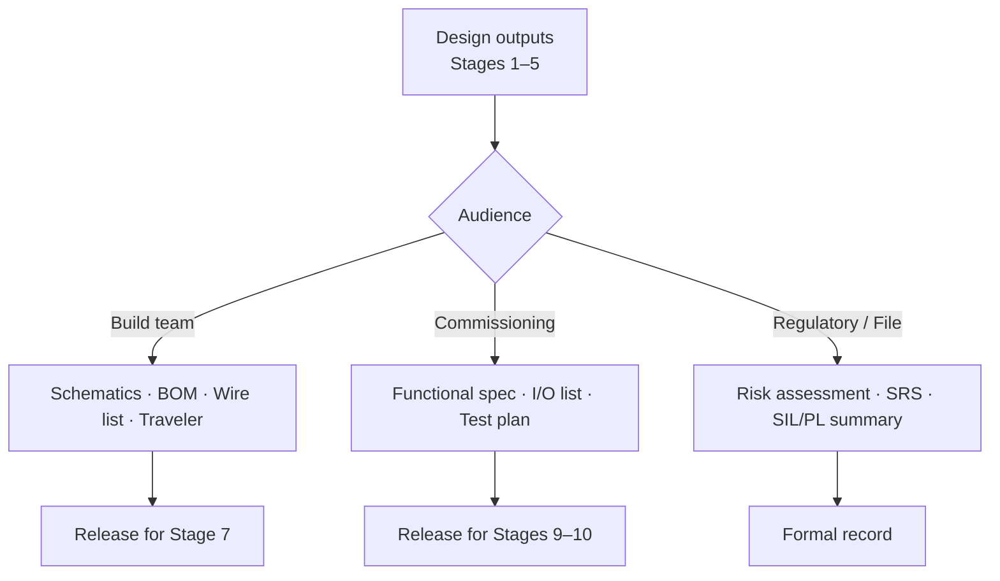

<div class="page-header">
  <span class="page-header__label">Lifecycle Stage 06</span>
  <h1>Draft Design Documentation</h1>
</div>

## Document Package Flow



## 1. Purpose of This Stage

This stage compiles all engineering outputs from Stages 1–5 into **formal, structured documentation packages** that serve three distinct audiences with different needs:

- **The build team (Stage 7):** Needs unambiguous, complete, buildable documents — schematics, BOM, panel layout, wire schedule, shop traveler
- **The commissioning team (Stage 9/10):** Needs the verification plan, safety function register, and safety manual to execute testing and validation
- **The end user / customer (Stage 11 and beyond):** Needs the safety manual, operating instructions, maintenance procedures, and technical file to safely operate, maintain, and modify the machine throughout its life
- **The regulatory authority / notified body / auditor:** Needs the technical file (CE) or engineering documentation package to verify compliance

Up to this point, engineering outputs have been created in parallel across multiple stages — risk assessment reports, architecture documents, calculation files, schematics, BOMs. This stage organizes them into coherent, cross-referenced documentation packages with consistent formatting, complete content, and traceable revision control.

This stage produces **drafts**. Final documentation is completed after commissioning (Stage 10) incorporates as-built changes, V&V results, and final sign-offs. However, the draft must be substantially complete — the build team cannot build from incomplete documents, and the commissioning team cannot test without a verification plan and safety manual.

> **This stage answers: Is all engineering documentation compiled, cross-referenced, internally consistent, and sufficiently complete to support build, commissioning, and end-user handover?**

---

## 2. Entry Criteria

This stage begins when **Stage 5 (Detailed Design) exit criteria are met** and, if applicable, **Stage 4.5 (Safety Software) exit criteria are met**.

### Required Inputs

| Input | Source (Stage) | What It Becomes in Documentation |
|-------|---------------|----------------------------------|
| System description, boundary definition, intended use/misuse | Stage 1 | Safety manual — machine description, intended use, limitations |
| Standards register | Stage 2 | Technical file — list of applied standards; Declaration of Conformity basis |
| Risk assessment report | Stage 3 | Technical file — risk assessment evidence; safety manual — residual risk information |
| Safety function register (finalized) | Stage 3/4 | Safety manual — safety function descriptions; verification plan — test list |
| PLr/SIL assignment record | Stage 3 | Technical file — risk reduction evidence |
| Safety architecture document | Stage 4 | Technical file — functional safety evidence; safety manual — architecture description |
| PL/SIL calculation reports (SISTEMA files, etc.) | Stage 4 | Technical file — quantitative safety verification evidence |
| CCF scoring worksheets | Stage 4 | Technical file — CCF evidence |
| DC justification records | Stage 4 | Technical file — diagnostic coverage evidence |
| Fault exclusion register | Stage 4 | Technical file — fault exclusion justification; safety manual — conditions for fault exclusion validity |
| Response time analysis | Stage 4 | Technical file — response time verification; safety manual — safety distance basis |
| Safety software documentation | Stage 4.5 | Technical file — software safety evidence; safety manual — software version and configuration |
| Circuit schematics | Stage 5 | Build package — wiring reference; technical file; customer documentation |
| BOM | Stage 5 | Build package — component procurement; technical file; spare parts list |
| Wire schedule | Stage 5 | Build package — wire preparation and installation |
| Panel layout drawing | Stage 5 | Build package — physical construction reference |
| SCCR calculation worksheet | Stage 5 | Technical file — SCCR evidence; nameplate data |
| Grounding design | Stage 5 | Build package; technical file |
| Safety function verification plan | Stage 5 | Commissioning package — test procedures |
| Interconnection diagrams | Stage 5 | Build package — field wiring; customer installation documentation |
| I/O assignment table | Stage 5 | Build package; commissioning package; customer documentation |

**If any upstream deliverable is incomplete, it must be completed before or during this stage. This stage cannot produce complete documentation from incomplete engineering.**

---

## 3. Standards Influence

| Standard | Documentation Requirement | Key Clauses |
|----------|--------------------------|-------------|
| **NFPA 79:2024 Ch. 19** | Technical documentation: circuit diagrams, wiring diagrams, parts lists, operating instructions, maintenance instructions. Minimum content specified. | §19.1 (information to be provided), §19.2 (nameplate marking), §19.3 (technical documentation) |
| **IEC 60204-1:2016 Cl. 17** | Technical documentation package — more prescriptive than NFPA 79. Requires: circuit diagrams, overall layout, functional description, operating instructions, maintenance instructions, parts list. Must be in the language of the country of use. | §17.1 (general), §17.2 (information on equipment), §17.3 (installation instructions), §17.4 (circuit diagrams), §17.5 (operating instructions), §17.6 (maintenance instructions) |
| **UL 508A:2023** | Panel marking, labeling, and documentation. Nameplate content requirements. Wiring diagram or equivalent must be available. | §12 (marking), §72 (documentation) |
| **NEC (NFPA 70:2023) Art. 409** | Industrial control panel documentation — nameplate marking, SCCR documentation, available fault current documentation at point of installation. | §409.110 (marking) |
| **ISO 13849-1:2023 §10** | Information for use — the manufacturer must provide: description of safety functions, PL for each safety function, operating conditions, maintenance instructions, and information needed for the user to maintain the required PL throughout the machine's life. | §10.1 (general), §10.2 (information for use), §10.3 (information for maintenance) |
| **IEC 62061:2021 §6.8** | Documentation of the SRECS (Safety-Related Electrical Control System): safety requirements specification, architecture, validation records, configuration management. | §6.8 (documentation requirements) |
| **IEC 61508-1:2010 §5** | Documentation requirements for the overall safety lifecycle — each phase must produce documented outputs that are verified and managed under configuration control. | §5.2 (documentation requirements), Annex A (documentation list) |
| **IEC 61511-1:2016 §19** | Documentation requirements for SIS lifecycle — safety requirements specification, design documentation, V&V records, maintenance procedures, management of change procedures. | §19 (documentation and records) |
| **EU Machinery Directive 2006/42/EC Annex VII** | Technical file content requirements for CE marking — must contain: general description, overall drawings, detailed drawings, risk assessment, standards applied, test reports, operating instructions, Declaration of Conformity. | Annex VII (technical file), Annex I §1.7.4 (instructions) |
| **EU Machinery Regulation (EU) 2023/1230** | Updated technical documentation requirements — similar to Directive but with additional requirements for digital documentation and software documentation. | Annex IV (technical documentation) |
| **ISO/IEC 82079-1:2019** | Preparation of information for use (instructions for use) — principles, content, structure, and presentation of user documentation. Not sector-specific but provides best-practice framework. | All clauses |

---

## 4. Documentation Packages — Structure

The outputs of this stage are organized into **four distinct documentation packages**, each serving a different audience and purpose:

```
┌─────────────────────────────────────────────────────────┐
│                  STAGE 6 OUTPUTS                         │
│                                                         │
│  ┌─────────────────┐  ┌──────────────────────────────┐  │
│  │  1. BUILD        │  │  2. COMMISSIONING             │  │
│  │     PACKAGE      │  │     PACKAGE                   │  │
│  │                 │  │                              │  │
│  │  Audience:      │  │  Audience:                   │  │
│  │  Build team     │  │  Commissioning engineer      │  │
│  │                 │  │                              │  │
│  │  Purpose:       │  │  Purpose:                    │  │
│  │  Build the      │  │  Verify the system works     │  │
│  │  system         │  │  as designed                  │  │
│  └─────────────────┘  └──────────────────────────────┘  │
│                                                         │
│  ┌─────────────────┐  ┌──────────────────────────────┐  │
│  │  3. TECHNICAL    │  │  4. END-USER                  │  │
│  │     FILE         │  │     DOCUMENTATION             │  │
│  │                 │  │                              │  │
│  │  Audience:      │  │  Audience:                   │  │
│  │  Regulator,     │  │  Machine operator,           │  │
│  │  notified body, │  │  maintenance technician,     │  │
│  │  auditor        │  │  customer safety team        │  │
│  │                 │  │                              │  │
│  │  Purpose:       │  │  Purpose:                    │  │
│  │  Demonstrate    │  │  Operate and maintain        │  │
│  │  compliance     │  │  the machine safely          │  │
│  └─────────────────┘  └──────────────────────────────┘  │
└─────────────────────────────────────────────────────────┘
```

---

## 5. Package 1 — Build Package

### 5.1 Purpose

Provides the build team (Stage 7) with everything needed to construct the panel and machine electrical system without ambiguity. The build technician should not need to ask the design engineer for clarification — if they do, the build package is incomplete.

### 5.2 Contents

| # | Document | Description | Source Stage | Status at Stage 6 |
|---|---------|-------------|-------------|-------------------|
| 1 | **Shop traveler / build order** | Work order document with project identification, build sequence, QC checkpoints, and sign-off blocks | Stage 6 (new) | Created at this stage |
| 2 | **Circuit schematics (issued for build)** | Complete schematic set with "Issued for Build" revision stamp | Stage 5 | Reviewed, stamped, and released |
| 3 | **Panel layout drawing** | Physical component placement with dimensions, DIN rail positions, wire duct routing, separation annotations | Stage 5 | Reviewed and released |
| 4 | **Bill of Materials (BOM)** | Complete parts list with quantities, tagged for procurement | Stage 5 | Reviewed and released for procurement |
| 5 | **Wire schedule** | Complete wire list with gauge, color, routing, labels, safety circuit flagging | Stage 5 | Reviewed and released |
| 6 | **Wire label print file** | Pre-formatted label data for wire marking printer | Stage 6 (derived from Stage 5 wire schedule) | Created at this stage |
| 7 | **Nameplate specification** | Content for all required nameplates (main panel, sub-panels, disconnect, etc.) | Stage 5 | Finalized at this stage |
| 8 | **Component-specific installation instructions** | Manufacturer installation guides for complex components (safety PLCs, VFDs, safety relays) — particularly torque specifications, wiring diagrams, and configuration requirements | Stage 4/5 (manufacturer data) | Compiled at this stage |
| 9 | **Build notes / special instructions** | Any non-obvious requirements: safety circuit separation, specific routing instructions, torque values, ferrule requirements, wire dress requirements | Stage 4 (CCF measures), Stage 5 | Compiled at this stage |
| 10 | **Quality control checklist** | Point-by-point checklist for build inspection: component placement, wire routing, torque, labeling, grounding, separation verification | Stage 6 (new) | Created at this stage |

### 5.3 Shop Traveler — Template Structure

The shop traveler is the primary build control document. It travels with the panel through the build process.

| Section | Content |
|---------|---------|
| **Header** | Project number, customer, panel designation, build start date, target completion date |
| **Document references** | List of all build package documents with revision numbers |
| **Component kit verification** | Checklist confirming all BOM items are received and match the specified part numbers — **especially critical for safety-rated components** |
| **Build sequence** | Step-by-step build order (backplate assembly → DIN rail mounting → component mounting → power wiring → control wiring → safety wiring → grounding → labeling → inspection) |
| **Safety-specific build steps** | Distinct section or highlighted steps for: safety component mounting, safety circuit wiring, dual-channel separation verification, EDM feedback wiring, grounding jumpers |
| **QC hold points** | Mandatory inspection points where a QC inspector or designated verifier must sign off before the next step proceeds |
| **Sign-off blocks** | Builder signature, QC signature, date, and comments for each major step |
| **Non-conformance log** | Space to document any deviation from the build documents — any deviation to safety circuits must be routed to the safety engineer |

### 5.4 Quality Control Checklist — Safety-Specific Items

| # | Check Item | Acceptance Criteria | Verified By | Date |
|---|-----------|-------------------|------------|------|
| 1 | All safety-rated components match BOM part numbers exactly | Part numbers verified against BOM — no substitutions without safety engineer approval | | |
| 2 | Safety components mounted in designated safety section of panel | Per panel layout drawing | | |
| 3 | Dual-channel safety wires routed in separate wire ducts / with separation | Per CCF separation annotations on layout drawing | | |
| 4 | EDM feedback wires installed from each output contactor to safety controller | Per schematic — verify NC auxiliary contact wiring for every monitored contactor | | |
| 5 | Safety circuit wire colors match the project wiring standard | Per wire schedule color assignments | | |
| 6 | All safety circuit wires labeled at both ends | Per wire schedule wire numbers | | |
| 7 | All ferrules installed on stranded wire terminations | Visual inspection | | |
| 8 | All terminal screws torqued to specification | Per manufacturer torque values; torque-mark or documented torque verification | | |
| 9 | Door bonding jumpers installed on all hinged doors | Per grounding drawing | | |
| 10 | PE bus bar connections verified | Per grounding drawing; continuity measurement | | |
| 11 | Nameplates installed with correct content | Per nameplate specification — SCCR, voltage, FLA, etc. | | |
| 12 | No unauthorized modifications or deviations | Compare as-built to schematic and layout | | |

---

## 6. Package 2 — Commissioning Package

### 6.1 Purpose

Provides the commissioning engineer (Stages 9/10) with everything needed to systematically verify that the system functions as designed, every safety function achieves its specified behavior, and all V&V requirements are met.

### 6.2 Contents

| # | Document | Description | Source Stage | Status at Stage 6 |
|---|---------|-------------|-------------|-------------------|
| 1 | **Safety function verification plan** | Test procedures for every safety function — test description, acceptance criteria, required instruments | Stage 5 | Reviewed and released |
| 2 | **Safety function register (finalized)** | Master reference for all safety functions with PLr/SIL targets, safe states, response times, reset behavior | Stage 3/4 | Compiled into commissioning package |
| 3 | **Pre-commissioning checklist** | Point-by-point checklist per ISO 13849-1 Annex K or equivalent — visual inspection, wiring verification, power-up sequence | Stage 6 (new) | Created at this stage |
| 4 | **Cause and effect matrix** | For process safety (IEC 61511) and complex machinery: matrix mapping every input condition to every expected output action | Stage 4.5 / Stage 5 | Compiled and cross-checked |
| 5 | **I/O forcing / override procedure** | Documented procedure for safely forcing inputs or overriding outputs during commissioning testing — including who is authorized, what precautions are required, and how forced states are cleared | Stage 6 (new) | Created at this stage |
| 6 | **FAT (Factory Acceptance Test) procedure** | If FAT is contractually required: formal test procedure with customer witness points, acceptance criteria, and sign-off blocks | Stage 6 (new) | Created at this stage |
| 7 | **SAT (Site Acceptance Test) procedure** | If SAT is required: formal test procedure for site conditions, including integration tests with upstream/downstream equipment | Stage 6 (new) | Created at this stage |
| 8 | **Response time measurement procedure** | Procedure for measuring actual safety function response times and comparing to requirements from Stage 4 | Stage 6 (new, based on Stage 4 response time analysis) | Created at this stage |
| 9 | **Safety PLC program backup and verification procedure** | Procedure for backing up the safety PLC program, recording the program CRC/signature, and verifying it matches the approved version | Stage 4.5 | Compiled at this stage |
| 10 | **Commissioning punchlist template** | Template for recording deficiencies found during commissioning, with severity classification, responsible party, and resolution tracking | Stage 6 (new) | Created at this stage |
| 11 | **Circuit schematics (reference copy)** | Same schematics as build package — commissioning engineer needs these for reference during testing | Stage 5 | Included in commissioning package |
| 12 | **Safety architecture document (reference copy)** | Architecture document from Stage 4 — commissioning engineer references this to understand design intent | Stage 4 | Included in commissioning package |

### 6.3 Pre-Commissioning Checklist — Structure

This checklist is executed at Stage 9 before any power is applied. It is created here because the designer understands what must be verified.

| Section | Content |
|---------|---------|
| **Visual inspection** | All components installed per layout; no visible damage; all covers and barriers in place; nameplates installed |
| **Wiring verification** | Spot-check of safety circuit wiring against schematic; dual-channel separation verified; EDM feedback wiring verified; wire labels present and legible |
| **Grounding verification** | PE continuity measurement (≤ 0.1Ω) from every exposed conductive part to PE terminal; door bonding jumpers verified |
| **Insulation resistance test** | Megger test per IEC 60204-1 §18.3 — minimum 1 MΩ between power circuits and PE |
| **Power-up sequence** | Step-by-step procedure for initial energization: verify voltages at each stage before proceeding; verify control power, safety controller power-up sequence, PLC boot |
| **Safety controller configuration verification** | Verify safety PLC/relay configuration matches approved configuration; verify program CRC/signature; verify I/O configuration |
| **Initial safety function check** | Before automatic mode: manually test each safety function (e-stop, guard interlock, light curtain) to confirm basic operation — detailed testing follows in Stage 10 |

### 6.4 FAT and SAT Procedures

| Element | FAT (Factory) | SAT (Site) |
|---------|--------------|------------|
| **Location** | Manufacturer's facility | Customer's installation site |
| **Scope** | All functions testable without the actual process/machine (panel-level and simulated I/O testing) | All functions including integration with actual machine, process, and site utilities |
| **Safety function testing** | Every safety function tested with simulated inputs (forcing inputs, simulating sensor states) | Every safety function tested with actual safety devices installed on the machine |
| **Response time testing** | May be limited to controller response time (sensor and actuator not yet installed) | Full end-to-end response time measurement including sensor, logic, and actuator |
| **Witness** | Customer representative (if contractually required) | Customer representative, potentially third-party inspector or authority having jurisdiction |
| **Documentation** | FAT report with test results, deviations, punchlist | SAT report with test results, deviations, punchlist, final acceptance signature |
| **Typical trigger for SAT** | N/A | FAT completed, system shipped and installed, pre-commissioning checklist completed |

### 6.5 Cause and Effect Matrix — Template

For complex systems with multiple safety functions, inputs, and outputs, the cause and effect matrix provides a single-page overview of all expected behaviors:

| | Output 1: Press Ram Drive (K1/K2) | Output 2: Conveyor Drive (K3/K4) | Output 3: Robot Enable | Output 4: Hydraulic Valve (SV1/SV2) | Muting Lamp | Alarm |
|---|---|---|---|---|---|---|
| **E-stop Station 1 (SF-02)** | STOP | STOP | DISABLE | CLOSE | OFF | ON |
| **E-stop Station 2 (SF-02)** | STOP | STOP | DISABLE | CLOSE | OFF | ON |
| **Guard Door 1 (SF-01)** | STOP | — | DISABLE | — | OFF | ON |
| **Guard Door 2 (SF-06)** | — | STOP | — | CLOSE | OFF | ON |
| **Light Curtain (SF-03)** | STOP | — | — | — | OFF (if muted: ON) | ON |
| **Speed Limit Exceeded (SF-04)** | STOP | — | — | — | OFF | ON |
| **High Pressure Trip (SF-05)** | — | — | — | CLOSE | OFF | ON |

**The cause and effect matrix must be 100% consistent with the circuit schematics and the safety PLC program. Any discrepancy means the documentation is wrong or the design is wrong.**

---

## 7. Package 3 — Technical File (Compliance Documentation)

### 7.1 Purpose

Demonstrates compliance with applicable regulations and standards. For CE-marked machines, this is the **technical file** required by the Machinery Directive/Regulation. For US-market machines, this is the **engineering documentation package** that supports NRTL listing, OSHA compliance, and customer audit requirements.

The technical file is retained by the manufacturer and must be available to the relevant authority upon request. It is **not** delivered to the customer (the customer receives the end-user documentation in Package 4), but portions may be shared per contract.

### 7.2 Contents — CE Technical File (Machinery Directive Annex VII / Machinery Regulation Annex IV)

| # | Document | Description | Source Stage | Status at Stage 6 |
|---|---------|-------------|-------------|-------------------|
| 1 | **General description of the machine** | Machine type, function, intended use, foreseeable misuse, boundary definition | Stage 1 | Compiled from Stage 1 deliverables |
| 2 | **Overall drawing of the machine** | General arrangement drawing showing machine layout, major components, safety device locations | Stage 1 / Stage 5 | Compiled |
| 3 | **Detailed drawings and calculations** | Circuit schematics, panel layout, mechanical drawings, SCCR calculations, safety distance calculations | Stage 5 | Compiled |
| 4 | **List of applied standards** | Standards register with edition numbers and scope of application | Stage 2 | Compiled from Stage 2 deliverables |
| 5 | **Risk assessment** | Complete risk assessment report including hazard identification, risk estimation, risk evaluation, risk reduction measures, and residual risk | Stage 3 | Compiled from Stage 3 deliverables |
| 6 | **Safety function documentation** | Safety function register, PLr/SIL assignments, safety architecture document, PL/SIL calculation reports, CCF analysis, DC justification, fault exclusion register | Stages 3, 4 | Compiled from Stage 3/4 deliverables |
| 7 | **Safety software documentation** | Software safety requirements, application program description, verification records, program version and CRC/signature | Stage 4.5 | Compiled from Stage 4.5 deliverables |
| 8 | **Test reports** | Results of tests and examinations carried out — pre-commissioning, commissioning V&V results, response time measurements, EMC test reports (if applicable) | Stages 9, 10 | **Placeholder at Stage 6 — completed after Stage 10** |
| 9 | **Instructions for use (operating instructions)** | Draft of the operating instructions to be delivered with the machine (see Package 4) | Stage 6 | Draft created at this stage |
| 10 | **Declaration of Conformity** | EU Declaration of Conformity per Machinery Directive Annex II / Machinery Regulation Annex V | Stage 6 | **Draft prepared — final signed after Stage 10** |
| 11 | **Assembly instructions** | If the machine is partly completed or requires on-site assembly | Stages 1, 5 | Compiled if applicable |
| 12 | **Quality assurance evidence** | Manufacturing quality records, component certifications, calibration records | Stage 7 | **Placeholder at Stage 6 — completed after Stage 7** |

### 7.3 Contents — US Engineering Documentation Package

| # | Document | Description | Source Stage |
|---|---------|-------------|-------------|
| 1 | **SCCR calculation and documentation** | Per NEC Art. 409.110 and UL 508A Supplement SB | Stage 5 |
| 2 | **UL 508A listing documentation** | If NRTL listing is required: panel evaluation report, listing mark authorization, UL file number | Stage 7 (after build) |
| 3 | **NEC compliance documentation** | Conductor sizing calculations, overcurrent protection coordination, grounding design | Stage 5 |
| 4 | **NFPA 79 compliance documentation** | Technical documentation per Ch. 19 | Stage 5 |
| 5 | **Risk assessment** | Same as CE file — increasingly expected for US machinery even without CE requirement | Stage 3 |
| 6 | **Safety function documentation** | Same as CE file — PL/SIL calculations, architecture, verification | Stages 3, 4 |
| 7 | **Arc flash analysis** | If required by customer or NFPA 70E for field installation | Stage 5 or Stage 8 |

### 7.4 Declaration of Conformity — Draft Content

| Element | Content |
|---------|---------|
| Manufacturer name and address | Legal entity responsible for the machine |
| Machine description and identification | Type, model, serial number (serial number added after build) |
| Statement of conformity | "The machinery described above conforms to the relevant provisions of [Directive/Regulation]" |
| List of applied harmonized standards | From standards register — edition numbers required |
| List of other applied technical specifications | Non-harmonized standards, national standards |
| Name and position of authorized signatory | Must be a person authorized to sign on behalf of the manufacturer |
| Place and date of declaration | **Final date: after Stage 10 commissioning is complete** |

**The Declaration of Conformity is drafted at this stage but NOT signed until all testing is complete (Stage 10) and the technical file is finalized.**

---

## 8. Package 4 — End-User Documentation

### 8.1 Purpose

Provides the machine operator, maintenance technician, and customer safety team with all information needed to safely install, operate, maintain, and eventually decommission the machine. This is the documentation that ships with the machine and remains at the site.

Per ISO 12100 §6.4, information for use is the **third step** of risk reduction. It is not optional — it is a required safety measure for all residual risks that cannot be eliminated by design or safeguarding.

### 8.2 Contents

| # | Document | Description | Source Stage | Status at Stage 6 |
|---|---------|-------------|-------------|-------------------|
| 1 | **Safety manual** | Complete safety information for the machine — safety functions, operating limitations, residual risks, maintenance requirements, proof test procedures | All stages | **Draft created at this stage** |
| 2 | **Operating instructions** | How to operate the machine in each mode — startup, normal operation, shutdown, mode changes, fault recovery | Stages 1, 5 | Draft created at this stage |
| 3 | **Installation instructions** | Physical installation, electrical connection, utility connections, grounding requirements, environmental requirements | Stage 5 | Draft created at this stage |
| 4 | **Maintenance manual** | Preventive maintenance procedures, component replacement intervals, proof test procedures, spare parts list | Stages 4, 5, 11 | Draft created at this stage |
| 5 | **Circuit schematics (as-built)** | Final schematics reflecting any changes made during build and commissioning | Stage 5 | **Draft issued — updated to as-built after Stage 10** |
| 6 | **Spare parts list** | Safety-rated components with part numbers, quantities, and replacement intervals | Stage 4/5 | Compiled at this stage |
| 7 | **Training requirements** | Minimum training requirements for operators and maintenance personnel | Stage 3 (risk assessment assumptions) | Compiled at this stage |
| 8 | **Residual risk information** | Description of residual risks remaining after all risk reduction measures, and the measures the user must take to manage them (PPE, training, procedures) | Stage 3 | Compiled at this stage |
| 9 | **LOTO (Lockout/Tagout) procedure** | Machine-specific lockout procedure identifying all energy sources and isolation points | Stages 1, 5 | Draft created at this stage |
| 10 | **Decommissioning information** | Requirements for safe decommissioning — energy isolation, hazardous material handling, structural considerations | Stage 1 | Draft if applicable |

### 8.3 Safety Manual — Detailed Structure

The safety manual is the most important end-user document. It must contain all information required by ISO 13849-1 §10, IEC 62061 §6.8, and (for CE marking) Machinery Directive Annex I §1.7.4.

| Section | Content | Source |
|---------|---------|--------|
| **1. Machine description** | What the machine does, system boundary, interfaces | Stage 1 |
| **2. Intended use and limitations** | Intended use, foreseeable misuse, operating limitations (environmental, capacity, speed), explicitly excluded uses | Stage 1 |
| **3. Safety device locations** | Diagram showing location of every safety device (e-stops, interlocks, light curtains, safety switches) with identification labels | Stage 5 (layout/GA drawing) |
| **4. Safety function descriptions** | For each safety function: plain-language description of what it does, what triggers it, what the safe state is, how to reset | Stage 3/4 (safety function register) |
| **5. Performance Level / SIL information** | For each safety function: the achieved PL or SIL — this is required by ISO 13849-1 §10 | Stage 4 |
| **6. Operating modes and safety behavior** | How safety functions behave in each operating mode; what changes between automatic, manual, setup, maintenance modes | Stages 1, 4, 4.5 |
| **7. Startup and restart procedures** | Safe startup sequence, restart after e-stop, restart after guard trip, restart after power loss | Stage 4.5 / Stage 5 |
| **8. Emergency procedures** | E-stop locations, expected machine behavior on e-stop, recovery procedure | Stage 3/5 |
| **9. Bypass / muting information** | If any safety function has muting or bypass conditions: what they are, when they are active, how they are indicated, and the residual risk during muting | Stage 3/4 |
| **10. Residual risks and warnings** | Description of residual risks that could not be eliminated by design or safeguarding; required PPE; warning label descriptions and locations | Stage 3 |
| **11. Maintenance requirements** | Preventive maintenance schedule for safety-related components; mandatory replacement intervals (mission time); visual inspection requirements | Stage 4 (mission time), Stage 11 |
| **12. Proof test procedures** | Step-by-step procedures for periodic proof testing of each safety function — what to test, how to test, what the pass/fail criteria are, how often to test | Stage 4 (proof test interval), Stage 5 (verification plan adapted for user) |
| **13. Spare parts — safety-rated components** | Part numbers and descriptions of safety-rated components that the user may need to replace; substitution restrictions (must use exact part number or contact manufacturer) | Stage 4/5 (BOM) |
| **14. Modification restrictions** | Statement that modifications to safety functions, safety circuits, or safety software must not be made without following the management of change procedure and re-verifying PL/SIL | Stage 12 (MOC reference) |
| **15. Software version and configuration** | Safety PLC program version, CRC/signature, configuration parameters — reference point for detecting unauthorized changes | Stage 4.5 |
| **16. Standards applied** | List of applied standards with editions — allows the user and future auditors to know the compliance basis | Stage 2 |
| **17. Contact information** | Manufacturer contact for safety-related questions, spare parts, and technical support | — |

### 8.4 Language Requirements

| Market | Language Requirement | Standard Reference |
|--------|---------------------|-------------------|
| EU | Operating instructions must be in the official language(s) of the member state where the machine is placed on the market; original instructions and translations must be identified | Machinery Directive Annex I §1.7.4 |
| US | No specific language mandate, but OSHA and good practice require English; additional languages if the workforce requires | OSHA general duty clause; customer specification |
| Global | Original language plus all required translations per destination markets | Per applicable regulations |

**Translation of safety-critical information (safety function descriptions, residual risks, emergency procedures) must be technically accurate — not just linguistically correct. Technical review of translations is recommended.**

---

## 9. Document Control and Configuration Management

### 9.1 Revision Control

| Requirement | Implementation |
|------------|---------------|
| Every document has a unique document number | Document numbering convention defined per company standard |
| Every document has a revision level | Rev A (or Rev 0) at initial release; incremented for every change |
| Every revision has a date and change description | Revision history table on every document |
| Superseded revisions are archived, not deleted | Retain prior revisions for audit trail |
| Current revision is clearly identified | "Current" or "Latest" marking; superseded copies marked "Superseded" |

### 9.2 Document Numbering Convention — Recommended

```
[Project Number]-[Package]-[Document Type]-[Sequential Number]

Example:
  2024-0147-BP-SCH-001  = Build Package, Schematic, Sheet 001
  2024-0147-CP-VPL-001  = Commissioning Package, Verification Plan, 001
  2024-0147-TF-RA-001   = Technical File, Risk Assessment, 001
  2024-0147-EU-SM-001   = End-User, Safety Manual, 001
```

### 9.3 Cross-Reference Integrity

All documents within and across packages must be internally consistent:

| Cross-Reference | Check |
|----------------|-------|
| BOM part numbers ↔ Schematic component tags | Every tag on the schematic appears in the BOM with the correct part number |
| Wire schedule wire numbers ↔ Schematic wire numbers | Every wire number on the schematic appears in the wire schedule |
| Safety function register SF-IDs ↔ Schematic page references | Every SF-ID in the register has a corresponding schematic page |
| Safety function register SF-IDs ↔ Verification plan test IDs | Every SF-ID has a corresponding test procedure |
| Safety function register PLr/SIL ↔ Safety manual PL/SIL information | PL/SIL values in the safety manual match the calculation results |
| Cause and effect matrix ↔ Safety PLC program ↔ Schematics | All three documents describe the same behavior for every input/output combination |
| Standards register ↔ Declaration of Conformity ↔ Safety manual | Same standards and editions listed consistently across all three documents |
| BOM spare parts ↔ Safety manual spare parts list | Same part numbers and descriptions |

**A cross-reference check should be performed as a formal activity at this stage, not assumed to be correct.**

### 9.4 Draft vs Final Status

| Document | Draft Status (Stage 6) | Final Status (After Stage 10) |
|----------|----------------------|------------------------------|
| Schematics | "Issued for Build" — may change during build and commissioning | "As-Built" — reflects all changes made during build and commissioning |
| Safety manual | "Draft" — content complete but may be updated based on commissioning findings | "Final" — incorporates any changes from commissioning; signed off |
| Verification plan | "Issued for Commissioning" — procedures defined | "Completed" — results recorded, pass/fail documented |
| Declaration of Conformity | "Draft" — prepared but NOT signed | "Final" — signed after all testing complete |
| Technical file | Substantially complete — test results pending | Complete with all test results, as-built documents, and signed Declaration |

---

## 10. Engineering Activities

### 10.1 Compile and Organize

| Activity | Detail |
|---------|--------|
| Collect all upstream deliverables | Gather every document from Stages 1–5 (and 4.5); verify each exists and is at the expected revision level |
| Organize into the four packages | Assign each document to its primary package; include cross-package references where a document appears in multiple packages |
| Apply document numbering and revision control | Number every document per the convention; assign initial revision |

### 10.2 Create New Documents

The following documents are **created at this stage** (not carried forward from prior stages):

| New Document | Purpose | Key Content |
|-------------|---------|-------------|
| Shop traveler | Build control | Per Section 5.3 |
| Quality control checklist | Build quality | Per Section 5.4 |
| Pre-commissioning checklist | Pre-power verification | Per Section 6.3 |
| FAT procedure (if required) | Factory acceptance testing | Per Section 6.4 |
| SAT procedure (if required) | Site acceptance testing | Per Section 6.4 |
| I/O forcing procedure | Commissioning safety | Per Section 6.2 |
| Response time measurement procedure | V&V | Per Section 6.2 |
| Commissioning punchlist template | Deficiency tracking | Per Section 6.2 |
| Safety manual (draft) | End-user safety information | Per Section 8.3 |
| Operating instructions (draft) | End-user operating information | Per Section 8.2 |
| Installation instructions (draft) | Site installation | Per Section 8.2 |
| Maintenance manual (draft) | End-user maintenance | Per Section 8.2 |
| LOTO procedure | Machine-specific lockout | Per Section 8.2 |
| Cause and effect matrix | System behavior overview | Per Section 6.5 |
| Wire label print file | Build support | Derived from wire schedule |
| Nameplate specification | Build support | Per Section 5.2 |
| Declaration of Conformity (draft) | CE marking | Per Section 7.4 |

### 10.3 Review and Verify

| Activity | Detail |
|---------|--------|
| Cross-reference integrity check | Per Section 9.3 — verify consistency across all documents and packages |
| Technical review of safety manual | Safety engineer reviews safety manual draft for accuracy of safety function descriptions, PL/SIL values, residual risk information, and maintenance requirements |
| Technical review of commissioning package | Safety engineer and/or commissioning lead reviews verification plan, pre-commissioning checklist, and FAT/SAT procedures for completeness and testability |
| Peer review of build package | Experienced build technician or build supervisor reviews schematics, layout, BOM, and wire schedule for buildability — identifies ambiguities, missing information, or impractical designs |
| Customer review (if contractually required) | Issue documentation for customer review and comment; track and resolve comments |

### 10.4 Release for Build

| Activity | Detail |
|---------|--------|
| Formal release | All build package documents stamped "Issued for Build" with revision, date, and responsible engineer signature |
| Document transmittal | Build package transmitted to build team with transmittal record documenting what was issued |
| BOM release to procurement | BOM released to procurement for component ordering; safety component substitution restrictions communicated |

---

## 11. Exit Criteria — Gate Review

This stage is complete when **all** of the following are true:

| # | Criterion | Evidence |
|---|-----------|----------|
| 1 | All four documentation packages are assembled with all required documents present | Package contents checklist — all items present |
| 2 | All documents have document numbers and revision levels assigned | Document register with numbers and revisions |
| 3 | Cross-reference integrity check is complete with no unresolved discrepancies | Cross-reference check record — all items pass |
| 4 | Safety manual draft is complete with all sections per Section 8.3 populated | Safety manual draft reviewed by safety engineer |
| 5 | Commissioning package is complete with verification plan, pre-commissioning checklist, and FAT/SAT procedures (if applicable) | Commissioning package contents checklist |
| 6 | Build package is complete with schematics, BOM, layout, wire schedule, shop traveler, and QC checklist | Build package contents checklist |
| 7 | Cause and effect matrix is consistent with schematics and safety PLC program | Cross-check record |
| 8 | All documents are reviewed by at least one person other than the author | Review records (signatures, dates, comments resolved) |
| 9 | Build package is formally released with "Issued for Build" status | Release record with date and responsible engineer |
| 10 | BOM is released to procurement with safety component substitution restrictions communicated | Procurement transmittal record |
| 11 | Declaration of Conformity is drafted (if CE marking applies) — NOT signed | Draft DoC on file |
| 12 | Customer review is complete (if contractually required) with all comments resolved or dispositioned | Comment resolution log |
| 13 | All assumptions from prior stages are resolved or explicitly documented as open items with owners | Updated assumptions register |

**If the build package is released with known open items (e.g., customer approval pending for a specific component), those open items must be tracked on the shop traveler as hold points — the build does not proceed past the affected step until the item is resolved.**

---

## 12. Roles and Responsibilities at This Stage

| Role | Responsibility |
|------|---------------|
| **Safety / Controls Engineer** | Authors safety manual draft; reviews all safety-related documentation for accuracy; creates commissioning package safety content (verification plan, pre-comm checklist); verifies cross-reference integrity for safety functions |
| **Electrical / Controls Designer** | Compiles build package; creates wire label files, nameplate specifications; performs final schematic review; supports cross-reference integrity check |
| **Project Manager** | Manages documentation review schedule; coordinates customer review (if required); manages document release and transmittal; tracks open items |
| **Technical Writer (if available)** | Formats end-user documentation (safety manual, operating instructions) for readability, consistency, and language compliance; manages translation if required |
| **Build Supervisor / Lead Technician** | Reviews build package for buildability — identifies ambiguities, missing information, or impractical designs before release |
| **Commissioning Lead** | Reviews commissioning package for completeness and executability — confirms test procedures are clear, acceptance criteria are measurable, and required instruments are identified |
| **Quality / Compliance** | Verifies technical file completeness against Machinery Directive Annex VII (if CE); verifies UL 508A documentation requirements (if NRTL listing) |
| **Customer Representative** | Reviews and approves documentation (if contractually required); provides comments |

---

## 13. Common Mistakes at This Stage

| Mistake | Consequence | How to Avoid |
|---------|-------------|-------------|
| Safety manual is treated as an afterthought — minimal content, generic text | End user does not have the information needed to maintain safety functions; auditors find non-compliance with ISO 13849-1 §10 or Machinery Directive §1.7.4; residual risks are not communicated | Use the Section 8.3 structure as a mandatory template; assign the safety engineer to author or review it |
| Commissioning package is not created until commissioning begins | Commissioning engineer must improvise test procedures; tests are incomplete or inconsistent; V&V evidence is inadequate | Create the full commissioning package at this stage — the designer who created the circuits is the best person to define how they should be tested |
| Documents are released without cross-reference check | BOM part numbers do not match schematic tags; wire schedule wire numbers do not match schematics; safety manual PL/SIL values do not match calculations | Perform the cross-reference check in Section 9.3 as a formal, documented activity |
| No distinction between draft and final status | Documents are signed as "final" before commissioning — then changes are made during commissioning without formal revision, creating uncontrolled documentation | Use clear draft/final status per Section 9.4; do not sign the Declaration of Conformity or finalize the safety manual until Stage 10 is complete |
| Build package is released piecemeal | Build starts with incomplete schematics; changes are issued mid-build without formal revision; build quality suffers | Release the complete build package as a set; if changes are needed after release, issue formal revision with change notice |
| Cause and effect matrix does not exist or does not match the program | Commissioning engineer cannot efficiently verify system behavior; discrepancies between expected and actual behavior are discovered during testing | Create the matrix at this stage; cross-check against schematics and safety PLC program |
| Customer-required documentation is forgotten | Customer rejects deliverable at handover; project close-out is delayed | Review customer specification documentation requirements at Stage 6 entry; create a customer documentation requirements checklist |
| Spare parts list does not include safety-rated components | End user substitutes non-safety-rated components when originals fail; PL/SIL is compromised | Extract safety-rated components from BOM into a dedicated spare parts list with substitution restrictions |
| No LOTO procedure provided | End user does not have machine-specific lockout information; OSHA violation if US market; maintenance performed without proper energy isolation | Create machine-specific LOTO procedure identifying all energy sources and isolation points |
| Translation of safety information is not technically reviewed | Mistranslation of safety-critical information (residual risks, emergency procedures, operating limitations) creates hazardous misunderstanding | Have safety-critical translations reviewed by a bilingual technical person, not just a language translator |

---

## 14. Relationship to Adjacent Stages

```
┌──────────────────────────────────────┐
│  STAGE 5: DETAILED DESIGN             │
│  STAGE 4.5: SAFETY SOFTWARE           │
│                                      │
│  Provide:                            │
│  • All design deliverables          │
│  • Schematics, BOM, layout          │
│  • Verification plan                │
│  • Software documentation            │
└──────────────────┬───────────────────┘
                   │
                   ▼
┌──────────────────────────────────────┐
│  STAGE 6: DRAFT DOCUMENTATION         │  ◄── You are here
│                                      │
│  Produces:                           │
│  • Build Package ──────────────────────► Stage 7: BUILD
│  • Commissioning Package ──────────────► Stage 9/10: PRE-COMM / COMM
│  • Technical File (draft) ─────────────► Finalized after Stage 10
│  • End-User Documentation (draft) ─────► Finalized after Stage 10
└──────────────────┬───────────────────┘
                   │
        ┌──────────┼──────────────────────────┐
        ▼          ▼                           ▼
┌────────────┐ ┌───────────────┐  ┌──────────────────────┐
│ STAGE 7:   │ │ STAGE 9/10:   │  │ AFTER STAGE 10:      │
│ BUILD      │ │ PRE-COMM /    │  │                      │
│            │ │ COMMISSIONING │  │ • As-built schematics│
│ Uses:      │ │               │  │ • Final safety manual│
│ • Build    │ │ Uses:         │  │ • V&V results added  │
│   package  │ │ • Commissioning│ │   to technical file  │
│            │ │   package     │  │ • DoC signed         │
│ Produces:  │ │               │  │ • Final documentation│
│ • Build    │ │ Produces:     │  │   issued to customer │
│   records  │ │ • V&V results │  │                      │
│ • As-built │ │ • Punchlist   │  │                      │
│   redlines │ │ • Final test  │  │                      │
│            │ │   reports     │  │                      │
└────────────┘ └───────────────┘  └──────────────────────┘
```

---

## 15. Templates and Tools

| Resource | Purpose |
|----------|---------|
| Shop traveler template | Build control document per Section 5.3 |
| QC checklist template (build) | Safety-specific build quality checklist per Section 5.4 |
| Pre-commissioning checklist template | Per Section 6.3 — based on ISO 13849-1 Annex K |
| FAT procedure template | Factory acceptance test structure with sign-off blocks |
| SAT procedure template | Site acceptance test structure with sign-off blocks |
| Cause and effect matrix template | Spreadsheet per Section 6.5 |
| Safety manual template | Document with all Section 8.3 sections pre-structured |
| Operating instructions template | Per ISO/IEC 82079-1 structure |
| LOTO procedure template | Machine-specific lockout procedure form |
| Declaration of Conformity template | Per Machinery Directive Annex II / Machinery Regulation Annex V |
| Cross-reference check worksheet | Spreadsheet for systematically verifying document-to-document consistency per Section 9.3 |
| Document register template | Master list of all project documents with numbers, revisions, status, and package assignment |
| Customer documentation requirements checklist | Checklist of documentation items required by the customer specification |
| Commissioning punchlist template | Deficiency tracking form with severity, responsible party, and resolution fields |

---

## Navigation

← Previous: [Detailed Design]({{ '/lifecycle/detailed-design/' | relative_url }}) | Next: [Build]({{ '/lifecycle/build/' | relative_url }}) →
