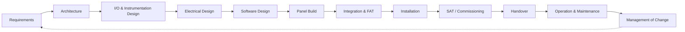

  Engineering Lifecycle
  <h1>General Controls Project Lifecycle</h1>
  
Every controls project follows this flow — safety-rated or not. The functional-safety lifecycle overlays it; the two are related but not identical.

## The General Flow

Every control-system project — a conveyor upgrade, a new machine, a process
skid — moves through the same broad sequence, whether or not it contains
safety functions:

| Phase | Typical activity | Typical deliverables |
|---|---|---|
| Requirements | Scope, process description, performance targets, constraints | Design basis, URS |
| Architecture | Control platform, network, panel count, I/O philosophy | Architecture drawing, tag philosophy |
| I/O & instrumentation | Instrument selection, I/O list, ranges, alarm strategy | I/O list, instrument index |
| Electrical design | Power distribution, protection, panel layout, wire sizing | Schematics, panel layout, BOM |
| Software design | Control narrative, sequence logic, HMI design | Control narrative, cause & effect, code |
| Panel build | Fabrication, wiring, point-to-point checkout | Build records, checkout sheets |
| Integration & FAT | Software-with-hardware testing at the factory | FAT protocol and report |
| Installation | Site installation, field wiring, terminations | Installation records, loop-check prep |
| SAT / commissioning | Loop checks, functional tests, performance runs | Loop sheets, SAT report, punch list |
| Handover | Documentation package, training, as-builts | O&M package, as-built drawings |
| Operation & maintenance | Preventive maintenance, spares, periodic tests | Maintenance records |
| Management of change | Controlled modification of anything above | MOC records |

## Where the Safety Lifecycle Overlays It

When the project includes **safety-related control functions** — safety-rated
devices, a PL or SIL target, a SIF, a CE-marked machine — the
[functional-safety lifecycle]({{ '/lifecycle/' | relative_url }}) runs
**alongside and inside** the general flow, adding analysis stages up front and
verification gates throughout:

| General phase | Safety-lifecycle overlay |
|---|---|
| Requirements | [1. Concept]({{ '/lifecycle/concept/' | relative_url }}) — machine limits and use cases |
| Requirements → Architecture | [2. Standards Selection]({{ '/lifecycle/standards-selection/' | relative_url }}) · [3. Risk Assessment]({{ '/lifecycle/risk-assessment/' | relative_url }}) · [4. Safety Requirements Spec]({{ '/lifecycle/safety-requirements-spec/' | relative_url }}) |
| Architecture | [5. Safety Architecture]({{ '/lifecycle/safety-architecture/' | relative_url }}) — PL/SIL verification of the proposed design |
| Electrical / software design | [6. Detailed Design]({{ '/lifecycle/detailed-design/' | relative_url }}) · [6b. Safety Wiring]({{ '/lifecycle/safety-wiring/' | relative_url }}) |
| Panel build → commissioning | [7. Build]({{ '/lifecycle/build/' | relative_url }}) through [10. Commissioning]({{ '/lifecycle/commissioning/' | relative_url }}) — with safety validation added to FAT/SAT |
| Operation & MOC | [11. Maintenance]({{ '/lifecycle/maintenance/' | relative_url }}) (proof testing) · [Management of Change]({{ '/lifecycle/management-of-change/' | relative_url }}) |

Two practical differences to keep straight:

1. **The safety lifecycle front-loads analysis.** Risk assessment and the SRS
   exist *before* detailed design in a way general projects often skip — that
   is the point of it.
2. **The safety lifecycle adds independence.** Verification gates are reviewed
   by someone other than the designer, to a degree that depends on the
   applicable standard and integrity level.

A project with no safety functions still benefits from the general flow's
discipline — it just doesn't carry the safety gates.
