<div class="page-header">
  <span class="page-header__label">Engineering Lifecycle</span>
  <h1>Control System Engineering Lifecycle</h1>
  <p>13 stages from concept through decommissioning — with standards overlay, roles, and entry/exit criteria at each stage.</p>
</div>

## Lifecycle at a Glance

```mermaid
flowchart LR
    C[1. Concept] --> S[2. Standards Selection]
    S --> R[3. Risk Assessment]
    R --> RS[3.5 SRS]
    RS --> SA[4. Safety Architecture]
    SA --> DD[5. Detailed Design]
    DD --> DOC[6. Draft Documentation]
    DOC --> B[7. Build]
    B --> I[8. Installation]
    I --> PC[9. Pre-Commissioning]
    PC --> CM[10. Commissioning]
    CM --> M[11. Maintenance]
    M --> MOC[12. Management of Change]
    MOC --> DD
```



## 1. Purpose

This document defines the **Safety Engineering Lifecycle** — the structured sequence of stages, deliverables, and decision gates required to identify, design, implement, verify, and maintain safety-related controls for machinery and process systems.

It exists to ensure that every project involving safeguarding — whether a new machine build, a retrofit, an integration, or a controls upgrade — follows a repeatable, standards-compliant process from initial concept through decommissioning. It is not a substitute for engineering judgment; it is the framework within which that judgment is applied and documented.

This lifecycle governs all work where the outcome includes one or more **safety functions** — any function of a machine or process whose failure would directly result in an increase in risk to persons.

---

## 2. Scope of Application

This lifecycle applies to:

| Project Type | Example |
|-------------|---------|
| New machine design & build | Custom assembly cell, press system, robotic workcell |
| Machine retrofit or modification | Adding a safety interlock to an existing line, guard redesign |
| Controls integration | Integrating third-party machines into a common safety system |
| Process safety instrumented systems | SIS design for chemical, oil & gas, or process facilities |
| Panel design & build | UL 508A / NFPA 79 control panels containing safety-rated circuits |
| Management of Change | Any change to an existing safety function, hardware, or logic |

It does **not** replace your general project engineering lifecycle (mechanical design, process engineering, project management). It runs **parallel to and embedded within** that lifecycle, with defined integration points described below.

---

## 3. How This Lifecycle Integrates with the General Engineering Lifecycle

Most engineering organizations operate a project lifecycle that looks roughly like this:

```
Sales/Proposal → Concept → Engineering → Procurement → Build → Ship → Install → Commission → Handover → Support
```

The safety engineering lifecycle is **not a separate track that happens after the fact**. It is embedded within the general engineering lifecycle and must begin at the earliest feasible stage. Bolting safety on at the end — during build or commissioning — is the single most common root cause of cost overruns, rework, and non-compliant deliveries.

### Integration Map

```
General Engineering              Safety Engineering
Lifecycle                        Lifecycle
─────────────────                ─────────────────

Sales / Proposal ◄──────────── (awareness only — flag if safety scope exists)
        │
        ▼
Concept / Kickoff ◄════════════ Stage 1: Concept
        │                        Define machine limits, intended use,
        │                        foreseeable misuse, scope boundaries
        ▼
Preliminary Engineering ◄══════ Stage 2: Standards Selection
        │                       Stage 3: Risk Assessment ★ CRITICAL GATE
        │                       Stage 3.5: Safety Requirements Spec (SRS)
        │
        │                       ┌─────────────────────────────┐
        │                       │  PL / SIL DECISION POINT    │
        │                       │  This determines everything │
        │                       │  downstream. Do not pass    │
        │                       │  this gate without sign-off.│
        │                       └─────────────────────────────┘
        ▼
Detailed Engineering ◄════════ Stage 4: Safety Architecture
        │                       Stage 4.5: Safety Software/Logic
        │                       Stage 5: Detailed Design
        │                       Stage 5.1: Safety Wiring Practices
        ▼
Documentation ◄════════════════ Stage 6: Draft Documentation
        │
        ▼
Procurement / Build ◄═════════ Stage 7: Build
        │
        ▼
Ship / Install ◄══════════════ Stage 8: Installation
        │
        ▼
Commissioning ◄═══════════════ Stage 9: Pre-Commissioning
        │                       Stage 10: Commissioning (V&V, FAT/SAT)
        ▼
Handover / Operate ◄══════════ Stage 11: Maintenance & Proof Test
        │
        ▼
Ongoing Operations ◄══════════ Stage 12: Management of Change
        │                       (loops back to any prior stage)
        ▼
End of Life ◄═════════════════ Stage 13: Decommissioning
```

### The Key Principle

> **Safety engineering begins at Concept and produces its most important outputs during Preliminary Engineering — before detailed design starts.**

If your general engineering process is already selecting components, drawing schematics, or writing PLC code before Stage 3 (Risk Assessment) and Stage 3.5 (SRS) are complete, the lifecycle is broken. Everything in detailed design depends on knowing:

- What are the safety functions?
- What is the required Performance Level (PL) or Safety Integrity Level (SIL) for each?
- What architecture category is needed?
- What are the response time and diagnostic coverage requirements?

Without those answers, every design decision is either a guess or a rework liability.

---

## 4. When to Enter This Lifecycle

| Trigger | Entry Point |
|---------|-------------|
| New project kicked off with any safeguarding scope | Stage 1 — from the beginning |
| Existing machine being modified (new hazard, new safeguard, component change) | Stage 3 — risk assessment of the change, via MOC procedure |
| Customer or internal audit finding against an existing machine | Stage 3 — gap assessment against current standards, then forward |
| Replacement-in-kind of a safety component (no functional change) | Stage 12 (MOC) — verify equivalence, document, no re-design needed |
| Software-only change to a safety PLC program | Stage 12 (MOC) → Stage 4.5 — software safety lifecycle re-engaged |
| Periodic proof testing reveals degradation | Stage 11 — maintenance lifecycle, may trigger MOC if repair changes the function |

### Projects That Should Follow This Lifecycle

Projects involving safety-related control functions should normally follow a documented
functional-safety lifecycle appropriate to the applicable standard. If **any** of the
following are true, plan on it:

- The system includes a safety-rated controller, relay, interlock, or SIS
- The project scope references ISO 13849, IEC 62061, IEC 61508, or IEC 61511
- A risk assessment identifies hazards requiring risk reduction beyond inherent safe design and fixed guards alone
- The customer specification requires a PL or SIL target
- The system includes safety-rated devices (e-stops, light curtains, safety switches, safety valves, safety PLCs)
- The project involves a CE-marked machine under the Machinery Directive / Machinery Regulation
- The project involves a process safety instrumented function (SIF)

---

## 5. Roles and Responsibilities Overview

This lifecycle draws on multiple disciplines; in practice no single engineer covers every stage well, even where a small team formally could.

| Role | Primary Involvement |
|------|-------------------|
| **Project Manager** | Ensures lifecycle stages are scheduled into the project plan, gates are respected, resources are allocated |
| **Safety / Controls Engineer** | Owns Stages 2–5, leads risk assessment, authors SRS, performs PL/SIL calculations, designs safety architecture and logic |
| **Mechanical / Process Engineer** | Contributes to Stage 1 (machine limits), Stage 3 (hazard identification — they know the process), Stage 8 (installation) |
| **Electrical / Panel Engineer** | Owns Stage 5 detailed electrical design, Stage 5.1 wiring practices, Stage 7 build |
| **Software / Controls Programmer** | Owns Stage 4.5 safety application logic, contributes to Stage 10 V&V |
| **Commissioning Engineer** | Owns Stages 9–10, executes pre-commissioning checklists and FAT/SAT |
| **End User / Operations** | Participates in Stage 3 (they know the real-world use and foreseeable misuse), owns Stage 11 maintenance |
| **Independent Verifier** | Reviews and verifies deliverables at gate points — normally not the person who designed the safety function. Independence requirements vary by applicable standard, integrity level, lifecycle phase, and organizational structure; confirm against the governing edition |

---

## 6. Foundational Standards Framework

This lifecycle is built on the requirements of the following hierarchy:

```
                    ┌─────────────────┐
                    │   IEC 61508     │  ← Umbrella: functional safety of E/E/PE systems
                    │   (All parts)   │
                    └────────┬────────┘
                             │
            ┌────────────────┼────────────────┐
            ▼                ▼                 ▼
    ┌──────────────┐ ┌──────────────┐ ┌──────────────────┐
    │ ISO 13849-1  │ │ IEC 62061    │ │ IEC 61511        │
    │ Machinery    │ │ Machinery    │ │ Process Industry  │
    │ PL pathway   │ │ SIL pathway  │ │ SIS / SIF / SIL  │
    └──────┬───────┘ └──────┬───────┘ └────────┬─────────┘
           │                │                   │
           ▼                ▼                   ▼
    ┌──────────────────────────────────────────────────────┐
    │              ISO 12100 — Risk Assessment              │
    │         (Foundation for all safety engineering)        │
    └──────────────────────────────────────────────────────┘
           │                │                   │
           ▼                ▼                   ▼
    ┌──────────────┐ ┌──────────────┐ ┌──────────────────┐
    │ NFPA 79      │ │ UL 508A      │ │ IEC 60204-1      │
    │ NEC (NFPA 70)│ │              │ │ IEC 61140        │
    │              │ │              │ │                   │
    │ Electrical   │ │ Panel        │ │ Electrical safety │
    │ safety of    │ │ construction │ │ of machinery      │
    │ machinery    │ │              │ │                   │
    └──────────────┘ └──────────────┘ └──────────────────┘
```

The selection of which pathway (PL vs SIL) and which implementation standards apply is determined at **Stage 2 (Standards Selection)** and confirmed at **Stage 3 (Risk Assessment)**. See the [Standards Finder]({{ '/tools/standards-finder/' | relative_url }}) for the selection logic.

---

## 7. Key Principles Governing This Lifecycle

These principles hold across the functional-safety standards this lifecycle draws on. Where a project deviates from one, the deviation should be documented and justified against the governing standard.

**1. Safety is designed in, not tested in.**
The lifecycle front-loads analysis and specification. Commissioning testing verifies what was designed — it does not discover what should have been designed.

**2. Every safety function must be traceable from hazard to verification.**
```
Hazard → Safety Function → SRS requirement → Architecture → Design/Code → Test Case → V&V Record
```
If any link in this chain is missing, the safety function is not adequately documented.

**3. Risk assessment precedes design.**
No safety architecture, component selection, or PLC programming begins until the risk assessment and SRS are complete and approved for the relevant scope.

**4. The PL/SIL target is determined by risk, not by available hardware.**
You do not select a safety relay and then claim its PL. You determine the required PL/SIL from the risk assessment, then design to meet or exceed it.

**5. Independence of verification scales with integrity level.**
At minimum, the person who verifies a safety function should not be the same person who designed it. At SIL 2 and above (or PL d/e for complex systems), formal independence is expected.

**6. Changes restart the lifecycle at the appropriate stage.**
There is no such thing as a "minor" change to a safety function. All changes go through MOC and re-enter the lifecycle at the stage where the change has impact.

---

## 8. How to Use This Page

- **If you are starting a new project:** Begin at Stage 1 and proceed sequentially. Do not skip stages. Use the exit criteria at each gate to confirm readiness before advancing.
- **If you are modifying an existing system:** Enter through Stage 12 (MOC), assess the impact, and re-enter the lifecycle at the earliest affected stage.
- **If you are reviewing or auditing a completed project:** Use the traceability chain and the deliverables column to verify that evidence exists for each stage.
- **If you are a project manager scheduling work:** Use the integration map above to align safety lifecycle stages with your general project milestones. The critical path item is almost always **Stage 3 (Risk Assessment) and Stage 3.5 (SRS)** — these must complete before detailed engineering begins.

---

## Lifecycle with Standards Overlay

<div class="mermaid-wrap">
<pre class="mermaid">
flowchart LR
    A[Concept] --> B[Standards Selection]
    B --> C[Risk Assessment]
    C --> C5[Safety Requirements Spec]
    C5 --> D[Safety Architecture]
    D --> E[Detailed Design]
    E --> F[Documentation]
    F --> G[Build]
    G --> H[Installation]
    H --> I[Pre-commissioning]
    I --> J[Commissioning]
    J --> K[Maintenance]
    K --> L[Management of Change]
    L --> M[Decommissioning]

    A -.-> A1[ISO 12100]
    B -.-> B1[NFPA 79 / IEC 60204 / IEC 61511]
    C -.-> C1[ISO 12100 / IEC 61511]
    C5 -.-> C51[IEC 62061 §5.3 / IEC 61511-1 §10 / ISO 13849-1 §5]
    D -.-> D1[ISO 13849 / IEC 62061 / IEC 61511]
    E -.-> E1[UL 508A / NEC / design docs]
    G -.-> G1[IEC 61131-3 / IEC 62443]
    J -.-> J1[FAT / SAT / safety validation]
    K -.-> K1[Proof test / calibration]
    L -.-> L1[IEC 61511-1 §17 / ISO 13849-1 §10.2 / IEC 62061 §6.9]
</pre>
</div>

---

## Stage Summary

| # | Stage | Standards | Key Deliverable | PL/SIL Decision |
|---|-------|-----------|-----------------|----------------|
| 1 | [Concept]({{ '/lifecycle/concept/' | relative_url }}) | ISO 12100 | Scope document, boundary definition | — |
| 2 | [Standards Selection]({{ '/lifecycle/standards-selection/' | relative_url }}) | `_standards_map.md` routing | Standards register | — |
| 3 | [Risk Assessment]({{ '/lifecycle/risk-assessment/' | relative_url }}) | ISO 12100, ISO 13849-1, IEC 62061, IEC 61511 | Risk assessment report | PL/SIL decision point |
| 3.5 | [Safety Requirements Specification]({{ '/lifecycle/safety-requirements-spec/' | relative_url }}) | IEC 62061 §5.3, IEC 61511-1 §10, ISO 13849-1 §5 | SRS document | Assigns target PL/SIL per safety function |
| 4 | [Safety Architecture]({{ '/lifecycle/safety-architecture/' | relative_url }}) | ISO 13849-1, IEC 62061, IEC 61508 | Safety architecture document | Confirm PL or SIL |
| 5 | [Detailed Design]({{ '/lifecycle/detailed-design/' | relative_url }}) | NFPA 79, UL 508A, IEC 60204-1 | BOM, circuit diagrams, verification plan | — |
| — | [Safety Wiring Practices]({{ '/lifecycle/safety-wiring/' | relative_url }}) | NFPA 79, IEC 60204-1, IEC 61140 | Dual-channel input spec, wire gauge, color, termination | — |
| 6 | [Draft Documentation]({{ '/lifecycle/draft-documentation/' | relative_url }}) | All applicable | Safety manual draft | — |
| 7 | [Build]({{ '/lifecycle/build/' | relative_url }}) | UL 508A, NFPA 79 | Shop traveler, build records | — |
| 8 | [Installation]({{ '/lifecycle/installation/' | relative_url }}) | NEC, NFPA 79 | Installation record | — |
| 9 | [Pre-Commissioning]({{ '/lifecycle/pre-commissioning/' | relative_url }}) | ISO 13849-1 Annex K, IEC 62061 | Pre-comm checklist | — |
| 10 | [Commissioning]({{ '/lifecycle/commissioning/' | relative_url }}) | All applicable | V&V report, FAT/SAT | Final PL/SIL verification |
| 11 | [Maintenance]({{ '/lifecycle/maintenance/' | relative_url }}) | ISO 13849-1 §10, IEC 61511 | Maintenance and proof test plan | — |
| 12 | [Management of Change]({{ '/lifecycle/management-of-change/' | relative_url }}) | IEC 61511-1 §17, ISO 13849-1 §10.2, IEC 62061 §6.9 | MOC procedure, change impact assessment, re-verification records | Re-confirm PL/SIL if safety function affected |

---

## Lifecycle Deliverables

<div class="mermaid-wrap">
<pre class="mermaid">
graph TD
    A[Concept] --> A1[System description]
    A --> A2[Boundary definition]

    B[Risk Assessment] --> B1[Hazard list]
    B --> B2[Risk evaluation]
    B --> B3[PLr or SIL target per safety function]

    B35[Safety Requirements Spec] --> B351[SRS document]
    B35 --> B352[Safety function register]
    B35 --> B353[Response time and DC requirements]

    C[Safety Architecture] --> C1[Safety function register]
    C --> C2[Architecture concept]
    C --> C3[PL or SIL allocation]

    D[Detailed Design] --> D1[Device list]
    D --> D2[Panel BOM]
    D --> D3[I/O list and network architecture]

    E[Commissioning] --> E1[FAT / SAT]
    E --> E2[Validation report]
    E --> E3[Final PL / SIL verification]

    F[Lifecycle Support] --> F1[Proof-test procedures]
    F --> F2[MOC records]
    F --> F3[Revision history]
</pre>
</div>
