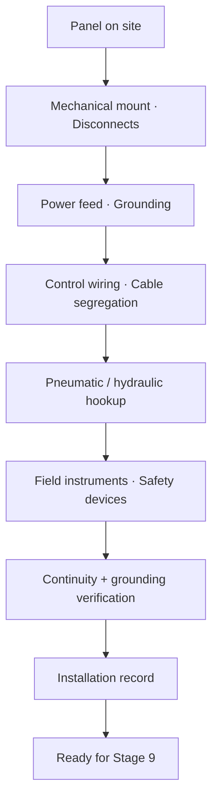

<div class="page-header">
  <span class="page-header__label">Lifecycle Stage 08</span>
  <h1>Installation</h1>
</div>

## Installation Sequence



## 1. Purpose of This Stage

This stage covers the **physical installation of the control system, machine electrical equipment, and safety devices at the final operating site** — the transition from the controlled environment of the build shop to the real-world conditions where the machine will operate for its entire service life.

Installation is where assumptions made during design are tested against reality. The cable run lengths assumed in voltage drop calculations become actual distances. The ambient temperature assumed in component derating becomes the actual environment. The available fault current assumed for SCCR becomes a real number from the facility's electrical distribution system. The enclosure rating selected in design faces the actual dust, moisture, washdown, or chemical exposure at the site.

This stage also introduces a critical handoff: the work may be performed by **different people** than those who designed and built the system — site electricians, rigging crews, mechanical contractors, and the customer's own maintenance team. These individuals may not have participated in Stages 1–7 and may not understand the safety architecture, CCF separation requirements, or the significance of specific wiring practices. The installation documentation must therefore be explicit, unambiguous, and self-contained.

Errors at this stage can silently defeat safety functions that were correctly designed and built. Routing both channels of a dual-channel safety circuit through the same field conduit destroys the CCF separation achieved in the panel. Connecting the wrong voltage to a safety device can damage it without immediate visible failure. An inadequate grounding connection can create intermittent faults that affect safety circuit reliability for years.

> **This stage answers: Is the system installed at the site exactly as designed, with all field wiring, grounding, environmental protection, and power supply conditions meeting or exceeding the design assumptions?**

---

## 2. Entry Criteria

This stage begins when **Stage 7 (Build) exit criteria are met** and the equipment has been delivered to the installation site.

### Required Inputs

| Input | Source (Stage) | Why It Matters |
|-------|---------------|----------------|
| As-built schematics and interconnection diagrams | Stage 7 | Authoritative reference for all field wiring connections — must be the as-built revision, not the original design revision |
| Installation instructions | Stage 6 (end-user documentation) | Site-specific installation requirements, foundation, utility connections, environmental requirements |
| Interconnection diagrams | Stage 5 / Stage 6 | Panel-to-panel and panel-to-field device wiring — terminal-to-terminal connection details for field wiring |
| Conduit / cable schedule | Stage 5 | Cable types, conduit sizes, routing requirements, safety circuit separation requirements |
| Grounding design | Stage 5 | Field grounding requirements — grounding electrode connections, equipment grounding conductors, bonding requirements |
| SCCR documentation | Stage 5 / Stage 7 | Panel SCCR value — must be compared to available fault current at the installation point |
| Nameplate data | Stage 7 | Supply voltage, phase, frequency, FLA/MCA, SCCR, enclosure type — reference for field verification |
| Safety circuit separation requirements | Stage 4 (CCF), Stage 5 | Field cable routing must maintain the same dual-channel separation achieved inside the panel |
| Fault exclusion register | Stage 4 | Some fault exclusions have installation conditions (e.g., cable separation) that must be maintained in the field |
| Safety device installation instructions | Manufacturer data (compiled in Stage 6) | Mounting requirements, wiring requirements, and environmental requirements for safety devices installed on the machine (light curtains, guard switches, e-stops, safety sensors) |
| Machine mechanical installation requirements | Mechanical engineering | Foundation, leveling, anchoring, vibration isolation, access clearances |
| Site electrical survey data | Customer / site engineer | Available fault current, supply voltage and quality, grounding system type, ambient conditions |
| Customer site safety requirements | Customer | Permit requirements, LOTO procedures, hot work permits, confined space, site-specific PPE, contractor safety orientation |

### Pre-Installation Verification

Before installation work begins:

| Check | Action | Responsible |
|-------|--------|-------------|
| Site readiness confirmed | Foundation/mounting location ready, utilities available (power, air, water as applicable), access clear for rigging | Project manager + customer site contact |
| Available fault current documented | Customer or site electrician provides available fault current at the point of connection — **this number must be known before the panel is energized** | Customer / site electrical engineer |
| Available fault current vs panel SCCR | Compare available fault current to panel nameplate SCCR — **available fault current must not exceed panel SCCR** | Installing electrician / project engineer |
| Supply voltage and phase confirmed | Customer confirms actual supply voltage, number of phases, frequency, and grounding system type (solidly grounded, impedance grounded, ungrounded) — must match panel nameplate | Customer / site electrical engineer |
| Site ambient conditions assessed | Temperature range, humidity, dust/contamination, washdown exposure, vibration, chemical exposure — compared to design assumptions | Project engineer / site survey |
| Installation documentation complete | All interconnection diagrams, cable schedules, grounding drawings, and installation instructions available at the site | Project engineer |
| Installer competency confirmed | Installing electricians are qualified for the scope of work (licensed where required, trained on applicable codes, familiar with safety circuit requirements) | Customer / installing contractor |
| Site safety orientation completed | All installation personnel have completed customer site safety orientation, understand site LOTO procedures, and have required PPE | Customer safety + installing contractor |
| Rigging plan approved (if applicable) | For heavy panels or machine sections — rigging plan reviewed, crane/forklift capacity confirmed, rigging points identified | Rigging contractor / customer safety |

---

## 3. Standards Influence

| Standard | Role at This Stage | Key Requirements |
|----------|-------------------|-----------------|
| **NEC (NFPA 70:2023)** | Governs all field electrical installation in the US — conductor sizing, raceway installation, grounding, overcurrent protection, equipment connection | Art. 110 (requirements for electrical installations), Art. 250 (grounding and bonding), Art. 300 (general wiring methods), Art. 310 (conductors), Art. 342–362 (raceways/conduit), Art. 409 (industrial control panels), Art. 430 (motors), Art. 670 (industrial machinery) |
| **NFPA 79:2024** | Machine electrical installation requirements — machine feeder sizing, disconnecting means, field wiring to machine, grounding at the machine | Ch. 5 (incoming supply), Ch. 8 (grounding), Ch. 12 (conductors), Ch. 14 (installation requirements) |
| **IEC 60204-1:2016** | International equivalent for machine electrical installation | Cl. 5 (incoming supply), Cl. 8 (equipotential bonding), Cl. 12 (conductors), Cl. 15 (installation) |
| **NEC Art. 409** | Industrial control panels — installation requirements, SCCR verification, available fault current documentation | §409.110 (marking), §409.30 (SCCR), §409.22 (available fault current documentation) |
| **NEC Art. 670** | Industrial machinery — supply conductor sizing, overcurrent protection, disconnecting means for machines | §670.3 (machine nameplate data), §670.4 (supply conductors and overcurrent protection) |
| **NEC Art. 250** | Grounding and bonding — equipment grounding conductors, grounding electrode system, bonding requirements | All applicable sections for the installation |
| **NEC Art. 110.24** | Available fault current documentation — requires available fault current to be documented at service equipment and industrial control panels (2023 NEC expanded scope) | §110.24 |
| **OSHA 29 CFR 1910.147** | Lockout/Tagout — applies during installation when working on or near energized equipment or equipment with stored energy | All applicable sections |
| **OSHA 29 CFR 1926 Subpart K** | Construction electrical safety — applies if installation is during the construction phase | All applicable sections |
| **NFPA 70E:2024** | Electrical safety in the workplace — arc flash hazard assessment, PPE requirements, energized work procedures for installation personnel | All applicable sections |
| **ISO 13849-1:2023** | Safety circuit installation must maintain the architecture, CCF measures, and fault exclusion conditions designed in Stage 4 | §7 (design considerations applicable to installation) |
| **IEC 62061:2021** | SRECS installation requirements | §6.6 (verification — installation verification) |
| **IEC 61511-1:2016 §15** | SIS installation requirements — specific requirements for field device installation, cable routing, junction boxes, and pre-commissioning verification | §15 (SIS installation, commissioning, and validation) |
| **Manufacturer installation instructions** | Every safety device (light curtains, guard switches, e-stops, safety sensors, safety-rated drives) has specific installation requirements that must be followed | Per device — mounting orientation, maximum cable length, EMC requirements, environmental limits |
| **Local codes and AHJ requirements** | Authority Having Jurisdiction may impose additional requirements beyond NEC — permits, inspections, specific installation methods | Varies by jurisdiction |

---

## 4. Engineering Activities

### 4.1 Machine and Panel Positioning

| Activity | Requirement | Verification |
|----------|------------|-------------|
| Position machine per layout drawing | Machine footprint, orientation, and access clearances per mechanical installation drawing | Dimensional check against drawing |
| Level and anchor machine | Per manufacturer requirements — level within specified tolerance; anchored to foundation as specified | Level measurement; anchor bolt torque |
| Position control panel(s) | Per electrical layout drawing — accessible location, door swing clearance, maintenance access, cable entry access | Position verified against drawing |
| Mount panel(s) | Per manufacturer requirements — wall-mount, floor-mount, or machine-mount as designed; correct mounting hardware; seismic bracing if required | Mounting verified; hardware correct |
| Verify panel accessibility | NEC Art. 110.26 — working space clearances around panel: minimum 3 feet deep, 30 inches wide, headroom per voltage level | Measured and documented |
| Verify enclosure environmental suitability | Enclosure NEMA type / IP rating is appropriate for the actual installation environment (not just the assumed environment from design) | Visual assessment of actual conditions vs design assumptions |

### 4.2 Field Power Supply Connection

#### 4.2.1 Machine Feeder Sizing and Protection

| Requirement | Standard Reference | Detail |
|------------|-------------------|--------|
| Feeder conductor sizing | NEC Art. 670.4(A), NFPA 79 §5.2 | Based on machine nameplate FLA/MCA — feeder ampacity ≥ 125% of largest motor FLA + sum of all other loads (per NEC 670.4(A)) or per MCA on nameplate |
| Feeder overcurrent protection | NEC Art. 670.4(B), NFPA 79 §5.2 | Maximum overcurrent device rating per machine nameplate or per NEC 670.4(B) calculation |
| Disconnect means | NEC Art. 670.4(C), NFPA 79 §5.3 | Machine disconnecting means — may be the main disconnect on the panel if within sight, or a separate disconnect per NEC requirements |
| Supply conductor type | NEC Art. 310, applicable raceway article | Conductor type, insulation rating, and temperature rating appropriate for the installation method and environment |
| Voltage drop | NEC (informational), good practice | Calculate voltage drop for the actual feeder length — verify voltage at the machine disconnect is within acceptable range (typically ±10% of nominal, but check machine nameplate requirements) |

#### 4.2.2 Available Fault Current Verification

**This is a critical installation activity that directly affects safety.**

| Step | Action | Responsibility |
|------|--------|---------------|
| 1 | Obtain available fault current at the point of connection from the facility's electrical distribution study or utility company | Customer / site electrical engineer |
| 2 | Compare available fault current to panel nameplate SCCR | Installing electrician / project engineer |
| 3 | If available fault current ≤ panel SCCR → proceed with connection | — |
| 4 | If available fault current > panel SCCR → **STOP — do not connect** | Project engineer must resolve — options: upstream current-limiting protection, panel SCCR upgrade, or relocation to a lower-fault-current supply |
| 5 | Document available fault current at the panel location | Required by NEC Art. 110.24 (2023 scope expansion) and NEC Art. 409.22 |

**Connecting a panel to a supply with available fault current exceeding the panel's SCCR is a code violation and a safety hazard. Under a short-circuit event, the panel components may fail catastrophically — arc flash, fire, or explosion.**

#### 4.2.3 Incoming Power Verification

| Test | Method | Acceptance Criteria |
|------|--------|--------------------|
| Supply voltage (L-L and L-N) | Multimeter measurement at machine disconnect — with disconnect OPEN, upstream supply energized | Within ±10% of nameplate voltage (or per machine specification if tighter tolerance required) |
| Phase rotation | Phase rotation meter | Correct rotation per machine requirements (critical for 3-phase motor direction) |
| Frequency | Frequency meter or power quality analyzer | Within ±2% of nameplate frequency (50Hz or 60Hz) |
| Voltage balance (3-phase) | Measure all three L-L voltages; calculate imbalance | Maximum 2% voltage imbalance between phases (>2% causes motor overheating and potential VFD issues) |
| Supply grounding system | Verify with customer documentation and measurement | Matches design assumption (solidly grounded, impedance grounded, or ungrounded) — if different from design assumption, engineering review required |
| Power quality (if specified) | Power quality analyzer — THD, voltage sags/swells, transients | Per machine specification or customer requirement — particularly important if VFDs or sensitive electronics are present |

### 4.3 Field Wiring — Signal and Control Cables

#### 4.3.1 Conduit and Raceway Installation

| Requirement | Standard Reference | Detail |
|------------|-------------------|--------|
| Conduit type | NEC Art. 342–362 (applicable raceway article) | Type per design specification — RMC, IMC, EMT, PVC, flexible conduit — appropriate for environment |
| Conduit sizing | NEC Chapter 9 Tables | Based on number and size of conductors — maximum fill per NEC Table 1 Chapter 9 (40% fill for 3+ conductors) |
| Conduit routing | NEC Art. 300, installation drawing | Minimum bend radius, maximum number of bends between pull points (360° per NEC 300.14), support spacing per raceway article |
| Conduit sealing | NEC (if required by environment) | Seal fittings where conduit passes between areas of different environmental classification (e.g., indoor to outdoor, hazardous to non-hazardous) |
| Cable tray installation | NEC Art. 392 | If cable tray is used — sizing, fill, support, grounding of tray |

#### 4.3.2 Safety Circuit Field Cable Routing

**This is the most critical field wiring activity. The CCF separation achieved inside the panel must be maintained through the field wiring.**

| Requirement | Basis | Implementation |
|------------|-------|----------------|
| Dual-channel safety cables in separate conduits | Stage 4 CCF separation measures | Channel A field cables in one conduit; Channel B field cables in a separate conduit — from panel to safety device |
| Safety cables separated from power cables | EMI protection for safety signals; CCF prevention | Minimum separation distance between safety signal conduit and power conduit (especially VFD output cables) — 150mm (6 inches) minimum; 300mm (12 inches) preferred; or use separate cable tray with barrier |
| Safety cable type per specification | Stage 5 cable schedule | Correct cable type — shielded if specified, correct number of conductors, correct voltage rating, correct temperature rating |
| Maximum cable length | Manufacturer specification for safety devices | Some safety devices have maximum cable length limits (light curtains, safety sensors) — verify field cable length does not exceed limit |
| Cable protection from mechanical damage | NEC Art. 300, good practice | Cables protected by conduit, cable tray with covers, or armor in areas exposed to physical damage (vehicle traffic, material handling, moving machine parts) |
| Cable identification | NEC Art. 310, NFPA 79 §13.2 | Safety cables identified at both ends and at all junction points — distinct marking from non-safety cables |

#### 4.3.3 Field Wiring Connections

| Activity | Requirement | Standard Reference |
|----------|------------|-------------------|
| Wire per interconnection diagrams | Terminal-to-terminal connections per as-built interconnection drawings — correct wire number, correct terminal, correct cable | Stage 5 / Stage 7 interconnection diagrams |
| Terminate on panel terminal blocks | Field wires terminate on the designated field terminal blocks inside the panel — not on internal component terminals | NFPA 79 §13.3, IEC 60204-1 §13.3 |
| Correct wire gauge | Per cable schedule — field conductor size must match design specification | NEC Art. 310, NFPA 79 §12 |
| Correct termination method | Ring/fork terminals, ferrules, or other method per terminal block type and site standard | UL 508A, NFPA 79 §13 |
| Tighten to torque specification | Every field wiring terminal tightened to manufacturer specification | Manufacturer data |
| Label field wires | Every field wire labeled at both ends with wire number per interconnection diagram | NFPA 79 §13.2, IEC 60204-1 §13.2 |
| Spare conductors | If spare conductors exist in multi-conductor cables, they must be identified, insulated, and terminated safely (not left floating near energized terminals) | Good practice |

### 4.4 Safety Device Installation

#### 4.4.1 General Safety Device Installation Requirements

| Activity | Requirement | Verification |
|----------|------------|-------------|
| Mount safety devices per manufacturer instructions | Correct orientation, mounting surface, hardware, and clearances per manufacturer installation guide | Visual comparison to manufacturer instructions |
| Verify safety device location per machine layout drawing | Correct position relative to hazard zone — must match the safety distance calculation from Stage 4 | Dimensional measurement |
| Verify safety distance | The distance between the safety device detection zone and the nearest hazard point must meet or exceed the calculated safety distance from Stage 4 / ISO 13855 | Measured distance ≥ calculated minimum safety distance |
| Verify detection zone coverage | For area-based safety devices (light curtains, laser scanners, safety mats): the detection zone must fully cover the access path with no gaps that allow undetected access | Physical verification — walk-through, reach-through, and under-reach tests per ISO 13855 |
| Verify environmental suitability | Safety device rated for the actual installation environment — temperature, humidity, dust, vibration, chemical exposure, optical interference (for optical devices) | Comparison of device rating to actual conditions |
| Connect safety device per wiring diagram | Dual-channel connection, correct polarity, correct wire type, shield connection per manufacturer instructions | Point-to-point check against interconnection diagram and manufacturer wiring diagram |

#### 4.4.2 Specific Safety Device Installation Considerations

| Device Type | Key Installation Considerations |
|-------------|-------------------------------|
| **Light curtains (AOPD)** | Mounting height per ISO 13855 and manufacturer; alignment between emitter and receiver; no reflective surfaces causing false sensing; mounting rigidity (vibration can cause misalignment); lens cleaning access; minimum object detection (resolution) verified per application |
| **Safety laser scanners** | Mounting height (typically 200–300mm for leg detection per ISO 13855); scan zone configuration matching the approved safety zone layout; no obstructions in scan path; floor surface reflectivity within scanner specification; protective zone and warning zone configured correctly |
| **Guard interlock switches** | Actuator alignment with guard movement; positive-mode operation verified; coded actuator type matches design (per ISO 14119 coding level); guard can reach full-open position without damaging switch; switch accessible for maintenance but not easily defeated |
| **Safety interlock devices with guard locking** | Locking mechanism engages correctly; spring-return operation verified; lock monitoring circuit connected; guard cannot be opened while lock is engaged; manual release accessible for emergency egress (if applicable) |
| **E-stop devices** | Red mushroom-head on yellow background per ISO 13850; mounted at accessible height and location per machine layout; positive-opening NC contacts verified; direct-opening action per IEC 60947-5-5; self-latching (stay-put) operation verified |
| **Pressure-sensitive mats/edges** | Full coverage of the designated detection zone; no gaps between adjacent mat sections; edge trim installed to prevent trip hazard and ingress; correct controller connection; walk-test across entire surface |
| **Safety-rated encoders/resolvers** | Mounted per manufacturer mechanical specification; coupling to motor shaft is secure and within specification; cable routed per EMC requirements; signal verified at safety controller |
| **Safety-rated pressure/temperature transmitters (SIS)** | Process connection per P&ID; impulse tubing routed correctly (slope, length, heat tracing if required); calibrated before installation or calibration verified after installation; transmitter range and configuration match the safety function specification |

### 4.5 Field Grounding and Bonding

| Activity | Requirement | Standard Reference |
|----------|------------|-------------------|
| Equipment grounding conductor (EGC) | Size per NEC Table 250.122 based on upstream overcurrent device rating; installed in the same raceway as the supply conductors | NEC Art. 250.118, 250.122 |
| Machine grounding | Machine frame bonded to building grounding system via EGC in supply raceway, or via separate grounding conductor to grounding electrode system (depending on installation design) | NEC Art. 250, NFPA 79 §8, IEC 60204-1 §8 |
| Supplemental grounding electrode | If required by design or local code — ground rod, ground plate, or connection to building steel | NEC Art. 250.52–250.56 |
| Bonding of all metallic raceways | All metallic conduit, cable tray, junction boxes, and enclosures bonded to form a continuous grounding path | NEC Art. 250.118, 300.10 |
| Grounding of remote panels/junction boxes | Every remote enclosure bonded to the main grounding system | NEC Art. 250 |
| Signal/shield grounding in the field | Communication cable shields terminated per design specification — single-point ground to avoid ground loops | Design specification, IEC 61326 |
| PE continuity verification | After all field grounding is complete: measure continuity from every exposed conductive part of the machine and every remote enclosure to the main PE terminal | ≤ 0.1Ω per IEC 60204-1 §18.2 |

### 4.6 Panel Environmental Sealing — Field Verification

| Activity | Requirement | Verification |
|----------|------------|-------------|
| All cable entries sealed | Every conduit entry, cable gland, and penetration into the panel sealed to maintain the enclosure NEMA type / IP rating | Visual inspection — no open holes, no missing glands, no gaps |
| Unused entries sealed | Any unused knockouts, cable entries, or conduit hubs sealed with listed plugs or caps | Visual inspection |
| Panel door gasket intact | Door gasket not damaged during shipping or installation; doors close and latch properly | Visual and functional check |
| Cooling system connected (if applicable) | External cooling (facility air conditioning ducted to panel, external heat exchanger, chilled water connection) connected per design | Functional verification |
| Drain provisions (if applicable) | Condensate drain in panel bottom (for NEMA 4/4X enclosures in high-humidity or washdown environments) open and functioning | Visual check |
| Sun shield / rain hood (if outdoor) | Installed if specified for outdoor installations | Visual check |

### 4.7 Mechanical Installation Verification

| Activity | Requirement | Verification |
|----------|------------|-------------|
| Guard mounting | All physical guards (fixed guards, interlocked guards, barriers) installed per machine layout drawing — secure mounting, no gaps that allow access to hazard zones | Visual inspection; gap measurement against ISO 13857 |
| Guard interlock actuator alignment | Guard switch actuator aligns with switch throughout the full range of guard motion (open and closed) | Functional check — operate guard through full range |
| Safety device mounting rigidity | Light curtains, laser scanners, and other position-critical safety devices mounted on rigid structures that do not deflect under normal operating conditions | Visual and functional check — verify alignment after machine vibration exposure |
| Safety distance verification | Physical measurement of the distance from each safety device detection zone to the nearest hazard point — compared to the calculated safety distance | Measured distance ≥ calculated minimum distance; documented |
| Emergency egress | Emergency exits from the machine area are not blocked by the installation; e-stop devices are accessible; escape routes are clear | Walk-through verification |
| Access for maintenance | All components requiring periodic maintenance (filters, fuses, safety devices, proof test points) are accessible without removing guards or other equipment | Walk-through verification |

### 4.8 Junction Box and Field Termination Verification

| Activity | Requirement |
|----------|------------|
| Junction box mounting | Correct location, correct enclosure rating for environment, properly sealed |
| Terminal block installation in junction boxes | Correct terminal blocks, correct labeling, correct wire landing per interconnection diagram |
| Safety circuit separation in junction boxes | If dual-channel safety cables pass through a junction box, channel separation must be maintained inside the box — separate terminal blocks, physical separation or barrier |
| Junction box covers secured | All covers installed and fastened after wiring is complete — open junction boxes defeat enclosure rating and expose terminations to environment |
| Wire identification in junction boxes | Every wire labeled at the junction box terminal — consistent with cable schedule and interconnection diagrams |

---

## 5. Installation-Specific Safety Concerns

### 5.1 Hazards During Installation

| Hazard | Source | Control Measure |
|--------|--------|----------------|
| Electrical shock | Working near or on energized supply circuits; first energization of machine | LOTO on supply before making connections; verify de-energized before work; NFPA 70E procedures for any energized work |
| Arc flash | High available fault current at point of connection; first energization with potential wiring errors | Arc flash PPE per NFPA 70E; incident energy assessment or PPE category per facility arc flash study |
| Falling objects | Rigging panels, machines, or heavy components | Rigging plan; qualified rigger; hard hats; exclusion zone below rigging |
| Struck by / caught between | Machine positioning, panel mounting, conduit installation in confined areas | Safe rigging practices; proper tools; buddy system in confined areas |
| Falls | Working at height for cable tray installation, overhead conduit, panel mounting | Fall protection per OSHA 1926 Subpart M (construction) or 1910 Subpart D (general industry); ladders, scaffolding, or lifts as appropriate |
| Stored energy | Residual voltage in capacitors, pressurized systems, springs, gravity (suspended loads) | Verify all energy sources are isolated and dissipated before working on the machine; follow machine-specific LOTO procedure |

### 5.2 LOTO During Installation

| Phase | LOTO Requirement |
|-------|-----------------|
| Before connecting supply conductors | Supply circuit de-energized and locked out at the upstream source |
| During field wiring | Machine disconnect locked out in OFF position; verify de-energized at all work points |
| Before first energization | All personnel clear of the machine; controlled power-up sequence per Stage 7 initial power-up procedure (adapted for field conditions) |
| During safety device installation on operating machine (retrofit) | Machine-specific LOTO per OSHA 29 CFR 1910.147; all energy sources identified and isolated |

---

## 6. Field Changes and Deviation Management

### 6.1 Principle

Field conditions frequently require deviations from the design — different conduit routing due to building obstructions, different cable lengths, different mounting positions for safety devices due to machine geometry variations. Every field change must be documented, and field changes affecting safety circuits must be evaluated for safety impact.

### 6.2 Field Change Process

```
Field condition requires deviation from design
        │
        ▼
┌─────────────────────────────┐
│ Does the change affect:      │
│ • Safety device location     │
│ • Safety circuit wiring/     │
│   routing                    │
│ • Safety distance            │
│ • CCF separation             │
│ • Grounding of safety        │
│   circuits                   │
│ • Any fault exclusion        │
│   condition                  │
│ • SCCR (component or path    │
│   change)                    │
└─────────────┬───────────────┘
              │
        ┌─────┴──────┐
        ▼            ▼
       YES           NO
        │             │
        ▼             ▼
┌────────────┐  ┌──────────────────┐
│ STOP WORK  │  │ Standard field   │
│ on affected│  │ change process — │
│ scope      │  │ installer        │
│            │  │ documents change │
│ Contact    │  │ on as-built      │
│ project    │  │ markup; field    │
│ engineer / │  │ engineer approves│
│ safety     │  │                  │
│ engineer   │  └──────────────────┘
│            │
│ Safety     │
│ impact     │
│ assessment │
│ required   │
│ before     │
│ work       │
│ resumes    │
└────────────┘
```

### 6.3 Common Field Changes and Safety Impact

| Field Change | Potential Safety Impact | Required Assessment |
|-------------|----------------------|---------------------|
| Safety device location changed (e.g., light curtain moved due to machine geometry) | Safety distance may no longer be met; detection zone coverage may have gaps | Re-calculate safety distance per ISO 13855; verify detection zone coverage; update safety distance documentation |
| Conduit routing changed — both safety channels in same conduit | CCF separation destroyed; redundant architecture compromised | Re-route to maintain separation; if not possible, safety engineer must evaluate alternative CCF measures and re-score |
| Cable length longer than specified | Voltage drop at safety device may exceed allowable range; response time may increase; maximum cable length for safety device may be exceeded | Calculate voltage drop; verify against device specification; verify response time is still within budget |
| Different cable type used | Voltage rating, temperature rating, shielding, or conductor size may differ from specification | Verify cable meets all specification requirements; if different, engineering evaluation required |
| Additional junction box added to cable route | Additional termination point creates potential failure point; channel separation must be maintained inside junction box | Verify channel separation; verify termination quality; update interconnection diagrams |
| Guard mounting position changed | Safety distance to hazard zone may change; interlock switch alignment may be affected | Re-verify safety distance; verify interlock alignment; update layout drawing |
| Supply voltage different from nameplate | Machine may not operate correctly; VFDs and power supplies may be outside input range; safety device voltage may be affected | Engineering evaluation — voltage within acceptable range? Component ratings adequate? |
| Grounding system type different from design assumption | Ground fault behavior may differ; ground fault detection on safety circuits may be affected | Engineering evaluation — particularly important for safety circuit ground fault detection |

### 6.4 Field Change Documentation

| Document | Content |
|---------|---------|
| Field change request (FCR) | Description of proposed change, reason, affected documents, safety circuit affected (yes/no) |
| Safety impact assessment (if safety-affected) | Assessment by safety engineer of impact on PL/SIL, CCF, safety distance, response time, fault exclusions |
| Approval | For safety changes: safety engineer approval before implementation; for standard changes: field engineer approval |
| As-built markup | Change recorded on field copy of interconnection diagrams, cable schedule, or layout drawing |
| Formal document revision | After installation is complete: engineering incorporates all field changes into formal as-built document revision |

---

## 7. Key Deliverables

| # | Deliverable | Description |
|---|------------|-------------|
| 1 | **Installation record** | Complete record of the installation including all activities, verifications, and sign-offs |
| 2 | **Site wiring verification records** | Point-to-point verification of field wiring connections against interconnection diagrams — 100% check for safety circuits |
| 3 | **Grounding continuity verification** | PE continuity measurements from every exposed conductive part of the machine and every remote enclosure to the main PE terminal — ≤ 0.1Ω |
| 4 | **Incoming power verification record** | Supply voltage (all phases), phase rotation, frequency, voltage balance, grounding system type — all measured and documented |
| 5 | **Available fault current documentation** | Available fault current at the point of connection — documented per NEC Art. 110.24; compared to panel SCCR |
| 6 | **Safety device installation verification records** | For each safety device: mounting verified, alignment verified, wiring verified, safety distance measured and compared to requirement |
| 7 | **Safety distance verification records** | Physical measurement of safety distances at each safety device location — compared to calculated minimum from Stage 4 |
| 8 | **Enclosure integrity verification** | Verification that all panel and junction box enclosures maintain their rated protection after cable entry and field connections |
| 9 | **Field change records** | All field change requests, safety impact assessments, approvals, and as-built markups |
| 10 | **As-built field markup** | Marked-up interconnection diagrams, cable schedule, and layout reflecting all field conditions as installed |
| 11 | **Insulation resistance test (field wiring)** | Megger test on field wiring — ≥ 1 MΩ between conductors and PE |
| 12 | **Conduit / cable schedule (as-installed)** | Actual cable types, conduit sizes, and routing — updated for any field changes |
| 13 | **Guard installation verification** | Verification that all physical guards are installed, secure, and have no gaps exceeding ISO 13857 limits |
| 14 | **Permit and inspection records** | Electrical permits, AHJ inspection records, contractor certifications (as required by jurisdiction) |
| 15 | **Installation photographs** | Photographs of cable routing (showing safety circuit separation), safety device installations, grounding connections, panel field wiring entries, nameplate |
| 16 | **Updated assumptions register** | Any design assumptions found to be incorrect during installation — with impact assessment and resolution |

### Installation Record — Template Structure

| Section | Content |
|---------|---------|
| **1. Project identification** | Project number, machine identification, site location, installation dates |
| **2. Installation team** | Names, roles, qualifications/licenses, company |
| **3. Site conditions** | Actual ambient temperature, humidity, environment type — compared to design assumptions |
| **4. Power supply** | Available fault current, supply voltage/phase/frequency, grounding system type, SCCR comparison |
| **5. Field wiring verification** | P2P check records, cable schedule verification, safety circuit verification |
| **6. Safety device installation** | Device-by-device verification records with safety distance measurements |
| **7. Grounding verification** | PE continuity measurements, grounding electrode connections, bonding verification |
| **8. Enclosure integrity** | Enclosure rating verification for all panels and junction boxes |
| **9. Guard installation** | Guard installation verification, gap measurements |
| **10. Field changes** | All FCRs with dispositions and as-built markups |
| **11. Insulation resistance** | Megger test results for field wiring |
| **12. Permits and inspections** | Permit numbers, inspection dates, inspector names, results |
| **13. Photographs** | Referenced installation photographs |
| **14. Sign-offs** | Installing electrician, site supervisor, project engineer, safety engineer (for safety-related items) |
| **15. Open items** | Any items not complete at installation close-out — with owner, target date, and impact on commissioning |

---

## 8. Exit Criteria — Gate Review

This stage is complete when **all** of the following are true:

| # | Criterion | Evidence |
|---|-----------|----------|
| 1 | Machine and panels are positioned and mounted per installation drawings | Installation record — Section 2 |
| 2 | All field wiring is connected per interconnection diagrams — 100% of safety circuits verified point-to-point | Site wiring verification records |
| 3 | Safety circuit field cables are routed with channel separation maintained per CCF requirements | Installation photographs; field routing verification |
| 4 | All safety devices are installed per manufacturer instructions and machine layout | Safety device installation verification records |
| 5 | All safety distances are measured and meet or exceed calculated minimums | Safety distance verification records |
| 6 | All physical guards are installed with no gaps exceeding ISO 13857 limits | Guard installation verification |
| 7 | Available fault current is documented and does not exceed panel SCCR | Available fault current documentation; SCCR comparison |
| 8 | Incoming supply voltage, phase rotation, frequency, and balance are verified and within specification | Incoming power verification record |
| 9 | PE continuity ≤ 0.1Ω from every exposed conductive part to main PE terminal | Grounding continuity verification |
| 10 | Field wiring insulation resistance ≥ 1 MΩ | Insulation resistance test record |
| 11 | All panel and junction box enclosures maintain rated protection after field connections | Enclosure integrity verification |
| 12 | All field changes are documented with safety impact assessment (if applicable) and approval | Field change records |
| 13 | As-built field markup is complete reflecting actual installation | As-built markup |
| 14 | Electrical permits obtained and inspections passed (if required by AHJ) | Permit and inspection records |
| 15 | All open items from installation are documented with owners, target dates, and impact on commissioning | Installation record — Section 15 |
| 16 | Installation record is complete and signed off | Completed installation record with all signatures |

**If available fault current exceeds panel SCCR, the panel must NOT be energized until the condition is resolved. If any safety device installation does not meet the safety distance requirement, the device must be repositioned or the safety distance recalculated before commissioning proceeds.**

---

## 9. Roles and Responsibilities at This Stage

| Role | Responsibility |
|------|---------------|
| **Installing Electrician / Electrical Contractor** | Performs physical installation — conduit, cable pulling, terminations, grounding, safety device mounting; documents work on installation record; creates as-built markups for any field deviations |
| **Site Supervisor / Foreman** | Manages installation crew; ensures work follows installation documentation; enforces site safety procedures; manages schedule |
| **Project Engineer / Field Engineer** | Oversees installation quality; verifies critical measurements (safety distances, grounding, incoming power); approves standard field changes; coordinates with safety engineer for safety-related changes |
| **Safety / Controls Engineer** | Reviews and approves all safety-related field changes; verifies safety device installations and safety distances; verifies field CCF separation; assesses safety impact of any deviations |
| **Customer Site Electrical Engineer** | Provides available fault current data, supply characteristics, and grounding system information; coordinates supply connection and permits |
| **Customer Safety Representative** | Provides site safety orientation, LOTO procedures, and work permits; may witness safety device installations |
| **Authority Having Jurisdiction (AHJ)** | Inspects installation for code compliance; issues permits; approves energization (where required by jurisdiction) |
| **Project Manager** | Coordinates installation schedule with customer; manages contractor scope; tracks installation open items; ensures installation record is complete before commissioning begins |

---

## 10. Common Mistakes at This Stage

| Mistake | Consequence | How to Avoid |
|---------|-------------|-------------|
| Available fault current not verified before energization | If available fault current exceeds panel SCCR, a short-circuit event can cause catastrophic panel failure — arc flash, fire, equipment destruction | Obtain available fault current data before installation; compare to panel SCCR; document per NEC Art. 110.24; do not energize if SCCR is exceeded |
| Both channels of dual-channel safety circuit routed in same field conduit | CCF separation destroyed in the field even though it was maintained in the panel; redundant architecture compromised | Mark safety cable channels distinctly on cable schedule and interconnection diagrams; installer instruction to use separate conduits; verify during installation |
| Safety device mounted at wrong distance from hazard zone | Safety distance requirement not met; safety function may not prevent injury because the person can reach the hazard before the machine stops | Measure actual safety distance after installation; compare to calculated minimum; document |
| Light curtain or laser scanner not properly aligned | Device may not detect intrusion across the full protected zone; gaps in detection allow undetected access | Perform alignment verification per manufacturer procedure; walk-through and reach-through tests during pre-commissioning |
| Phase rotation not verified | Motors run backward on first energization; potential machine damage; potential safety hazard (conveyor runs wrong direction, pump runs dry) | Verify phase rotation with rotation meter before energizing motors |
| Field grounding inadequate or missing | Ground fault does not clear properly; safety circuit ground fault detection does not function; shock hazard | PE continuity measurement at every point; verify EGC sizing; verify bonding of all metallic raceways |
| Field changes not documented | As-built documentation does not match actual installation; commissioning team works from incorrect drawings; maintenance team works from incorrect drawings for the life of the machine | Mandatory field change process; as-built markup required for every deviation; formal document revision after installation |
| Safety circuit cable exceeds manufacturer maximum length | Signal degradation, voltage drop, or response time increase may cause safety device malfunction or nuisance tripping | Verify cable length against manufacturer specification before pulling cable; if longer route is required, consult manufacturer |
| Junction box for safety circuits does not maintain channel separation | Common termination point defeats dual-channel independence | Specify channel separation requirements in installation instructions; verify during installation |
| Panel enclosure rating compromised by field connections | Improperly installed cable glands, missing seals, or oversized penetrations allow moisture, dust, or chemical ingress | Verify enclosure integrity after all field connections; use correct gland sizes and types; seal unused penetrations |
| Permits not obtained or inspections not scheduled | AHJ issues stop-work order; energization delayed; potential fines | Identify permit requirements early; submit permit applications before installation begins; schedule inspections to align with project timeline |
| Supply voltage significantly different from nameplate | Equipment operates outside rated range; power supply, VFD, or safety device failure; potential safety function malfunction | Measure supply voltage before connecting; verify within acceptable range per nameplate and component specifications |
| Grounding system type different from design assumption (e.g., ungrounded instead of solidly grounded) | Ground fault behavior differs from design; ground fault detection circuits may not function as designed; safety circuit diagnostics affected | Verify grounding system type with customer; if different from design, engineering review before energization |
| Safety device installation instructions not followed | Incorrect mounting, wiring, or configuration voids manufacturer's PL/SIL certification for the device | Provide manufacturer installation instructions to the installer; verify compliance after installation |
| No installation photographs taken | No evidence of installation quality; field routing and separation cannot be verified after conduits are closed and ceilings are installed | Mandatory photograph checklist — take photos before covering or closing cable routes |

---

## 11. Relationship to Adjacent Stages

```
┌──────────────────────────────────────┐
│  STAGE 7: BUILD                       │
│                                      │
│  Provides:                           │
│  • Built panel(s)                    │
│  • As-built schematics              │
│  • Configuration backups             │
│  • Build records                     │
│  • Software loaded and verified      │
└──────────────────┬───────────────────┘
                   │
                   │  Equipment shipped to site
                   ▼
┌──────────────────────────────────────┐
│  STAGE 8: INSTALLATION                │  ◄── You are here
│                                      │
│  Produces:                           │
│  • Installed system                  │
│  • Installation record               │
│  • Field wiring verification         │
│  • Grounding verification            │
│  • Power supply verification         │
│  • Safety distance verification      │
│  • Available fault current doc       │
│  • Field change records              │
│  • As-built field markup             │
└──────────────────┬───────────────────┘
                   │
                   ▼
┌──────────────────────────────────────┐
│  STAGE 9: PRE-COMMISSIONING          │
│                                      │
│  Uses:                               │
│  • Installation record as evidence   │
│    that the system is physically     │
│    ready for testing                 │
│  • Field wiring verification as      │
│    input — pre-comm does not repeat  │
│    P2P checks already done at        │
│    installation, but spot-checks     │
│    and adds functional verification  │
│  • Safety distance measurements as   │
│    input to pre-comm safety device   │
│    verification                      │
│  • Incoming power verification as    │
│    input — pre-comm confirms         │
│    voltages at all points in the     │
│    system                            │
│  • Available fault current doc as    │
│    input — pre-comm confirms SCCR    │
│    is not exceeded                   │
│  • As-built field markup as          │
│    reference for any field wiring    │
│    discrepancies found during        │
│    pre-comm                          │
└──────────────────┬───────────────────┘
                   │
                   ▼
┌──────────────────────────────────────┐
│  STAGE 10: COMMISSIONING              │
│                                      │
│  Uses:                               │
│  • Installed and verified system     │
│    as the object of V&V testing      │
│  • Safety distances as input to      │
│    response time verification        │
│  • Installation record as evidence   │
│    in the V&V documentation          │
└──────────────────────────────────────┘
```

---

## 12. Special Considerations

### 12.1 Retrofit Installations

When installing new safety equipment on an existing, operating machine:

| Consideration | Requirement |
|--------------|------------|
| Machine must be de-energized and locked out during installation | OSHA 29 CFR 1910.147; machine-specific LOTO procedure |
| Existing wiring must be verified before connecting new equipment | Verify existing wire numbers, terminal assignments, and voltage levels match design assumptions |
| Existing grounding must be verified | Existing PE connections may be degraded, corroded, or missing — verify continuity before relying on existing grounding |
| Interaction with existing safety systems | New safety devices must not interfere with existing safety functions; integration points must be verified |
| Temporary risk control measures | During installation, the machine may have reduced safeguarding — temporary barriers, warning signs, and administrative controls must be in place |
| Phased energization plan | If the retrofit is performed in phases with the machine partially operational between phases, each phase must leave the machine in a safe, defined state |

### 12.2 Multi-Panel and Distributed Installations

| Consideration | Requirement |
|--------------|------------|
| Inter-panel communication | Safety network connections (e.g., PROFIsafe, CIP Safety, FSoE) verified for correct addressing, cable type, and termination |
| Inter-panel safety circuit wiring | Hardwired safety signals between panels (e.g., e-stop daisy-chain, zone interlock signals) verified per interconnection diagrams |
| Remote I/O cabinets | Safety I/O in remote cabinets verified for correct addressing, correct power supply, and correct grounding |
| Cable length limits for safety networks | Safety communication protocols have maximum cable length and network topology requirements — verify field installation complies |
| Common PE reference | All panels and remote cabinets share a common PE reference — verify continuity across the entire installation |

### 12.3 Hazardous (Classified) Locations

| Consideration | Requirement |
|--------------|------------|
| Area classification | Verify the machine or parts of the machine are not installed in a classified location (NEC Art. 500–516) that was not identified during design |
| If classified location | Wiring methods, enclosures, and equipment must comply with the applicable NEC article for the classification; safety devices must be listed/certified for the classification; this may require design changes if not anticipated in Stage 2 |
| Conduit sealing | Conduit seal fittings required where conduit passes between classified and unclassified areas |

---

## 13. Templates and Tools

| Resource | Purpose |
|----------|---------|
| Installation record template | Structured form per Section 7 template structure |
| Field wiring P2P check record template | Wire-by-wire verification form for field connections |
| Safety device installation checklist | Device-by-device verification form with safety distance measurement fields |
| Safety distance measurement record template | Form for recording measured distance vs calculated minimum per safety device location |
| Incoming power verification form | Voltage, phase rotation, frequency, balance, grounding system type |
| Available fault current documentation form | Available fault current value, source of data, SCCR comparison, pass/fail |
| Grounding continuity measurement record | Point-by-point PE continuity measurements |
| Field change request (FCR) form | Proposed change, reason, safety impact (yes/no), safety engineer approval (if applicable) |
| Installation photograph checklist | List of required photographs with descriptions |
| Enclosure integrity verification checklist | Penetration-by-penetration verification form |
| Guard installation verification checklist | Guard-by-guard verification with gap measurements |
| Voltage drop calculation worksheet | For verifying field cable voltage drop on long runs — particularly for safety device circuits |

---

<nav class="page-nav">
  <a href="{{ '/lifecycle/build/' | relative_url }}" class="page-nav__prev">← Stage 7: Build</a>
  <a href="{{ '/lifecycle/pre-commissioning/' | relative_url }}" class="page-nav__next">Stage 9: Pre-Commissioning →</a>
</nav>
