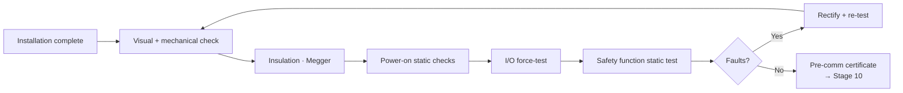

<div class="page-header">
  <span class="page-header__label">Lifecycle Stage 09</span>
  <h1>Pre-Commissioning and Calibration</h1>
</div>

## Pre-Commissioning Gates



## 1. Purpose of This Stage

This stage is the **systematic verification that the installed system is correctly wired, configured, calibrated, and functionally operational before the process or machine is started with actual production conditions.** It is the bridge between installation (Stage 8) and full commissioning (Stage 10).

The distinction between pre-commissioning and commissioning is critical:

- **Pre-commissioning (this stage):** Verifies the system is built and installed correctly — wiring, configuration, calibration, and basic functional response. Performed **without the process running, without material in the machine, and without production conditions.** The goal is to find and fix construction and installation errors before they become dangerous under actual operating conditions.
- **Commissioning (Stage 10):** Verifies the system performs correctly **under actual or simulated production conditions** — response times measured with actual machine dynamics, safety functions tested with actual safeguarding devices and actual hazard zone conditions, V&V report completed.

Pre-commissioning catches the errors that should never reach commissioning: wired-to-wrong-terminal, reversed polarity, miscalibrated sensor, incorrect safety PLC configuration, motor running backward, e-stop wired to wrong channel. Discovering these errors during commissioning — with the process running and people in the area — is more expensive, more disruptive, and potentially dangerous.

This stage also establishes **baseline measurements** that become the reference for the entire operational life of the machine — initial calibration values, initial proof test response measurements, and initial safety function verification records. These baselines are used during Stage 11 (Maintenance) to detect degradation over time.

> **This stage answers: Is every circuit, device, instrument, and safety function verified to be correctly installed and basically functional before we start the machine with the process?**

---

## 2. Entry Criteria

This stage begins when **Stage 8 (Installation) exit criteria are met**.

### Required Inputs

| Input | Source (Stage) | Why It Matters |
|-------|---------------|----------------|
| Installation record (completed) | Stage 8 | Confirms all physical installation is complete, field wiring verified, grounding verified, power supply verified, safety distances measured |
| Pre-commissioning checklist | Stage 6 (commissioning package) | The structured checklist created by the designer — defines what must be verified and in what order |
| Safety function verification plan | Stage 5 / Stage 6 | Defines test procedures and acceptance criteria for each safety function — pre-commissioning executes the preliminary tests; Stage 10 executes the full tests |
| Safety function register (finalized) | Stage 3 / Stage 4 | Master reference for all safety functions with PLr/SIL targets, safe states, response times, reset behavior |
| Cause and effect matrix | Stage 6 | Reference for verifying that every input produces the correct output response |
| As-built schematics | Stage 7 / Stage 8 | Current revision reflecting all build and field changes — the reference for all wiring verification |
| As-built interconnection diagrams | Stage 7 / Stage 8 | Reference for field wiring verification |
| I/O assignment table | Stage 5 | Reference for I/O verification — maps every physical I/O point to its PLC address and function |
| Safety PLC program (approved version with CRC/signature) | Stage 7 | Reference for verifying that the loaded program matches the approved version |
| Drive parameter list (approved) | Stage 7 | Reference for verifying drive configuration including safety-related parameters |
| Component-specific commissioning procedures | Manufacturer data | Commissioning procedures for specific safety devices (light curtain alignment, laser scanner zone verification, safety PLC diagnostic checks) |
| Calibration specifications | Stage 5 / manufacturer data | Calibration range, accuracy, and acceptance criteria for each instrument |
| Response time analysis | Stage 4 | Reference for preliminary response time checks (full measurement in Stage 10) |
| Build records (from Stage 7) | Stage 7 | In-panel functional test results — pre-commissioning builds on these, not repeats them |
| Available fault current documentation | Stage 8 | Confirms SCCR is not exceeded — verified before any energization |
| Customer site safety requirements | Customer | Permit requirements, LOTO procedures, hot work permits, site-specific PPE, observer/witness requirements |

### Pre-Commissioning Readiness Verification

Before pre-commissioning activities begin:

| Check | Action | Responsible |
|-------|--------|-------------|
| Installation record complete and signed | Confirm all Stage 8 exit criteria are met | Project engineer |
| All installation open items resolved or dispositioned | No open items that affect pre-commissioning scope | Project engineer |
| All as-built documentation is current revision | Schematics, interconnection diagrams, I/O table, cable schedule reflect actual installation | Project engineer / controls designer |
| All safety devices physically installed and wired | No temporary jumpers or bypasses on safety circuits (unless formally documented and controlled) | Safety engineer / installer |
| All guards installed | Physical guards in place — pre-commissioning tests require guards to be operated | Mechanical / project engineer |
| Machine is in a safe state for testing | No material in the machine, no production conditions, hazard zones clear of personnel (except test personnel with controlled access) | Site supervisor / safety engineer |
| Test equipment available and calibrated | Multimeters, Megger, loop calibrators, stopwatches/timers, phase rotation meter, vibration meter (if applicable) — all with current calibration certificates | Commissioning engineer |
| Site LOTO and safety procedures in effect | LOTO procedures for controlled energization and de-energization; personnel trained on emergency procedures | Site safety / commissioning engineer |
| Customer witness requirements identified | If customer requires witness of specific tests, schedule is coordinated | Project manager |

---

## 3. Standards Influence

| Standard | Role at This Stage | Key Requirements |
|----------|-------------------|-----------------|
| **ISO 13849-1:2023 Annex K** | Provides a systematic verification checklist for safety-related parts of control systems — the primary tool for pre-commissioning verification of machinery safety functions | Annex K (informative but widely used as the de facto checklist); §8.2 (validation — testing) |
| **ISO 13849-2:2012** | Provides fault lists and validation methods for specific technologies (electrical, pneumatic, hydraulic, mechanical) — used to define what faults to test during pre-commissioning | All tables (fault lists by technology) |
| **IEC 62061:2021 §6.6** | Verification requirements for SRECS — systematic verification that the hardware and software implementation matches the safety requirements specification | §6.6 (verification), §6.9 (validation) |
| **IEC 61511-1:2016 §15** | Pre-startup safety review (PSSR) requirements for SIS — formal review confirming that the SIS is installed, configured, tested, and ready for operation | §15 (SIS installation, commissioning, and validation), §16 (SIS safety validation) |
| **IEC 60204-1:2016 §18** | Verification and testing requirements for machine electrical equipment — PE continuity, insulation resistance, voltage withstand, functional tests | §18.1 (general), §18.2 (continuity of PE), §18.3 (insulation resistance), §18.4 (voltage withstand), §18.5 (protection against residual voltage), §18.6 (functional tests) |
| **NFPA 79:2024 §19** | Testing requirements for machine electrical equipment — similar to IEC 60204-1 §18 | §19.4 (testing) |
| **ISA 84.00.01 / IEC 61511** | Pre-startup acceptance test (PSAT) requirements for SIS | Clause 15 |
| **IEC 61508-2:2010 §7.9** | Hardware integration testing requirements | §7.9 |
| **IEC 61326-1:2020** | EMC requirements — if EMC testing is required at the installation site (typically for CE marking or if EMC issues are suspected) | All clauses |
| **ISO 13855:2010** | Safety distance verification — pre-commissioning confirms that the installed safety distances meet the calculations | All clauses |
| **IEC 62046:2018** | Verification of muting functions — specific test requirements for muting, blanking, and reduced resolution | All applicable clauses |
| **Manufacturer commissioning procedures** | Each safety device manufacturer provides commissioning and verification procedures specific to their product — these are normative for the device's PL/SIL certification | Per device |

---

## 4. Engineering Activities

### 4.1 Pre-Commissioning Sequence

The recommended sequence ensures that basic electrical integrity is confirmed before functional testing, and non-safety functions are verified before safety functions (so that the machine can be controlled during safety testing):

```
Phase 1: ELECTRICAL VERIFICATION (No power applied)
    │
    ├── Step 1: Visual inspection
    ├── Step 2: PE continuity verification (field wiring)
    ├── Step 3: Insulation resistance test (field wiring)
    ├── Step 4: Point-to-point spot check (field wiring)
    │   ★ GATE: Electrical verification complete — safe to energize ★
    │
    ▼
Phase 2: INITIAL ENERGIZATION (Controlled power-up)
    │
    ├── Step 5: Controlled power-up sequence
    ├── Step 6: Voltage verification at all distribution points
    ├── Step 7: Control power verification (24VDC, 120VAC)
    ├── Step 8: PLC and safety controller boot verification
    │   ★ GATE: System energized and stable ★
    │
    ▼
Phase 3: I/O VERIFICATION AND LOOP CHECKS
    │
    ├── Step 9: Standard (non-safety) I/O verification
    ├── Step 10: Safety I/O verification
    ├── Step 11: Analog loop checks and calibration
    ├── Step 12: Communication link verification
    │   ★ GATE: All I/O verified ★
    │
    ▼
Phase 4: MOTOR AND ACTUATOR CHECKS
    │
    ├── Step 13: Motor rotation check (bump test)
    ├── Step 14: Motor protection verification
    ├── Step 15: Actuator stroke and position verification
    ├── Step 16: Pneumatic/hydraulic system verification
    │   ★ GATE: All drives and actuators verified ★
    │
    ▼
Phase 5: SAFETY FUNCTION VERIFICATION (DRY RUN)
    │
    ├── Step 17: Safety controller configuration verification
    ├── Step 18: Safety function dry-run testing (each SF)
    ├── Step 19: ISO 13849-1 Annex K checklist execution
    ├── Step 20: Muting function verification (if applicable)
    ├── Step 21: Mode-dependent safety behavior verification
    ├── Step 22: Diagnostic function verification
    │   ★ GATE: All safety functions verified (dry run) ★
    │
    ▼
Phase 6: INSTRUMENT CALIBRATION
    │
    ├── Step 23: Transmitter calibration / verification
    ├── Step 24: Safety-rated instrument calibration
    ├── Step 25: Alarm setpoint verification
    │   ★ GATE: All instruments calibrated ★
    │
    ▼
Phase 7: BASELINE DOCUMENTATION
    │
    ├── Step 26: Record baseline measurements
    ├── Step 27: Complete pre-commissioning checklist
    ├── Step 28: Pre-commissioning review and sign-off
    │   ★ GATE: Pre-commissioning complete — ready for Stage 10 ★
```

### 4.2 Phase 1: Electrical Verification (No Power)

#### Step 1: Visual Inspection

| Check Item | What to Look For |
|-----------|-----------------|
| Field wiring | No visible damage, no loose connections, no missing labels, no wires pinched in enclosure doors or cable glands |
| Safety devices | All safety devices installed and undamaged — light curtains, guard switches, e-stops, safety sensors, laser scanners |
| Guards | All physical guards installed, secure, no gaps |
| Enclosures | All covers closed, all glands sealed, no foreign objects inside panels |
| Labels and nameplates | All wire labels, component labels, and panel nameplates present and legible |
| Cable routing | Safety circuit cables separated from power cables per design; dual-channel separation maintained in field routing |
| Junction boxes | All covers installed and secured; terminal connections tight; wire identification present |

#### Step 2: PE Continuity Verification (Field Wiring)

| Requirement | Method | Acceptance Criteria |
|------------|--------|--------------------|
| PE continuity from every exposed conductive part of the machine to the main PE terminal | Low-resistance ohmmeter (≥ 200mA test current per IEC 60204-1, or ≥ 10A for formal testing) | ≤ 0.1Ω |
| Includes: machine frame, remote enclosures, door-mounted components, safety device enclosures, conduit system | Point-by-point measurement | Document each measurement point and value |

**Note:** If PE continuity was measured during installation (Stage 8), pre-commissioning verifies that the measurements are still valid and extends to any points not measured during installation.

#### Step 3: Insulation Resistance Test (Field Wiring)

| Requirement | Method | Acceptance Criteria |
|------------|--------|--------------------|
| Insulation resistance between all power conductors and PE | Megger test at 500VDC (for circuits ≤ 500V) | ≥ 1 MΩ |
| Disconnect all electronic devices before testing | Remove PLC modules, disconnect VFDs, disconnect safety controllers, disconnect power supplies — Megger voltage can damage electronics | Document which devices were disconnected |
| Test between phases (L1-L2, L1-L3, L2-L3) and each phase to PE | Megger at each point | ≥ 1 MΩ per test |

**If insulation resistance is below 1 MΩ, investigate and correct before energizing. Low insulation resistance indicates damaged insulation, moisture ingress, or contamination.**

#### Step 4: Point-to-Point Spot Check (Field Wiring)

| Requirement | Method | Scope |
|------------|--------|-------|
| Spot-check field wiring against interconnection diagrams | Continuity check with multimeter | If 100% P2P was performed at Stage 8: spot-check 10-20% of field connections plus 100% of any connections made after Stage 8 P2P check. If 100% P2P was NOT performed at Stage 8: perform 100% P2P now. |
| 100% check of all safety circuit field wiring | Continuity and correct terminal landing verification | Every safety circuit field wire verified — no exceptions |
| Verify no shorts between channels | Insulation check between Channel A and Channel B conductors of dual-channel safety circuits | No continuity between channels when devices are disconnected |

**★ GATE: Electrical Verification Complete ★**
All Phase 1 checks must pass before power is applied. Any failure must be investigated and corrected.

### 4.3 Phase 2: Initial Energization

#### Step 5: Controlled Power-Up Sequence

| Step | Action | Verification |
|------|--------|-------------|
| 1 | Ensure all output devices are in safe state (motor disconnects open, pneumatics vented, hydraulics depressurized) | Physical verification |
| 2 | All personnel clear of machine hazard zones | Verbal confirmation; visual check |
| 3 | Close main disconnect | No trips, no arcing, no abnormal sounds |
| 4 | Measure voltage at main bus | Correct voltage, correct phase rotation |
| 5 | Energize control transformer / 24VDC power supply | Measure output voltage — within specification |
| 6 | Verify PLC boots correctly | RUN indicators, no fault LEDs, correct mode |
| 7 | Verify safety controller boots correctly | Status LEDs per manufacturer documentation; safety controller enters expected startup state |
| 8 | Verify HMI boots correctly | Home screen displays; communication with PLC established |

#### Step 6-8: Voltage and System Verification

| Check | Method | Acceptance Criteria |
|-------|--------|--------------------|
| Voltage at every power distribution point | Multimeter measurement | Within ±10% of nominal (or per component specification) |
| 24VDC at safety I/O power rail | Multimeter measurement | 24VDC ±10% (typical 21.6–26.4VDC) — some safety controllers require tighter range |
| 24VDC at remote I/O cabinets | Multimeter measurement at the furthest point | Within specification after cable voltage drop |
| Safety controller status | LED indicators, diagnostic screen | No faults; correct configuration loaded; correct firmware version |
| Safety PLC program CRC/signature | Read from safety controller | Matches approved CRC/signature from Stage 7 |

**★ GATE: System Energized and Stable ★**

### 4.4 Phase 3: I/O Verification and Loop Checks

#### Step 9: Standard (Non-Safety) Digital I/O Verification

| Activity | Method | Documentation |
|----------|--------|--------------|
| Verify each digital input | Activate each input device (push button, limit switch, proximity sensor, etc.); observe PLC input status (via PLC programming software or HMI diagnostic screen) | Record: I/O address, device tag, activated state (ON/OFF), correct response (yes/no) |
| Verify each digital output | Command each output from PLC (via force or test routine — with appropriate safety precautions); verify physical output device activates | Record: I/O address, device tag, commanded state, physical response confirmed |
| Verify correct mapping | Input device tag matches I/O assignment table; output device tag matches I/O assignment table | Any mismatch → wiring error or programming error — investigate and correct |

#### Step 10: Safety I/O Verification

**Safety I/O verification requires additional rigor because errors in safety I/O can directly affect safety function integrity.**

| Activity | Method | Documentation |
|----------|--------|--------------|
| Verify each safety input (Channel A and Channel B independently) | Activate safety device; verify safety controller registers correct state on both channels; verify discrepancy detection works (activate one channel only — controller should detect mismatch) | Record: SF-ID, I/O address (CH A and CH B), device tag, activated state, both channels respond correctly, discrepancy detection confirmed |
| Verify each safety output | Command safety output from safety controller; verify physical output device (contactor, valve) activates and deactivates correctly | Record: SF-ID, I/O address, device tag, commanded state, physical response confirmed |
| Verify EDM feedback | With safety output energized: verify feedback input reads "healthy." Simulate contactor welding (manually hold contactor in — if safe to do so — or disconnect feedback wire): verify safety controller detects fault | Record: SF-ID, feedback I/O address, healthy state confirmed, fault detection confirmed |
| Verify dual-channel input independence | Disconnect one channel at a time; verify safety controller detects single-channel loss and responds correctly (fault state or safe state per design) | Record: SF-ID, CH A disconnected — response, CH B disconnected — response |
| Verify safe state on loss of power | Remove 24VDC from safety I/O; verify all safety outputs go to safe state (contactors drop out, valves close/vent) | Record: Safe state confirmed for all safety outputs |

#### Step 11: Analog Loop Checks and Calibration

| Activity | Method | Documentation |
|----------|--------|--------------|
| Loop check each analog input | Apply known signal (4mA, 12mA, 20mA for 4-20mA loops; or known process value from calibrator) at the field device; verify PLC reads correct value | Record: Loop tag, applied signal, PLC reading, error (within specification?) |
| Loop check each analog output | Command known output value from PLC; measure actual signal at the output terminal or at the field device | Record: Loop tag, commanded value, measured signal, error |
| Verify scaling | Apply 0%, 50%, 100% signals; verify PLC engineering units read correctly | Record: Raw signal vs engineering unit at each point |
| Identify and correct zero/span errors | If readings are out of tolerance, adjust at the transmitter, at the PLC scaling, or both | Record: Before adjustment values, adjustment made, after adjustment values |

#### Step 12: Communication Link Verification

| Activity | Method | Documentation |
|----------|--------|--------------|
| PLC to safety controller | Verify safety data exchange; verify correct addressing; verify failsafe behavior on communication loss (disconnect cable — verify safe state) | Record: Link status, data exchange confirmed, failsafe behavior confirmed |
| PLC to HMI | Verify all HMI data points updating correctly; verify alarm communication | Record: Link status, data exchange confirmed |
| PLC to drives (fieldbus) | Verify drive communication; verify correct drive addressing; verify failsafe behavior on communication loss | Record: Link status, drive response confirmed, failsafe confirmed |
| Safety network (PROFIsafe, CIP Safety, FSoE, etc.) | Verify safety network communication; verify correct addressing and configuration; verify failsafe behavior on communication loss | Record: Safety network status, all nodes online, failsafe behavior confirmed |
| Remote I/O | Verify all remote I/O modules communicating; verify correct addressing | Record: Module status, data exchange confirmed |

**★ GATE: All I/O Verified ★**

### 4.5 Phase 4: Motor and Actuator Checks

#### Step 13: Motor Rotation Check (Bump Test)

| Activity | Method | Precautions |
|----------|--------|-------------|
| Verify motor rotation direction | Briefly energize each motor ("bump") and observe rotation direction; compare to required direction per mechanical design | Motor disconnects closed one at a time; area clear of personnel; observer positioned to see rotation safely; ready to stop immediately |
| Correct reversed rotation | If rotation is incorrect: de-energize, LOTO, swap two phase conductors at the motor terminal box (for 3-phase) or at the starter | Do NOT swap phases at the panel — this may affect other circuits |

#### Step 14: Motor Protection Verification

| Activity | Method | Documentation |
|----------|--------|--------------|
| Verify overload relay settings | Compare overload relay trip setting to motor nameplate FLA | Record: Motor tag, nameplate FLA, overload setting, correct (yes/no) |
| Verify VFD motor parameters | Compare VFD motor parameters (voltage, frequency, FLA, power) to motor nameplate | Record: Drive tag, motor nameplate data, drive parameter values, correct (yes/no) |
| Verify VFD safety function parameters | Compare STO, SS1, SS2, SLS, SOS parameters to approved parameter list from Stage 7 | Record: Drive tag, parameter name, approved value, actual value, correct (yes/no) |
| Motor insulation test (if required) | Megger test on motor windings — disconnect from VFD/starter before testing | ≥ 1 MΩ (or per motor manufacturer specification) |

#### Step 15: Actuator Stroke and Position Verification

| Activity | Method | Documentation |
|----------|--------|--------------|
| Verify valve stroke (pneumatic/hydraulic) | Command valve open and closed; verify full stroke; verify position feedback matches actual position | Record: Valve tag, full open confirmed, full close confirmed, feedback correct |
| Verify cylinder operation | Command cylinder extend and retract; verify full travel; verify position switches (if any) activate at correct positions | Record: Cylinder tag, full extend confirmed, full retract confirmed, position switches correct |
| Verify safety-rated actuators | Safety valves, safety-rated cylinders — verify safe state position on loss of control signal or loss of supply pressure/power | Record: Actuator tag, safe state position confirmed on signal loss, safe state position confirmed on supply loss |

#### Step 16: Pneumatic/Hydraulic System Verification

| Activity | Method | Documentation |
|----------|--------|--------------|
| Verify supply pressure | Measure actual supply pressure; compare to design specification | Record: Actual pressure vs specified pressure |
| Verify pressure regulation | Verify pressure regulators set correctly; verify safety pressure switches (if any) activate at correct setpoints | Record: Regulator settings, pressure switch setpoints |
| Verify exhaust/dump function | For safety circuits with energy isolation (dump valves, exhaust valves): verify that the safety function correctly vents/dumps pressure when activated | Record: Dump valve response confirmed; pressure drops to safe level within specified time |
| Leak test | Pressurize system; verify no leaks at connections, fittings, cylinders, valves | Record: System leak-free (or leaks identified and corrected) |

**★ GATE: All Drives and Actuators Verified ★**

### 4.6 Phase 5: Safety Function Verification (Dry Run)

**This is the most important phase of pre-commissioning.** Each safety function is tested individually under controlled conditions — without the process running — to verify basic correct operation before full commissioning testing in Stage 10.

#### Step 17: Safety Controller Configuration Verification

| Check | Method | Acceptance Criteria |
|-------|--------|--------------------|
| Safety PLC program matches approved version | Read CRC/signature from safety controller; compare to approved CRC/signature from Stage 7 | Exact match |
| Safety controller configuration parameters match approved values | Download configuration; compare parameter-by-parameter to approved configuration list | All parameters match |
| Safety controller firmware version is correct | Read firmware version; compare to version used in Stage 4 PL/SIL calculation and Stage 7 verification | Correct version — firmware version can affect PFHd and PL/SIL rating |
| Safety controller diagnostic status is clear | Check diagnostic buffer/log for any errors or warnings | No unresolved errors or warnings |
| No forced I/O states | Verify zero forced inputs or outputs in the safety program | Zero forces |
| No bypassed safety functions | Verify no safety functions are in bypass/override state (unless formally documented for pre-commissioning purposes with controlled removal procedure) | Zero bypasses (or all documented and controlled) |

#### Step 18: Safety Function Dry-Run Testing

For each safety function in the register, perform a dry-run test:

| Test Element | What to Verify | Method |
|-------------|---------------|--------|
| **Triggering** | Safety function activates when the triggering condition occurs | Physically activate the safety device (open guard door, press e-stop, interrupt light curtain, etc.) |
| **Safe state** | Machine reaches the correct safe state | Verify output devices de-energize (contactors drop out, valves close/vent, drives disable); verify machine motion stops (or would stop — motors may not be loaded during dry run) |
| **Response** | Safety controller processes the demand and commands the safe state | Verify safety controller output status changes; verify safety controller diagnostic shows the demand was recognized |
| **Indication** | Safety status is correctly displayed to the operator | Verify HMI shows safety function tripped; verify any safety status pilot lights activate; verify muting lamp (if applicable) is OFF when not muting |
| **Reset** | Safety function resets only through the correct procedure | Release/clear the triggering condition; verify machine does NOT restart automatically (unless automatic restart is explicitly designed and justified); press reset button; verify machine can now be restarted |
| **Lockout** | Safety function cannot be defeated by the operator | Attempt to restart machine with safety device still in tripped state — verify restart is prevented |
| **Cross-channel** | Both channels of dual-channel safety functions operate correctly | Test with both channels active; then test with each channel individually disabled (if safe to do so) — verify safety controller detects single-channel fault |

#### Safety Function Dry-Run Test Record Template

| SF-ID | Safety Function | Test Date | Triggering Device Activated | Safe State Achieved? | Correct Outputs De-Energized? | HMI Indication Correct? | Reset Procedure Correct? | Auto-Restart Prevented? | Cross-Channel Test? | Discrepancy Detection? | EDM Test? | Result | Tested By | Witnessed By |
|-------|----------------|-----------|---------------------------|---------------------|------------------------------|------------------------|------------------------|------------------------|--------------------|-----------------------|----------|--------|-----------|-------------|
| SF-01 | Guard interlock — operator door | | Door opened | Y/N | K1, K2 de-energized | Y/N | Manual reset required, confirmed | Y/N | CH A tested, CH B tested | Discrepancy detected | Simulated K1 weld — detected | PASS/FAIL | | |
| SF-02 | E-stop — operator station 1 | | E-stop pressed | Y/N | All safety outputs de-energized | Y/N | E-stop released + reset button required, confirmed | Y/N | CH A tested, CH B tested | Discrepancy detected | Simulated K1 weld — detected | PASS/FAIL | | |
| SF-03 | Light curtain — infeed | | LC beam interrupted | Y/N | K1, K2 de-energized | Y/N | Beam clear + reset (or auto-restart per design) | Y/N | N/A (integral dual-channel) | N/A | Simulated K1 weld — detected | PASS/FAIL | | |

#### Step 19: ISO 13849-1 Annex K Checklist Execution

Annex K of ISO 13849-1 provides a structured verification checklist. The following is an expanded, practical version:

**Section A: General Safety Function Verification**

| # | Check Item | Method | Acceptance Criteria | SF-ID | Result |
|---|-----------|--------|--------------------|----|--------|
| A1 | Safety function achieves the defined safe state | Functional test | Machine reaches defined safe state per safety function register | | |
| A2 | Safety function responds to all defined triggering events | Functional test | Each triggering event produces the correct response | | |
| A3 | Safety function does not produce unintended hazardous conditions when activated | Observation during test | No unexpected motion, no energy release, no hazardous condition created by the safety function itself | | |
| A4 | Restart after safety function activation requires the defined reset procedure | Functional test | Machine does not restart without the specified reset action | | |
| A5 | Safety function operates correctly in all defined operating modes | Test in each mode | Correct behavior in automatic, manual, setup, maintenance modes as specified | | |

**Section B: Input Device Verification**

| # | Check Item | Method | Acceptance Criteria | SF-ID | Result |
|---|-----------|--------|--------------------|----|--------|
| B1 | Input device is correct type and model per BOM | Visual inspection | Matches BOM part number | | |
| B2 | Input device is installed per manufacturer instructions | Visual inspection | Mounting, orientation, alignment per manufacturer guide | | |
| B3 | Input device NC contacts used (where specified) | Schematic comparison + functional test | Wire break / disconnection detected as safety demand | | |
| B4 | Dual-channel inputs both functional | Individual channel test | Both channels respond; discrepancy detection works | | |
| B5 | Input device environmental suitability | Visual assessment | Device rated for actual conditions (temperature, dust, moisture, vibration) | | |

**Section C: Logic Solver Verification**

| # | Check Item | Method | Acceptance Criteria | SF-ID | Result |
|---|-----------|--------|--------------------|----|--------|
| C1 | Safety controller is correct type and model per BOM | Visual inspection | Matches BOM part number | | |
| C2 | Safety controller firmware version is correct | Read from controller | Matches approved version | | |
| C3 | Safety program CRC/signature matches approved version | Read from controller | Exact match | | |
| C4 | Safety controller configuration parameters are correct | Parameter comparison | All parameters match approved values | | |
| C5 | No forced I/O or bypassed functions | Status check | Zero forces, zero bypasses | | |
| C6 | Diagnostic function detects channel discrepancy | Simulate single-channel fault | Controller enters fault state or safe state within discrepancy time | | |
| C7 | Watchdog / self-monitoring is functional | Observe status LEDs; check diagnostic log | No watchdog errors; self-test passes | | |

**Section D: Output Device Verification**

| # | Check Item | Method | Acceptance Criteria | SF-ID | Result |
|---|-----------|--------|--------------------|----|--------|
| D1 | Output devices are correct type and model per BOM | Visual inspection | Match BOM part numbers | | |
| D2 | Output devices achieve safe state when de-energized | Remove control signal; observe | Contactors open, valves close/vent, drives disable | | |
| D3 | EDM (External Device Monitoring) detects output device failure | Simulate output device failure (disconnect feedback wire or hold contactor in) | Safety controller detects fault; prevents restart | | |
| D4 | Redundant output devices (both contactors / both valves) are functional | Test each independently (if possible without creating hazard) | Both devices respond correctly | | |
| D5 | Output device utilization category is correct for the application | Verify component rating vs actual load | Rating ≥ actual load; correct AC category | | |

**Section E: Wiring and Installation Verification**

| # | Check Item | Method | Acceptance Criteria | SF-ID | Result |
|---|-----------|--------|--------------------|----|--------|
| E1 | Dual-channel wiring is physically separated (panel and field) | Visual inspection | Separate wire ducts in panel; separate conduits in field; per CCF requirements | | |
| E2 | Safety circuit wiring is correctly identified (color, labels) | Visual inspection | Correct color; labels at both ends; consistent with wire schedule | | |
| E3 | No safety circuit wiring passes through non-safety terminal blocks | Trace wiring path | Safety circuits terminate on dedicated safety terminals | | |
| E4 | Cable/wire integrity | Visual and test | No visible damage; insulation resistance acceptable | | |
| E5 | Safety distances are correct | Physical measurement | Measured distance ≥ calculated minimum per ISO 13855 | | |

**Section F: Environmental and CCF Verification**

| # | Check Item | Method | Acceptance Criteria | SF-ID | Result |
|---|-----------|--------|--------------------|----|--------|
| F1 | CCF measures from Stage 4 are implemented | Inspection against CCF scoring worksheet | All scored measures are physically present and functional | | |
| F2 | Environmental conditions are within component ratings | Measurement (temperature, humidity) and observation (dust, vibration, chemical exposure) | All conditions within rated range | | |
| F3 | EMC environment is acceptable for safety devices | Observation; EMC testing if concerns exist | No interference observed on safety device operation; safety devices function correctly near VFDs, motors, and other EMI sources | | |

#### Step 20: Muting Function Verification (If Applicable)

| Test | Method | Acceptance Criteria |
|------|--------|--------------------|
| Muting activates only under correct conditions | Present the correct muting sensor sequence; verify muting enables | Muting engages only with correct sensor pattern; safety device is temporarily bypassed |
| Muting lamp activates during muting | Observe muting indication lamp | Lamp ON during muting, OFF at all other times |
| Muting times out if conditions not cleared | Activate muting; do not clear the muting condition; verify timeout | Muting disengages after timeout; safety device returns to active protection |
| Safety function remains active if muting conditions are not met | Attempt to trigger muting with incorrect sensor sequence (wrong order, single sensor, etc.) | Muting does NOT engage; safety device remains active |
| Safety function activates if person enters during muting | During active muting: interrupt the safety device (light curtain beam break by person, not by product) | Safety function activates — muting does not override person detection |
| Override/bypass indicators | If override is used for maintenance: verify override indicator is visible and cannot be ignored | Override lamp/indicator ON when override is active; HMI displays override status |

Per IEC 62046 requirements.

#### Step 21: Mode-Dependent Safety Behavior Verification

| Test | Method | Acceptance Criteria |
|------|--------|--------------------|
| Safety functions in automatic mode | Test all safety functions while machine is in automatic mode | All safety functions active as specified for automatic mode |
| Safety functions in manual/jog mode | Switch to manual mode; test all safety functions | Safety functions active as specified for manual mode; any additional safeguards for manual mode are functional (e.g., reduced speed, hold-to-run) |
| Safety functions in setup/teach mode | Switch to setup mode; test all safety functions | Safety functions active as specified for setup mode; enabling device (if used) is functional; speed limiting is active |
| Safety functions in maintenance mode | Switch to maintenance mode (if defined); test all safety functions | Safety functions active as specified; LOTO requirements are communicated |
| Mode transition behavior | Switch between modes; verify safety system responds correctly to each transition | No loss of safety function during mode transition; safety controller re-evaluates safety state on mode change |
| Mode selection authority | Verify that mode selection requires the correct authorization (key switch, password, access level) | Unauthorized mode change is prevented |

#### Step 22: Diagnostic Function Verification

| Test | Method | Acceptance Criteria |
|------|--------|--------------------|
| Single-channel fault detection | Disconnect one channel of each dual-channel safety function; verify detection | Safety controller detects fault within specified discrepancy time |
| EDM fault detection | Simulate contactor/valve welding; verify detection | Safety controller detects fault; prevents restart |
| Ground fault detection (if implemented) | Introduce ground fault on safety circuit (if safe to do so); verify detection | Safety controller detects ground fault |
| Wire break detection | Disconnect a safety input wire; verify detection | Safety controller detects loss of signal and enters safe state |
| Communication loss detection | Disconnect safety network cable; verify detection | Safety controller detects communication loss and enters safe state within specified time |
| Power supply fault detection | Reduce 24VDC voltage below minimum threshold (if safe to do so); verify detection | Safety controller detects undervoltage and responds per design |
| Diagnostic logging | Verify safety controller diagnostic buffer records all detected faults | Fault events logged with timestamp and fault type |

**★ GATE: All Safety Functions Verified (Dry Run) ★**

### 4.7 Phase 6: Instrument Calibration

#### Step 23: Standard Instrument Calibration / Verification

| Activity | Method | Documentation |
|----------|--------|--------------|
| Calibrate or verify each transmitter (pressure, temperature, level, flow) | Apply known input (calibrator, reference standard); compare transmitter output to expected output at 0%, 25%, 50%, 75%, 100% of range | Calibration certificate or record: Tag, range, applied input, measured output, error, tolerance, pass/fail, date, calibrator serial number, technician |
| Verify transmitter configuration | Range, engineering units, damping, output type (4-20mA, HART, fieldbus) match specification | Record: Configuration parameters vs specification |
| Verify alarm setpoints | Command or simulate process values at alarm setpoints; verify alarm activates at correct value | Record: Alarm tag, setpoint, actual activation point, error, tolerance |

#### Step 24: Safety-Rated Instrument Calibration

**Safety-rated instruments (SIL-rated transmitters, safety-rated pressure switches, etc.) require additional calibration rigor:**

| Additional Requirement | Detail |
|----------------------|--------|
| Calibration against traceable reference | Reference standard must have traceable calibration certificate |
| As-found and as-left values recorded | Record the "as-found" reading (before any adjustment) and the "as-left" reading (after calibration) — the as-found value becomes the baseline for future proof tests |
| Trip point verification | For safety instruments with trip points (pressure switches, temperature switches): verify trip point and reset point |
| Response time measurement (if specified) | Some safety instruments have response time requirements — measure and record |
| Calibration interval established | Document the required calibration interval for each safety instrument — this feeds into Stage 11 maintenance plan |
| Calibration procedure documented | Procedure must be documented so it can be repeated identically at each calibration interval |

#### Step 25: Alarm Setpoint Verification

| Activity | Method | Documentation |
|----------|--------|--------------|
| Verify all safety-related alarm setpoints | Simulate or apply process values at each alarm setpoint | Record: Alarm tag, type (high, low, high-high, etc.), setpoint value, actual activation value, correct (yes/no) |
| Verify alarm priority and response | Confirm alarm displays on HMI with correct priority level and message | Record: Alarm tag, HMI display confirmed, priority correct |
| Verify alarm-initiated actions | If alarm triggers an automatic action (shutdown, interlock), verify the action occurs | Record: Alarm tag, expected action, actual action confirmed |

**★ GATE: All Instruments Calibrated ★**

### 4.8 Phase 7: Baseline Documentation

#### Step 26: Record Baseline Measurements

These baselines become the reference for the life of the machine — used during proof testing (Stage 11) to detect degradation:

| Baseline Measurement | Method | Why It Matters |
|---------------------|--------|---------------|
| **Safety function response time (preliminary)** | Stopwatch or timer measurement of time from safety device activation to output device de-energization (contactor dropout, valve closure) | Baseline for comparison during proof testing; preliminary check against response time requirement (formal measurement with calibrated instruments in Stage 10) |
| **Safety device alignment readings** | Light curtain alignment indicators, laser scanner diagnostic readings | Baseline for detecting misalignment during operation |
| **Motor current (no-load and loaded if possible)** | Clamp ammeter measurement | Baseline for detecting bearing wear, coupling misalignment, or load changes |
| **Vibration levels (if specified)** | Vibration meter at motor/bearing locations | Baseline for predictive maintenance |
| **Instrument as-left calibration values** | From calibration records | Baseline for detecting transmitter drift at next calibration |
| **Valve stroke times (safety valves)** | Timed measurement of open-to-close and close-to-open | Baseline for detecting valve degradation (increasing stroke time indicates wear or buildup) |
| **Safety controller diagnostic status** | Download diagnostic buffer/log | Clean baseline — any future diagnostics can be compared to this initial state |
| **Contactor operation count (if available)** | Read from safety controller or contactor counter | Starting count for B10d life calculation |
| **Supply voltage at safety devices** | Multimeter measurement at the furthest safety device | Baseline for detecting voltage degradation (connector corrosion, cable degradation) |

#### Step 27: Complete Pre-Commissioning Checklist

Compile all records from Phases 1–6 into the pre-commissioning checklist document:

| Section | Content | Status |
|---------|---------|--------|
| Electrical verification | PE continuity, insulation resistance, P2P check records | Complete / open items |
| I/O verification | Standard I/O, safety I/O, analog loops, communications | Complete / open items |
| Motor and actuator checks | Rotation, protection settings, actuator operation | Complete / open items |
| Safety function dry-run tests | Individual SF test records per template | Complete / open items |
| Annex K checklist | Completed checklist sections A–F | Complete / open items |
| Muting verification (if applicable) | Muting test records | Complete / open items / N/A |
| Mode-dependent behavior | Mode test records | Complete / open items |
| Diagnostic verification | Diagnostic test records | Complete / open items |
| Instrument calibration | Calibration records | Complete / open items |
| Baseline measurements | Baseline measurement records | Complete / open items |

#### Step 28: Pre-Commissioning Review and Sign-Off

| Activity | Detail |
|---------|--------|
| Pre-commissioning review meeting | Project engineer, safety engineer, commissioning engineer (and customer if required) review all pre-commissioning records; identify any open items; assess readiness for Stage 10 |
| Open item disposition | All open items classified: (1) must be closed before Stage 10, (2) can be closed during Stage 10, or (3) deferred to post-commissioning with justification and risk acceptance |
| Sign-off | Pre-commissioning checklist signed by commissioning engineer, safety engineer, and project engineer (and customer if required) |

**★ GATE: Pre-Commissioning Complete — Ready for Stage 10 ★**

---

## 5. Pre-Startup Safety Review (PSSR) — Process Safety Applications

For process safety applications governed by IEC 61511, a formal Pre-Startup Safety Review (PSSR) is required before the process is started. The PSSR is broader than pre-commissioning — it verifies organizational and procedural readiness in addition to technical readiness.

### 5.1 PSSR Checklist

| # | PSSR Item | Verification | Status |
|---|----------|-------------|--------|
| 1 | Construction and equipment are in accordance with design specifications | Installation record, as-built documentation | |
| 2 | Safety, operating, maintenance, and emergency procedures are in place | Documentation package review | |
| 3 | Process hazard analysis (PHA) recommendations have been resolved | PHA action item tracker | |
| 4 | Training of operating and maintenance personnel has been completed | Training records | |
| 5 | SIS has been inspected, tested, and is operational | Pre-commissioning records (this stage) | |
| 6 | All safety instrumented functions (SIFs) have been validated | SIF validation records (Stage 10 will complete this) | |
| 7 | Management of change requirements have been met (if applicable) | MOC records | |
| 8 | Adequate process safety information is available | PSI documentation review | |
| 9 | All pre-startup action items from the PSSR are resolved | PSSR action item tracker | |
| 10 | PSSR team sign-off | PSSR team signatures | |

### 5.2 PSSR Team

| Role | Responsibility |
|------|---------------|
| Process engineer | Confirms process design and operating procedures are correct |
| Safety / SIS engineer | Confirms SIS installation, configuration, and testing are complete |
| Operations representative | Confirms operating procedures are in place and operators are trained |
| Maintenance representative | Confirms maintenance procedures are in place and maintainers are trained |
| HSE representative | Confirms safety procedures, emergency procedures, and regulatory requirements are met |

**PSSR must be completed and signed before the process is started. This is a regulatory requirement under OSHA PSM (29 CFR 1910.119) and IEC 61511.**

---

## 6. Key Deliverables

| # | Deliverable | Description |
|---|------------|-------------|
| 1 | **Pre-commissioning checklist (completed)** | Master checklist with all phases completed, all sections signed off, all open items dispositioned |
| 2 | **Electrical verification records** | PE continuity measurements, insulation resistance results, P2P spot check records |
| 3 | **I/O verification records** | Standard I/O, safety I/O (both channels), analog loops, communication links — all verified and documented |
| 4 | **Safety function dry-run test records** | Individual test record for each safety function per the template in Section 4.6 |
| 5 | **ISO 13849-1 Annex K checklist (completed)** | All sections A–F completed for each safety function |
| 6 | **Muting function test records** | If applicable — complete muting verification per IEC 62046 |
| 7 | **Mode-dependent behavior test records** | Safety function behavior verified in each operating mode |
| 8 | **Diagnostic function test records** | All diagnostic functions verified — single-channel fault, EDM, wire break, communication loss, ground fault |
| 9 | **Motor and actuator check records** | Rotation verified, protection settings verified, actuator operation confirmed, safety-rated actuators safe-state confirmed |
| 10 | **Calibration records** | Standard and safety-rated instrument calibration — as-found and as-left values, calibrator reference, pass/fail |
| 11 | **Baseline measurement records** | All baseline measurements per Section 4.8 Step 26 |
| 12 | **Safety controller configuration verification record** | CRC/signature match, parameter verification, firmware version confirmation, zero forces/bypasses confirmed |
| 13 | **Drive safety parameter verification record** | Safety-related drive parameters verified against approved list |
| 14 | **PSSR checklist (if process safety application)** | Completed PSSR per Section 5 |
| 15 | **Open item list** | Any items not resolved during pre-commissioning — with classification, owner, target date, and impact on Stage 10 |
| 16 | **Pre-commissioning photographs** | Photographs of safety device installations, alignment verification, test setups — evidence of pre-commissioning activities |
| 17 | **Updated as-built documentation** | Any additional as-built changes discovered during pre-commissioning incorporated into documentation |
| 18 | **Test equipment calibration records** | Calibration certificates for all test instruments used during pre-commissioning |

---

## 7. Exit Criteria — Gate Review

This stage is complete when **all** of the following are true:

| # | Criterion | Evidence |
|---|-----------|----------|
| 1 | PE continuity verified ≤ 0.1Ω at all field measurement points | Electrical verification records |
| 2 | Insulation resistance ≥ 1 MΩ on all field wiring circuits | Electrical verification records |
| 3 | 100% of safety circuit field wiring verified point-to-point | P2P check records |
| 4 | All standard I/O verified functional with correct addressing | I/O verification records |
| 5 | All safety I/O verified functional — both channels, discrepancy detection confirmed, EDM confirmed | Safety I/O verification records |
| 6 | All analog loops checked and instruments calibrated within tolerance | Calibration records |
| 7 | All communication links verified including failsafe behavior on communication loss | Communication verification records |
| 8 | All motors verified for correct rotation and protection settings | Motor check records |
| 9 | All actuators verified for correct operation and safe-state behavior | Actuator check records |
| 10 | Safety PLC program CRC/signature matches approved version; zero forces/bypasses confirmed | Configuration verification record |
| 11 | All drive safety parameters verified against approved list | Drive parameter verification record |
| 12 | Every safety function dry-run tested with triggering, safe state, reset, lockout, cross-channel, and EDM verified | Safety function dry-run test records — all PASS |
| 13 | ISO 13849-1 Annex K checklist completed for all safety functions | Completed Annex K checklist — all items PASS |
| 14 | Muting functions verified per IEC 62046 (if applicable) | Muting test records — all PASS |
| 15 | Mode-dependent safety behavior verified in all operating modes | Mode test records — all PASS |
| 16 | All diagnostic functions verified (single-channel fault, EDM, wire break, communication loss) | Diagnostic test records — all PASS |
| 17 | Baseline measurements recorded | Baseline measurement records |
| 18 | PSSR completed and signed (if process safety application) | Completed PSSR checklist |
| 19 | All open items dispositioned — items that must close before Stage 10 are closed; items deferred to Stage 10 are documented and accepted | Open item list reviewed and signed |
| 20 | Pre-commissioning checklist completed and signed by commissioning engineer, safety engineer, and project engineer | Signed pre-commissioning checklist |
| 21 | Test equipment calibration records on file | Calibration certificates |

**If any safety function fails its dry-run test, the failure must be investigated and corrected before Stage 10. Do not proceed to commissioning with known safety function failures — they will not resolve themselves under production conditions.**

---

## 8. Roles and Responsibilities at This Stage

| Role | Responsibility |
|------|---------------|
| **Commissioning Engineer** | Owns this stage — executes pre-commissioning checklist, performs I/O verification, motor checks, safety function dry-run tests, compiles records, signs off on checklist |
| **Safety / Controls Engineer** | Verifies safety controller configuration (CRC match, parameters, zero forces); reviews and approves safety function test results; verifies Annex K checklist; assesses any deviations or failures for safety impact |
| **Instrument Technician** | Performs instrument calibration, loop checks, and alarm setpoint verification; produces calibration records |
| **Electrical / Controls Designer** | Supports pre-commissioning with design clarification; updates as-built documentation for any changes discovered |
| **PLC Programmer** | Supports I/O verification and functional testing; resolves any programming issues discovered during testing; verifies safety PLC program integrity |
| **Mechanical / Process Engineer** | Supports motor rotation verification, actuator checks, pneumatic/hydraulic system verification; provides process context for instrument calibration ranges and alarm setpoints |
| **Project Engineer** | Coordinates pre-commissioning schedule; manages open items; coordinates with customer for witness requirements |
| **Customer Representative** | Witnesses pre-commissioning activities (if contractually required); participates in PSSR (if process safety); accepts pre-commissioning results |
| **Customer Operations / Maintenance** | May observe or participate in pre-commissioning to gain familiarity with the system before taking ownership at handover |

---

## 9. Common Mistakes at This Stage

| Mistake | Consequence | How to Avoid |
|---------|-------------|-------------|
| Skipping pre-commissioning and going straight to commissioning | Wiring errors, miscalibrated instruments, and incorrect configurations discovered under production conditions — more dangerous, more expensive, more disruptive to fix | Mandatory pre-commissioning gate before Stage 10; project schedule must allocate time for this stage |
| Testing safety functions with jumpers or bypasses instead of actual safety devices | Verifies the logic but not the physical input device, wiring, and channel integrity; jumpers may be left in place | Test with actual safety devices; if jumpers are absolutely necessary for a specific test, formally document them and have a mandatory removal verification step |
| Not verifying both channels of dual-channel safety inputs independently | One channel may be wired incorrectly but the dual-channel test passes because the other channel works | Test each channel independently — disconnect one at a time and verify the safety controller detects the single-channel loss |
| Not verifying EDM (contactor feedback) | Contactor welding goes undetected during operation; PL/SIL is lower than calculated | Simulate contactor welding for each monitored output; verify safety controller detects the fault and prevents restart |
| Not verifying diagnostic discrepancy time | Safety controller may detect a channel discrepancy but take longer than the specified time — potentially allowing a dangerous condition to persist | Measure discrepancy detection time; compare to specification |
| Calibrating instruments without recording as-found values | Cannot determine if the instrument drifted since factory calibration or since last calibration; proof test effectiveness cannot be assessed | Always record as-found values before making any adjustments |
| Not verifying safety function behavior during mode transitions | Safety function may work correctly in automatic mode but fail to activate (or fail to deactivate) when switching to manual or setup mode | Test every mode transition; verify safety system re-evaluates safety state on mode change |
| Not verifying communication loss failsafe behavior | Safety network cable failure during operation could leave the machine in an uncontrolled state if failsafe is not properly configured | Disconnect safety network cable during testing; verify safe state is achieved within specified time |
| Not verifying safe state on loss of 24VDC power | Power supply failure could leave safety outputs in an indeterminate state | Remove 24VDC; verify all safety outputs go to safe state |
| Pre-commissioning records are incomplete or unsigned | Commissioning team cannot confirm what was tested; auditors find gaps in the verification chain; liability exposure | Complete every field in the checklist; sign every section; document every result — even if the result is "not applicable" |
| Not recording baseline measurements | No reference point for future proof testing; degradation cannot be detected | Mandatory baseline measurement step before closing pre-commissioning |
| Using uncalibrated test equipment | Measurements may be inaccurate; calibration records and pre-commissioning results are invalid | Verify all test equipment has current calibration certificates before use; record calibration certificate numbers |
| Not testing e-stops at every station | E-stop at one station may work but e-stop at another station may be wired incorrectly | Test every e-stop device at every station individually |
| Not verifying alarm setpoints for safety-related alarms | Alarm may not activate at the correct process value; operator may not receive warning in time | Simulate process values at each alarm setpoint; verify alarm activates at the correct value |

---

## 10. Relationship to Adjacent Stages

```
┌──────────────────────────────────────┐
│  STAGE 8: INSTALLATION                │
│                                      │
│  Provides:                           │
│  • Installed system                  │
│  • Installation record               │
│  • Field wiring verification         │
│  • Grounding verification            │
│  • Safety distance measurements      │
│  • Available fault current doc       │
└──────────────────┬───────────────────┘
                   │
                   ▼
┌──────────────────────────────────────┐
│  STAGE 9: PRE-COMMISSIONING          │  ◄── You are here
│                                      │
│  Produces:                           │
│  • Pre-commissioning checklist       │
│    (completed)                       │
│  • Safety function dry-run test      │
│    records (all PASS)                │
│  • Annex K checklist (completed)     │
│  • I/O verification records          │
│  • Calibration records               │
│  • Baseline measurements             │
│  • PSSR (if process safety)          │
│                                      │
│  Confirms:                           │
│  • System is correctly wired         │
│  • System is correctly configured    │
│  • System is correctly calibrated    │
│  • Safety functions basically work   │
│  • System is ready for full          │
│    commissioning under production    │
│    conditions                        │
└──────────────────┬───────────────────┘
                   │
                   ▼
┌──────────────────────────────────────┐
│  STAGE 10: COMMISSIONING              │
│                                      │
│  Builds on pre-commissioning:        │
│  • Repeats safety function tests     │
│    under actual production           │
│    conditions (not dry run)          │
│  • Measures actual response times    │
│    with calibrated instruments       │
│  • Verifies safety distances with    │
│    actual machine dynamics           │
│  • Executes FAT/SAT procedures       │
│  • Completes V&V report              │
│  • Provides final PL/SIL            │
│    verification evidence             │
│                                      │
│  Pre-commissioning results are       │
│  INPUT to Stage 10 — not repeated    │
│  unless changes were made between    │
│  stages                              │
└──────────────────┬───────────────────┘
                   │
                   ▼
┌──────────────────────────────────────┐
│  STAGE 11: MAINTENANCE                │
│                                      │
│  Uses baselines from this stage:     │
│  • Calibration as-left values        │
│    → compared to future proof test   │
│    as-found values to detect drift   │
│  • Safety function response times    │
│    → compared to future measurements │
│    to detect degradation             │
│  • Valve stroke times                │
│    → compared to future measurements │
│  • Contactor operation counts        │
│    → tracked toward B10d limit       │
│  • Safety controller diagnostics     │
│    → future diagnostics compared to  │
│    clean baseline                    │
└──────────────────────────────────────┘
```

---

## 11. Temporary Bypasses and Overrides During Pre-Commissioning

### 11.1 Principle

During pre-commissioning, it may be necessary to temporarily bypass or override a safety function to test other parts of the system (e.g., bypassing a guard interlock to test motor rotation with the guard open under controlled conditions). This is permitted **only under strict controls.**

### 11.2 Bypass Control Requirements

| Requirement | Detail |
|------------|--------|
| **Documented** | Every bypass must be formally documented — which safety function, why, when, who authorized, how long |
| **Authorized** | Safety engineer must authorize every bypass |
| **Time-limited** | Bypass must have a defined duration; automatic expiration if possible |
| **Compensating measures** | Alternative risk control measures must be in place during the bypass (e.g., physical barriers, dedicated observer, reduced speed, restricted access) |
| **Visible indication** | Bypass must be visible — warning sign on the machine, HMI indication, physical tag on the bypassed device |
| **Tracked** | Bypass log maintained; every active bypass tracked until removed |
| **Verified removal** | After the test requiring the bypass is complete, the bypass must be removed and the safety function verified to be fully operational |
| **Final confirmation** | Before closing pre-commissioning: verify zero active bypasses; all bypass log entries show "removed and verified" |

### 11.3 Bypass Log Template

| Bypass # | SF-ID | Safety Function | Reason for Bypass | Authorized By | Date/Time Applied | Compensating Measures | Expected Duration | Date/Time Removed | Removal Verified By | Safety Function Re-Tested? |
|---------|-------|----------------|-------------------|--------------|------------------|---------------------|------------------|------------------|--------------------|--------------------------|
| BP-001 | SF-01 | Guard interlock — door | Motor rotation check with guard open | [Safety engineer name] | [Date/time] | Physical barrier across opening; dedicated observer; motor run in jog only | 30 minutes | [Date/time] | [Name] | Yes — SF-01 re-tested PASS |

---

## 12. Templates and Tools

| Resource | Purpose |
|----------|---------|
| Pre-commissioning master checklist template | Structured checklist with all phases and steps per Section 4.1 |
| Safety function dry-run test record template | Per Section 4.6 — individual test form per safety function |
| ISO 13849-1 Annex K checklist template | Expanded checklist per Section 4.6 Step 19 — Sections A–F |
| I/O verification record template | Standard and safety I/O verification form |
| Analog loop check / calibration record template | Instrument-by-instrument calibration form with as-found and as-left fields |
| Communication link verification record template | Link-by-link verification form with failsafe test |
| Motor check record template | Rotation, protection settings, current measurement form |
| Actuator check record template | Stroke, position, safe-state verification form |
| Baseline measurement record template | All baseline measurements per Section 4.8 Step 26 |
| Bypass log template | Per Section 11.3 |
| PSSR checklist template | Per Section 5.1 — for process safety applications |
| Safety controller configuration verification form | CRC match, parameter comparison, firmware version, force/bypass check |
| Drive safety parameter verification form | Parameter-by-parameter comparison to approved list |
| Diagnostic function test record template | Single-channel fault, EDM, wire break, communication loss, ground fault test form |
| Muting function test record template | Per IEC 62046 requirements |
| Test equipment calibration log | Record of test instruments used, calibration certificate numbers, and expiration dates |
| Pre-commissioning review meeting minutes template | Agenda, attendees, open items, readiness decision, sign-off |

---

<nav class="lifecycle-nav">
  <a href="{{ '/lifecycle/installation/' | relative_url }}" class="lifecycle-nav__prev">← Stage 8: Installation</a>
  <a href="{{ '/lifecycle/commissioning/' | relative_url }}" class="lifecycle-nav__next">Stage 10: Commissioning →</a>
</nav>
