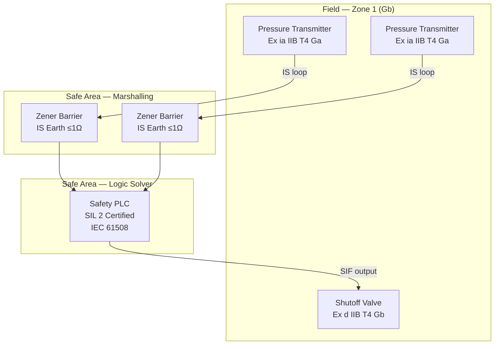
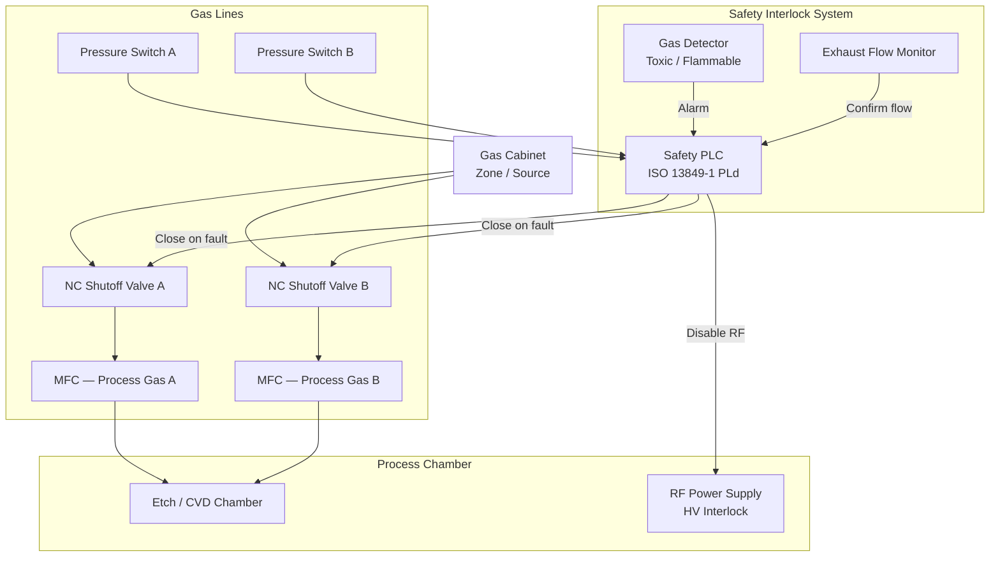

# Phase 11: Industry Overlay Depth — Implementation Plan

> **For Claude:** REQUIRED SUB-SKILL: Use superpowers:executing-plans to implement this plan task-by-task.

**Goal:** Deepen the Petroleum/O&G and Semiconductor industry pages from thin stubs to full reference pages, and add two new scenario pages (onshore O&G process skid and etch/CVD fab tool).

**Architecture:** Jekyll Markdown pages only — no new RAG corpus files, no JS. All backing standards content already exists in the corpus. Follow the style of existing scenario pages (see `docs/scenarios/process-skid/index.md` and `docs/scenarios/semiconductor-equipment/index.md` for reference).

**Tech Stack:** Jekyll 4.3, Markdown, Liquid, Mermaid.js CDN (already loaded in default layout).

---

### Task 1: Deepen Petroleum / Oil & Gas industry page

**Files:**
- Modify: `docs/industries/petroleum/index.md` (replace entirely)

**Step 1: Write the file**

Replace the full contents of `docs/industries/petroleum/index.md` with:

```markdown
---
layout: default
title: "Petroleum / Oil and Gas Industry Standards Overlay"
description: "Standards path for oil and gas onshore facilities: IEC 61511 SIS, IEC 60079 hazardous area, NEC 500–505, IEC 60204-1."
breadcrumb:
  - name: "Industries"
    url: "/industries/"
  - name: "Petroleum"
related_standards:
  - name: "IEC 61511"
    url: "/standards/functional-safety/iec-61511/"
  - name: "IEC 61508"
    url: "/standards/functional-safety/iec-61508/"
  - name: "IEC 60079"
    url: "/standards/hazardous-area/iec-60079/"
  - name: "NEC (Art. 500–505)"
    url: "/standards/us-electrical/nec/"
---

<div class="page-header">
  <span class="page-header__label">Industry Overlay — Petroleum / Oil and Gas</span>
  <h1>Petroleum and Oil and Gas Standards</h1>
  <span class="badge badge--complete">Phase 11 — Corpus Complete</span>
</div>

## Industry Profile

| Field | Value |
|-------|-------|
| **Industry** | Petroleum, oil and gas — onshore upstream / midstream / downstream |
| **Typical systems** | ESD, F&G, HIPPS, wellhead control, pipeline control, compressor control |
| **Markets** | US, international |
| **Special concerns** | Hazardous areas (Ex), Safety Instrumented Systems (SIS), process safety management |

---

## Standards Applicability by Project Phase

| Phase | Standards | Purpose |
|-------|-----------|---------|
| **Concept / HAZOP** | IEC 61511 §5–6, ISO 12100 | Hazard identification, consequence assessment |
| **SIL Determination** | IEC 61511 §9 (LOPA), IEC 61508 | Determine required SIL for each SIF |
| **SIS Design** | IEC 61511 §10–11, IEC 61508 Part 2/3 | Logic solver selection, SIF architecture, PFDavg calculation |
| **Ex Equipment Selection** | IEC 60079-0, IEC 60079-10-1, IEC 60079-11 | Zone classification, EPL/T-code selection, IS barrier sizing |
| **Electrical Design** | IEC 60204-1, NEC Art. 500/504/505 | Machine electrical, US hazardous location wiring |
| **Installation** | IEC 60079-14, NEC Art. 300/250 | Cable selection, IS segregation, equipotential bonding |
| **Commissioning** | IEC 61511 §12, IEC 60079-14 §6 | SIS FAT/SAT, Ex installation initial verification |
| **Maintenance** | IEC 61511 §16 (proof testing), IEC 60079-17 | Periodic SIF proof tests, Ex inspection regime |

---

## Standards Selection Flow

```
Is the installation in a hazardous area (flammable gas/vapor)?
  YES → Classify zones per IEC 60079-10-1
       → Select Ex equipment by EPL, gas group, T-code (IEC 60079-0)
       → US installation: NEC Art. 505 (Zone) or Art. 500 (Division)
       → IS field devices: IEC 60079-11 + entity parameter check

Does the process have a credible loss-of-containment hazard?
  YES → Perform HAZOP (IEC 61511 §5)
       → Determine if a Safety Instrumented Function (SIF) is required
       → Run LOPA to establish SIL target
       → Design SIF per IEC 61511 §10

Is the SIL target ≥ SIL 3, or is the logic solver a custom design?
  YES → Apply IEC 61508 directly for logic solver development
  NO  → IEC 61511 reference to IEC 61508 is sufficient
```

---

## Standards Path Summary

| Category | Standards | Corpus Status |
|----------|-----------|---------------|
| US electrical installation | NEC Art. 240, 250, 300, 500, 504, 505 | <span class="badge badge--complete">Complete</span> |
| Machine electrical design | IEC 60204-1 | <span class="badge badge--complete">Complete</span> |
| Process safety (SIS) | IEC 61511 | <span class="badge badge--complete">Complete</span> |
| SIS foundation | IEC 61508 | <span class="badge badge--complete">Complete</span> |
| Hazardous area equipment | IEC 60079 (6 parts) | <span class="badge badge--complete">Complete</span> |
| API standards | API 14C, API 670 | Not in corpus |

---

## Key Engineering Decisions for O&G

**Zone vs. Division classification:**
IEC Zone (Art. 505) is preferred when using ATEX/IECEx certified equipment. NEC Division (Art. 500) is used on legacy US installations. Both are legally valid in the US — verify with AHJ.

**Zener barrier vs. galvanic isolator:**
Use zener barriers where a dedicated IS earth ≤1 Ω is available and galvanic isolation is not needed. Use galvanic isolators where multiple ground loops cause measurement errors or where the field device is floating. See [IEC 60079-11]({{ '/standards/hazardous-area/iec-60079/' | relative_url }}).

**SIL 2 vs. SIL 3 architecture:**
SIL 2 SIFs can typically be achieved with 1oo2 or 2oo3 voted architectures using proven-in-use devices. SIL 3 generally requires 1oo2D or 2oo3 with hardware fault tolerance ≥2 and full IEC 61508 application for the logic solver.

---

## Pre-Commissioning Compliance Checklist

- [ ] Area classification drawing current, signed, and revision-controlled
- [ ] All Ex equipment certificates verified against IECEx/ATEX database (not just nameplate)
- [ ] EPL, gas group, and T-code verified for each Ex device
- [ ] IS entity parameters calculated and documented for every IS loop
- [ ] IS earth resistance measured and confirmed ≤1 Ω (zener barrier loops)
- [ ] Equipotential bonding verified on all metallic structures
- [ ] SIS FAT completed with witnessed proof tests for each SIF
- [ ] SIL verification report completed and accepted
- [ ] Proof test procedures written and approved (per IEC 61511 §16)
- [ ] Ex installation initial verification certificate issued (IEC 60079-14 §6)

---

<a href="{{ '/scenarios/oil-gas-process-skid/' | relative_url }}" class="card__link">See Oil &amp; Gas Process Skid scenario &rarr;</a>

<a href="{{ '/industries/' | relative_url }}" class="card__link">&larr; Industry matrix</a>
```

**Step 2: Verify build**

```bash
cd "/Users/kyawminthu/Dev/Control System Tools/docs" && ~/.gem/ruby/2.6.0/bin/bundle exec jekyll build 2>&1 | tail -3
```
Expected: clean build, no errors.

**Step 3: Commit**

```bash
git add docs/industries/petroleum/index.md
git commit -m "feat(industry): deepen petroleum/O&G industry page — standards matrix, selection flow, checklist"
```

---

### Task 2: Create Oil & Gas Process Skid scenario page

**Files:**
- Create: `docs/scenarios/oil-gas-process-skid/index.md`

**Step 1: Create directory and file**

```bash
mkdir -p "docs/scenarios/oil-gas-process-skid"
```

Write `docs/scenarios/oil-gas-process-skid/index.md`:

```markdown
---
layout: default
title: "Scenario 07 — Oil & Gas Onshore Process Skid (ESD / F&G)"
description: "Standards design workflow for an onshore O&G process skid with ESD, F&G, and HIPPS: IEC 61511, IEC 60079, NEC Art. 500–505."
breadcrumb:
  - name: "Scenarios"
    url: "/scenarios/"
  - name: "O&G Process Skid"
related_standards:
  - name: "IEC 61511"
    url: "/standards/functional-safety/iec-61511/"
  - name: "IEC 61508"
    url: "/standards/functional-safety/iec-61508/"
  - name: "IEC 60079"
    url: "/standards/hazardous-area/iec-60079/"
  - name: "NEC (Art. 500–505)"
    url: "/standards/us-electrical/nec/"
  - name: "IEC 60204-1"
    url: "/standards/machinery/iec-60204-1/"
industries:
  - name: "Petroleum"
    slug: "petroleum/"
---

<div class="page-header">
  <span class="page-header__label">Scenario 07</span>
  <h1>Oil &amp; Gas Onshore Process Skid — ESD / F&amp;G / HIPPS</h1>
  <span class="badge badge--complete">Corpus Complete — Phase 11</span>
</div>

## Project Summary

| Field | Detail |
|-------|--------|
| **Application** | Onshore O&G process skid with Emergency Shutdown (ESD), Fire & Gas (F&G), and High Integrity Pressure Protection (HIPPS) |
| **Industry** | Petroleum / Oil and Gas — upstream or midstream onshore |
| **Safety standard** | IEC 61511 (SIS application) + IEC 61508 (foundation) |
| **Hazardous area** | Zone 1 / Zone 2 gas atmosphere — IEC 60079 series |
| **US installation** | NEC Art. 500–505 (hazardous locations) |

---

## Standard Stack

| Standard | Role |
|----------|------|
| **IEC 61511** | SIS application lifecycle — HAZOP through proof testing |
| **IEC 61508** | Logic solver qualification foundation |
| **IEC 60079-0** | Ex equipment marking and selection |
| **IEC 60079-10-1** | Hazardous area zone classification |
| **IEC 60079-11** | Intrinsic safety for field instruments |
| **IEC 60079-14** | Ex installation design and verification |
| **IEC 60079-17** | Ex inspection and maintenance |
| **IEC 60204-1** | Electrical equipment of the skid |
| **NEC Art. 500 / 504 / 505** | US hazardous location wiring |
| **NEC Art. 250** | Grounding and bonding |

---

## Design Workflow

### Phase 1 — Hazard Analysis and SIL Determination

```
Step 1: HAZOP
  - Identify process deviations (high pressure, low flow, leak)
  - Assign consequence severity to each deviation
  - Record IPLs (PRVs, operator response, BPCS) already in place

Step 2: LOPA (IEC 61511 §9)
  - For each intolerable consequence: calculate residual risk after IPLs
  - Determine if a SIF is required and what SIL target it must meet
  - SIL 1: PFDavg 0.1–0.01  |  SIL 2: 0.01–0.001  |  SIL 3: 0.001–0.0001

Step 3: Safety Requirements Specification (SRS)
  - Document each SIF: process demand, safe state, response time, SIL target
  - Specify logic solver inputs/outputs, field device requirements
```

### Phase 2 — SIS and Ex Equipment Design

```
Step 4: SIF Architecture Selection
  - SIL 1: 1oo1 often sufficient; verify PFDavg with reliability data
  - SIL 2: 1oo2 or 2oo3 voted — choose based on safe failure fraction (SFF)
  - SIL 3: 1oo2D or 2oo3 with HFT ≥ 2; logic solver must be IEC 61508 certified

Step 5: PFDavg Verification
  - Calculate PFDavg for each SIF architecture using supplier λSD/λSU data
  - Include proof test interval (PTI) — longer PTI increases PFDavg
  - Confirm PFDavg falls within required SIL band

Step 6: Zone Classification (IEC 60079-10-1)
  - Identify all release sources on the skid
  - Assign grade of release (continuous / primary / secondary)
  - Assess ventilation, determine zone extents
  - Produce classified area drawing

Step 7: Ex Equipment Selection (IEC 60079-0)
  - Match EPL to zone: Gb → Zone 1, Gc → Zone 2
  - Match gas group: IIA / IIB / IIC per process fluid
  - Match T-code: T-code max surface temp < autoignition temp of gas (with margin)
  - For IS field devices: select ia level for Zone 0/1

Step 8: IS Loop Design (IEC 60079-11)
  - For each IS field device: select zener barrier or galvanic isolator
  - Verify entity parameters: Uo ≤ Ui, Io ≤ Ii, Ci + Ccable ≤ Co, Li + Lcable ≤ Lo
  - Document IS loop calculation sheet for each loop
```

### Phase 3 — Installation and Commissioning

```
Step 9: Installation per IEC 60079-14
  - IS cables on separate trays / conduits from non-IS wiring
  - IS earth point: resistance ≤ 1 Ω (zener barrier circuits)
  - Equipotential bonding: all metallic structures bonded
  - Cable glands: Ex d certified, correct for cable type and gas group

Step 10: Initial Verification (IEC 60079-14 §6)
  - Verify all certificates are current and correct
  - Inspect flame paths (Ex d), IS earth resistance, entity compliance
  - Issue commissioning certificate

Step 11: SIS FAT / SAT (IEC 61511 §12)
  - Factory Acceptance Test: test each SIF end-to-end
  - Site Acceptance Test: repeat after installation, confirm response times
  - Witnessed proof test for each SIF before process start-up
```

---

## SIS Architecture Diagram



---

## Key Engineering Decisions

**Zener barrier vs. galvanic isolator for IS instruments:**
Zener barriers are lower cost but require a dedicated IS earth ≤1 Ω. If the IS earth cannot be guaranteed (old facility, multi-unit grounding), use galvanic isolators. Galvanic isolators also eliminate ground loops that cause 4–20 mA measurement errors in long cable runs.

**Zone 1 vs. Division 1 equipment on a US installation:**
Either classification system is legal under NEC. Zone (Art. 505) is preferred when sourcing ATEX/IECEx certified equipment — the marking system maps directly (Gb = Zone 1). Division (Art. 500) requires UL/FM listed equipment and conduit seals at every Ex d enclosure entry. For new installations, Zone is generally more efficient.

**SIL 2 logic solver selection:**
Avoid using a standard PLC for SIL 2 — it requires a full IEC 61508 assessment of the PLC hardware and software. Use a safety-certified logic solver (e.g., SIL 2 certified SIS controller) where the supplier provides the IEC 61508 certificate and safety manual.

---

<a href="{{ '/industries/petroleum/' | relative_url }}" class="card__link">See Petroleum / O&amp;G industry overlay &rarr;</a>

<a href="{{ '/scenarios/' | relative_url }}" class="card__link">&larr; All scenarios</a>
```

**Step 2: Verify build**

```bash
cd "/Users/kyawminthu/Dev/Control System Tools/docs" && ~/.gem/ruby/2.6.0/bin/bundle exec jekyll build 2>&1 | tail -3
```

**Step 3: Commit**

```bash
git add docs/scenarios/oil-gas-process-skid/
git commit -m "feat(scenario): add Scenario 07 — O&G onshore process skid (ESD/F&G/HIPPS)"
```

---

### Task 3: Deepen Semiconductor industry page

**Files:**
- Modify: `docs/industries/semiconductor/index.md` (replace entirely)

**Step 1: Write the file**

Replace the full contents of `docs/industries/semiconductor/index.md` with:

```markdown
---
layout: default
title: "Semiconductor Industry Standards Overlay"
description: "Standards path for semiconductor fab equipment: SEMI S2/S8/S14, IEC 60204-1, ISO 12100, NFPA 79, IEC 62443."
breadcrumb:
  - name: "Industries"
    url: "/industries/"
  - name: "Semiconductor"
related_standards:
  - name: "SEMI S2/S8/S14"
    url: "/standards/semiconductor/semi/"
  - name: "IEC 60204-1"
    url: "/standards/machinery/iec-60204-1/"
  - name: "ISO 12100"
    url: "/standards/functional-safety/iso-12100/"
  - name: "IEC 62443"
    url: "/standards/cybersecurity/iec-62443/"
---

<div class="page-header">
  <span class="page-header__label">Industry Overlay — Semiconductor</span>
  <h1>Semiconductor Equipment Standards</h1>
  <span class="badge badge--complete">Phase 11 — SEMI Corpus Complete</span>
</div>

## Industry Profile

| Field | Value |
|-------|-------|
| **Industry** | Semiconductor fab equipment (process tools, metrology, handlers) |
| **Typical tools** | Etch, CVD, PVD, CMP, diffusion, implant, metrology, wafer handlers |
| **Markets** | US fabs + EU fabs + Asian fabs (global installation) |
| **Special concerns** | Flammable/toxic process gases, cleanroom EMC, SEMI qualification requirements, automated host interface |

---

## Standards Applicability by Project Phase

| Phase | Standards | Purpose |
|-------|-----------|---------|
| **Tool Design** | ISO 12100, SEMI S2 §4–6, SEMI S14 | Risk assessment, interlock architecture, fire risk evaluation |
| **Electrical Build** | IEC 60204-1, NFPA 79, UL 508A | Machine electrical design, US electrical compliance, panel listing |
| **Ergonomics Review** | SEMI S8 | Control placement, force limits, maintenance access |
| **Fab Qualification** | SEMI S2 (full), SEMI S8, SEMI S14 | EH&S review, SEMI compliance checklist |
| **Installation** | NEC, IEC 60204-1 §8 | Facility connection, equipotential bonding |
| **Networked Operation** | IEC 62443 | Cybersecurity for fab host interface and remote diagnostics |
| **Periodic Inspection** | SEMI S2 §15 | Interlock function verification, LOTO procedure audit |

---

## Standards Selection Flow

```
Is the tool for a US fab?
  YES → NFPA 79 (machine electrical) + NEC (installation) + UL 508A (panel listing)
  NO  → IEC 60204-1 (machine electrical)
  BOTH → Apply NFPA 79 and IEC 60204-1 in parallel (most global tools)

Does the tool use flammable or toxic process gases?
  YES → SEMI S14 fire risk assessment required
       → NC shutoff valves on all gas lines
       → Exhaust flow monitoring interlock
       → Gas detector integration with automatic shutoff

Does the tool have high-voltage circuits (>50 V AC or >120 V DC)?
  YES → SEMI S2: interlocks must de-energize before panel access
       → Stored energy: capacitors must discharge to <50 V within 5 s of isolation
       → All energy isolation points must accept a padlock (LOTO)

Is the tool connected to fab host or remote network?
  YES → IEC 62443: apply appropriate Security Level (SL-T) based on risk
       → Segment tool network from process control network (conduit model)
```

---

## Standards Path Summary

| Category | Standards | Corpus Status |
|----------|-----------|---------------|
| Risk assessment | ISO 12100 | <span class="badge badge--complete">Complete</span> |
| Safety functions | ISO 13849-1 (PLd typical for tools) | <span class="badge badge--complete">Complete</span> |
| Machine electrical (international) | IEC 60204-1 | <span class="badge badge--complete">Complete</span> |
| US electrical | NEC, NFPA 79, UL 508A | <span class="badge badge--complete">Complete</span> |
| Semiconductor-specific | SEMI S2, S8, S14 | <span class="badge badge--complete">Complete</span> |
| Cybersecurity | IEC 62443 | <span class="badge badge--complete">Complete</span> |
| Fab fire code | NFPA 318 | Not in corpus |

---

## Key Engineering Decisions for Semiconductor Tools

**Capacitor discharge interlock design (SEMI S2):**
High-voltage power supplies (RF generators, ion implant supplies) store significant energy. The interlock must either: (a) discharge capacitors to <50 V within 5 seconds of isolation, OR (b) provide a discharge indicator visible at the access point AND an access interlock that prevents opening until discharge is confirmed. Option (b) is safer and easier to verify during qualification.

**Single-point ground vs. equipotential bonding:**
RF-intensive tools (etch, CVD) require single-point grounding to prevent RF ground loops. Equipotential bonding per IEC 60204-1 §8 must still be maintained for safety — achieve both by designing the safety ground and signal ground as a star topology meeting at one point.

**SEMI S2 interlock independence:**
S2 requires that safety interlocks be independent of the process control system where a single failure could cause injury. In practice: use a dedicated safety relay or safety PLC for personnel protection interlocks (door interlocks, E-stops, gas shutoffs), separate from the process recipe controller.

---

## SEMI S2 Compliance Flow

```
1. ISO 12100 risk assessment → identify all hazards
2. For each hazard: determine required risk reduction (PL per ISO 13849-1)
3. SEMI S2 electrical safety:
   - Ground all accessible conductive surfaces
   - Interlock all HV panels (de-energize before opening)
   - LOTO: one padlock per energy isolation point
   - Capacitor discharge: <50 V within 5 s
4. SEMI S14 fire risk assessment:
   - Identify all flammable/pyrophoric materials
   - Automatic shutoff on fire detection
   - Independent over-temperature cutout on all heater circuits
5. SEMI S8 ergonomics review:
   - E-stop: 600–1400 mm height, ≤40 N force
   - Maintenance access: 600 mm wide × 900 mm high minimum
6. Documentation package: interlock list, schematic, LOTO procedure, HazMat inventory
```

---

<a href="{{ '/scenarios/semiconductor-fab-tool/' | relative_url }}" class="card__link">See Semiconductor Fab Tool scenario &rarr;</a>

<a href="{{ '/scenarios/semiconductor-equipment/' | relative_url }}" class="card__link">See Semiconductor Equipment Compliance scenario &rarr;</a>

<a href="{{ '/industries/' | relative_url }}" class="card__link">&larr; Industry matrix</a>
```

**Step 2: Verify build**

```bash
cd "/Users/kyawminthu/Dev/Control System Tools/docs" && ~/.gem/ruby/2.6.0/bin/bundle exec jekyll build 2>&1 | tail -3
```

**Step 3: Commit**

```bash
git add docs/industries/semiconductor/index.md
git commit -m "feat(industry): deepen semiconductor industry page — standards matrix, SEMI flow, checklist"
```

---

### Task 4: Create Semiconductor Fab Tool scenario page

**Files:**
- Create: `docs/scenarios/semiconductor-fab-tool/index.md`

**Step 1: Create directory and file**

```bash
mkdir -p "docs/scenarios/semiconductor-fab-tool"
```

Write `docs/scenarios/semiconductor-fab-tool/index.md`:

```markdown
---
layout: default
title: "Scenario 08 — Semiconductor Fab Tool (Etch / CVD)"
description: "Standards design workflow for an etch or CVD process tool: SEMI S2/S8/S14, IEC 60204-1, ISO 12100, NFPA 79, IEC 62443."
breadcrumb:
  - name: "Scenarios"
    url: "/scenarios/"
  - name: "Semiconductor Fab Tool"
related_standards:
  - name: "SEMI S2/S8/S14"
    url: "/standards/semiconductor/semi/"
  - name: "IEC 60204-1"
    url: "/standards/machinery/iec-60204-1/"
  - name: "ISO 12100"
    url: "/standards/functional-safety/iso-12100/"
  - name: "NFPA 79"
    url: "/standards/us-electrical/nfpa-79/"
  - name: "IEC 62443"
    url: "/standards/cybersecurity/iec-62443/"
industries:
  - name: "Semiconductor"
    slug: "semiconductor/"
---

<div class="page-header">
  <span class="page-header__label">Scenario 08</span>
  <h1>Semiconductor Fab Tool — Etch / CVD Process Equipment</h1>
  <span class="badge badge--complete">SEMI Corpus Complete — Phase 11</span>
</div>

## Project Summary

| Field | Detail |
|-------|--------|
| **Application** | Etch or CVD process tool with flammable/toxic process gases, RF power supply, gas cabinet |
| **Industry** | Semiconductor manufacturing fab |
| **Primary standards** | SEMI S2 + S8 + S14 + IEC 60204-1 + ISO 12100 |
| **US electrical** | NFPA 79 + NEC + UL 508A |
| **Unique hazards** | Toxic/flammable process gases, RF energy, high-voltage plasma supply, cleanroom fire risk |

---

## Standard Stack

| Standard | Role |
|----------|------|
| **ISO 12100** | Risk assessment foundation |
| **ISO 13849-1** | Safety function performance level (PLd typical for tool interlocks) |
| **SEMI S2** | Equipment EH&S — electrical safety, LOTO, interlock design, chemical safety |
| **SEMI S8** | Ergonomics — control placement, maintenance access, force limits |
| **SEMI S14** | Fire risk assessment — gas shutoff, detection, suppression |
| **IEC 60204-1** | Machine electrical equipment design |
| **NFPA 79** | US machine electrical (required by most US fabs alongside IEC 60204-1) |
| **NEC** | US facility installation |
| **UL 508A** | US control panel listing |
| **IEC 62443** | Cybersecurity for fab host interface |

---

## Design Workflow

### Phase 1 — Risk Assessment and Safety Architecture

```
Step 1: ISO 12100 Risk Assessment
  - Identify all hazard sources: RF, HV, flammable gas, toxic gas, hot surfaces,
    rotating parts, pinch points in wafer handling
  - Estimate risk (severity × probability) for each hazard
  - Determine required risk reduction — most personnel hazards target PLd

Step 2: Interlock Architecture (SEMI S2 + ISO 13849-1)
  - Map each hazard to a safety function (door interlock, E-stop, gas shutoff, HV interlock)
  - Select safety relay or safety PLC for interlocks independent of process control
  - Interlocks must fail to safe state (de-energize, close valves, stop motion)
  - Manual reset required after any safety interlock actuation

Step 3: SEMI S14 Fire Risk Assessment
  - List all flammable and pyrophoric gas lines
  - Identify ignition sources: electrical arcs, hot surfaces, RF sparking
  - Define fire scenarios: credible combination of fuel, ignition, oxidizer
  - Determine required: automatic shutoff, detection type, clean agent suppression
```

### Phase 2 — Electrical Design

```
Step 4: IEC 60204-1 / NFPA 79 Electrical Design
  - Power distribution: main disconnect, branch circuit protection, transformer isolation
  - Control circuit: 24 VDC safety bus separated from process control bus
  - E-stop circuit: dual-channel, NC contacts, monitored (Category 3 / PLd minimum)
  - All exposed conductive parts grounded; equipotential bonding per IEC 60204-1 §8

Step 5: High-Voltage Interlock Design (SEMI S2)
  - RF generator and bias supply: door interlock de-energizes RF before panel opens
  - Interlock: hardwired, not software-only; must be Category 3 minimum
  - Capacitor bank: discharge to <50 V within 5 s of HV isolation
     OR: discharge indicator + access interlock

Step 6: Gas Control System Design (SEMI S2 + S14)
  - All toxic and flammable gas lines: normally-closed pneumatic shutoff valves
  - Pressure switch per line: detects line break, triggers automatic shutoff
  - Exhaust flow monitoring: exhaust confirmed before any process gas flow allowed
  - Gas detector(s): concentration alarm triggers shutoff + exhaust increase + alert
```

### Phase 3 — Ergonomics and Documentation

```
Step 7: SEMI S8 Ergonomics Review
  - E-stop placement: 600–1400 mm from floor, ≤40 N actuation force
  - Operator panel: within normal visual field, no glare, text legible at 600 mm
  - Maintenance access: field-replaceable items accessible without removing unrelated parts
  - Minimum access clearance: 600 mm wide × 900 mm high

Step 8: Documentation Package
  - Electrical schematic (single-line + control circuit)
  - Safety interlock list (each interlock: type, input, output, safe state, reset)
  - LOTO procedure (one padlock per isolation point, posted on tool)
  - Hazardous materials inventory (gases, chemicals, quantities)
  - Fire risk assessment report (SEMI S14)
  - Installation and utilities requirements
```

### Phase 4 — Fab Qualification

```
Step 9: SEMI S2 EH&S Review
  - Fab EH&S team reviews documentation package
  - Tool walkthrough: verify all interlocks, LOTO points, labels, E-stops
  - Witness interlock functional tests: door interlocks, E-stop, gas shutoff on alarm

Step 10: IEC 62443 Cybersecurity Assessment (if networked)
  - Identify tool interfaces: fab host (SECS/GEM), remote diagnostics, maintenance port
  - Define security zone boundary and conduit to fab network
  - Apply appropriate SL-T (typically SL 1–2 for process tools)
  - Harden: disable unused ports, enforce authentication, log events
```

---

## Gas Delivery Control System



---

## Key Engineering Decisions

**Capacitor discharge: 5-second rule vs. interlock approach (SEMI S2):**
The 5-second discharge is cleanest — use a bleed resistor across the capacitor bank. If the time constant makes 5 seconds impractical (large bank, high voltage), use a discharge indicator (a panel-mounted meter showing capacitor voltage) plus a proximity interlock that prevents panel opening until the meter reads <50 V. The meter must be readable without opening the panel.

**RF interlock vs. RF generator software disable:**
RF must be disabled by a hardwired interlock before any panel opens — not by the recipe software. The generator must have a hardware enable input that the safety relay drives. Recipe-level RF off is insufficient for personnel protection.

**Clean agent suppression in the tool enclosure:**
If the SEMI S14 fire risk assessment determines suppression is required, use FM-200 or Novec 1230 (water is prohibited in cleanrooms). The suppression system must interface with the facility fire alarm — actuation must trigger a facility alarm even if the agent was discharged locally.

---

<a href="{{ '/industries/semiconductor/' | relative_url }}" class="card__link">See Semiconductor industry overlay &rarr;</a>

<a href="{{ '/scenarios/semiconductor-equipment/' | relative_url }}" class="card__link">See 15-Standard Compliance Stack scenario &rarr;</a>

<a href="{{ '/scenarios/' | relative_url }}" class="card__link">&larr; All scenarios</a>
```

**Step 2: Verify build**

```bash
cd "/Users/kyawminthu/Dev/Control System Tools/docs" && ~/.gem/ruby/2.6.0/bin/bundle exec jekyll build 2>&1 | tail -3
```

**Step 3: Commit**

```bash
git add docs/scenarios/semiconductor-fab-tool/
git commit -m "feat(scenario): add Scenario 08 — semiconductor fab tool (etch/CVD)"
```

---

### Task 5: Update scenarios index and sidebar

**Files:**
- Modify: `docs/scenarios/index.md`
- Modify: `docs/_includes/sidebar.html`

**Step 1: Update scenarios index**

In `docs/scenarios/index.md`, find the closing `</div>` of the scenario-grid and add two new cards before it:

```html
  <div class="scenario-card">
    <span class="scenario-card__num">Scenario 07</span>
    <span class="scenario-card__title">O&amp;G Onshore Process Skid (ESD / F&amp;G)</span>
    <p class="scenario-card__start"><strong>Start:</strong> IEC 61511 + IEC 60079 + NEC Art. 500–505</p>
    <a href="{{ '/scenarios/oil-gas-process-skid/' | relative_url }}" style="font-size:0.8rem;">Open scenario &rarr;</a>
  </div>
  <div class="scenario-card">
    <span class="scenario-card__num">Scenario 08</span>
    <span class="scenario-card__title">Semiconductor Fab Tool (Etch / CVD)</span>
    <p class="scenario-card__start"><strong>Start:</strong> SEMI S2/S8/S14 + IEC 60204-1 + ISO 12100</p>
    <a href="{{ '/scenarios/semiconductor-fab-tool/' | relative_url }}" style="font-size:0.8rem;">Open scenario &rarr;</a>
  </div>
```

**Step 2: Update sidebar**

In `docs/_includes/sidebar.html`, find the Scenarios section. After the existing `semiconductor-equipment` link, add:

```html
      <li><a href="{{ '/scenarios/oil-gas-process-skid/' | relative_url }}" class="sub">O&amp;G Process Skid</a></li>
      <li><a href="{{ '/scenarios/semiconductor-fab-tool/' | relative_url }}" class="sub">Semiconductor Fab Tool</a></li>
```

**Step 3: Verify build — confirm page count increases by 2**

```bash
cd "/Users/kyawminthu/Dev/Control System Tools/docs" && ~/.gem/ruby/2.6.0/bin/bundle exec jekyll build 2>&1 | tail -3
```

**Step 4: Commit**

```bash
git add docs/scenarios/index.md docs/_includes/sidebar.html
git commit -m "feat(nav): add Scenario 07 and 08 to scenarios index and sidebar"
```

---

### Task 6: Update project state and push

**Files:**
- Modify: `project_state/project_state.md`
- Modify: `project_state/change_log.md`

**Step 1: Update project_state.md**

After the Phase 10 COMPLETE block, add:

```markdown
## Phase 11 Scope — Industry Overlay Depth — COMPLETE

### Petroleum / Oil & Gas
- [x] `docs/industries/petroleum/index.md` — deepened: standards matrix by phase, selection flow, checklist, all gap badges removed
- [x] `docs/scenarios/oil-gas-process-skid/index.md` — Scenario 07: ESD/F&G/HIPPS onshore skid

### Semiconductor
- [x] `docs/industries/semiconductor/index.md` — deepened: standards matrix by phase, SEMI S2 flow, all SEMI badges updated
- [x] `docs/scenarios/semiconductor-fab-tool/index.md` — Scenario 08: etch/CVD tool with gas control, HV interlocks

### Nav
- [x] `docs/scenarios/index.md` — Scenario 07 and 08 cards added
- [x] `docs/_includes/sidebar.html` — both new scenarios added
```

Update the Current Phase header to "Phase 11 COMPLETE".

**Step 2: Add change_log.md entry**

```markdown
### 2026-03-08 — Phase 11 Complete: Industry Overlay Depth

- `docs/industries/petroleum/index.md` — full reference page: standards matrix by phase, selection flow, checklist; all gap badges removed
- `docs/industries/semiconductor/index.md` — full reference page: SEMI badges updated to complete, applicability matrix, SEMI S2 compliance flow
- `docs/scenarios/oil-gas-process-skid/index.md` — Scenario 07: onshore O&G ESD/F&G/HIPPS with IEC 61511 + IEC 60079 + NEC workflow, Mermaid SIS diagram, engineering decisions
- `docs/scenarios/semiconductor-fab-tool/index.md` — Scenario 08: etch/CVD fab tool with SEMI S2/S14 gas control system, Mermaid interlock diagram, engineering decisions
- Scenarios index and sidebar updated with new entries
```

**Step 3: Final build + commit + push**

```bash
cd "/Users/kyawminthu/Dev/Control System Tools/docs" && ~/.gem/ruby/2.6.0/bin/bundle exec jekyll build 2>&1 | tail -3
cd "/Users/kyawminthu/Dev/Control System Tools" && git add project_state/ && git commit -m "chore(state): mark Phase 11 complete — industry overlay depth" && git push
```
