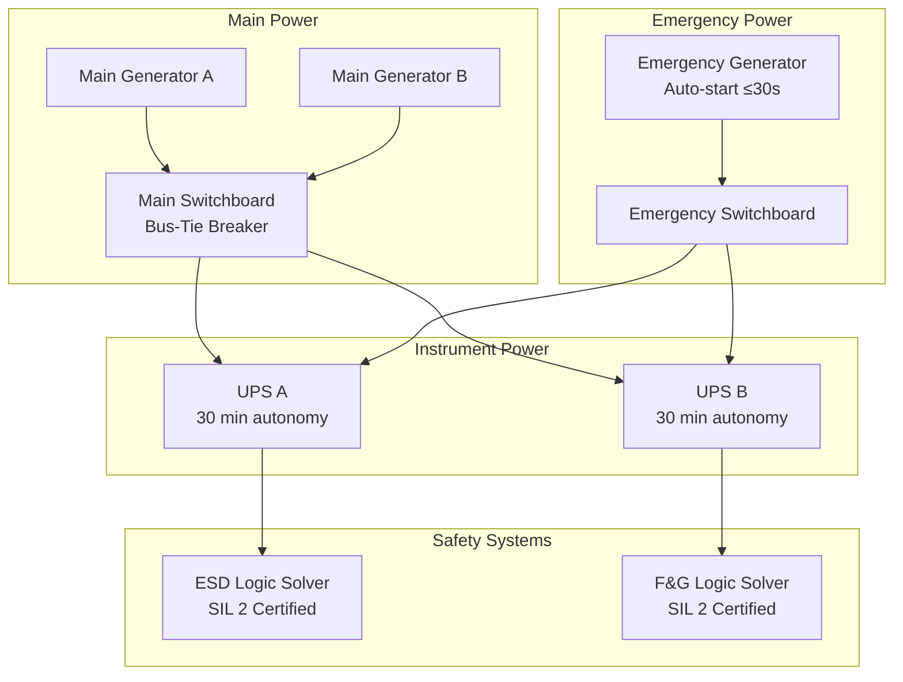

# Phase 12: Offshore / Marine Industry Overlay — Implementation Plan

> **For Claude:** REQUIRED SUB-SKILL: Use superpowers:executing-plans to implement this plan task-by-task.

**Goal:** Add offshore and marine control-systems coverage: two RAG corpus modules (DNV-OS-D201, ABS offshore), deepen the offshore and marine industry pages, and add Scenario 09 (offshore platform ESD/F&G).

**Architecture:** Two RAG corpus modules first (prerequisite), then three site pages (offshore industry, marine industry, Scenario 09), then nav/sidebar/project-state update. All content follows the established RAG pattern (HTML metadata block + numbered sections + change log) and site pattern (Jekyll Markdown + Mermaid + front matter). No new JS or CSS needed.

**Tech Stack:** Jekyll 4.3, Markdown, Liquid, Mermaid.js CDN (already loaded). RAG corpus: plain Markdown with HTML metadata header.

**Reference files:**
- RAG module format: `control-standards/rag/standards_intelligence/international/hazardous_area/iec_60079/IEC60079_0__general_requirements.md`
- RAG index format: `control-standards/rag/standards_intelligence/international/hazardous_area/iec_60079/_index.yaml`
- Industry page format: `docs/industries/petroleum/index.md`
- Scenario page format: `docs/scenarios/oil-gas-process-skid/index.md`

---

### Task 1: DNV-OS-D201 RAG corpus module

**Files:**
- Create: `control-standards/rag/standards_intelligence/international/offshore/DNV_OS_D201__electrical_installations.md`

**Step 1: Create directory and write file**

```bash
mkdir -p "/Users/kyawminthu/Dev/Control System Tools/control-standards/rag/standards_intelligence/international/offshore"
```

Write the file with this exact content:

```markdown
<!--
CONTENT_CLASS: RAG_APPROVED
AI_READ_ACCESS: ALLOWED
STATUS: DRAFT

STANDARD_FAMILY: DNV_OFFSHORE
STANDARD_ID: DNV-OS-D201
EDITION: 2023

DNV_HIERARCHY:
  document: "DNV-OS-D201"
  document_title: "Electrical Installations — Offshore and Floating Units"

INDEX_TAGS:
  topics: ["marine_grade", "power_redundancy", "hazardous_area", "emergency_power", "ESD", "fire_and_gas", "DP_class", "IEC_60092"]
  systems: ["offshore_platform", "FPSO", "ESD", "fire_and_gas", "dynamic_positioning"]
-->

# DNV-OS-D201 — Electrical Installations: Offshore and Floating Units

## 0. Why this matters for control engineers

DNV-OS-D201 is the primary DNV standard governing electrical installations on offshore platforms, FPSOs, and floating production units. For control engineers, it defines: (1) marine-grade equipment requirements that exceed onshore specifications, (2) power redundancy classes that affect UPS sizing and distribution architecture, (3) the interface between the electrical installation and the safety systems (ESD, F&G), and (4) the class society approval process that must be integrated into the engineering workflow from the outset.

Every electrical and control system installed on a DNV-classed offshore unit must be designed, documented, and approved in accordance with this offshore standard — not IEC 60204-1 or NEC alone.

## 1. Scope and applicability

DNV-OS-D201 applies to:
- Mobile offshore drilling units (MODUs)
- Floating production, storage, and offloading units (FPSOs)
- Offshore fixed and floating platforms (where DNV is the classification society)
- Semi-submersibles and jackups

For control and instrumentation engineers, the relevant sections are:
- Section 2 — Electrical power systems (redundancy, UPS, emergency power)
- Section 4 — Hazardous area electrical equipment
- Section 6 — Control and monitoring systems
- Section 7 — Safety systems (ESD, F&G interface)

## 2. Marine-grade equipment requirements

Offshore electrical and control equipment must meet environmental conditions that exceed typical onshore industrial ratings:

| Requirement | Onshore industrial | Offshore (DNV-OS-D201) |
|-------------|--------------------|------------------------|
| **Enclosure** | IP54 typical | IP56 minimum for exposed locations; IP66 for wash-down areas |
| **Vibration** | Not typically specified | Vibration tested per IEC 60068-2-6 (sinusoidal) and IEC 60068-2-64 (random) |
| **Humidity** | 85% RH typical | 95% RH, non-condensing — continuous offshore ambient |
| **Salt atmosphere** | Not required onshore | Salt mist tested per IEC 60068-2-52 for exposed equipment |
| **Cable** | PVC acceptable | Halogen-free, fire-resistant cables required throughout — LSOH (IEC 60332) |
| **Temperature** | 0–40°C typical | −20°C to +55°C ambient for topside installations; verify for specific area |

**Halogen-free cable (LSOH):** DNV-OS-D201 requires low-smoke, zero-halogen (LSOH) cables throughout the unit. PVC cables are not permitted on offshore units. This affects cable procurement, termination fittings, and cable schedule documentation.

## 3. Power system redundancy

DNV classifies offshore power systems by redundancy level. The class notation determines minimum design requirements:

| Notation | Redundancy Level | Control System Implication |
|----------|-----------------|---------------------------|
| **No notation** | Single main switchboard; no redundancy required | Basic offshore installation |
| **DP-2** | Two main power sources; no single failure shall cause loss of position | Dual bus architecture; UPS feeds each bus independently |
| **DP-3** | Three independent power sources; two fire/flood divisions | Physically segregated cable routes and switchboard rooms |

**Emergency power (Section 2.7):**
- Emergency switchboard fed from emergency generator (auto-start within 30 seconds of main power failure)
- Emergency generator capacity must cover: ESD system, F&G system, emergency lighting, HVAC for escape routes, communication systems
- UPS for ESD logic solver: battery autonomy ≥ 30 minutes at full load (verify with safety requirements specification)

**Control system power distribution:**
- Safety system (ESD, F&G logic solvers) fed from emergency bus via UPS
- Process control system may be fed from main bus via UPS (category depends on process criticality)
- Instrument buses: typically 24 VDC from regulated power supplies fed from UPS

## 4. Hazardous area electrical installations

Offshore units have extensive hazardous areas. DNV-OS-D201 Section 4 references IEC 60079 series for equipment selection and IEC 60079-14 for installation:

**Area classification on offshore units:**
- Zone 0 and Zone 1: hydrocarbon processing decks, pump rooms, compressor rooms
- Zone 2: areas adjacent to Zone 1, wellbay areas during certain operations
- Non-hazardous: control room, accommodation, auxiliary machinery room (with adequate ventilation)

**Key differences from onshore (IEC 60079-14):**
- Cable routing: LSOH cables, metallic conduit or armoured cable in Zone 1 — cable tray with armoured cable preferred
- All Ex equipment must carry valid IECEx or ATEX certificate — DNV surveyor verifies on board
- DNV performs an Ex inspection walkdown as part of class renewal — all certificates and installation records must be available on the platform

**Purged and pressurized (Ex p) enclosures:**
Offshore control rooms housing non-Ex rated panels are often maintained at positive pressure with purged/monitored air supply — classified as Ex p enclosures (IEC 60079-2). The room itself becomes the Ex p enclosure. Requires: pressure monitoring, automatic shutdown on pressure loss, alarm to operator.

## 5. Control and monitoring systems (Section 6)

DNV distinguishes three tiers of control system by their safety role:

| System Tier | Examples | DNV Requirements |
|-------------|----------|-----------------|
| **Safety systems** | ESD, F&G, HIPPS | Fail-safe, tested annually, independent of BPCS |
| **Control systems** | BPCS, DCS, SCADA | Standard industrial requirements + redundancy for critical loops |
| **Monitoring systems** | Historian, OPC, trending | No special requirements beyond marine grade |

**Independence requirement:** The ESD system must be demonstrably independent of the BPCS at the logic solver level. A single failure in the BPCS must not impair the ESD function. This is verified by DNV at FEED (front-end engineering design) stage through a functional safety assessment.

**Alarm management:** DNV requires an alarm philosophy document for all offshore process control systems. Alarm rationalisation (limiting alarm floods) is a required deliverable for class approval.

## 6. Safety systems — ESD and F&G interface

**ESD system structure (typical offshore platform):**

```
ESD Level 1 — Abandon Platform (AP)
  └─ ESD Level 2 — Emergency Shutdown (ESD): stop production, depressurize
       └─ ESD Level 3 — Process Shutdown (PSD): close wells, stop compression
            └─ ESD Level 4 — Local Shutdown: individual equipment protection
```

**DNV class notation for ESD:** Platforms may carry class notation `ESD` indicating the system has been independently assessed and meets DNV requirements. This requires:
- Cause and effect matrix reviewed and approved by DNV
- Factory acceptance test (FAT) witnessed by DNV surveyor
- Site acceptance test (SAT) on the platform
- Functional safety assessment (IEC 61511 FMEA/FTA or equivalent)

**Fire and Gas (F&G) system:**
- Gas detectors: catalytic bead or infrared, located per area classification
- Flame detectors: UV/IR combined, one-out-of-two voting typical for ESD activation
- Fire suppression: deluge (open-head sprinkler), CO₂ for enclosed machinery spaces, clean agent for control rooms
- F&G logic solver typically shares infrastructure with ESD logic solver (separate I/O modules, common hardware)

## 7. Class approval process — implications for engineering workflow

Understanding the DNV class approval timeline is essential for project planning:

| Stage | DNV Involvement | Deliverable |
|-------|----------------|-------------|
| FEED | Conceptual approval | Approval in principle (AiP) for ESD/F&G architecture |
| Detailed design | Drawing approval | Approved electrical drawings (single-line, area classification, cable schedule) |
| Procurement | Type approval check | Verify all major equipment has DNV type approval or equivalent |
| FAT | Witnessed testing | Surveyor witnesses ESD FAT, F&G FAT |
| SAT / Commissioning | On-board survey | Survey report issued; class notation confirmed |
| Annual | Audit inspection | Ex certificates current, periodic test records available |

**Engineer takeaway:** Engage DNV at FEED. Do not wait until detailed design to involve the class society — architecture changes required by DNV at detailed design stage are expensive to implement.

## 8. Change log

- 2026-03-09 — Initial draft: marine grade, power redundancy, hazardous area, ESD/F&G, class approval workflow.
```

**Step 2: Verify file exists**

```bash
ls "/Users/kyawminthu/Dev/Control System Tools/control-standards/rag/standards_intelligence/international/offshore/"
```
Expected: file present.

**Step 3: Commit**

```bash
git add control-standards/rag/standards_intelligence/international/offshore/
git commit -m "feat(rag): add DNV-OS-D201 offshore electrical installations corpus module"
```

---

### Task 2: ABS offshore electrical RAG corpus module

**Files:**
- Create: `control-standards/rag/standards_intelligence/international/offshore/ABS_offshore_electrical_control.md`

**Step 1: Write the file**

```markdown
<!--
CONTENT_CLASS: RAG_APPROVED
AI_READ_ACCESS: ALLOWED
STATUS: DRAFT

STANDARD_FAMILY: ABS_OFFSHORE
STANDARD_ID: ABS_OFFSHORE_ELECTRICAL
EDITION: 2023

ABS_HIERARCHY:
  document: "ABS Rules — Offshore Installations, Part 4"
  document_title: "Electrical Installations on Offshore Units"

INDEX_TAGS:
  topics: ["ABS_class", "marine_grade", "power_redundancy", "hazardous_area", "ESD", "F&G", "cable_requirements"]
  systems: ["offshore_platform", "FPSO", "MODU", "ESD", "fire_and_gas"]
-->

# ABS — Offshore Electrical Installations (Part 4)

## 0. Why this matters for control engineers

ABS (American Bureau of Shipping) is the primary US-headquartered classification society for offshore units. Where DNV is dominant in the North Sea, ABS is common for US Gulf of Mexico and US-flagged vessels. ABS Rules for Building and Classing Offshore Installations, Part 4, covers electrical systems in a structure parallel to DNV-OS-D201. Key differences from onshore standards: class approval authority, marine-grade requirements, and power redundancy classifications are all ABS-specific.

## 1. ABS class notations relevant to control engineers

ABS assigns class notations that describe the capabilities of safety-critical systems. Engineers must design to the notation specified in the contract:

| Notation | Meaning |
|----------|---------|
| **DP-2** | Dynamic positioning — two independent thrusters; loss of one not to cause loss of position |
| **DP-3** | Dynamic positioning — redundancy across fire/flood boundaries |
| **ESD** | Emergency shutdown system independently assessed by ABS |
| **AFLS** | Automatic fire and flooding detection and alarm system |
| **SPS** | Safety protection system — ESD + F&G integrated, ABS assessed |

## 2. Equipment approval: type approval vs. project-specific approval

ABS maintains a list of type-approved equipment. Using type-approved equipment streamlines class approval:

**Type-approved equipment:**
- Listed in ABS type approval database
- Certificate valid for 3–5 years (varies by equipment type)
- Accepted without individual review for standard applications

**Project-specific approval:**
- Required for novel configurations or equipment not in type approval database
- Requires submission of drawings, calculations, and test reports
- ABS plan approval takes 4–8 weeks depending on complexity

**Practical implication:** Specify only type-approved PLCs, safety relay modules, switchgear, and cable for offshore projects. Using non-approved equipment adds significant approval time and cost.

## 3. Marine electrical requirements (Part 4 key requirements)

**Cable:**
- Fire-resistant cables: must maintain circuit integrity at 750°C for 3 hours (IEC 60331) for ESD, F&G, emergency power, and fire pump circuits
- LSOH (halogen-free): required throughout — IEC 60332-3-22 or IEC 60754-1
- Minimum cable cross-section: 1.5 mm² copper for control circuits (higher mechanical robustness than onshore)
- Cable routing: ESD and F&G cables routed separately from process cables where practicable; fire-rated cables for safety functions

**Switchgear and control panels:**
- Rated for marine environment: IP56 for exposed locations, IP54 minimum for enclosed machinery spaces
- Main switchboard: draw-out or bolt-in breakers only (plug-in type not permitted)
- Control panels: natural convection preferred over forced cooling where ambient allows (fan failure offshore is harder to detect/correct)

**Earthing (grounding):**
- Insulated system (IT): offshore vessels and platforms use an insulated neutral (no earth return) — this is a critical difference from onshore TN-S systems
- First earth fault: monitored but does not trip — alarm only; a second fault causes trip
- Consequence for control engineers: earth fault monitoring must be installed on all distribution panels; nuisance trips from single earth faults indicate insulation degradation, not a safety hazard in itself

## 4. Insulated neutral system — practical implications

The IT (insulated neutral) earthing system used offshore has significant implications for control circuit design:

**What changes:**
- 24 VDC control circuits: positive and negative rails are both isolated from earth
- Earth fault on one rail: system continues operating; earth fault relay alarms
- Earth fault on both rails simultaneously: circuit fails; this is the designed protection mechanism

**What engineers must do differently:**
- Never connect control circuit 0 V to earth as a design practice (as is common onshore)
- Earth fault monitoring relay required on each isolated bus segment
- Specify earth fault monitoring on all UPS output circuits
- Document isolated earth architecture in the electrical design philosophy

## 5. Hazardous area: ABS requirements

ABS accepts IECEx, ATEX, or ABS-specific type approval for Ex equipment. On US-flagged vessels, FM or UL listed equipment is also accepted.

**Classification:** ABS accepts IEC 60079-10-1 (gas zone classification) and NFPA 497 (Division classification) — verify which system is specified in the project contract.

**Inspection:** ABS conducts Ex equipment walkdowns at commissioning and class renewal. All Ex certificates, installation records, and IS loop calculation sheets must be on file and available to the surveyor.

## 6. Emergency power requirements (Part 4, Section 3)

| System | Minimum Autonomy | Power Source |
|--------|-----------------|-------------|
| Emergency lighting | 18 hours | Emergency generator or battery |
| ESD logic solver | 30 minutes | UPS (battery) |
| F&G system | 30 minutes | UPS (battery) |
| Emergency communications | 18 hours | Dedicated battery or generator |
| Fire pump | Duration of hazard | Emergency generator (auto-start) |

**Emergency generator auto-start:** Must start and accept full load within 45 seconds of main power failure (ABS; DNV requires 30 seconds — use the more stringent value when dual classing is possible).

## 7. ABS class approval: what to submit and when

| Design Stage | Submission | ABS Review |
|-------------|-----------|-----------|
| Concept | Safety philosophy, ESD cause and effect (draft) | Approval in Principle (AiP) |
| Detailed design | Single-line diagrams, switchboard drawings, cable schedules, area classification drawing | Drawing approval (stamped drawings) |
| Equipment | Type approval certificates or test reports for major items | Plan approval update |
| FAT | Witness request | ABS surveyor attends FAT |
| Commissioning | Commissioning records, test certificates | Survey report + class notation |

**ABS plan approval fees and timelines vary** — engage ABS project manager early. Target submission at 30% detailed design to allow comment turnaround before drawings are finalized.

## 8. Change log

- 2026-03-09 — Initial draft: class notations, marine electrical requirements, IT earthing system, hazardous area, emergency power, class approval workflow.
```

**Step 2: Commit**

```bash
git add control-standards/rag/standards_intelligence/international/offshore/ABS_offshore_electrical_control.md
git commit -m "feat(rag): add ABS offshore electrical installations corpus module"
```

---

### Task 3: Create offshore corpus `_index.yaml`

**Files:**
- Create: `control-standards/rag/standards_intelligence/international/offshore/_index.yaml`

**Step 1: Write the file**

```yaml
# Offshore / Marine RAG Index
# AI_READ_ACCESS: ALLOWED

version: "1.0"
standard_family: "OFFSHORE_MARINE"
standard_id: "OFFSHORE_MARINE"
standard_title: "Offshore and Marine Electrical and Control Standards"
edition: "2023"
jurisdiction: "International"
last_updated: "2026-03-09"

documents:
  - doc_id: "DNV-OS-D201"
    path: "rag/standards_intelligence/international/offshore/DNV_OS_D201__electrical_installations.md"
    content_class: "RAG_APPROVED"
    ai_read_access: "ALLOWED"
    tags:
      topics: ["marine_grade", "power_redundancy", "DNV_class", "ESD", "fire_and_gas", "DP_class", "LSOH_cable"]
    priority: "high"

  - doc_id: "ABS-OFFSHORE-ELECTRICAL"
    path: "rag/standards_intelligence/international/offshore/ABS_offshore_electrical_control.md"
    content_class: "RAG_APPROVED"
    ai_read_access: "ALLOWED"
    tags:
      topics: ["ABS_class", "IT_earthing", "type_approval", "marine_grade", "emergency_power"]
    priority: "high"

coverage_notes:
  complete: ["DNV-OS-D201", "ABS-offshore-electrical"]
  planned: ["IEC-60092-series", "DNV-OS-A101-safety-principles", "NFPA-306-marine-fire"]

notes: |
  Two corpus modules covering the primary class society requirements for offshore control
  and electrical installations: DNV-OS-D201 (North Sea / international) and ABS Part 4
  (US Gulf of Mexico / US-flagged). IEC 60092 series (electrical installations in ships)
  is not yet in corpus — note gap when answering marine vessel queries.
```

**Step 2: Commit**

```bash
git add control-standards/rag/standards_intelligence/international/offshore/_index.yaml
git commit -m "feat(rag): add offshore corpus _index.yaml (DNV + ABS)"
```

---

### Task 4: Deepen offshore industry page

**Files:**
- Modify: `docs/industries/offshore/index.md` (replace entirely)

**Step 1: Read current file, then replace**

Write this content to `docs/industries/offshore/index.md`:

```markdown
---
layout: default
title: "Offshore Industry Standards Overlay"
description: "Standards path for offshore platforms and FPSOs: DNV-OS-D201, ABS, IEC 61511 SIS, IEC 60079 hazardous area, LSOH cable, IT earthing."
breadcrumb:
  - name: "Industries"
    url: "/industries/"
  - name: "Offshore"
related_standards:
  - name: "IEC 61511"
    url: "/standards/functional-safety/iec-61511/"
  - name: "IEC 60079"
    url: "/standards/hazardous-area/iec-60079/"
  - name: "IEC 61508"
    url: "/standards/functional-safety/iec-61508/"
---

<div class="page-header">
  <span class="page-header__label">Industry Overlay — Offshore</span>
  <h1>Offshore Industry Standards</h1>
  <span class="badge badge--complete">Phase 12 — DNV + ABS Corpus Complete</span>
</div>

## Industry Profile

| Field | Value |
|-------|-------|
| **Industry** | Offshore oil and gas platforms, FPSOs, MODUs, semi-submersibles |
| **Typical systems** | ESD, F&G, HIPPS, BPCS/DCS, dynamic positioning, emergency power |
| **Markets** | North Sea (DNV), US Gulf of Mexico (ABS), international |
| **Special concerns** | Class society approval, marine-grade equipment, IT earthing, LSOH cable, DP redundancy |

---

## Standards Applicability by Project Phase

| Phase | Standards | Purpose |
|-------|-----------|---------|
| **FEED / Concept** | DNV-OS-D201 / ABS Part 4, IEC 61511 §5 | Safety philosophy, ESD architecture, Approval in Principle |
| **SIL Determination** | IEC 61511 §9 (LOPA) | SIL targets for each SIF (ESD, HIPPS) |
| **Detailed Design** | DNV-OS-D201 §2/4/6/7, IEC 60204-1 | Electrical system design, drawing approval submission |
| **Ex Equipment Selection** | IEC 60079-0, IEC 60079-10-1 | Zone classification, EPL/T-code selection |
| **Procurement** | DNV / ABS type approval database | Verify all major equipment has class type approval |
| **FAT** | IEC 61511 §12, DNV / ABS witness | ESD FAT, F&G FAT — class surveyor attends |
| **Commissioning** | IEC 60079-14 §6, IEC 61511 §12 | Ex initial inspection, SIS SAT, class survey |
| **Annual Inspection** | IEC 60079-17, IEC 61511 §16 | Ex periodic inspection, SIF proof tests |

---

## Standards Selection Flow

```
Who is the classification society?
  DNV → DNV-OS-D201 is the primary electrical standard
  ABS → ABS Rules Part 4 is the primary electrical standard
  Dual class → apply the more stringent of each requirement

Is the platform in US waters or US-flagged?
  YES → NEC Art. 500/505 applies for hazardous area wiring (in addition to class rules)
  NO  → IEC 60079-14 applies for Ex installation

Does the process have loss-of-containment hazards?
  YES → IEC 61511 SIS lifecycle required
       → SIL determination via LOPA
       → ESD and HIPPS designed to the required SIL

Is the platform dynamically positioned (DP)?
  YES → Power system must meet DP-2 or DP-3 redundancy class
       → Control system power distributed across two independent buses
       → UPS autonomy per class requirement
```

---

## Standards Path Summary

| Category | Standards | Corpus Status |
|----------|-----------|---------------|
| Class society — DNV | DNV-OS-D201 | <span class="badge badge--complete">Complete</span> |
| Class society — ABS | ABS Offshore Electrical (Part 4) | <span class="badge badge--complete">Complete</span> |
| Process safety (SIS) | IEC 61511 | <span class="badge badge--complete">Complete</span> |
| Hazardous area equipment | IEC 60079 series | <span class="badge badge--complete">Complete</span> |
| Machine electrical design | IEC 60204-1 | <span class="badge badge--complete">Complete</span> |
| Marine electrical (ships) | IEC 60092 series | Not in corpus |
| Offshore fire code | NFPA 306 | Not in corpus |

---

## Key Engineering Decisions for Offshore

**IT earthing system vs. onshore TN-S:**
Offshore platforms use an insulated neutral (IT) earthing system. The first earth fault raises an alarm but does not trip. This is fundamentally different from onshore practice where earth faults cause immediate trip. Do not connect control circuit 0 V to earth — this creates a concealed first earth fault that will mask future faults. Specify earth fault monitoring on all isolated 24 VDC buses.

**LSOH cable selection:**
PVC cables are prohibited on offshore units. Specify LSOH (Low Smoke, Zero Halogen) cables throughout — IEC 60754-1 for halogen content, IEC 60332-3 for fire propagation. For ESD and F&G circuits, also specify fire-resistant (FR) rated cables maintaining circuit integrity at 750°C for 3 hours (IEC 60331). Budget for approximately 30–50% cost premium over standard industrial cable.

**Class type approval vs. project approval:**
Using type-approved equipment (listed in DNV or ABS database) avoids costly project-specific approval submissions. Check the relevant class type approval list before finalising the equipment list. For PLCs and safety systems, most major vendors (Siemens, Rockwell, Emerson, Honeywell) have type-approved products.

**DNV vs. ABS — which is more stringent?**
On most requirements the two societies are equivalent. Key difference: emergency generator auto-start — DNV requires 30 seconds, ABS allows 45 seconds. On dual-classed projects, always apply the more stringent requirement.

---

## Pre-Commissioning Compliance Checklist

- [ ] Class society (DNV / ABS) engaged at FEED — Approval in Principle obtained
- [ ] All major equipment on class type approval list — no unapproved substitutions
- [ ] LSOH and fire-resistant cable used throughout — cable schedule certified
- [ ] IT earthing system design documented — earth fault monitoring specified on all buses
- [ ] Area classification drawing approved by class society
- [ ] All Ex certificates current and verified against IECEx / ATEX database
- [ ] ESD cause-and-effect matrix reviewed and approved
- [ ] ESD FAT and F&G FAT completed — class surveyor witness report received
- [ ] SIL verification report accepted
- [ ] Ex initial inspection certificate issued (IEC 60079-14 §6)
- [ ] Class survey completed — class notation confirmed

---

<a href="{{ '/implementation/scenarios/offshore-platform-control/' | relative_url }}" class="card__link">See Offshore Platform Control scenario &rarr;</a>

<a href="{{ '/industries/' | relative_url }}" class="card__link">&larr; Industry matrix</a>
```

**Step 2: Verify build**

```bash
cd "/Users/kyawminthu/Dev/Control System Tools/docs" && ~/.gem/ruby/2.6.0/bin/bundle exec jekyll build 2>&1 | tail -3
```

**Step 3: Commit**

```bash
git add docs/industries/offshore/index.md
git commit -m "feat(industry): deepen offshore industry page — DNV/ABS standards matrix, IT earthing, LSOH, checklist"
```

---

### Task 5: Deepen marine industry page

**Files:**
- Modify: `docs/industries/marine/index.md` (replace entirely)

**Step 1: Read current file, then replace with:**

```markdown
---
layout: default
title: "Marine Industry Standards Overlay"
description: "Standards path for marine vessels and ship control systems: IEC 60092, class society rules (DNV, ABS, Lloyd's), flag-state authority."
breadcrumb:
  - name: "Industries"
    url: "/industries/"
  - name: "Marine"
related_standards:
  - name: "IEC 60204-1"
    url: "/standards/machinery/iec-60204-1/"
  - name: "IEC 61511"
    url: "/standards/functional-safety/iec-61511/"
---

<div class="page-header">
  <span class="page-header__label">Industry Overlay — Marine</span>
  <h1>Marine Industry Standards</h1>
  <span class="badge badge--verify">IEC 60092 not in corpus — class rules summary only</span>
</div>

## Industry Profile

| Field | Value |
|-------|-------|
| **Industry** | Commercial vessels, cargo ships, tankers, passenger ships, offshore support vessels |
| **Typical systems** | Propulsion control, machinery automation, cargo management, fire detection |
| **Markets** | International (IMO flag-state system) |
| **Special concerns** | Class society approval, flag-state authority, IMO regulations, marine environment rating |

> **Corpus note:** IEC 60092 (Electrical Installations in Ships) is not yet in the RAG corpus. This page covers the framework and key concepts. For detailed IEC 60092 requirements, consult the standard directly.

---

## Regulatory Framework

Marine vessels operate under a layered regulatory system unlike any onshore industry:

| Layer | Body | Instrument |
|-------|------|-----------|
| **International law** | IMO (International Maritime Organization) | SOLAS, MARPOL conventions |
| **Class rules** | Classification society (DNV, ABS, Lloyd's Register, Bureau Veritas) | Class rules for construction and machinery |
| **Flag state** | Country of vessel registration | Adopts and enforces IMO conventions; may add national requirements |
| **Port state** | Country where vessel calls | Port State Control (PSC) — inspects foreign vessels for compliance |

**Key principle:** The classification society issues the class certificate. The flag state issues the statutory certificates (Safety Equipment Certificate, Safety Construction Certificate). Both are required to operate. Loss of class = loss of flag state certificates = vessel cannot trade.

---

## Standards Applicability

| Category | Standard | Status |
|----------|----------|--------|
| Electrical installations on ships | IEC 60092 series | Not in corpus — consult directly |
| Machinery control automation | IEC 60092-504 | Not in corpus |
| Process safety (SIS on tankers) | IEC 61511 | <span class="badge badge--complete">Complete</span> |
| Hazardous area (tankers, gas carriers) | IEC 60079 series | <span class="badge badge--complete">Complete</span> |
| Functional safety (machinery) | IEC 62061 / ISO 13849-1 | <span class="badge badge--complete">Complete</span> |
| IMO fire safety | SOLAS Chapter II-2 | Not in corpus |

---

## Key IEC 60092 Series Structure

| Part | Title | Relevance |
|------|-------|-----------|
| 60092-101 | Definitions and general requirements | Foundational |
| 60092-201 | System design — general | Power system architecture |
| 60092-301 | Equipment — generators and motors | Marine grade rotating machines |
| 60092-401 | Switchgear and controlgear | Marine switchboard requirements |
| 60092-504 | Special features — control and instrumentation | Process automation on ships |
| 60092-507 | Small vessels | Applies to OSVs and small offshore support |

---

## Marine vs. Offshore Control Systems: Key Differences

| Aspect | Marine vessel | Offshore platform |
|--------|--------------|-------------------|
| **Standards body** | IMO + class society | Class society (DNV/ABS) |
| **Earthing system** | IT (insulated neutral) — same as offshore | IT |
| **Key standard** | IEC 60092 series | DNV-OS-D201 / ABS Part 4 |
| **Primary hazard** | Flooding, fire, propulsion loss | Hydrocarbon release, blowout |
| **Safety system** | Fire detection, flooding alarm, stability control | ESD, F&G, HIPPS |
| **Typical lifecycle** | 25–30 years between major refits | 20–30 years |

---

## When IEC 61511 Applies to Marine

For chemical tankers, gas carriers (LNG, LPG), and offshore supply vessels with chemical cargo:
- SOLAS requires gas detection and emergency shutdown for cargo areas
- The SIS lifecycle approach of IEC 61511 is applicable and increasingly expected
- Class societies (DNV, ABS) reference IEC 61508/61511 for functional safety assessments on these vessel types

---

<a href="{{ '/industries/' | relative_url }}" class="card__link">&larr; Industry matrix</a>
```

**Step 2: Verify build**

```bash
cd "/Users/kyawminthu/Dev/Control System Tools/docs" && ~/.gem/ruby/2.6.0/bin/bundle exec jekyll build 2>&1 | tail -3
```

**Step 3: Commit**

```bash
git add docs/industries/marine/index.md
git commit -m "feat(industry): deepen marine industry page — IMO framework, IEC 60092 overview, class society comparison"
```

---

### Task 6: Create Offshore Platform Control scenario page (Scenario 09)

**Files:**
- Create: `docs/scenarios/offshore-platform-control/index.md`

**Step 1: Create directory**

```bash
mkdir -p "/Users/kyawminthu/Dev/Control System Tools/docs/scenarios/offshore-platform-control"
```

**Step 2: Write the file**

```markdown
---
layout: default
title: "Scenario 09 — Offshore Platform ESD / F&G / Power Management"
description: "Standards design workflow for an offshore platform control system: DNV-OS-D201, IEC 61511, IEC 60079, IT earthing, LSOH cable."
breadcrumb:
  - name: "Scenarios"
    url: "/implementation/scenarios/"
  - name: "Offshore Platform Control"
related_standards:
  - name: "IEC 61511"
    url: "/standards/functional-safety/iec-61511/"
  - name: "IEC 61508"
    url: "/standards/functional-safety/iec-61508/"
  - name: "IEC 60079"
    url: "/standards/hazardous-area/iec-60079/"
industries:
  - name: "Offshore"
    slug: "offshore/"
---

<div class="page-header">
  <span class="page-header__label">Scenario 09</span>
  <h1>Offshore Platform — ESD / F&amp;G / Power Management</h1>
  <span class="badge badge--complete">DNV + ABS Corpus Complete — Phase 12</span>
</div>

## Project Summary

| Field | Detail |
|-------|--------|
| **Application** | Fixed or floating offshore platform with ESD, F&G, and BPCS/DCS |
| **Industry** | Offshore oil and gas |
| **Classification** | DNV or ABS class society approval required |
| **Safety standard** | IEC 61511 (SIS) + IEC 61508 (logic solver foundation) |
| **Hazardous area** | Zone 1 / Zone 2 — IEC 60079 series |
| **Electrical standard** | DNV-OS-D201 or ABS Rules Part 4 |

---

## Standard Stack

| Standard | Role |
|----------|------|
| **DNV-OS-D201 / ABS Part 4** | Primary electrical standard — marine grade, redundancy, class approval |
| **IEC 61511** | SIS application lifecycle — HAZOP through proof testing |
| **IEC 61508** | Logic solver qualification foundation |
| **IEC 60079-0** | Ex equipment marking and selection |
| **IEC 60079-10-1** | Hazardous area zone classification |
| **IEC 60079-11** | IS field instruments |
| **IEC 60079-14** | Ex installation design and verification |
| **IEC 60079-17** | Ex periodic inspection |
| **IEC 60204-1** | Electrical equipment of machines on the platform |

---

## Design Workflow

### Phase 1 — FEED and Class Engagement

```
Step 1: Engage class society at FEED
  - Select classification society: DNV (North Sea / international) or ABS (Gulf of Mexico)
  - Submit safety philosophy and ESD concept for Approval in Principle (AiP)
  - Define class notations required: ESD, F&G (AFLS or SPS), DP class (if applicable)

Step 2: Develop ESD architecture
  - Define ESD levels: ESD-4 (local) → ESD-3 (process shutdown) → ESD-2 (emergency shutdown) → ESD-1 (abandon platform)
  - Develop cause and effect matrix for each ESD level
  - Submit cause and effect matrix to class society for AiP review

Step 3: HAZOP and SIL determination (IEC 61511 §5–9)
  - HAZOP on process systems; identify all SIFs
  - LOPA to determine SIL target for each SIF
  - Define Safety Requirements Specification (SRS)
```

### Phase 2 — Detailed Electrical and SIS Design

```
Step 4: Power system architecture (DNV-OS-D201 §2)
  - Define main switchboard configuration (bus-tie, open or closed bus)
  - Emergency bus: fed from emergency generator; capacity covers ESD, F&G, emergency lighting
  - UPS sizing: ESD logic solver + F&G logic solver; 30-minute autonomy minimum
  - If DP-2/DP-3: dual independent power paths; no single failure loses both buses

Step 5: IT earthing system design
  - Insulated neutral (IT) throughout — no earth return on any distribution circuit
  - Earth fault monitoring relay on every isolated bus segment (24 VDC instrument buses, 230 VAC UPS output)
  - Document: "Electrical Earthing Philosophy" — mandatory deliverable for class submission

Step 6: Hazardous area zone classification (IEC 60079-10-1)
  - Map all hydrocarbon release sources on the platform
  - Define zone extents for drilling areas, wellbay, process deck, pump rooms
  - Produce classified area drawing — submit to class society for approval

Step 7: SIS design (IEC 61511 §10–11)
  - Select safety logic solvers — must have IEC 61508 certificate
  - Design SIF architectures to meet SIL targets (PFDavg calculations)
  - ESD and F&G logic solvers: separate I/O modules, may share hardware platform
  - Power: both from UPS on emergency bus

Step 8: Cable design
  - ESD and F&G circuits: LSOH + fire-resistant (FR) rated cable — IEC 60331 + IEC 60332-3
  - All other circuits: LSOH minimum
  - Separate cable routes for ESD/F&G vs. BPCS where practicable
  - IS cables: separate trays, IS earth ≤1 Ω (zener barrier circuits)
```

### Phase 3 — Procurement and FAT

```
Step 9: Equipment procurement
  - Verify all major equipment against class type approval list (DNV or ABS)
  - Non-approved equipment: initiate project-specific approval submission early
  - Ex equipment: IECEx or ATEX certificates; verify gas group and T-code match classification

Step 10: Factory Acceptance Testing (FAT)
  - ESD FAT: test all cause-and-effect logic end-to-end; class surveyor witnesses
  - F&G FAT: test all detector inputs, voting logic, outputs; class surveyor witnesses
  - UPS FAT: verify autonomy under full load; verify auto-transfer on mains failure
  - Witnessed test records issued by class surveyor — required for class notation
```

### Phase 4 — Offshore Installation and Commissioning

```
Step 11: Ex installation initial verification (IEC 60079-14 §6)
  - Verify all Ex certificates on board and current
  - Inspect cable gland types (Ex d entries), IS earth resistance, entity compliance
  - Issue commissioning certificate

Step 12: SIS SAT (IEC 61511 §12)
  - Site Acceptance Test: repeat ESD and F&G tests after offshore installation
  - Confirm response times with actual cable lengths
  - Witnessed proof test for each SIF before first production

Step 13: Class survey
  - Class surveyor boards platform; verifies installation matches approved drawings
  - Reviews commissioning test records, Ex certificates, FAT witness reports
  - Issues class survey report; class notation confirmed
```

---

## ESD and Power Architecture Diagram



---

## Key Engineering Decisions

**IT earthing: control circuit 0 V must not be connected to earth:**
On offshore platforms with IT earthing, connecting the negative rail of a 24 VDC circuit to earth is a hidden first earth fault. The platform's earth fault monitoring system will alarm, but the alarm will be attributed to the instrument system rather than the root cause. Any subsequent earth fault on the same bus will cause a circuit failure without warning. Design all 24 VDC instrument buses as truly floating; verify with a megohm meter before energising.

**ESD logic solver: separate hardware or common platform?**
Best practice on platforms with DP-class requirements is to use a common hardware platform (chassis, power supplies, communications) but with physically separate I/O modules for ESD and F&G. This reduces hardware count (cost, space, weight) while maintaining functional independence. Verify with class society — DNV and ABS both accept this approach with documented independence justification.

**FAT timing and class surveyor scheduling:**
Class surveyors are in high demand. Plan the FAT 8–10 weeks in advance and confirm surveyor availability before finalising the FAT schedule. A postponed FAT delays the class certificate, which delays project completion. If FAT must be split across multiple locations, coordinate with class society for a multi-location survey plan.

---

<a href="{{ '/industries/offshore/' | relative_url }}" class="card__link">See Offshore industry overlay &rarr;</a>

<a href="{{ '/implementation/scenarios/' | relative_url }}" class="card__link">&larr; All scenarios</a>
```

**Step 3: Verify build**

```bash
cd "/Users/kyawminthu/Dev/Control System Tools/docs" && ~/.gem/ruby/2.6.0/bin/bundle exec jekyll build 2>&1 | tail -3
```

**Step 4: Commit**

```bash
git add docs/scenarios/offshore-platform-control/
git commit -m "feat(scenario): add Scenario 09 — offshore platform ESD/F&G/power management"
```

---

### Task 7: Update scenarios index, sidebar, and project state

**Files:**
- Modify: `docs/scenarios/index.md`
- Modify: `docs/_includes/sidebar.html`
- Modify: `project_state/project_state.md`
- Modify: `project_state/change_log.md`

**Step 1: Add Scenario 09 card to `docs/scenarios/index.md`**

Find the closing `</div>` of the scenario grid. Insert before it:

```html
  <div class="scenario-card">
    <span class="scenario-card__num">Scenario 09</span>
    <span class="scenario-card__title">Offshore Platform ESD / F&amp;G</span>
    <p class="scenario-card__start"><strong>Start:</strong> DNV-OS-D201 + IEC 61511 + IEC 60079</p>
    <a href="{{ '/implementation/scenarios/offshore-platform-control/' | relative_url }}" style="font-size:0.8rem;">Open scenario &rarr;</a>
  </div>
```

**Step 2: Add sidebar links to `docs/_includes/sidebar.html`**

In the Scenarios section, after the `semiconductor-fab-tool` link, add:

```html
      <li><a href="{{ '/implementation/scenarios/offshore-platform-control/' | relative_url }}" class="sub">Offshore Platform</a></li>
```

**Step 3: Update `project_state/project_state.md`**

Change the header:
- `**Current Phase:** Phase 11 COMPLETE — Industry Overlay Depth` → `**Current Phase:** Phase 12 COMPLETE — Offshore / Marine Industry Overlay`
- `**Next Phase:** Phase 12 — Offshore / Marine Industry Overlay (see backlog below)` → `**Next Phase:** Phase 13 — Secondary Backlog (see backlog below)`

After the Phase 11 section, add:

```markdown
## Phase 12 Scope — Offshore / Marine Industry Overlay — COMPLETE

### RAG Corpus
- [x] `control-standards/rag/standards_intelligence/international/offshore/DNV_OS_D201__electrical_installations.md`
- [x] `control-standards/rag/standards_intelligence/international/offshore/ABS_offshore_electrical_control.md`
- [x] `control-standards/rag/standards_intelligence/international/offshore/_index.yaml`

### Site Pages
- [x] `docs/industries/offshore/index.md` — deepened: DNV/ABS standards matrix, IT earthing, LSOH, class approval checklist
- [x] `docs/industries/marine/index.md` — deepened: IMO framework, IEC 60092 overview, class society comparison
- [x] `docs/scenarios/offshore-platform-control/index.md` — Scenario 09: ESD/F&G/power management, IT earthing, LSOH, class FAT workflow

### Nav
- [x] `docs/scenarios/index.md` — Scenario 09 card added
- [x] `docs/_includes/sidebar.html` — Offshore Platform scenario link added
```

Update the Phase 12 Backlog section header to `## Phase 13 Backlog (formerly Phase 12 Secondary Backlog)` and remove the offshore/marine items that are now complete.

**Step 4: Add entry to `project_state/change_log.md`**

At the top of Change History:

```markdown
### 2026-03-09 — Phase 12 Complete: Offshore / Marine Industry Overlay

- `DNV_OS_D201__electrical_installations.md` — RAG module: marine grade, IT earthing, LSOH cable, DP class, ESD/F&G class requirements, class approval workflow
- `ABS_offshore_electrical_control.md` — RAG module: ABS class notations, type approval, IT earthing implications, emergency power requirements
- `docs/industries/offshore/index.md` — full reference page: standards matrix by phase, DNV/ABS selection flow, IT earthing, LSOH, 11-item compliance checklist
- `docs/industries/marine/index.md` — deepened with IMO regulatory framework, IEC 60092 series structure, marine vs. offshore comparison; IEC 60092 corpus gap documented
- `docs/scenarios/offshore-platform-control/index.md` — Scenario 09: 4-phase workflow, ESD level hierarchy, Mermaid power/ESD architecture diagram, IT earthing and FAT decisions
- Scenarios index and sidebar updated
```

**Step 5: Final build, commit, and push**

```bash
cd "/Users/kyawminthu/Dev/Control System Tools/docs" && ~/.gem/ruby/2.6.0/bin/bundle exec jekyll build 2>&1 | tail -3
cd "/Users/kyawminthu/Dev/Control System Tools" && git add docs/scenarios/index.md docs/_includes/sidebar.html project_state/ && git commit -m "chore(state): mark Phase 12 complete — offshore/marine overlay" && git push
```
