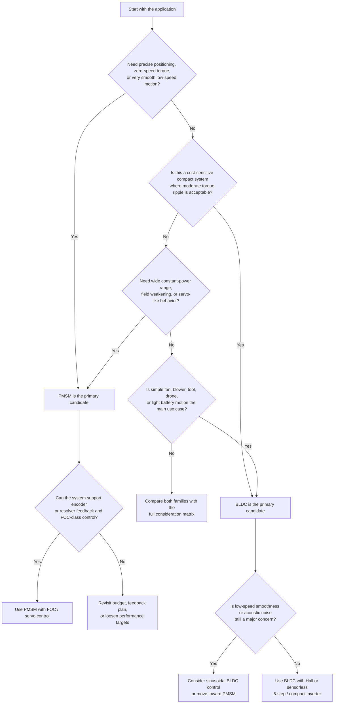
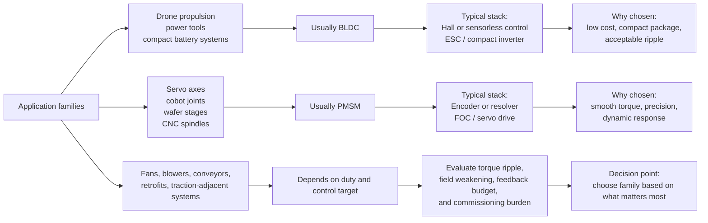
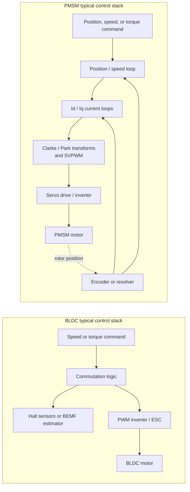
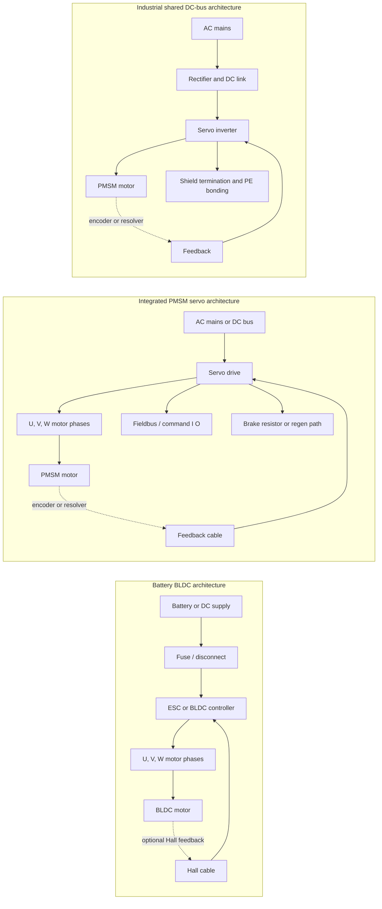
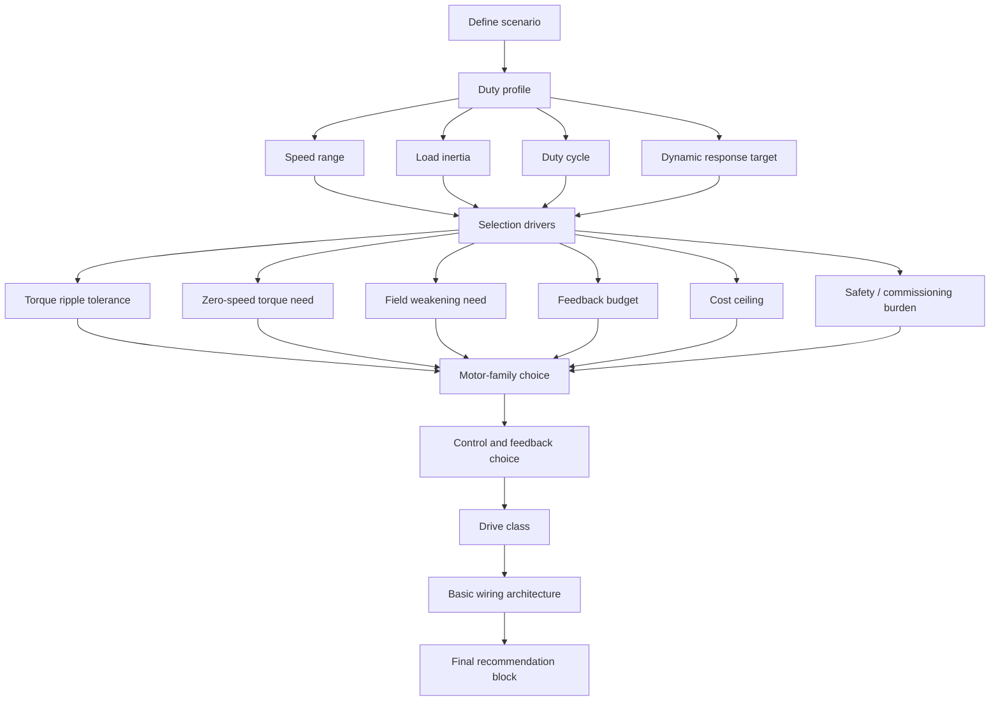

# Phase 27 — BLDC and PMSM Motor Implementation Plan

> **For agentic workers:** REQUIRED SUB-SKILL: Use superpowers:subagent-driven-development (recommended) or superpowers:executing-plans to implement this plan task-by-task. Steps use checkbox (`- [ ]`) syntax for tracking.

**Date:** 2026-04-20
**Status:** Planning
**Depends on:** Phase 26 COMPLETE (navigation restructure, `/fundamentals/motors/` exists with 13 modules)

**Goal:** Promote five motors planning documents from `planning/motors/` into the authoritative RAG corpus and expose them as five new site modules under `/fundamentals/motors/`, with navigation, catalog, cross-links, and scenario-based motor-selection guidance updated. The existing `bldc-ev-drone-motors` module is additionally enriched with a drone-class vs EV-class deep comparison section sourced from `planning/motors/scenarios.md`.

**Architecture:**
- **Source of truth:** RAG files under `control-standards/rag/training_modules/electrical_machines/` (authoritative engineering content)
- **Presentation layer:** Jekyll site modules under `docs/fundamentals/motors/` using the existing `training-module` layout
- **Data layer:** `docs/_data/training_catalog.yml` gains 5 module entries; `electrical-machines` group module_count goes 13 → 18
- **Navigation:** `docs/_data/navigation.yml` is already correctly pointed at `/fundamentals/motors/`, no structural change needed
- **Cross-links:** Existing `bldc-ev-drone-motors` module is enriched with a drone-class vs EV-class deep comparison section (body content from `scenarios.md` block 3) and also receives cross-links to the new modules; `motor-family-comparison` receives cross-links only
- **Scenario layer:** The comparison, implementation, and new scenarios modules must explicitly answer how to choose BLDC vs PMSM, what to look at first, why one family wins over the other in a given application, and what basic wiring / control / drive stack follows from that choice

**Tech Stack:** Jekyll 4.2, Liquid templates, Mermaid.js (CDN), vanilla Markdown. Build: `cd docs && ~/.gem/ruby/2.6.0/bin/bundle exec jekyll build`.

---

## Source Material

Six staging files are relevant to this phase (all in `planning/motors/`):

| Staging file                              | Role                                              | Status            |
| ----------------------------------------- | ------------------------------------------------- | ----------------- |
| `bldc.md` (~1794 lines)                   | Deep single-family BLDC reference                 | Ready, full content → Module 1 |
| `bldc_vs_pmsm.md` (~416 lines)            | BLDC vs PMSM head-to-head with 10 scenarios       | Ready, full content → Module 3 |
| `bldc_pmsm_implementation.md` (~878 lines)| 16-section production-grade implementation ref    | Ready, full content → Module 4 (+ PMSM extracts for Module 2) |
| `scenarios.md` (~1956 lines)              | Three engineering-grade scenario deep-dives (fan/pump, precision axis, AGV) **+** drone-class vs EV-class comparison | Ready, full content → Module 5 (scenario blocks 1+2); drone-vs-EV block routes to existing `bldc-ev-drone-motors` module enrichment |
| `motors_comparisons.md`                   | Older servo/BLDC/induction comparison             | **SKIP** — redundant with existing `motor-family-comparison` module |
| `pmsm.md` (21-line placeholder)           | Not real content — placeholder only               | **SKIP** — derive PMSM module from `bldc_pmsm_implementation.md` sections |

---

## Scope — What Gets Built

Five new training modules, each with a matching RAG file. One existing module (`bldc-ev-drone-motors`) additionally receives a new body content section plus cross-links.

| # | RAG file                                     | Site module                                              | Source                                      |
|---|----------------------------------------------|----------------------------------------------------------|---------------------------------------------|
| 1 | `bldc_motor_reference.md`                    | `/fundamentals/motors/bldc-reference/`                   | `planning/motors/bldc.md`                   |
| 2 | `pmsm_motor_reference.md`                    | `/fundamentals/motors/pmsm-reference/`                   | `planning/motors/bldc_pmsm_implementation.md` §1, 3, 4 (PMSM portions), 5, 6 + `bldc_vs_pmsm.md` PMSM-specific material |
| 3 | `bldc_vs_pmsm_comparison.md`                 | `/fundamentals/motors/bldc-vs-pmsm/`                     | `planning/motors/bldc_vs_pmsm.md` (all 14 in-scope sections) |
| 4 | `bldc_pmsm_implementation_guide.md`          | `/fundamentals/motors/bldc-pmsm-implementation/`         | `planning/motors/bldc_pmsm_implementation.md` (all 16 sections) |
| 5 | `bldc_pmsm_scenarios.md`                     | `/fundamentals/motors/motor-selection-scenarios/`        | `planning/motors/scenarios.md` blocks 1+2 (conceptual + engineering-grade three-scenario deep-dives), de-duplicated against block 5 (the redundant "GitHub-ready" restatement) |

**Existing module enrichment (not a new module):**

| Target module                                          | Addition                                                                                       | Source                                           |
|--------------------------------------------------------|------------------------------------------------------------------------------------------------|--------------------------------------------------|
| `/fundamentals/motors/bldc-ev-drone-motors/`           | New body section "Drone-class BLDC vs EV-class PMSM/IPMSM" (15-subsection deep comparison)      | `planning/motors/scenarios.md` block 3 (lines ~1589–1923) |

---

## File Structure

### Files to create

**RAG corpus** (`control-standards/rag/training_modules/electrical_machines/`):
- `bldc_motor_reference.md` — BLDC deep reference
- `pmsm_motor_reference.md` — PMSM deep reference
- `bldc_vs_pmsm_comparison.md` — head-to-head comparison with scenarios
- `bldc_pmsm_implementation_guide.md` — full implementation / selection / wiring / failure modes
- `bldc_pmsm_scenarios.md` — three engineering-grade scenario deep-dives (fan/pump, precision axis, AGV) with per-scenario drive, wiring, tuning, measurement, and failure-mode detail

**Site pages** (`docs/fundamentals/motors/`):
- `bldc-reference/index.md`
- `pmsm-reference/index.md`
- `bldc-vs-pmsm/index.md`
- `bldc-pmsm-implementation/index.md`
- `motor-selection-scenarios/index.md`

### Files to modify

- `control-standards/rag/training_modules/electrical_machines/_index.yaml` — register 5 new files
- `docs/_data/training_catalog.yml` — add 5 module entries, bump `electrical-machines` module_count 13 → 18
- `docs/fundamentals/motors/index.md` — no direct change (table is data-driven from catalog)
- `docs/fundamentals/motors/bldc-ev-drone-motors/index.md` — add drone-class vs EV-class deep comparison section (body content from `scenarios.md` block 3) + "See also" cross-links at bottom
- `docs/fundamentals/motors/motor-family-comparison/index.md` — add "See also" cross-links at bottom
- `planning/motors/pmsm.md` — delete (placeholder)
- `planning/motors/motors_comparisons.md` — delete (redundant with existing module)
- `planning/motors/scenarios.md` — keep as staging history (source for Module 5 and for `bldc-ev-drone-motors` enrichment)
- `project_state/project_state.md` — Phase 27 scope + completion entry
- `project_state/change_log.md` — Phase 27 entry
- `project_state/how_to.md` — no change (no new commands)
- `project_state/environment.md` — no change (no new tooling)

### Files NOT to touch

- `docs/_data/navigation.yml` — already correctly points at `/fundamentals/motors/`; new modules auto-appear via the data-driven table
- `docs/_includes/sidebar.html` — data-driven from navigation.yml
- Existing motor modules under `/fundamentals/motors/` except the two getting cross-links
- Anything under `docs/_layouts/` or `docs/assets/`

---

## Scenario Framing Requirements

The BLDC vs PMSM comparison module and the implementation guide must not stop at theory tables. They must help a reader make a practical architecture choice.

Every scenario or application-routing block must answer these questions in a repeatable format:

1. **Application / duty** — what the machine is trying to do, including speed range, load behavior, duty cycle, dynamic response, and smoothness expectations
2. **Selection drivers** — zero-speed torque, torque ripple, field weakening, efficiency, cost ceiling, feedback resolution, environmental ruggedness, regen / braking needs, and safety expectations
3. **Recommended family** — BLDC or PMSM
4. **Why this choice wins** — the two or three engineering reasons this family is the better fit
5. **When the other family would win** — what would need to change for the recommendation to flip
6. **Control / feedback stack** — 6-step Hall, sensorless BLDC, sinusoidal commutation, encoder FOC, resolver-based servo, etc.
7. **Drive class** — ESC, integrated servo drive, industrial servo amplifier, inverter + controller, or equivalent category
8. **Basic wiring pattern** — power source, DC link / inverter path, motor phases, feedback cable, braking / regen path if relevant, shielding / grounding notes

Keep the wiring guidance at block-diagram / architecture level. Do not imply that one universal schematic fits hobby BLDC, low-voltage battery systems, and industrial PMSM servo systems equally.

`planning/motors/scenarios.md` is the preferred template for how scenario blocks should read: constraints / requirements → engineering analysis → decision → justification → architecture. Do not copy its conversational setup text, emoji headings, or "I can turn this into..." assistant-style lines into authoritative RAG content.

---

## Visual Reference Diagrams

These Mermaid diagrams are reference assets for the implementer. They can be reused directly or adapted into the final RAG and site pages wherever they improve selection clarity.

### Diagram 1 — BLDC vs PMSM Selection Flow



### Diagram 2 — Application Routing and Recommendation Pattern



### Diagram 3 — Control, Feedback, and Drive Stack Comparison



### Diagram 4 — Basic Wiring Architecture Patterns



### Diagram 5 — Scenario Evaluation Stack



---

## Content Design Per Module

### Module 1 — BLDC Reference

- **Title:** BLDC Motor Reference
- **Level:** Intermediate
- **Time:** 35 min
- **Type:** Reference
- **Focus:** Motor / Drive Engineering
- **Featured:** false
- **Prerequisites:** `Motor Family Comparison`, `DC Motor Basics`
- **Sections (from `planning/motors/bldc.md`):**
  1. What a BLDC motor really is (physical description)
  2. Internal structure (rotor, stator, electronic commutation)
  3. Operating principle and control hierarchy
  4. 6-step commutation basics with commutation table
  5. Practical math (electrical equation, back-EMF, torque, mechanical, electrical-vs-mechanical speed)
  6. PWM and inverter operation
  7. MOSFET vs IGBT
  8. Gate driver role
  9. Driver categories (power driver, gate driver IC, motor controller, integrated)
  10. Feedback options (Hall, encoder, resolver, sensorless) with tradeoffs
  11. Wiring groups (power, phase, feedback, temperature, communication) and practical rules
  12. Electrical specifications that actually matter
- **Mermaid diagrams required:** commutation state machine, control hierarchy (nested loops)
- **Common mistakes / failure modes:** included as a section at the bottom

### Module 2 — PMSM Reference

- **Title:** PMSM Motor Reference
- **Level:** Intermediate
- **Time:** 30 min
- **Type:** Reference
- **Focus:** Motor / Drive Engineering
- **Featured:** false
- **Prerequisites:** `BLDC Motor Reference`, `Servo Drive Fundamentals`
- **Sections (derived from `bldc_pmsm_implementation.md`):**
  1. PMSM definition and family relationship (SPM vs IPM)
  2. Construction — distributed windings, magnet placement, saliency (Ld ≠ Lq on IPM)
  3. Sinusoidal back-EMF and why it matters
  4. Field-oriented control (Clarke, Park, SVPWM) with Mermaid diagram
  5. Reluctance torque on IPM and MTPA concept
  6. Feedback requirements (encoder, resolver — higher resolution than BLDC)
  7. Field weakening overview
  8. Drive architecture specific to PMSM (MCU class, current-loop rates, firmware footprint)
  9. Commissioning considerations (parameter ID, encoder offset calibration)
  10. Typical failure modes specific to PMSM
- **Mermaid diagrams required:** FOC block diagram (Clarke/Park flow), dq-frame torque production

### Module 3 — BLDC vs PMSM Comparison

- **Title:** BLDC vs PMSM — Motors, Drives, and Scenarios
- **Level:** Intermediate
- **Time:** 30 min
- **Type:** Concept
- **Focus:** Motor / Drive Engineering
- **Featured:** true
- **Prerequisites:** `Motor Family Comparison`
- **Sections (from `planning/motors/bldc_vs_pmsm.md`):**
  1. The one-sentence distinction
  2. Physical construction table
  3. Back-EMF as the root cause
  4. Control strategy comparison (6-step / sinusoidal / FOC)
  5. Drive architecture shared vs divergent
  6. Feedback matching table
  7. Torque ripple quantified
  8. Speed range and field weakening
  9. Efficiency comparison
  10. Cost structure
  11. Application-routing table: what to use for low-cost battery systems, industrial servo axes, traction, drone propulsion, fan / blower / conveyor duty, and retrofit work
  12. 10 scenario walkthroughs (HVAC, e-bike, servo press, conveyor, drone, CNC spindle, cobot joint, wafer handler, power tool, retrofit)
  13. Decision matrix and selection logic: why BLDC wins here, why PMSM wins there, and what would make the decision flip
  14. Failure modes and misapplication patterns by family
- **Scenario output rule:** each scenario ends with a compact recommendation block: recommended family, why it wins, when the other family would be justified, control / feedback stack, drive class, and basic wiring note

### Module 4 — BLDC/PMSM Implementation Guide

- **Title:** BLDC and PMSM Implementation Guide
- **Level:** Advanced
- **Time:** 60 min
- **Type:** Reference
- **Focus:** Motor / Drive Engineering
- **Featured:** true
- **Prerequisites:** `BLDC vs PMSM Comparison`, `VFD and Servo Architecture`
- **Sections (all 16 from `planning/motors/bldc_pmsm_implementation.md`):**
  1. Executive Overview
  2. System Architecture (with Mermaid end-to-end diagram)
  3. BLDC vs PMSM Deep Comparison table
  4. Control Methods (6-step commutation table + FOC Mermaid)
  5. Mathematical Foundation
  6. Drive Architecture (Mermaid inverter topology)
  7. Motor Selection Guide (hobby + industrial; explicit consideration matrix for torque, speed range, smoothness, feedback, cost, and environment)
  8. Drive Selection Guide (12-vendor industrial table + drive-class routing by application)
  9. Hobby vs Industrial comparison (15-row table)
  10. Cost vs Performance Tradeoff
  11. Measurement and Testing (why RMS meters fail on PWM)
  12. 8 Practical Implementation Scenarios (each must state motor choice, why, control method, feedback, drive class, and basic wiring pattern)
  13. Known Industry Brands (by category)
  14. Wiring and Integration (basic wiring archetypes for battery BLDC, integrated servo/PMSM, and industrial DC-bus / AC-fed systems)
  15. Common Failure Modes (including wrong motor-family selection and wrong control-method pairing)
  16. Implementation Checklist (selection, feedback, wiring, drive, and commissioning checks)
- **Scenario output rule:** each implementation scenario must tell the reader what to use, why to use it, how to drive it, and what basic wiring architecture follows from that decision

### Module 5 — Motor Selection Scenarios

- **Title:** Motor Selection Scenarios — Fan/Pump, Precision Axis, AGV
- **Level:** Intermediate
- **Time:** 40 min
- **Type:** Concept
- **Focus:** Motor / Drive Engineering
- **Featured:** true
- **Prerequisites:** `BLDC vs PMSM Comparison`
- **Purpose:** Module 3 answers *"which family?"* across 10 short scenarios. This module answers *"now engineer it"* across three canonical archetypes, each presented twice (conceptual pass + deep-dive pass) with full per-scenario drive, wiring, tuning, measurement, and failure-mode detail.
- **Sections (from `planning/motors/scenarios.md` blocks 1+2, merged and de-duplicated):**
  1. **Framing** — constraints → analysis → decision → justification as the repeatable scenario template; why three archetypes rather than ten
  2. **Scenario 1 — BLDC-favored: High-Speed Cooling Fan / Pump**
     - Conceptual: system context, requirements priority table, engineering analysis, recommended solution, architecture Mermaid, why BLDC wins, why PMSM is not justified, real-world examples
     - Deep dive: system definition table (voltage / power / speed / torque / duty / environment), mechanical characteristics, electrical + control architecture, control strategy (sensorless 6-step + optional Hall), drive selection, wiring table, tuning / setup minimalism, measurement strategy (DC bus + back-EMF scope), failure modes, cost structure, final engineering verdict
  3. **Scenario 2 — PMSM-favored: Precision Robotic Axis / Wafer Stage**
     - Conceptual: system context, requirements priority table, control needs (current/velocity/position), mechanical sensitivity, electrical behavior, recommended solution, architecture Mermaid, why PMSM wins, why BLDC is not suitable, real-world examples
     - Deep dive: system definition, mechanical characteristics (stiffness / backlash / vibration sensitivity), architecture, full servo stack + FOC implementation, drive selection tiers, wiring (U/V/W + encoder + STO + fieldbus + aux), tuning sequence (motor ID → current → velocity → position → notch), measurement strategy (DC bus, torque, speed, current waveform, PWM quality), failure modes, cost structure, final verdict
  4. **Scenario 3 — Ambiguous: AGV / Mobile Robot Drive Wheel**
     - Conceptual: system context, requirements priority, two competing architectures (BLDC / PMSM) with pros & cons, decision matrix, recommendation logic (choose BLDC if… / choose PMSM if…), architecture variants (two Mermaid diagrams), "this is a product strategy decision" insight
     - Deep dive: system definition, mechanical characteristics, two architecture options with drive + wiring detail, detailed control/efficiency/cost tradeoffs, decision logic, real engineering trade-flip table (what change flips the decision), tuning differences, measurement strategy, failure modes per architecture, cost vs experience tradeoff
  5. **Cross-scenario summary**
     - Drive comparison table across all three archetypes
     - Wiring comparison table across all three archetypes
     - Measurement implications (NR-X + scope rules of thumb)
     - Final engineering takeaway: "BLDC → physics handles stability; PMSM → controller enforces behavior; Ambiguous → economics decides architecture"
- **Mermaid diagrams required:** per-scenario architecture block diagrams (Mermaid `flowchart LR`) — 4 diagrams minimum (Scenario 1, Scenario 2, Scenario 3 Option A, Scenario 3 Option B), plus a decision-logic flowchart
- **Content discipline:**
  - Strip assistant-style meta text from `scenarios.md` ("If you want, I can turn this into…", "Done. I created the interactive page in the canvas…", "Here is a GitHub-ready Markdown section…")
  - Strip emoji headings (🟢 🔵 🟡 ✔ 👉 🧠) — replace with plain `##` headings and bold recommendation lines
  - Drop block 5 of `scenarios.md` (the "GitHub-ready" restatement of Scenarios 1–3) as redundant
  - Drop block 3 of `scenarios.md` (drone-vs-EV content) — that routes to the `bldc-ev-drone-motors` enrichment, not here
  - Keep external citations (TI, Microchip, Beckhoff, Tektronix) as inline plain URL references at the end of the relevant subsection; no footnote infrastructure
- **Scenario output rule:** each of the three scenarios must explicitly state recommended family, why, control/feedback stack, drive class, wiring pattern, tuning burden, measurement approach, and failure modes

---

## Task Breakdown

### Task 1 — RAG promotion: create `bldc_motor_reference.md`

**Files:**
- Create: `control-standards/rag/training_modules/electrical_machines/bldc_motor_reference.md`
- Source: `planning/motors/bldc.md`

- [ ] **Step 1.1: Create RAG file with required header and full content**

Copy content from `planning/motors/bldc.md` into the new RAG file. Prepend this header:

```yaml
---
AI_READ_ACCESS: ALLOWED
CONTENT_CLASS: RAG_APPROVED
MODULE_ID: bldc_motor_reference
LAST_UPDATED: 2026-04-20
---
```

Then copy all sections 1–15 from `bldc.md`. Keep all math, tables, and Mermaid-compatible code blocks verbatim. Normalize any `[` / `]` LaTeX-style bracketed equations to inline math where it renders plainly.

- [ ] **Step 1.2: Validate AI boundaries**

Run: `python3 tools/validate_ai_boundaries.py`
Expected: file count increments by 1; no new failures beyond the existing pre-Phase-25 baseline (2 known failures).

- [ ] **Step 1.3: Commit**

```bash
git add control-standards/rag/training_modules/electrical_machines/bldc_motor_reference.md
git commit -m "rag: promote BLDC motor reference from planning/motors/bldc.md"
```

---

### Task 2 — RAG promotion: create `pmsm_motor_reference.md`

**Files:**
- Create: `control-standards/rag/training_modules/electrical_machines/pmsm_motor_reference.md`
- Source: `planning/motors/bldc_pmsm_implementation.md` (PMSM-specific sections)

- [ ] **Step 2.1: Extract PMSM-focused content**

Pull PMSM-specific material from `bldc_pmsm_implementation.md`:
- §1 — PMSM side of the executive overview
- §3 — PMSM column of the deep comparison table
- §4 — Sinusoidal control and FOC subsection (keep the Mermaid Clarke/Park diagram)
- §5 — All math (equations apply to PMSM directly)
- §6 — Drive architecture (PMSM-relevant parts: MCU class, current sense topologies, feedback interface)
- From `bldc_vs_pmsm.md` §2 — IPM reluctance torque and the Ld ≠ Lq discussion
- From `bldc_vs_pmsm.md` §8 — Field weakening (SPM vs IPM)
- From `bldc_vs_pmsm.md` §13 — PMSM-specific failure modes

Assemble into a cohesive 10-section PMSM reference matching the section outline in the **Content Design Per Module — Module 2** block above.

- [ ] **Step 2.2: Write with required RAG header**

Prepend:

```yaml
---
AI_READ_ACCESS: ALLOWED
CONTENT_CLASS: RAG_APPROVED
MODULE_ID: pmsm_motor_reference
LAST_UPDATED: 2026-04-20
---
```

- [ ] **Step 2.3: Validate AI boundaries**

Run: `python3 tools/validate_ai_boundaries.py`
Expected: file count +1; no new failures.

- [ ] **Step 2.4: Commit**

```bash
git add control-standards/rag/training_modules/electrical_machines/pmsm_motor_reference.md
git commit -m "rag: add PMSM motor reference derived from implementation planning doc"
```

---

### Task 3 — RAG promotion: create `bldc_vs_pmsm_comparison.md`

**Files:**
- Create: `control-standards/rag/training_modules/electrical_machines/bldc_vs_pmsm_comparison.md`
- Source: `planning/motors/bldc_vs_pmsm.md`

- [ ] **Step 3.1: Copy content with RAG header**

Copy all 15 sections of `planning/motors/bldc_vs_pmsm.md` into the new RAG file. Prepend:

```yaml
---
AI_READ_ACCESS: ALLOWED
CONTENT_CLASS: RAG_APPROVED
MODULE_ID: bldc_vs_pmsm_comparison
LAST_UPDATED: 2026-04-20
---
```

Drop the final §15 ("What to Write Next") — that is planning metadata, not reference content.

Normalize the in-scope comparison content so it reads like a practical selection guide, not only a theory comparison. For the application-routing table, decision matrix, and each scenario walkthrough, explicitly state:

- recommended motor family
- why that family wins
- when the other family would win instead
- expected control / feedback stack
- likely drive class
- basic wiring / integration note

Do not invent unsupported application claims. Derive the recommendation blocks from the existing source content. Keep this module scoped to the 10 short scenario walkthroughs in `bldc_vs_pmsm.md`; the three deep-dive archetype scenarios belong in Module 5 (see Task 4B).

- [ ] **Step 3.2: Validate AI boundaries**

Run: `python3 tools/validate_ai_boundaries.py`
Expected: file count +1; no new failures.

- [ ] **Step 3.3: Commit**

```bash
git add control-standards/rag/training_modules/electrical_machines/bldc_vs_pmsm_comparison.md
git commit -m "rag: promote BLDC vs PMSM comparison from planning/motors/"
```

---

### Task 4 — RAG promotion: create `bldc_pmsm_implementation_guide.md`

**Files:**
- Create: `control-standards/rag/training_modules/electrical_machines/bldc_pmsm_implementation_guide.md`
- Source: `planning/motors/bldc_pmsm_implementation.md`

- [ ] **Step 4.1: Copy all 16 sections with RAG header**

Copy sections 1–16 of `planning/motors/bldc_pmsm_implementation.md` verbatim. Drop the trailing "Closing Notes" section (it references other planning files — not authoritative content). Prepend:

```yaml
---
AI_READ_ACCESS: ALLOWED
CONTENT_CLASS: RAG_APPROVED
MODULE_ID: bldc_pmsm_implementation_guide
LAST_UPDATED: 2026-04-20
---
```

Then editorially normalize the selection, drive, wiring, and scenario sections so a reader can actually choose an architecture. Make sure the resulting guide explicitly includes:

- a consideration matrix for choosing BLDC vs PMSM
- application-to-architecture routing guidance
- basic wiring archetypes at block-diagram level
- control / feedback / drive selection by scenario
- short "why this, not that" recommendation blocks inside each practical scenario

Keep the guidance architecture-level and vendor-neutral unless the source already names a vendor category.

Keep the §12 "8 Practical Implementation Scenarios" short and implementation-focused. The three deep archetype scenarios (fan/pump, precision axis, AGV) belong in Module 5 (see Task 4B), not here.

- [ ] **Step 4.2: Validate AI boundaries**

Run: `python3 tools/validate_ai_boundaries.py`
Expected: file count +1; no new failures.

- [ ] **Step 4.3: Commit**

```bash
git add control-standards/rag/training_modules/electrical_machines/bldc_pmsm_implementation_guide.md
git commit -m "rag: promote BLDC/PMSM implementation guide from planning/motors/"
```

---

### Task 4B — RAG promotion: create `bldc_pmsm_scenarios.md`

**Files:**
- Create: `control-standards/rag/training_modules/electrical_machines/bldc_pmsm_scenarios.md`
- Source: `planning/motors/scenarios.md` (blocks 1+2; drop block 3 drone-vs-EV, drop block 5 redundant restatement)

- [ ] **Step 4B.1: Extract and merge the two scenario passes**

Pull from `planning/motors/scenarios.md`:
- **Block 1** (approximately the first third of the file, from "Below are three clean, engineering-grade scenarios" through the first "Final Engineering Takeaway") — the conceptual constraints → analysis → decision → justification pass for all three scenarios
- **Block 2** (the "Deep Dive" section that starts with "Good—now we push these from 'conceptual' into engineering-grade scenarios") — the per-scenario detailed pass with system definition tables, mechanical characteristics, control strategy, drive selection, wiring, tuning, measurement, failure modes, and cost

Merge so that each of the three scenarios (Fan/Pump, Precision Axis, AGV) has one unified presentation: conceptual framing subsection first, then deep-dive subsections. Do NOT produce two separate passes — it reads as a repeat.

Explicitly **skip**:
- Block 3 — "BLDC Systems — Low-End (Drone) vs High-End (EV)" — this goes into `bldc-ev-drone-motors` enrichment in Task 11, not here
- Block 5 — the "GitHub-ready markdown section" restatement — redundant with block 1
- All assistant-style meta prose ("If you want, I can turn this into…", "Done. I created the interactive page in the canvas…", "Next Step (Recommended)…")
- All emoji headings (🟢 🔵 🟡 ✔ 👉 🧠) — replace with plain `##` headings and bold summary lines

Assemble into a cohesive 5-section structure matching **Content Design Per Module — Module 5** above:
1. Framing (constraints → analysis → decision → justification template)
2. Scenario 1 — BLDC-favored (Fan/Pump)
3. Scenario 2 — PMSM-favored (Precision Axis)
4. Scenario 3 — Ambiguous (AGV)
5. Cross-scenario summary (drive comparison table, wiring comparison table, measurement implications, engineering takeaway)

Keep all Mermaid `flowchart LR` architecture diagrams verbatim. Keep the decision-matrix table and the "trade-flip" table (what condition change flips the recommendation).

- [ ] **Step 4B.2: Write with required RAG header**

Prepend:

```yaml
---
AI_READ_ACCESS: ALLOWED
CONTENT_CLASS: RAG_APPROVED
MODULE_ID: bldc_pmsm_scenarios
LAST_UPDATED: 2026-04-20
---
```

- [ ] **Step 4B.3: Preserve citations**

`scenarios.md` references Texas Instruments, Microchip, Beckhoff, and Tektronix vendor documentation. Preserve these as plain inline URL references at the end of the relevant subsections (e.g., at the end of Scenario 2's drive selection paragraph). Do **not** introduce footnote infrastructure or a "References" section with numbered anchors — the Jekyll site does not render those well and the other RAG files do not use that pattern.

- [ ] **Step 4B.4: Validate AI boundaries**

Run: `python3 tools/validate_ai_boundaries.py`
Expected: file count +1; no new failures.

- [ ] **Step 4B.5: Commit**

```bash
git add control-standards/rag/training_modules/electrical_machines/bldc_pmsm_scenarios.md
git commit -m "rag: promote three engineering-grade motor selection scenarios from planning/motors/"
```

---

### Task 5 — Update RAG index

**Files:**
- Modify: `control-standards/rag/training_modules/electrical_machines/_index.yaml`

- [ ] **Step 5.1: Register 5 new files in _index.yaml**

Open `_index.yaml` and add to the `files:` list (append at end, before the trailing newline):

```yaml
  - "bldc_motor_reference.md"
  - "pmsm_motor_reference.md"
  - "bldc_vs_pmsm_comparison.md"
  - "bldc_pmsm_implementation_guide.md"
  - "bldc_pmsm_scenarios.md"
```

Update the `last_updated` field to `"2026-04-20"`.

- [ ] **Step 5.2: Verify**

Run: `python3 tools/project_automator.py`
Expected: exits cleanly; no structural complaints.

Run: `bash tools/validate_reorg.sh all`
Expected: 48/50 baseline maintained (the 2 known failures are pre-existing).

- [ ] **Step 5.3: Commit**

```bash
git add control-standards/rag/training_modules/electrical_machines/_index.yaml
git commit -m "rag: register 5 new motor reference files in electrical_machines index"
```

---

### Task 6 — Site page: BLDC Reference module

**Files:**
- Create: `docs/fundamentals/motors/bldc-reference/index.md`

- [ ] **Step 6.1: Create the module page with frontmatter**

```yaml
---
layout: training-module
title: "BLDC Motor Reference"
description: "Deep reference on brushless DC motors: construction, 6-step commutation, inverter operation, feedback, wiring, and specification review."
breadcrumb:
  - name: "Training"
    url: "/training/"
  - name: "Motors, Drives, and Motion"
    url: "/fundamentals/motors/"
repo_path: "control-standards/rag/training_modules/electrical_machines/bldc_motor_reference.md"
---
```

- [ ] **Step 6.2: Add Purpose and body content**

The body mirrors the RAG file content from Task 1. Render math in plain prose rather than TeX brackets (e.g., `T = Kt × I` not `[T = K_t I]`). Wrap every Mermaid code block in:

```html
<div class="mermaid-wrap">
<pre class="mermaid">
... diagram ...
</pre>
</div>
```

Keep all tables, bullet lists, and section hierarchy intact.

- [ ] **Step 6.3: Add footer navigation**

Append before the closing of the page:

```html
---

<div style="display:flex; justify-content:space-between; margin-top:2rem; font-size:0.9rem;">
  <a href="{{ '/fundamentals/motors/dc-motor-basics/' | relative_url }}">&larr; DC Motor Basics</a>
  <a href="{{ '/fundamentals/motors/' | relative_url }}">↑ Motors, Drives, and Motion</a>
  <a href="{{ '/fundamentals/motors/pmsm-reference/' | relative_url }}">PMSM Motor Reference &rarr;</a>
</div>
```

- [ ] **Step 6.4: Build and verify**

```bash
cd docs && ~/.gem/ruby/2.6.0/bin/bundle exec jekyll build
```
Expected: clean build; built HTML count increases by 1 relative to the current pre-task baseline.

- [ ] **Step 6.5: Commit**

```bash
git add docs/fundamentals/motors/bldc-reference/
git commit -m "site: add BLDC Motor Reference training module"
```

---

### Task 7 — Site page: PMSM Reference module

**Files:**
- Create: `docs/fundamentals/motors/pmsm-reference/index.md`

- [ ] **Step 7.1: Create the module page with frontmatter**

```yaml
---
layout: training-module
title: "PMSM Motor Reference"
description: "Deep reference on permanent-magnet synchronous motors: SPM vs IPM, sinusoidal back-EMF, field-oriented control, field weakening, and commissioning."
breadcrumb:
  - name: "Training"
    url: "/training/"
  - name: "Motors, Drives, and Motion"
    url: "/fundamentals/motors/"
repo_path: "control-standards/rag/training_modules/electrical_machines/pmsm_motor_reference.md"
---
```

- [ ] **Step 7.2: Add Purpose and body content from Task 2 RAG file**

Mirror the 10-section structure. Convert the Clarke/Park Mermaid diagram to the `mermaid-wrap` form. Keep the dq-frame torque production discussion.

- [ ] **Step 7.3: Add footer navigation**

```html
<div style="display:flex; justify-content:space-between; margin-top:2rem; font-size:0.9rem;">
  <a href="{{ '/fundamentals/motors/bldc-reference/' | relative_url }}">&larr; BLDC Motor Reference</a>
  <a href="{{ '/fundamentals/motors/' | relative_url }}">↑ Motors, Drives, and Motion</a>
  <a href="{{ '/fundamentals/motors/bldc-vs-pmsm/' | relative_url }}">BLDC vs PMSM Comparison &rarr;</a>
</div>
```

- [ ] **Step 7.4: Build and verify**

```bash
cd docs && ~/.gem/ruby/2.6.0/bin/bundle exec jekyll build
```
Expected: clean build; built HTML count increases by 1 relative to the current pre-task baseline.

- [ ] **Step 7.5: Commit**

```bash
git add docs/fundamentals/motors/pmsm-reference/
git commit -m "site: add PMSM Motor Reference training module"
```

---

### Task 8 — Site page: BLDC vs PMSM Comparison module

**Files:**
- Create: `docs/fundamentals/motors/bldc-vs-pmsm/index.md`

- [ ] **Step 8.1: Create the module page with frontmatter**

```yaml
---
layout: training-module
title: "BLDC vs PMSM — Motors, Drives, and Scenarios"
description: "Head-to-head engineering comparison of BLDC and PMSM systems, with 10 real-world scenario walkthroughs and a decision matrix."
breadcrumb:
  - name: "Training"
    url: "/training/"
  - name: "Motors, Drives, and Motion"
    url: "/fundamentals/motors/"
repo_path: "control-standards/rag/training_modules/electrical_machines/bldc_vs_pmsm_comparison.md"
---
```

- [ ] **Step 8.2: Add Purpose and body from Task 3 RAG file**

Include all 14 in-scope sections (drop the §15 planning follow-ups). Keep every scenario walkthrough — these are the most-useful part of the page. Keep the decision matrix table verbatim.

Add compact recommendation callouts or bold summary lines in the scenario section so a reader can scan:

- use BLDC / use PMSM
- why
- minimum control / feedback stack
- drive class
- basic wiring note

At the end of the scenario section, add a short pointer: *"For deep engineering walkthroughs of three archetype scenarios (fan/pump, precision axis, AGV) with per-scenario drive selection, wiring, tuning, and measurement detail, see [Motor Selection Scenarios](/fundamentals/motors/motor-selection-scenarios/)."*

- [ ] **Step 8.3: Add footer navigation**

```html
<div style="display:flex; justify-content:space-between; margin-top:2rem; font-size:0.9rem;">
  <a href="{{ '/fundamentals/motors/pmsm-reference/' | relative_url }}">&larr; PMSM Motor Reference</a>
  <a href="{{ '/fundamentals/motors/' | relative_url }}">↑ Motors, Drives, and Motion</a>
  <a href="{{ '/fundamentals/motors/bldc-pmsm-implementation/' | relative_url }}">BLDC/PMSM Implementation Guide &rarr;</a>
</div>
```

- [ ] **Step 8.4: Build and verify**

```bash
cd docs && ~/.gem/ruby/2.6.0/bin/bundle exec jekyll build
```
Expected: clean build; built HTML count increases by 1 relative to the current pre-task baseline.

- [ ] **Step 8.5: Commit**

```bash
git add docs/fundamentals/motors/bldc-vs-pmsm/
git commit -m "site: add BLDC vs PMSM comparison training module"
```

---

### Task 9 — Site page: BLDC/PMSM Implementation Guide module

**Files:**
- Create: `docs/fundamentals/motors/bldc-pmsm-implementation/index.md`

- [ ] **Step 9.1: Create the module page with frontmatter**

```yaml
---
layout: training-module
title: "BLDC and PMSM Implementation Guide"
description: "Production-grade implementation reference: system architecture, control methods, drive selection, wiring, failure modes, and a full commissioning checklist."
breadcrumb:
  - name: "Training"
    url: "/training/"
  - name: "Motors, Drives, and Motion"
    url: "/fundamentals/motors/"
repo_path: "control-standards/rag/training_modules/electrical_machines/bldc_pmsm_implementation_guide.md"
---
```

- [ ] **Step 9.2: Add Purpose and body from Task 4 RAG file**

All 16 sections. Keep all Mermaid diagrams wrapped in `mermaid-wrap`. Keep the 12-vendor industrial drive table and the 15-row hobby-vs-industrial comparison — these are the page's core value.

In addition, make the implementation content operational rather than descriptive:

- add a selection-factor matrix for BLDC vs PMSM
- add application routing guidance ("what to use when")
- make the wiring section show basic architecture patterns, not only prose
- make each implementation scenario say what motor family to choose, why, what control method to use, what drive class fits, and what the wiring architecture looks like at a basic level

In §12 add a short pointer: *"For three fully worked engineering archetypes (fan/pump, precision axis, AGV) with per-scenario tuning and measurement strategy, see [Motor Selection Scenarios](/fundamentals/motors/motor-selection-scenarios/)."*

- [ ] **Step 9.3: Add footer navigation**

```html
<div style="display:flex; justify-content:space-between; margin-top:2rem; font-size:0.9rem;">
  <a href="{{ '/fundamentals/motors/bldc-vs-pmsm/' | relative_url }}">&larr; BLDC vs PMSM Comparison</a>
  <a href="{{ '/fundamentals/motors/' | relative_url }}">↑ Motors, Drives, and Motion</a>
  <a href="{{ '/fundamentals/motors/servo-drive-fundamentals/' | relative_url }}">Servo Drive Fundamentals &rarr;</a>
</div>
```

- [ ] **Step 9.4: Build and verify**

```bash
cd docs && ~/.gem/ruby/2.6.0/bin/bundle exec jekyll build
```
Expected: clean build; built HTML count increases by 1 relative to the current pre-task baseline.

- [ ] **Step 9.5: Commit**

```bash
git add docs/fundamentals/motors/bldc-pmsm-implementation/
git commit -m "site: add BLDC/PMSM implementation guide training module"
```

---

### Task 9B — Site page: Motor Selection Scenarios module

**Files:**
- Create: `docs/fundamentals/motors/motor-selection-scenarios/index.md`

- [ ] **Step 9B.1: Create the module page with frontmatter**

```yaml
---
layout: training-module
title: "Motor Selection Scenarios — Fan/Pump, Precision Axis, AGV"
description: "Three engineering-grade motor selection archetypes with per-scenario drive, wiring, control, tuning, measurement, and failure-mode detail. Covers a clearly BLDC-favored case, a clearly PMSM-favored case, and an ambiguous tradeoff case."
breadcrumb:
  - name: "Training"
    url: "/training/"
  - name: "Motors, Drives, and Motion"
    url: "/fundamentals/motors/"
repo_path: "control-standards/rag/training_modules/electrical_machines/bldc_pmsm_scenarios.md"
---
```

- [ ] **Step 9B.2: Add Purpose and body from Task 4B RAG file**

Mirror the 5-section structure (framing → Scenario 1 → Scenario 2 → Scenario 3 → cross-scenario summary). Each scenario renders the conceptual framing subsection first, then the deep-dive subsections (system definition table, mechanical characteristics, control strategy, drive selection, wiring table, tuning, measurement strategy, failure modes, cost, final verdict).

Wrap every Mermaid block in:

```html
<div class="mermaid-wrap">
<pre class="mermaid">
... diagram ...
</pre>
</div>
```

Preserve all tables (system definition, requirements priority, decision matrix, drive comparison, wiring comparison, trade-flip).

External URL citations (TI, Microchip, Beckhoff, Tektronix) should render as inline links at the end of the relevant subsections. No footnote infrastructure.

- [ ] **Step 9B.3: Add footer navigation**

```html
<div style="display:flex; justify-content:space-between; margin-top:2rem; font-size:0.9rem;">
  <a href="{{ '/fundamentals/motors/bldc-pmsm-implementation/' | relative_url }}">&larr; BLDC/PMSM Implementation Guide</a>
  <a href="{{ '/fundamentals/motors/' | relative_url }}">↑ Motors, Drives, and Motion</a>
  <a href="{{ '/fundamentals/motors/servo-drive-fundamentals/' | relative_url }}">Servo Drive Fundamentals &rarr;</a>
</div>
```

Also update Task 9's footer navigation so that "BLDC/PMSM Implementation Guide" now points forward to "Motor Selection Scenarios" instead of "Servo Drive Fundamentals". Edit `docs/fundamentals/motors/bldc-pmsm-implementation/index.md` footer:

```html
<a href="{{ '/fundamentals/motors/motor-selection-scenarios/' | relative_url }}">Motor Selection Scenarios &rarr;</a>
```

- [ ] **Step 9B.4: Build and verify**

```bash
cd docs && ~/.gem/ruby/2.6.0/bin/bundle exec jekyll build
```
Expected: clean build; built HTML count increases by 1 relative to the current pre-task baseline.

- [ ] **Step 9B.5: Commit**

```bash
git add docs/fundamentals/motors/motor-selection-scenarios/ docs/fundamentals/motors/bldc-pmsm-implementation/index.md
git commit -m "site: add Motor Selection Scenarios training module (three archetype deep-dives)"
```

---

### Task 10 — Update training catalog (5 new module entries)

**Files:**
- Modify: `docs/_data/training_catalog.yml`

- [ ] **Step 10.1: Update electrical-machines group module_count**

Find the `- key: "electrical-machines"` entry (around line 125) and change:

```yaml
    module_count: 13
```
to:
```yaml
    module_count: 18
```

- [ ] **Step 10.2: Append 5 new module entries to the `modules:` list**

Locate the end of the Electrical Machines section (after the last `group: "electrical-machines"` module) and insert the following five entries:

```yaml
  - title: "BLDC Motor Reference"
    url: "/fundamentals/motors/bldc-reference/"
    group: "electrical-machines"
    group_label: "Motors, Drives, and Motion"
    summary: "Deep reference on BLDC construction, 6-step commutation, inverter operation, feedback options, wiring, and specification review."
    level: "Intermediate"
    time: "35 min"
    focus: "Motor / Drive Engineering"
    type: "Reference"
    prerequisites:
      - "Motor Family Comparison"
      - "DC Motor Basics"
    related_workflows:
      - title: "Motor Selection Workflow"
        url: "/design/workflows/motor-selection/"
      - title: "Motor Troubleshooting Decision Tree"
        url: "/troubleshooting/motors/"

  - title: "PMSM Motor Reference"
    url: "/fundamentals/motors/pmsm-reference/"
    group: "electrical-machines"
    group_label: "Motors, Drives, and Motion"
    summary: "Deep reference on PMSM: SPM vs IPM, sinusoidal back-EMF, field-oriented control, field weakening, and commissioning considerations."
    level: "Intermediate"
    time: "30 min"
    focus: "Motor / Drive Engineering"
    type: "Reference"
    prerequisites:
      - "BLDC Motor Reference"
      - "Servo Drive Fundamentals"
    related_workflows:
      - title: "Servo Commissioning Workflow"
        url: "/implementation/servo-commissioning/"

  - title: "BLDC vs PMSM Comparison"
    url: "/fundamentals/motors/bldc-vs-pmsm/"
    group: "electrical-machines"
    group_label: "Motors, Drives, and Motion"
    summary: "Head-to-head engineering comparison with 10 real scenarios, application-fit guidance, why one family wins over the other, and a decision matrix."
    level: "Intermediate"
    time: "30 min"
    focus: "Motor / Drive Engineering"
    type: "Concept"
    featured: true
    prerequisites:
      - "Motor Family Comparison"
    related_workflows:
      - title: "Motor Selection Workflow"
        url: "/design/workflows/motor-selection/"

  - title: "BLDC and PMSM Implementation Guide"
    url: "/fundamentals/motors/bldc-pmsm-implementation/"
    group: "electrical-machines"
    group_label: "Motors, Drives, and Motion"
    summary: "Production-grade implementation reference — system architecture, control methods, motor and drive selection, application routing, basic wiring patterns, measurement pitfalls, failure modes, and a full commissioning checklist."
    level: "Advanced"
    time: "60 min"
    focus: "Motor / Drive Engineering"
    type: "Reference"
    featured: true
    prerequisites:
      - "BLDC vs PMSM Comparison"
      - "VFD and Servo Architecture"
    related_workflows:
      - title: "Servo Commissioning Workflow"
        url: "/implementation/servo-commissioning/"
      - title: "VFD Commissioning Workflow"
        url: "/implementation/vfd-commissioning/"
    related_checklists:
      - title: "Motor Nameplate and Overload Setting"
        url: "/implementation/commissioning-templates/motor-nameplate-overload/"
      - title: "Motor Rotation and Overload Verification"
        url: "/implementation/commissioning-templates/motor-rotation-verification/"

  - title: "Motor Selection Scenarios"
    url: "/fundamentals/motors/motor-selection-scenarios/"
    group: "electrical-machines"
    group_label: "Motors, Drives, and Motion"
    summary: "Three engineering-grade motor selection archetypes — fan/pump (BLDC-favored), precision axis (PMSM-favored), AGV (ambiguous tradeoff) — with per-scenario drive, wiring, control, tuning, measurement, and failure-mode detail."
    level: "Intermediate"
    time: "40 min"
    focus: "Motor / Drive Engineering"
    type: "Concept"
    featured: true
    prerequisites:
      - "BLDC vs PMSM Comparison"
    related_workflows:
      - title: "Motor Selection Workflow"
        url: "/design/workflows/motor-selection/"
```

- [ ] **Step 10.3: Build and verify**

```bash
cd docs && ~/.gem/ruby/2.6.0/bin/bundle exec jekyll build
```
Expected: clean build. The `/fundamentals/motors/` index page now renders 18 rows in the modules table (the five new ones at the bottom).

- [ ] **Step 10.4: Visual check**

Visit `http://localhost:4000/Control-System-Tools/fundamentals/motors/` and confirm:
- Table has 18 rows
- Three new "Core" badges visible (BLDC vs PMSM Comparison, BLDC/PMSM Implementation Guide, Motor Selection Scenarios)
- All five new links resolve cleanly

Run `cd docs && ~/.gem/ruby/2.6.0/bin/bundle exec jekyll serve` if not already running.

- [ ] **Step 10.5: Commit**

```bash
git add docs/_data/training_catalog.yml
git commit -m "catalog: register 5 new BLDC/PMSM modules in training catalog"
```

---

### Task 11 — Enrich `bldc-ev-drone-motors` module with drone-vs-EV deep comparison + cross-links

**Files:**
- Modify: `docs/fundamentals/motors/bldc-ev-drone-motors/index.md`

- [ ] **Step 11.1: Add "Drone-class BLDC vs EV-class PMSM/IPMSM" body section**

In `docs/fundamentals/motors/bldc-ev-drone-motors/index.md`, locate the last content section above the footer navigation. Insert a new top-level section sourced from `planning/motors/scenarios.md` block 3 (approximately lines 1589–1923 — the section that begins with "BLDC Systems — Low-End (Drone) vs High-End (EV)" and runs through the "When BLDC Becomes PMSM" subsection and "Final Takeaway").

The section must contain these subsections (all sourced from block 3 of scenarios.md):

1. **Executive summary table** — category comparison (motor type, control, feedback, cost priority, precision, power level)
2. **System architecture comparison** — two Mermaid `flowchart LR` diagrams (Low-End drone/hobby vs High-End EV)
3. **Motor construction differences** — table (rotor magnets, winding, back-EMF shape, cooling, robustness, torque density)
4. **Control strategy differences** — drone BLDC (6-step, sensorless) vs EV FOC; include the plain-prose `T ∝ Iq` relationship
5. **Drive / inverter differences** — drone ESC vs EV inverter (MOSFET vs IGBT/SiC; 12–60V vs 200–800V; current sensing; protection; cooling)
6. **Feedback differences** — sensorless / Hall / encoder / resolver / observer table
7. **Wiring differences** — drone minimal wiring vs EV HV + feedback + temp + CAN + interlocks
8. **Thermal management** — air vs liquid/oil; monitoring; derating; real-time thermal model
9. **Efficiency and performance** — optimization focus, regen
10. **Cost structure** — motor / drive / sensors / engineering
11. **Similarities (important)** — same 3-phase stator, same physics, same governing equations
12. **What actually changes** — physics/control/measurement/safety/optimization table
13. **When BLDC becomes PMSM** — conditions that transform BLDC control into PMSM/FOC/EV-class control
14. **Final takeaway** — drone-BLDC vs EV-"BLDC" reality check; bottom-line insight that the difference is NOT the motor but how much control, sensing, and optimization is applied

Format rules:
- Wrap every Mermaid block in `<div class="mermaid-wrap"><pre class="mermaid">...</pre></div>`
- Replace emoji section headings (🟢 🔵 ⚠️ 👉) with plain `##` / `###` headings
- Strip assistant meta text ("If you want, I can turn this into…", "Done. I created…")
- Normalize LaTeX-bracketed equations to plain prose (e.g., `T = Kt × I`, `V = R·i + L·di/dt + Ke·ω`)

Place this new section **after** the existing body content of `bldc-ev-drone-motors/index.md` and **before** the "See also" section that Step 11.2 adds.

- [ ] **Step 11.2: Add "See also" section above the footer nav**

After the new body section from Step 11.1 and before the final `---` that precedes the footer navigation div, insert:

```markdown
## See also

- [BLDC Motor Reference]({{ '/fundamentals/motors/bldc-reference/' | relative_url }}) — deep single-family reference covering commutation, drives, feedback, and wiring
- [PMSM Motor Reference]({{ '/fundamentals/motors/pmsm-reference/' | relative_url }}) — permanent-magnet synchronous motor deep reference, including SPM vs IPM and field weakening
- [BLDC vs PMSM Comparison]({{ '/fundamentals/motors/bldc-vs-pmsm/' | relative_url }}) — head-to-head comparison with 10 application scenarios
- [BLDC and PMSM Implementation Guide]({{ '/fundamentals/motors/bldc-pmsm-implementation/' | relative_url }}) — wiring, failure modes, and full implementation checklist
- [Motor Selection Scenarios]({{ '/fundamentals/motors/motor-selection-scenarios/' | relative_url }}) — three engineering-grade archetypes (fan/pump, precision axis, AGV) with tuning and measurement detail

```

- [ ] **Step 11.3: Build and verify**

```bash
cd docs && ~/.gem/ruby/2.6.0/bin/bundle exec jekyll build
```
Expected: clean build. Rendered `bldc-ev-drone-motors` page should be noticeably longer (new drone-vs-EV section is ~15 subsections).

- [ ] **Step 11.4: Visual check**

Visit `http://localhost:4000/Control-System-Tools/fundamentals/motors/bldc-ev-drone-motors/` and confirm:
- New "Drone-class BLDC vs EV-class PMSM/IPMSM" section renders with both Mermaid architecture diagrams
- All tables render (no kramdown pipe-escape issues)
- "See also" section at the bottom shows all 5 cross-links, all resolve

- [ ] **Step 11.5: Commit**

```bash
git add docs/fundamentals/motors/bldc-ev-drone-motors/index.md
git commit -m "site: enrich bldc-ev-drone-motors with drone-class vs EV-class deep comparison + cross-links"
```

---

### Task 12 — Cross-link from `motor-family-comparison` module

**Files:**
- Modify: `docs/fundamentals/motors/motor-family-comparison/index.md`

- [ ] **Step 12.1: Add "See also" section**

Same pattern as Task 11. Insert above the footer navigation div:

```markdown
## See also

- [BLDC vs PMSM Comparison]({{ '/fundamentals/motors/bldc-vs-pmsm/' | relative_url }}) — head-to-head engineering comparison with 10 application scenarios
- [BLDC Motor Reference]({{ '/fundamentals/motors/bldc-reference/' | relative_url }}) — deep BLDC reference
- [PMSM Motor Reference]({{ '/fundamentals/motors/pmsm-reference/' | relative_url }}) — deep PMSM reference
- [BLDC and PMSM Implementation Guide]({{ '/fundamentals/motors/bldc-pmsm-implementation/' | relative_url }}) — production-grade implementation reference

```

- [ ] **Step 12.2: Build and verify**

```bash
cd docs && ~/.gem/ruby/2.6.0/bin/bundle exec jekyll build
```
Expected: clean build.

- [ ] **Step 12.3: Commit**

```bash
git add docs/fundamentals/motors/motor-family-comparison/index.md
git commit -m "site: cross-link motor family comparison to new BLDC/PMSM references"
```

---

### Task 13 — Clean up planning staging files

**Files:**
- Delete: `planning/motors/pmsm.md` (21-line placeholder)
- Delete: `planning/motors/motors_comparisons.md` (superseded by existing `motor-family-comparison` site module)

- [ ] **Step 13.1: Delete the two superseded staging files**

```bash
rm "planning/motors/pmsm.md"
rm "planning/motors/motors_comparisons.md"
```

Keep `planning/motors/bldc.md`, `bldc_vs_pmsm.md`, `bldc_pmsm_implementation.md`, and `scenarios.md` as staging history — they are the source-of-drafting record and are now referenced by the RAG files.

- [ ] **Step 13.2: Commit**

```bash
git add -A planning/motors/
git commit -m "planning: remove superseded pmsm.md placeholder and motors_comparisons.md"
```

---

### Task 14 — Run full validation suite

- [ ] **Step 14.1: AI boundary validator**

```bash
python3 tools/validate_ai_boundaries.py
```
Expected: file count increased by 5 from baseline; same 2 pre-existing failures, no new ones.

- [ ] **Step 14.2: Structure validator**

```bash
bash tools/validate_reorg.sh all
```
Expected: 48/50 baseline (pre-existing 2 failures carry through).

- [ ] **Step 14.3: Project automator refresh**

```bash
python3 tools/project_automator.py
```
Expected: exits cleanly; any generated summaries reflect the 5 new RAG files and 5 new site pages.

- [ ] **Step 14.4: Jekyll final build**

```bash
cd docs && ~/.gem/ruby/2.6.0/bin/bundle exec jekyll build
```
Expected: clean build, HTML file count = current baseline + 5.

- [ ] **Step 14.5: Internal link checker**

```bash
python3 tools/check_internal_links.py
```
Expected: exit 0; new pages scanned; no broken links.

- [ ] **Step 14.6: If any validator reports a regression — STOP**

Do not proceed to project_state updates until validators are clean. Root-cause any new failure before committing.

---

### Task 15 — Update project_state

**Files:**
- Modify: `project_state/project_state.md`
- Modify: `project_state/change_log.md`

- [ ] **Step 15.1: Add Phase 27 COMPLETE section to `project_state.md`**

Edit `project_state/project_state.md`:

Change the header block:
```markdown
**Current Phase:** Phase 26 COMPLETE — Navigation Restructure and Link Audit (+ trust-boundary deduplication 2026-04-16)
**Next Phase:** Phase 27 PLANNING — TBD (motors planning staging in `planning/motors/` — BLDC vs PMSM deep dive added 2026-04-20)
```

to:

```markdown
**Current Phase:** Phase 27 COMPLETE — BLDC and PMSM Motor Implementation
**Next Phase:** Phase 28 PLANNING — TBD
```

And update `**Last Updated:** 2026-04-20` with today's date.

Add a new section after the Phase 26 COMPLETE block:

```markdown
## Phase 27 — COMPLETE (2026-04-20)

Five new motor reference modules promoted from `planning/motors/` into the RAG corpus and the Jekyll site. Existing `bldc-ev-drone-motors` module enriched with a drone-class vs EV-class deep comparison section.

### RAG corpus (`control-standards/rag/training_modules/electrical_machines/`)
- [x] `bldc_motor_reference.md` — deep BLDC reference
- [x] `pmsm_motor_reference.md` — deep PMSM reference
- [x] `bldc_vs_pmsm_comparison.md` — head-to-head comparison with 10 scenarios, application-fit guidance, and choice rationale
- [x] `bldc_pmsm_implementation_guide.md` — 16-section production-grade implementation reference with wiring / control / drive selection patterns
- [x] `bldc_pmsm_scenarios.md` — three engineering-grade scenario deep-dives (fan/pump, precision axis, AGV) with per-scenario drive, wiring, tuning, measurement, and failure-mode detail
- [x] `_index.yaml` updated — 5 new files registered, file count 13 → 18

### Site pages (`docs/fundamentals/motors/`)
- [x] `bldc-reference/index.md`
- [x] `pmsm-reference/index.md`
- [x] `bldc-vs-pmsm/index.md`
- [x] `bldc-pmsm-implementation/index.md`
- [x] `motor-selection-scenarios/index.md`

### Data / cross-links / enrichment
- [x] `docs/_data/training_catalog.yml` — electrical-machines module_count 13 → 18, 5 new module entries
- [x] `docs/fundamentals/motors/bldc-ev-drone-motors/index.md` — new drone-class vs EV-class deep comparison body section + "See also" cross-links to new modules
- [x] `docs/fundamentals/motors/motor-family-comparison/index.md` — "See also" cross-links to new modules

### Clean-up
- [x] `planning/motors/pmsm.md` — placeholder deleted
- [x] `planning/motors/motors_comparisons.md` — redundant, deleted (superseded by existing `motor-family-comparison` site module)
- [x] `planning/motors/scenarios.md` — retained as staging history (source for Module 5 and for `bldc-ev-drone-motors` enrichment)

### Validation
- Jekyll build: clean, HTML file count increased by 5 from the current pre-phase baseline
- AI boundary validator: same 2 pre-existing failures, no new regressions
- `tools/validate_reorg.sh all`: 48/50 baseline maintained
- Internal link checker: exit 0
```

- [ ] **Step 15.2: Update `change_log.md`**

Add a new entry at the top (after the Purpose / Change History block, before the existing 2026-04-20 motors-planning entry):

```markdown
## 2026-04-20 — Phase 27 complete: BLDC/PMSM implementation

**Type:** Phase completion
**Status:** Complete

Five new motor reference modules shipped from planning → RAG → site:

- BLDC Motor Reference (`/fundamentals/motors/bldc-reference/`)
- PMSM Motor Reference (`/fundamentals/motors/pmsm-reference/`)
- BLDC vs PMSM Comparison (`/fundamentals/motors/bldc-vs-pmsm/`) — Core/featured, with application-fit and choice-rationale scenarios
- BLDC and PMSM Implementation Guide (`/fundamentals/motors/bldc-pmsm-implementation/`) — Core/featured, with basic wiring / control / drive patterns
- Motor Selection Scenarios (`/fundamentals/motors/motor-selection-scenarios/`) — Core/featured, three engineering-grade archetypes (fan/pump, precision axis, AGV) with per-scenario drive, wiring, tuning, measurement, and failure-mode detail

Existing `bldc-ev-drone-motors` module enriched with a drone-class BLDC vs EV-class PMSM/IPMSM deep comparison section (15 subsections sourced from `planning/motors/scenarios.md` block 3).

RAG corpus at `control-standards/rag/training_modules/electrical_machines/` grew from 13 → 18 files. Training catalog electrical-machines module_count 13 → 18. Cross-links added from `bldc-ev-drone-motors` and `motor-family-comparison` modules.

Site HTML file count: current baseline + 5. All validators clean.

Superseded planning files removed: `planning/motors/pmsm.md` (placeholder), `planning/motors/motors_comparisons.md` (redundant with existing motor-family-comparison site module). `planning/motors/scenarios.md` retained as staging history.
```

And update the `**Last Updated:**` line at the top of `change_log.md` to `2026-04-20 (Phase 27 complete)`.

- [ ] **Step 15.3: Commit**

```bash
git add project_state/project_state.md project_state/change_log.md
git commit -m "project_state: close out Phase 27 (BLDC/PMSM motor implementation)"
```

---

## Acceptance Criteria

All must be true before declaring Phase 27 complete:

- [ ] 5 new RAG files exist under `control-standards/rag/training_modules/electrical_machines/` with correct `AI_READ_ACCESS: ALLOWED` and `CONTENT_CLASS: RAG_APPROVED` headers
- [ ] `_index.yaml` registers all 5 new files
- [ ] 5 new site pages exist under `docs/fundamentals/motors/` using the `training-module` layout
- [ ] Each site page has `repo_path:` frontmatter pointing at its matching RAG file
- [ ] Each site page has a `Purpose` section and a footer nav row
- [ ] Mermaid diagrams in site pages are wrapped in `<div class="mermaid-wrap"><pre class="mermaid">...</pre></div>`
- [ ] `docs/_data/training_catalog.yml` has 5 new module entries and `electrical-machines` group module_count is 18
- [ ] `bldc-ev-drone-motors/index.md` has the new drone-class vs EV-class deep comparison body section (15 subsections, 2 Mermaid diagrams) rendered cleanly
- [ ] 2 existing modules have "See also" cross-link blocks added (`bldc-ev-drone-motors` and `motor-family-comparison`)
- [ ] 2 superseded planning files deleted (`pmsm.md`, `motors_comparisons.md`); `scenarios.md` retained
- [ ] Jekyll build: clean, HTML file count = current baseline + 5
- [ ] AI boundary validator: no new failures beyond the 2 pre-existing ones
- [ ] `validate_reorg.sh all`: 48/50 baseline
- [ ] `check_internal_links.py`: exit 0
- [ ] `project_state/project_state.md`: Phase 27 COMPLETE section added, header updated
- [ ] `project_state/change_log.md`: Phase 27 entry added
- [ ] `bldc_vs_pmsm_comparison.md` and `/fundamentals/motors/bldc-vs-pmsm/` explicitly answer how to choose BLDC vs PMSM, why, and when the opposite choice would win
- [ ] `bldc_pmsm_implementation_guide.md` and `/fundamentals/motors/bldc-pmsm-implementation/` include scenario-based control / feedback / drive selection and basic wiring patterns
- [ ] `bldc_pmsm_scenarios.md` and `/fundamentals/motors/motor-selection-scenarios/` present three engineering-grade archetypes (fan/pump, precision axis, AGV), each with per-scenario drive, wiring, control, tuning, measurement, and failure-mode detail
- [ ] External URL citations (TI, Microchip, Beckhoff, Tektronix) in Module 5 and in the enriched `bldc-ev-drone-motors` section render as inline plain-text URL links, not as footnote anchors
- [ ] Deployed site (once pushed): new modules accessible via `/fundamentals/motors/` table and via in-page cross-links

---

## Out of Scope for Phase 27

These are natural follow-ups but explicitly deferred:

- **`foc_math.md`** deep-dive (Clarke / Park / SVPWM math with numerical examples) — future phase
- **`field_weakening.md`** (voltage-limit and current-limit circles, MTPV trajectory) — future phase
- **`commissioning_pmsm.md`** walkthrough (parameter ID step-by-step, encoder offset calibration with scope traces) — could become a workflow page rather than a training module
- **`servo_tuning.md`** (nested loop gain selection, feedforward, gain scheduling for the user's press/travel context) — connects back to the user's EASII system; likely Phase 28 or 29
- **`drive_hardware_review.md`** (gate driver selection, current sensing topologies, DC link sizing) — could fit under `/reference/motor-systems/`
- Extending the standards graph (`docs/_data/standards_graph.yml`) with motor-related edges — separate sweep
- Adding motor-selection matrix updates in `/tools/reference-hub/` — out of scope here
- New commissioning templates for BLDC/PMSM systems — Phase 28 candidate

---

## Risk Notes

- **Large module body sizes** — the Implementation Guide (Module 4) is ~700 lines rendered; Module 5 (Motor Selection Scenarios) is expected to be similar or larger after de-duplication. Verify each renders without Liquid or kramdown errors before claiming done. If kramdown chokes on any table, the fix is usually `markdown="1"` on the surrounding `<div>` (see commit `38d0a8d` for precedent).
- **Mermaid diagram count** — five new pages with multiple diagrams each, plus two additional diagrams in the `bldc-ev-drone-motors` enrichment. If build time jumps notably, that is expected (Mermaid renders client-side; build cost is just HTML output).
- **Math notation** — `planning/motors/bldc.md` and `scenarios.md` both use `[...]` LaTeX-style brackets for equations. Render them as plain prose or code spans on the site (Jekyll does not ship MathJax). Do not try to wire MathJax in this phase.
- **Cross-link to non-existent pages** — do not link from new modules to `/fundamentals/motors/foc-math/` or similar until those pages exist. All cross-links must resolve on first build.
- **Wiring over-generalization risk** — keep wiring and drive-selection guidance at architecture level. Separate battery BLDC, integrated servo/PMSM, and industrial inverter / DC-bus cases clearly so the plan does not imply a one-size-fits-all schematic.
- **External citations in `scenarios.md`** — the source file cites Texas Instruments, Microchip, Beckhoff, and Tektronix vendor documentation via numbered footnote anchors (`[1]`, `[2]`, etc.). The RAG corpus has no footnote convention and the Jekyll site layout does not render footnote anchors as reliably as inline links. Strategy for this phase: convert every footnote reference into a plain inline URL link at the end of the relevant subsection (no separate References section, no `[^n]` kramdown footnotes). Applies to Module 5 RAG/site pages and to the enriched `bldc-ev-drone-motors` section.
- **Assistant meta-text in `scenarios.md`** — the source file contains conversational lines like "If you want, I can turn this into…", "Done. I created the interactive page in the canvas…", and "Here is a GitHub-ready Markdown section…". Strip these during Task 4B and Task 11 promotion. The RAG corpus must read as authoritative reference content, not as a transcript.

---

## Self-Review Results

**Spec coverage check against planning/motors/ source files:**

| Source content                                          | Covered in task                                        |
|---------------------------------------------------------|---------------------------------------------------------|
| `bldc.md` §1–15 (BLDC everything)                       | Task 1 (RAG) + Task 6 (site)                            |
| `bldc_vs_pmsm.md` 10 scenarios + decision matrix         | Task 3 (RAG) + Task 8 (site)                            |
| `bldc_pmsm_implementation.md` 16 sections                | Task 4 (RAG) + Task 9 (site)                            |
| PMSM construction, FOC, field weakening, commissioning   | Task 2 (RAG) + Task 7 (site)                            |
| `scenarios.md` blocks 1+2 (three engineering-grade scenarios: fan/pump, precision axis, AGV) | Task 4B (RAG) + Task 9B (site) — Module 5 |
| `scenarios.md` block 3 (drone-class vs EV-class deep comparison, 15 subsections) | Task 11 body enrichment of `bldc-ev-drone-motors`      |
| `scenarios.md` block 5 (redundant "GitHub-ready" restatement) | Intentionally dropped — redundant with block 1         |
| Placeholder `pmsm.md`                                    | Task 13 delete                                          |
| Redundant `motors_comparisons.md`                        | Task 13 delete                                          |

**Placeholder scan:** No "TBD", no "fill in later", no bare "write tests" instructions. Every task step either gives the exact code/YAML or cites the exact source file and section to pull from.

**Type consistency:** Module slug names are consistent across tasks:
- `bldc-reference` (Tasks 6, 10, 11, 12)
- `pmsm-reference` (Tasks 7, 10, 11, 12)
- `bldc-vs-pmsm` (Tasks 8, 10, 11, 12)
- `bldc-pmsm-implementation` (Tasks 9, 9B, 10, 11, 12)
- `motor-selection-scenarios` (Tasks 9B, 10, 11, 12)

RAG filenames consistent across Tasks 1–4B, 5, 15.

Training catalog `group` key is `electrical-machines` (matches existing convention).

**Gaps identified during self-review and fixed:**
- Originally Task 10 only bumped module_count; added the explicit Step 10.4 visual check because the data-driven table is the primary way a reader finds these pages.
- Originally Task 11 only added cross-links; expanded to also inject the drone-class vs EV-class deep comparison section from `scenarios.md` block 3, since that content has a clear canonical home (the existing `bldc-ev-drone-motors` module) and should not be orphaned or duplicated in a new module.
- Originally the plan had `scenarios.md` fed into Modules 3 and 4 as supplementary source material. That was reverted during Option A restructuring because (a) the three deep scenarios are distinct in format from the 10 short walkthroughs in Module 3, (b) the per-scenario tuning and measurement content is unique to `scenarios.md` and deserves a discoverable home, and (c) Module 4 was already flagged as the "large module" size risk and would have grown further.
