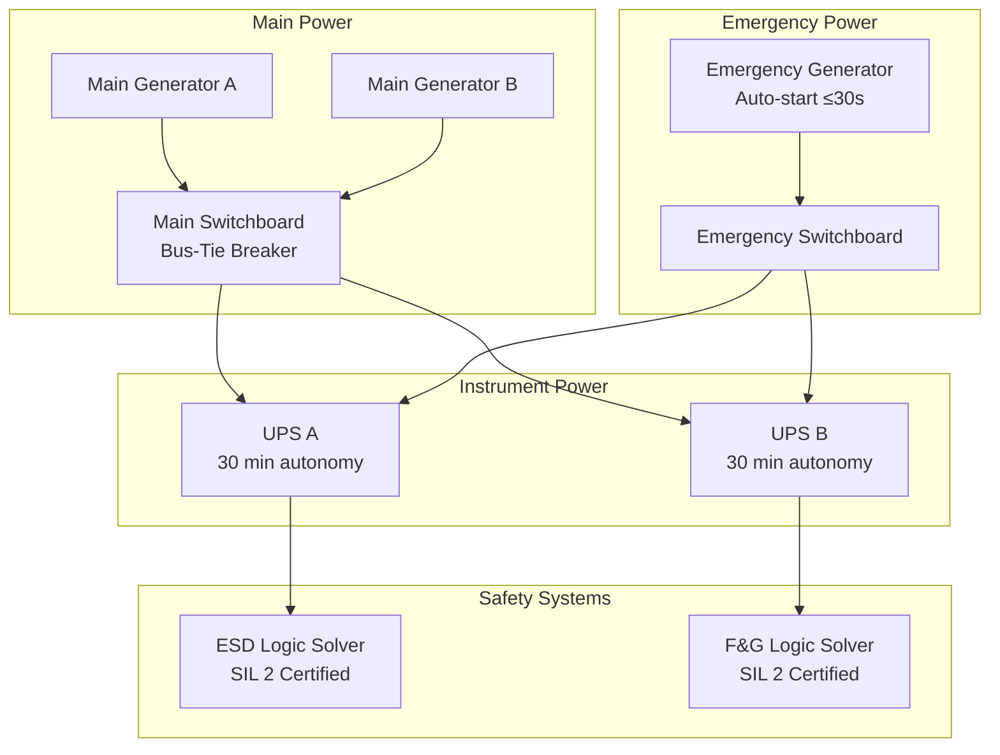

<div class="page-header">
  <span class="page-header__label">Scenario 09</span>
  <h1>Offshore Platform — ESD / F&amp;G / Power Management</h1>
  <span class="badge badge--complete">DNV + ABS Corpus Complete — Phase 12</span>
</div>

## Project Summary

| Field | Detail |
|-------|--------|
| **Application** | Fixed or floating offshore platform with ESD, F&G, and BPCS/DCS |
| **Industry** | Offshore oil and gas |
| **Classification** | DNV or ABS class society approval required |
| **Safety standard** | IEC 61511 (SIS) + IEC 61508 (logic solver foundation) |
| **Hazardous area** | Zone 1 / Zone 2 — IEC 60079 series |
| **Electrical standard** | DNV-OS-D201 or ABS Rules Part 4 |

---

## Standard Stack

| Standard | Role |
|----------|------|
| **DNV-OS-D201 / ABS Part 4** | Primary electrical standard — marine grade, redundancy, class approval |
| **IEC 61511** | SIS application lifecycle — HAZOP through proof testing |
| **IEC 61508** | Logic solver qualification foundation |
| **IEC 60079-0** | Ex equipment marking and selection |
| **IEC 60079-10-1** | Hazardous area zone classification |
| **IEC 60079-11** | IS field instruments |
| **IEC 60079-14** | Ex installation design and verification |
| **IEC 60079-17** | Ex periodic inspection |
| **IEC 60204-1** | Electrical equipment of machines on the platform |

---

## Design Workflow

### Phase 1 — FEED and Class Engagement

```
Step 1: Engage class society at FEED
  - Select classification society: DNV (North Sea / international) or ABS (Gulf of Mexico)
  - Submit safety philosophy and ESD concept for Approval in Principle (AiP)
  - Define class notations required: ESD, F&G (AFLS or SPS), DP class (if applicable)

Step 2: Develop ESD architecture
  - Define ESD levels: ESD-4 (local) → ESD-3 (process shutdown) → ESD-2 (emergency shutdown) → ESD-1 (abandon platform)
  - Develop cause and effect matrix for each ESD level
  - Submit cause and effect matrix to class society for AiP review

Step 3: HAZOP and SIL determination (IEC 61511 §5–9)
  - HAZOP on process systems; identify all SIFs
  - LOPA to determine SIL target for each SIF
  - Define Safety Requirements Specification (SRS)
```

### Phase 2 — Detailed Electrical and SIS Design

```
Step 4: Power system architecture (DNV-OS-D201 §2)
  - Define main switchboard configuration (bus-tie, open or closed bus)
  - Emergency bus: fed from emergency generator; capacity covers ESD, F&G, emergency lighting
  - UPS sizing: ESD logic solver + F&G logic solver; 30-minute autonomy minimum
  - If DP-2/DP-3: dual independent power paths; no single failure loses both buses

Step 5: IT earthing system design
  - Insulated neutral (IT) throughout — no earth return on any distribution circuit
  - Earth fault monitoring relay on every isolated bus segment (24 VDC instrument buses, 230 VAC UPS output)
  - Document: "Electrical Earthing Philosophy" — mandatory deliverable for class submission

Step 6: Hazardous area zone classification (IEC 60079-10-1)
  - Map all hydrocarbon release sources on the platform
  - Define zone extents for drilling areas, wellbay, process deck, pump rooms
  - Produce classified area drawing — submit to class society for approval

Step 7: SIS design (IEC 61511 §10–11)
  - Select safety logic solvers — must have IEC 61508 certificate
  - Design SIF architectures to meet SIL targets (PFDavg calculations)
  - ESD and F&G logic solvers: separate I/O modules, may share hardware platform
  - Power: both from UPS on emergency bus

Step 8: Cable design
  - ESD and F&G circuits: LSOH + fire-resistant (FR) rated cable — IEC 60331 + IEC 60332-3
  - All other circuits: LSOH minimum
  - Separate cable routes for ESD/F&G vs. BPCS where practicable
  - IS cables: separate trays, IS earth ≤1 Ω (zener barrier circuits)
```

### Phase 3 — Procurement and FAT

```
Step 9: Equipment procurement
  - Verify all major equipment against class type approval list (DNV or ABS)
  - Non-approved equipment: initiate project-specific approval submission early
  - Ex equipment: IECEx or ATEX certificates; verify gas group and T-code match classification

Step 10: Factory Acceptance Testing (FAT)
  - ESD FAT: test all cause-and-effect logic end-to-end; class surveyor witnesses
  - F&G FAT: test all detector inputs, voting logic, outputs; class surveyor witnesses
  - UPS FAT: verify autonomy under full load; verify auto-transfer on mains failure
  - Witnessed test records issued by class surveyor — required for class notation
```

### Phase 4 — Offshore Installation and Commissioning

```
Step 11: Ex installation initial verification (IEC 60079-14 §6)
  - Verify all Ex certificates on board and current
  - Inspect cable gland types (Ex d entries), IS earth resistance, entity compliance
  - Issue commissioning certificate

Step 12: SIS SAT (IEC 61511 §12)
  - Site Acceptance Test: repeat ESD and F&G tests after offshore installation
  - Confirm response times with actual cable lengths
  - Witnessed proof test for each SIF before first production

Step 13: Class survey
  - Class surveyor boards platform; verifies installation matches approved drawings
  - Reviews commissioning test records, Ex certificates, FAT witness reports
  - Issues class survey report; class notation confirmed
```

---

## ESD and Power Architecture Diagram



---

## Key Engineering Decisions

**IT earthing: control circuit 0 V must not be connected to earth:**
On offshore platforms with IT earthing, connecting the negative rail of a 24 VDC circuit to earth is a hidden first earth fault. The platform's earth fault monitoring system will alarm, but the alarm will be attributed to the instrument system rather than the root cause. Any subsequent earth fault on the same bus will cause a circuit failure without warning. Design all 24 VDC instrument buses as truly floating; verify with a megohm meter before energising.

**ESD logic solver: separate hardware or common platform?**
Best practice on platforms with DP-class requirements is to use a common hardware platform (chassis, power supplies, communications) but with physically separate I/O modules for ESD and F&G. This reduces hardware count (cost, space, weight) while maintaining functional independence. Verify with class society — DNV and ABS both accept this approach with documented independence justification.

**FAT timing and class surveyor scheduling:**
Class surveyors are in high demand. Plan the FAT 8–10 weeks in advance and confirm surveyor availability before finalising the FAT schedule. A postponed FAT delays the class certificate, which delays project completion. If FAT must be split across multiple locations, coordinate with class society for a multi-location survey plan.

---

<a href="{{ '/industries/offshore/' | relative_url }}" class="card__link">See Offshore industry overlay &rarr;</a>

<a href="{{ '/scenarios/' | relative_url }}" class="card__link">&larr; All scenarios</a>
