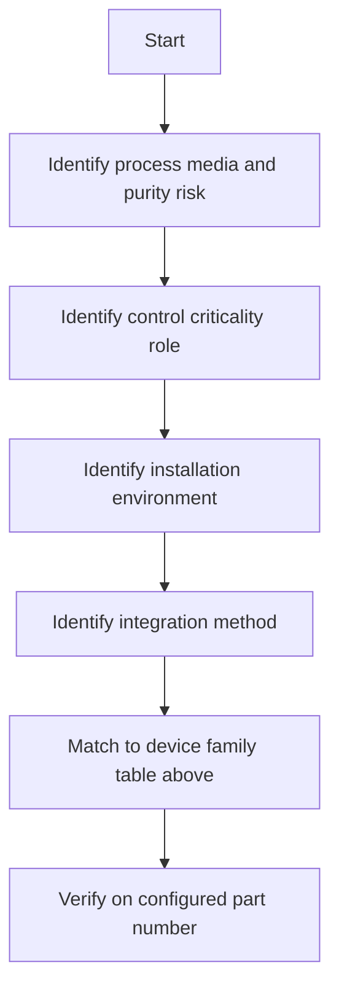
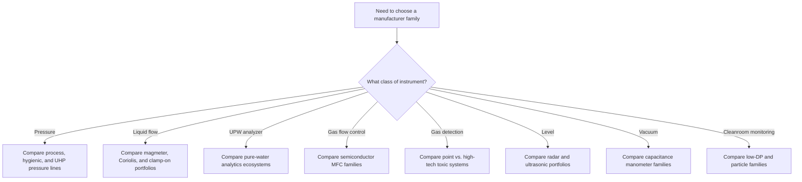
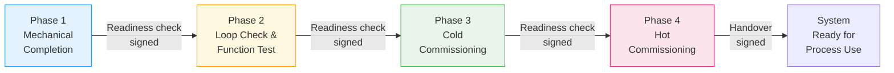
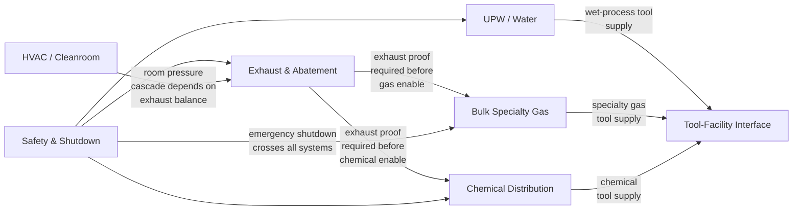
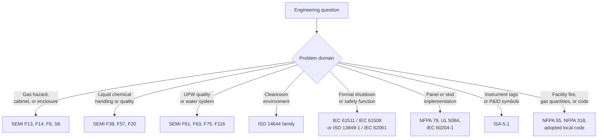

# Phase 23 — Semiconductor Facility Build Sequence Phases 3 & 4 Implementation Plan

> **For agentic workers:** REQUIRED SUB-SKILL: Use superpowers:subagent-driven-development (recommended) or superpowers:executing-plans to implement this plan task-by-task. Steps use checkbox (`- [ ]`) syntax for tracking.

**Goal:** Complete Build Sequence Phases 3 and 4 for the semiconductor facility section — instrument device-family library, vendor comparison, alarm/measurement strategy, commissioning reference, and system-to-system / standards-to-systems crosswalks — all promoted from staging into RAG and rendered as Jekyll site pages.

**Architecture:** Three new instrumentation sub-pages under the existing `/instrumentation/` landing; two new first-level facility pages (`/commissioning/` and `/crosswalks/`); corresponding RAG promotions with AI boundary headers; nav and cross-link wiring. All content derived from `planning/semi_facility/instrumentation/` staging files. No new JS/CSS needed — uses existing `.page-header`, badge, Mermaid, and table styles.

**Tech Stack:** Jekyll 4.2, Liquid templating, Mermaid.js CDN, `docs/_data/navigation.yml` for sidebar, `control-standards/rag/design_framework/semiconductor_facility/` as RAG target.

---

## File Map

### RAG (new promotions)
| File | Source |
|------|--------|
| `control-standards/rag/design_framework/semiconductor_facility/device_family_library.md` | `planning/semi_facility/instrumentation/device_family_map.md` |
| `control-standards/rag/design_framework/semiconductor_facility/vendor_families.md` | `planning/semi_facility/instrumentation/manufacturer_product_family_comparison.md` |
| `control-standards/rag/design_framework/semiconductor_facility/alarm_and_measurement_strategy.md` | `planning/semi_facility/instrumentation/measurement_and_alarm_strategy.md` |
| `control-standards/rag/design_framework/semiconductor_facility/commissioning_reference.md` | New — authored in Task 6 |

### Jekyll (new pages)
| File | URL |
|------|-----|
| `docs/industries/semiconductor/facility/instrumentation/device-families/index.md` | `/industries/semiconductor/facility/instrumentation/device-families/` |
| `docs/industries/semiconductor/facility/instrumentation/vendor-families/index.md` | `/industries/semiconductor/facility/instrumentation/vendor-families/` |
| `docs/industries/semiconductor/facility/instrumentation/alarm-strategy/index.md` | `/industries/semiconductor/facility/instrumentation/alarm-strategy/` |
| `docs/industries/semiconductor/facility/commissioning/index.md` | `/industries/semiconductor/facility/commissioning/` |
| `docs/industries/semiconductor/facility/crosswalks/index.md` | `/industries/semiconductor/facility/crosswalks/` |

### Modified
| File | Change |
|------|--------|
| `docs/industries/semiconductor/facility/instrumentation/index.md` | Add "In this section" nav block + See Also links to 3 sub-pages |
| `docs/industries/semiconductor/facility/index.md` | Add Commissioning and Crosswalks rows to scope table |
| `docs/_data/navigation.yml` | Add 3 instrumentation sub-pages + Commissioning + Crosswalks under facility children |
| `control-standards/rag/design_framework/semiconductor_facility/_index.yaml` | Add 4 new file entries |
| `project_state/project_state.md` | Phase 23 COMPLETE |
| `project_state/change_log.md` | Phase 23 entry |

---

## Task 1: Promote instrumentation staging files to RAG

**Files:**
- Create: `control-standards/rag/design_framework/semiconductor_facility/device_family_library.md`
- Create: `control-standards/rag/design_framework/semiconductor_facility/vendor_families.md`
- Create: `control-standards/rag/design_framework/semiconductor_facility/alarm_and_measurement_strategy.md`

- [ ] **Step 1: Create device_family_library.md**

```bash
cat > "control-standards/rag/design_framework/semiconductor_facility/device_family_library.md" << 'EOF'
<!--
AI_READ_ACCESS: ALLOWED
CONTENT_CLASS: DERIVED_REFERENCE
STATUS: PROMOTED
CATEGORY: SEMI_FACILITY_DEVICE_FAMILIES
SOURCE: planning/semi_facility/instrumentation/device_family_map.md
-->

# Semiconductor Facility Device Family Library

## Purpose

This file groups common instrument device families by engineering function and typical fab utility usage.

## Core device families

| Device family | Typical fab service | Main engineering concern | Typical failure concern |
| --- | --- | --- | --- |
| Pressure transmitters | UPW, chemicals, CDA, gases, exhaust | wetted materials, cleanability, range selection | drift, plugging, diaphragm attack |
| Pressure switches | permissives, fan proof, gas cabinet status | discrete trip point integrity | nuisance trips, hidden setpoint drift |
| Differential pressure transmitters | room cascade, filter loading, exhaust proof | low-range stability, impulse path design | clogging, zero drift |
| Capacitance manometers and vacuum gauges | tool vacuum and low-pressure gas service | pressure regime fit, contamination tolerance | contamination, zero shift |
| Electromagnetic flowmeters | conductive liquids and water systems | conductivity dependence, liner compatibility | coating, grounding issues |
| Coriolis flowmeters | accurate chemical dosing or transfer | compatibility, density effects, cleanability | coating, entrained gas |
| Ultrasonic flowmeters | non-invasive utility monitoring | pipe installation and signal quality | poor coupling, low signal |
| Thermal mass flow sensors | exhaust and gas utilities | gas composition assumptions | fouling, contamination |
| Mass flow controllers and meters | process gas and specialty gas lines | gas calibration, cleanliness, control response | zero drift, contamination |
| Radar and non-contact level | bulk tanks and day tanks | tank geometry, foam, dielectric behavior | false echoes, buildup |
| Point level switches | overfill, backup permissive, dry run protection | compatibility and proof testing | sticking, coating |
| Temperature transmitters and RTDs | UPW, chemicals, cleanroom air | accuracy class, immersion length, cleanability | drift, installation error |
| Conductivity and resistivity analyzers | UPW quality and wastewater | sample system, calibration method, cell constant | fouling, sample temperature effects |
| TOC analyzers | UPW TOC monitoring | sample conditioning, response time | fouling, reagent management |
| pH and ORP sensors | scrubber effluent, chemical neutralization | reference junction, coating, maintenance access | junction fouling, coating |
| Dissolved oxygen sensors | wastewater polishing and cooling | membrane fouling, calibration in process | membrane failure, low signal |
| Gas detectors — electrochemical | toxic gas: HF, Cl2, NH3, HCl, and similar | response time, cross-interference, bump-test discipline | sensor expiry, contamination |
| Gas detectors — photoionization | VOC screening | concentration range, correction factors | lamp fouling, high humidity |
| Gas detectors — infrared | combustible or specific gas | gas-specific calibration | window fouling, humidity effects |
| Particle counters | cleanroom classification | isokinetic sampling, location | sampling errors, maintenance intervals |
| Low-DP transmitters | room cascade, AHU filter loading | range overlap with installation noise | clogging, installation-induced error |

## Notes on selection context

- Device family selection always follows media compatibility first, then control criticality, then integration method.
- See `instrumentation_selection.md` for selection principles and documentation minimums.
- See `instrumentation_use_matrix.md` for per-system device mapping.
- See `vendor_families.md` for manufacturer comparison by measurement class.
EOF
```

- [ ] **Step 2: Create vendor_families.md**

Copy content from staging and add RAG headers:

```bash
head -5 planning/semi_facility/instrumentation/manufacturer_product_family_comparison.md
```

Expected: `<!-- AI_READ_ACCESS: ALLOWED (with caution)` (staging header)

```bash
cat > "control-standards/rag/design_framework/semiconductor_facility/vendor_families.md" << 'RAGEOF'
<!--
AI_READ_ACCESS: ALLOWED
CONTENT_CLASS: DERIVED_REFERENCE
STATUS: PROMOTED
CATEGORY: SEMI_FACILITY_VENDOR_FAMILIES
SOURCE: planning/semi_facility/instrumentation/manufacturer_product_family_comparison.md
-->
RAGEOF
# append content from staging without its existing header block
tail -n +10 planning/semi_facility/instrumentation/manufacturer_product_family_comparison.md >> "control-standards/rag/design_framework/semiconductor_facility/vendor_families.md"
```

- [ ] **Step 3: Create alarm_and_measurement_strategy.md**

```bash
cat > "control-standards/rag/design_framework/semiconductor_facility/alarm_and_measurement_strategy.md" << 'RAGEOF'
<!--
AI_READ_ACCESS: ALLOWED
CONTENT_CLASS: DERIVED_REFERENCE
STATUS: PROMOTED
CATEGORY: SEMI_FACILITY_ALARM_STRATEGY
SOURCE: planning/semi_facility/instrumentation/measurement_and_alarm_strategy.md
-->
RAGEOF
tail -n +10 planning/semi_facility/instrumentation/measurement_and_alarm_strategy.md >> "control-standards/rag/design_framework/semiconductor_facility/alarm_and_measurement_strategy.md"
```

- [ ] **Step 4: Validate AI boundaries on promoted files**

```bash
python3 tools/validate_ai_boundaries.py 2>&1 | tail -20
```

Expected: 0 files failing `AI_READ_ACCESS` check for the three new files.

- [ ] **Step 5: Update _index.yaml**

Read current `control-standards/rag/design_framework/semiconductor_facility/_index.yaml`, then append the three new entries to its `files:` list:

```yaml
  - file: device_family_library.md
    description: "Device family groupings by function and typical fab utility usage"
  - file: vendor_families.md
    description: "Manufacturer product family comparison by measurement class"
  - file: alarm_and_measurement_strategy.md
    description: "Alarm philosophy, utility measurement windows, and alarm class definitions"
```

- [ ] **Step 6: Commit**

```bash
git add control-standards/rag/design_framework/semiconductor_facility/
git commit -m "feat: Phase 23 — promote instrumentation device family, vendor, and alarm strategy to RAG"
```

---

## Task 2: Device Family Library Jekyll page

**Files:**
- Create: `docs/industries/semiconductor/facility/instrumentation/device-families/index.md`

- [ ] **Step 1: Create directory and page**

```bash
mkdir -p docs/industries/semiconductor/facility/instrumentation/device-families
```

- [ ] **Step 2: Write the page**

Create `docs/industries/semiconductor/facility/instrumentation/device-families/index.md`:

```markdown
---
layout: default
title: "Device Family Library"
description: "Instrument device families for semiconductor facility utility systems — grouped by engineering function with typical service, main concerns, and failure modes."
breadcrumb:
  - name: "Industries"
    url: "/industries/"
  - name: "Semiconductor"
    url: "/industries/semiconductor/"
  - name: "Facility Reference"
    url: "/industries/semiconductor/facility/"
  - name: "Instrumentation"
    url: "/industries/semiconductor/facility/instrumentation/"
  - name: "Device Families"
---

<div class="page-header">
  <span class="page-header__label">Semiconductor Facility — Instrumentation</span>
  <h1>Device Family Library</h1>
  <span class="badge badge--new">Phase 23</span>
</div>

This page groups instrument device families by engineering function and typical fab utility usage. Use it to identify which family fits a measurement point before selecting a specific product.

> **Read this correctly:** "Typical service" describes where a family is commonly used in semiconductor fabs — it is not a compatibility guarantee. Always verify wetted materials and service fit on the configured model.

---

## Pressure and Differential Pressure

| Device family | Typical fab service | Main engineering concern | Typical failure concern |
|---|---|---|---|
| Pressure transmitters | UPW, chemicals, CDA, gases, exhaust | wetted materials, cleanability, range selection | drift, plugging, diaphragm attack |
| Pressure switches | permissives, fan proof, gas cabinet status | discrete trip point integrity | nuisance trips, hidden setpoint drift |
| Differential pressure transmitters | room cascade, filter loading, exhaust proof | low-range stability, impulse path design | clogging, zero drift |
| Low-DP transmitters | room pressure cascade, AHU filter loading | range overlap with installation noise | clogging, installation-induced error |
| Capacitance manometers and vacuum gauges | tool vacuum, low-pressure gas service | pressure regime fit, contamination tolerance | contamination, zero shift |

---

## Flow

| Device family | Typical fab service | Main engineering concern | Typical failure concern |
|---|---|---|---|
| Electromagnetic flowmeters | conductive liquids and water systems | conductivity dependence, liner compatibility | coating, grounding issues |
| Coriolis flowmeters | accurate chemical dosing or transfer | compatibility, density effects, cleanability | coating, entrained gas |
| Ultrasonic flowmeters | non-invasive utility monitoring | pipe installation and signal quality | poor coupling, low signal |
| Thermal mass flow sensors | exhaust and gas utilities | gas composition assumptions | fouling, contamination |
| Mass flow controllers and meters | process gas and specialty gas lines | gas calibration, cleanliness, control response | zero drift, contamination |

---

## Level

| Device family | Typical fab service | Main engineering concern | Typical failure concern |
|---|---|---|---|
| Radar and non-contact level | bulk tanks and day tanks | tank geometry, foam, dielectric behavior | false echoes, buildup |
| Point level switches | overfill, backup permissive, dry run protection | compatibility and proof testing | sticking, coating |

---

## Temperature

| Device family | Typical fab service | Main engineering concern | Typical failure concern |
|---|---|---|---|
| Temperature transmitters and RTDs | UPW, chemicals, cleanroom air | accuracy class, immersion length, cleanability | drift, installation error |

---

## Analytical and Water Quality

| Device family | Typical fab service | Main engineering concern | Typical failure concern |
|---|---|---|---|
| Conductivity and resistivity analyzers | UPW quality and wastewater | sample system, calibration method, cell constant | fouling, sample temperature effects |
| TOC analyzers | UPW TOC monitoring | sample conditioning, response time | fouling, reagent management |
| pH and ORP sensors | scrubber effluent, chemical neutralization | reference junction, coating, maintenance access | junction fouling, coating |
| Dissolved oxygen sensors | wastewater polishing and cooling | membrane fouling, calibration in process | membrane failure, low signal |

---

## Gas Detection

| Device family | Typical gas targets | Main engineering concern | Typical failure concern |
|---|---|---|---|
| Electrochemical gas detectors | HF, Cl₂, NH₃, HCl, and similar toxic gases | response time, cross-interference, bump-test discipline | sensor expiry, contamination |
| Photoionization detectors | VOC screening | concentration range, correction factors | lamp fouling, high humidity |
| Infrared gas detectors | combustible or specific gas species | gas-specific calibration | window fouling, humidity effects |

---

## Cleanroom and Environmental

| Device family | Typical fab service | Main engineering concern | Typical failure concern |
|---|---|---|---|
| Particle counters | cleanroom classification and monitoring | isokinetic sampling, sensor location | sampling errors, maintenance intervals |
| Low-DP transmitters | room cascade, AHU filter loading | range overlap with installation noise | clogging, installation-induced error |

---

## Selection Guidance

Device family selection follows this priority order:



**Control criticality roles:**

| Role | Meaning |
|------|---------|
| `SAFETY_TRIP` | initiates isolation, shutdown, or emergency response |
| `PERMISSIVE` | blocks start until a safe precondition is met |
| `CONTROL` | feeds a loop or sequence decision |
| `QUALITY` | confirms process media quality (UPW resistivity, TOC) |
| `MONITORING` | informs operators without directly changing control |

Higher criticality demands tighter requirements for proof, diagnostics, testing access, and ownership assignment.

---

## See Also

- [Instrumentation Reference](../) — selection flow and compliance lenses overview
- [Vendor Families](../vendor-families/) — manufacturer comparison by measurement class
- [Alarm and Measurement Strategy](../alarm-strategy/) — alarm classes, measurement windows, safe-state design
- [Common Control Philosophy](../../control-philosophy/) — permissive and interlock patterns

---

<div class="trust-boundary">
  
</div>
```

- [ ] **Step 3: Build and verify**

```bash
cd docs && ~/.gem/ruby/2.6.0/bin/bundle exec jekyll build 2>&1 | tail -5
```

Expected: `done in X seconds` with no errors. Page file should exist at `_site/industries/semiconductor/facility/instrumentation/device-families/index.html`.

```bash
grep -l "Device Family Library" docs/_site/industries/semiconductor/facility/instrumentation/device-families/index.html
```

Expected: path printed (file exists with expected title content).

- [ ] **Step 4: Commit**

```bash
git add docs/industries/semiconductor/facility/instrumentation/device-families/
git commit -m "feat: Phase 23 — device family library page"
```

---

## Task 3: Vendor Families Jekyll page

**Files:**
- Create: `docs/industries/semiconductor/facility/instrumentation/vendor-families/index.md`

- [ ] **Step 1: Create directory**

```bash
mkdir -p docs/industries/semiconductor/facility/instrumentation/vendor-families
```

- [ ] **Step 2: Write the page**

Create `docs/industries/semiconductor/facility/instrumentation/vendor-families/index.md`:

```markdown
---
layout: default
title: "Vendor and Manufacturer Families"
description: "Manufacturer product family comparison for semiconductor facility instrumentation — organized by measurement class, not by brand."
breadcrumb:
  - name: "Industries"
    url: "/industries/"
  - name: "Semiconductor"
    url: "/industries/semiconductor/"
  - name: "Facility Reference"
    url: "/industries/semiconductor/facility/"
  - name: "Instrumentation"
    url: "/industries/semiconductor/facility/instrumentation/"
  - name: "Vendor Families"
---

<div class="page-header">
  <span class="page-header__label">Semiconductor Facility — Instrumentation</span>
  <h1>Vendor and Manufacturer Families</h1>
  <span class="badge badge--new">Phase 23</span>
</div>

This page compares common manufacturer families by measurement class. It is organized by what they measure — not by brand — so you can compare vendors where they actually compete.

> **How to read this page:** `Best fit` means where a family is strongest based on its public positioning and features. `Watch item` means what typically disqualifies it when the application is more demanding than it looks. This page does not rank vendors by absolute market share except where a vendor makes an explicit public claim.

---

## Vendor Selection Flow



---

## Pressure Transmitters

| Manufacturer | Key product families | Core angle | Best fit | Watch item |
|---|---|---|---|---|
| Emerson / Rosemount | `3051`, `3051S`, `3051HT` | Mature general-purpose and hygienic platform, broad plant familiarity | Facility utilities, skid pressure, level via DP, hygienic skid pressure | Verify wetted parts on the configured model, especially in high-purity liquid service |
| Yokogawa | `EJX A`, `EJX S` | Silicon resonant sensor, focused on long-term accuracy and stability | Water, chemical, gas utility pressure where stable transmitters are preferred | Not a semiconductor UHP specialist family; suits utility boundary, not gas-panel internals |
| WIKA | `HYDRA`, `WUD-2x`, `S-20`, `O-10` | Spread from semiconductor UHP transducers to rugged OEM industrial | UHP gas-panel pressure, compact machine-skid, OEM utility packages | Do not confuse general WIKA industrial lines with semiconductor-UHP lines |
| Endress+Hauser | `Cerabar PMP43`, `PMP71`, `PMP21/23` | Strong process and hygienic portfolio | Chemical and utility pressure, hygienic skid, level by hydrostatic | Process-centric; check contamination fit before assuming semiconductor suitability |

---

## Liquid Flow Measurement

| Manufacturer | Key product families | Core angle | Best fit | Watch item |
|---|---|---|---|---|
| Endress+Hauser | `Promag H`, `Promag H 200/500`, `Promass` | Magmeter strength in lined hygienic and chemical service | Conductive UPW and chemical flow, PFA-lined high-purity lines | Confirm conductivity and material fit; mag is not universal |
| Emerson / Micro Motion | `ELITE`, `G-Series` | Direct mass flow and density, strong diagnostics, compact Coriolis | Precise chemical transfer, blend, dose, or skid flow | Cost, weight, and entrained-gas behavior need per-application review |
| Siemens | `SITRANS FM MAG 3100`, `SITRANS F` | Broad process-industry flow platform, modular transmitter | General process liquid, chemical and water systems | Not purpose-built for semiconductor high-purity duty |
| Emerson / Flexim | Clamp-on ultrasonic | Non-invasive retrofit and verification | Retrofit checks, temporary studies, no-cut-the-line situations | Not first choice for in-line custody of critical control loops at small flows |

---

## Pure-Water Analyzers

| Manufacturer | Key product families | Core angle | Best fit | Watch item |
|---|---|---|---|---|
| METTLER TOLEDO Thornton | `M800`, `770MAX`, `UniCond` | Pure and ultrapure water analytics with semiconductor heritage | UPW resistivity/conductivity, integrated pure-water monitoring | Verify exact sensor is targeted at UPW vs. general pure-water duty |
| Yokogawa | `FLXA402` and conductivity/resistivity family | Modular liquid analyzer, multiple measurement methods | Plants wanting one analyzer family across wastewater, scrubber, and some UPW | Broader focus; sample-system design matters if pushing into most demanding UPW duty |
| Endress+Hauser | `Liquiline` family | Broad multichannel analytical platform | Standardizing one family across water, wastewater, and chemical | Use care in ultrapure applications where semiconductor analytics heritage matters |
| Veolia / Sievers | `M9`, `M500` | TOC-focused water analytics | TOC-critical monitoring and pure-water quality programs | Product discovery is less straightforward; confirm exact semiconductor-fit model early |

---

## Semiconductor Gas Flow Control (MFCs and MFMs)

| Manufacturer | Key product families | Core angle | Best fit | Watch item |
|---|---|---|---|---|
| Brooks Instrument | `GF100`, `GF80`, `GP200`, `GF120xHT`, `5850EM(H)` | Deep semiconductor gas control: thermal, pressure-based, safe-delivery, high-temperature | Etch, deposition, implant, high-purity gas-panel work | Choose carefully between metal-sealed, pressure-based, and elastomer families — not interchangeable |
| HORIBA STEC | `SEC-Z500X`, `S600`, `DZ-107`, `SEC-N100` | Broad semiconductor MFC lineup including multi-range/multi-gas and ultra-thin formats | Dense gas panels, semiconductor OEMs, wide STEC ecosystem | Determine whether duty needs ultra-thin, high-temperature, general-purpose, or multi-range before standardizing |
| MKS Instruments | `GM50A`, `C-Series` | Strong semiconductor and advanced-process heritage; MEMS fast-response option | High-purity gas panels, fast-response non-corrosive gas control | `C-Series` is explicitly for non-corrosive gases only — do not assign to corrosive specialty gas duty |

---

## Fixed Gas Detection

| Manufacturer | Key product families | Core angle | Best fit | Watch item |
|---|---|---|---|---|
| Dräger | `Polytron 7000`, `Polytron 8100 EC` | Robust electrochemical toxic and oxygen detection, broad gas list | Point toxic gas or oxygen monitoring in gas rooms, cabinets, exhausted spaces | Point detectors still need zoning, sample access, and bump-test strategy |
| Honeywell | `Vertex Edge`, Chemcassette, infrared-spectroscopy systems | System-level toxic gas monitoring for high-tech environments | High-tech and semiconductor toxic gas monitoring with remote sampling capability | Portfolio spans full systems — project scope and maintenance burden must be understood early |
| Teledyne Gas & Flame | `DG7`, `OLCT 100` | Multiple sensing technologies: electrochemical, MOS, catalytic/MEMS | Broad industrial toxic/combustible monitoring where one family covers many sensor types | Wide sensor choice requires per-gas technology verification |

---

## Level Measurement

| Manufacturer | Key product families | Core angle | Best fit | Watch item |
|---|---|---|---|---|
| Emerson / Rosemount | `5408` non-contacting radar | Reliable non-contact radar for process and storage tanks | Bulk tanks, day tanks, vessels where contact is undesirable | Confirm dielectric and geometry fit for foam-prone or low-dielectric media |
| Endress+Hauser | `Micropilot FMR series` | Wide radar portfolio from basic storage to advanced process | Standard bulk and process-level needs | Foam and low dielectric can reduce reliability; verify application conditions |
| Vega | `VEGAPULS`, `VEGAFLEX`, `VEGAPOINT` | Radar and guided-wave radar with strong handling of foam, condensate, and aggressive media | Chemical tanks, day tanks, waste collection | Verify guided-wave fit vs. non-contact for specific media and geometry |

---

## Vacuum Gauges and Capacitance Manometers

| Manufacturer | Key product families | Core angle | Best fit | Watch item |
|---|---|---|---|---|
| MKS Instruments | `Baratron` family | Established capacitance manometer with broad process-tool heritage | Process-tool vacuum, low-pressure gas, pressure-based MFC reference | Range selection and gas-independence claims must be checked for the specific subtype |
| INFICON | `CDG series` | Ceramic-diaphragm capacitance manometer with focus on corrosive-gas compatibility | Corrosive and aggressive gas service in semiconductor process tools | Verify exact model for corrosive media; not all CDG variants have the same wetted materials |
| Pfeiffer Vacuum | `CMR series` | Compact capacitance manometer for vacuum and process gas | Process vacuum and low-pressure gas panel measurement | Confirm range, media, and cleaning requirements before deploying in corrosive gas paths |

---

## Cleanroom Environmental Monitoring

| Manufacturer | Key product families | Core angle | Best fit | Watch item |
|---|---|---|---|---|
| Setra Systems (Fortive) | `Model 264`, `Model 267`, `Model 3100` | Room differential pressure with strong cleanroom and controlled-environment positioning | Room cascade and pressure differential monitoring | Low-range stability requires proper placement; door-opening disturbances must be budgeted |
| Dwyer Instruments | `Series 616/616D`, `Photohelic` | Broad low-DP portfolio from basic to differential pressure controllers | HVAC filter loading, pressurization monitoring, general facility | Semiconductor-facility service may have different stability requirements than general HVAC use |
| Lighthouse Worldwide Solutions | `Apex Z`, `Remote` family | Continuous airborne particle counting for cleanroom classification | Online cleanroom monitoring, ISO 14644-2 ongoing verification | Sample tubing, isokinetic design, and periodic instrument validation plan must exist |

---

## See Also

- [Device Family Library](../device-families/) — device family groupings by function and typical service
- [Instrumentation Reference](../) — selection flow and compliance lenses overview
- [Alarm and Measurement Strategy](../alarm-strategy/) — measurement windows and alarm class definitions
- [Common Control Philosophy](../../control-philosophy/) — how instruments connect to control logic

---

<div class="trust-boundary">
  
</div>
```

- [ ] **Step 3: Build and verify**

```bash
cd docs && ~/.gem/ruby/2.6.0/bin/bundle exec jekyll build 2>&1 | tail -5
grep -c "Vendor and Manufacturer" docs/_site/industries/semiconductor/facility/instrumentation/vendor-families/index.html
```

Expected: build clean, grep returns `1`.

- [ ] **Step 4: Commit**

```bash
git add docs/industries/semiconductor/facility/instrumentation/vendor-families/
git commit -m "feat: Phase 23 — vendor and manufacturer families page"
```

---

## Task 4: Alarm and Measurement Strategy Jekyll page

**Files:**
- Create: `docs/industries/semiconductor/facility/instrumentation/alarm-strategy/index.md`

- [ ] **Step 1: Create directory**

```bash
mkdir -p docs/industries/semiconductor/facility/instrumentation/alarm-strategy
```

- [ ] **Step 2: Write the page**

Create `docs/industries/semiconductor/facility/instrumentation/alarm-strategy/index.md`:

```markdown
---
layout: default
title: "Alarm and Measurement Strategy"
description: "Alarm philosophy, utility measurement windows, alarm class definitions, and safe-state design for semiconductor facility utility systems."
breadcrumb:
  - name: "Industries"
    url: "/industries/"
  - name: "Semiconductor"
    url: "/industries/semiconductor/"
  - name: "Facility Reference"
    url: "/industries/semiconductor/facility/"
  - name: "Instrumentation"
    url: "/industries/semiconductor/facility/instrumentation/"
  - name: "Alarm Strategy"
---

<div class="page-header">
  <span class="page-header__label">Semiconductor Facility — Instrumentation</span>
  <h1>Alarm and Measurement Strategy</h1>
  <span class="badge badge--new">Phase 23</span>
</div>

This page provides alarm philosophy, utility measurement guidance, and alarm class definitions for semiconductor facility utility systems. These are engineering planning references — not standards limits and not vendor setpoints.

---

## General Alarm Philosophy

- Define the instrument span around a realistic operating envelope, not around the theoretical maximum.
- Distinguish **operator awareness alarms** from **protective interlocks** and **trips**.
- Prefer independent backup sensing for high-consequence overflow, leak, gas release, or exhaust-loss conditions.
- Record who owns response to each event: operator, PLC sequence, shutdown layer, or facility emergency system.

---

## Alarm Classes

Use a staged model with four distinct classes. Every alarm point must be assigned a class before commissioning:

| Class | Meaning | Typical response |
|-------|---------|-----------------|
| `ADVISORY` | Operator awareness or maintenance attention needed | Log and notify; no automatic action required |
| `ALARM` | Condition outside normal bounds requiring operator response | Alarm annunciation; operator acknowledges and acts |
| `INTERLOCK` | Automatic block on start or next step until condition clears | PLC prevents the action; not a trip — system stays in current state |
| `TRIP` | Immediate transition to safe state | PLC initiates safe-state actions automatically |

---

## Utility Measurement Variables

| Utility domain | Variables that usually matter most | Typical planning concern |
|---|---|---|
| UPW | flow, pressure, resistivity, TOC, temperature | Quality loss can matter more than mechanical failure |
| Bulk chemical | level, flow, pressure, temperature, leak | Containment and compatibility drive shutdown behavior |
| Specialty gas | source pressure, line pressure, flow, exhaust proof, gas detection | Isolation and purge logic dominate |
| Exhaust and scrubber | airflow, differential pressure, fan status, liquid chemistry | Loss of capture is often the real trip condition |
| HVAC and cleanroom | room DP, airflow, temperature, humidity, particle count | Product contamination risk can rise before personnel risk |
| Vacuum and low-pressure | chamber or line pressure, pump status, foreline conditions | Wrong gauge technology can invalidate data |

---

## Planning Ranges by Variable Type

### Liquid utility pressure

- Normal operating windows should stay well inside the calibrated span — leave headroom before relief or trip territory.
- Alarm early enough to protect seals, tubing, and downstream tools.
- Add low-pressure alarms for loss-of-supply or pump failure detection before a dry-run trip becomes necessary.

### Gas utility pressure

- Separate source-storage pressure from cabinet, panel, and process-line pressure — they have different normal ranges and different trip priorities.
- For regulated gas service, the normal operating band is narrow compared with upstream supply.
- Use pressure proof together with valve status and flow expectations, not as a stand-alone signal.

### Temperature

- Chemical compatibility and density effects can change with temperature even when the process appears tolerant.
- Tight control is common for water quality, chemical stability, and cleanroom air temperature.
- For cleanroom air, stability and trend behavior matter more than wide-range capability.

### Flow

- Use separate low-flow alarm and no-flow trip behavior where dry running or loss of utility can damage equipment.
- Continuous flow signals often support both control and equipment-protection logic on the same tag — be explicit about which role has priority.
- Document the gas calibration basis for all gas flow signals.

### Low-range pressure and room differential pressure

- Very low DP measurements are easily corrupted by placement, door motion, and tubing errors.
- Pair room DP strategy with door policy and airflow balance assumptions before finalizing setpoints.
- Document whether the signal is for room classification, process protection, or comfort monitoring — they have different calibration and proof requirements.

### Quality analyzers

- Resistivity, conductivity, TOC, pH, ORP, and particle signals depend on sample-system design as much as analyzer selection.
- Alarm thresholds should reflect analyzer response time and actionability — tight setpoints on slow analyzers generate nuisance alarms.
- Analyzer maintenance state should be visible in the SCADA or HMI so operators know when the quality signal is unavailable or suspect.

---

## Safe-State Design

**Alarm design is incomplete until the safe state is defined.** For semiconductor facility systems, safe state typically means:

| Condition | Typical safe state |
|---|---|
| Chemical leak or overfill | Chemical isolation; drain path to containment |
| Gas release | Gas source isolation; maintained or forced exhaust; purge enabled if appropriate |
| Exhaust loss | Tool permit-to-run removed; process tools notified |
| HVAC loss | Cleanroom pressurization strategy; alarms to facility management |
| Pump or heater fault | Device off unless required for hazard mitigation path |

> Safe state is not always "everything off." For some conditions, maintaining exhaust, keeping a pump running, or keeping a valve open is part of the safe response. Document the intent, not just the action.

---

## Cause and Effect Table Structure

A cause-and-effect (C&E) table assigns every input to a class and documents what it drives:

| Tag | Description | Class | Action | Safe state | Reset authority |
|-----|-------------|-------|--------|-----------|----------------|
| PT-101 | Supply pressure low | `ALARM` | Annunciate | — | Operator |
| PT-101 | Supply pressure low-low | `TRIP` | Close XV-101, disable pump | Pump off, supply isolated | Sequence auto-reset when pressure restores + operator confirm |
| FT-201 | Chemical flow no-flow | `INTERLOCK` | Block pump start | — | Condition clear |
| GAS-301 | Gas detector high | `TRIP` | Close source valve, isolate cabinet | Source isolated, exhaust maintained | Operator, after investigation |

Populate one row per alarm class per tag. A tag with both `ALARM` and `TRIP` levels has two rows.

---

## See Also

- [Instrumentation Reference](../) — selection flow and compliance lenses overview
- [Device Family Library](../device-families/) — device families by function and failure mode
- [Vendor Families](../vendor-families/) — manufacturer comparison by measurement class
- [Safety and Shutdown Architecture](../../safety-shutdown/) — shutdown layers and cause-and-effect design
- [Common Control Philosophy](../../control-philosophy/) — permissive, interlock, and trip patterns

---

<div class="trust-boundary">
  
</div>
```

- [ ] **Step 3: Build and verify**

```bash
cd docs && ~/.gem/ruby/2.6.0/bin/bundle exec jekyll build 2>&1 | tail -5
grep -c "Alarm and Measurement Strategy" docs/_site/industries/semiconductor/facility/instrumentation/alarm-strategy/index.html
```

Expected: build clean, grep returns `1`.

- [ ] **Step 4: Commit**

```bash
git add docs/industries/semiconductor/facility/instrumentation/alarm-strategy/
git commit -m "feat: Phase 23 — alarm and measurement strategy page"
```

---

## Task 5: Update instrumentation landing page with sub-page navigation

**Files:**
- Modify: `docs/industries/semiconductor/facility/instrumentation/index.md`

- [ ] **Step 1: Read current instrumentation index**

Read `docs/industries/semiconductor/facility/instrumentation/index.md` to find the end of the file (the last `<div class="trust-boundary">` block).

- [ ] **Step 2: Add "In This Section" block before the trust-boundary div**

Insert the following block immediately before the `<div class="trust-boundary">` line:

```markdown
---

## In This Section

| Page | What it covers |
|------|---------------|
| [Device Family Library](device-families/) | Device families grouped by function — typical service, main concerns, failure modes |
| [Vendor Families](vendor-families/) | Manufacturer comparison by measurement class: pressure, flow, UPW, MFCs, gas detection, level, vacuum |
| [Alarm and Measurement Strategy](alarm-strategy/) | Alarm philosophy, utility measurement windows, alarm classes, safe-state design |
```

- [ ] **Step 3: Build and verify**

```bash
cd docs && ~/.gem/ruby/2.6.0/bin/bundle exec jekyll build 2>&1 | tail -5
grep -c "In This Section" docs/_site/industries/semiconductor/facility/instrumentation/index.html
```

Expected: build clean, grep returns `1`.

- [ ] **Step 4: Commit**

```bash
git add docs/industries/semiconductor/facility/instrumentation/index.md
git commit -m "feat: Phase 23 — add In This Section nav block to instrumentation landing"
```

---

## Task 6: Create commissioning RAG file

**Files:**
- Create: `control-standards/rag/design_framework/semiconductor_facility/commissioning_reference.md`

- [ ] **Step 1: Write commissioning RAG file**

Create `control-standards/rag/design_framework/semiconductor_facility/commissioning_reference.md`:

```markdown
<!--
AI_READ_ACCESS: ALLOWED
CONTENT_CLASS: DERIVED_REFERENCE
STATUS: AUTHORED
CATEGORY: SEMI_FACILITY_COMMISSIONING
-->

# Semiconductor Facility Utility System Commissioning Reference

## Purpose

This file provides a structured commissioning and startup framework for semiconductor facility utility systems — gas, UPW, chemical, exhaust, and cleanroom. It is a planning reference for commissioning activities, not a replacement for site-specific commissioning procedures.

## Commissioning phases

Semiconductor facility utility commissioning normally follows four phases:

| Phase | Name | Typical scope |
| --- | --- | --- |
| 1 | Pre-commissioning — mechanical completion | piping integrity, instrumentation installation check, control panel installation, grounding and bonding verification |
| 2 | Loop check and functional test | instrument calibration, loop check, valve stroke test, interlock and shutdown function test |
| 3 | Cold commissioning — utility available, no process media | flush and clean, pressure test, DI water functional run, air and nitrogen run, electrical system verification |
| 4 | Hot commissioning — process media introduction | controlled media introduction, startup sequence validation, alarm and trip set-point verification, documentation sign-off |

## Readiness criteria by phase

### Phase 1 — Mechanical completion

Before proceeding to loop check:
- Piping isometrics marked up as-built or confirmed against installation
- Instrument installations checked against data sheets (range, process connection, orientation)
- Control panel and junction box wiring continuity verified
- Grounding continuity verified per NEC or IEC 60204-1 as applicable
- Valve actuators stroked manually and position feedback verified
- All pressure relief valves and rupture disks installed and records signed

### Phase 2 — Loop check and function test

Before proceeding to cold commissioning:
- All instrument loops checked: sensor reads correctly at board, correct tag, correct engineering units
- All discrete inputs verified: status reads correctly at PLC
- All discrete outputs verified: field device responds to forced output
- All interlocks and trips function-tested: input simulated, output verified
- Cause-and-effect table signed off row by row
- Shutdown reset authority verified (who can reset, from where)

### Phase 3 — Cold commissioning

Before introducing process media:
- System flushed clean per applicable specification (UPW systems per SEMI F61 flush protocol; chemical systems per owner specification)
- Leak test completed and documented
- Control valve and modulating valve tuning completed
- Alarm setpoints entered and verified at HMI/SCADA
- Mode and state logic verified: OFF, MANUAL, AUTO transitions work correctly
- Permissive logic verified: system will not start without preconditions met
- Data historian tags confirmed active where required

### Phase 4 — Hot commissioning

Before declaring system ready for process use:
- Media introduction follows a step-by-step, sign-off-controlled sequence
- Startup sequence runs without deviations requiring manual override
- All alarms and trips verified at or near actual setpoint (challenge test preferred over simulation where safe)
- Operating manual updated with actual setpoints and as-found calibration records
- Handover documentation completed and signed

## System-specific commissioning considerations

### Bulk specialty gas systems

- Purge protocol must be completed and recorded before media introduction
- Gas cabinet door and enclosure interlocks must be verified before first fill
- Gas detection system calibration must be completed before media introduction
- Exhaust proof interlock must be verified: system will not allow media introduction without confirmed exhaust

### UPW systems

- Flush volume and flush criteria must be defined and achieved before reclaim valve opens
- Resistivity, TOC, and particle count acceptance criteria must be met before tool supply is enabled
- Sample point verification should confirm that each quality analyzer reads representative product, not stagnant sample

### Liquid chemical systems

- Secondary containment drain path must be verified before media introduction
- Containment sensor function must be verified before media introduction
- Chemical compatibility check for all wetted surfaces must be documented before first use

### Exhaust and abatement systems

- Fan rotation must be verified before any duct pressurization or media introduction
- Airflow balance must be confirmed before cleanroom or gas cabinet exhaust connections are enabled
- Abatement startup must follow the abatement system vendor's sequence, not a generic utility sequence

### HVAC and cleanroom systems

- Balancing must be completed before particle baseline testing
- Room differential pressure cascade must be confirmed: each room relative to adjacent spaces
- ISO 14644 classification test may require post-balancing settling time before formal particle test

## Documentation minimum for commissioning sign-off

- Loop check sheets: one per instrument loop, signed
- Interlock and shutdown test record: one per C&E row, signed
- Calibration certificates or calibration records for all instruments
- Leak test records with acceptance criterion and result
- Flush records where applicable
- As-built redline markups or confirmed as-built drawings
- Startup sequence record (for Hot Commissioning): actual parameters and any deviations documented
- Handover certificate

## Source anchors

- SEMI F61 — guide to design and operation of a semiconductor UPW system
- SEMI S2/S8 — safety guidelines for semiconductor manufacturing equipment
- ISA-5.1 — for loop check and documentation standards
- NFPA 79 — for industrial control panel and machine commissioning context
- IEC 60204-1 — for machine electrical equipment commissioning context
- IEC 61511 — for safety instrumented system proof test and commissioning context where SIL-rated loops are present
```

- [ ] **Step 2: Validate AI boundary**

```bash
python3 tools/validate_ai_boundaries.py 2>&1 | grep "commissioning_reference"
```

Expected: no output (file passes boundary check) or `PASS` indicator.

- [ ] **Step 3: Update _index.yaml**

Add to the `files:` list in `_index.yaml`:

```yaml
  - file: commissioning_reference.md
    description: "Commissioning and startup reference for semiconductor facility utility systems"
```

- [ ] **Step 4: Commit**

```bash
git add control-standards/rag/design_framework/semiconductor_facility/commissioning_reference.md
git add control-standards/rag/design_framework/semiconductor_facility/_index.yaml
git commit -m "feat: Phase 23 — commissioning reference RAG file"
```

---

## Task 7: Commissioning Jekyll page

**Files:**
- Create: `docs/industries/semiconductor/facility/commissioning/index.md`

- [ ] **Step 1: Create directory**

```bash
mkdir -p docs/industries/semiconductor/facility/commissioning
```

- [ ] **Step 2: Write the page**

Create `docs/industries/semiconductor/facility/commissioning/index.md`:

```markdown
---
layout: default
title: "Facility Utility System Commissioning"
description: "Commissioning and startup framework for semiconductor facility utility systems — gas, UPW, chemical, exhaust, and cleanroom. Phase structure, readiness criteria, and documentation minimums."
breadcrumb:
  - name: "Industries"
    url: "/industries/"
  - name: "Semiconductor"
    url: "/industries/semiconductor/"
  - name: "Facility Reference"
    url: "/industries/semiconductor/facility/"
  - name: "Commissioning"
---

<div class="page-header">
  <span class="page-header__label">Semiconductor Facility — Commissioning</span>
  <h1>Facility Utility System Commissioning</h1>
  <span class="badge badge--new">Phase 23</span>
</div>

This page provides a structured commissioning and startup framework for semiconductor facility utility systems — gas, UPW, chemical, exhaust, and cleanroom. It is a planning reference, not a substitute for site-specific commissioning procedures.

---

## Commissioning Phase Structure

Semiconductor facility utility commissioning follows four phases. Each phase has readiness criteria that must be met before advancing.



| Phase | Name | Scope |
|-------|------|-------|
| **1** | Mechanical completion | Piping integrity, instrument installation, panel wiring, grounding, valve stroke check |
| **2** | Loop check and function test | Instrument calibration, loop check, interlock and shutdown function test, C&E sign-off |
| **3** | Cold commissioning | Flush and clean, pressure test, DI water run, air/nitrogen run, alarm setpoints entered |
| **4** | Hot commissioning | Controlled media introduction, startup sequence validation, trip challenge, handover |

---

## Phase 1 — Mechanical Completion

**Readiness before proceeding to Phase 2:**

- [ ] Piping isometrics marked up as-built or confirmed against installation
- [ ] Instrument installations checked against data sheets (range, process connection, orientation)
- [ ] Control panel and junction box wiring continuity verified
- [ ] Grounding continuity verified (NEC or IEC 60204-1 as applicable)
- [ ] Valve actuators stroked manually; position feedback verified
- [ ] All pressure relief valves and rupture disks installed and records signed

---

## Phase 2 — Loop Check and Function Test

**Readiness before proceeding to Phase 3:**

- [ ] All instrument loops checked — sensor reads correctly at board, correct tag, correct engineering units
- [ ] All discrete inputs verified — status reads correctly at PLC
- [ ] All discrete outputs verified — field device responds to forced output
- [ ] All interlocks and trips function-tested — input simulated, output verified
- [ ] Cause-and-effect table signed off row by row
- [ ] Shutdown reset authority verified (who can reset, from where, what preconditions)

---

## Phase 3 — Cold Commissioning

**Readiness before introducing process media:**

- [ ] System flushed clean per specification (UPW per SEMI F61 flush protocol; chemical per owner spec)
- [ ] Leak test completed and documented
- [ ] Control valve and modulating valve tuning completed
- [ ] Alarm setpoints entered and verified at HMI/SCADA
- [ ] Mode and state logic verified — OFF, MANUAL, AUTO transitions work correctly
- [ ] Permissive logic verified — system will not start without preconditions met
- [ ] Data historian tags confirmed active where required

---

## Phase 4 — Hot Commissioning

**Readiness before declaring system ready for process use:**

- [ ] Media introduction follows a step-by-step, sign-off-controlled sequence
- [ ] Startup sequence runs without deviations requiring manual override
- [ ] All alarms and trips verified at or near actual setpoint (challenge test preferred over simulation)
- [ ] Operating manual updated with actual setpoints and as-found calibration records
- [ ] Handover documentation completed and signed

---

## System-Specific Considerations

### Bulk Specialty Gas

- Purge protocol completed and recorded before media introduction
- Gas cabinet and enclosure interlocks verified before first fill
- Gas detection system calibrated before media introduction
- **Exhaust proof interlock verified:** system will not allow media introduction without confirmed exhaust

### UPW Systems

- Flush volume and acceptance criteria met before reclaim valve opens
- Resistivity, TOC, and particle count acceptance criteria met before tool supply enabled
- Sample point verification confirms each analyzer reads representative product, not stagnant sample

### Liquid Chemical Systems

- Secondary containment drain path verified before media introduction
- Containment sensor function verified before media introduction
- Chemical compatibility documented for all wetted surfaces before first use

### Exhaust and Abatement

- Fan rotation verified before duct pressurization or media introduction
- Airflow balance confirmed before cleanroom or gas cabinet exhaust connections enabled
- Abatement startup follows vendor sequence, not a generic utility sequence

### HVAC and Cleanroom

- Balancing completed before particle baseline testing
- Room differential pressure cascade confirmed: each room relative to adjacent spaces
- ISO 14644 classification test may require settling time after balancing before formal particle test

---

## Documentation Minimum for Sign-Off

| Document | One per | Signed by |
|----------|---------|-----------|
| Loop check sheet | Instrument loop | Commissioning engineer |
| Interlock and shutdown test record | C&E row | Commissioning engineer + process owner |
| Calibration certificate or record | Instrument | Calibration technician |
| Leak test record | System or segment | Commissioning engineer |
| Flush record | System | Commissioning engineer (where applicable) |
| As-built markups or confirmed as-builts | Drawing | Responsible engineer |
| Startup sequence record | System | Commissioning engineer |
| Handover certificate | System | Site engineering + operations |

---

## Standards Context

| Standard | Commissioning relevance |
|----------|------------------------|
| SEMI F61 | UPW flush protocol and quality acceptance criteria |
| SEMI S2/S8 | EHS baseline for equipment packages |
| ISA-5.1 | Loop documentation and tag conventions |
| NFPA 79 | Industrial control panel and machine commissioning |
| IEC 60204-1 | Machine electrical equipment commissioning |
| IEC 61511 | Proof test and commissioning requirements for SIL-rated loops |
| ISO 14644-2 | Cleanroom monitoring and ongoing verification |

---

## See Also

- [Safety and Shutdown Architecture](../safety-shutdown/) — cause-and-effect design and shutdown layers
- [Common Control Philosophy](../control-philosophy/) — mode, state, permissive, and interlock patterns
- [Instrumentation Reference](../instrumentation/) — device selection and alarm strategy
- [Tool-Facility Interface](../tool-facility-interface/) — handshake and permit-to-run logic
- [Commissioning Templates](/commissioning-templates/) — general commissioning checklists for panels, drives, and motors

---

<div class="trust-boundary">
  
</div>
```

- [ ] **Step 3: Build and verify**

```bash
cd docs && ~/.gem/ruby/2.6.0/bin/bundle exec jekyll build 2>&1 | tail -5
grep -c "Facility Utility System Commissioning" docs/_site/industries/semiconductor/facility/commissioning/index.html
```

Expected: build clean, grep returns `1`.

- [ ] **Step 4: Commit**

```bash
git add docs/industries/semiconductor/facility/commissioning/
git commit -m "feat: Phase 23 — facility utility system commissioning page"
```

---

## Task 8: System and Standards Crosswalks page

**Files:**
- Create: `docs/industries/semiconductor/facility/crosswalks/index.md`

- [ ] **Step 1: Create directory**

```bash
mkdir -p docs/industries/semiconductor/facility/crosswalks
```

- [ ] **Step 2: Write the page**

Create `docs/industries/semiconductor/facility/crosswalks/index.md`:

```markdown
---
layout: default
title: "Facility Systems and Standards Crosswalks"
description: "System-to-system dependencies and standards-to-systems mapping for semiconductor fab facility engineering — how systems interlock and which standards govern each system."
breadcrumb:
  - name: "Industries"
    url: "/industries/"
  - name: "Semiconductor"
    url: "/industries/semiconductor/"
  - name: "Facility Reference"
    url: "/industries/semiconductor/facility/"
  - name: "Crosswalks"
---

<div class="page-header">
  <span class="page-header__label">Semiconductor Facility — Crosswalks</span>
  <h1>System and Standards Crosswalks</h1>
  <span class="badge badge--new">Phase 23</span>
</div>

This page maps two things: how facility utility systems depend on each other (system-to-system crosswalk), and which standards govern each system (standards-to-systems crosswalk). Both tables are planning tools, not engineering specifications.

---

## System-to-System Dependency Crosswalk

Semiconductor facility utility systems are interdependent. Loss of one system can propagate to others through permissive chains, common shutdowns, and shared infrastructure.



### Dependency Details

| System | Depends on | What breaks if dependency is lost |
|--------|-----------|----------------------------------|
| Bulk Specialty Gas | Exhaust and Abatement | Gas source will not enable; gas cabinet interlocked out |
| Bulk Specialty Gas | Safety and Shutdown | Emergency isolation triggered by area gas alarm or EPO |
| UPW | Safety and Shutdown | High-purity water isolation in emergency conditions |
| Liquid Chemical Distribution | Exhaust and Abatement | Wet-chemistry exhaust must prove before chemical lines enable |
| Liquid Chemical Distribution | Safety and Shutdown | Chemical isolation on leak detection or area emergency |
| HVAC and Cleanroom | Exhaust and Abatement | Room pressure cascade affected by exhaust balance changes |
| Tool-Facility Interface | UPW | No ultrapure water supply = tool cannot run wet process |
| Tool-Facility Interface | Bulk Specialty Gas | No specialty gas supply = tool cannot run gas-dependent process |
| Tool-Facility Interface | Exhaust and Abatement | No exhaust proof = tool permit-to-run removed |
| Tool-Facility Interface | HVAC and Cleanroom | Cleanroom loss affects contamination-sensitive tool operation |

---

## Standards-to-Systems Crosswalk

Each utility system is governed by multiple overlapping standards families. This table maps which standards matter most for each system and why.

| System | Primary standards | Why it matters |
|--------|------------------|---------------|
| **Bulk Specialty Gas** | SEMI F13, F14, F6, S6, NFPA 55, NFPA 318 | Gas source equipment, enclosures, secondary containment, exhaust ventilation, gas quantity limits |
| **UPW and Wastewater** | SEMI F61, F63, F75, F116, F57 | UPW system design, quality at point of use, monitoring, drain segregation, material qualification |
| **Liquid Chemical Distribution** | SEMI F39, F57, F20 | Chemical blending, material qualification for polymer and metallic fluid paths |
| **Exhaust and Abatement** | SEMI S6, NFPA 318, adopted local code | Exhaust ventilation for semiconductor equipment, fab fire protection context |
| **HVAC and Cleanroom** | ISO 14644 family, NFPA 318 | Cleanroom classification and monitoring, fire protection integration |
| **Safety and Shutdown** | IEC 61511, IEC 61508, ISO 13849-1, IEC 62061, SEMI S2/S8 | Safety lifecycle, functional safety design, equipment safety guidelines |
| **Tool-Facility Interface** | SEMI S2/S8, SEMI E5/E30/E37 | Equipment safety, host and equipment communication standards |
| **Control Philosophy (all systems)** | IEC 60204-1, NFPA 79, UL 508A | Machine electrical design, industrial control panels |
| **Instrumentation (all systems)** | ISA-5.1 | Instrument identification, P&ID conventions, tag naming |

---

## Standards Selection by Problem Type

Use the problem-type flow when you have a specific question rather than a specific system:



---

## Standards Depth in This Site

| Standard family | Coverage level | Location |
|----------------|---------------|----------|
| SEMI S2/S8/S14 | Full standards page | [SEMI Standards](/standards/semiconductor/semi/) |
| IEC 61511 | Full standards page | [Functional Safety — IEC 61511](/standards/functional-safety/iec-61511/) |
| IEC 61508 | Full standards page | [Functional Safety — IEC 61508](/standards/functional-safety/iec-61508/) |
| ISO 13849-1 | Full standards page | [Functional Safety — ISO 13849-1](/standards/functional-safety/iso-13849/) |
| IEC 62061 | Full standards page | [Functional Safety — IEC 62061](/standards/functional-safety/iec-62061/) |
| IEC 62443 | Full standards page | [Cybersecurity — IEC 62443](/standards/cybersecurity/iec-62443/) |
| IEC 60204-1 | Full standards page | [Machinery — IEC 60204-1](/standards/machinery/iec-60204/) |
| NFPA 79 | Full standards page | [Machinery — NFPA 79](/standards/machinery/nfpa-79/) |
| ISO 14644 | Referenced, not a full corpus page | Facility section only |
| SEMI F-series (F13, F14, F39, F57, etc.) | Referenced, not individual corpus pages | Facility section only |
| NFPA 55 / NFPA 318 | Referenced, not corpus pages | Facility section only |
| ISA-5.1 | Referenced, not a corpus page | Facility section only |

Standards without corpus pages are referenced in the facility section with enough context to identify the correct entry point. They are not paraphrased or reproduced.

---

## See Also

- [Facility Reference Home](../) — all utility systems overview
- [Safety and Shutdown Architecture](../safety-shutdown/) — shutdown layer design and emergency response
- [Common Control Philosophy](../control-philosophy/) — permissive chains and system state management
- [Commissioning Reference](../commissioning/) — commissioning sequence and readiness criteria
- [Standards Graph](/standards/graph/) — visual map of all standards relationships in this site
- [Crosswalks](/crosswalks/) — IEC 61511 vs. IEC 61508, IEC 60079 vs. NEC Art. 500/505

---

<div class="trust-boundary">
  
</div>
```

- [ ] **Step 3: Build and verify**

```bash
cd docs && ~/.gem/ruby/2.6.0/bin/bundle exec jekyll build 2>&1 | tail -5
grep -c "System and Standards Crosswalks" docs/_site/industries/semiconductor/facility/crosswalks/index.html
```

Expected: build clean, grep returns `1`.

- [ ] **Step 4: Commit**

```bash
git add docs/industries/semiconductor/facility/crosswalks/
git commit -m "feat: Phase 23 — system and standards crosswalks page"
```

---

## Task 9: Navigation, facility index, and cross-links

**Files:**
- Modify: `docs/_data/navigation.yml`
- Modify: `docs/industries/semiconductor/facility/index.md`

- [ ] **Step 1: Update navigation.yml — add instrumentation sub-pages**

Read `docs/_data/navigation.yml`. Find the `Instrumentation` leaf entry under the facility children:

```yaml
            - label: "Instrumentation"
              url: "/industries/semiconductor/facility/instrumentation/"
```

Replace it with:

```yaml
            - label: "Instrumentation"
              url: "/industries/semiconductor/facility/instrumentation/"
              children:
                - label: "Device Families"
                  url: "/industries/semiconductor/facility/instrumentation/device-families/"
                - label: "Vendor Families"
                  url: "/industries/semiconductor/facility/instrumentation/vendor-families/"
                - label: "Alarm Strategy"
                  url: "/industries/semiconductor/facility/instrumentation/alarm-strategy/"
```

- [ ] **Step 2: Update navigation.yml — add Commissioning and Crosswalks under facility**

After the `Instrumentation` block (now with children), add:

```yaml
            - label: "Commissioning"
              url: "/industries/semiconductor/facility/commissioning/"
            - label: "System Crosswalks"
              url: "/industries/semiconductor/facility/crosswalks/"
```

- [ ] **Step 3: Update facility index.md — add rows to scope table**

Read `docs/industries/semiconductor/facility/index.md`. Find the scope table. Add two rows after the `[Instrumentation](instrumentation/)` row:

```markdown
| [Commissioning Reference](commissioning/) | Phase-by-phase commissioning framework, readiness criteria, and documentation minimums |
| [System and Standards Crosswalks](crosswalks/) | System-to-system dependencies and standards-to-systems mapping |
```

- [ ] **Step 4: Build and verify nav structure**

```bash
cd docs && ~/.gem/ruby/2.6.0/bin/bundle exec jekyll build 2>&1 | tail -5
```

Expected: clean build with no link errors.

```bash
grep -c "device-families" docs/_site/industries/semiconductor/facility/instrumentation/index.html
grep -c "commissioning" docs/_site/industries/semiconductor/facility/index.html
```

Expected: both return `1` or more.

- [ ] **Step 5: Commit**

```bash
git add docs/_data/navigation.yml docs/industries/semiconductor/facility/index.md
git commit -m "feat: Phase 23 — wire navigation and facility index for new pages"
```

---

## Task 10: Final build validation and project_state updates

**Files:**
- Modify: `project_state/project_state.md`
- Modify: `project_state/change_log.md`

- [ ] **Step 1: Run full build and count pages**

```bash
cd docs && ~/.gem/ruby/2.6.0/bin/bundle exec jekyll build 2>&1 | grep -E "done in|error|warning"
find docs/_site -name "*.html" | wc -l
```

Expected: clean build, page count ≥ 157 (152 + 5 new pages).

- [ ] **Step 2: Run validation scripts**

```bash
python3 tools/validate_ai_boundaries.py 2>&1 | tail -10
bash tools/validate_reorg.sh all 2>&1 | tail -5
```

Expected: no failures.

- [ ] **Step 3: Update project_state.md**

Update the top block:
- `**Current Phase:**` → `Phase 23 COMPLETE — Semiconductor Facility Build Phases 3 & 4`
- `**Next Phase:**` → `Phase 24 PLANNING — TBD`
- `**Last Updated:**` → today's date
- Update "Current Reality" to reflect new page count and Phase 23 additions.

- [ ] **Step 4: Update change_log.md**

Add entry:

```markdown
## 2026-04-11 — Phase 23: Semiconductor Facility Build Phases 3 & 4

**Type:** Content / Standards Reference
**Status:** Complete

- Promoted 3 instrumentation staging files to RAG corpus (`device_family_library.md`, `vendor_families.md`, `alarm_and_measurement_strategy.md`)
- Authored new `commissioning_reference.md` RAG file
- Built 5 new Jekyll pages:
  - `/instrumentation/device-families/` — device family library grouped by function
  - `/instrumentation/vendor-families/` — manufacturer comparison by measurement class (pressure, flow, UPW, MFCs, gas detection, level, vacuum, cleanroom)
  - `/instrumentation/alarm-strategy/` — alarm philosophy, measurement windows, alarm classes, safe-state design
  - `/commissioning/` — phase-based commissioning framework with readiness criteria and system-specific notes
  - `/crosswalks/` — system-to-system dependency map and standards-to-systems crosswalk
- Added "In This Section" navigation block to instrumentation landing page
- Updated facility index and navigation.yml
- Jekyll build: clean, ~157 pages
```

- [ ] **Step 5: Final commit**

```bash
git add project_state/project_state.md project_state/change_log.md
git commit -m "chore: Phase 23 complete — update project state"
```

---

## Self-Review

### Spec Coverage

| Build Sequence item | Task covering it |
|---------------------|-----------------|
| Instrumentation library by device family | Task 2 — device-families page |
| Common control architectures and shutdown hierarchies | Already in Phase 22 (control-philosophy, safety-shutdown) |
| Alarm, permissive, interlock, and trip patterns | Task 4 — alarm-strategy page + existing control-philosophy |
| Connect system notes to specific manual notes | Tasks 5 + 9 — See Also links and In This Section nav |
| Commissioning, startup, and maintenance references | Tasks 6 + 7 — commissioning RAG + page |
| Tool and facility interface notes | Already in Phase 22 (tool-facility-interface) |
| Crosswalks between systems, instruments, and standards | Task 8 — crosswalks page |

### Placeholder Scan

- No TBD or TODO placeholders in any task.
- All frontmatter fields are fully specified.
- All `git commit` and `jekyll build` commands include expected output.
- All table content is complete and non-placeholder.

### Type Consistency

- All internal links (`../safety-shutdown/`, `../../control-philosophy/`) are consistent with the existing directory structure from Phase 22.
- RAG file names referenced in `_index.yaml` additions match the actual filenames created.
- Badge text `Phase 23` consistent across all new pages.
