# Water/Wastewater Multi-Page Section Implementation Plan

> **For agentic workers:** REQUIRED SUB-SKILL: Use superpowers:subagent-driven-development (recommended) or superpowers:executing-plans to implement this plan task-by-task. Steps use checkbox (`- [ ]`) syntax for tracking.

**Goal:** Build an 8-page water/wastewater reference section covering municipal drinking water and industrial wastewater, with Mermaid diagrams on every page, following the same RAG-first → Jekyll pattern as the semiconductor facility section.

**Architecture:** RAG corpus files authored first under `control-standards/rag/design_framework/water_wastewater/`, then promoted into Jekyll pages under `docs/industries/water-wastewater/`. Navigation wired into `docs/_data/navigation.yml` under the Industries group.

**Tech Stack:** Jekyll 4.2, Liquid templates, Mermaid.js (CDN, already configured), YAML, Markdown.

**Parallelization:** Tasks 2–9 (RAG files) are fully independent and can run in parallel. Tasks 10–17 (Jekyll pages) are fully independent and can run in parallel after their RAG file exists. Task 18 (navigation) runs after all Jekyll pages are complete.

---

## Task 1: Create RAG corpus directory and _index.yaml

**Files:**
- Create: `control-standards/rag/design_framework/water_wastewater/_index.yaml`

- [ ] **Step 1: Create the directory and _index.yaml**

```yaml
# control-standards/rag/design_framework/water_wastewater/_index.yaml
section: water_wastewater
description: >
  Municipal drinking water treatment and industrial wastewater treatment reference.
  Covers intake, filtration, chemical dosing, distribution SCADA, equalization,
  biological treatment, discharge compliance, and instrumentation.
  Authored for Phase 25.
content_class: DERIVED_REFERENCE
ai_read_access: ALLOWED

files:
  - id: ww-overview
    file: overview_and_standards.md
    title: Water/Wastewater Overview and Standards Stack
    summary: Industry overview, standards selection flowchart, and applicability matrix for municipal and industrial water systems

  - id: ww-intake-pumping
    file: intake_and_pumping.md
    title: Intake and Raw Water Pumping
    summary: Pump station control architecture, start permissives, VFD control, and level-based sequencing

  - id: ww-filtration
    file: filtration_and_clarification.md
    title: Filtration and Clarification
    summary: Filter run/backwash state machine, turbidity-driven control, coagulation and flocculation

  - id: ww-chemical-dosing
    file: chemical_dosing.md
    title: Chemical Dosing Systems
    summary: Flow-paced chlorination, coagulant dosing, pH correction, OT shutdown interlocks, chemical feed interlock chain

  - id: ww-distribution-scada
    file: distribution_scada_telemetry.md
    title: Distribution SCADA and Telemetry
    summary: SCADA zone architecture, RTU/PLC telemetry, IEC 62443 security zones, communication failure fallback

  - id: ww-equalization
    file: equalization_and_neutralization.md
    title: Equalization and Neutralization
    summary: Influent equalization basin level control, pH neutralization PID loop, industrial wastewater conditioning

  - id: ww-treatment-discharge
    file: treatment_and_discharge.md
    title: Treatment and Discharge Compliance
    summary: Biological treatment train, secondary clarification, effluent disinfection, permit limit trip logic, EPA CWA compliance

  - id: ww-instrumentation
    file: instrumentation_reference.md
    title: Instrumentation Reference
    summary: Analyzer loop architecture, instrument selection by measurement type, HART/4-20mA wiring, calibration requirements
```

- [ ] **Step 2: Verify directory created**

```bash
ls "control-standards/rag/design_framework/water_wastewater/"
```
Expected: `_index.yaml`

- [ ] **Step 3: Commit**

```bash
git add control-standards/rag/design_framework/water_wastewater/_index.yaml
git commit -m "feat(rag): add water_wastewater corpus directory and _index.yaml"
```

---

## Task 2: RAG — overview_and_standards.md

**Files:**
- Create: `control-standards/rag/design_framework/water_wastewater/overview_and_standards.md`

- [ ] **Step 1: Create the file**

```markdown
<!--
CONTENT_CLASS: DERIVED_REFERENCE
AI_READ_ACCESS: ALLOWED
STATUS: DRAFT
-->

# Water and Wastewater Systems — Overview and Standards Stack

## 0. Purpose

This document provides the standards selection framework and industry overview for municipal drinking water treatment and industrial wastewater treatment control systems. Use it to identify which standards apply to a given project scope and in what order to apply them.

## 1. Industry Scope

Water and wastewater control systems span two related but distinct domains:

**Municipal drinking water** systems treat raw surface or groundwater to potable standards before distribution. Key processes: intake screening, coagulation/flocculation, sedimentation, filtration, disinfection (chlorination or UV), and pressurized distribution. Regulatory driver: EPA Safe Drinking Water Act (SDWA).

**Industrial wastewater** systems treat process effluent before discharge to receiving waters or municipal sewer. Key processes: equalization, pH neutralization, primary clarification, biological treatment (activated sludge, MBR), secondary clarification, polishing, and disinfection. Regulatory driver: EPA Clean Water Act (CWA) — NPDES permit limits.

Many facilities operate both — a manufacturing plant may receive potable water from a municipal supply and treat its own process wastewater before discharge.

## 2. Standards Applicability Matrix

| Standard | Municipal Water | Industrial WW | Notes |
|---|---|---|---|
| IEC 61511 | Required (SIS) | Required (SIS) | Applies to safety instrumented functions: high-level shutdown, chemical OT trips, discharge isolation |
| IEC 62443 | Required (SCADA) | Required (SCADA) | Remote RTU telemetry, HMI access, historian connections |
| ISA-18.2 | Required | Required | Alarm management — rationalization, suppression, alarm priority |
| AWWA M31 | Required | N/A | Distribution system design (municipal only) |
| AWWA M36 | Required | N/A | Water audits, distribution water loss |
| EPA SDWA | Required | N/A | Maximum contaminant levels, treatment technique requirements |
| EPA CWA (NPDES) | N/A | Required | Effluent discharge permit limits: TSS, BOD, pH, TN, TP |
| NFPA 820 | N/A | Required | Hazardous area classification — biological treatment areas generate H₂S and CH₄ |
| NFPA 70 (NEC) | Required | Required | Art. 430 (motors), Art. 820 (wastewater), wet/corrosive wiring |
| IEC 60204-1 | Applicable | Applicable | Machinery electrical equipment for packaged treatment systems |

## 3. Standards Selection Guidance

**Start with IEC 61511** to identify safety instrumented functions (SIFs). Common SIFs in water systems:
- High-level shutdown on raw water storage tanks
- Chlorine OT (over-treatment) trip — closes distribution isolation valve if residual exceeds maximum
- UV failure shutdown — closes bypass valve if UV intensity drops below minimum dose
- Overflow prevention — isolation on equalization basin high-high level

**Apply IEC 62443** wherever SCADA communicates over IP networks, including RTU telemetry, remote HMI access, or historian connections. Identify security zones and conduits between them.

**Apply ISA-18.2** to rationalize alarms on every process loop. Water systems are historically over-alarmed. Each alarm must have: priority, setpoint, deadband, response time, required operator action.

**Apply NFPA 820** to any enclosed biological treatment structure. Anaerobic digestion areas are Class I Division 1 or Division 2 for methane; H₂S is present in all biological treatment areas.

## 4. Control System Architecture Pattern

Water/wastewater plants typically use a distributed PLC architecture with a central SCADA server:
- One or more process PLCs (per treatment unit or building)
- Remote I/O drops for field instruments in outlying pump stations
- RTUs for geographically remote sites (booster stations, reservoirs)
- Central SCADA server with historian
- HMI workstations in control room

Communication: Modbus TCP or EtherNet/IP for local PLCs; DNP3 or ICCP over dedicated WAN for remote RTUs.

## 5. Key Regulatory Interface Points

| Requirement | Regulatory Driver | Control System Role |
|---|---|---|
| Continuous turbidity monitoring post-filter | EPA Surface Water Treatment Rule | AI input to SCADA historian — regulatory record |
| Continuous Cl₂ residual logging | EPA SWTR | AI input with 4-hour rolling average logged |
| NPDES effluent sampling | EPA CWA | Effluent composite sampler triggered by SCADA |
| Backflow prevention proof of compliance | State drinking water regs | Valve position feedback logged by SCADA |
| EQ basin level alarm | Facility discharge permit | High-high level triggers alarm and reporting event |
```

- [ ] **Step 2: Run AI boundary validator**

```bash
cd "/Users/kyawminthu/Dev/Control System Tools"
python3 tools/validate_ai_boundaries.py 2>&1 | tail -5
```
Expected: no new failures (existing baseline must not regress)

- [ ] **Step 3: Commit**

```bash
git add control-standards/rag/design_framework/water_wastewater/overview_and_standards.md
git commit -m "feat(rag): add water/wastewater overview and standards RAG file"
```

---

## Task 3: RAG — intake_and_pumping.md

**Files:**
- Create: `control-standards/rag/design_framework/water_wastewater/intake_and_pumping.md`

- [ ] **Step 1: Create the file**

```markdown
<!--
CONTENT_CLASS: DERIVED_REFERENCE
AI_READ_ACCESS: ALLOWED
STATUS: DRAFT
-->

# Intake and Raw Water Pumping

## 0. Purpose

Control narrative and engineering reference for raw water intake screens, wet wells, and raw water pump stations feeding a water treatment plant. Covers pump start permissives, VFD control, level-based sequencing, and common protection trips.

## 1. System Description

A raw water pump station lifts water from a source (river, reservoir, lake) through a traveling screen or bar screen into a wet well, then pumps it to the treatment plant headworks. Key control elements:

- Traveling screen with motorized drive and differential pressure measurement
- Wet well with level measurement (ultrasonic or submersible pressure transducer)
- 2–4 vertical turbine or centrifugal pumps, typically VFD-driven
- Discharge header with pressure transmitter and check valves
- Suction isolation and discharge isolation valves

## 2. Pump Start Permissive Logic

Before any raw water pump can start, all permissives must be satisfied:

| Permissive | Tag Example | Trip Condition |
|---|---|---|
| Wet well level > Low-Low | LT-101 | < 1.5 m — prevents dry running |
| Suction pressure > minimum | PT-101 | < 15 kPa — suction loss trip |
| VFD ready | VFD-101 Status | Fault present — inhibit start |
| Discharge isolation valve open | ZSO-101 | Valve not confirmed open |
| Motor winding temperature OK | TE-101 | > 120°C — thermal protection |

All permissives are hardwired to the motor control circuit AND mirrored to the PLC for SCADA visibility.

## 3. VFD Speed Control

Raw water pumps use a flow demand signal (from the treatment plant headworks flow meter FT-201) as the primary setpoint. The PLC runs a PID loop:

- **PV:** Headworks flow FT-201 (m³/h)
- **SP:** Target production flow (operator setpoint, typically 60–100% of rated)
- **MV:** VFD speed reference (0–60 Hz)
- **Min speed:** 20 Hz (to prevent sedimentation in suction pipe)
- **Ramp:** 5 Hz/s acceleration, 3 Hz/s deceleration

If flow demand falls below minimum pump flow, the pump steps to the next stage down (multi-pump sequencing) rather than running at minimum speed.

## 4. Multi-Pump Sequencing Logic

Duty/assist/standby sequencing:
1. Lead pump runs to max speed (58 Hz) before assist pump starts
2. Assist pump starts at minimum speed and ramps up
3. If both pumps are at max and flow is still insufficient, operator alarm (no automatic addition beyond 2 pumps without operator action)
4. Standby pump: auto-starts on lead pump fault, lead/lag rotation every 24 hours

## 5. Protection Trips

| Trip | Condition | Action |
|---|---|---|
| Wet well Low-Low | LT-101 < 0.8 m | Stop all pumps immediately |
| Discharge pressure High-High | PT-201 > 700 kPa | Stop pump, alarm — check discharge isolation |
| Motor overcurrent | OL relay | Stop pump, lockout, alarm |
| Traveling screen high dP | PDT-101 > 25 kPa | Alarm — initiate screen wash cycle |
| Loss of suction pressure | PT-101 < 10 kPa | Stop pump, delay 30 s, retry once, then lockout |

## 6. Instrumentation List

| Tag | Instrument Type | Range | Output | Purpose |
|---|---|---|---|---|
| LT-101 | Submersible pressure transducer | 0–5 m | 4-20mA | Wet well level |
| FT-101 | Mag flowmeter | 0–1500 m³/h | 4-20mA + pulse | Raw water flow |
| PT-101 | Gauge pressure transmitter | 0–200 kPa | 4-20mA | Suction pressure |
| PT-201 | Gauge pressure transmitter | 0–1000 kPa | 4-20mA | Discharge header pressure |
| PDT-101 | Differential pressure transmitter | 0–50 kPa | 4-20mA | Screen differential pressure |
| TE-101 | RTD (Pt100) | 0–150°C | 4-wire | Motor winding temperature |
| ZSO-101 | Limit switch | Open/closed | Digital | Discharge valve open feedback |
```

- [ ] **Step 2: Commit**

```bash
git add control-standards/rag/design_framework/water_wastewater/intake_and_pumping.md
git commit -m "feat(rag): add intake and raw water pumping RAG file"
```

---

## Task 4: RAG — filtration_and_clarification.md

**Files:**
- Create: `control-standards/rag/design_framework/water_wastewater/filtration_and_clarification.md`

- [ ] **Step 1: Create the file**

```markdown
<!--
CONTENT_CLASS: DERIVED_REFERENCE
AI_READ_ACCESS: ALLOWED
STATUS: DRAFT
-->

# Filtration and Clarification

## 0. Purpose

Control narrative and engineering reference for gravity filtration, pressure filtration, and sedimentation/clarification in water treatment. Covers the filter run/backwash cycle, turbidity-driven backwash initiation, coagulant dosing integration, and filter-to-waste logic.

## 1. System Description

Water treatment filtration removes suspended solids (floc, particulates, organisms) from clarified water. Common configurations:

- **Rapid gravity filters:** Open concrete beds with sand/anthracite media. Backwashed with air scour + water. Most common in municipal plants.
- **Pressure filters:** Enclosed vessels for smaller systems. Same backwash concept, higher operating pressure.
- **Lamella clarifiers / plate settlers:** Inclined plates or tubes for enhanced sedimentation before filtration.

## 2. Filter Run / Backwash State Machine

A filter cycles through defined states. The PLC state machine manages transitions:

| State | Entry Condition | Exit Condition |
|---|---|---|
| Standby | Manual stop or maintenance | Start command received |
| Filtering | Start command; turbidity OK | dP > setpoint OR time elapsed OR turbidity spike |
| Backwash Initiate | Backwash trigger | Filter effluent valve closed, BW supply open |
| Air Scour | BW supply confirmed | Air scour time complete (typ. 3–5 min) |
| Backwash | Air scour complete | BW flow confirmed, time elapsed (typ. 8–12 min) |
| Rinse | Backwash complete | Filter-to-waste turbidity < 1 NTU |
| Return to Service | Rinse complete | Filter effluent valve opens |

Backwash initiation triggers (any one sufficient):
1. Filter differential pressure > 2.5 m H₂O (head loss accumulation)
2. Filter run time > 24 hours (time-based fallback)
3. Filtered water turbidity > 0.3 NTU (quality-based)

## 3. Turbidity Control Logic

Turbidity is the primary effluent quality indicator in filtration. The control strategy:

**Normal operation:** Turbidity analyzer AT-201 on the filter effluent stream monitors online. Alarm at 0.3 NTU. Trip at 1.0 NTU — filter isolated from clearwell until turbidity clears.

**Backwash trigger on spike:** If AT-201 rises from baseline by > 0.2 NTU in 15 minutes, initiate backwash sequence. Spike indicates media breakthrough or media disturbance.

**Filter-to-waste:** After backwash, effluent is routed to waste (not clearwell) until turbidity drops below 0.2 NTU for 5 consecutive minutes. This prevents backwash water (high TSS) from contaminating the clearwell.

## 4. Coagulant Integration

Upstream coagulant dosing (alum or PAC — see chemical dosing module) directly affects filter performance:

- Under-dosing: Poor floc formation, higher filter loading, shorter runs
- Over-dosing: Excess alum carryover, clearwell pH impact

Jar test results from the lab set the coagulant dose ratio (mg/L per NTU of raw water). The SCADA historian records coagulant dose vs. filtered water turbidity to allow operators to trend and optimize.

## 5. Protection Trips and Alarms

| Tag | Condition | Action |
|---|---|---|
| AT-201 | Filtered turbidity > 1.0 NTU | Close filter effluent valve, alarm, route to waste |
| PDT-201 | Filter head loss > 3.0 m | Alarm — initiate backwash |
| FT-BW | Backwash flow < 80% of setpoint | Alarm — check BW pump/valve |
| LT-BW | Backwash tank Low-Low | Alarm — defer backwash until tank refills |

## 6. Instrumentation List

| Tag | Type | Range | Output | Purpose |
|---|---|---|---|---|
| AT-201 | Nephelometric turbidimeter | 0–10 NTU | 4-20mA | Filter effluent turbidity |
| PDT-201 | Differential pressure transmitter | 0–5 m H₂O | 4-20mA | Filter head loss |
| FT-BW | Mag flowmeter | 0–600 m³/h | 4-20mA | Backwash supply flow |
| LT-BW | Ultrasonic level | 0–5 m | 4-20mA | Backwash tank level |
| AT-RAW | Nephelometric turbidimeter | 0–1000 NTU | 4-20mA | Raw water turbidity (coagulant dose input) |
```

- [ ] **Step 2: Commit**

```bash
git add control-standards/rag/design_framework/water_wastewater/filtration_and_clarification.md
git commit -m "feat(rag): add filtration and clarification RAG file"
```

---

## Task 5: RAG — chemical_dosing.md

**Files:**
- Create: `control-standards/rag/design_framework/water_wastewater/chemical_dosing.md`

- [ ] **Step 1: Create the file**

```markdown
<!--
CONTENT_CLASS: DERIVED_REFERENCE
AI_READ_ACCESS: ALLOWED
STATUS: DRAFT
-->

# Chemical Dosing Systems

## 0. Purpose

Control narrative for chemical dosing systems in water and wastewater treatment: chlorination (disinfection), coagulation/flocculation (solids removal), and pH adjustment. Covers flow-paced dosing with feedback trim, over-treatment (OT) shutdown logic, and chemical feed interlock chain.

## 1. Chlorination — Flow-Paced Dosing with Residual Feedback

Chlorine dosing uses a two-component control strategy:

**Base rate (feedforward):** Dosing pump rate is proportional to the plant flow rate measured by FT-301. This ensures the dose ratio (mg/L) stays approximately constant regardless of flow.

```
Base dose rate (mg/L) = Operator setpoint (typically 1.5–3.0 mg/L free Cl₂)
Pump rate (mL/min) = Base dose rate × Flow (m³/h) × [chemical concentration factor]
```

**Feedback trim (PID):** Chlorine residual analyzer AT-301 (amperometric or colorimetric, post-contact time) measures actual free Cl₂. A PID controller trims the pump rate up or down from the base rate to maintain residual at setpoint (typically 0.5–1.0 mg/L at the sample point).

The trim is limited to ±30% of base rate to prevent the feedback loop from fighting large disturbances (changes in chlorine demand from raw water quality changes).

## 2. Over-Treatment (OT) Shutdown

If the chlorine residual analyzer detects residual above the maximum allowed concentration (typically 4 mg/L for free chlorine under EPA rules), the system must take protective action:

1. **Alarm:** AT-301 > 3.5 mg/L → Alarm "High Cl₂ Residual" (early warning)
2. **Trip:** AT-301 > 4.0 mg/L for > 5 minutes → Close distribution isolation valve XV-301 (hardwired, SIL-rated)
3. **Latch:** XV-301 stays closed — requires operator manual reset
4. **Log:** SCADA records timestamp, residual value, operator ID for regulatory record

The 5-minute delay prevents nuisance trips from analyzer measurement lag. The latching requirement ensures an operator physically acknowledges the condition.

## 3. Coagulant Dosing (Alum / PAC)

Coagulant dose is flow-paced only (no feedback because the quality response is too slow and too noisy for real-time trim):

```
Alum dose (mg/L) = f(raw water turbidity, jar test results)
Pump rate = Dose × Flow × [concentration factor]
```

Dose ratio is set by the operator based on daily jar test results. SCADA provides a trend of raw turbidity vs. dose ratio vs. filtered turbidity to assist optimization.

## 4. pH Correction

pH adjustment is done with lime (Ca(OH)₂ slurry) or soda ash (Na₂CO₃) to raise pH, or CO₂ or H₂SO₄ to lower it. A PID controller with pH analyzer AT-302 at the contact basin outlet:

- **Setpoint:** 7.2–7.8 pH (within EPA secondary MCL range)
- **PV:** AT-302 (glass electrode pH sensor)
- **MV:** Lime slurry pump speed (0–100%)
- **Integral windup protection:** Required — pH is slow to respond (3–5 minute lag from dosing point to analyzer)

## 5. Chemical Feed Interlock Chain

Before any chemical metering pump can run, all interlocks must be clear:

| Interlock | Condition | Action |
|---|---|---|
| Secondary containment OK | Float switch in containment sump | High level — lockout all chemical pumps, alarm |
| Tank level > Low-Low | LT-TANK > 5% | Low-Low — stop pump, alarm "Chemical Supply Low" |
| Flow > minimum | FT-301 > 20 m³/h | No flow — stop dosing (no feed to dilute into) |
| Injection point pressure OK | PT-INJECT > 50 kPa | Low pressure — pump against closed valve — stop pump |

## 6. Instrumentation List

| Tag | Type | Range | Output | Purpose |
|---|---|---|---|---|
| AT-301 | Amperometric Cl₂ analyzer | 0–5 mg/L | 4-20mA | Free chlorine residual (dosing feedback) |
| AT-302 | pH transmitter | 0–14 pH | 4-20mA | pH at contact basin |
| FT-301 | Mag flowmeter | 0–1000 m³/h | 4-20mA + pulse | Plant flow (dosing feedforward) |
| LT-TANK | Float or guided wave radar | 0–100% | 4-20mA | Chemical tank level |
| FT-302 | Variable area or mag | 0–10 L/min | 4-20mA | Chemical feed flow confirmation |
| XV-301 | Motor-operated valve | Open/close | DO + DI feedback | Distribution isolation (SIL-rated trip) |
```

- [ ] **Step 2: Commit**

```bash
git add control-standards/rag/design_framework/water_wastewater/chemical_dosing.md
git commit -m "feat(rag): add chemical dosing RAG file"
```

---

## Task 6: RAG — distribution_scada_telemetry.md

**Files:**
- Create: `control-standards/rag/design_framework/water_wastewater/distribution_scada_telemetry.md`

- [ ] **Step 1: Create the file**

```markdown
<!--
CONTENT_CLASS: DERIVED_REFERENCE
AI_READ_ACCESS: ALLOWED
STATUS: DRAFT
-->

# Distribution SCADA and Telemetry

## 0. Purpose

Control and communications architecture for municipal water distribution systems: SCADA server, RTUs at remote pump stations and reservoirs, historian, HMI, and cybersecurity zone design per IEC 62443.

## 1. System Architecture

A typical distribution SCADA system has four layers:

| Layer | Components | Protocol |
|---|---|---|
| Field | Sensors, actuators, local control panels | 4-20mA, Modbus RTU, hardwired |
| Site control | PLCs / RTUs at each pump station, reservoir | Modbus TCP or EtherNet/IP (local LAN) |
| SCADA | Central SCADA server, historian, HMI | OPC-UA, Modbus TCP, DNP3 (to remote RTUs) |
| Enterprise | Billing, reporting, lab LIMS | REST API via DMZ, manual export |

Remote sites (booster stations, elevated storage tanks, pressure zones) connect to the SCADA server via dedicated radio, cellular, or fiber WAN. DNP3 is common for RTU-to-SCADA because it supports unsolicited reporting and handles communication gaps gracefully.

## 2. IEC 62443 Security Zone Design

Water distribution SCADA is critical infrastructure. Apply IEC 62443 zone and conduit model:

| Zone | Assets | Security Level |
|---|---|---|
| Zone 0 — Field | Sensors, actuators, valve positioners | SL 1 |
| Zone 1 — Control | PLCs, RTUs, local HMIs | SL 2 |
| Zone 2 — Supervisory | SCADA server, historian, engineering workstation | SL 2 |
| Zone 3 — Enterprise | IT network, billing systems | SL 1 |

Conduit rules:
- Zone 0 → Zone 1: Hardwired or dedicated serial; no IP at Zone 0
- Zone 1 → Zone 2: Firewall with whitelist rules; no direct internet access
- Zone 2 → Zone 3: DMZ with unidirectional data diode for historian export; no inbound from Zone 3 to Zone 2
- Remote access: VPN gateway in Zone 2 DMZ; MFA required; session logging

## 3. Remote Site Telemetry

Each remote site (booster pump station, elevated storage tank, pressure reducing valve vault) runs an RTU or small PLC with:

- Local control capability (runs on last known setpoints if comms fail)
- Heartbeat register updated every 30 seconds
- Unsolicited reporting of alarm states (DNP3 or MQTT to SCADA)
- Local data logging (circular buffer, 7-day minimum) in case of comms outage

SCADA polls each RTU every 10 seconds for analog values; alarm events are unsolicited (reported immediately on state change).

## 4. Communication Failure Fallback

If a remote site stops communicating:

1. **0–60 seconds:** SCADA continues to display last-known values (stale data indicator shown on HMI)
2. **60 seconds:** SCADA generates "Communication Loss" alarm for that site
3. **5 minutes:** SCADA changes site status to "Offline — Local Control Active"
4. **At site:** RTU falls back to local control mode — maintains last setpoints, runs on local timers and local alarms
5. **Recovery:** On comms restoration, RTU syncs time, uploads buffered log, transitions back to remote SCADA control

## 5. Historian and Regulatory Logging

The historian must retain:
- All analog values at 1-minute resolution, minimum 2 years
- All alarm events with timestamp, value, operator acknowledgment — minimum 5 years (EPA Surface Water Treatment Rule)
- Turbidity and Cl₂ residual data with 4-hour rolling average (reportable to state primacy agency)
- System startup/shutdown events

Historian export to the state primacy reporting portal: monthly CSV export, manually triggered or automated via DMZ API.

## 6. Instrumentation List (Distribution)

| Tag | Type | Range | Output | Purpose |
|---|---|---|---|---|
| PT-DIST | Gauge pressure transmitter | 0–1000 kPa | 4-20mA | Distribution zone pressure |
| FT-DIST | Mag flowmeter | 0–2000 m³/h | 4-20mA + pulse | Zone metering |
| LT-TANK | Ultrasonic or float | 0–15 m | 4-20mA | Elevated storage tank level |
| AT-DIST | Amperometric Cl₂ | 0–2 mg/L | 4-20mA | Distribution residual (regulatory) |
| ZSO/ZSC | Limit switches | Open/closed | Digital | PRV and isolation valve position |
```

- [ ] **Step 2: Commit**

```bash
git add control-standards/rag/design_framework/water_wastewater/distribution_scada_telemetry.md
git commit -m "feat(rag): add distribution SCADA and telemetry RAG file"
```

---

## Task 7: RAG — equalization_and_neutralization.md

**Files:**
- Create: `control-standards/rag/design_framework/water_wastewater/equalization_and_neutralization.md`

- [ ] **Step 1: Create the file**

```markdown
<!--
CONTENT_CLASS: DERIVED_REFERENCE
AI_READ_ACCESS: ALLOWED
STATUS: DRAFT
-->

# Equalization and Neutralization

## 0. Purpose

Control narrative for industrial wastewater equalization basins and pH neutralization systems. Equalization dampens flow and concentration variations before downstream treatment. Neutralization brings pH within range for biological treatment or direct discharge.

## 1. Equalization Basin Control

The equalization (EQ) basin receives variable-flow, variable-quality industrial wastewater from the facility. Its job is to hold the flow and blend it, then release a steady, consistent flow to downstream treatment.

**Level-based control states:**

| State | Level Range | Action |
|---|---|---|
| Receiving | Any | Influent enters freely (gravity or pumped) |
| Normal Pumping | 40–80% | Transfer pump runs at constant rate setpoint |
| High Level | 80–90% | Alarm, increase transfer pump rate to max |
| High-High Level | > 90% | Alarm, close influent valve if controllable (spill prevention) |
| Low Level | 20–40% | Transfer pump at minimum rate |
| Low-Low Level | < 10% | Stop transfer pump, alarm |

**Mixer control:** Submersible mixers run continuously while basin has > 20% level to prevent solids settlement. Mixers stop below 10% level (suction air entrainment risk).

## 2. pH Neutralization System

Industrial wastewater pH can vary widely (acid wash rinses at pH 2, caustic cleaning at pH 12). Neutralization uses a cascade of 2–3 agitated tanks with reagent dosing at each stage:

**Stage 1 — Coarse neutralization:** Large dose of NaOH (caustic) or H₂SO₄ (sulfuric acid) based on pH analyzer AT-501 at the tank inlet. Setpoint: bring pH to 5–9 range.

**Stage 2 — Fine neutralization:** Small trim dose based on AT-502 at the second tank. Setpoint: 6.5–8.5 (discharge permit range).

**pH PID loop considerations:**
- pH is a nonlinear variable (logarithmic scale) — PID requires gain scheduling or a linearized model
- Residence time in neutralization tank creates dead time — integral windup protection essential
- Sample AT near the outlet, not the inlet to the tank
- Minimum reagent pump flow to prevent crystallization in lines during low-demand periods

**Reagent safety interlocks:**
- Secondary containment high-level float switch — locks out all reagent pumps
- Reagent tank Low-Low level — stops corresponding pump, alarm
- Dosing confirmation flow switch on each reagent line — alarm on no-flow within 30 seconds of pump start

## 3. Effluent pH Monitoring and Discharge Hold

After neutralization, AT-503 (final effluent pH) is the regulatory monitoring point. If pH is outside 6.0–9.0:

1. Close effluent valve to the sewer or receiving water
2. Alarm and page operator
3. Divert to EQ basin for re-treatment
4. Operator must acknowledge and manually reset effluent valve

This is typically a SIL 1 safety instrumented function (SIF) per IEC 61511. The pH trip must have separate safety logic from the process control PID loop.

## 4. Instrumentation List

| Tag | Type | Range | Output | Purpose |
|---|---|---|---|---|
| LT-501 | Submersible pressure transducer | 0–5 m | 4-20mA | EQ basin level |
| AT-501 | pH transmitter (glass electrode) | 0–14 pH | 4-20mA | EQ basin inlet pH |
| AT-502 | pH transmitter | 0–14 pH | 4-20mA | Neutralization stage 2 pH |
| AT-503 | pH transmitter | 0–14 pH | 4-20mA | Final effluent pH (SIF input) |
| FT-501 | Mag flowmeter | 0–200 m³/h | 4-20mA | Transfer pump flow |
| FT-REAGENT | Variable area flowmeter | 0–20 L/min | Local / switch | Reagent dose flow confirmation |
| XV-EFFLUENT | Motor-operated valve | Open/close | DO + DI | Effluent isolation (SIF) |
```

- [ ] **Step 2: Commit**

```bash
git add control-standards/rag/design_framework/water_wastewater/equalization_and_neutralization.md
git commit -m "feat(rag): add equalization and neutralization RAG file"
```

---

## Task 8: RAG — treatment_and_discharge.md

**Files:**
- Create: `control-standards/rag/design_framework/water_wastewater/treatment_and_discharge.md`

- [ ] **Step 1: Create the file**

```markdown
<!--
CONTENT_CLASS: DERIVED_REFERENCE
AI_READ_ACCESS: ALLOWED
STATUS: DRAFT
-->

# Treatment and Discharge Compliance

## 0. Purpose

Control narrative for biological wastewater treatment (activated sludge and MBR), secondary clarification, effluent disinfection, and discharge permit compliance logic. Covers permit limit trip logic, effluent diversion, and EPA CWA NPDES compliance record-keeping.

## 1. Treatment Train Overview

The standard activated sludge treatment train:

1. **Primary clarification** — gravity settling; removes 50–70% of TSS, 30–40% of BOD. Sludge to digester.
2. **Aeration / biological treatment** — aerobic bacteria consume dissolved organics. DO setpoint 2.0 mg/L. Blower control via dissolved oxygen (DO) PID loop.
3. **Secondary clarification** — bacteria settle as activated sludge. Return activated sludge (RAS) is pumped back to aeration basin. Waste activated sludge (WAS) is sent to thickening/dewatering.
4. **Tertiary filtration** — polishing (sand or membrane) to meet low TSS permit limits.
5. **Disinfection** — UV or chlorination to meet effluent fecal coliform limits.

**MBR (membrane bioreactor)** replaces secondary clarifier + tertiary filtration with submerged membranes in the aeration basin. Permeate is disinfected directly. MBR requires transmembrane pressure (TMP) monitoring and periodic membrane backpulse and chemical clean-in-place (CIP).

## 2. Dissolved Oxygen (DO) Control — Aeration

The aeration blowers supply air to diffusers in the biological basin. DO control loop:

- **PV:** DO analyzer AT-601 (optical or galvanic cell), measured near mid-basin outlet
- **SP:** 2.0 mg/L (typical; adjusted seasonally)
- **MV:** Blower speed (VFD, 0–60 Hz) or inlet vane position
- **Cascade:** Multiple blowers with lead/lag logic; lead blower VFD-modulated, assist blower staged on/off

DO below 1.0 mg/L causes filamentous bulking (poor settleability). DO above 4.0 mg/L is energy waste with no treatment benefit.

## 3. Return and Waste Activated Sludge (RAS/WAS)

- **RAS:** Continuous pump from secondary clarifier underflow to aeration basin inlet. Rate typically 50–100% of influent flow. Controlled manually or by sludge blanket level in clarifier.
- **WAS:** Periodic wasting to maintain mixed liquor suspended solids (MLSS) at target (2,000–4,000 mg/L). SCADA calculates daily WAS volume based on MLSS, SRT (solids retention time), and influent TSS. Operator approves WAS event.

## 4. Effluent Quality Monitoring

Online analyzers monitor the final effluent continuously:

| Parameter | Analyzer | Typical Permit Limit | Action on Exceedance |
|---|---|---|---|
| TSS | Optical turbidity/TSS | 30 mg/L (monthly avg) | Alarm, increase polymer dose |
| pH | pH transmitter | 6.0–9.0 SU | Trip — close effluent valve |
| Dissolved Cl₂ | Amperometric | < 0.1 mg/L (post-dechlorination) | Alarm — check dechlorination |
| DO (effluent) | Optical DO | > 5.0 mg/L (some permits) | Alarm |

Lab grab samples confirm online analyzers weekly. SCADA provides composite sampler trigger signals (time-proportional or flow-proportional).

## 5. Discharge Permit Trip Logic

If any parameter exceeds its permit limit continuously for > 10 minutes:

1. SCADA closes effluent isolation valve XV-601
2. SCADA activates effluent diversion pump — sends flow back to equalization basin (if capacity available) or to emergency storage
3. SCADA generates a regulatory exceedance alarm event — logged with timestamp, parameter, value, duration
4. Operator must acknowledge; if EQ basin is full, operator must contact regulatory agency per permit conditions
5. XV-601 remains closed until manually reset by operator after parameter returns to compliance

This is a SIL 1 function (per IEC 61511): single-channel pH trip with independent alarm on the same sensor, or 2oo3 voting for higher-criticality permits.

## 6. NPDES Compliance Record-Keeping

The SCADA historian must log:
- All effluent analyzer values at 15-minute intervals (minimum)
- All exceedance events with start/stop time and duration
- Composite sampler trigger log (for lab sample chain of custody)
- Blower run hours and sludge wasting events
- Permit limit exceedance notifications sent (for DMR — Discharge Monitoring Report)

Monthly DMR is submitted to the EPA or state primacy agency. SCADA generates the data; permit holder reviews and submits.

## 7. Instrumentation List

| Tag | Type | Range | Output | Purpose |
|---|---|---|---|---|
| AT-601 | Optical DO sensor | 0–20 mg/L | 4-20mA | Aeration basin DO (blower control) |
| AT-602 | Online TSS/turbidity | 0–500 mg/L | 4-20mA | Final effluent TSS |
| AT-603 | pH transmitter | 0–14 pH | 4-20mA | Final effluent pH (trip SIF) |
| AT-604 | Amperometric Cl₂ | 0–2 mg/L | 4-20mA | Residual chlorine (post-dechlor) |
| FT-601 | Mag flowmeter | 0–500 m³/h | 4-20mA + pulse | Final effluent flow (NPDES reporting) |
| XV-601 | Motor-operated valve | Open/close | DO + DI | Effluent isolation (SIF) |
| LT-SC | Sludge blanket detector | 0–5 m | 4-20mA | Secondary clarifier sludge blanket |
```

- [ ] **Step 2: Commit**

```bash
git add control-standards/rag/design_framework/water_wastewater/treatment_and_discharge.md
git commit -m "feat(rag): add treatment and discharge compliance RAG file"
```

---

## Task 9: RAG — instrumentation_reference.md

**Files:**
- Create: `control-standards/rag/design_framework/water_wastewater/instrumentation_reference.md`

- [ ] **Step 1: Create the file**

```markdown
<!--
CONTENT_CLASS: DERIVED_REFERENCE
AI_READ_ACCESS: ALLOWED
STATUS: DRAFT
-->

# Instrumentation Reference — Water and Wastewater Systems

## 0. Purpose

Instrument selection guide for water and wastewater treatment systems. Covers measurement types, technology selection criteria, loop architecture (4-20mA + HART), calibration requirements, and material compatibility for corrosive and abrasive process streams.

## 1. Measurement Types and Technology Selection

### Flow Measurement

| Technology | Best For | Avoid When |
|---|---|---|
| Electromagnetic (mag) flowmeter | Clean water, slurries with conductivity > 5 µS/cm | Non-conductive fluids (distillate, DI water) |
| Ultrasonic (clamp-on or inline) | Clean liquids, retrofits, no process intrusion | High-solids slurry (signal scattering) |
| Open channel (Parshall flume / V-notch weir + ultrasonic level) | Gravity flow — influent channels, return sludge | Pressurized pipes |
| Vortex flowmeter | Steam, clean gases | Low-flow or highly viscous applications |

**Magnetic flowmeters** are the workhorse of water/WW. Key selection criteria: liner material (PTFE for chemical streams, rubber for slurries), electrode material (316SS for clean water, Hastelloy for chlorine service).

### Level Measurement

| Technology | Best For | Avoid When |
|---|---|---|
| Submersible pressure transducer | Wet wells, open basins, clean liquids | Aerated basins (bubbles cause error) |
| Ultrasonic level | Open tanks, wet wells with foam risk | Dusting or condensation (signal loss) |
| Guided wave radar (GWR) | Closed tanks, chemical storage | Coating or crystallizing media |
| Float switch | Simple high/low point detection | Continuous level |

### Water Quality Analyzers

| Parameter | Technology | Key Consideration |
|---|---|---|
| pH | Glass electrode | Calibrate with 2-point buffer daily; replace electrode every 6–12 months |
| Free chlorine | Amperometric (DPD reagent or membrane) | Sample conditioning required; flow cell must be maintained clean |
| Turbidity | Nephelometric (ISO 7027 method, 90° scatter) | Calibrated with Formazin or StablCal; bubble-free sample path |
| Dissolved oxygen | Optical (luminescent quenching) or galvanic | Optical preferred — no electrolyte replacement, faster response |
| Conductivity | 4-electrode toroidal | Minimal fouling; good for monitoring TDS and breakthrough detection |
| TOC | UV/persulfate oxidation | High maintenance; used for regulatory monitoring, not continuous control |
| H₂S | Electrochemical | Required in biological treatment confined spaces; alarm, not control |

## 2. Loop Architecture — 4-20mA + HART

Standard loop for all process transmitters:

```
Transmitter → 2-wire loop (4-20mA) → Barrier/isolator → AI card (PLC)
HART signal → Multiplexed over same 2-wire pair → Asset management system
```

**Intrinsically safe barriers** required where instruments are in NFPA 820 classified areas (biological treatment, digester areas). Use Zener barriers (passive) or galvanic isolators (active) — active preferred for HART passthrough.

**HART benefits in water/WW:**
- Remote calibration verification without disconnecting loop
- Device status and diagnostics to asset management (e.g., Emerson AMS, ABB Ability)
- Secondary variables (e.g., uncompensated flow, process temperature from same flowmeter)

## 3. Material Compatibility

| Process Stream | Wetted Material | Avoid |
|---|---|---|
| Potable water | 316 SS, PTFE, NSF-61 certified elastomers | Lead, unlined cast iron |
| Chlorine solution (NaOCl) | CPVC, PVDF, Hastelloy C276 | 304 SS, carbon steel (corrodes rapidly) |
| Alum / PAC solution | CPVC, rubber-lined | 316 SS (pitting in high chloride + acid) |
| Caustic (NaOH) | 316 SS, HDPE, CPVC | Aluminum, zinc |
| H₂SO₄ (dilute, < 50%) | HDPE, FRP, rubber-lined | Stainless steel |
| Activated sludge / slurry | Rubber-lined, PTFE-lined mag | Bare 316 SS (erosion) |
| Digester gas (CH₄/CO₂/H₂S) | 316 SS, Hastelloy | Carbon steel (H₂S corrosion) |

## 4. Calibration Requirements

| Instrument | Calibration Frequency | Method | Regulatory Driver |
|---|---|---|---|
| pH analyzer | Daily zero/span verification; 2-point calibration weekly | pH 4.0 and 7.0 buffers | State drinking water regs |
| Turbidity analyzer | Daily verification; Formazin calibration monthly | Calibration standard | EPA SWTR |
| Cl₂ residual analyzer | Daily grab sample comparison | Hach method or equivalent | EPA SWTR |
| Flow meter (mag) | Annual bench calibration or loop validation | Portable ultrasonic check | Regulatory metering |
| DO analyzer | Daily membrane check; calibration against air saturation | 100% air saturation method | Good practice |

## 5. Instrument Tagging Convention

Follow ISA-5.1 tagging:
- First letter: measured variable (L=Level, F=Flow, A=Analyzer, P=Pressure, T=Temperature)
- Second letter: modifier or readout (T=Transmitter, C=Controller, I=Indicator, S=Switch)
- Loop number: sequential by process area

Examples: `LT-101` (Level Transmitter, loop 101), `AT-301` (Analyzer Transmitter, loop 301), `FIC-201` (Flow Indicating Controller, loop 201)
```

- [ ] **Step 2: Commit**

```bash
git add control-standards/rag/design_framework/water_wastewater/instrumentation_reference.md
git commit -m "feat(rag): add instrumentation reference RAG file"
```

---

## Task 10: Jekyll — water-wastewater/index.md (Overview)

**Files:**
- Create: `docs/industries/water-wastewater/index.md`

- [ ] **Step 1: Create the Jekyll overview page**

```markdown
---
layout: default
title: "Water and Wastewater Systems"
description: "Municipal drinking water and industrial wastewater treatment control systems reference — standards stack, SCADA architecture, and system-by-system engineering guidance."
breadcrumb:
  - name: "Industries"
    url: "/industries/"
  - name: "Water/Wastewater"
related_standards:
  - name: "IEC 61511"
    url: "/standards/functional-safety/iec-61511/"
  - name: "IEC 62443"
    url: "/standards/cybersecurity/iec-62443/"
---

<div class="page-header">
  <span class="page-header__label">Industry Reference — Water and Wastewater</span>
  <h1>Water and Wastewater Systems</h1>
  <span class="badge badge--complete">Phase 25</span>
</div>

<blockquote>
<strong>Scope:</strong> This section covers control systems engineering for municipal drinking water treatment and industrial wastewater treatment. Standards selection, SCADA architecture, safety instrumented systems, and per-system control narratives with engineering diagrams.
</blockquote>

## Standards Selection

Use this flowchart to identify which standards apply to your project:

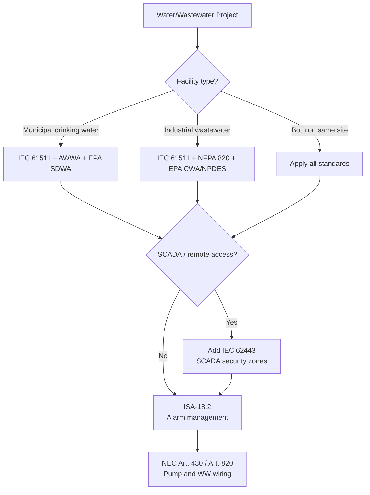

## Standards Applicability Matrix

| Standard | Municipal Water | Industrial WW | Notes |
|---|---|---|---|
| IEC 61511 | Required | Required | SIL for chemical OT, overflow prevention, discharge trips |
| IEC 62443 | Required | Required | SCADA security zones and conduits |
| ISA-18.2 | Required | Required | Alarm rationalization |
| AWWA M31/M36 | Required | — | Distribution system design, water audits |
| EPA SDWA | Required | — | Maximum contaminant levels and treatment technique requirements |
| EPA CWA (NPDES) | — | Required | Effluent permit limits: TSS, BOD, pH, TN, TP |
| NFPA 820 | — | Required | Hazardous area classification — H₂S and CH₄ in biological treatment |
| NFPA 70 / NEC | Required | Required | Art. 430 (motors), Art. 820 (wastewater), wet environment wiring |

## In This Section

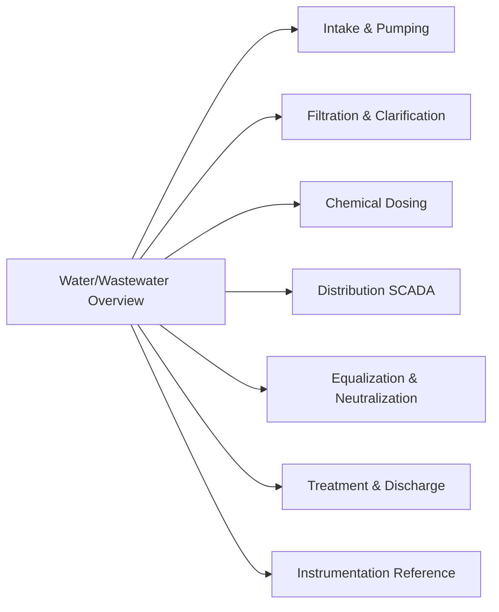

| Page | Covers |
|---|---|
| [Intake & Raw Water Pumping](./intake-pumping/) | Pump station control, start permissives, VFD sequencing |
| [Filtration & Clarification](./filtration-clarification/) | Filter run/backwash cycle, turbidity control, coagulation |
| [Chemical Dosing](./chemical-dosing/) | Chlorination, coagulant dosing, pH correction, OT shutdown |
| [Distribution SCADA](./distribution-scada/) | SCADA zones, RTU telemetry, IEC 62443 security, fallback logic |
| [Equalization & Neutralization](./equalization-neutralization/) | EQ basin sequencing, pH neutralization PID, industrial WW |
| [Treatment & Discharge](./treatment-discharge/) | Activated sludge, DO control, effluent quality trips, NPDES |
| [Instrumentation Reference](./instrumentation/) | Analyzer loops, instrument selection, HART, calibration |

## Related Pages

- [IEC 61511 — Functional Safety](/standards/functional-safety/iec-61511/)
- [Lifecycle Stage 4 — Detailed Design](/lifecycle/stage-04/)
- [Lifecycle Stage 6 — Commissioning](/lifecycle/stage-06/)
- [Petroleum / Oil & Gas](/industries/petroleum/) — similar SIS approach
```

- [ ] **Step 2: Verify Jekyll build is clean**

```bash
cd "/Users/kyawminthu/Dev/Control System Tools/docs"
~/.gem/ruby/2.6.0/bin/bundle exec jekyll build 2>&1 | tail -10
```
Expected: `done in X.XXX seconds` with no errors or warnings.

- [ ] **Step 3: Commit**

```bash
git add docs/industries/water-wastewater/index.md
git commit -m "feat(site): add water/wastewater overview Jekyll page"
```

---

## Task 11: Jekyll — intake-pumping/index.md

**Files:**
- Create: `docs/industries/water-wastewater/intake-pumping/index.md`

- [ ] **Step 1: Create the page**

```markdown
---
layout: default
title: "Intake and Raw Water Pumping"
description: "Control system reference for raw water intake screens, wet wells, and pump stations — start permissives, VFD control, and level-based sequencing."
breadcrumb:
  - name: "Industries"
    url: "/industries/"
  - name: "Water/Wastewater"
    url: "/industries/water-wastewater/"
  - name: "Intake & Pumping"
---

<div class="page-header">
  <span class="page-header__label">Water/Wastewater — System Reference</span>
  <h1>Intake and Raw Water Pumping</h1>
</div>

<blockquote>
<strong>Scope:</strong> Raw water intake screens, wet wells, and pump stations that lift raw water to the treatment plant headworks. Covers pump start permissives, VFD speed control, multi-pump sequencing, and protection trips.
</blockquote>

## Standards Applicability

| Standard | Role in this system |
|---|---|
| IEC 61511 | SIL assessment for wet well Low-Low shutdown (prevents pump damage, dry run) |
| ISA-18.2 | Alarm rationalization — screen dP, suction pressure, motor temperature |
| NEC Art. 430 | Motor branch circuit protection and overload sizing |
| AWWA M17 | Pump station design reference (suction conditions, NPSH, pipe sizing) |

## Pump Station Control Architecture

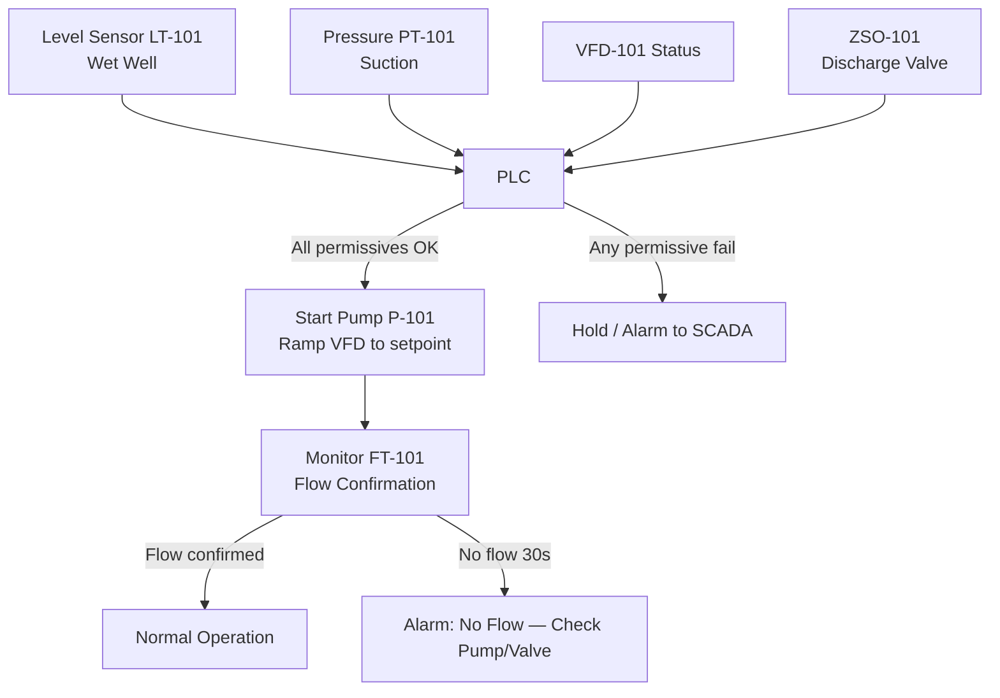

## Start Permissive Chain

All permissives must be satisfied before any pump start command is accepted. Hardwired to motor control circuit AND mirrored in PLC for SCADA visibility.

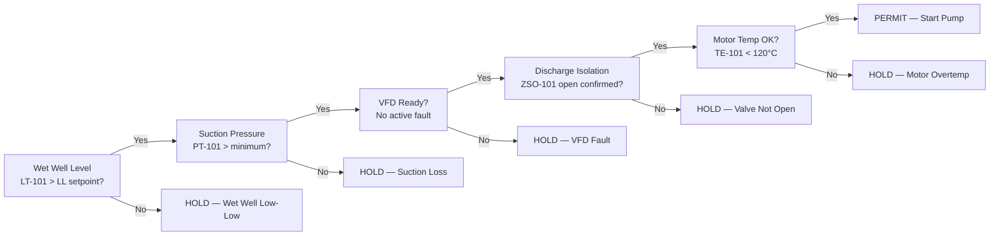

## VFD Speed Control

Raw water pumps run on a flow demand PID loop:

| Parameter | Value |
|---|---|
| Process variable (PV) | Headworks flow FT-201 (m³/h) |
| Setpoint (SP) | Operator-set target production flow |
| Manipulated variable (MV) | VFD speed reference (0–60 Hz) |
| Minimum speed | 20 Hz (prevents suction pipe sedimentation) |
| Acceleration ramp | 5 Hz/s |
| Deceleration ramp | 3 Hz/s |

## Key Engineering Decisions

**Why hardwire the Low-Low level interlock?**
Dry running a vertical turbine pump destroys the pump within seconds. The Low-Low shutdown is a SIF per IEC 61511 — the logic must be in the safety layer (hardwired or Safety PLC), not relying on the process PLC to respond in time.

**Multi-pump sequencing:** Lead pump ramps to 58 Hz before assist pump starts. This prevents simultaneous starting inrush and avoids hunting between pumps. Lead/lag rotation occurs every 24 hours to equalize wear.

**NPSH margin:** Verify net positive suction head available (NPSHA) is ≥ NPSHR + 0.5 m margin at all wet well levels, including Low-Low. Document in pump data sheet.

## Cross-Links

- [Filtration & Clarification](../filtration-clarification/) — downstream of intake
- [Lifecycle Stage 4 — Detailed Design](/lifecycle/stage-04/)
- [Lifecycle Stage 6 — Commissioning](/lifecycle/stage-06/)
- [IEC 61511](/standards/functional-safety/iec-61511/)
```

- [ ] **Step 2: Commit**

```bash
git add docs/industries/water-wastewater/intake-pumping/index.md
git commit -m "feat(site): add intake and raw water pumping Jekyll page"
```

---

## Task 12: Jekyll — filtration-clarification/index.md

**Files:**
- Create: `docs/industries/water-wastewater/filtration-clarification/index.md`

- [ ] **Step 1: Create the page**

```markdown
---
layout: default
title: "Filtration and Clarification"
description: "Control system reference for gravity filtration, pressure filtration, and clarification — filter run/backwash state machine, turbidity control, and coagulant integration."
breadcrumb:
  - name: "Industries"
    url: "/industries/"
  - name: "Water/Wastewater"
    url: "/industries/water-wastewater/"
  - name: "Filtration & Clarification"
---

<div class="page-header">
  <span class="page-header__label">Water/Wastewater — System Reference</span>
  <h1>Filtration and Clarification</h1>
</div>

<blockquote>
<strong>Scope:</strong> Rapid gravity filters, pressure filters, and lamella clarifiers. Filter run/backwash state machine, turbidity-driven backwash initiation, filter-to-waste logic, and coagulant dosing integration.
</blockquote>

## Standards Applicability

| Standard | Role in this system |
|---|---|
| EPA SWTR | Turbidity < 0.3 NTU in 95% of measurements; < 1 NTU at all times — continuous logging required |
| ISA-18.2 | Alarm priority for turbidity spike, head loss alarm, backwash tank low |
| IEC 61511 | SIF: Filter effluent isolation if turbidity > 1.0 NTU (protects clearwell from contamination) |

## Filter Run / Backwash State Machine

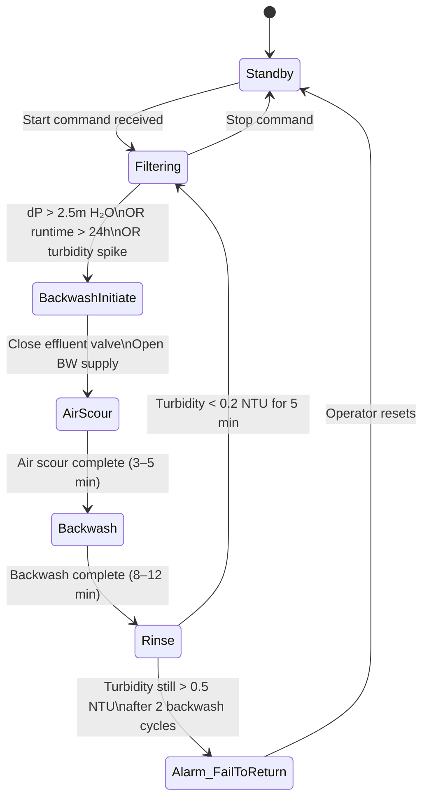

## Turbidity-Driven Filter Bypass Logic

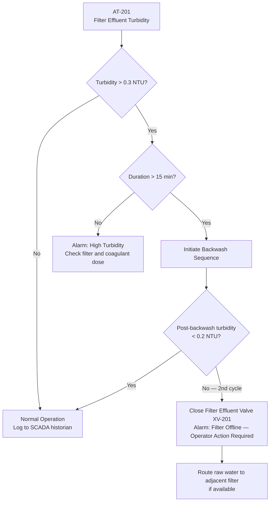

## Key Engineering Decisions

**Filter-to-waste is non-negotiable after backwash.** Backwash water contains the TSS and organisms removed from the media. Returning this to the clearwell would spike turbidity and could compromise disinfection efficacy. Route to backwash recovery basin or drain — not clearwell.

**Multiple filter sequencing:** Do not backwash more than one filter simultaneously (reduces plant capacity). Stagger backwash triggers by 2-hour minimum offset between filters.

**Turbidity analyzer location:** Sample point must be downstream of the filter bed, upstream of the clearwell. Dead time between the filter and the analyzer determines PID response time.

## Cross-Links

- [Chemical Dosing](../chemical-dosing/) — upstream coagulant affects filter loading
- [Instrumentation Reference](../instrumentation/) — turbidimeter selection and calibration
- [IEC 61511](/standards/functional-safety/iec-61511/)
```

- [ ] **Step 2: Commit**

```bash
git add docs/industries/water-wastewater/filtration-clarification/index.md
git commit -m "feat(site): add filtration and clarification Jekyll page"
```

---

## Task 13: Jekyll — chemical-dosing/index.md

**Files:**
- Create: `docs/industries/water-wastewater/chemical-dosing/index.md`

- [ ] **Step 1: Create the page**

```markdown
---
layout: default
title: "Chemical Dosing Systems"
description: "Control system reference for water treatment chemical dosing — flow-paced chlorination, coagulant dosing, pH correction, over-treatment shutdown, and chemical feed interlock chain."
breadcrumb:
  - name: "Industries"
    url: "/industries/"
  - name: "Water/Wastewater"
    url: "/industries/water-wastewater/"
  - name: "Chemical Dosing"
---

<div class="page-header">
  <span class="page-header__label">Water/Wastewater — System Reference</span>
  <h1>Chemical Dosing Systems</h1>
</div>

<blockquote>
<strong>Scope:</strong> Chlorination (disinfection), coagulant/flocculant dosing, and pH correction. Flow-paced dosing with residual feedback trim, over-treatment (OT) shutdown safety logic, and the chemical feed interlock chain.
</blockquote>

## Standards Applicability

| Standard | Role in this system |
|---|---|
| EPA SDWA | MCL for disinfection byproducts; SWTR residual requirements at distribution entry |
| IEC 61511 | OT shutdown (XV-301 isolation valve) is a SIF — SIL 1 minimum |
| ISA-18.2 | Alarm rationalization: low residual (early warning), OT alarm, containment high |
| NFPA 70 (NEC) | Chemical room wiring — GFCI in wet areas, corrosion-resistant conduit |

## Dosing Loop — Flow-Paced with Residual Feedback Trim

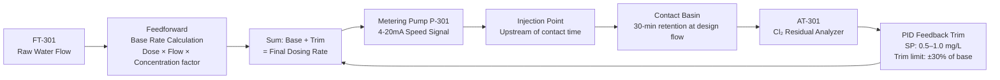

## Chlorine Over-Treatment Shutdown Logic

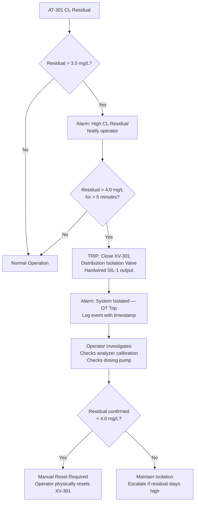

## Chemical Feed Interlock Chain

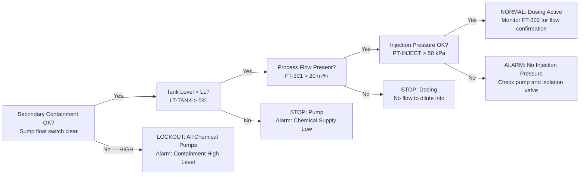

## Key Engineering Decisions

**Why a 5-minute delay on the OT trip?** Chlorine residual analyzers have 2–4 minute response lag due to sample transport and measurement time. A spike reading lasting < 5 minutes is likely an analyzer artifact or short disturbance, not a true system OT condition.

**Why latch the XV-301 closure?** An unacknowledged OT condition could represent a dosing system fault. Forcing a manual reset ensures an operator physically inspects before the system returns to service. This is an IEC 61511 requirement for SIL-rated trips.

**Coagulant dose — no feedback loop:** Turbidity response to coagulant takes 20–40 minutes through the treatment train. Real-time feedback would be unstable. Use jar test results to set dose ratio; use operator trend review to optimize.

## Cross-Links

- [Filtration & Clarification](../filtration-clarification/) — filter performance depends on coagulant dose
- [Instrumentation Reference](../instrumentation/) — Cl₂ analyzer selection and calibration
- [IEC 61511](/standards/functional-safety/iec-61511/)
```

- [ ] **Step 2: Commit**

```bash
git add docs/industries/water-wastewater/chemical-dosing/index.md
git commit -m "feat(site): add chemical dosing Jekyll page"
```

---

## Task 14: Jekyll — distribution-scada/index.md

**Files:**
- Create: `docs/industries/water-wastewater/distribution-scada/index.md`

- [ ] **Step 1: Create the page**

```markdown
---
layout: default
title: "Distribution SCADA and Telemetry"
description: "SCADA architecture for municipal water distribution systems — RTU telemetry, IEC 62443 security zones, historian logging, and communication failure fallback."
breadcrumb:
  - name: "Industries"
    url: "/industries/"
  - name: "Water/Wastewater"
    url: "/industries/water-wastewater/"
  - name: "Distribution SCADA"
related_standards:
  - name: "IEC 62443"
    url: "/standards/cybersecurity/iec-62443/"
---

<div class="page-header">
  <span class="page-header__label">Water/Wastewater — System Reference</span>
  <h1>Distribution SCADA and Telemetry</h1>
</div>

<blockquote>
<strong>Scope:</strong> SCADA system architecture for municipal water distribution — central SCADA server, RTUs at remote pump stations and reservoirs, historian, HMI, and IEC 62443 security zone design. Covers communication failure fallback and regulatory logging requirements.
</blockquote>

## Standards Applicability

| Standard | Role in this system |
|---|---|
| IEC 62443 | SCADA security zones, conduit design, remote access controls |
| ISA-18.2 | Alarm management for communication loss, site offline |
| EPA SDWA | Continuous logging of Cl₂ residual and turbidity (4-hour rolling average) |
| NIST CSF | Cybersecurity framework — identify, protect, detect, respond, recover |

## SCADA Zone Architecture

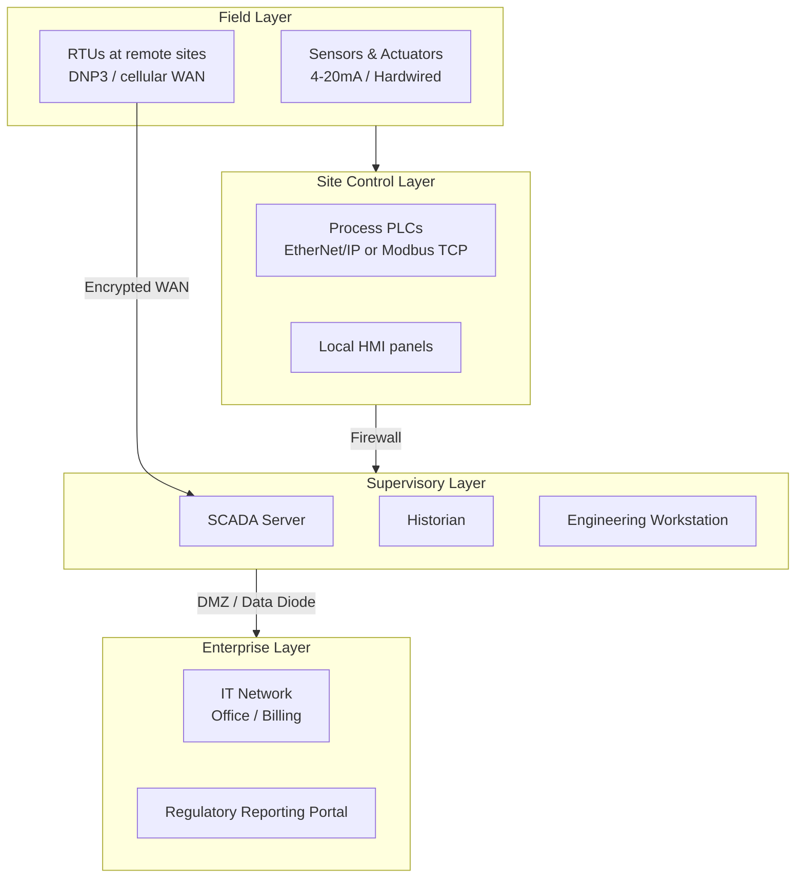

## IEC 62443 Security Zone Map

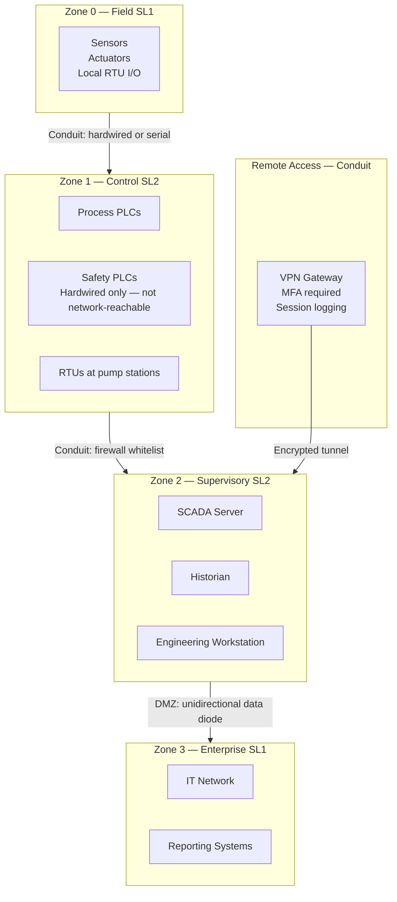

## Communication Failure Fallback Logic

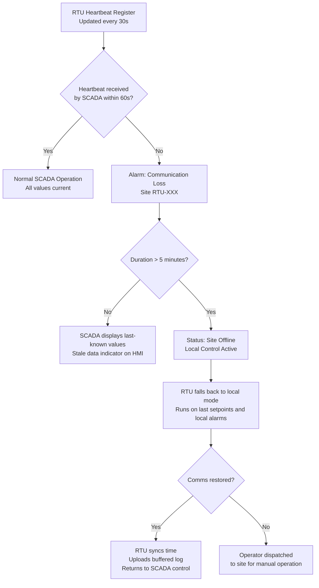

## Historian Retention Requirements

| Data Type | Resolution | Retention | Driver |
|---|---|---|---|
| All analog values | 1-minute | 2 years | Good practice |
| Turbidity (post-filter) | 15-second | 2 years | EPA SWTR — 4-hr rolling avg |
| Cl₂ residual | 1-minute | 2 years | EPA SWTR — continuous record |
| Alarm events | Event-driven | 5 years | Regulatory audit readiness |
| Operator actions | Event-driven | 5 years | Audit trail |
| System start/stop | Event-driven | 5 years | Maintenance record |

## Key Engineering Decisions

**Why DNP3 for remote RTUs?** DNP3 handles communication gaps gracefully — RTUs buffer data locally and upload on reconnect. It also supports unsolicited reporting (RTU pushes alarms to SCADA immediately rather than waiting for a poll).

**Data diode for enterprise export:** A unidirectional security gateway allows historian data to flow to IT/reporting systems without allowing any inbound access to the OT network. This is the IEC 62443 conduit between Zone 2 and Zone 3.

**Safety PLCs are hardwired only:** The IEC 61511 safety logic (OT shutdown, overflow prevention) is hardwired, not networked. Even if the SCADA network is compromised, safety trips remain functional.

## Cross-Links

- [IEC 62443 — Cybersecurity](/standards/cybersecurity/iec-62443/)
- [Chemical Dosing](../chemical-dosing/) — OT trip wired to safety layer, not SCADA
- [Lifecycle Stage 4 — Detailed Design](/lifecycle/stage-04/)
```

- [ ] **Step 2: Commit**

```bash
git add docs/industries/water-wastewater/distribution-scada/index.md
git commit -m "feat(site): add distribution SCADA and telemetry Jekyll page"
```

---

## Task 15: Jekyll — equalization-neutralization/index.md

**Files:**
- Create: `docs/industries/water-wastewater/equalization-neutralization/index.md`

- [ ] **Step 1: Create the page**

```markdown
---
layout: default
title: "Equalization and Neutralization"
description: "Control system reference for industrial wastewater equalization basins and pH neutralization systems — level-based state machine, pH PID loop, and discharge hold logic."
breadcrumb:
  - name: "Industries"
    url: "/industries/"
  - name: "Water/Wastewater"
    url: "/industries/water-wastewater/"
  - name: "Equalization & Neutralization"
---

<div class="page-header">
  <span class="page-header__label">Water/Wastewater — System Reference</span>
  <h1>Equalization and Neutralization</h1>
</div>

<blockquote>
<strong>Scope:</strong> Industrial wastewater equalization basins and pH neutralization systems. Equalization dampens flow and pH variation before downstream biological treatment. Neutralization brings pH within permit range for discharge or further treatment.
</blockquote>

## Standards Applicability

| Standard | Role in this system |
|---|---|
| IEC 61511 | SIF: Final effluent pH out-of-range closes discharge valve (SIL 1) |
| EPA CWA (NPDES) | Permit pH limit typically 6.0–9.0; discharge hold logic must be documented |
| ISA-18.2 | Alarm priority for High-High level, pH out-of-range, containment alarm |
| NFPA 820 | If equalization basin is enclosed — evaluate for H₂S generation (acid WW + organic) |

## Equalization Basin Level Control State Machine

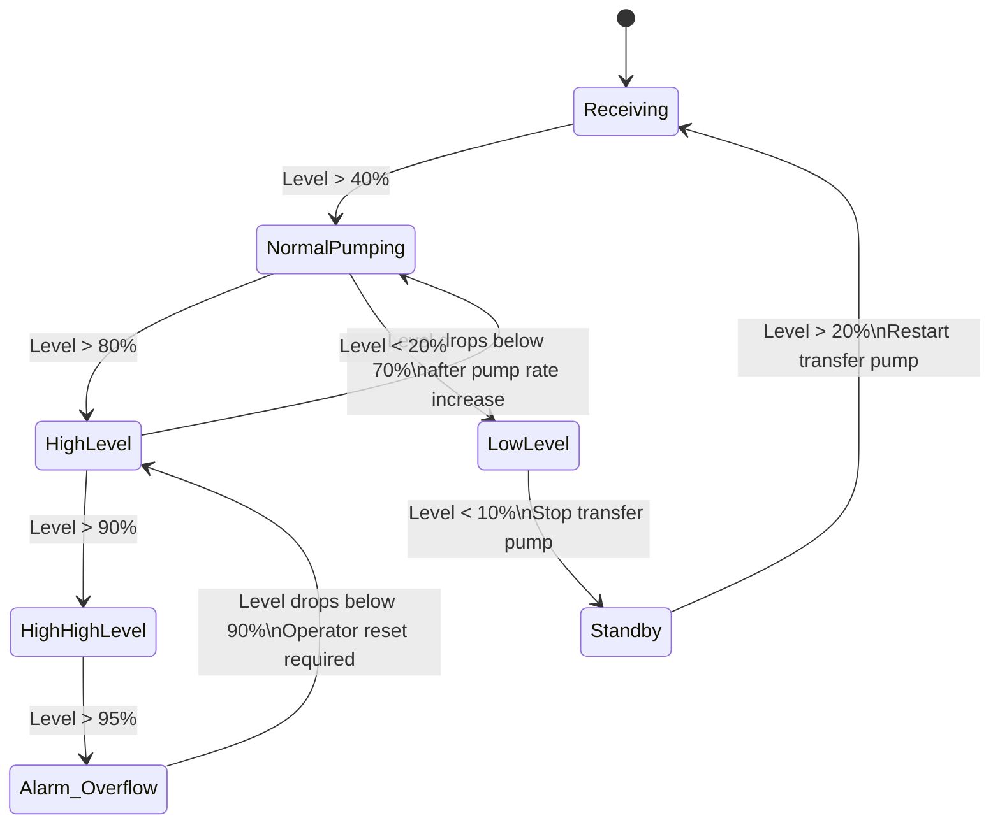

## pH Neutralization Control Loop

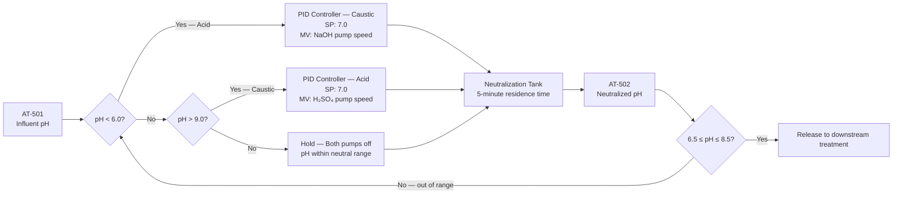

## Key Engineering Decisions

**pH PID loop considerations:** pH is logarithmic — the gain required to move pH from 5 to 6 is far less than from 3 to 4 on the same dose. Use gain scheduling (high gain at extreme pH, low gain near setpoint) or a linearized control law. Without this, the loop will oscillate violently near setpoint and be sluggish at extremes.

**Cascade neutralization:** A single-stage neutralization tank is difficult to control precisely. Two-stage is the industry standard — Stage 1 removes most of the acid/base demand (coarse correction), Stage 2 trims to permit range (fine correction). Each stage has its own pH analyzer and reagent pump.

**Enclosed EQ basin ventilation:** If the facility generates acid waste streams (pH < 4), H₂S can evolve in the equalization basin. Treat the enclosed EQ area as a confined space and evaluate for NFPA 820 hazardous area classification.

## Cross-Links

- [Treatment & Discharge](../treatment-discharge/) — downstream of neutralization
- [Instrumentation Reference](../instrumentation/) — pH analyzer selection
- [IEC 61511](/standards/functional-safety/iec-61511/)
- [NFPA 820 — Wastewater Hazardous Areas](/standards/)
```

- [ ] **Step 2: Commit**

```bash
git add docs/industries/water-wastewater/equalization-neutralization/index.md
git commit -m "feat(site): add equalization and neutralization Jekyll page"
```

---

## Task 16: Jekyll — treatment-discharge/index.md

**Files:**
- Create: `docs/industries/water-wastewater/treatment-discharge/index.md`

- [ ] **Step 1: Create the page**

```markdown
---
layout: default
title: "Treatment and Discharge Compliance"
description: "Control system reference for biological wastewater treatment — activated sludge DO control, effluent quality monitoring, permit limit trip logic, and NPDES compliance."
breadcrumb:
  - name: "Industries"
    url: "/industries/"
  - name: "Water/Wastewater"
    url: "/industries/water-wastewater/"
  - name: "Treatment & Discharge"
---

<div class="page-header">
  <span class="page-header__label">Water/Wastewater — System Reference</span>
  <h1>Treatment and Discharge Compliance</h1>
</div>

<blockquote>
<strong>Scope:</strong> Biological wastewater treatment (activated sludge / MBR), secondary clarification, effluent disinfection, and discharge permit compliance. Covers DO control, sludge management, online effluent monitoring, permit limit trips, and NPDES record-keeping.
</blockquote>

## Standards Applicability

| Standard | Role in this system |
|---|---|
| EPA CWA / NPDES | Permit limits for TSS, BOD, pH, TN, TP, fecal coliform — monthly average and daily maximum |
| IEC 61511 | SIF: Effluent isolation valve XV-601 closes on permit limit exceedance (SIL 1) |
| NFPA 820 | Hazardous area classification — digester gas (CH₄), confined space H₂S in clarifiers |
| ISA-18.2 | Alarm rationalization for effluent quality, blower failure, sludge blanket high |

## Treatment Train Flow

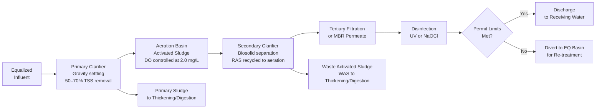

## Permit Limit Trip Logic

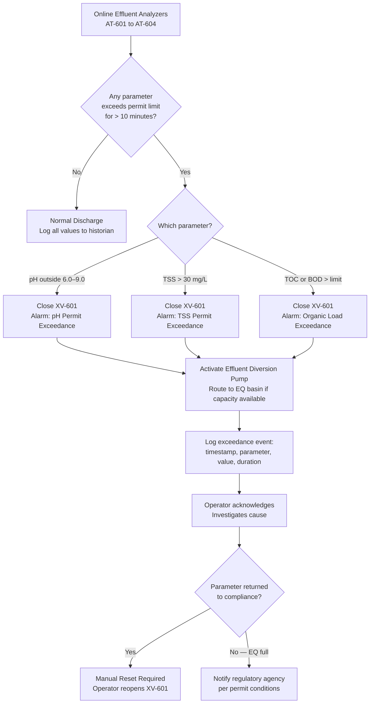

## Dissolved Oxygen Control

The aeration basin blowers run on a cascaded DO PID loop:

| Parameter | Value |
|---|---|
| PV | DO analyzer AT-601 (optical), mid-basin outlet |
| SP | 2.0 mg/L (typical; adjusted 1.5–3.0 mg/L seasonally) |
| MV | Lead blower VFD speed (0–60 Hz) |
| Assist blower | Staged on/off: starts when lead blower hits 58 Hz |
| DO < 1.0 mg/L | Alarm: Low DO — risk of filamentous bulking |
| DO > 4.0 mg/L | Trim blower speed — energy waste without treatment benefit |

## Key Engineering Decisions

**Why is the effluent trip SIL 1?** A permit limit exceedance that reaches the receiving water creates regulatory liability, potential fines, and environmental harm. The trip valve must be in the safety layer and able to close even if the process PLC is faulted. A simple hardwired relay from the pH transmitter to the valve can provide SIL 1 with proper documentation.

**WAS control:** Mixed liquor TSS (MLSS) is the control target. SCADA calculates the daily WAS volume based on MLSS, influent flow, and target SRT (solids retention time). The operator approves each WAS event — never automate WAS without operator oversight, as over-wasting crashes the biological process.

**MBR transmembrane pressure (TMP):** For MBR systems, TMP trend is the primary fouling indicator. TMP rising faster than expected indicates membrane fouling — trigger chemical cleaning before TMP reaches the backpulse limit.

## Cross-Links

- [Equalization & Neutralization](../equalization-neutralization/) — upstream
- [Instrumentation Reference](../instrumentation/) — DO and TSS analyzer selection
- [IEC 61511](/standards/functional-safety/iec-61511/)
- [Lifecycle Stage 6 — Commissioning](/lifecycle/stage-06/)
```

- [ ] **Step 2: Commit**

```bash
git add docs/industries/water-wastewater/treatment-discharge/index.md
git commit -m "feat(site): add treatment and discharge compliance Jekyll page"
```

---

## Task 17: Jekyll — instrumentation/index.md

**Files:**
- Create: `docs/industries/water-wastewater/instrumentation/index.md`

- [ ] **Step 1: Create the page**

```markdown
---
layout: default
title: "Instrumentation Reference — Water and Wastewater"
description: "Instrument selection guide for water and wastewater systems — flow, level, water quality analyzers, 4-20mA + HART loop architecture, material compatibility, and calibration requirements."
breadcrumb:
  - name: "Industries"
    url: "/industries/"
  - name: "Water/Wastewater"
    url: "/industries/water-wastewater/"
  - name: "Instrumentation"
---

<div class="page-header">
  <span class="page-header__label">Water/Wastewater — System Reference</span>
  <h1>Instrumentation Reference</h1>
</div>

<blockquote>
<strong>Scope:</strong> Instrument selection for water and wastewater treatment systems — flow, level, pressure, and water quality analyzers. 4-20mA + HART loop architecture, intrinsic safety for classified areas, material compatibility, and regulatory calibration requirements.
</blockquote>

## Instrument Selection Decision Tree

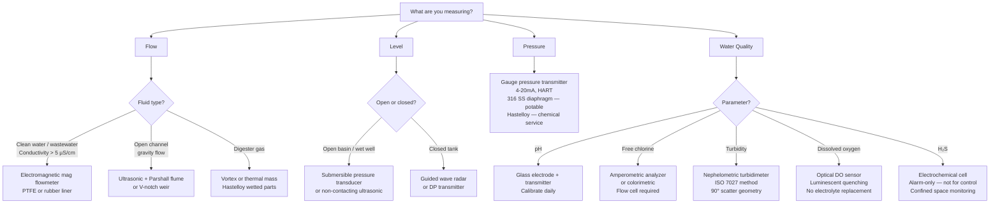

## Analyzer Loop Architecture (4-20mA + HART)

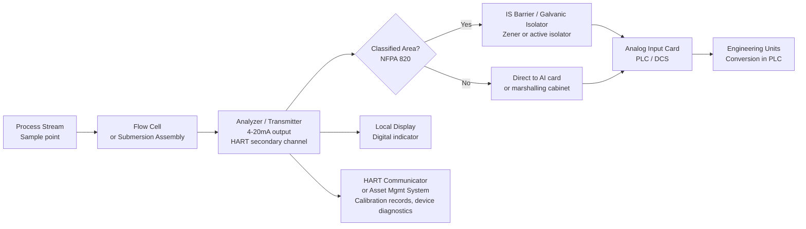

## Material Compatibility Quick Reference

| Process Stream | Wetted Material — OK | Avoid |
|---|---|---|
| Potable water | 316 SS, PTFE, NSF 61-certified elastomers | Lead, unlined cast iron |
| NaOCl (sodium hypochlorite) | CPVC, PVDF, Hastelloy C276 | 304 SS, carbon steel |
| Alum / PAC solution | CPVC, rubber-lined | 316 SS (pitting in Cl⁻ + acid) |
| NaOH (caustic) | 316 SS, HDPE, CPVC | Aluminum, zinc |
| H₂SO₄ (dilute, < 50%) | HDPE, FRP, rubber-lined | Stainless steel |
| Activated sludge | Rubber-lined mag, PTFE-lined | Bare 316 SS (erosion) |
| Digester gas (CH₄/H₂S) | 316 SS, Hastelloy | Carbon steel (H₂S corrosion) |

## Calibration Requirements

| Instrument | Frequency | Method | Regulatory Driver |
|---|---|---|---|
| pH analyzer | Daily 2-point verification; full calibration weekly | pH 4.0 and 7.0 buffers | State drinking water regs |
| Turbidity analyzer | Daily verification; monthly Formazin calibration | Calibration standard | EPA SWTR |
| Cl₂ residual analyzer | Daily grab sample comparison by Hach method | DPD colorimetric | EPA SWTR |
| Magnetic flowmeter | Annual; loop validation vs. portable ultrasonic | Portable check meter | Regulatory metering |
| DO analyzer (optical) | Weekly verification; replace cap annually | Air saturation method (100%) | Good practice |
| Level transmitter | Semi-annual; verify against known depth | Physical measurement | Good practice |

## ISA-5.1 Tag Convention

Follow ISA-5.1 for all instrument tags:

| First letter | Measured variable | Second letter | Function |
|---|---|---|---|
| A | Analyzer | T | Transmitter |
| F | Flow | C | Controller |
| L | Level | I | Indicator |
| P | Pressure | S | Switch |
| T | Temperature | E | Element (sensor) |

Examples: `LT-101` Level Transmitter loop 101 · `AT-301` Analyzer Transmitter loop 301 · `FIC-201` Flow Indicating Controller loop 201 · `PSH-402` Pressure Switch High loop 402

## Cross-Links

- [Chemical Dosing](../chemical-dosing/) — Cl₂ analyzer application
- [Filtration & Clarification](../filtration-clarification/) — turbidimeter application
- [Treatment & Discharge](../treatment-discharge/) — DO and TSS analyzer application
- [Lifecycle Stage 3 — P&ID Development](/lifecycle/stage-03/)
```

- [ ] **Step 2: Commit**

```bash
git add docs/industries/water-wastewater/instrumentation/index.md
git commit -m "feat(site): add instrumentation reference Jekyll page"
```

---

## Task 18: Navigation Update and Final Validation

**Files:**
- Modify: `docs/_data/navigation.yml` (add Water/Wastewater entry under Industries)
- Validate: clean Jekyll build, AI boundary check, project_state update

- [ ] **Step 1: Add Water/Wastewater to navigation.yml**

Find the Industries section in `docs/_data/navigation.yml`. After the Semiconductor entry block (which ends with the System Crosswalks child), add the following new entry. Add it before the `- label: "Food &amp; Beverage"` line:

```yaml
    - label: "Water/Wastewater"
      url: "/industries/water-wastewater/"
      children:
        - label: "Intake & Pumping"
          url: "/industries/water-wastewater/intake-pumping/"
        - label: "Filtration & Clarification"
          url: "/industries/water-wastewater/filtration-clarification/"
        - label: "Chemical Dosing"
          url: "/industries/water-wastewater/chemical-dosing/"
        - label: "Distribution SCADA"
          url: "/industries/water-wastewater/distribution-scada/"
        - label: "Equalization & Neutralization"
          url: "/industries/water-wastewater/equalization-neutralization/"
        - label: "Treatment & Discharge"
          url: "/industries/water-wastewater/treatment-discharge/"
        - label: "Instrumentation"
          url: "/industries/water-wastewater/instrumentation/"
```

- [ ] **Step 2: Run AI boundary validator**

```bash
cd "/Users/kyawminthu/Dev/Control System Tools"
python3 tools/validate_ai_boundaries.py 2>&1 | tail -10
```
Expected: all new RAG files pass. Total count increases by 8 (one per new RAG file).

- [ ] **Step 3: Run Jekyll build**

```bash
cd "/Users/kyawminthu/Dev/Control System Tools/docs"
~/.gem/ruby/2.6.0/bin/bundle exec jekyll build 2>&1 | tail -15
```
Expected: `done in X.XXX seconds` — zero errors, zero warnings. Page count should be approximately 165 (157 + 8 new pages).

- [ ] **Step 4: Update project_state/project_state.md**

Update the following fields in `project_state/project_state.md`:
- `**Current Phase:**` → `Phase 25 COMPLETE — Water/Wastewater Multi-Page Section`
- `**Next Phase:**` → `Phase 26 PLANNING — TBD`
- Update `## Current Direction` to note Phase 25 complete: 8-page water/wastewater section added, covering municipal drinking water and industrial wastewater treatment with Mermaid diagrams on every page.
- Update `## Current Reality` — last validated Jekyll build line to current date and new page count.

- [ ] **Step 5: Update project_state/change_log.md**

Add a new entry at the top of `## Change History`:

```markdown
## 2026-04-14 — Phase 25 COMPLETE: Water/Wastewater Multi-Page Section

**Type:** Content / Industry Reference
**Status:** Complete

- Added 8 RAG files to `control-standards/rag/design_framework/water_wastewater/` with `_index.yaml`
- Added 8 Jekyll pages under `docs/industries/water-wastewater/`:
  - Overview + standards selection flowchart
  - Intake & Raw Water Pumping (pump station architecture, start permissive chain)
  - Filtration & Clarification (filter state machine, turbidity bypass logic)
  - Chemical Dosing (flow-paced Cl₂, OT shutdown, chemical feed interlock)
  - Distribution SCADA (zone architecture, IEC 62443 security zones, fallback logic)
  - Equalization & Neutralization (EQ basin state machine, pH neutralization loop)
  - Treatment & Discharge (treatment train flow, permit limit trip logic)
  - Instrumentation Reference (analyzer loop, instrument selection decision tree)
- Added Water/Wastewater navigation entry to `docs/_data/navigation.yml`
- ~20 Mermaid diagrams total; covers IEC 61511, IEC 62443, ISA-18.2, EPA SDWA/CWA, AWWA, NFPA 820
- Jekyll build: clean, ~165 pages
```

- [ ] **Step 6: Commit everything**

```bash
cd "/Users/kyawminthu/Dev/Control System Tools"
git add docs/_data/navigation.yml project_state/project_state.md project_state/change_log.md
git commit -m "feat(phase-25): complete water/wastewater section — navigation, validation, project state"
```

---

## Self-Review Against Spec

**Spec coverage check:**

| Spec requirement | Covered by task(s) |
|---|---|
| 8 Jekyll pages under `docs/industries/water-wastewater/` | Tasks 10–17 |
| 8 RAG files under `control-standards/rag/design_framework/water_wastewater/` | Tasks 2–9 |
| `_index.yaml` for corpus | Task 1 |
| Navigation entry in `navigation.yml` | Task 18 |
| "In This Section" block on overview | Task 10 (section navigation map + table) |
| Mermaid diagrams — 2+ per page | All page tasks — 20+ diagrams total |
| Standards: IEC 61511, IEC 62443, ISA-18.2, AWWA, EPA SDWA/CWA, NFPA 820, NEC | Standards tables in each page + RAG |
| Per-page content pattern (purpose, standards table, narrative, diagrams, decisions, cross-links) | All page tasks |
| AI boundary headers on all RAG files | Tasks 2–9 |
| Clean Jekyll build validation | Task 18 |
| project_state update | Task 18 |
| change_log update | Task 18 |

No gaps found.
