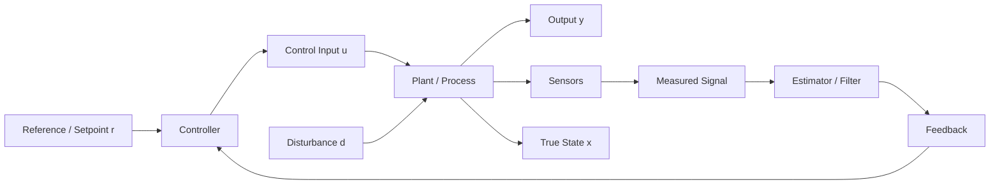
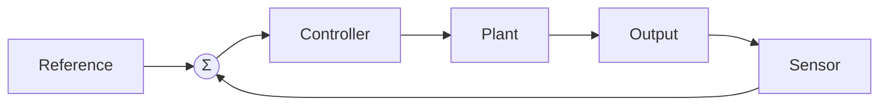
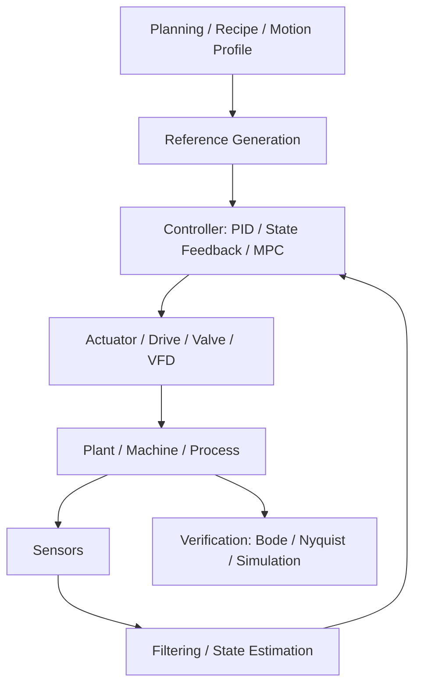

# Control Theory Overview Page Rebuild

> **For agentic workers:** REQUIRED SUB-SKILL: Use superpowers:subagent-driven-development (recommended) or superpowers:executing-plans to implement this plan task-by-task. Steps use checkbox (`- [ ]`) syntax for tracking.

**Goal:** Rebuild `docs/fundamentals/control/control-theory-overview/index.md` from a text-dense concept dump into a visual map page — hero diagram first, summary cards, progressive detail with Mermaid diagrams and compact tables.

**Architecture:** Single-file page rewrite plus a small CSS addition for the 4-card summary row and the two-column open/closed-loop comparison. No new pages, no layout changes, no JS. Reuses existing `.card-grid`/`.card` classes where possible. All diagrams use Mermaid (already loaded sitewide via CDN).

**Tech Stack:** Jekyll 4.3, Markdown, Mermaid.js (CDN), vanilla CSS

**Source page:** `docs/fundamentals/control/control-theory-overview/index.md` (151 lines)
**CSS file:** `docs/assets/css/main.css`

---

## Task 1: Add CSS for summary cards and comparison columns

**Files:**
- Modify: `docs/assets/css/main.css` (append after the existing card section, ~line 462)

This task adds two small utility classes:
1. A 4-column card row for the "at a glance" section (reuses `.card` but forces 4-up on desktop)
2. A two-column comparison layout for open-loop vs closed-loop

- [ ] **Step 1: Add `.glance-grid` and `.compare-columns` CSS**

Append to `docs/assets/css/main.css` after the `.card__link` block (around line 462):

```css
/* --- Control Overview: Glance Cards + Comparison Columns ------------------ */
.glance-grid {
  display: grid;
  grid-template-columns: repeat(4, 1fr);
  gap: 1rem;
  margin: 1.25rem 0;
}
.glance-grid .card {
  text-align: center;
}
.glance-grid .card__title {
  font-size: 1rem;
}
@media (max-width: 900px) {
  .glance-grid { grid-template-columns: repeat(2, 1fr); }
}
@media (max-width: 540px) {
  .glance-grid { grid-template-columns: 1fr; }
}

.compare-columns {
  display: grid;
  grid-template-columns: 1fr 1fr;
  gap: 1.5rem;
  margin: 1.25rem 0;
}
.compare-columns > div {
  border: 1px solid var(--color-border);
  padding: 1rem;
  background: var(--color-bg-elevated);
}
.compare-columns > div h3 {
  margin-top: 0;
}
@media (max-width: 640px) {
  .compare-columns { grid-template-columns: 1fr; }
}
```

- [ ] **Step 2: Verify Jekyll build still clean**

```bash
cd docs && ~/.gem/ruby/2.6.0/bin/bundle exec jekyll build 2>&1 | tail -3
```

Expected: build succeeds, no errors.

- [ ] **Step 3: Commit**

```bash
git add docs/assets/css/main.css
git commit -m "style: add glance-grid and compare-columns CSS for control theory overview rebuild"
```

---

## Task 2: Rewrite the page — frontmatter and hero section

**Files:**
- Modify: `docs/fundamentals/control/control-theory-overview/index.md`

Replace the entire file content. This task writes sections 1-3 (frontmatter, hero diagram, glance cards). Task 3 continues with sections 4-9.

- [ ] **Step 1: Write frontmatter + hero + glance cards**

Replace the full content of `docs/fundamentals/control/control-theory-overview/index.md` with:

````markdown
---
layout: training-module
title: "Control Theory Overview"
description: "A map of the control-engineering workflow — plant, feedback, controller families, state estimation, and verification — before going deeper into PID."
breadcrumb:
  - name: "Training"
    url: "/training/"
  - name: "Control Systems"
    url: "/fundamentals/control/"
repo_path: "control-standards/rag/training_modules/control_systems/control_theory_overview.md"
related_standards:
  - name: "IEC 61511"
    url: "/standards/functional-safety/iec-61511/"
  - name: "IEC 62443"
    url: "/standards/cybersecurity/iec-62443/"
redirect_from:
  - /training/control-systems/control-theory-overview/
  - /training/control-systems/control-theory-overview/index.html

---

## Why control theory exists

Control theory is the engineering discipline for making a system behave as intended despite disturbance, noise, and model error.

A PID loop is only one layer. This page maps the full workflow — plant, feedback, controller, estimator, and verification — so you can see where each concept fits before going deeper.

## The control loop in one picture



Every element below maps back to a block in this diagram.

---

## Control system at a glance

<div class="glance-grid">
  <div class="card">
    <span class="card__label">1 — System</span>
    <span class="card__title">Plant</span>
    <p class="card__desc">The physical system being controlled — motor, process, vehicle, or machine axis.</p>
  </div>
  <div class="card">
    <span class="card__label">2 — Decision</span>
    <span class="card__title">Controller</span>
    <p class="card__desc">Computes actuator commands from reference and feedback. PID is one option among many.</p>
  </div>
  <div class="card">
    <span class="card__label">3 — Perception</span>
    <span class="card__title">Sensors / Estimator</span>
    <p class="card__desc">Turn noisy measurements into usable feedback. Not all states are directly measured.</p>
  </div>
  <div class="card">
    <span class="card__label">4 — Proof</span>
    <span class="card__title">Verification</span>
    <p class="card__desc">Check stability, margins, and real-world behavior before commissioning.</p>
  </div>
</div>
````

- [ ] **Step 2: Verify the partial page builds**

```bash
cd docs && ~/.gem/ruby/2.6.0/bin/bundle exec jekyll build 2>&1 | tail -3
```

Expected: build succeeds (page will be incomplete but valid).

---

## Task 3: Rewrite the page — open-loop vs closed-loop and where PID fits

**Files:**
- Modify: `docs/fundamentals/control/control-theory-overview/index.md` (append after the glance cards)

- [ ] **Step 1: Append the open-loop vs closed-loop comparison and PID architecture sections**

Append after the closing `</div>` of the glance-grid:

````markdown

---

## Open-loop vs closed-loop

<div class="compare-columns">
<div>

### Open-loop


- Command based on model or assumption
- Fast and simple
- No self-correction — weak against disturbance

**Use when:** disturbances are small and the plant model is accurate (e.g. feedforward terms in a combined controller).

</div>
<div>

### Closed-loop



- Command based on measured response
- Self-correcting against disturbance and model error
- Can improve **or damage** stability if badly designed

**Use when:** disturbance, uncertainty, or safety require verified tracking (nearly all industrial control).

</div>
</div>

---

## Where PID fits

PID is the most common industrial controller — but it is one block in a larger architecture.



- **Above PID:** recipe management, motion profiles, setpoint scheduling
- **Below PID:** actuator dynamics, drive/VFD response, valve characteristics
- **Beside PID:** state estimation, filtering, feedforward terms
- **After PID:** verification of stability and performance margins
````

- [ ] **Step 2: Verify build**

```bash
cd docs && ~/.gem/ruby/2.6.0/bin/bundle exec jekyll build 2>&1 | tail -3
```

---

## Task 4: Rewrite the page — controller families and estimation

**Files:**
- Modify: `docs/fundamentals/control/control-theory-overview/index.md` (append)

- [ ] **Step 1: Append controller families matrix and estimation section**

Append after the "Where PID fits" section:

````markdown

---

## Beyond PID — controller families

| Family | Best for | Typical examples | Industrial use |
|---|---|---|---|
| Classical | Simple loops, machines, process control | PID, lead/lag | Very high |
| State-space | Multivariable and model-based design | Full-state feedback, observer-based control | Medium |
| Robust | Uncertainty-heavy plants | H-infinity, &mu;-synthesis, ADRC | Medium |
| Adaptive | Changing dynamics | MRAC, gain scheduling | Medium |
| Optimal | Performance tradeoff tuning | LQR | Medium |
| Predictive | Constraints and multivariable control | MPC | High (advanced) |
| Intelligent | Heuristic or learned behavior | Fuzzy, RL | Specialized |

> **Industrial reality:** PID handles the vast majority of single-loop process and machine control. State-space, MPC, and gain scheduling appear in coordinated axes, thermal systems, and advanced process plants.

---

## What the controller really sees

Real controllers act on sensor measurements, not the true plant state. Measurements include noise, bias, and latency.

**Observability** means the controller can reconstruct the internal states it needs from the measurements it has. If a state is not observable, no estimator can recover it.


| Method | When to use |
|---|---|
| Kalman filter | Linear systems with Gaussian noise |
| Particle filter | Nonlinear or non-Gaussian problems |
| Running average | Simple smoothing when no model is needed |
| Luenberger observer | Deterministic state reconstruction from a known model |
````

- [ ] **Step 2: Verify build**

```bash
cd docs && ~/.gem/ruby/2.6.0/bin/bundle exec jekyll build 2>&1 | tail -3
```

---

## Task 5: Rewrite the page — verification and navigation footer

**Files:**
- Modify: `docs/fundamentals/control/control-theory-overview/index.md` (append)

- [ ] **Step 1: Append verification section, where-to-go-next, and footer nav**

Append after the estimation section:

````markdown

---

## How engineers verify control performance


| Tool | What it tells you |
|---|---|
| **Bode plot** | Frequency response — gain margin, phase margin |
| **Nyquist diagram** | Closed-loop stability from open-loop transfer function |
| **Simulation** | Validate response before commissioning |
| **Hardware test** | Confirm behavior under real disturbance, load, noise, and saturation |

> **Rule of thumb:** simulate first, then commission. Retuning on live hardware without simulation is a common source of instability incidents.

---

## Where to go next

| If you want to... | Go to |
|---|---|
| Build PID intuition without heavy math | [PID Control — Intuitive Foundation]({{ '/fundamentals/control/pid-foundation/' | relative_url }}) |
| See P, I, and D terms in practice | [PID Intuition — P, I, and D in Practice]({{ '/fundamentals/control/pid-intuition/' | relative_url }}) |
| Understand industrial PID implementation | [Industrial PID Implementation]({{ '/fundamentals/control/industrial-pid/' | relative_url }}) |
| See loop architecture patterns | [Control Loop Architectures]({{ '/fundamentals/control/control-loop-architectures/' | relative_url }}) |
| Commission a VFD or servo | [VFD Commissioning]({{ '/implementation/vfd-commissioning/' | relative_url }}) &middot; [Servo Commissioning]({{ '/implementation/servo-commissioning/' | relative_url }}) |
| Understand safety instrumented systems | [IEC 61511]({{ '/standards/functional-safety/iec-61511/' | relative_url }}) |

---

<div style="display:flex; justify-content:space-between; margin-top:2rem; font-size:0.9rem;">
  <span></span>
  <a href="{{ '/fundamentals/control/' | relative_url }}">&uarr; Control Systems</a>
  <a href="{{ '/fundamentals/control/pid-foundation/' | relative_url }}">PID Control &mdash; Intuitive Foundation &rarr;</a>
</div>
````

- [ ] **Step 2: Verify full build**

```bash
cd docs && ~/.gem/ruby/2.6.0/bin/bundle exec jekyll build 2>&1 | tail -3
```

Expected: clean build, no errors.

- [ ] **Step 3: Commit the full page rewrite**

```bash
git add docs/fundamentals/control/control-theory-overview/index.md
git commit -m "content: rebuild control theory overview — hero diagram, cards, visual sections"
```

---

## Task 6: Visual verification and link check

**Files:** None modified — verification only.

- [ ] **Step 1: Run internal link checker**

```bash
cd docs && ~/.gem/ruby/2.6.0/bin/bundle exec jekyll build && cd .. && python3 tools/check_internal_links.py
```

Expected: exit 0, no broken links.

- [ ] **Step 2: Serve locally and visually verify**

```bash
cd docs && ~/.gem/ruby/2.6.0/bin/bundle exec jekyll serve
```

Open `http://localhost:4000/Control-System-Tools/fundamentals/control/control-theory-overview/` and check:
- [ ] Hero Mermaid diagram renders (full feedback loop with 11 nodes)
- [ ] 4-card glance row displays in a single horizontal row on desktop
- [ ] Open-loop vs closed-loop renders as two side-by-side columns with separate Mermaid diagrams
- [ ] "Where PID fits" vertical stack diagram renders
- [ ] Controller families table is scannable with 4 columns
- [ ] Estimation section shows the observer flow diagram
- [ ] Verification process strip renders left-to-right
- [ ] "Where to go next" links all resolve
- [ ] Footer nav links to Control Systems landing and PID Foundation
- [ ] Page is readable on mobile (cards stack, columns stack)

- [ ] **Step 3: Stop the server and commit any fixes if needed**

---

## Task 7: Update project state

**Files:**
- Modify: `project_state/change_log.md`
- Modify: `project_state/project_state.md`

- [ ] **Step 1: Add change log entry**

Prepend to `project_state/change_log.md` after the header, before the first `##` date entry:

```markdown
## 2026-04-16 — Control Theory Overview page rebuild

**Type:** Content / Training Enhancement
**Status:** Complete

Rebuilt `docs/fundamentals/control/control-theory-overview/index.md` from a text-dense 151-line concept dump into a visual map page. Same topics, new presentation:

- Hero Mermaid diagram showing the full feedback loop (reference → controller → plant → sensors → estimator → feedback)
- 4-card "at a glance" summary row (Plant, Controller, Sensors/Estimator, Verification)
- Side-by-side open-loop vs closed-loop comparison with separate Mermaid diagrams
- "Where PID fits" layered architecture diagram
- Controller families decision matrix (7 rows, 4 columns)
- Estimator/observer flow diagram with method table
- Verification process strip (model → simulation → frequency response → margins → hardware test)
- "Where to go next" routing table to child pages and related sections

Added `.glance-grid` and `.compare-columns` CSS utility classes to `main.css`. No new pages, no layout changes, no JS.

Jekyll build clean. Internal link checker exit 0.
```

- [ ] **Step 2: Commit project state update**

```bash
git add project_state/change_log.md project_state/project_state.md
git commit -m "docs: update project state for control theory overview rebuild"
```

---

## Summary of changes

| What | Before | After |
|---|---|---|
| Mermaid diagrams | 0 | 6 |
| Summary cards | 0 | 4-card glance row |
| Tables | 4 (flat 2-col) | 4 (richer 3-4 col) |
| Visual comparisons | 0 | 1 (open vs closed-loop side-by-side) |
| "Where to go next" | 2 footer links | 6-row routing table + footer |
| CSS additions | — | `.glance-grid`, `.compare-columns` |
| Line count | ~151 | ~220 |
| New files | 0 | 0 |

The page scope is unchanged — same topics, same frontmatter, same `training-module` layout. The rebuild is purely presentation: diagrams first, cards for orientation, tables for decision support, progressive detail.
