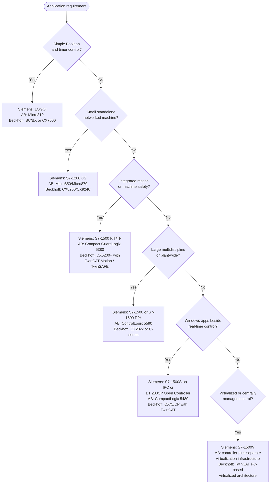

  Manufacturer Directory
  <h1>PLC &amp; IPC Hardware Families</h1>
  
Family-level orientation to the Siemens, Allen-Bradley/Rockwell, and Beckhoff controller and industrial-PC ranges — what each family is for, how the three ecosystems are put together differently, and how to decode the model suffixes.

> **Lifecycle claims expire.** Every status below is a snapshot of what the
> vendor published **as of July 2026**. Product families are introduced,
> superseded, and discontinued continuously, and a family that was current when
> this page was written may not be current when you read it. Confirm lifecycle
> state, availability, and specifications against the vendor's own lifecycle and
> ordering documentation before you specify anything. Naming a family here is
> orientation, not endorsement — see the
> [directory notice]({{ '/tools/manufacturers/' | relative_url }}).

## Quick Start

- **The three vendors are not three versions of the same thing.** They differ in
  where the controller *lives*: Siemens keeps dedicated PLC hardware and PC
  hardware as separate platforms; Rockwell centres on a dedicated Logix
  controller reached over EtherNet/IP; Beckhoff treats an industrial PC running
  the TwinCAT runtime *as* the controller. That difference shapes the whole
  selection.
- **Start from the application, not the brand** — Boolean-and-timer duty, small
  networked machine, integrated motion or safety, plant-scale multidiscipline,
  or "Windows must run beside real-time control" each land in a different part of
  every vendor's range. The [selection flow](#selection-flow) below is organised
  that way.
- **Suffixes carry the engineering meaning.** On a Siemens CPU the F, T, R/H, S,
  and V letters are the difference between a standard PLC, a safety PLC, a
  motion controller, a redundant pair, and a software controller —
  see [suffix decoding](#siemens-suffix-decoding).
- **A "smaller" family is not always the same family scaled down.** Micro800 does
  not share the Studio 5000 project format with CompactLogix and ControlLogix —
  it is a different programming ecosystem, not a small Logix controller.
- **These tables are family-level only.** Terminal assignments, technical data,
  and firmware compatibility depend on the complete catalog/order number — get
  them from the
  [official vendor documentation index]({{ '/tools/manufacturers/vendor-documentation/' | relative_url }}).

## The Three Architectural Models

Before comparing families, it helps to see how each vendor divides the problem.
The distinction matters most when a project needs real-time control and
general-purpose computing on the same machine.

**Siemens** keeps a dedicated PLC platform and a separate industrial-PC platform,
with software-controller (S7-1500S) and virtual-controller (S7-1500V) options
bridging the two. The boundary between "the PLC" and "the PC" stays explicit.

**Allen-Bradley / Rockwell** centres on a dedicated Logix controller with a
modular EtherNet/IP architecture around it, and treats the computer platform
(FactoryTalk software, ASEM hardware) as a separate concern. The CompactLogix
5480 is the exception: it puts a Windows environment and an independent Logix
control engine in one device.

**Beckhoff** treats the industrial computer plus the real-time TwinCAT runtime
*as* the controller. The form factor and performance change from a compact CX
DIN-rail unit up to a C-series rack PC, but the PC-based control model does not.

The software consequences of this split — how programs are organised, how the
scan works, what a tag or a DB actually is — are covered on
[vendor programming architectures]({{ '/fundamentals/plc-software/vendor-architectures/' | relative_url }}).

## Selection Flow

A starting point for narrowing the range, not a specification method. Work from
the application requirement on the left to candidate families on the right, then
verify each candidate against the vendor's current ordering data.

> **Safety functions are not selected from a flowchart.** Reaching "integrated
> safety" above tells you which families *offer* a safety variant; it does not
> tell you which integrity level your application needs. That comes from the risk
> assessment — see [ISO 13849-1]({{ '/standards/functional-safety/iso-13849-1/' | relative_url }})
> and [IEC 62061]({{ '/standards/functional-safety/iec-62061/' | relative_url }}) —
> and the certification documents for the exact hardware revision govern any
> integrity claim.

### Cross-vendor mapping by system size

| System size | Siemens | Allen-Bradley | Beckhoff |
|---|---|---|---|
| Very small | LOGO! | Micro810 | BC/BX or CX7000 |
| Small networked machine | S7-1200 G2 | Micro820 / Micro850 | CX8200 / CX9240 |
| Medium machine | S7-1500 compact CPU or ET 200SP CPU | CompactLogix 5380 | CX51xx / CX52xx |
| Complex machine | S7-1500 | CompactLogix 5380 / 5390 | CX53xx / CX56xx |
| Large multidiscipline | S7-1500 high-performance CPU | ControlLogix 5590 | CX20xx or C60xx |
| High-performance motion | S7-1500T/TF or Drive Controller | CompactLogix / ControlLogix with Kinetix | CX20xx / C60xx with TwinCAT Motion |
| PLC plus PC workload | S7-1500S or ET 200SP Open Controller | CompactLogix 5480 | Any CX or C-series IPC |
| Virtualized controller | S7-1500V | Logix controller plus separate virtualization infrastructure | TwinCAT PC-based runtime architecture |

Rows are rough equivalences of *role*, not of performance. Two families on the
same row can differ substantially in scan time, memory, and I/O capacity;
compare the vendor datasheets before treating any pair as interchangeable.

## Siemens — SIMATIC



<table>
  <thead>
    <tr><th>Family</th><th>Class</th><th>Form</th><th>I/O system</th><th>Typical use</th><th>Status (as of)</th><th>Notes</th></tr>
  </thead>
  <tbody>
    
    <tr>
      <td><strong>{{ f.family }}</strong></td>
      <td>{{ f.class }}</td>
      <td>{{ f.form }}</td>
      <td>{{ f.io_system }}</td>
      <td>{{ f.typical_use }}</td>
      <td>{{ f.status }} <em>({{ f.as_of }})</em></td>
      <td>{{ f.notes }}</td>
    </tr>
    
  </tbody>
</table>

### Siemens suffix decoding

On the S7-1500 line the suffix letters, not the family name, tell you what the
CPU actually is:

| Suffix | Meaning |
|---|---|
| **F** | Fail-safe (safety) CPU |
| **T** | Technology CPU with advanced motion functions |
| **TF** | Technology and fail-safe combined |
| **R** | Redundant system |
| **H** | High-availability redundant system |
| **S** | Software controller (runs on an industrial PC) |
| **V** | Virtual controller |
| **D TF** | Drive-integrated technology and fail-safe controller |

An F or TF CPU is capable of running safety logic; it does not by itself make an
application safe. The safety function is engineered, verified, and validated
against the applicable standard, using the certified hardware revision and its
safety manual.

## Allen-Bradley / Rockwell



<table>
  <thead>
    <tr><th>Family</th><th>Class</th><th>Form</th><th>I/O system</th><th>Typical use</th><th>Status (as of)</th><th>Notes</th></tr>
  </thead>
  <tbody>
    
    <tr>
      <td><strong>{{ f.family }}</strong></td>
      <td>{{ f.class }}</td>
      <td>{{ f.form }}</td>
      <td>{{ f.io_system }}</td>
      <td>{{ f.typical_use }}</td>
      <td>{{ f.status }} <em>({{ f.as_of }})</em></td>
      <td>{{ f.notes }}</td>
    </tr>
    
  </tbody>
</table>

> **Micro800 is a separate ecosystem, not a small Logix.** It is programmed in
> Connected Components Workbench / FactoryTalk Design Workbench, not in the
> Studio 5000 Logix project format. Code, tags, and AOIs do not carry across, so
> a project that may grow into a Logix controller is worth sizing accordingly at
> the outset rather than porting later.

## Beckhoff

In this ecosystem the **runtime is the controller**. The TwinCAT 3 runtime
provides PLC, motion, CNC, robotics, and safety communication; the hardware
families below are the platforms it runs on, scaling from a compact DIN-rail
embedded PC to a rack-mounted industrial PC without changing the control model.



<table>
  <thead>
    <tr><th>Family</th><th>Class</th><th>Form</th><th>I/O system</th><th>Typical use</th><th>Status (as of)</th><th>Notes</th></tr>
  </thead>
  <tbody>
    
    <tr>
      <td><strong>{{ f.family }}</strong></td>
      <td>{{ f.class }}</td>
      <td>{{ f.form }}</td>
      <td>{{ f.io_system }}</td>
      <td>{{ f.typical_use }}</td>
      <td>{{ f.status }} <em>({{ f.as_of }})</em></td>
      <td>{{ f.notes }}</td>
    </tr>
    
  </tbody>
</table>

## Industrial PCs Are Not Controllers

An industrial PC in these ranges is a computing platform: it hosts HMI runtime,
vision, data logging, gateways, or engineering tools. It becomes a controller
only when a real-time runtime is added — a Siemens software or virtual
controller, or the TwinCAT runtime on Beckhoff hardware — or when the product
combines both engines in one device (CompactLogix 5480, ET 200SP Open
Controller).

Two consequences worth carrying into a design review:

- **A general-purpose operating system is not a control platform on its own.**
  Where a vendor states that control continues across an OS restart or failure,
  that isolation is a property of the specific runtime and version — verify the
  isolation model rather than assuming it.
- **A thin client or an industrial monitor is neither.** In the Rockwell range,
  a 6300T is a managed terminal and a 6300M/6300MA is a monitor; neither runs the
  visualization application locally.

| Form factor | Siemens | Allen-Bradley | Beckhoff |
|---|---|---|---|
| Compact box PC | SIMATIC Box PC (compact configurations) | ASEM 6300B (compact) | C60xx |
| General / expandable box PC | SIMATIC Box PC (expandable configurations) | ASEM 6300B (higher-end) | C69xx / C66xx |
| Integrated-display PC | SIMATIC Panel PC | ASEM 6300P | CP2xxx / CP4xxx / CP6xxx |
| Machine-mounted, IP-rated | SIMATIC PRO Panel PC variants | ASEM 6300PA | CP3xxx / CP5xxx / CP7xxx or C70xx |
| Hazardous location | Selected certified SIMATIC configurations | 6181X | CPX27xx / CPX37xx |
| Rack PC / server | SIMATIC Rack PC | VersaVirtual architecture | C5xxx / C6670 |

Hazardous-location certification is **per model and per zone/division**. Confirm
the certificate scope against the area classification — see
[IEC 60079]({{ '/standards/hazardous-area/iec-60079/' | relative_url }}).

## Common Mistakes

1. **Treating a lifecycle status as durable.** *Root cause:* a family table
   (including this one) is a snapshot. Designing in a family that entered
   phase-out between the concept and the purchase order leaves the installed base
   short of spares. Check the vendor's lifecycle page per catalog number, not per
   family — families migrate at different times.
2. **Assuming an announced family is available.** *Root cause:* announcement and
   general availability are different events. As of July 2026 the CompactLogix
   5390 is announced with a vendor-published availability date rather than
   shipping as a general replacement — a schedule can slip, and a design that
   assumes it will ship has no fallback.
3. **Buying Micro800 as "a small ControlLogix".** *Root cause:* the name and the
   catalogue adjacency suggest one ecosystem; the project format proves
   otherwise. Migration means rewriting, not converting.
4. **Reading a suffix as a trim level.** *Root cause:* F, T, R/H, S, and V change
   what the CPU *is*, not how much of it you get. Ordering a standard CPU where
   the safety function needs an F-CPU is a scope error, not a downgrade.
5. **Specifying an IPC and calling the control problem solved.** *Root cause:*
   the IPC is the platform, the runtime is the controller. Without a real-time
   runtime, an industrial PC provides no deterministic control at all.
6. **Sizing on family name rather than on the requirement.** *Root cause:* the
   cross-vendor rows above equate *roles*, not performance. Scan time, memory,
   axis count, and I/O capacity vary widely inside a single row; the datasheet
   settles it.
7. **Designing wiring from a family-level document.** *Root cause:* terminal
   assignments and pinouts depend on the complete order number. Use the
   equipment manual or installation instructions for the exact article — the
   [vendor documentation index]({{ '/tools/manufacturers/vendor-documentation/' | relative_url }})
   explains the lookup.

## Practical Checklist

- [ ] Application requirements written down *before* a vendor range is opened
- [ ] Candidate family confirmed against the vendor's current lifecycle status
- [ ] Catalog/order numbers — not family names — used for every specification
- [ ] Safety integrity requirement derived from the risk assessment, and the
      certified hardware revision matched to it
- [ ] Motion, redundancy, and communication options confirmed on the *specific*
      CPU model, not the family
- [ ] Engineering-tool version confirmed compatible with the hardware and
      firmware revision
- [ ] For an IPC: the real-time runtime (and its licensing) specified explicitly
- [ ] For hazardous locations: certificate scope checked against the area
      classification
- [ ] Spare-parts and support availability checked for the expected service life
- [ ] The manual revision designed against archived with the as-built package

## Related Pages

- [Official vendor documentation index]({{ '/tools/manufacturers/vendor-documentation/' | relative_url }}) — the manuals and portals for these families
- [Vendor programming architectures]({{ '/fundamentals/plc-software/vendor-architectures/' | relative_url }}) — how the software model differs across the same three vendors
- [PLC / PAC manufacturer directory]({{ '/tools/manufacturers/plc-pac/' | relative_url }}) — the broader vendor landscape
- [PLC software fundamentals]({{ '/fundamentals/plc-software/' | relative_url }}) — the vendor-independent groundwork these ecosystems sit on
- [PLC wiring guide]({{ '/design/wiring/plc/' | relative_url }}) — the field practice these families end up in
- [Manufacturer directory]({{ '/tools/manufacturers/' | relative_url }})
