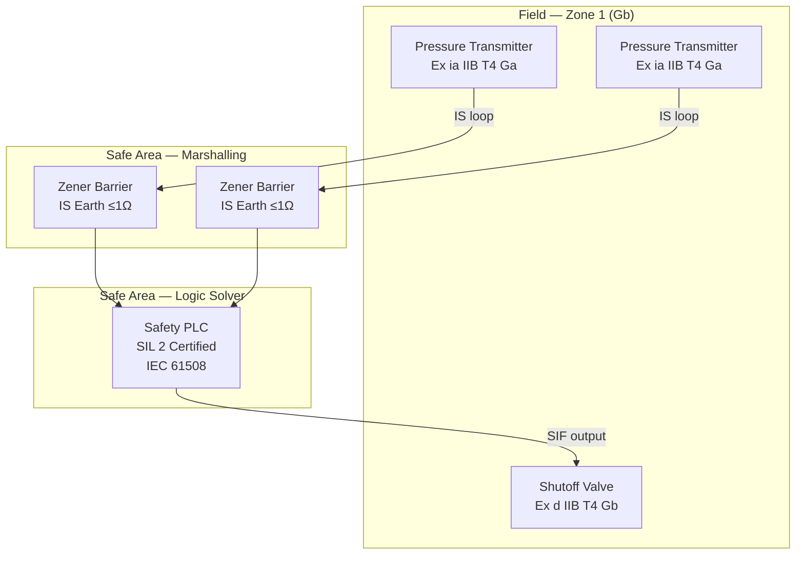

<div class="page-header">
  <span class="page-header__label">Scenario 07</span>
  <h1>Oil &amp; Gas Onshore Process Skid — ESD / F&amp;G / HIPPS</h1>
  <span class="badge badge--complete">Corpus Complete — Phase 11</span>
</div>

## Project Summary

| Field | Detail |
|-------|--------|
| **Application** | Onshore O&G process skid with Emergency Shutdown (ESD), Fire & Gas (F&G), and High Integrity Pressure Protection (HIPPS) |
| **Industry** | Petroleum / Oil and Gas — upstream or midstream onshore |
| **Safety standard** | IEC 61511 (SIS application) + IEC 61508 (foundation) |
| **Hazardous area** | Zone 1 / Zone 2 gas atmosphere — IEC 60079 series |
| **US installation** | NEC Art. 500–505 (hazardous locations) |

---

## Standard Stack

| Standard | Role |
|----------|------|
| **IEC 61511** | SIS application lifecycle — HAZOP through proof testing |
| **IEC 61508** | Logic solver qualification foundation |
| **IEC 60079-0** | Ex equipment marking and selection |
| **IEC 60079-10-1** | Hazardous area zone classification |
| **IEC 60079-11** | Intrinsic safety for field instruments |
| **IEC 60079-14** | Ex installation design and verification |
| **IEC 60079-17** | Ex inspection and maintenance |
| **IEC 60204-1** | Electrical equipment of the skid |
| **NEC Art. 500 / 504 / 505** | US hazardous location wiring |
| **NEC Art. 250** | Grounding and bonding |

---

## Design Workflow

### Phase 1 — Hazard Analysis and SIL Determination

```
Step 1: HAZOP
  - Identify process deviations (high pressure, low flow, leak)
  - Assign consequence severity to each deviation
  - Record IPLs (PRVs, operator response, BPCS) already in place

Step 2: LOPA (IEC 61511 §9)
  - For each intolerable consequence: calculate residual risk after IPLs
  - Determine if a SIF is required and what SIL target it must meet
  - SIL 1: PFDavg 0.1–0.01  |  SIL 2: 0.01–0.001  |  SIL 3: 0.001–0.0001

Step 3: Safety Requirements Specification (SRS)
  - Document each SIF: process demand, safe state, response time, SIL target
  - Specify logic solver inputs/outputs, field device requirements
```

### Phase 2 — SIS and Ex Equipment Design

```
Step 4: SIF Architecture Selection
  - SIL 1: 1oo1 often sufficient; verify PFDavg with reliability data
  - SIL 2: 1oo2 or 2oo3 voted — choose based on safe failure fraction (SFF)
  - SIL 3: 1oo2D or 2oo3 with HFT ≥ 2; logic solver must be IEC 61508 certified

Step 5: PFDavg Verification
  - Calculate PFDavg for each SIF architecture using supplier λSD/λSU data
  - Include proof test interval (PTI) — longer PTI increases PFDavg
  - Confirm PFDavg falls within required SIL band

Step 6: Zone Classification (IEC 60079-10-1)
  - Identify all release sources on the skid
  - Assign grade of release (continuous / primary / secondary)
  - Assess ventilation, determine zone extents
  - Produce classified area drawing

Step 7: Ex Equipment Selection (IEC 60079-0)
  - Match EPL to zone: Gb → Zone 1, Gc → Zone 2
  - Match gas group: IIA / IIB / IIC per process fluid
  - Match T-code: T-code max surface temp < autoignition temp of gas (with margin)
  - For IS field devices: select ia level for Zone 0/1

Step 8: IS Loop Design (IEC 60079-11)
  - For each IS field device: select zener barrier or galvanic isolator
  - Verify entity parameters: Uo ≤ Ui, Io ≤ Ii, Ci + Ccable ≤ Co, Li + Lcable ≤ Lo
  - Document IS loop calculation sheet for each loop
```

### Phase 3 — Installation and Commissioning

```
Step 9: Installation per IEC 60079-14
  - IS cables on separate trays / conduits from non-IS wiring
  - IS earth point: resistance ≤ 1 Ω (zener barrier circuits)
  - Equipotential bonding: all metallic structures bonded
  - Cable glands: Ex d certified, correct for cable type and gas group

Step 10: Initial Verification (IEC 60079-14 §6)
  - Verify all certificates are current and correct
  - Inspect flame paths (Ex d), IS earth resistance, entity compliance
  - Issue commissioning certificate

Step 11: SIS FAT / SAT (IEC 61511 §12)
  - Factory Acceptance Test: test each SIF end-to-end
  - Site Acceptance Test: repeat after installation, confirm response times
  - Witnessed proof test for each SIF before process start-up
```

---

## SIS Architecture Diagram



---

## Key Engineering Decisions

**Zener barrier vs. galvanic isolator for IS instruments:**
Zener barriers are lower cost but require a dedicated IS earth ≤1 Ω. If the IS earth cannot be guaranteed (old facility, multi-unit grounding), use galvanic isolators. Galvanic isolators also eliminate ground loops that cause 4–20 mA measurement errors in long cable runs.

**Zone 1 vs. Division 1 equipment on a US installation:**
Either classification system is legal under NEC. Zone (Art. 505) is preferred when sourcing ATEX/IECEx certified equipment — the marking system maps directly (Gb = Zone 1). Division (Art. 500) requires UL/FM listed equipment and conduit seals at every Ex d enclosure entry. For new installations, Zone is generally more efficient.

**SIL 2 logic solver selection:**
Avoid using a standard PLC for SIL 2 — it requires a full IEC 61508 assessment of the PLC hardware and software. Use a safety-certified logic solver (e.g., SIL 2 certified SIS controller) where the supplier provides the IEC 61508 certificate and safety manual.

---

<a href="{{ '/industries/petroleum/' | relative_url }}" class="card__link">See Petroleum / O&amp;G industry overlay &rarr;</a>

<a href="{{ '/tools/scenarios/' | relative_url }}" class="card__link">&larr; All scenarios</a>
