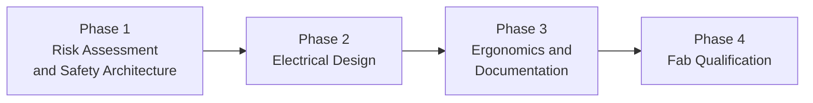
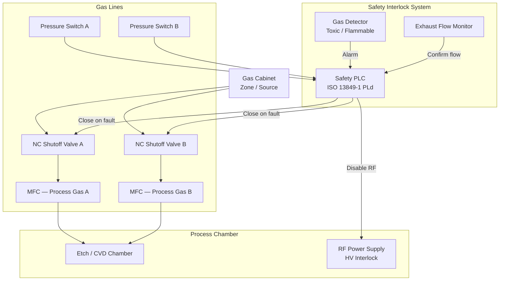
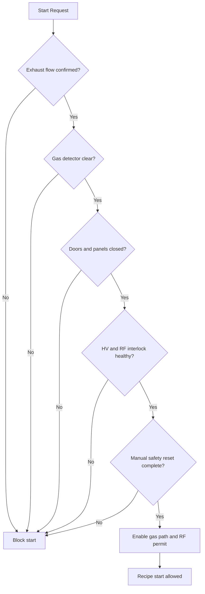
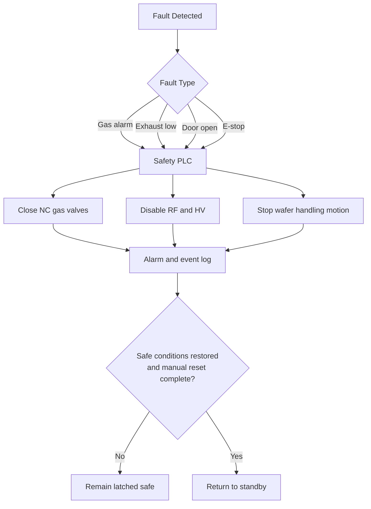
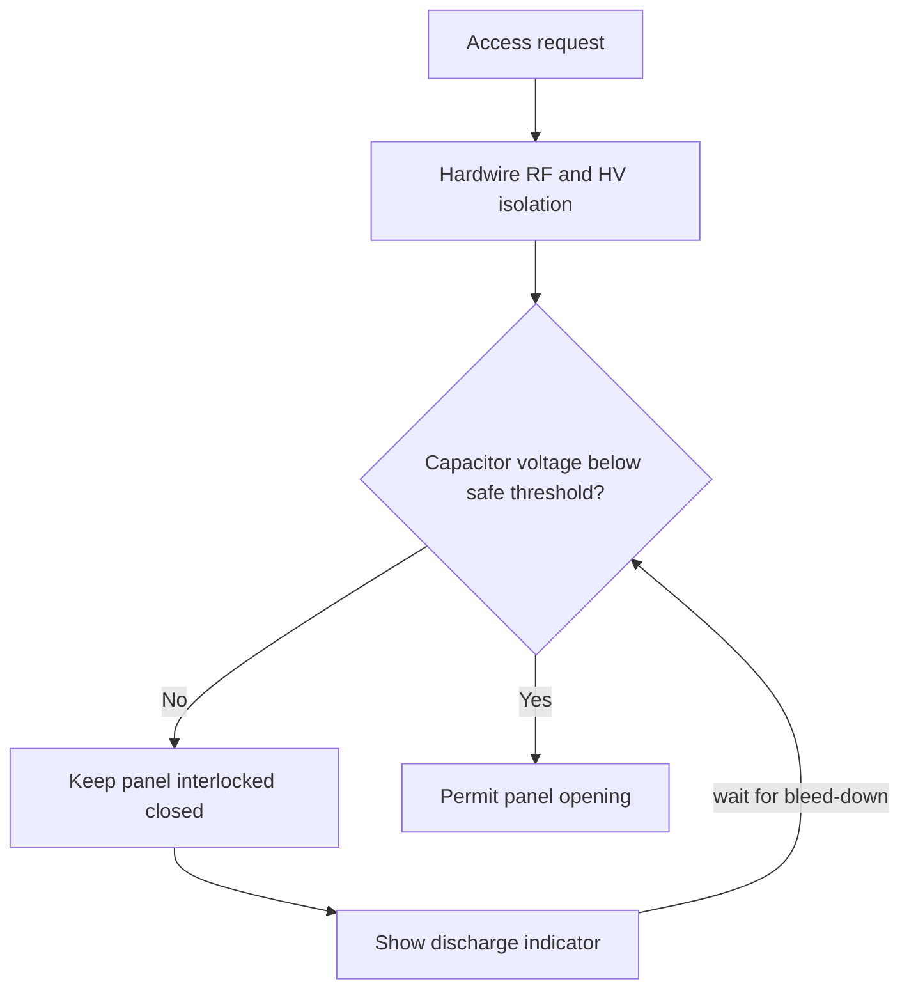
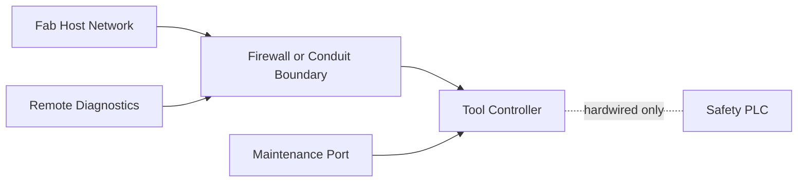

<div class="page-header">
  <span class="page-header__label">Scenario 08</span>
  <h1>Semiconductor Fab Tool — Etch / CVD Process Equipment</h1>
</div>

## Project Summary

| Field | Detail |
|-------|--------|
| **Application** | Etch or CVD process tool with flammable/toxic process gases, RF power supply, gas cabinet |
| **Industry** | Semiconductor manufacturing fab |
| **Primary standards** | SEMI S2 + S8 + S14 + IEC 60204-1 + ISO 12100 |
| **US electrical** | NFPA 79 + NEC + UL 508A |
| **Unique hazards** | Toxic/flammable process gases, RF energy, high-voltage plasma supply, cleanroom fire risk |

---

## Standard Stack

| Standard | Role |
|----------|------|
| **ISO 12100** | Risk assessment foundation |
| **ISO 13849-1** | Safety function performance level (PLd typical for tool interlocks) |
| **SEMI S2** | Equipment EH&S — electrical safety, LOTO, interlock design, chemical safety |
| **SEMI S8** | Ergonomics — control placement, maintenance access, force limits |
| **SEMI S14** | Fire risk assessment — gas shutoff, detection, suppression |
| **IEC 60204-1** | Machine electrical equipment design |
| **NFPA 79** | US machine electrical (required by most US fabs alongside IEC 60204-1) |
| **NEC** | US facility installation |
| **UL 508A** | US control panel listing |
| **IEC 62443** | Cybersecurity for fab host interface |

---

## Design Workflow Overview



## Design Workflow

### Phase 1 — Risk Assessment and Safety Architecture

```
Step 1: ISO 12100 Risk Assessment
  - Identify all hazard sources: RF, HV, flammable gas, toxic gas, hot surfaces,
    rotating parts, pinch points in wafer handling
  - Estimate risk (severity × probability) for each hazard
  - Determine required risk reduction — most personnel hazards target PLd

Step 2: Interlock Architecture (SEMI S2 + ISO 13849-1)
  - Map each hazard to a safety function (door interlock, E-stop, gas shutoff, HV interlock)
  - Select safety relay or safety PLC for interlocks independent of process control
  - Interlocks must fail to safe state (de-energize, close valves, stop motion)
  - Manual reset required after any safety interlock actuation

Step 3: SEMI S14 Fire Risk Assessment
  - List all flammable and pyrophoric gas lines
  - Identify ignition sources: electrical arcs, hot surfaces, RF sparking
  - Define fire scenarios: credible combination of fuel, ignition, oxidizer
  - Determine required: automatic shutoff, detection type, clean agent suppression
```

### Phase 2 — Electrical Design

```
Step 4: IEC 60204-1 / NFPA 79 Electrical Design
  - Power distribution: main disconnect, branch circuit protection, transformer isolation
  - Control circuit: 24 VDC safety bus separated from process control bus
  - E-stop circuit: dual-channel, NC contacts, monitored (Category 3 / PLd minimum)
  - All exposed conductive parts grounded; equipotential bonding per IEC 60204-1 §8

Step 5: High-Voltage Interlock Design (SEMI S2)
  - RF generator and bias supply: door interlock de-energizes RF before panel opens
  - Interlock: hardwired, not software-only; must be Category 3 minimum
  - Capacitor bank: discharge to <50 V within 5 s of HV isolation
     OR: discharge indicator + access interlock

Step 6: Gas Control System Design (SEMI S2 + S14)
  - All toxic and flammable gas lines: normally-closed pneumatic shutoff valves
  - Pressure switch per line: detects line break, triggers automatic shutoff
  - Exhaust flow monitoring: exhaust confirmed before any process gas flow allowed
  - Gas detector(s): concentration alarm triggers shutoff + exhaust increase + alert
```

### Phase 3 — Ergonomics and Documentation

```
Step 7: SEMI S8 Ergonomics Review
  - E-stop placement: 600–1400 mm from floor, ≤40 N actuation force
  - Operator panel: within normal visual field, no glare, text legible at 600 mm
  - Maintenance access: field-replaceable items accessible without removing unrelated parts
  - Minimum access clearance: 600 mm wide × 900 mm high

Step 8: Documentation Package
  - Electrical schematic (single-line + control circuit)
  - Safety interlock list (each interlock: type, input, output, safe state, reset)
  - LOTO procedure (one padlock per isolation point, posted on tool)
  - Hazardous materials inventory (gases, chemicals, quantities)
  - Fire risk assessment report (SEMI S14)
  - Installation and utilities requirements
```

### Phase 4 — Fab Qualification

```
Step 9: SEMI S2 EH&S Review
  - Fab EH&S team reviews documentation package
  - Tool walkthrough: verify all interlocks, LOTO points, labels, E-stops
  - Witness interlock functional tests: door interlocks, E-stop, gas shutoff on alarm

Step 10: IEC 62443 Cybersecurity Assessment (if networked)
  - Identify tool interfaces: fab host (SECS/GEM), remote diagnostics, maintenance port
  - Define security zone boundary and conduit to fab network
  - Apply appropriate SL-T (typically SL 1–2 for process tools)
  - Harden: disable unused ports, enforce authentication, log events
```

---

## Gas Delivery Control System



---

## Process Start Permissive Flow



## Fault Trip Sequence



## Key Engineering Decisions

**Capacitor discharge: 5-second rule vs. interlock approach (SEMI S2):**
The 5-second discharge is cleanest — use a bleed resistor across the capacitor bank. If the time constant makes 5 seconds impractical (large bank, high voltage), use a discharge indicator (a panel-mounted meter showing capacitor voltage) plus a proximity interlock that prevents panel opening until the meter reads <50 V. The meter must be readable without opening the panel.

**RF interlock vs. RF generator software disable:**
RF must be disabled by a hardwired interlock before any panel opens — not by the recipe software. The generator must have a hardware enable input that the safety relay drives. Recipe-level RF off is insufficient for personnel protection.

### HV Access Interlock Flow



**Clean agent suppression in the tool enclosure:**
If the SEMI S14 fire risk assessment determines suppression is required, use FM-200 or Novec 1230 (water is prohibited in cleanrooms). The suppression system must interface with the facility fire alarm — actuation must trigger a facility alarm even if the agent was discharged locally.

### Cybersecurity Zone Diagram



---

<a href="{{ '/industries/semiconductor/' | relative_url }}" class="card__link">See Semiconductor industry overlay &rarr;</a>

<a href="{{ '/tools/scenarios/semiconductor-equipment/' | relative_url }}" class="card__link">See 15-Standard Compliance Stack scenario &rarr;</a>

<a href="{{ '/tools/scenarios/' | relative_url }}" class="card__link">&larr; All scenarios</a>
