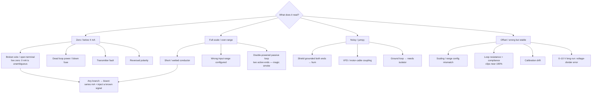

  Troubleshooting
  <h1>Troubleshooting Analog Signal Faults (4–20 mA / 0–10 V)</h1>
  
The reading you already have narrows the fault before the meter comes out — sort by whether the loop reads zero, full-scale, noisy, or offset, then bisect to find where it breaks.

> **Safety.** This is a reasoning aid, not a work instruction. Electrical work
> is performed de-energized and verified by qualified personnel under your
> site's LOTO procedures and the device manufacturer's manual. Measure, don't
> guess — every branch below ends at a measurement. Treat the enclosure as
> energized until proven otherwise.

## Overview

An analog loop reports a process value as a **current** (4–20 mA) or a
**voltage** (0–10 V), and the number it reports already tells you how it is
failing. A 4–20 mA loop is a series current circuit with a **live zero**: 4 mA
is 0% and 20 mA is 100%, so a reading *below* 4 mA is not a legitimate value —
it is the loop telling you it is broken or unpowered. That built-in
**broken-wire detection** is the diagnostic gift of live zero, and it is why
this page sorts by the reading first.

This page covers 4–20 mA current loops and 0–10 V signals at the fault-domain
level: what each symptom class implicates, the discriminating check, and the
fix direction. It routes to the [4–20 mA wiring guide]({{ '/design/wiring/analog-4-20ma/' | relative_url }})
and [0–10 V wiring guide]({{ '/design/wiring/analog-0-10v/' | relative_url }})
for the underlying wiring — it does not re-explain them.

## Start Here

Before touching a terminal, observe and record:

- **What is the reading, exactly?** Zero / below 4 mA, pinned full-scale,
  noisy and jumpy, or steady-but-wrong? This is the branch you take below.
- **Is it a new install or a working loop that changed?** A loop that never
  worked points at wiring, polarity, and active/passive mismatch; a loop that
  degraded points at connections, drift, or a new noise source nearby.
- **Does the reading correlate with anything?** A jump when a VFD starts, a
  drift with temperature, a shift with plant load — the correlation is half the
  diagnosis.
- **What does the loop sheet say?** Transmitter type (2-/3-/4-wire),
  active/passive designation, range, and supply — from the
  [loop sheet]({{ '/tools/templates/' | relative_url }}), not memory.

## Decision Tree

## Likely Causes

### Reads zero / below 4 mA — the path is broken or unpowered

- **Broken wire / open connection.** Dead 0 mA, often after cable work or on a
  vibrating machine. Series mA reads 0; continuity de-energized finds the open.
  This is the case live zero exists to catch.
- **Dead loop power.** 0 mA on a 2-wire device. Check loop voltage at the
  transmitter terminals and the loop-power fuse before condemning the device.
- **Transmitter fault.** Wiring proves good but still no signal. Inject a known
  mA at the card — if it reads the injection but not the transmitter, the fault
  is upstream. Do not assume until injection isolates it.
- **Reversed polarity.** Nothing on first energization; check polarity against
  the loop sheet and both manuals. The live-zero / broken-wire rationale is in
  the [4–20 mA wiring guide]({{ '/design/wiring/analog-4-20ma/' | relative_url }}).

### Reads full-scale / over-range — too much current or driven past span

- **Short or wetted conductor.** Pinned high, sometimes intermittent with
  moisture. Insulation resistance de-energized; inspect junction boxes for
  water, then dry, reseal, or replace.
- **Wrong input range configured.** Mis-scaled toward the rail on a device that
  reads fine elsewhere. Check the card range (0–20 vs 4–20 mA, ±10 vs 0–10 V)
  against the design.
- **Double-powered passive loop.** Nonsense reading or a damaged input — two
  active ends fighting. Check active/passive designation on **both** manuals;
  the rule is exactly one power source per loop. This is the **classic
  magic-smoke mistake**; the wiring guide's
  [Common Mistakes]({{ '/design/wiring/analog-4-20ma/' | relative_url }})
  covers the match in full.

### Reads noisy / jumpy — coupled interference or a ground problem

- **Shield grounded at both ends.** 50/60 Hz hum that tracks plant load. Land
  the analog shield at one end only — the opposite of the both-ends rule for VFD
  cable. Theory in [grounding &amp; bonding]({{ '/design/wiring/grounding-bonding/' | relative_url }}).
- **VFD / motor-cable coupling.** Noise that appears when a drive runs. Check
  for a shared duct or parallel run with VFD output; separate and cross at right
  angles per the
  [noise &amp; EMC mitigation guide]({{ '/design/wiring/emc-noise-mitigation/' | relative_url }}).
- **Ground loop needing an isolator.** Offset plus noise across a
  ground-potential difference — long runs, separate buildings. A loop isolator
  or isolated input card breaks the DC path instead of fighting it.

### Reads offset / wrong-but-stable — config, budget, or calibration

- **Scaling / range configuration.** Current is right, the HMI number is wrong.
  Check the engineering-unit scaling against the transmitter's ranged span —
  correct the scaling, not the loop.
- **Loop resistance exceeding compliance.** Reads correctly low but **clips near
  100%**. Check the loop-resistance budget at 20 mA — a resistance-budget
  failure, not a transmitter fault. Budget math in the
  [4–20 mA wiring guide]({{ '/design/wiring/analog-4-20ma/' | relative_url }}).
- **Calibration drift.** Steady zero or span error. Confirm with a known-input
  injection before recalibrating per the device manual.

### 0–10 V-specific — the long-run voltage divider

A voltage signal shares a reference and drops across conductor resistance, so
a long run behaves as an unintended **voltage divider** — the card sees less
than the source, reading low and load-dependent. *Check:* measure voltage at
the source versus at the card; a difference is the divider error. *Fix
direction:* shorten the run, increase gauge, or switch to 4–20 mA, which is
immune. The mechanism is covered in the
[0–10 V wiring guide]({{ '/design/wiring/analog-0-10v/' | relative_url }}).

## What to Measure

Bisect the loop — split it in half at each step so you know which side owns the
fault:

- **Series mA reading.** Break the loop and read current in series. This is the
  ground truth of what is actually flowing, independent of what the card
  displays.
- **Loop voltage.** Measure supply and terminal voltage to confirm the loop is
  powered and the transmitter has its minimum operating voltage (a vendor
  value — consult the manual).
- **Inject a known signal to bisect.** Inject a known mA (or V) **at the
  transmitter** and again **at the card**. If the card reads a local injection
  but not the field signal, the fault is in the wiring or transmitter; if it
  mis-reads even a local injection, suspect the card or its configuration. One
  move, loop split in half.
- **Resistance, de-energized.** Continuity and insulation resistance find
  opens, shorts, and wetted paths.

For the wiring context behind these checks, see the
[4–20 mA]({{ '/design/wiring/analog-4-20ma/' | relative_url }}) and
[0–10 V]({{ '/design/wiring/analog-0-10v/' | relative_url }}) guides; retain
results on the [loop sheets]({{ '/tools/templates/' | relative_url }}).
*Injection technique above is generally accepted practice — verify for your
installation.*

## Common Root Causes

| Symptom | Likely cause | First check | Typical fix |
|---|---|---|---|
| Reads 0 / below 4 mA | Broken wire or open terminal | Series mA = 0; continuity de-energized | Repair the open connection |
| Reads 0, 2-wire device | Dead loop power / blown fuse | Loop voltage at transmitter terminals | Restore supply, replace fuse |
| Reads 0, wiring proves good | Transmitter fault | Inject known mA at the card | Replace/service per device manual |
| Pinned full-scale | Short, wetted conductor, or wrong range | Insulation resistance; card range vs design | Reseal/replace; set range to match |
| Nonsense / damaged input | Double-powered passive loop | Active/passive on both manuals | One power source per loop |
| Noisy, hum tracks load | Shield grounded both ends | Shield landing points | Land analog shield one end only |
| Noise when a drive runs | VFD / motor-cable coupling | Cable routing vs VFD output | Separate runs, cross at 90° |
| Offset + noise across grounds | Ground loop | Voltage between ground refs | Add a loop isolator |
| Steady wrong number | Scaling / range config mismatch | EU scaling vs ranged span | Correct the scaling |
| Reads low, clips near 100% | Loop resistance > compliance | Loop-resistance budget at 20 mA | Heavier gauge / higher supply |
| 0–10 V reads low, load-dependent | Long-run voltage divider | Voltage at source vs card | Shorten run / go 4–20 mA |

## When It's Not What It Looks Like

- **A "transmitter fault" that is dead loop power.** A 2-wire device reading
  zero looks failed, but it is often just unpowered — check loop voltage before
  ordering a transmitter.
- **A "noisy transmitter" that is a shield grounded at both ends.** The hum
  tracks plant load: that is a ground loop through the screen, not the sensor.
- **A "reading" that is actually clipping.** A loop that reads plausibly low but
  never exceeds ~100% has run out of compliance voltage — a resistance-budget
  failure wearing a transmitter's clothes.
- **A stable "wrong value" that is correct current.** When the mA is right but
  the number is wrong, nothing in the field is broken — the controller scaling
  is. Inject and confirm the current before touching field wiring.
- **0–10 V that "drifts with the machine."** A voltage signal that sags under
  load is the wire's own resistance forming a divider, not a failing sensor.

## Related Pages

- [4–20 mA Current Loop Wiring]({{ '/design/wiring/analog-4-20ma/' | relative_url }}) — series-loop theory, live zero, active/passive match, resistance budget
- [0–10 V Analog Signal Wiring]({{ '/design/wiring/analog-0-10v/' | relative_url }}) — the voltage alternative and the long-run divider error
- [Panel Grounding &amp; Bonding]({{ '/design/wiring/grounding-bonding/' | relative_url }}) — shield-landing policy and the jobs of "ground"
- [Noise &amp; EMC Mitigation]({{ '/design/wiring/emc-noise-mitigation/' | relative_url }}) — separation classes and hardening the analog victim
- [Commissioning Templates]({{ '/tools/templates/' | relative_url }}) — loop sheets and loop-check records that retain your measurements
