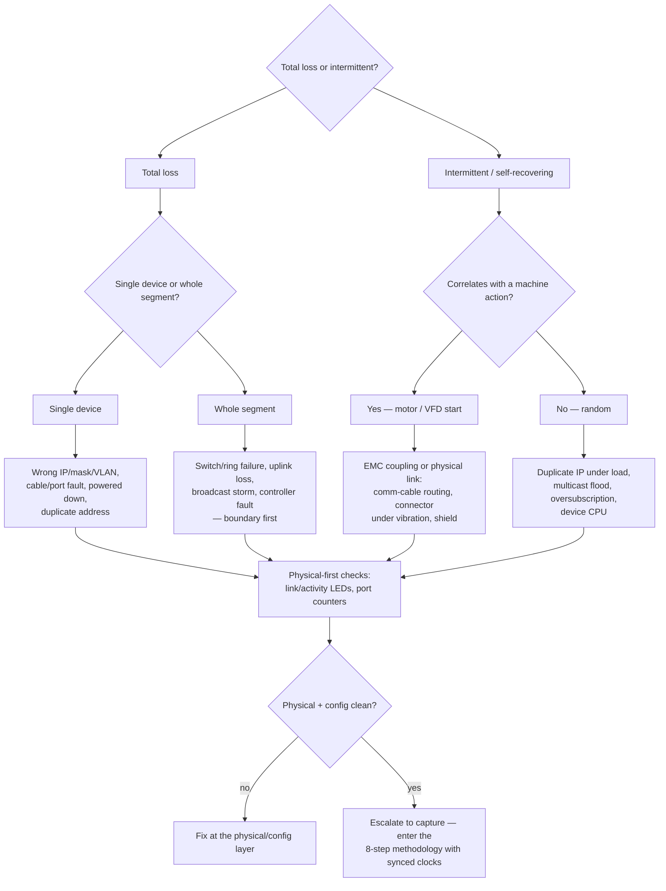

  Troubleshooting
  <h1>Troubleshooting Communication Dropouts</h1>
  
Three questions — total or intermittent, one device or a segment, tied to a machine action or random — sort a comms dropout before you ever open a capture. This page triages; the Communications section diagnoses.

> **Safety.** This is a reasoning aid, not a work instruction. Any inspection or
> cable work is performed by qualified personnel with the machine in a known
> safe state, under your site's procedures. Measure, don't guess. Opening a
> packet capture is not a substitute for checking the physical layer first.

## Overview

A "communication dropout" is a symptom, not a diagnosis, and the fastest way to
waste a shift is to open Wireshark before you know what question you are asking.
This page is a **triage front-end**: it sorts the symptom into the right
starting point and then hands off to the
[Network Diagnostics Methodology]({{ '/communications/wireshark-methodology/' | relative_url }}),
which owns the eight-step workflow — define the symptom, establish the boundary,
physical-first, capture with synchronized clocks, compare to a baseline, prove
root cause. It does **not** repeat that workflow here.

Use this page to answer three questions, run the quick physical-first checks,
then route into the Communications diagnostics section at the right place.

## Start Here

Observe and record before touching anything:

- **The precise symptom.** Which devices, when it started, how long each drop
  lasts, how often, in what operating mode, and whether it self-recovers. A
  precise statement is half the diagnosis — the methodology's
  [Step 1]({{ '/communications/wireshark-methodology/' | relative_url }}) is
  exactly this.
- **Recent changes.** Firmware, cable work, a new device added, a new drive
  commissioned — dropouts often date to a change.
- **Controller and switch messages.** PLC fault buffer, drive fault history,
  managed-switch logs — device diagnostics often timestamp the fault for you.

## Decision Tree

## Likely Causes

Grouped by the triage branch, each with the discriminating clue and where to
route — the diagnosis itself lives on the linked Communications pages.

### Total loss, single device

Wrong IP/mask/VLAN, a cable or port fault, a powered-down device, or a
duplicate address that knocked it off. *Clue:* everything else on the segment is
fine. *Route:* physical and configuration layers first — link LED, ping, ARP
entry, and switch port counters usually settle it. Enter the methodology at
[Steps 3–4]({{ '/communications/wireshark-methodology/' | relative_url }}).

### Total loss, whole segment

Switch or ring failure, uplink loss, a broadcast storm, or a controller fault.
*Clue:* many devices fail together. *Route:* **establish the boundary first** —
this is not a single-device problem. Switch logs and
[managed-switch counters]({{ '/communications/managed-switches/' | relative_url }})
lead; then broadcast/ARP filters in a capture.

### Intermittent, correlates with a motor/VFD start

EMC coupling or a physical link stressed by the machine — comm cable routed with
power, a connector loosened by vibration, a shield problem. *Clue:* the drop
lands with drive activity, and a marginal cable can pass for hours at low load
then fail when the machine runs. *Route:* the
[comm-cable wiring guide]({{ '/design/wiring/comm-cable/' | relative_url }}) for
routing and shielding, and the
[intermittent-I/O case study]({{ '/communications/case-study-intermittent-io/' | relative_url }})
for a worked example of exactly this pattern.

### Intermittent, random

Duplicate IP surfacing under traffic, multicast flooding, an oversubscribed
link, or an overloaded device CPU. *Clue:* no machine correlation. *Route:* a
ring-buffer capture spanning the event, compared against a baseline — the
methodology's [Steps 6–7]({{ '/communications/wireshark-methodology/' | relative_url }}),
with [packet-capture methods]({{ '/communications/packet-capture-methods/' | relative_url }})
for where to attach.

### Serial (RS-485) dropouts

Missing or wrong bus termination, biasing, stub length, or grounding — the
physical layer a laptop capture **cannot see at all**. *Route:* the
[RS-485 physical-layer page]({{ '/communications/rs485-physical-layer/' | relative_url }})
and scope practice, not Wireshark.

## What to Measure

Physical first, captures last — and all of it lives on the Communications
diagnostics pages, routed here rather than re-explained:

- **Link and activity LEDs.** Is the port linked, at the expected speed/duplex?
  A dark or flickering link ends many "network problems" at the connector.
- **Switch port counters.** CRC/alignment errors, discards, and link-flap count
  on the managed switch often reveal the fault with no capture at all — see
  [managed switches]({{ '/communications/managed-switches/' | relative_url }}).
- **The switched-network visibility reminder.** A laptop on a switched network
  sees only its own port's traffic plus broadcast/multicast — **not** unicast
  between two other devices. Diagnosing a drop between a PLC and a drive needs a
  mirror/SPAN port or a tap; see
  [packet-capture methods]({{ '/communications/packet-capture-methods/' | relative_url }}).
- **Packet capture.** Only after physical and config are clean — a ring buffer
  spanning the event, captured in the right place, with synchronized clocks and
  a baseline. This is the
  [full methodology]({{ '/communications/wireshark-methodology/' | relative_url }}),
  not an ad-hoc snapshot.

*The physical-first ordering above is generally accepted practice — verify for
your installation.*

## Common Root Causes

| Symptom | Likely cause | First check | Typical fix |
|---|---|---|---|
| One device drops in and out | Duplicate IP address | ARP entry; `arp` filter in a capture | Assign a unique address |
| Drop on a moving machine | Cable / connector under vibration | Seat connector; port CRC-error count | Re-terminate; secure the flex point |
| Drop lands with a drive start | VFD / motor-cable coupling | Comm-cable routing vs power/VFD | Reroute, separate, fix shielding |
| Serial frames garbled / lost | Bus termination (RS-485) | Termination value and count on the bus | Correct termination and biasing |
| "Everything is slow," random drops | Oversubscription | Port utilization; retransmissions vs baseline | Reduce load; segment the traffic |
| Whole segment down | Switch/ring/uplink failure | Boundary first; switch logs | Restore the switch/uplink/ring |

## When It's Not What It Looks Like

- **A "network problem" that is a connector.** A large share of dropouts end at
  a link LED or a loose M12 — none of which show up cleanly in a packet
  capture. Check physical before you capture.
- **A clean capture that "proves" the network is fine.** A capture in the wrong
  place, or one that missed the event window, proves nothing. A marginal cable
  passes traffic at low load and low temperature, then fails when the machine
  runs — Wireshark sees frames that arrived, not the electrical margin of the
  link. See
  [what Wireshark cannot replace]({{ '/communications/wireshark-methodology/' | relative_url }}).
- **A "switch fault" that is a duplicate IP.** When a device drops
  intermittently and blames the infrastructure, an address conflict surfacing
  under load is a common culprit — the ARP filter finds it faster than a switch
  swap.
- **A serial "dropout" invisible to your laptop.** Wireshark on a NIC cannot see
  an RS-485 bus at all. A serial problem needs a scope on the differential pair,
  not a packet capture — route to the
  [RS-485 physical-layer page]({{ '/communications/rs485-physical-layer/' | relative_url }}).

## Related Pages

- [Network Diagnostics Methodology (with Wireshark)]({{ '/communications/wireshark-methodology/' | relative_url }}) — the eight-step workflow this page routes into
- [Packet Capture Methods]({{ '/communications/packet-capture-methods/' | relative_url }}) — where and how to attach the analyzer on a switched network
- [Managed Switches]({{ '/communications/managed-switches/' | relative_url }}) — port counters, mirroring, and logs that often solve it without a capture
- [Case Study — Intermittent I/O]({{ '/communications/case-study-intermittent-io/' | relative_url }}) — a worked example of a machine-correlated dropout
- [RS-485 Physical Layer]({{ '/communications/rs485-physical-layer/' | relative_url }}) — termination, biasing, and scope practice when the bus is serial
- [Comm-Cable Wiring]({{ '/design/wiring/comm-cable/' | relative_url }}) — routing, separation, and shielding for the physical link
