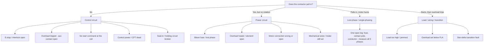

  Troubleshooting
  <h1>Troubleshooting: Motor Won't Start</h1>
  
One question splits the whole problem: does the contactor pull in? That boundary separates the control circuit from the power circuit before you measure anything.

> **Safety.** This is a reasoning aid, not a work instruction. Diagnosis and
> testing are performed by qualified personnel under your site's LOTO
> procedures. Rotate a shaft by hand only under confirmed zero-power,
> zero-stored-energy conditions. Measure across live power terminals only
> when trained and equipped to do so. Measure, don't guess.

## Overview

A motor fed by a starter — across-the-line contactor, star-delta, or soft
starter in bypass — that will not start is one of the most common field
calls, and one of the most over-diagnosed. The trap is chasing the motor
when the fault is in the control circuit, or chasing the control circuit when
a power leg is open.

This page is for **starter-driven and general** no-starts. If the motor is
fed by a variable frequency drive, the failure modes are different — start at
[Troubleshooting VFD Faults]({{ '/tools/troubleshooting/vfd-faults/' | relative_url }})
instead.

## Start Here

The pivot question does the heavy lifting: **does the contactor pull in when
you command a start?** Before touching anything, observe:

- **Does the contactor energize?** Listen/look for the pull-in. This alone
  splits control-side from power-side.
- **Any overload trip indicator?** A tripped overload explains both a
  no-pull-in and an open power leg.
- **Is control power present?** A dead CPT kills the whole control circuit.
- **Any sound from the motor?** A hum with no rotation is a specific
  power-side signature (single-phasing).
- **What changed?** New wiring, a recent trip, a jammed load, a brake that
  may not be releasing.

## Decision Tree

## Likely Causes

### Contactor does not pull in — control circuit
- **E-stop or interlock open** — any series stop, guard interlock, or safety
  relay contact breaks the string. Check each is satisfied and its contact
  actually closed, not merely reset at the operator station.
- **Overload tripped (aux contact open)** — the overload's auxiliary contact
  sits in the control string; a trip opens it. Looks like: ran, tripped,
  won't restart until reset (and won't reset until cooled). Check the trip
  indicator and aux-contact state.
- **No start command** — the pushbutton, PLC output, or run signal never
  reaches the coil. Check for the command at the control input, not at the
  HMI — an HMI "start" that never became a real output is a classic trap.
- **Control power absent** — a dead CPT, blown control fuse, or lost control
  supply. Nothing in the control circuit works. Route to
  [control power wiring]({{ '/design/wiring/control-power/' | relative_url }}).
- **Seal-in / holding circuit broken** — a start that won't hold: the
  contactor chatters or drops the instant the button is released, because the
  seal-in auxiliary contact or its wiring is open. See the seal-in topology
  in the [motor-starter wiring guide]({{ '/design/wiring/motor-starter/' | relative_url }}).

### Contactor pulls in but motor does not turn — power circuit
- **Blown fuse / lost phase on one line** — one of L1/L2/L3 missing
  downstream of the contactor. Motor hums, will not accelerate, trips
  overload. Check voltage on all three phases at the load side.
- **Overload heater / element open** — an open thermal element or burned
  heater breaks a power leg. Check continuity/voltage across each overload
  pole with the contactor closed.
- **Motor connection wrong or open** — a terminal-box wiring error (wrong
  star/delta arrangement) or an open winding lead. Check terminals against
  the nameplate diagram; check winding-resistance balance across phases.
- **Mechanical seizure or brake still set** — the motor is fine but the load
  or a failed-closed brake holds the shaft. Full current, overload trip. Try
  to rotate the shaft by hand under zero-power conditions; confirm the brake
  releases.

### Motor hums / single-phases
- **What it looks like** — loud hum, no rotation from rest, rapid heating,
  overload trip in seconds. Will sometimes run if spun by hand — a giveaway.
- **Cause** — a lost phase: one open fuse, one failed contact pole, one
  broken conductor or terminal. A three-phase motor cannot start on two
  phases.
- **Check** — measure all three phases at the motor terminals with the
  contactor closed; the missing leg is the fault.

### Trips overload on start
- **What it looks like** — begins to turn, accelerates slowly or partially,
  then trips; may restart and trip repeatedly.
- **Causes** — load too high or jammed; overload set below the motor's actual
  FLA; excessive start frequency without cooling; or a **star-delta
  transition** fault — bad transition timer, open transition contact, or
  too-early switchover dropping the motor off during acceleration.
- **Check** — overload setting against nameplate FLA; test the load
  free/unjammed; on star-delta, verify the transition sequence and timing —
  wiring in the [motor-starter guide]({{ '/design/wiring/motor-starter/' | relative_url }}).

## What to Measure

- **Voltage present at each stage** — supply L1/L2/L3 at the disconnect, the
  line side of the contactor, the load side of the contactor, and the motor
  terminals. Walking the voltage down these stages localizes an open to one
  segment.
- **Control voltage at the coil** — is the coil actually seeing pull-in
  voltage? No coil voltage sends you into the control-circuit branch; coil
  voltage present with no pull-in means a failed coil or contactor. See
  [control power wiring]({{ '/design/wiring/control-power/' | relative_url }}).
- **Overload state** — tripped or reset, and the aux-contact state. A tripped
  overload explains both a no-pull-in (aux open in the control string) and a
  power-leg open (element open) — check it early.

## Common Root Causes

| Symptom | Likely cause | First check | Typical fix |
|---|---|---|---|
| Contactor won't pull in | E-stop/interlock open in control string | Each interlock satisfied and closed? | Restore the open contact |
| Won't pull in, ran fine earlier | Overload tripped, aux contact open | Overload trip indicator | Find load cause, reset |
| Won't pull in, whole control dead | Control power / CPT / fuse | Voltage downstream of CPT | Restore control power |
| Starts but drops out on release | Seal-in / holding circuit broken | Seal-in aux contact and wiring | Repair seal-in path |
| Pulls in, no rotation | Lost phase / blown fuse | Voltage on all 3 phases at load side | Replace fuse / repair open leg |
| Pulls in, motor hums, heats | Single-phasing | Measure 3 phases at motor terminals | Restore the missing leg |
| Pulls in, full current, no turn | Mechanical seize / brake set | Rotate shaft by hand (zero power) | Free the load / release brake |
| Starts then trips overload | Load, undersized OL, or transition fault | OL setting vs FLA; star-delta timing | Correct sizing/load/transition |

## When It's Not What It Looks Like

- **A "dead motor" that is a tripped overload.** The motor and power circuit
  are fine; the overload's aux contact has opened the control string. Reads
  like a no-start; it's a control-side symptom of a power-side event —
  find *why* it tripped before resetting.
- **A "control fault" that is single-phasing.** The contactor pulls in
  perfectly, so the control side looks proven — but a lost phase downstream
  means no torque. Always confirm all three phases at the motor when the
  contactor closes but nothing turns.
- **A "motor failure" that is a brake that never released.** Full current and
  an overload trip look like a shorted or seized motor; the shaft is simply
  held by a failed-closed holding brake. Confirm brake release first.
- **A "start button fault" that is a broken seal-in.** The motor runs only
  while the button is held. The start command works; the holding contact or
  its wiring is open — a [motor-starter]({{ '/design/wiring/motor-starter/' | relative_url }})
  seal-in problem, not a bad pushbutton.
- **An overload trip that is really a transition fault.** On star-delta, a
  mistimed or open transition looks like an oversized load tripping the
  overload — but the motor was accelerating fine until the switchover.

## Related Pages

- [How to Wire a Motor Starter]({{ '/design/wiring/motor-starter/' | relative_url }}) — seal-in, overload, and star-delta transition wiring
- [Control Power Wiring]({{ '/design/wiring/control-power/' | relative_url }}) — CPT, control fusing, and the coil circuit
- [Troubleshooting VFD Faults]({{ '/tools/troubleshooting/vfd-faults/' | relative_url }}) — for drive-fed motors instead of starters
- [Motor Fundamentals]({{ '/fundamentals/motors/' | relative_url }}) — nameplate, FLA, slip, and torque behaviour
- [Motor Troubleshooting Decision Tree]({{ '/tools/troubleshooting/motors/' | relative_url }}) — the broader motor/drive routing page
