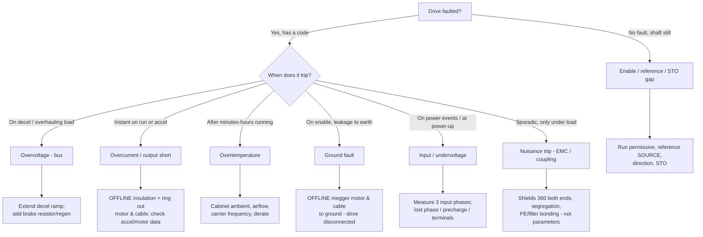

  Troubleshooting
  <h1>Troubleshooting VFD Faults</h1>
  
The fault code names which protection fired, not why. This page reasons from the fault category to the subsystem and the measurement that confirms it.

> **Safety.** This is a reasoning aid, not a work instruction. Diagnosis and
> testing are performed by qualified personnel under your site's LOTO
> procedures. VFD DC bus capacitors hold a lethal charge after power
> removal — observe the drive's marked discharge wait time before touching
> any terminal. Insulation testing is done **de-energized with the drive
> output disconnected**. Measure, don't guess.

## Overview

A variable frequency drive trips to protect itself and the motor. The
vendor's numeric code tells you *which* protection operated — it does not
tell you the *cause*, and no two manufacturers number them the same way.
Always read the actual code out of the drive against **your drive's own
fault-code list**; this page never reproduces one. What it does instead is
reason about the fault CATEGORIES those codes fall into, so the code becomes
a starting branch rather than an answer.

The most useful single question is not "what number?" but **"when does it
trip?"** — on decel, on accel, under steady load, after warm-up, or on
enable. The correlation with a phase of operation points at the subsystem
far more reliably than the code.

## Start Here

Before touching anything, observe and note:

- **The exact fault text/code** and any fault-history entries — from the
  drive, against the manufacturer's fault-code list.
- **When it trips** — power-up, enable, accel, steady run, decel, or coast.
- **Whether it correlates with drive/plant load** — clean when idle, faults
  when loaded is a distinct signature (see nuisance trips below).
- **What changed** — new cable pull, new motor, parameter edit, hot day,
  added a second drive nearby.
- **Whether the bus is discharged** before any hands-on work.

## Decision Tree

## Likely Causes

### Overvoltage (DC bus)
- **What it looks like** — trips on deceleration or with an overhauling load;
  high-inertia machine stopped too fast; never on a gentle coast.
- **Discriminating check** — extend the decel ramp; if the trip moves out or
  vanishes, regen energy had nowhere to go.
- **Fix direction** — lengthen decel, or add a braking resistor/chopper or
  regen unit sized for the duty. Braking-resistor wiring is covered in the
  [VFD wiring guide]({{ '/design/wiring/vfd/' | relative_url }}). A genuinely
  high input supply is a separate cause — measure it.

### Overcurrent / output short
- **What it looks like** — instant trip on run or accel; may trip the instant
  the output is enabled if a short is already present. Most likely of all
  categories to mean real damage.
- **Discriminating check** — with the drive locked out and the **output
  disconnected**, insulation-test and ring out motor and cable
  phase-to-phase and phase-to-ground.
- **Fix direction** — repair a real motor/cable fault before re-running. If
  insulation is good and it only trips on hard accel, the ramp is too
  aggressive or the motor data/control mode is wrong — hand back to the
  [commissioning workflow]({{ '/lifecycle/guides/vfd-commissioning/' | relative_url }}).

### Overtemperature
- **What it looks like** — trips after minutes to hours, worse in a hot
  cabinet or on a hot day; not tied to a specific motion event.
- **Discriminating check** — measure cabinet ambient; confirm filters, fans,
  and clearance; note the switching (carrier) frequency, which raises drive
  losses when increased.
- **Fix direction** — restore cooling, derate for ambient/altitude per the
  manual, or lower carrier frequency. Derating curves are vendor-specific.

### Ground fault
- **What it looks like** — trips on enable or accel; can read like an
  overcurrent, distinguished by the code and by leakage going to earth.
- **Discriminating check** — **OFFLINE** insulation test of motor and cable
  to ground, drive output disconnected. This is the classic
  megger-through-the-drive trap — see
  [why you never megger through a connected drive]({{ '/design/wiring/vfd/' | relative_url }}).
- **Fix direction** — repair motor/cable insulation. A long, poorly-shielded
  cable can raise capacitive earth-leakage enough to nuisance-trip a
  sensitive detector even with sound insulation — that shades into EMC below.

### Input / undervoltage
- **What it looks like** — trips on power events, sags, or at power-up; or a
  bus that never charges.
- **Discriminating check** — measure the three input phases under load; look
  for a lost phase, a loose input terminal, or a failed precharge (relay
  clicks but the drive never comes ready).
- **Fix direction** — correct the supply, tighten terminations, service the
  precharge circuit. A single lost input phase both undervolts the bus and
  overheats the remaining path — treat as urgent.

### Motor won't run — but no fault is shown
- **What it looks like** — "Ready" or "Stopped", no fault, no output.
- **Discriminating check** — walk the enable chain: run/enable input, the
  active reference **SOURCE** (keypad vs terminal vs fieldbus — a drive
  commanded from the wrong source sits at zero), direction, and STO. An
  unsatisfied STO holds the output off, sometimes with only a status bit.
- **Fix direction** — satisfy the missing permissive; select the intended
  reference source; confirm STO is de-asserted through the safety function.

### Nuisance trips under load (EMC / coupling)
- **What it looks like** — clean at commissioning (drive idle), then trips or
  corrupts signals once the plant loads up; correlated with drive state, not
  a mechanical event.
- **Discriminating check** — scope the quiet plant, then the running plant;
  the difference *is* the coupling. Check shield terminations, segregation,
  and bonding.
- **Fix direction** — fix the installation, not the parameters. This is
  [EMC-mitigation]({{ '/design/wiring/emc-noise-mitigation/' | relative_url }})
  territory, worked end-to-end in the
  [intermittent I/O case study]({{ '/communications/case-study-intermittent-io/' | relative_url }}).

## What to Measure

Every category resolves to a measurement, not a guess:

- **DC bus voltage** — from the drive readout, or across the marked DC
  terminals after the discharge wait time; separates over- from
  under-voltage.
- **Insulation resistance — OFFLINE, drive output disconnected** — motor and
  cable, phase-to-phase and phase-to-ground. The one non-negotiable rule;
  the wiring reasoning is in the
  [VFD wiring guide]({{ '/design/wiring/vfd/' | relative_url }}) and
  [panel grounding & bonding]({{ '/design/wiring/grounding-bonding/' | relative_url }}).
- **Output phase-current balance** — the three output currents should be
  roughly equal; a large imbalance points at a motor/cable fault or a lost
  output phase.
- **Thermal** — cabinet ambient, airflow, heatsink temperature; correlate
  with run time.
- **Coupling / noise** — when trips track drive load, capture analog and
  comms baselines idle vs loaded; the oscilloscope practice is on the
  [RS-485 physical layer page]({{ '/communications/rs485-physical-layer/' | relative_url }}),
  and the [Wireshark methodology]({{ '/communications/wireshark-methodology/' | relative_url }}) covers network symptoms.

## Common Root Causes

| Symptom | Likely cause | First check | Typical fix |
|---|---|---|---|
| Trips on decel | Regen bus overvoltage; decel too fast | Extend decel ramp — does it clear? | Longer decel or brake resistor/regen |
| Instant trip on run/accel | Output short / motor-cable fault, or accel too aggressive | OFFLINE insulation + ring out | Repair insulation; soften accel/fix motor data |
| Trips after warm-up | Cooling / ambient / carrier frequency | Cabinet ambient + airflow | Restore cooling, derate, lower carrier |
| Trips on enable, leakage to earth | Ground fault in motor or cable | OFFLINE megger to ground | Repair motor/cable insulation |
| Trips on power events / won't charge | Supply, lost input phase, precharge | Measure 3 input phases | Correct supply; service precharge/terminals |
| Ready but shaft still, no fault | Enable/reference-source/direction/STO gap | Walk the permissive chain | Satisfy permissive; select right reference |
| Sporadic trips only under load | EMC coupling, shield/bonding/segregation | Scope idle vs loaded | Fix shielding/segregation/bonding |

## When It's Not What It Looks Like

- **A ground fault that is really EMC.** A sound but long, poorly-terminated
  cable can leak enough capacitive current to trip a sensitive ground-fault
  detector. Insulation tests clean; the trip is a shielding/termination
  problem, not a damaged motor.
- **An "overcurrent" that is a lost input phase.** Single-phasing the input
  starves the bus and stresses the output; the drive may report overcurrent
  or undervoltage depending on where the protection catches it. Measure all
  three input phases before condemning the output stage.
- **A "dead" drive that is a permissive.** No fault, no motion reads like a
  hardware failure but is usually an open run permissive, the wrong reference
  source, or an unsatisfied STO — no protection has tripped at all.
- **A decel overvoltage blamed on the supply.** The bus is high because the
  load is regenerating, not because the mains are high — confirm by ramp,
  then measure the supply.
- **The fault that only appears months later.** Long unfiltered motor leads
  double the voltage stress at the motor terminals; the winding fails later
  and the drive gets blamed. The remedy lives in the
  [VFD wiring guide]({{ '/design/wiring/vfd/' | relative_url }}).

## Related Pages

- [How to Wire a VFD]({{ '/design/wiring/vfd/' | relative_url }}) — the wiring behind most of these faults, and the megger warning
- [Noise & EMC Mitigation]({{ '/design/wiring/emc-noise-mitigation/' | relative_url }}) — segregation, shielding, and coupling
- [Panel Grounding & Bonding]({{ '/design/wiring/grounding-bonding/' | relative_url }}) — PE and shield termination practice
- [VFD Commissioning Workflow]({{ '/lifecycle/guides/vfd-commissioning/' | relative_url }}) — motor data, first power-up, functional checks
- [Motor Troubleshooting Decision Tree]({{ '/tools/troubleshooting/motors/' | relative_url }}) — the broader motor/drive routing page
- [Troubleshooting: Motor Won't Start]({{ '/tools/troubleshooting/motor-wont-start/' | relative_url }}) — for starter-driven (non-VFD) motors
- [Intermittent I/O case study]({{ '/communications/case-study-intermittent-io/' | relative_url }}) — a noise-coupling investigation end to end
